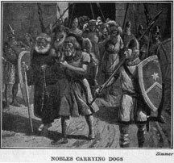

  
[Intangible Textual Heritage](../../index)  [Miscellaneous](../index) 
[Index](index)  [Previous](fmma23)  [Next](fmma25) 

------------------------------------------------------------------------

*Famous Men of the Middle Ages*, by John Henry Haaren, \[1904\], at
Intangible Textual Heritage

------------------------------------------------------------------------

FREDERICK BARBAROSSA

EMPEROR FROM 1152-1190

 

I

 

FREDERICK I was one of the most famous of German emperors. He was a
tall, stalwart man of majestic appearance. He had a long red beard and
so the people called him Barbarossa, or Red-Beard. He came to the throne
in 1152.

 

At that time the province of Lombardy in northern Italy was a part of
the German empire.

 

In 1158 Milan, the chief city of Lombardy, revolted. Then over the Alps
came an army of a hundred thousand German soldiers, with Frederick at
their head. After a long siege the city surrendered.

 

But soon it revolted again. The emperor besieged it once more and once
more it surrendered. Its fortifications were destroyed and many of its
buildings ruined.

 

But even then the spirit of the Lombards was not broken. Milan and the
other cities of Lombardy united in a league and defied the emperor. He
called upon the German dukes to bring their men to his aid. All
responded except Henry the Lion, duke of Saxony, Frederick's cousin,
whom he had made duke of Bavaria also. Frederick is said to have knelt
and implored Henry to do his duty, but in vain.

 

 

 

In his campaign against the Lombards Frederick was unsuccessful. His
army was completely defeated and he was compelled to grant freedom to
the cities of Lombardy.  Everybody blamed Henry the Lion. The other
dukes charged him with treason and he was summoned to appear before a
meeting of the nobles. He failed to come and the nobles thereupon
declared him guilty and took from him everything that he had, except the
lands he had inherited from his father.

 

Frederick now devoted himself to making Germany a united nation. Two of
his nobles had been quarreling for a long time and as a punishment for
their conduct each was condemned, with ten of his counts and barons, to
carry dogs on his shoulders from one country to another.

 

Frederick finally succeeded in keeping the nobles in the different
provinces of Germany at peace with one another, and persuaded them to
work together for the good of the whole empire. He had no more trouble
with them and for many years his reign was peaceful and prosperous.

 

II

 

AFTER the Christians had held Jerusalem for eighty-eight years, it was
recaptured by the Moslems under the lead of the famous Saladin, in the
year 1187.  There was much excitement in Christendom, and the Pope
proclaimed another Crusade.

 

Frederick immediately raised an army of Crusaders in the German Empire
and with one hundred and fifty thousand men started for Palestine.

 

He marched into Asia Minor, attacked the Moslem forces, and defeated
them in two great battles.

 

But before the brave old warrior reached the Holy Land his career was
suddenly brought to an end. One day his army was crossing a small bridge
over a river in Asia Minor. At a moment when the bridge was crowded with
troops Frederick rode up rapidly.

 

 

 

He was impatient to join his son, who was leading the advance guard; and
when he found that he could not cross immediately by the bridge, he
plunged into the river to swim his horse across. Both horse and rider
were swept away by the current. Barbarossa's heavy armor made him
helpless and he was drowned. His body was recovered and buried at
Antioch.

 

Barbarossa was so much loved by his people that it was said, "Germany
and Frederick Barbarossa are one in the hearts of the Germans." His
death caused the greatest grief among the German Crusaders. They had now
little heart to fight the infidels and most of them at once returned to
Germany.

 

In the Empire the dead hero was long mourned and for many years the
peasants believed that Frederick was not really dead, but was asleep in
a cave in the mountains of Germany, with his gallant knights around
him.  He was supposed to be sitting in his chair of state, with the
crown upon his head, his eyes half-closed in slumber, his beard as white
as snow and so long that it reached the ground.

 

"When the ravens cease to fly round the mountain," said the legend,
"Barbarossa shall awake and restore Germany to its ancient greatness."

 

 

------------------------------------------------------------------------

[Next: Henry The Second 1154-1189, and His Sons 1189-1216](fmma25)
