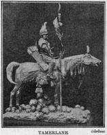

  
[Intangible Textual Heritage](../../index)  [Miscellaneous](../index.md) 
[Index](index)  [Previous](fmma30)  [Next](fmma32.md) 

------------------------------------------------------------------------

*Famous Men of the Middle Ages*, by John Henry Haaren, \[1904\], at
Intangible Textual Heritage

------------------------------------------------------------------------

TAMERLANE

LIVED FROM 1333-1405

 

I

 

TAMERLANE was the son of the chief of a Mongolian tribe in Central Asia.
His real name was Timour, but as he was lamed in battle when a youth he
was generally called Timour the Lame, and this name was gradually
changed to Tamerlane.  He was born in 1333, so that he lived in the time
of the English king, Edward III, when the Black Prince was winning his
victories over the French. He was a descendant of a celebrated Tatar
soldier, Genghis Khan, who conquered Persia, China, and other countries
of Asia. When twenty-four years old Tamerlane became the head of his
tribe, and in a few years he made himself the leader of the whole
Mongolian race.

 

He was a tall, stern-looking man, of great strength, and, although lame
in his right leg, could ride a spirited horse at full gallop and do all
the work of an active soldier. He was as brave as a lion--and as cruel.

 

 

 

He chose the ancient city of Samarcand, in Turkistan, for his capital;
and here he built a beautiful marble palace, where he lived in the
greatest luxury.

 

After he had enjoyed for some time the honors which fell to him as chief
ruler of the Mongolians, he began to desire further conquests. He
determined to make himself master of all the countries of Central Asia.

 

"As there is but one God in heaven," he said, "there ought to be but one
ruler on the earth."

 

So he gathered an immense army from all parts of his dominion, and for
weeks his subjects were busy making preparations for war. At length he
started for Persia in command of a splendid army. After gaining some
brilliant victories he forced the Persian king to flee from his capital.

 

All the rich country belonging to Persia, from the Tigris to the
Euphrates, submitted to the Mongolian conqueror.

 

Tamerlane celebrated his Persian conquest by magnificent festivities
which continued for a week. Then orders were given to march into the
great Tatar empire of the North. Here Tamerlane was victorious over the
principal chiefs and made them his vassals. In pursuing the Tatars he
entered Russia and sacked and burned some of the Russian cities. He did
not, however, continue his invasion of this country, but turned in the
direction of India.

 

At last his army stood before the city of Delhi, and after a fierce
assault forced it to surrender. Other cities of India were taken and the
authority of Tamerlane was established over a large extent of the
country.

 

II

 

BAJAZET, sultan of Turkey, now determined to stop Tamerlane's eastward
march.

 

News of this reached the conqueror's ears. Leaving India, he marched to
meet the sultan. Bajazet was a famous warrior. He was so rapid in his
movements in war that he was called "the lightning."

 

Tamerlane entered the sultan's dominions and devastated them. He stormed
Bagdad, and after capturing the place killed thousands of the
inhabitants.

 

At length the rivals and their armies faced each other. A great battle
followed. It raged four or five hours and then the Turks were totally
defeated. Bajazet was captured.

 

Tamerlane then ordered a great iron cage to be made and forced the
sultan to enter it. The prisoner was chained to the iron bars of the
cage and was thus exhibited to the Mongol soldiers, who taunted him as
he was carried along the lines.

 

As the army marched from place to place the sultan in his cage was shown
to the people. How long the fallen monarch had to bear this humiliating
punishment is not known.

 

Tamerlane's dominions now embraced a large part of Asia. He retired to
his palace at Samarcand and for several weeks indulged in festivities.

 

He could not, however, long be content away from the field of battle. So
he made up his mind to invade the Empire of China. At the head of a
great army of two hundred thousand soldiers he marched from the city of
Samarcand towards China. He had gone about three hundred miles on the
way when, in February, 1405, he was taken sick and died. His army was
disbanded and all thought of invading China was given up.

 

Thus passed away one of the greatest conquerors of the Middle Ages. He
was a soldier of genius but he cannot be called a truly great man. His
vast empire speedily fell to pieces after his death. Since his day there
has been no leader like him in that part of Asia.

 

 

 

------------------------------------------------------------------------

[Next: Henry V. King From 1413-1422](fmma32.md)
