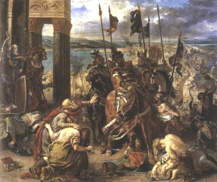

  
[Intangible Textual Heritage](../../index)  [Miscellaneous](../index.md) 

------------------------------------------------------------------------

<table width="75%">
<colgroup>
<col style="width: 50%" />
<col style="width: 50%" />
</colgroup>
<tbody>
<tr class="odd">
<td width="50%" data-valign="TOP"></td>
<td width="50%" data-valign="CENTER"><h1 id="famous-men-of-the-middle-ages" data-align="CENTER">Famous Men of the Middle Ages</h1>
<h2 id="by-john-henry-haaren" data-align="CENTER">by John Henry Haaren</h2>
<h4 id="section" data-align="CENTER">[1904]</h4></td>
</tr>
</tbody>
</table>

------------------------------------------------------------------------

[Contents](#contents)    [Start Reading](fmma00.md)

------------------------------------------------------------------------

 [Title Page](fmma00.md)  
[Preface](fmma01.md)  
[Contents](fmma02.md)  
[Introduction](fmma03.md)  
[The Nibelungs](fmma04.md)  
[Alaric The Visigoth. King From 394-410 A.D](fmma05.md)  
[Attila The Hun. King From 434-453 A.D.](fmma06.md)  
[Genseric The Vandal. King From 427-477 A.D.](fmma07.md)  
[Theodoric The Ostrogoth. King From 475-526 A.D.](fmma08.md)  
[Clovis. King From 481-511 A.D.](fmma09.md)  
[Justinian The Great. Emperor From 527-565 A.D.](fmma10.md)  
[Mohammed. Lived from 570-632 A.D.](fmma11.md)  
[Charles Martel, 714-741 A.D. And Pepin, 741-768 A.D.](fmma12.md)  
[Charlemagne. King From 768-814 A.D.](fmma13.md)  
[Harun-al-Rashid. Caliph From 786-809 A.D.](fmma14.md)  
[Egbert. King From 802-837 A.D.](fmma15.md)  
[Rollo The Viking. Died 931 A.D.](fmma16.md)  
[Alfred The Great. King From 871-901 A.D.](fmma17.md)  
[Henry The Fowler. King From 919-936 A.D.](fmma18.md)  
[Canute The Great. King From 1014-1035](fmma19.md)  
[The Cid](fmma20.md)  
[Edward The Confessor. King From 1042-1066](fmma21.md)  
[William The Conqueror. King From 1066-1087](fmma22.md)  
[Peter The Hermit. About 1050-1115](fmma23.md)  
[Frederick Barbarossa. Emperor From 1152-1190](fmma24.md)  
[Henry The Second 1154-1189, and His Sons 1189-1216](fmma25.md)  
[Louis The Ninth. King From 1226-1270](fmma26.md)  
[Robert Bruce. King From 1306-1329](fmma27.md)  
[Marco Polo. Lived From 1254-1324](fmma28.md)  
[Edward The Black Prince. Lived From 1330-1376](fmma29.md)  
[William Tell and Arnold Von Winkelried](fmma30.md)  
[Tamerlane. Lived From 1333-1405](fmma31.md)  
[Henry V. King From 1413-1422](fmma32.md)  
[Joan of Arc. Lived From 1412-1431](fmma33.md)  
[Gutenberg. Lived From 1400-1468](fmma34.md)  
[Warwick The Kingmaker. Lived From 1428-1471](fmma35.md)  
