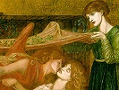

  
[Intangible Textual Heritage](../../index)  [Miscellaneous](../index.md) 
[Index](index)  [Previous](gd09)  [Next](gd11.md) 

------------------------------------------------------------------------

[Buy this Book at
Amazon.com](https://www.amazon.com/exec/obidos/ASIN/0252068823/internetsacredte.md)

------------------------------------------------------------------------

[  
*The Grateful Dead*, by Gordon Hall Gerould, \[1908\], at Intangible
Textual Heritage](index.md)

------------------------------------------------------------------------

p. 162

### CHAPTER VIII.

#### CONCLUSION.

IN considering the general development and relations of *The Grateful
Dead*, to which we must now turn, it is proper to inquire first of all
as to its origin. Hitherto the existence of the story-theme as such has
been taken well nigh for granted, though the discussion of variants in
simple form necessitated some reference [1](#fn_243.md) to the point of separation between the
*märchen* and whatever beliefs or social customs lie beyond. Now that
the tale has been followed through its various modifications and has
been proved by a systematic study of its forms to be, if I may use the
expression, a living organism, the debateable land outside can be
entered with measurable security.

There can be no doubt that *The Grateful Dead* as a theme is based upon
belief's about the sacred duty of burial and upon the customs incident
to withholding burial for the sake of revenge or recompense. To study
these phenomena in detail is not necessary to the scheme of this book,
but belongs rather to the province of primitive religion and law. It is
sufficient for our purpose to show the nature and extent of such
observances and beliefs for the sake of the light which they may throw
on the genesis of the tale itself.

The belief that no obligation is more binding on man than that he pay
proper respect to the dead is as old as civilization itself. Indeed, it
probably antedates what

p. 163

we ordinarily call civilization, since otherwise it could not well be
found so widely distributed over the earth in historical times. It
evidently rests upon the notion that the soul, when separated from the
body, could find no repose. [1](#fn_244.md)
Herodotus tells [2](#fn_245.md) of the Egyptian
law, which permitted a man to give his father's body in pledge, with the
proviso that if he failed to repay the loan neither he nor any of his
kin could be buried at all. The story, also related by Herodotus, [3](#fn_246.md) of Rampsinit and the thief, which turns
on the latter's successful attempt to rescue his brother's body,
illustrates again the value that the Egyptians set upon burial. Their
notion seems to have been that the more honour paid the dead, the more
bearable would be their lot, though it was regarded as unenviable at
best. [4](#fn_247.md) Among the Magi of Persia,
though both burial and burning were prohibited because of the sanctity
of earth and fire, the bodies of the dead were cared for according to
the strictest of codes, being left to the sun and air on elevated
structures. [5](#fn_248.md) In India the
*Rig-Veda* [6](#fn_249.md) bears witness to
similar carefulness in the performance of this sacred duty.

In classical times belief in the necessity of proper burial was
widespread. Patroclus, it will be remembered, appears to his friend
Achilles, and admonishes him that he should not neglect the dead, at the
same time giving a dire picture of the state of the unburied. [7](#fn_250.md) Pausanias speaks [8](#fn_251.md) of the conduct of Lysander as
reprehensible in not burying the bodies of Philocles and the four
thousand slain at Aegospotami, saying that the Athenians did as

p. 164

much for the Medes after Marathon, and even Xerxes for the
Lacedaemonians after Thermopylae. The story told by Cicero [1](#fn_252.md) of Simonides gives definite proof of the
concrete nature of the reverential feeling among both Greeks and Romans.
Suetonius in his life of Caligula relates that when the emperor's body
was left half burned and unburied, ghosts filled the palace and garden.

An example of the mediaeval belief is found in the Middle High German
*Kudrun*, written at the end of the twelfth century or the beginning of
the thirteenth.

"Daz hâst wol gerâten," sprach der von Sturmlant.  
"jâ sol man verkoufen ir ros und ir gewant,  
die dâ ligent tôte, daz man der armen diete  
nâch ir lîbes ende von ir guote disen frumen biete."  
  Dô sprach der degen Îrolt: "sol man ouch die begraben,  
die uns den schaden tâten, od sol man si die raben  
und die wilden wolve ûf dem wérde lâzen niezen?"  
dô rieten daz die wîsen, daz sie der einen ligen niht enliezen. [2](#fn_253.md)

The *Annamite* tale cited in the third chapter [3](#fn_254.md) and *Servian VI.*, likewise summarized
in connection with variants having the story-theme in simple form, [4](#fn_255.md) bear witness to the effect that the
widespread belief has had upon folk-tales now in circulation. The
connection of these two tales with the *märchen* as such is so vague
that they serve the end of illustrating its growth from popular belief
rather than the relationship of one form to another. So also the story
from Brittany, printed by Sébillot, [5](#fn_256.md) which tells how a ghost came to workmen
in a mill demanding Christian interment for its body then buried under
the foundations, serves the same end, though no reward is mentioned.
Sometimes the neglect of burial by a person brings unpleasant results to
him, as is witnessed by a tale from Guernsey. [6](#fn_257.md) A fisherman neglected

p. 165

to bury a body which he encountered on the coast, and, when he reached
his home, found the ghost awaiting him. An Indian tale illustrates the
belief that the dead become vampires when funeral rites are not
performed. [1](#fn_258.md)

In most versions of *The Grateful Dead* a corpse is left unburied either
because creditors remain unpaid or the surviving relatives cannot pay
for Christian burial. From sixteenth century Scotland we have evidence
that the latter trait is based on actual custom. Sir David Lyndesaye, in
*The Monarche*, while describing the exactions of the clergy, says:

Quhen he hes all, than, vnder his cure,  
And Father and Mother boith ar dede,  
Beg mon the babis, without remede:  
They hauld the Corps at the kirk style;  
And thare it moste remane ane quhyle,  
Tyll thay gett sufficient souerte  
For thare kirk rycht and dewite. [2](#fn_259.md)

This evidence for the widespread belief in the pious duty of burial and
for the custom of withholding burial in cases where the dead man was
poor, though it might easily be increased in bulk, makes very clear at
least two matters. The tale of *The Grateful Dead* might have arisen
almost anywhere and in almost any age since the time of the Egyptians.
Again, when once it had been formed, it was likely to be reinforced or
changed by the beliefs and customs prevalent in the lands to which it
came.

The first matter at once suggests the question as to whether, after all,
the *märchen* has not been more than once discovered by the imagination
of story-tellers,—whether it has not sprung up again and again in
different parts of the world like different botanical species,

p. 166

instead of being a single plant which has propagated itself through many
centuries. In spite of the evident possibility that such sporadic
development might have taken place, I cannot believe that it happened
so. If we had to do with some vaguely outlined myth in which only the
underlying idea was the same in the several groups of variants, and if
this vague tale were narrated among peoples of absolutely no kinship to
one another, say by the Indians of North America and the Zulus, one
could have no reasonable doubt that similar conditions had produced
similar tales. Such stories exist in numbers sufficient to render
untenable the old hypothesis of Oriental origins in anything like the
form in which it was held by Benfey or even Cosquin.

In cases like that of *The Grateful Dead*, however, the matter is
entirely different. The theme is comparatively a complicated one, and it
is found only in lands whose inhabitants are connected either by blood
or by social and political intercourse. [1](#fn_260.md) It has preserved its integrity for
nearly a score of centuries, though suffering many changes of details,
and a variety of combinations with other themes. To my mind such an
involved relationship as that worked out in the preceding chapters
proves conclusively that the story is one, that the connection between
variants is more than fortuitous. Inductive logic makes the belief
inevitable. Any other theory would involve us in a bewildering net of
contradictions, from which escape could be found only in the avowal that
nothing whatever can be known about narrative development.

If the seemingly inevitable conclusion be accepted that *The Grateful
Dead* is an organism with a life history of its own, the question at
once suggests itself as to when and where it came into being. As to its

p. 167

ultimate origin, however, only a very imperfect answer can be given.
Surmise and theory are all that can aid us here. Liebrecht was of the
opinion that the story was of European rather than Oriental
origin, [1](#fn_261.md) even though he did not
accept Simrock's theory that it was Germanic. Notwithstanding the fact
that most variants are European, this hypothesis seems to me very
improbable. *Tobit*, the earliest variant which we possess, [2](#fn_262.md) is distinctly Semitic in origin and
colouring. Other versions from Asia, like *Jewish*, *Armenian*, and
*Siberian*, though modern folk-tales, add weight to the evidence of the
apocryphal story, especially since the one last named comes from a
somewhat remote region where European narratives could not without
difficulty have much direct influence. Of course it is possible to
suppose that the theme came to the Semites from the West, and was by
them disseminated in Asia; [3](#fn_263.md) but the
early date of *Tobit* renders it unlikely that such was the case.
Certainly it is more reasonable from the evidence at hand to believe in
the Oriental origin of the *märchen*. As to the particular region of
Asia where it was probably first related, nothing can be said with
security. Yet since there is no evidence that it has ever been known in
India, Western Asia, and perhaps the region inhabited by the Semites,
may be considered, at least tentatively, its first home.

The age of the theme cannot definitely be measured. It is possible,
however, to say that it must have existed at least as early as the
beginning of our era. *Tobit* is of assistance again here. As the book
is believed to have been written during the reign of Hadrian (76-138
A.D.) and as it has the motive in a compound form, which is unlikely to
have arisen immediately after the

p. 168

simple story was first set afloat, there is little danger of
over-statement in saying that the latter must have been known at least
as early as the first part of first century A.D., or more probably
before the birth of Christ. Any statement beyond this would rest on idle
speculation.

After *The Grateful Dead* was once established as a narrative, its
development can be traced with some degree of precision, though not
without many gaps here and there. Its history is largely a matter of
combinations with originally independent themes, with an occasional
landmark in the form of a literary version. The most notable compounds
into which it has entered are those with *The Poison Maiden*, *The
Ransomed Woman*, and certain types connected with *The Water of Life*.
That it entered into other minor compounds at various stages gives
evidence that it retained its independence long after the first union
took place, even though examples of the simple type are so hard to find
and in some cases of such doubtful character.

Probably the first combination of the theme was with *The Poison
Maiden*, which the valuable evidence of *Tobit* enables us to date as
taking place as early as the middle of the first century and in western
Asia. *The Poison Maiden* probably came originally from India by way of
Persia, [1](#fn_264.md) and was certainly widely
distributed. Among the Semites it would naturally first meet any tale
which had other than Indian origin, so that the existence of *Tobit* at
so early a date is only what one would expect, looking at the matter in
this retrospective fashion. The amalgamation of these two themes, when
once they had come into the same region, was natural. They had the
necessary point of contact in the treatment of the hero's wife by a
helpful friend, who played an important part in each. In *The Poison
Maiden* she

p. 169

received short shrift, being possessed of a poisonous glance or bite, or
of snakes ready to destroy the man who married her. [1](#fn_265.md) In *The Grateful Dead* she was innocent,
but had to be divided to satisfy the claims of a being who had helped
her husband. [2](#fn_266.md) The part of the
friend was less well motivated in *The Poison Maiden* than in *The
Grateful Dead*, so that it was natural for the themes to unite at a
common point and produce a compound at once more complete and more
thrilling than were the simpler forms. This combination must have been
made not by a conscious literary worker, for, had it been, *Tobit* would
surely stand less independent of the later versions than is actually the
case, but by the tellers of folk-tales, in a manner quite unconscious
and altogether unstudied. The stories combined of themselves, so to say.

From Semitic lands, if it was indeed there made, the compound seems to
have travelled into Europe as well as into other parts of Asia. [3](#fn_267.md) It has spread during the intervening
centuries throughout the length and breadth of Europe, always remaining
a genuinely popular tale. As far as my knowledge goes, it did not appear
in literature from the time when the Hebrew book of *Tobit* was written
till Peele's *Old Wives’ Tale* was presented some fifteen centuries
later on the English stage. In the nineteenth century it again appeared
to the reading public in the version which the Dane Andersen made from a
Norse folk-tale. Yet the story in all versions of the compound extant is
unmistakably the same, though it has suffered more changes in detail
than would be worth while to enumerate here,

p. 170

since they have already been noted in the chapter dealing with the type.
The most important modification which it sustained was due to its
meeting *The Lady and the Monster* and absorbing elements of that tale.
How early this took place it is impossible to say, since George Peele's
play is the only literary monument that helps to fix any date. A
considerable stretch of time must, however, be allowed for the passage
of a folk-tale from the extreme east of Europe to England. That the
secondary combination was indeed made in eastern Europe admits of
definite proof. All the known variants of *The Grateful Dead* + *The
Poison Maiden* from the west have *The Lady and the Monster* as well,
while three Slavic east-European versions [1](#fn_268.md) are of this. type. It follows that the
compound must have been formed in the east and carried to the west,
since otherwise the distribution should be precisely the opposite of
that which obtains. Moreover, had the compound been made in Asia, it is
improbable that it would have left such a comparatively feeble trace in
the eastern part of the continent of Europe and later have conquered all
the west. Other combinations, primary and secondary, have also arisen;
but, if the collection of variants hitherto made is at all adequate,
they are of inconsiderable importance.

Meanwhile, the simple theme of *The Grateful Dead* passed into Europe by
other paths. Once over the border, it met a tale with which it readily
combined, producing a type not less influential than the one just
mentioned. This new motive was *The Ransomed Woman*,. the origin of
which is at present quite unknown. Though it is seemingly Oriental in
character, all versions yet unearthed come from Europe, so that its
*provenance* must be left in uncertainty. At all events, it was known in
eastern Europe, and it was there in all probability that

p. 171

it became amalgamated with *The Grateful Dead*. How early this took
place cannot be stated, but long enough before the fourteenth century to
allow the passage of the compound type to France by that time, when it
was retold by Gobius with a good deal of mutilation in his *Scala
Celi*. [1](#fn_269.md) The points of contact,
which led to the combination, have already been discussed in the chapter
dealing with the type. [2](#fn_270.md) Suffice it
to say at this point that they were, in brief, the journey of the hero,
his rescue, and the wife whom he gained at the end of the story. As in
the case of *The Poison Maiden*, the compound seems to have arisen quite
naturally by means of these correspondences, with the end of making a
more romantic and satisfactory tale. That it took place quite
unconsciously seems clear, but that the result was successful is proved
by the solidarity of the type thus produced, though it has subsequently
been carried into every part of Europe. The relationship of versions,
between thirty and forty in number, is unmistakable.

That the simple motive of *The Grateful Dead* was not exhausted by the
two remarkable combinations just treated, that it retained its
individuality and independence, is shown by the various minor
combinations discussed in the third chapter. It is altogether probable
that other examples of such simple compounds as those containing *The
Swan-Maiden*, *Puss in Boots*, and a story like that told of Pope
Gregory [3](#fn_271.md) are in existence, and may
be found by later study. One can speak only with reference to material
at command. Very likely other combinations than those treated here are
in existence and may also appear, either in sporadic cases or in groups.
But, the reader may ask, if the motive is found in so many compounds,
both with and without *The Poison Maiden* and *The Ransomed Woman*, why
does it not occur

p. 172

more frequently, at least in folk-literature, without combination? To
this I should reply that the story is an ancient one, which has many
points of correspondence with other themes. By reason of these traits it
has absorbed, or has been absorbed by, these other tales, until now it
is difficult to find examples of the simple form. A thousand years ago,
or some such matter, they may, indeed, have been frequently retold by
the firesides of Europe, though now they are practically unknown. The
constant tendency of folk-tales to change from simplicity to complexity
would in time cause the pure theme to be generally forgotten.
Nevertheless, its existence could be proved, even though no example
still remained, for the various independent compounds would be
inexplicable on any other theory. In the case of *The Grateful Dead*,
the tales, to which it has been joined, have been so interwoven with its
substance that it is quite impossible to believe, for example, that the
combination with *The Ransomed Woman* proceeded from that with *The
Poison Maiden*.

But these simple compounds with a single foreign theme do not complete
the tale. When once they were formed, they in turn had each a history of
its own, with infinite possibilities of absorbing traits from other
stories or even entire themes. In the case of the latter, a reason could
always be found in such points of contact as I have already mentioned,
or so I believe, if the material were sufficient for proper comparison.
In this way arose the complicated types treated in chapter six, where
the manner of combination is readily seen. [1](#fn_272.md) Sometimes, it is probable, subtraction
has taken place as well as addition, but apparently only when it has not
involved the disentangling of various traits. For example, many variants
have been noted where one of the two most striking features of our
central theme, the burial

p. 173

of the dead debtor, has disappeared; yet in every case the rest of the
plot has remained unimpaired. The more complicated the variant, the
better able is the investigator to place its kinship to other variants,
provided that he has the requisite material and the patience to follow
up the clues that every such labyrinth affords.

The most striking facts of general import to the study of folk-narrative
that have developed in the course of this prolonged consideration of
*The Grateful Dead* may be briefly summarized in conclusion. It has been
shown once again that the story has an organic life of its own, whether
it comes from the East or the West, whether it be founded upon some fact
of social custom or belief, or on the imaginings of a moralist of
antiquity. [1](#fn_273.md) Once started, it will
go its way through divers lands and ages, yet retain unaltered the
essential features of its plot. Call it story-skeleton, or better,
living organism, it always keeps its structural integrity, no matter
whether told as a pious legend or a *conte à rire*. Of no less
importance than this is the fact that whatever serious changes take
place in its form are not fortuitous, mere whimsical alterations due to
the fancy of story-tellers, but are due to capabilities of expansion or
combination in the plot itself. Whenever two themes with points of
resemblance or contact come into the same region, they are in the long
run pretty certain to unite, each retaining its individuality, but
merging in the other. This principle is well illustrated in the history
of *The Grateful Dead*. The marriages of stories seem never to be merely
for convenience, except in the hands of conscious writers, but to be the
result of attraction and real compatibility. That, I take it, is why and
how narratives develop.

Were it necessary to justify such studies as the present,

p. 174

one might add that, apart from helping to the settlement of such more
general questions as those just mentioned, they throw light on the
sources of particular literary works. better than does the haphazard
search for parallels, and they often enable the student to see the
relations between. the literatures of neighbouring countries more
clearly than he would be able to do without the perspective gained'. by
a comparative consideration of a single theme in many lands. In ways
like these the author hopes that this history of *The Grateful Dead* may
be serviceable.

 

 

THE END.

 

 

 

------------------------------------------------------------------------

### Footnotes

[162:1](gd10.htm#fr_243.md) See pp.
[28](gd05.htm#page_28.md) f.

[163:1](gd10.htm#fr_244.md) See the comment of von
der Leyen, *Arch. f. d. St. d. n. Spr.* cxiv. 12.

[163:2](gd10.htm#fr_245.md) 11. 136.

[163:3](gd10.htm#fr_246.md) iii. 121. The story,
however, belongs to the domain of general literature.

[163:4](gd10.htm#fr_247.md) See A. Wiedemann, *Die
Toten and ihre Reiche im Glauben der alten Aegypter*, p. 21 (*Der alte
Orient*, ii, 1900).

[163:5](gd10.htm#fr_248.md) *Zend-Avesta*,
Vendîdâd, chaps. v.-xii.

[163:6](gd10.htm#fr_249.md) x. 18. 1.

[163:7](gd10.htm#fr_250.md) *Iliad*, xxiii. 71 ff.

[163:8](gd10.htm#fr_251.md) ix. 32.

[164:1](gd10.htm#fr_252.md) See pp. 26 f.

[164:2](gd10.htm#fr_253.md) Ed. Bartsch, xviii.
st. 910 and 911.

[164:3](gd10.htm#fr_254.md) P. 27.

[164:4](gd10.htm#fr_255.md) P. 28.

[164:5](gd10.htm#fr_256.md) *Traditions et
superstitions de la Haute-Bretagne*, 1882, i. 238 f.

[164:6](gd10.htm#fr_257.md) MacCulloch, *Guernsey
Folk Lore*, 1903, pp. 283 f.

[165:1](gd10.htm#fr_258.md) See W. Crooke in
*Folk-Lore*, xiii. 280-283.

[165:2](gd10.htm#fr_259.md) Book iii. vv. 4726 ff.
of the whole poem (2nd ed. J. Small, 1883, E. E. T. S. orig. ser. 11, p.
153).

[166:1](gd10.htm#fr_260.md) Annamite is an
exception, but it cannot be regarded as having any organic connection
with the cycle.

[167:1](gd10.htm#fr_261.md) See *Heidelberger
Jahrbücher*, 1868, p. 449.

[167:2](gd10.htm#fr_262.md) Ruling out
*Simonides*, of course, as not clearly belonging to the cycle

[167:3](gd10.htm#fr_263.md) *Siberian*, it will be
remembered, is of the same type as *Tobit*.

[168:1](gd10.htm#fr_264.md) See Hertz, pp.
151-155.

[169:1](gd10.htm#fr_265.md) For examples, see
Hertz, pp. 106-115.

[169:2](gd10.htm#fr_266.md) It is not clear
whether she was actually divided in the primitive forms, or merely
threatened. In either case the union would take place as stated.

[169:3](gd10.htm#fr_267.md) *Armenian* and
*Siberian* give adequate evidence as to the truth of the latter
statement, though more Asiatic variants of this type are to be desired.

[170:1](gd10.htm#fr_268.md) *Servian III*.,
*Esthonian II.*, and *Rumanian I.*

[171:1](gd10.htm#fr_269.md) See [p.
82](gd07.htm#page_82.md).

[171:2](gd10.htm#fr_270.md) See pp.
[116](gd07.htm#page_116.md) f.

[171:3](gd10.htm#fr_271.md) See pp.
[40](gd05.htm#page_40.md) f.

[172:1](gd10.htm#fr_272.md) See pp.
[125](gd08.htm#page_125)-[127](gd08.htm#page_127.md),
[151](gd08.htm#page_151.md) f.

[173:1](gd10.htm#fr_273.md) See the author's
study, "Forerunners, Congeners, and Derivatives of the Eustace Legend"
in *Publ. Mod. Lang. Ass.* xix. 335-448.

------------------------------------------------------------------------

[Next: Index](gd11.md)
