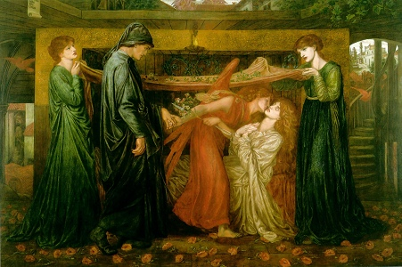

  
[Intangible Textual Heritage](../../index)  [Miscellaneous](../index) 

------------------------------------------------------------------------

[Buy this Book at
Amazon.com](https://www.amazon.com/exec/obidos/ASIN/0252068823/internetsacredte)

------------------------------------------------------------------------

<table width="75%">
<colgroup>
<col style="width: 50%" />
<col style="width: 50%" />
</colgroup>
<tbody>
<tr class="odd">
<td width="50%" data-valign="TOP"></td>
<td width="50%" data-valign="CENTER"><h1 id="the-grateful-dead" data-align="CENTER">The Grateful Dead</h1>
<h5 id="the-history-of-a-folk-story" data-align="CENTER">The History of a Folk Story</h5>
<h2 id="by-gordon-hall-gerould" data-align="CENTER">by Gordon Hall Gerould</h2>
<h4 id="section" data-align="CENTER">[1908]</h4></td>
</tr>
</tbody>
</table>

------------------------------------------------------------------------

[Contents](#contents)    [Start Reading](gd00)    [Page
Index](pageidx)    [Text](gd.txt)

------------------------------------------------------------------------

|                                                                                                                           |
|---------------------------------------------------------------------------------------------------------------------------|
|  |

Every rock band has its own mythological creation story. The Grateful
Dead claim that Jerry Garcia was looking through a 'large book' one day
(no doubt in some altered state of mind), and the phrase just popped out
at him. The specific book is unknown, but scholars of the band have
suggested it was a large dictionary of folklore, with an article on the
topic originally proposed in this book.

The term *The Grateful Dead* originally referred to a set of folklore
motifs relating to stories where the hero does a good turn for a dead
person and gets rewarded thereby. This motif appears in a wide set of
cultures, not all of which have an obvious connection. In the late 19th
and early 20th century the field of folklore had matured to the point to
where there was enough data to analyze these motifs cross-culturally.
This book was one of the first to do a comprehensive study of one such
motif on a world-wide basis, and as such occupies an important position
in the study of folklore. Gerould analyzed over a hundred variants of
the story, mostly from European, Near East and Asian sources. He used
techniques originally used by comparative linguistics to compare the
stories and untangle the development of the motif.

Of course, there is also extensive folklore about the band of the same
name, much of which I was exposed to in college. A popular motif in
deadhead lore is the *Magic Ticket*. However, I've never encountered any
variant where the *Ticket* appeared because someone did an actual dead
person a favor. . .

------------------------------------------------------------------------

 [Title Page](gd00)  
[Table of Contents](gd01)  
[Introduction](gd02)  
[Chapter I. A Review](gd03)  
[Chapter II. Bibliography](gd04)  
[Chapter III. Tales With the Simple Theme and Miscellaneous
Combinations](gd05)  
[Chapter IV. The Grateful Dead and the Poison Maiden](gd06)  
[Chapter V. The Grateful Dead and the Ransomed Woman](gd07)  
[Chapter VI. The Grateful Dead and the Water of Life or Kindred
Themes](gd08)  
[Chapter VII. The Relations of the Grateful Dead to the Spendthrift
Knight, the Two Friends, and the Thankful Beasts](gd09)  
[Chapter VIII. Conclusion](gd10)  
[Index](gd11)  
