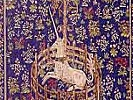

  
[Intangible Textual Heritage](../../index)  [Miscellaneous](../index.md) 
[Legendary Creatures](../../lcr/index)  [Index](index)  [Next](lou01.md) 

------------------------------------------------------------------------

[Buy this Book at
Amazon.com](https://www.amazon.com/exec/obidos/ASIN/B002FL4WSI/internetsacredte.md)

------------------------------------------------------------------------

  
*Lore of the Unicorn*, by Odell Shepard, \[1930\], at Intangible Textual
Heritage

------------------------------------------------------------------------

# THE LORE OF THE UNICORN

## BY ODELL SHEPARD

#### (b. 1884--d.1967)

#### London: George Allen & Unwin; Boston: Houghton Mifflin

#### \[1930\]

Scanned and proofed by Eliza Yetter at sacredspiral.com, 2004.
Additional formatting at Intangible Textual Heritage by John Bruno Hare,
February, 2005. This text is in the public domain in the United States
because its copyright was not renewed in a timely fashion (for more
information, see below).

**NOTE ON COPYRIGHT OF THIS WORK**  
Because of the simultaneous publications in London and Boston of this
work, it is necessary to take into account the citizenship of the
author. We can state with some confidence that Odell Shepard was a US
citizen, because he was the Lieutenant Governor of Connecticut from
1940-1943, a post which we surmise would not be open to a non-US
citizen. This means that the default rules apply and the copyright is
based on US rules, which required a renewal in order to not lapse. The
second key fact is that this work was not renewed at the US Copyright
Office in 1957-8. This means that this work is currently in the public
domain in the United States only because of a defective copyright.

 

------------------------------------------------------------------------

[Next: Contents](lou01.md)
