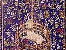

  
[Intangible Textual Heritage](../../index)  [Miscellaneous](../index.md) 
[Legendary Creatures](../../lcr/index)  [Index](index.md) 
[Previous](lou00)  [Next](lou02.md) 

------------------------------------------------------------------------

[Buy this Book at
Amazon.com](https://www.amazon.com/exec/obidos/ASIN/B002FL4WSI/internetsacredte.md)

------------------------------------------------------------------------

  
*Lore of the Unicorn*, by Odell Shepard, \[1930\], at Intangible Textual
Heritage

------------------------------------------------------------------------

# CONTENTS

|              |                          |
|--------------|--------------------------|
|              | INTRODUCTION             |
| CHAPTER I    | THE GORGEOUS EAST        |
| CHAPTER II   | THE HOLY HUNT            |
| CHAPTER III  | SHAPING FANTASIES        |
| CHAPTER IV   | EAST AND WEST            |
| CHAPTER V    | THE TREASURE OF HIS BROW |
| CHAPTER VI   | THE BATTLE OF BOOKS      |
| CHAPTER VII  | RUMOURS                  |
| CHAPTER VIII | CONJECTURES              |
| CHAPTER IX   | CERTAINTIES              |
| CHAPTER X    | REFLECTIONS              |

------------------------------------------------------------------------

[Next: Introduction](lou02.md)
