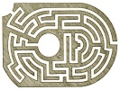

  
[Intangible Textual Heritage](../../index)  [Miscellaneous](../index) 
[Index](index)  [Next](ml01) 

------------------------------------------------------------------------

[Buy this Book at
Amazon.com](https://www.amazon.com/exec/obidos/ASIN/B002E9ID18/internetsacredte)

------------------------------------------------------------------------

  
*Mazes and Labyriths*, by W. H. Matthews, \[1922\], at Intangible
Textual Heritage

------------------------------------------------------------------------

p. iii

# MAZES AND LABYRINTHS

##### A GENERAL ACCOUNT OF THEIR HISTORY AND DEVELOPMENT

###### BY

## W. H. MATTHEWS

LONDON: LONGMANS, GREEN AND CO.

\[1922\]

Scanned, proofed and formatted at Intangible Textual Heritage, June
2005, by John Bruno Hare. This text is in the public domain in the
United States because it was published prior to 1923.

  [  
Click to enlarge](img/fig086.jpg)  
Fig. 86. Maze at Hatfield House, Herts.  
(*see page 115*)  

p. iv p. v

To  
ZETA  
whose innocent prattlings on the  
summer sands of Sussex  
inspired its conception  
this book  
is most affectionately  
dedicated

 

------------------------------------------------------------------------

[Next: Preface](ml01)
