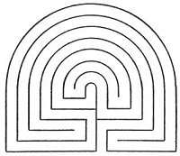

  
[Intangible Textual Heritage](../../index)  [Miscellaneous](../index) 
[Index](index)  [Previous](ml14)  [Next](ml16) 

------------------------------------------------------------------------

[Buy this Book at
Amazon.com](https://www.amazon.com/exec/obidos/ASIN/B002E9ID18/internetsacredte)

------------------------------------------------------------------------

  
*Mazes and Labyriths*, by W. H. Matthews, \[1922\], at Intangible
Textual Heritage

------------------------------------------------------------------------

p. 92

# CHAPTER XII

### THE ORIGIN OF TURF MAZES

IN 1858—the year in which Archdeacon Trollope published the results of
his researches—Capt. W. H. Mounsey drew attention to the description in
a Welsh history book ("Drych y Prif Oesoedd," published in 1740) of a
curious custom formerly prevalent among the Welsh shepherds. This custom
consisted of cutting in the turf a figure in the form of a labyrinth,
which they called Caerdroia, *i.e.* the walls, or citadel, of Troy. He
also remarked that the herdsmen of Burgh and Rockcliffe "at the present
day are in the habit of cutting this labyrinthine figure, which they
also call 'the Walls of Troy.'" He drew the tentative conclusion that
this name "would seem to be an after-thought of pure Cymric origin,
suggested by the similarity between *Caerdroia*, the City of Troy, and
*Caer y troiau*, the city of windings or turnings." A similar suggestion
had already been made in the *Transactions of the Cymmrodorion Society*
in 1822, the writer ("Idrison") holding that the turf figures, and also
those on the Knossian coins, had reference to the courses of the sun as
conceived by ancient worshippers of that orb.

Captain Mounsey was promptly answered by Dr. Trollope, who referred to
the wide distribution of these devices throughout England and commented
on their total absence from Brittany, where, if they were of ancient
Cymric origin, one would have expected to find at least

p. 93

some trace of them. He also stated that they first received the name of
"Troy-towns" in Tudor days, when "subtleties" of all kinds were in
vogue, the term being used simply to indicate, by analogy with the Troy
of legend, the difficulties to be overcome before the centre could be
reached. Dr. Trollope gave it as his considered opinion that they were
originally cut for penitential purposes by ecclesiastics, and this
opinion has since his time remained practically unchallenged. In his
memoir on the subject he reproduces a sketch showing the St. Anne's Hill
maze with two gowned and kneeling persons in the act of performing a
penitential circuit. Both the sketch and Dr. Trollope's conclusion are
based on inference, however; there does not appear to be any direct
evidence in the matter.

The theory of an ecclesiastical origin of the turf mazes is chiefly
supported by analogy with the continental church-labyrinths which many
of them so strongly resemble. Against the argument of their frequent
proximity to an ecclesiastical site we may place that of their equally
frequent proximity to known Roman remains and the fact that many of our
old churches were founded on Roman sites.

The Welsh custom above referred to was also described by P. Roberts in
his "Cambrian Popular Antiquities," published in 1815. He gives a plan
of the figure as usually cut—a design resembling the circular labyrinths
on Knossian coins, but flattened on the side where the entrance is
situated—and expresses dissatisfaction with it because there are "no
means of losing the way into the citadel, the supposed way continuing
regularly through all its windings unbroken, which could scarcely have
been the design of the inventor" ([Fig. 70](#img_fig070)).

This figure, he says, is the plan of a labyrinth which is sometimes cut
out in the turf by shepherd boys whilst they are tending their flocks on
the mountains of Wales, and is sometimes drawn and presented as a puzzle
by

p. 94

boys to exercise the ingenuity of their school-fellows, either in
finding their way to the citadel at the centre or in drawing the plan.
The tradition which accompanies the plan is that the city of Troy was
defended by seven walls represented by the seven exterior lines and the
entrance made as intricate as possible in order to frustrate an
attacking force.

On the question whether turf mazes were, as Dr. Trollope affirmed,
constructed by ecclesiastics for penitential purposes, there does not
appear to be sufficient 

<table data-align="LEFT">
<colgroup>
<col style="width: 100%" />
</colgroup>
<tbody>
<tr class="odd">
<td data-valign="CENTER"> 
FIG. 70.—''Caerdroia.'' (After P. Roberts.)</td>
</tr>
</tbody>
</table>

evidence to form a final decision. Even if it be true that they, and the
pavement labyrinths, were actually used in the manner mentioned—a
statement for which we do not seem to have definite proof—it by no means
follows that they were designed with that object. We do know for certain
that they were, from Tudor times onwards, used for recreational
purposes. In his "Midsummer Night's Dream" (Act II., Sc. i.) Shakespeare
makes Titania say, in her reply to Oberon (after the latter had twitted
her with her love for Theseus):

". . . the quaint mazes in the wanton green,  
For lack of tread are undistinguishable."

In "The Tempest" also (Act III., Sc. iii.) he makes the old counsellor
Gonzalo say:

"By’r lakin, I can go no further, sir,  
My old bones ache: here's a maze trod indeed  
Through forth-rights and meanders: by your patience  
I needs must rest me";

p. 95

and further on (Act V., Sc. i.) he puts a similar phrase into the mouth
of Alonso:

"This is as strange a maze as e’er man trod:  
And there is in this business more than nature  
Was ever conduct of."

It is most likely that the turf mazes were in existence long before
Shakespeare's time. The similarity of design between some of them and
certain of the continental church labyrinths, which has already been
alluded to, furnishes some grounds for supposing that they were
contemporary with the latter in origin, in which case they would most
probably have been constructed in the twelfth or thirteenth centuries.
The fact that several of them were situated in the neighbourhood of some
religious institution also lends support to the assertion that they were
of monastic workmanship. There is no reason, however, to suppose that
their construction and the handing on of the labyrinth tradition was
confined to ecclesiastics.

According to M. Berthelot, who made a special study of the work of the
ancient and mediaeval alchemists, a similar figure was employed by the
latter. At any rate he found in an eleventh-century alchemistic
manuscript, which he refers to as the Manuscript of St. Mark, Venice, a
labyrinth drawing closely resembling the ecclesiastical type,
accompanied by a commentary in Greek verse. He, however, expresses the
opinion that both the labyrinth and the verses are an addition of the
fourteenth or fifteenth century. The figure, he says, is referred to as
"The Labyrinth of Solomon."

The name of Solomon was in use at least as late as 1844 in connection
with labyrinthine figures. In that year M. Didron, a noted French
archaeologist, whilst making a tour through Greece, visited the convent
of St. Barlaam, a building perched high up on a huge crag and approached
only by a rope. On the wall of the guest-room

p. 96

he observed a red tracing of a labyrinth resembling that on the floor of
Chartres Cathedral. M. Didron inquired as to the origin of it, and was
informed that it was called the "Prison de Salomon" and that it had been
copied on the wall long before by a monk who had found the design in a
book. The monk was dead and the book lost. This "Solomon's Prison" was
of the same character as the "Solomon's Labyrinth" described by M.
Berthelot, but very probably these and similar terms were at one time as
popular as "Chemin de Jérusalem," "Julian's Bower," and so on, in their
application to all sorts of labyrinthine devices.

A simple "interrupted-circle" type of labyrinth was adopted as a
heraldic device by Gonzalo Perez, a Spanish ecclesiastic who aged as
Secretary to Charles V and Philip II, and published in 1566 a
translation of Homer's "Odyssey." The labyrinth was shown in
perspective, with the Minotaur, in fighting attitude, at the centre. It
was surmounted by the motto *In silentio et spe*.

No doubt continental heraldry could furnish us with many similar
references of the sort, although nothing of the kind seems to occur in
English heraldry. In Fig. 71, for instance, is shown one used by
Bois-dofin de Laval, Archbishop of Embrun. The motto in this case was
*Fata viam invenient* ("The Fates will find a way"), a motto adopted in
England by the Berkshire Vansittarts. Our illustration is copied from an
early seventeenth-century book entitled "Devises Héroïques et Emblemes,"
by Claude Paradin.

In the text it is stated that "par ce labyrinthe . . . se pourroit
entendre que pour rencontrer la voye, & chemin de vie eternelle, la
grace de Dieu nous adresse: nous mettant entre les mains le filet de ses
saincts commandemens. A ce que le tenans & suivans tousiours nous
venions a nous tirer hors des dangereux foruoyemens des destroits
mo\_dains." In other words, the device may be taken as emblematical of
the temptation-labyrinth of this

p. 97

worldly life, which can only be safely traversed by means of the Ariadne
thread of divine grace.

The design in this case is of a peculiar type, but it may be very easily
derived from the simple split-ring or "Pigs in Clover" design ([Fig.
144](ml26.htm#img_fig144)).

We have in the two cases just mentioned, as in the case of the pavement
labyrinths, an association with the

  [  
Click to enlarge](img/fig071.jpg)  
FIG. 71.—Labyrinth Device of Archbishop of Embrun. (After C. Paradin.)  

\[paragraph continues\] Church or with
ecclesiastics. At the same time we know that, in England at any rate,
the turf mazes were used for sportive purposes in the days of Elizabeth,
and there is, so far, a lack of contemporary reference to their
employment in a devotional or penitential capacity. "Treading" or
"threading" the maze was a favourite game for several generations.
Seeing that the path in the turf maze has as a rule no branches or
dead-ends, the sport in question would appear to have been rather simple
in

p. 98

character, unless we imagine the participants to have been blindfolded
for the purpose or primed with a tankard or two of some jocund beverage.

Let us refer once more to that chapter of Pliny's "Natural History" in
which he says that we must not compare the Egyptian and other labyrinths
with "what we see traced on our mosaic pavements *or to the mazes formed
in the fields for the entertainment of children*." The italicised words
clearly show that the construction of something akin to our turf mazes
was practised by the Romans. It seems very reasonable to infer that, if
the custom were so common as Pliny seems to imply, it would have been
carried to the Roman colonies in these islands. An argument which has
often been brought forward in this connection is that from very early
times the game of Troy, the *lusus Trojae*, was played by Roman youths.
Virgil describes it in the fifth book of his "Aeneid," and draws
attention to the similarity between the mazy windings of this
sport—which was performed on horseback—and the sinuous path of the
Cretan labyrinth (see Chapter XVIII). The inference drawn from this is
that our "Troy-towns" and the sports connected with them are in the
direct line of descent from this classic game and are therefore a legacy
of the Roman occupation of Britain.

Dr. Stukeley, whom we had occasion to mention with reference to the
Horncastle maze, suggested that the term Julian's Bower was derived from
the name of Iulus, the son of Aeneas, who is described as having taken
part in the game. We see, then, that there is a good deal to be said for
the claim of a Roman origin.

Assuming for the moment that such was the case, we are faced with some
difficulty in accounting for the preservation throughout the intervening
ages of a class of earthwork which, without attention, is liable to
become effaced in a few decades.

Is it likely that the Britons, after the Roman recall,

p. 99

would trouble to preserve the playgrounds of their late rulers'
children? Is it at all probable that the successive waves of immigrants,
Anglo-Saxons, Danes and Norse-men, would concern themselves with the
maintenance of such alien frivolities?

Is there not a chance that perhaps some of these invaders brought the
custom with them?

If we had to rely solely on our own historical records, we should find
it extremely difficult to arrive at any conclusion in the matter.
Researches of recent decades have, however, rendered it possible to
approach the matter from a much wider angle, and, before we attempt any
further to inquire into the origin of our own turf mazes, we shall find
it necessary to go back very far indeed in the history of European
civilisation, and to look at the question of labyrinth origins from
another point of view.

Before doing so, however, we will review a development which, in the
eyes of the archaeologist an insignificant side-line, is perhaps to many
readers a matter of greater interest than anything we have yet dealt
with, embracing as it does that type of labyrinth which is familiar to
all in the famous Hampton Court specimen.

------------------------------------------------------------------------

[Next: Chapter XIII. The Floral Labyrinth and the Dwarf-Shrub
Maze](ml16)
