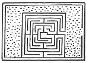

  
[Intangible Textual Heritage](../../index)  [Miscellaneous](../index) 
[Index](index)  [Previous](ml16)  [Next](ml18) 

------------------------------------------------------------------------

[Buy this Book at
Amazon.com](https://www.amazon.com/exec/obidos/ASIN/B002E9ID18/internetsacredte)

------------------------------------------------------------------------

  
*Mazes and Labyriths*, by W. H. Matthews, \[1922\], at Intangible
Textual Heritage

------------------------------------------------------------------------

p. 110

# CHAPTER XIV

### THE TOPIARY LABYRINTH, OR HEDGE MAZE

THE art of trimming hedges of evergreens is of great antiquity; probably
it is almost as old as horticulture itself.

The Romans made much use of the services of the *topiarius*, or
hedge-trimmer—he is referred to by Cicero and other writers—and it is
quite possible that they had shrubs or bushes trained to enclose winding
paths in the manner of a hedge maze.

In Pliny's "Natural History" (Book XVI, Ch. 33) the cypress is spoken of
as being clipped and trimmed to form hedges or lengthened out in various
designs for ornamental purposes. In Book XV he tells us that a shrub
called *taxa* is also used in ornamental gardening, from which we might
conclude that the yew (*taxus*) was intended. From the description in
the context, however, it is more likely that Pliny was speaking of a
plant something like our "butcher's broom" (*Ruscus aculeatus*). He also
mentions the box and a species of laurel as being suitable for this kind
of work.

A hint of something like a hedge maze is given in one of the epistles of
the younger Pliny, where he describes the gardens of his *villa* in
Tuscany. He speaks of having a *hippodromus*, a kind of circus
consisting of many paths separated by box hedges and ornamented with
topiary work.

We do not, however, find any actual description of

p. 111

an indubitable hedge maze in the works of the classic writers. Amongst
monastic manuscripts of the middle ages occur a few passages which have
been thought to refer to something of the kind. For instance Henry,
Abbot of Clairvaux, in speaking metaphorically of labyrinthine
entanglements, says, "Non habent certos aditus, semitas ambulant
circulares, et in quodam fraudium labyrintho monstra saevissima
reconduntur" ("They have no definite approaches, but wander about in
circular side-tracks, and most savage monsters are concealed in their
labyrinth of deceptions"); but he may very well have been alluding
simply to the traditional Cretan Labyrinth and not to actual
constructions of his own period.

A perhaps more striking passage is that in a "History of the Counts of
Guines, A.D. 800 to 1200," by Lambert of Ardres (*Lambertus Ardensis*),
who lived in the twelfth and thirteenth centuries. Speaking of the
building of a large residence at Ardres for Count Arnold, in the twelfth
century, he says:

"Quam quidem Broburgensis artifex vel carpentarius, in hujus artis
ingenio parum discrepans a Dedalo fabrefecit et carpentavit nomina
Lodevicus et de ea fere inextricabilem fecit laberinthum et effigiavit,
penus penori, cameram camerae, diversorium diversorio concludens . . .";
that is to say, a certain workman named Louis of Bourbourg, with a skill
in woodwork very little different from that of Daedalus, was employed in
building the house and made there a nearly inextricable labyrinth,
containing recess within recess, room within room, turning within
turning. Here again the description hardly answers to that of a hedge
maze, but rather indicates an elaborate architectural structure and
probably refers to nothing more than a large wooden house.

The common belief that our own King Henry II concealed his paramour "the
fair Rosamond" within a maze at Woodstock may possibly, as sceptical
historians aver, have no firmer foundations than that afforded by the

p. 112

imaginative efforts of mediaeval romancers, but from what we have just
quoted it is evident that contrivances of the kind described in the
legend may have been in existence not only in Henry's time but even in
the previous century. In view of the great popularity of the story
throughout succeeding generations we cannot altogether ignore it, but we
will discuss it more conveniently in a later chapter.

The maze was introduced into the Low Countries, according to a book on
Architecture in Belgium, some time during the thirteenth century, but
this statement may be merely an inference from Lambert's History quoted
above.

In France, as we have already seen, the pavement labyrinths were
sometimes known as "dédales" or "maisons de Dédalus," in reference of
course to the "house" built by Daedalus for the Minotaur, and in the
fourteenth and fifteenth centuries we find the same titles applied to
mazes formed of shrubs. Charles V, in the fourteenth century, is said to
have laid out a *maison de Dédale* in the gardens of the Hotel de St.
Paul in Paris.

Of interest on this point is an Order of the Court of the Duchy of
Anjou, dated September 18, 1477, in which the people of the Duchy were
required to pay twelve *livres* to the keeper of King Réné's castle at
Baugé "pour la nourriture des ouyseaux et nestoyer les espèces qu’il a
en garde . . . et *reffaire le Dédalus* qui est és jardrins dudit lieu
de Baugé."

We also read of a *dédalus* in the park of Louise de Savoie in 1513.

A sixteenth-century maze is depicted in a landscape by Tintoretto which
is exhibited in the Queen's Private Chamber at Hampton Court Palace (No.
524 \[787\]). In the centre of the maze are seen four ladies seated at a
table, their attendants standing by. In the background is the palace to
which the maze and surrounding pleasure-grounds evidently appertain.

p. 113

Hans Holbein, an early contemporary of Tintoretto, is also said to have
painted a maze of this description.

Many mazes at that time were planned by the Italian architect Serlio,
one of whose designs is shown in [Fig. 81](#img_fig081).

The late sixteenth century furnishes abundant evidence of the growing
taste for the topiary labyrinth in the architectural works of Androuet
du Cerceau, one of the great builders of the French Renaissance and
architect to Catherine de Medici. We are bound to say, however,

  [  
Click to enlarge](img/fig081.jpg)  
FIG. 81.—Maze Design by J. Serlio (Sixteenth Century).  

that the assertion of Horace Walpole, in his "Essay on Modern
Gardening," to the effect that in Du Cerceau's works there is scarcely a
ground plot without both a round and a square maze, is not borne out by
reference to such editions as are generally available.

Du Cerceau's sketches of the mazes at Charleval and in the Palace garden
of the Archbishop of Rouen at Gaillon—with modifications necessitated by
the extreme roughness of the original blocks—are shown in Figs.
[82](#img_fig082), [83 and 84](#img_fig083-4).

One of the best-known gardens of the Elizabethan

p. 114

period was that made about 1560 for Lord Burleigh, or Burghley, at
Theobalds in Hertfordshire. It was described by a contemporary as being
"large and square, having all its walls covered with Sillery and a
beautiful

  [  
Click to enlarge](img/fig082.jpg)  
FIG. 82.—Maze at Charleval. (After Du Cerceau.)  

  [  
Click to enlarge](img/fig083-4.jpg)  
FIGS. 83 and 84.—Mazes at Gaillon. (After Du Cerceau.)  

*jet d’eau* in the centre." At the end was a small mount called the
Mount of Venus, placed in the midst of a labyrinth, "upon the whole, one
of the most beautiful spots in the world." The house and gardens, John
Evelyn tells us in his Memoirs, under date April 15, 1643, were
"demolish’d by the rebels."

p. 115

A plan of this labyrinth is shown in [Fig. 85](#img_fig085). Theobalds
was afterwards transferred by Burleigh's son, the Earl of Salisbury, to
King James the First, in exchange for another noble seat in the same
county, Hatfield House, still held by the present Marquis of Salisbury.

In the grounds to the rear of the latter mansion is to be seen at the
present day one of the finest examples of

  [  
Click to enlarge](img/fig085.jpg)  
FIG. 85.—Maze at Theobalds, Herts. (After Trollope.)  

a hedge maze, which, although of fairly modern construction, probably
replaced an earlier specimen.

Our photograph, [Fig. 86](ml00.htm#img_fig086) (see Frontispiece), was
taken, by kind permission, from the roof of Hatfield House. The hedge is
of tall, thick yew throughout, and is perfectly formed, without any of
those thin, straggly growths in the lower portion which, by tempting the
unscrupulous maze-trotter to burst through them, soon necessitate
renewal or unsightly patching.

p. 116

The maze is 174. ft. in length and 108 ft. in width, and has two
entrances (or exits), one at each end. The

  [  
Click to enlarge](img/fig087.jpg)  
FIG. 87.—Maze in Hatfield House, Herts. Plan (W.H.M.)  

basin which formerly occupied the centre was replaced some years ago by
a block of yew surmounted by topiary figures. [Fig. 87](#img_fig087)
shows the maze in plan.

p. 117

From the beautifully turfed level above the maze, or from the parterre
terrace above that, one can overlook the hedges and enjoy, if so
inclined, occasional glimpses of ensnared and perplexed visitors.

The type of hedge maze exemplified here, in which the paths are bounded
by hedges of uniform thickness, is only one development. Another type
arose in the late seventeenth century in which serpentinous footpaths
penetrated blocks of shrubs or dense thickets. In some cases limes or
hornbeams were "plashed," *i.e.*, their branches were so trained and
intertwined as to form a continuous wall of verdure. In other cases the
intervals between the paths were filled with loose aggregations of
flowering shrubs and evergreens; such an arrangement as this was usually
termed a "wilderness." (The term "plashing," by the way, should not be
confused with "pleaching," which merely signified the process of
ordinary trimming).

In practically all types of maze it became the fashion to relieve the
monotony of the walks by placing statues, vases, seats, fountains, and
other ornaments at various points. This kind of thing reached a climax
of extravagance in the latter part of the seventeenth century, when J.
Hardouin-Mansart constructed for Louis XIV the famous labyrinth in the
smaller park at Versailles. This labyrinth is described in a book, now
very rare, entitled "Labyrinte de Versailles," by C. Perrault, printed
at the royal press, Paris, in 1677, and illustrated by Sebastien le
Clerc. Our illustrations, Figs. [88](#img_fig088), [89](#img_fig089),
[90](#img_fig090) and [91](#img_fig091), are selected from the book in
question and show respectively the plan of the labyrinth and three of
the thirty-nine groups of hydraulic statuary representing the fables of
Aesop. At the entrance to the labyrinth were placed symbolical statues
of Aesop and Cupid, the latter holding in one hand a ball of thread.
Each of the speaking characters represented in the fable groups emitted
a jet of water, representing speech, and each group was

p. 118

accompanied by an engraved plate displaying more or less appropriate
verses by the poet de Benserade.

  [  
Click to enlarge](img/fig089.jpg)  
FIG. 89.—Labyrinth of Versailles. Fable Group: ''The Hare and the
Tortoise.'' (Perrault.)  

We reproduce le Clerc's engravings of the groups illustrating
respectively the fables of "The Hare and

 

  [  
Click to enlarge](img/fig088.jpg)  
Fig. 88. Labyrinth of Versailles. (Perrault)  

 

p. 119

the Tortoise," "The Fox and the Crow," and "The Snake and the
Porcupine." The water for all these elaborate

  [  
Click to enlarge](img/fig090.jpg)  
FIG. 90.—Labyrinth of Versailles. Fable Group: ''The Fox and the Crow.''
(Perrault.)  

p. 120

waterworks was conveyed from the Seine by a wonderful contrivance called
the "Machine de Marli," constructed

  [  
Click to enlarge](img/fig091.jpg)  
FIG. 91.—Labyrinth of Versailles. Fable Group: ''The Snake and the
Porcupine.'' (Perrault.)  

 

  [  
Click to enlarge](img/fig093.jpg)  
Fig. 93. Labyrinth at Choisy-le-Roi. (Blondel)  

  [  
Click to enlarge](img/fig094.jpg)  
Fig. 94. Labyrinth at Chantilly. (Blondel)  

 

p. 121

  [  
Click to enlarge](img/fig095-6.jpg)  
Figs. 95 and 96. Maze Designs by Andre Mollet, 1651.  

 

by Swalm Renkin between 1675 and 1682. It is said to have cost the
equivalent of £8,000,000 and contained fourteen water-wheels driving 253
pumps, some of which worked at a distance of three-quarters of a mile.

The labyrinth was destroyed in 1775 and its site is now occupied by the
"Bosquet de la Reine."

The "Dial-garden" at Friar Park, Henley-on-Thames, is laid out on the
plan of the Versailles labyrinth, but in place of the statuary groups
are thirty-nine sun-dials, each having its motto or epigram. Adjoining
it is a maze of original and ingenious design.

The Versailles example was only one of several well-known mazes which
existed 

|                     |
|---------------------|
|  |

in or around Paris at that time. Evelyn, who spent some years in Paris,
from 1643 onwards, remarks on the design and trimness of the box-hedge
designs in the gardens of the Luxembourg and on the "labyrinth of
cypresse" at the Tuileries, no doubt designed by Du Cerceau ([Fig.
92](#img_fig092)). In another account of the Tuileries labyrinth,
however, it is described as being made entirely of bent cherry trees. In
was ultimately swept away by Le Notre to make room for enlarged
parterres.

There is still a labyrinth in the Jardin des Plantes, formerly the
Jardin du Roi, but it is of rather feeble design .

Another noted French maze was that constructed by M. Gabriel at
Choisy-le-Roi ([Fig. 93](#img_fig093)). One was designed for the gardens
of Chantilly by Le Nôtre, but exists to-day only as an engraving on a
stone in the park ([Fig. 94](#img_fig093)). Madame de Sévigné, in a
letter of June 1, 1689, mentions one at Les Rochers, her seat in
Brittany, and we read of one at Sceaux on the occasion of a fête given
to Louis XIV and Madame de Maintenon in 1685.

p. 122

In most European countries the fashion had obtained a hold either before
or during the seventeenth century,

  [  
Click to enlarge](img/fig097-8.jpg)  
FIGS. 97 and 98.—Mazes by G. A. Boeckler, 1664.  

and we can usually be sure of finding a few drawings of mazes in any
horticultural book of that period. Figs. 95 and 96 show two examples
given in "Le

p. 123

\[paragraph continues\] Jardin de
Plaisir," by André Mollet, the royal gardener at Stockholm, in 1651.
Figs. [97](#img_fig097-8) to [106](#img_fig105-6) show some very

  [  
Click to enlarge](img/fig099-100.jpg)  
FIGS. 99 and 100.—Mazes by G. A. Boeckler, 1664.  

ingenious designs selected from a great number which accompany the
drawings of castles and great houses in Germany and elsewhere, contained
in the "Architectura curiosa nova" of G. A. Boeckler, 1664.

p. 124

One of these ([Fig. 105](#img_fig105-6)) is rather suggestive of the
Saffron Walden turf maze, whilst another ([Fig. 101](#img_fig101-2))
maze, as well as a "mechanical island" and various other horticultural
toys.

  [  
Click to enlarge](img/fig101-2.jpg)  
FIGS. 101 and 102.—Mazes by G. A. Boeckler, 1664.  

is reminiscent of the Rheims pavement labyrinth. At Enghien, in Belgium,
the gardens of the château where the Duke of Arenburg entertained
Voltaire contained a

p. 125

maze, as well as a "mechanical island" and various other horticultural
toys.

  [  
Click to enlarge](img/fig103-4.jpg)  
FIGS. 103 and 104.—Mazes by G. A. Boeckler, 1664.  

In Spain, as elsewhere, the hedge maze attained great popularity. In the
magnificent gardens of the Alcazar at Seville may still be seen the
labyrinth laid out in the

p. 126

sixteenth century for the Emperor Charles V, with tiled paths and
fountains, and adjoining this is a hedge maze

  [  
Click to enlarge](img/fig105-6.jpg)  
FIGS. 105 and 106.—Mazes by G. A. Boeckler, 1664.  

of roughly hexagonal outline enclosed within an irregular rectangle.

As regards Italy, we read that even the Pope himself,

 

  [  
Click to enlarge](img/fig107.jpg)  
Fig. 107. Maze at Gunterstein, Holland. (N. Visscher, 1719)  

  [  
Click to enlarge](img/fig108.jpg)  
Fig. 108. Gunterstein. Plan of Gardens, showing Maze. (N. Visscher,
1719)  

 

p. 127

 

  [  
Click to enlarge](img/fig109.jpg)  
Fig. 109. Gardens at Loo, Holland, with Mazes. (W. Harris, 1699.)  

 

\[paragraph continues\] Clement X, took
pleasure in watching the endeavours of his domestics to extricate
themselves from the maze of tall box hedges which adorned his garden at
Altieri. Evelyn, in 1646, describing his visit to Vicenza, remarks of
the gardens of Count Ulmarini, or Vilmarini, outside the town, "Here is
likewise a most inextricable labyrinth."

Sir Philip Skippon, describing his own visit to Vicenza in 1663, refers
to the gardens as those of Count Valmarana, and mentions "a labyrinth of
myrtle hedges." Skippon also speaks of labyrinths in the gardens of the
Duke of Bavaria at Munich.

The Dutch gardeners made a great feature of the *doolhof*, typical
examples being those at the Duke of Portland's château at Sorgvliet,
near the Hague, at Gunterstein (Figs. [107](#img_fig107) and
[108](#img_fig108)), and at the Palace of Loo, the Dutch home of William
and Mary ([Fig. 109](#img_fig109)). Our illustration of the last-named
is taken from Dr. W. Harris's book "The King's Palace and Gardens at
Loo" (1699). It will be seen that the maze to the left is described as a
"wilderness," as is also the structure to the extreme right, but whereas
the latter certainly presents little of a labyrinthine appearance, the
former is evidently a hedge maze, although perhaps loosely drawn. Harris
uses the terms "maze" and "wilderness" interchangeably. He says that the
King's labyrinth was formed of clipped hedges with sandy walks between,
while the Queen's was decorated with fountains and statues. William the
Third exercised his taste for this kind of embellishment also in the
grounds of his English palaces. His gardeners, George London and Henry
Wise, have left us one which, although of no great complexity, has
become world-famous, namely, the specimen which forms part of the
"Wilderness" in the gardens of Hampton Court Palace.

------------------------------------------------------------------------

[Next: Chapter XV. The Topiary Labyrinth, or Hedge Maze
(*continued*)](ml18)
