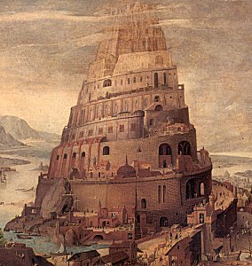

  
[Intangible Textual Heritage](../../index)  [Miscellaneous](../index.md) 

------------------------------------------------------------------------

<table width="75%">
<colgroup>
<col style="width: 50%" />
<col style="width: 50%" />
</colgroup>
<tbody>
<tr class="odd">
<td data-valign="CENTER"></td>
<td data-valign="CENTER"><h1 id="tower-legends" data-align="center">Tower Legends</h1>
<h2 id="by-bertha-palmer-lane" data-align="center">by Bertha Palmer Lane</h2>
<h3 id="copyright-not-renewed" data-align="center">[1932, copyright not renewed]</h3></td>
</tr>
</tbody>
</table>

------------------------------------------------------------------------

[Title Page and Front Matter](tl00.md)  
[Preface](tl01.md)  
[Contents](tl02.md)  
[Illustrations](tl03.md)  
[The Story Told by the Keeper of the Pharos](tl04.md)  
[Aeolus and the Tower of the Winds](tl05.md)  
[The Moon That Shone on the Porcelain Pagoda](tl06.md)  
[The Brahman's Star](tl07.md)  
[The Dragon of Ghent](tl08.md)  
[The Ox That Helped](tl09.md)  
[The Raven of the Giralda](tl10.md)  
[The Goblin of Giotto's Tower](tl11.md)  
[The Leprechaun of Ardmore Tower](tl12.md)  
[The Tower That Sings](tl13.md)  
[Bibliography and Notes](tl14.md)  
