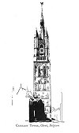
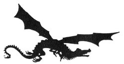

  
[Intangible Textual Heritage](../../index)  [Miscellaneous](../index) 
[Index](index)  [Previous](tl07)  [Next](tl09) 

------------------------------------------------------------------------

p. 55 p. 57

 

[  
Click to enlarge](img/05700.jpg)  
CARILLION TOWER, *Ghent, Belgium*  

 

p. 59

### THE DRAGON OF GHENT

AT ONE side of the Place Saint Bavon in the center of Ghent, Belgium,
rises the impressive carillon tower with its fifty-two singing bells. On
the largest bell, which is taller than a tall man, is a Flemish
inscription that reads:

"My name is Roland. When I toll there is fire.  
   When I ring there is victory in the land."

\[paragraph continues\] This great bell
might vie with the horn carried by that other Roland, the knightly
champion of Charlemagne--a horn that was heard twenty miles. On top of
the belfry, is a weather vane, of dragon shape, that presides over all
the winds, hot or cold, and rejoices when Roland rings.

A long, long, time ago, before the dragon began to live on the tower, he
lived near Aleppo, one of the chief cities of the Saracens in northern
Syria. He was such a tender-hearted old dragon that he was called The
Weeping Dragon, because he wept large bucketfuls of tears whenever the
Belgian crusaders and the Saracens fell to fighting. Now, as the
Saracens and Belgians fought at the slightest provocation, the tears of
the sympathetic dragon flowed with such abundance into the ground that
the soil became unusually fertile, and there soon grew up, from this
rich soil, a rare flower. The Belgian crusaders, delighted with the
bright-colored flower, called it The Turk's Turban, though it is a pity
they didn't know The Weeping Dragon well enough to name it for him.
Buccoleon was the dragon's name. When the last Saracen war was over,

p. 60

one of the crusaders, Taff, a lover of flowers, brought back the seeds
of The Turk's Turban to Flanders and planted them in his own garden.
Beautiful tulips rewarded him, tulips of brilliant color, that brought
him high praise and much money, too.

The fame of these tulips spread far, until it reached even Buccoleon
himself, who, now that the wars had ceased, had been living in his quiet
marshes in the outskirts of Aleppo. A soothsayer, ages past, had
predicted that, if the Saracens and Belgians should ever stop fighting,
the tears of The Weeping Dragon would dry up and his brown scales would
turn to scales of pure gold. So it proved. For, when all the wars had
come to an end, the dragon no longer felt like weeping, and his sombre,
brown scales were gradually replaced by gleaming scales of gold.

Now, one afternoon, as Buccoleon lay luxuriously in the sunny marsh, he
had a thought, as new and glittering as his scales--he would fly to
Flanders to see the tulips which rumor said he himself had given to the
earth. Since he had only a

 

vague notion of the whereabouts of Flanders and Ghent, he decided to ask
advice of a marsh bird hovering near him.

"Tell me," said Buccoleon, "you birds fly everywhere and hear
everything--how shall I go to the garden of Taff?"

p. 61

"Easily told," whistled the bird. "My brother was there last month. Fly
northward, and then northwest, until you see the Bosporus, the Golden
Horn and the Marmora. After you arrive at stately Constantinople, ask
the clouds that

 

float at daybreak over the citadel and they will tell you more."

"Thanks," said the dragon, "I'll start at once."

So he wriggled from jaw to tip of tail, complacently glanced along his
own shining ridges, reared up with a convulsive tremor that woke all
Aleppo babies from their naps, and, with a great bound, shot into the
air. Aleppo had never experienced such a surprise. The men of Aleppo,
dazed, looked first at the dragon soaring aloft and then at one another
and exclaimed, "What! . . . the dragon? . . . the dragon going away?"
The boys of Aleppo all pointed up to the sky and cried out, "The dragon!
The dragon! . . . Let's follow him! . . . Come on! Let's follow
Buccoleon!" And they ran down the road. The women stood in their
doorways wringing their hands and said, "The dragon gone! . . . What
*shall* we do without our dragon? . . . We've always had our dragon."

But presently all realized that to try to keep the dragon was useless.
For dragons--at least good dragons like Buccoleon--

p. 62

always get what they want, and Buccoleon wanted to go away. So all the
people--men, women, and children--stood watching the great dragon soar
off toward the northwest until he was only a speck in the blue distance
and, finally, not even a speck. Then they went back to their daily tasks
in Aleppo, and found, rather to their astonishment, that life was much
the same, even without the dragon.

Meanwhile, Buccoleon was well started on his adventure. Far from Aleppo
he flew and flew until, one early dawn, he reached a large city.

"Is this Constantinople?" inquired Buccoleon of a pink cloud.

"It is," the cloud replied.

"Tell me, please," went on Buccoleon, "how shall I go to the garden of
Taff? Clouds, like you, see every place under the sky."

"Yes, we do," agreed the cloud. "I can tell you how to go. Aim northwest
to Vienna, then ask the Danube River to tell you the way."

Swiftly the dragon flew and flew, until he came to the broad Danube at
Vienna, and good it seemed to Buccoleon to rest beside water again.

"Tell me, River," he said, "how shall I go to the garden of Taff? A
river like you wanders far and must know all that's worth knowing."

"That is true," murmured the Danube clearly. "I can tell you the best
way to go to Ghent. Steer a little to the west of north and fly onward
till you see the towers and turrets of

p. 63

\[paragraph continues\] Nuremburg castle.
Then ask the wind to show you the rest of your course."

The dragon left the Danube, somewhat reluctantly, and whiffled along all
night under the stars toward old Nuremburg. In the morning, he poised
himself over the castle turrets where a strong wind was blowing.

"Wind," shouted Buccoleon, "how shall I go to the garden of Taff? Winds
blow everywhere and see everything."

"Come along with me," called back the wind; "I'm going there myself, as
it happens, this very morning."

Now, as the dragon and the wind journeyed together, the dragon said,
"Have you ever chanced to see the garden of Taff?"

"Many times," answered the wind. "How does it look?" asked Buccoleon.

"Like a sunset spread over the ground," said the wind.

"Are the tulips of one color?" inquired Buccoleon.

"Of as many colors as the rainbow," replied the wind; "some are like
palest moonlight, others are like deep tree-shadows; and when I let one
of my breezes stir them, gently, the flowers are like dancing flames."

"Ah," said Buccoleon, "that's what I want to see."

Not long after this talk, the wind pointed downward. "Look!" he said,
"do you see a gleam of color over there?"

"I do," answered Buccoleon with a jubilant ring in his voice. "It is
fairer than anything I have ever seen." But, just as he spoke, an arrow
smote him, and he fell headlong to the earth . . . . . . . . . . . . . .
. . . . . . . . . . . .

p. 64

The dragon's fall looked like the fall of a glorious golden star.
People, for miles around, rushed toward the bell tower. The first to
reach the tower was a tall, resolute man, liked by everybody.

"Now who sent that wicked arrow?" he cried.

A boy in the crowd made answer. "Archers went up into the high
watchtowers yonder, this morning."

"Archers?" exclaimed the man. "Who sent them there?"

Then Taff, the florist, and his friend Nyken, the potter, made their way
through the throng until they were beside the tall man. "Mynheer," said
Taff, "the goldsmiths have been envious of me because my tulips have
done so well and have brought fortune my way. Perchance they sought to
kill the dragon for his golden scales, to make themselves richer."

And the potter, Nyken, nodded his head, saying, "Aye, they said as much
to the baker yesterday."

Other friends of Taff now told the story of The Weeping Dragon of Aleppo
whose tears had caused the marvelous tulips to grow. Then, with one
accord, it was voted that Buccoleon should receive the utmost honor and
should have his place on the pivot of the iron weather vane on top of
the belfry. The tall leader suddenly raised his right arm and pointed up
to the bell tower, as he shouted, "Victory!--not death for the dragon,
but victory! He shall live among us forever!"

All the people took up the word, crying, "Victory!" while the leader,
and Taff, and Nyken entered the tower and climbed up the stairs to the
bells.

p. 65

Soon came the voice of Roland ringing a mighty tone of gladness, and
proclaiming far and wide the words so well known:

"When I ring, there is victory in the land."

There on the bell tower, today, is the golden dragon--a shining
figure--turning, turning with the winds, morning, noon, and night, and
looking down at the gardens of tulips in Ghent.

 

 

------------------------------------------------------------------------

[Next: The Ox That Helped](tl09)
