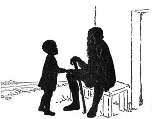

  
[Intangible Textual Heritage](../../index)  [Miscellaneous](../index) 
[Index](index)  [Previous](tl08)  [Next](tl10) 

------------------------------------------------------------------------

p. 67 p. 69

[  
Click to enlarge](img/06900.jpg)  
WEST TOWER, LAON CATHEDRAL, *Laon, France*  

p. 71

### THE OX THAT HELPED

*A Legend of Laon*

GRAND-PÈRE Jean sat on a low bench outside the doorway of his little
cottage on the Laon hillside. As far as his old eyes could see were
sunny vineyards with giant trees beyond--trees that had been part of the
forest of St. Gobain when Charlemagne was crowned king of the Franks.
Wherever the old man looked were fields gay with poppies, and a
landscape that smiled. Little François, bare-kneed, and clad in black
apron, looked up from his marbles on the ground and said, suddenly, in
his direct way, "Grand-père, you will tell me about the ox that helped?"
And he looked toward the Cathedral.

From the doorway of the cottage, they saw the towers of the
Cathedral--the two, octagonal belfries, with the huge oxen and horses
guarding the summits. From lofty stalls, the animals gazed over the
V-shaped valley that was now filled with the clear, abundant sunlight of
early afternoon. Grand-père Jean's quiet hands rested on his cane as he
tranquilly gazed at the Cathedral towers which were so still, so still,
against the sky. The boy aimed one more marble at its enemy marble, then
leaned back against the wall of the cottage.

"Grand-père," repeated François, with a tiny show of authority, "You
will begin the story? . . . You know the one--about the ox that helped?"

p. 72

"But yes," assented the grandfather, without moving his peaceful hands,
"the ox that helped! Listen well, now, my François! It was years and
years ago . . ."

"Last time you told it you said it was before you were born,"
interrupted François.

"But yes, my child, before I was born, that is true; years ago, it was,
centuries ago. Count back, François, count back with me--twenty,
nineteen, eighteen, seventeen, sixteen, fifteen, fourteen, thirteen . .
. the thirteenth century it was--about seven hundred years ago, when the
men of Laon were building up, again, the great church. Our France had
been having a hard time. Our Laon had been having a hard time. This town
had had to fight for its liberties. It had had to fight against the
invaders, and this, too, though Laon was one of the three great
fortresses. For know this, François--La Fère, and Reims, and Laon--these
are the fortresses--the fortresses then and the fortresses now."

"The fortresses I know all about," said François, as he made a triangle
with three marbles. "Here they are."

"Now, François," went on his grandfather, "I tell you it was no easy
thing the men of Laon had to do after our great church had been burned
by the invaders. They had to build the church anew. They had to carry
the great stones from the ancient quarries in the low valley down
there,"--and Grand-père Jean pointed down the hillside. "They had to
carry the great stones, from the plain, up the steep hill, every day, so
long as stones were needed to build up this church of ours. And, I tell
you, my François, when young Enguerrand fought with the lion that lived
in the woods between Laon

p. 73

and Soissons, he had no harder task; for it was only once that
Enguerrand fought--he fought the lion just once, and killed him. But
these men, these sturdy men, worked day after day with all their
strength, for months and months. They found the work hard, hard."

"And the oxen?" put in François.

"But yes, the oxen were the biggest helpers of all," continued
Grand-père Jean. "They and the horses dragged the carts laden with the
stones or with the heavy wood, but the oxen were stronger than the
horses. All day long, from morning till night, the patient oxen toiled
up the steep hill slowly, slowly, with their loads. And, François, let
me tell you, they *wanted* to draw the loads. Yes, they climbed the hill
eagerly, every time. You could tell by looking at them how glad they
were to help. They never had to be urged."

"You didn't see them, Grand-père," said François firmly, though in a
half-questioning tone.

"No, François," said Grand-père Jean, "I didn't see them, but I know how
they looked."

"I, too," agreed François.

"Now it happened that the sun was very hot one day," went on his
grandfather, "hotter than usual; and four oxen, dragging up a heavy load
of stones, suddenly stopped. My faith, but one of those oxen was tired
out! Too tired the poor beast was to take another step! The good driver,
Pierre, unhitched the ox from the cart to let him rest at the side of
the road. As the tired animal lay down on the grass, his beautiful,
large eyes looked up at his kind master gratefully.

p. 74

"'*Pauvre bête! Reste ici!*' said Pierre in an encouraging tone; and the
tired ox was glad, indeed, to stay there."

"But, now, how could the cart go on? How could another ox be put in
place of this one? All the other carts were already at the top of the
hill. Unlucky Pierre was in despair. What could he do? . . . What could
he do?"

 

François jumped up to stand by his grandfather, and repeated eagerly,
"What could he do?--What *did* he do, Grand-père?"

"Listen well," replied his grandfather. "He prayed, my François; and,
when he rose from his knees, he saw a strong ox which had come from the
trees at the other side of the road. This ox now stood beside the cart
as if asking to be allowed to help. With a big gladness in his heart,
Pierre fastened

p. 75

him to the cart, and look now--the heavy load, drawn by four oxen as
before, was at the top of the hill in front of the great church in no
time!"

"Where did the ox come from?" asked François.

"No one knew," answered the old man. "No one ever knew. When Pierre
asked the men at the top of the hill if they knew who owned the animal,
he was told that no one had ever seen him before. And--what do you
think!--even while the men were talking about him as they unloaded this
last cart, the stranger ox somehow disappeared! He disappeared, my
François, as quickly as he came, and was never seen again. But a boy
told Pierre that he saw the ox go back to the woods. 'The ox went right
into the woods,' the boy said. The men searched and searched everywhere,
but find him they could not."

"And the tired ox?" asked François.

"But yes," said Grand-père Jean, "truly, the tired ox! When Pierre had
finished his work he walked down the hill to see him, and--now listen,
François--he found that tired ox on his feet, as well and strong as
ever!"

"Good!" said François; "there they all are now!" The boy looked up at
the towers.

"Those good animals deserve to be there," said his grandfather; "they
deserve it--the oxen, and, yes, the horses, too. Patient they were; so
willing to help they were! So glad to help and so ready to drag the
heavy loads! No wonder they were rewarded by being carved in stone and
placed on the towers for everyone to see--century after century! Good
beasts! Good beasts!"

p. 76

As Grand-père Jean ended his story he looked up at the Cathedral towers
gleaming in the afternoon light, and nodded his head many times.
François, too, kept looking at the towers. Beneath the arcades of the
upper portion of the two-storied belfries, the immense figures of the
oxen jutted out strong and clear against the blue sky.

"Grand-père," said François, after a minute or two, "tell me--do you
know which ox up there is the ox that helped the tired one?"

"No, my François," replied his grandfather; "nobody knows that--no one
knows which is the ox that helped."

"I do," said François, simply. Then he turned to his marbles and began a
new game.

 

 

------------------------------------------------------------------------

[Next: The Raven Of The Giralda](tl10)
