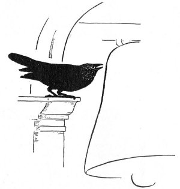
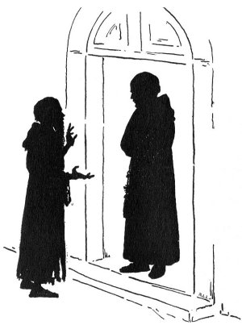
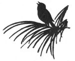

  
[Intangible Textual Heritage](../../index)  [Miscellaneous](../index.md) 
[Index](index)  [Previous](tl09)  [Next](tl11.md) 

------------------------------------------------------------------------

p. 77 p. 79

[  
Click to enlarge](img/07900.jpg.md)  
THE GIRALDA, Seville, Spain  

p. 81

### THE RAVEN OF THE GIRALDA

ONCE upon a time, a wise raven lived in the top of the Giralda, the
Moorish bell tower of the cathedral in Seville, Spain. The raven was
old, so old that his head was not black, but gray. The tower, too, is
old, and is crowned by the large, bronze figure of Faith which serves as
a weather vane. For four centuries, el Girandello, the weather vane, has
turned with the wind; and it was four centuries ago, that the raven was
living in the tower. All day, he would sit on his perch, with his
learned head cocked on one side as he sleepily studied the stonework of
the belfry, or alertly discussed weighty matters with his bird comrades
and with the wind. At night, he was often deep in talk with his special
friend, the owl, who, when tired of roaming through the tops of the
giant palm trees or of prowling into out-of-the-way nooks in the
cathedral roof, liked to tell of his adventures. For, in night
wanderings, the owl sometimes flew near the quiet Guadalquiver which
flowed by Seville, and he heard the river murmur tales of the Tower of
Gold on its bank; or he peered into the gardens of the Alcazar where
Spanish kings had long had their palace, and heard, from the moonbeams,
tales which, when repeated, made even the raven's sober thoughts turn
sprightly. What the raven liked best to hear was what the owl, or any
one else, could tell of the Giralda itself or of the mighty Cathedral
below the tower. For the raven cared for nothing in the world so much as
he cared for this tall tower, up whose winding

p. 82

passage, of three hundred feet, men had ridden on horseback, almost to
the very top. Yes, with his own eyes he had seen those riders. Before
the days of the riders, in the time when the bells of the Giralda
summoned the Moors to prayer, there had been, on the spire, four large,
gilded, copper balls that shone like golden apples. After an earthquake
had thrown down the copper balls, el Girandello was placed on the top of
the dome. The raven considered himself the owner of el Girandello and,
in truth, of all the Giralda. Who, but himself, had perched on the sills
of the twin windows that looked out, high in the tower, over the
white-roofed Seville? Who, but himself, had stood upon the helmet on the
head of el Girandello? Not the owl!--the raven saw to that! And not
another bird of his acquaintance, surely! He knew himself to be the
oldest raven in the world; he knew himself to be the wisest raven in the
world;--and he certainly owned the whole of the Giralda!

The raven, in short, was entirely satisfied with his belfry and its
bells. It was a rectangular belfry, and on the four faces of the
rectangular stage, high up, were inscribed the four words: *Turris . . .
Fortissima . . . Nomen . . . Domini*. [\*](#fn_1.md)
The great bells, each christened with holy oil, had their own names.
There were Santa Maria and San Juan; there was la Gorda, or The Fat;
there was brave San Miguel; there was el Cantor, or The Singer; and
there was many another. At times, the bells rang softly through the
still air that hovered over the flat-roofed city. At other times, they
rang out with such noisy clamor that the vibration penetrated the houses
farthest away, and the raven of the Giralda clung to his stone

p. 83

perch as closely as the leaves of the cocoa tree cling to their twigs.
The raven liked el Cantor better than all the other bells. He couldn't
sing a note himself, but he liked this singing bell, with its especially
clear tone. On spring evenings when the fragrance of orange blossoms and
acacias filled the

 

air, The Singer would peal forth such a glad note that the people down
in the street would say, "El Cantor is feeling fine tonight"; and the
raven, up in the tower, would croak loudly with him, though he never
croaked with any other bell.

p. 84

Now it happened that the wind, even more than the owl, was a friend of
the raven. This was not only because the wind was usually a gentle,
lovable, sunny-hearted fellow, but because he was always around the
tower, day and night, whereas the owl hid all day. When the raven felt
like talking, the wind was always on hand to listen. That was a friend
worth having! The wind, too, often told capital stories.

One afternoon, the wind told the raven an astonishing tale. The wind had
it from the owl who, in turn, had it from the *passarinno*--that small,
gray bird who sings like an angel. To this *passarinno*, the story had
come down from his ancestor, of a much earlier time. That ancestor had
told it to the wind of his day, who wafted it to the ears of King
Alfonso, the Sage. Perhaps, in the later days, it had grown by traveling
(*passarinno* to owl, owl to wind, wind to raven); for, when Alfonso, in
the thirteenth century, wrote the tale in his big book of *Cantigas*, it
wasn't just like the *passarinno's* story to the owl three centuries
later. Would you like to hear the tale? Anyone may hear it. To believe
the tale as it should be believed, and to understand it aright, you must
be able to know the power of melodious sounds, as truly as the blind
organist of Seville Cathedral knew that power. If you do not know
anything about the music of the trees, or the music of the birds, or the
music of the air, you may as well stop reading this story and gather
nuts instead. Listen to the tale, if you will; here it is, as the wind
told it to the raven.

"For, sir," began the wind," it was a *passarinno* who told the owl and
the owl told me. The owl had been praising the

p. 85

voice of the *passarinno*, but the *passarinno* protested and said,

'My voice is nothing compared to the voice of my ancestress--the
*passarinna* [\*](#fn_2.md) who entranced the monk.'
Now, pray, explain your words,' said the owl. The *passarinno* answered,
pleasantly, 'Sit comfortably and I will tell you all.' They were in the
garden of the Alcazar and were perched on a tall cocoa tree. The owl
settled himself on a wide, sweeping leaf, and the *passarinno* perched
himself on a leaf above.

'My ancestress,' the *passarinno* went on, 'was the most marvelous
singer ever known. Her home was in the garden, just outside the Court of
Oranges beside the Giralda, and when she was singing she would look up
at the tower. But she rarely was heard by anyone, because she chose to
live in the unfrequented part of the great garden. One morning a monk
came, very slowly, along the path that led to the shrubbery where the
*passarinna* lived, and my ancestress knew at once three things about
that monk: first, that he was good; second, that he was old; third, that
he was weary. The monk sat down, rather heavily, beside the fountain
that was sending a cool, orange-scented, shimmering spray of water into
the air. Leaning over the edge of the pool, he bathed his hands in the
clear water and bathed his face. The *passarinna* could plainly see how
refreshing, to the tired monk, the water felt; for there came into his
face a look like the look on a parched tree when a shower renews it. The
weary lines on the monk's brow passed away, as cloud-bars vanish from
the evening sky, leaving fairness and tranquillity. He sat, for some
time, with a smile on his face, looking up at the tree

p. 86

tops and at the Giralda beyond. Then, kneeling down--and his knees were
not as stiff as when he entered the garden--he prayed aloud that he
might be permitted to know what the happiness of Paradise would be like.
It was at that moment

 

the *passarinna*--marvelous ancestress of mine--began to sing.

'The monk rose from his knees, and, with a smile on his face, seated
himself in the thickest part of the shrubbery, where he could see the
*passarinna* and where the *passarinna* could see him. That bird of
birds sang on and on, now softly, now triumphantly, now wistfully, now
ecstatically. There was such charm in her singing, all the leaves forgot
to rustle. There was such charm in the melody, the water in the fountain
ceased moving--the breezy air was hushed and wondering--the day faded
imperceptibly into night, and the stars came nearer earth to hear the
song. Still the *passarinna* sang on and on and on. Still the monk
listened happily, with an exalted look in his eyes, and was unaware of
the passing of hours or of days. As the *passarinna* continued her
heavenly song, time itself

p. 87

stopped, though life went on. . . . The monk listened, listened in
rapture, while joyous satisfaction held his whole being . . . . . . . .
. . . . . . . . .

 

'Late one afternoon,' went on the *passarinno*, 'there came to the door
of the monastery near the Giralda, an

p. 88

aged, worn-looking man, long-bearded, and in shabby monk's dress. The
prior himself answered his knock and said, "Who are you, poor stranger,
and what do you want?"

'The monk stammered in much confusion, "Good father, I belong here . . .
I left the monastery this morning for a walk. . . . I come back--all is
changed. I do not understand. The trees look different . . . the
monastery is larger . . . you are not my prior . . . nothing is the
same. Where am I? . . . What has happened since morning? . .

I heard a bird sing, and I was so entranced with the song I may have
stayed away too long."

'The prior and the brother monks who had now come to the door looked at
one another in surprise, and said, in low tones, "He is evidently not
himself. . . . The man does not know what he says."

'The prior then spoke to the man, kindly, saying, "What is your name?"

"I am Brother Jubilo," the monk replied; "I mean, . . . he stammered,
"that was my name in the monastery . . . that was what I was called this
morning."

'The oldest monk among those at the door now looked thoughtful. It was
to him that the others always turned whenever any knowledge of the past
was wanted. "Attend my words," he suddenly said to the prior. "Three
hundred years ago a brother monk, named Jubilo, wandered off and was
never again seen. My Father--my brother monks--I

p. 89

am of the opinion that we have before us, this day, a true marvel! I am
sure this poor monk and that Jubilo, of three hundred years ago, are the
same!"

'Then the prior, believing, took the monk warmly by the hand and brought
him into the monastery, and all rejoiced.'

'That, 'said the *passarinno* to the owl, 'is the story of my
ancestress, the *passarinna* of long ago. The Giralda knows I speak
truth.'

And the wind, as he finished the tale, remarked, "That's all the story,
sir; but the *passarinno* does speak truth."

"Truth it is," replied the raven, "and I'll keep the story going."

Then the sunny wind brushed the tail feathers of the raven and blew
along his leisurely way, through the streets of Seville.

The raven sat stolidly in his niche, gazing with keen eyes at the city
spread out below the Giralda--its flat-roofed houses gleaming in soft
colors, from blue and gray to palest pink. He watched the women watering
their carnations on the roofs. He saw the motionless, dusky
Guadalquiver, in the late afternoon light. His eyes followed the group
of boys coming to the Cathedral to practice their solemn dance. Turning
his wise, old head, he looked toward the gardens of the Alcazar, then
down at the Court of Oranges, and at the roof of the vast Cathedral
below him--its parapets, and buttresses. His roving gaze went all over
the city until sundown. The bells of the Giralda sent out their evening
peal, and el Cantor's vibrating

p. 90

tone fell softly on the waiting breeze. The raven sturdily croaked,
croaked, until el Cantor stopped singing; then, humping himself into a
ball, he tucked his head under his feathers and went to sleep.

 

 

------------------------------------------------------------------------

### Footnotes

[82:\*](tl10.htm#fr_1.md) The name of the Lord a
most steadfast tower.

[85:\*](tl10.htm#fr_2.md) *Passarinna* (the feminine
form of *passarinno*) is the diminutive of the Old Spanish *pasara* (in
modern Spanish, *pajara*). The nearest equivalent today is Passerina
(sparrow), the painted finch.

------------------------------------------------------------------------

[Next: The Goblin of Giotto's Tower](tl11.md)
