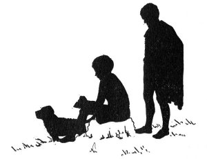
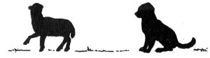

  
[Intangible Textual Heritage](../../index)  [Miscellaneous](../index) 
[Index](index)  [Previous](tl10)  [Next](tl12) 

------------------------------------------------------------------------

p. 91 p. 93

[  
Click to enlarge](img/09300.jpg)  
GIOTTO'S CAMPANILE, *Florence, Italy*  

 

p. 95

### THE GOBLIN OF GIOTTO'S TOWER

NO ONE has ever seen the goblin of Giotto's Tower, though many have
heard its voice and any flower vender, in the busy square in Florence
where the tower stands, can tell you the legend of the little goblin.
This lively sprite is the real guardian of Giotto's Campanile, or
Shepherd's Tower. When one mounts the stairs of the tower, a gentle
voice is heard below, saying:

"Go on, go on, Signora,  
Go up the stairs,--oh, go!  
Be not afraid, my Lady,  
For I am here below."

\[paragraph continues\] Some people think
this encouraging word comes from the guide or from a fellow-sightseer.
For it's oddly true that fully half the grown-ups in the world and
one-sixth of the children never see goblins or fairies even when the
little beings are cutting capers directly in front of their noses. Yet,
in Florence, there is many a "folletto" or protecting spirit, fairy or
goblin, who gives special favor to anything worth while. Now every one
knows that Giotto's Tower is decidedly worth while, for it is one of the
most beautiful towers ever built. So, of course, it has its own
"folletto," for all time. On moon-lit nights, you can often see the
shadow of the "folletto," if you look at the left of the center
bas-relief, on the west side of the tower--the bas-relief that shows the
herdsman, Jabal, sitting in his tent and looking out at his sheep and a
lamb. A wise, little puppy is sitting at the right, outside the tent,

p. 96

with his careful eyes on the sheep. But, just as you come near the
shadow of the goblin, (for you are sure it is the actual shadow) to--it
is gone!

A few miles northeast of Florence, the town of Fiesole perches on a high
hill, and a few miles beyond Fiesole, is the small town of Vespignano,
nestling high up in the Apennines. Six centuries ago, the rolling fields
and green trees of Vespignano looked much as they do today, and the
ilex, the 'oak and the olive gave a welcome shade to the herdsman.
Beneath a wide-spreading oak tree, one sunny, spring day, in the year
1286, a ten-year-old boy lay on the grass, his chin resting in his
hands. His father's sheep were grazing all over the field. Giotto's eyes
were not on the sheep this moment, but on the gnarled, gray-green olive
trees, far off on the hills. There was always so much for Giotto di
Bondone to see, while he was tending the sheep, that the hours of the
long day flew like the wind, and, if his little dog hadn't been always
on the alert for straying lambs, who knows what might sometimes have
happened? But the good dog, hardly more than a puppy, was occupied, hour
after hour, with his serious work of watching the sheep, so that the
boy, ever on the look-out for the things of interest in the near field
or on the distant hills, could let his thoughts roam, free as a bird,
wherever they liked.

Giotto was a boy who loved to draw, and he was constantly looking,
looking at the things around him with the thought of putting them on his
slate. He kept by him a piece of slate on which he would draw, with a
pointed stone, whatever attracted his eye. Even when he wasn't drawing,
he liked to look at a tree, a goat, or anything whatever, and think

p. 97

how he might draw it so that it would look just as solid on his slate as
it looked in the field. Sometimes he would laughingly watch his little
dog barking excitedly at a straying sheep; sometimes he would gaze
absorbedly at one of the sheep standing still, or at the thick neck of a
donkey in a neighboring field; or, with half-shut eyes, he would
dreamily follow the motions of some boys climbing into the great oak
which stood farther up on the hillside. He never tired of watching the
way the wind turned back the oak leaves and lifted them in masses that
emphasized the solid structure of the tree. The birds, too, that at
times, came very near him, especially pleased him; for they had a habit
of standing in attentive little groups, as if, he said to himself, they
were waiting for some one to talk to them. For several minutes, he would
silently watch them, until, at last, his chuckling laugh would send them
flying away.

Yet Giotto's father remarked to a neighbor, "A fine boy to work is that
boy of mine! . . . He's almost old enough to apprentice to the wool
merchant."

There had been in the flock of sheep, until three days ago, one little
lamb so fond of Giotto that it would never roam around the field with
the other lambs and sheep, but would stay, all day, close to the boy's
side. Under the oak tree where Giotto was now lying, was a large, flat
stone on which the lamb used to lie. In fact, the lamb had liked so much
to lie there that Giotto had named the stone The Lamb's Stone. Giotto
had told one of his boy friends that this lamb truly talked to him. "*Da
vero*," declared Giotto, with a twinkling smile, "the lamb often asks me
to lie down with it on

p. 98

this big stone." So, to please the lamb, Giotto would sometimes put his
head down on the stone. Three mornings ago, the little lamb, at first
full of frisky gambols as usual, became quiet and somehow not like
itself. By afternoon, it had become unable to stand, and suddenly, to
Giotto's dismay, appeared too weak to live. Just as Giotto realized
this, the lamb had raised its head from the stone where it lay, and
said:

"Giotto, be not astonished  
That I thus speak to thee;  
I have such love for thee,  
Wherever thou shalt go,  
I will follow thee always  
In the form of a fairy; [\*](#fn_3)  
And through my favour  
Thou shalt become a great sculptor  
And artist."

\[paragraph continues\] Then the lamb had
died.

Today, Giotto, dreaming deep day dreams under the oak tree, saw
everything near and far, especially the near. A herdsman, going down the
slope, took his attention, for, to Giotto, the figure of the man looked
thick and solid, surprisingly solid, outlined against the field. The
sheep, cropping the grass, seemed continually to give new turns to their
placid heads. The boy liked to look at the actual form of anything. His
rambling thought now went back to his little lamb on that morning when
it had been frolicsome and had stood with a funny, thoughtful turn of
its head before it took droll, capering steps. Presently Giotto took up
his slate and began to

p. 99

draw, saying aloud, "*Agnello mio*, I'm going to draw you exactly as you
looked." Gradually, there appeared on the slate the form of the spirited
little lamb. So intent was the boy on his drawing that he didn't notice
a man who had been watching the growing picture of the lamb. When Giotto

 

finally looked up a moment from his drawing, he was astonished to see,
standing near him, a man in the dress of a noble.

"Boy," said the man, "I see you like to draw."

Giotto gave a quick glance straight at the face of the man, and smiled.

"That lamb must be your own lamb; it's so natural it looks alive," added
the man.

A twinkle came into Giotto's eye. Yet he felt, at once, stirred within
himself. Who could this great man be who

p. 100

cared to stop beside a mere boy to look at his drawing? Something about
him drew Giotto strongly.

"My boy," said the noble, "have you a father?"

"*Si, Signore*," replied Giotto, wonderingly.

"When you go home," continued the man, "ask your father if he will let
you go to Florence to study drawing under me. I should like to have you
in my workshop. My name is Cimabue."

Then the boy rose quickly, and with a flush in his face, said,
stammeringly, "I will, *Signore* . . . I will ask him to-day." For
Giotto had, of course, heard of the great artist, Cimabue--the greatest
painter of the time--and could hardly believe his own good fortune.

"You would like to study drawing?" went on Cimabue.

"*Si, Signore*," said Giotto, with all his heart in his voice. Like to
study drawing? . . . Like to study under the great Cimabue? . . . Wasn't
drawing the one thing in life he wanted to do? . . . Something within
him shouted for joy!

Then Cimabue, looking down again at the drawing on the slate, put his
hand on the boy's shoulder and said, somewhat gravely, "You have taught
me something, *mi’ figlio*, and it may be that I can teach you
something." With a pleasant nod, he walked on, leaving the young Giotto
in a whirl of new ideas.

The noble seemed to the boy the most wonderful person he had ever seen.
No one before had ever noticed his drawing. No one had ever told him
that it was worth while for him to draw. He drew because he felt he
must. How kind

p. 101

a voice the man had! How he had looked and looked at this simple little
lamb! Giotto had now a keen desire to see the paintings which Cimabue
had done; for a man like that would surely paint glorious pictures. The
thought of going to Florence to study drawing under him rushed through
his whole being, as a mighty wind rushes through the trees. Something
within him was suddenly freed. He felt lifted up and tingling with
joyful expectation; all because of a compelling power in the noble, a
power which the boy could not explain. He felt as though he himself,
some day, would do great things--he, only Giotto di Bondone, watching
his father's sheep!

 

Years passed. The wool merchant lost "a fine boy for work," but the
world gained a great artist. Giotto painted at Assisi, Padua, and
Florence, frescoes of such power and freedom that all who saw them
realized that here was an entirely new way of expressing life. For the
man Giotto looked at men with the same understanding eyes with which the
young Giotto had watched the sheep and the oak trees on the hillside;
and he painted his human figures in firm reality as he had dreamed of
doing. As a boy, he had looked with his own eyes; as a man, he still
looked with his own eyes; and, because he so looked, painting, in his
hands, became a new thing.

When the Cathedral in Florence was built, Giotto designed and commenced
the Campanile, the beautiful bell tower. Some of the bas-reliefs are his
own work; some are by his friend and pupil, Andrea Pisano; and some,
which are by other sculptors, are carved from Giotto's designs. The
bas-relief of Jabal--whoever made it--has, in it, a thought of the small

p. 102

hill-town of Vespignano and the brown-skinned boy with his sheep.

When you stand near the Shepherd's Tower--Giotto's Tower--in the midst
of the fruit and flower venders, you will see, from pavement to cornice,
exquisite paneling of white marble, red porphyry, and green serpentine
that is like the soft green of Giotto's field. You will see finely
wrought capitals of the windows, lace-like design, and beauty,
everywhere. If you belong to the portion of the world that never sees
goblins, you will not see even the shadow of the goblin of the tower. If
you belong to the fortunate portion that sees and

hears all that there is to see and hear, you will easily believe the
tale of Lucia, the flower vender, when she points to the bas-relief of
the little lamb outside Jabal's tent and says: "The folletto of this
tower is Giotto's lamb, you understand; yes, the lamb's spirit it is
that guards so well our beautiful tower."

When you mount the stairs you will hear a voice saying encouragingly:

"Go on, go on, Signora,  
Go up the stairs,--oh, go!  
Be not afraid, my Lady,  
For I am here below."

\[paragraph continues\] As you hear the
voice, you will have a momentary glimpse of a boy on a far-away hillside
playing with his little lamb, and you will know that you really hear the
voice of the spirit of the lamb--the guardian spirit of Giotto's Tower.

 

 

------------------------------------------------------------------------

### Footnotes

[98:\*](tl11.htm#fr_3) Folletto.

------------------------------------------------------------------------

[Next: The Leprechaun of Ardmore Tower](tl12)
