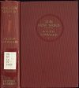
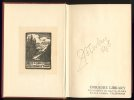
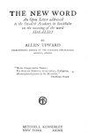

  
[Intangible Textual Heritage](../../index)  [Miscellaneous](../index.md) 
[Index](index)  [Next](tnw01.md) 

------------------------------------------------------------------------

*The New Word*, by Allen Upward, \[1910\], at Intangible Textual
Heritage

------------------------------------------------------------------------

# THE NEW WORD

## An Open Letter addressed

## to the Swedish Academy in Stockholm

## on the meaning of the word

## IDEALIST

###### BY

### ALLEN UPWARD

###### CORRESPONDING MEMBER OF THE PARNASSUS PHILOLOGICAL SOCIETY, ATHENS

<table data-border="0">
<colgroup>
<col style="width: 100%" />
</colgroup>
<tbody>
<tr class="odd">
<td data-valign="top">
"Never change native Names; 
For there are Names in every nation, God-given, 
Of unexplained power in the Mysteries." 
                                  <em>Chaldæan Oracle</em> 
</td>
</tr>
</tbody>
</table>

#### MITCHELL KENNERLEY

#### NEW YORK

\[1910\]

[  
Click to enlarge](img/cover.jpg.md)  
Front Cover and Spine  

[  
Click to enlarge](img/inside.jpg.md)  
Inside front cover (note Autograph)  

[  
Click to enlarge](img/title.jpg.md)  
Title Page  

[  
Click to enlarge](img/verso.jpg.md)  
Verso  

Scanned at Intangible Textual Heritage, February 2006. Proofed and
formatted by John Bruno Hare. This text is in the public domain in the
United States because it was published prior to January 1st, 1923. These
files may be used for any non-commercial purpose, provided this notice
of attribution is left intact.

------------------------------------------------------------------------

[Next: Table of Contents](tnw01.md)
