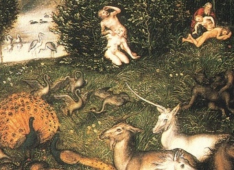

  
[Intangible Textual Heritage](../../index)  [Miscellaneous](../index) 

------------------------------------------------------------------------

[Buy this Book at
Amazon.com](https://www.amazon.com/exec/obidos/ASIN/0766185303/internetsacredte)

------------------------------------------------------------------------

<table width="75%">
<colgroup>
<col style="width: 50%" />
<col style="width: 50%" />
</colgroup>
<tbody>
<tr class="odd">
<td width="50%" data-valign="TOP"></td>
<td width="50%" data-valign="CENTER"><h1 id="the-unicorn-a-mythological-investigation" data-align="CENTER">The Unicorn: A Mythological Investigation</h1>
<h2 id="by-robert-brown" data-align="CENTER">by Robert Brown</h2>
<h4 id="section" data-align="CENTER">[1881]</h4></td>
</tr>
</tbody>
</table>

------------------------------------------------------------------------

[Contents](#contents)    [Start Reading](tu00)

------------------------------------------------------------------------

|                                                                                                                           |
|---------------------------------------------------------------------------------------------------------------------------|
|  |

This short book covers some of the same ground as the more popularly
oriented [Lore of the Unicorn](../lou/index), by Odell Shepard, before
it ventures into comparative mythology. The present volume was written
in the late 19th century at a time when all mythological and folklore
narratives were believed to be astronomical metaphors. Brown sees the
Unicorn as a lunar symbol, and draws on mythology from a wide range of
sources to make his case, from Northern European to Vedic and
Zoroastrian. He uses some idiosyncratic jargon; e.g. 'Kamic' means
Ancient Egyptian.

------------------------------------------------------------------------

 [Title Page and Front Matter](tu00)  
[Foreword](tu01)  
[Contents](tu02)  
[I. The Heraldic Unicorn](tu03)  
[II. Opinions Respecting the Terrestrial Existence of the
Unicorn](tu04)  
[III. The Unicorn In Archaic Art](tu05)  
[IV. Deus Lunus](tu06)  
[V. The Lunar Phases](tu07)  
[VI. Hekatê](tu08)  
[VII. Medousa the Gorgô](tu09)  
[VIII. Inô and Melikertes](tu10)  
[IX. The Three-Legged Ass of the *Bundahis*](tu11)  
[X. Aspects of the Moon](tu12)  
[XI. The Contest Between the Lion and the Leopard](tu13)  
[XII. The Lion and the Unicorn](tu14)  
[Abbreviations](tu15)  
[Index](tu16)  
