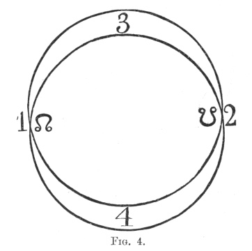
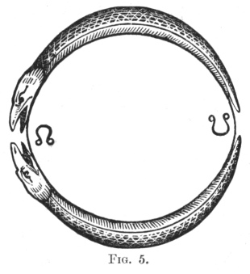

  
[Intangible Textual Heritage](../../index)  [Miscellaneous](../index) 
[Index](index)  [Previous](tu11)  [Next](tu13) 

------------------------------------------------------------------------

[Buy this Book at
Amazon.com](https://www.amazon.com/exec/obidos/ASIN/0766185303/internetsacredte)

------------------------------------------------------------------------

*The Unicorn, a Mythological Investigation*, by Robert Brown, \[1881\],
at Intangible Textual Heritage

------------------------------------------------------------------------

p. 69

### SECTION X

#### ASPECTS OF THE MOON.

LIGHT being pleasant to man and Darkness more or less awful, the
original aspect of the Moon is a friendly and favourable one as the head
of nocturnal kosmic order, the beneficent Unicorn, the 'Righteous' Ass
of the *Bundahis*, who is hated and warred against by the powers of
evil. But the Moon may be the friend as well as the enemy of Night, and
as such becomes Gorgonian and terrific, connected with witchcraft, evil
demons, 'wicked apparitions,' [1](#fn_279) and
all the power and horror of great darkness; whilst its changing form
admits of monstrous concrete representation in art and fancy.

With reference to the Sun; the Moon may with almost equal propriety
appear as the sire, mother, brother, sister, husband, bride or nurse of
the mighty star; friendly to the Sun, as Inô or Sin; hostile as the
Unicorn; pursued by or pursuing the Sun.

When civilization progresses sufficiently to possess a Calendar, the
Moon, as time-measurer, lends invaluable assistance, and marks the
months.

As lord of moisture and humidity, the Moon is

p. 70

connected with growth and the nurturing power of the peaceful night.

The Moon too, like the Sun, speaks of a future life, so that even the
rude Congo Negro claps his hands and cries, 'So may I renew my life as
thou art renewed;' [1](#fn_280) and in the
famous Namaqua-myth 'the Moon once sent the Hare to Men to give this
message, "Like as I die and rise to life again, so you also shall die
and rise to life again."' [2](#fn_281)

According to the anthropomorphic principle the Moon appears in male or
female form, and is symbolically connected with the Bull or Cow, Unicorn
or Horse, Serpent, Dog and Cat, with the latter animal probably on
account of phenomena of periodicity, cats’ eyes shining in the dark,
etc. [3](#fn_282) It is also at times a pearl
or a good fairy. [4](#fn_283)

Regarded as a locality, it often appears as the abode of departed souls.
So in the Kamic *Book of the Respirations*, which is probably of the
epoch of the Ptolemies, the wish is expressed respecting the deceased,

'That his soul may rise to heaven in the disk of the Moon.' [5](#fn_284)

Such are some of the principal mythological lunar aspects. If the savage
at times regards her

p. 71

as cleft in sunder by the angry sun, the poet at times also has his mere
fancies—fancies as distinguished from the ordinary growths of
mythology—and compares her to a lunatic and dying lady, tottering forth

                             'Led by the insane  
And feeble wanderings of her fading brain.' [1](#fn_285)

But in health we do not speak thus, and so to this same great singer in
a nobler moment she is an orbed maiden with white fire \[white gold\]
laden.'

 

More grandly did Milton see her, in his stately vision, throwing 'her
silver mantle o’er the dark,' even as Homer and Tennyson saw

                  'The stars about the moon  
Look beautiful, when all the winds are laid,  
And every height comes out, and jutting peak  
And valley, and the immeasurable heavens  
Break open to their highest.'

p. 72

I append two Figures [1](#fn_286) illustrating
the origin of the terms Caput and Cauda Draconis as applied to the
moon's nodes (knots), or the two points in the heavens where the moon's
orbit intersects the plane of the ecliptic.

The circling path of the sun becomes similarly the

 

\[paragraph continues\] Time-serpent,
Kampê ('Caterpillar'), a monster slain by the solar Dionysos. [2](#fn_287) These two lunar serpents, twin
crescents, the increasing and decreasing moon, and whose combination
makes the full moon, are the two bulls which draw the moon-car on its
path through space. [3](#fn_288)

------------------------------------------------------------------------

### Footnotes

[69:1](tu12.htm#fr_279) *Akkadian Hymn*
(*W.A.I.* iv. 17).

[70:1](tu12.htm#fr_280) Tylor, P.C. ii. 272.

[70:2](tu12.htm#fr_281) *Ibid*. i. 320.

[70:3](tu12.htm#fr_282) Vide Dr. Hyde Clarke,
*On the Relations between Pasht, the Moon, and the Cat, in Egypt*, in
*T.S.B.A.* vi. 316 *et seq.*

[70:4](tu12.htm#fr_283) Vide Gubernatis,
*Zoological Mythology*, i. 54, 56.

[70:5](tu12.htm#fr_284) Ap. M. de Horrack
(*R.P.* iv. 121). On this subject vide Plutarch, *De Facie in Orbe
Lunae;* Tylor, *P.C.* ii. 64; R. B. Jr., *The Archaic Solar Cult, of
Egypt*, 37.

[71:1](tu12.htm#fr_285) Shelley, *The Waning
Moon*.

[72:1](tu12.htm#fr_286) Vide Maurice, *Indian
Antiquities*, ii. 201.

[72:2](tu12.htm#fr_287) Apollod. I. ii. 2;
Diod. iii. 72.

[72:3](tu12.htm#fr_288) Vide P.
[68](tu11.htm#page_68), Note [1](tu11.htm#fn_277).

------------------------------------------------------------------------

[Next: XI. The Contest Between the Lion and the Leopard](tu13)
