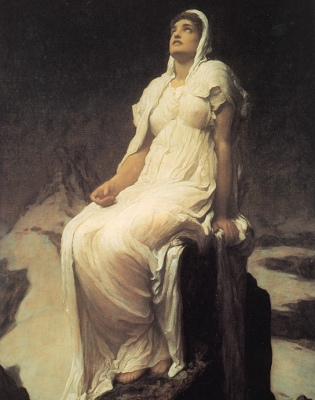

  
[Intangible Textual Heritage](../../index)  [Miscellaneous](../index.md) 

------------------------------------------------------------------------

[Buy this Book at
Amazon.com](https://www.amazon.com/exec/obidos/ASIN/B0029ZA43W/internetsacredte.md)

------------------------------------------------------------------------

<table width="75%">
<colgroup>
<col style="width: 50%" />
<col style="width: 50%" />
</colgroup>
<tbody>
<tr class="odd">
<td width="50%" data-valign="TOP"> 
Lord Frederick Leighton, Spirit of the Summit [19th Cent.] (Public Domain Image)</td>
<td width="50%" data-valign="CENTER"><h1 id="the-varieties-of-religious-experience" data-align="CENTER">The Varieties of Religious Experience</h1>
<h2 id="by-william-james" data-align="CENTER">by William James</h2>
<h4 id="section" data-align="CENTER">[1902]</h4></td>
</tr>
</tbody>
</table>

------------------------------------------------------------------------

[Contents](#contents)    [Start Reading](vre00.md)    [Page
Index](pageidx)    [Text \[Zipped\]](vre.txt.gz.md)

------------------------------------------------------------------------

|                                                                                                                           |
|---------------------------------------------------------------------------------------------------------------------------|
|  |

*In all sad sincerity I think we must conclude that
the attempt to demonstrate by purely intellectual processes the truth of
the deliverances of direct religious experience is absolutely
hopeless...It would be unfair to philosophy, however, to leave her under
this negative sentence. Let me close, then, by briefly enumerating what
she can do for religion. If she will abandon metaphysics and deduction
for criticism and induction, and frankly transform herself from theology
into science of religions, she can make herself enormously useful.--[p.
445](vre14.htm#page_445.md)*

William James, one of the founders of modern psychology, delivered the
Gifford lecture in Edinburgh for 1901-2 at a high point in his career.
His theme was a systematic analysis of phases of the process of
religious conversion. He examines (mostly Christian) descriptions of
conversion phenomena. He analyzes psychological phenomena connected with
saintliness, and mysticism. James believed that science and religion are
not incompatible and that both could benefit from each other.

*Production Notes:* This etext was sourced from the Project Gutenberg
etext of this book, based on the Modern Library edition (by internal
evidence), published in 1938. No additional copyright claims were found
on this edition. I acquired a copy of this edition and used the PG etext
as a starting point for the proof file. I added page numbers, footnote
formatting, the index in its entirety, and corrected a number of
paragraph, emphasis and spelling issues to bring the text back into
conformance with the source edition. --*J.B. Hare, April 27, 2008*.

------------------------------------------------------------------------

 [Title Page](vre00.md)  
[Contents](vre01.md)  
[Preface](vre02.md)  
[Lecture I. Religion And Neurology](vre03.md)  
[Lecture II. Circumscription of the Topic](vre04.md)  
[Lecture III. The Reality of the Unseen](vre05.md)  
[Lectures IV and V. The Religion of Healthy Mindedness](vre06.md)  
[Lectures VI and VII. The Sick Soul](vre07.md)  
[Lecture VIII. The Divided Self, and the Process of its
Unification](vre08.md)  
[Lecture IX. Conversion](vre09.md)  
[Lecture X. Conversion—Concluded](vre10.md)  
[Lectures XI, XII, and XIII. Saintliness](vre11.md)  
[Lectures XIV and XV. The Value of Saintliness](vre12.md)  
[Lectures XVI and XVII. Mysticism](vre13.md)  
[Lecture XVIII. Philosophy](vre14.md)  
[Lecture XIX. Other Characteristics](vre15.md)  
[Lecture XX. Conclusions](vre16.md)  
[Postscript](vre17.md)  
[Index](vre18.md)  
[Note on the Author](vre19.md)  
