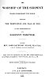

  
[Intangible Textual Heritage](../../index)  [Miscellaneous](../index) 
[Index](index)  [Next](wos01) 

------------------------------------------------------------------------

p. i

##### THE

# WORSHIP OF THE SERPENT

#### TRACED THROUGHOUT THE WORLD;

###### ATTESTING

#### THE TEMPTATION AND FALL OF MAN

###### BY THE INSTRUMENTALITY

###### OF A

### SERPENT TEMPTER.

###### BY THE

## REV. JOHN BATHURST DEANE, M.A. F.S.A.

###### LATE OF PEMBROKE COLLEGE, CAMBRIDGE.

Παρὰ παντὶ τῶν νομιζομένων παῤ ὑμῖν θεῶν ὌΦΙΣ σύμβολον μέγα, καὶ
μυστήριον, ἀναγράφεται.--JUSTIN MARTYR, *Apol.* lib. i. p. 60.

###### SECOND EDITION, CONSIDERABLY ENLARGED.

#### LONDON:

#### J. G. & F. RIVINGTON,

###### ST. PAUL'S CHURCH YARD, AND WATERLOO PLACE, PALL MALL.

#### \[1833\]

NOTICE OF ATTRIBUTION  
Scanned at Intangible Textual Heritage, February 2004. Proofed by John
Bruno Hare. This text is in the public domain worldwide. These files may
be used for any non-commercial purpose, provided this notice of
attribution is left intact in all copies.

[  
Click to enlarge](img/title.jpg)  
Title Page  

p. ii

LONDON:

GILBERT AND RIVINGTON, PRINTERS,

ST. JOHN'S SQUARE.

p. iii

IN ADMIRATION

OF DISTINGUISHED TALENTS AND PROFOUND LEARNING

INVARIABLY EMPLOYED IN

THE PROMOTION OF CHRISTIAN TRUTH,

THIS TRIBUTE OF RESPECT

1S INSCRIBED TO

THE REV. GEORGE STANLEY FABER, B.D.

BY

HIS OBLIGED AND HUMBLE SERVANT,

THE AUTHOR.

p. vi

------------------------------------------------------------------------

[Next: Preface](wos01)
