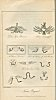
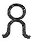

  
[Intangible Textual Heritage](../../index)  [Miscellaneous](../index) 
[Index](index)  [Previous](wos03)  [Next](wos05) 

------------------------------------------------------------------------

p. 39

# THE

# WORSHIP OF THE SERPENT.

### CHAPTER I.

### SERPENT-WORSHIP IN ASIA.

THE WORSHIP OF THE SERPENT is supposed by Bryant to have commenced in
Chaldæa; and to have been the "first variation from the purer
Zabaism [1](#fn_36)."

That it was intimately connected with Zabaism cannot be doubted; for the
most prevailing emblem of the solar god was the SERPENT [2](#fn_37): and wherever the Zabæan idolatry was the
religion, the SERPENT was the sacred symbol. But the UNIVERSALITY of
serpent-worship, and the strong traces which it has left in ASTRONOMICAL
MYTHOLOGY, seem to attest an origin coëval with Zabaism itself.

The earliest authentic record of SERPENT-WORSHIP is to be found in the
astronomy of Chaldæa and China; but the extensive diffusion of this
remarkable superstition through the remaining

p. 40

regions of the globe, where Chinese wisdom never penetrated, and
Chaldæan philosophy was but feebly reflected, authorizes the inference
that neither China nor Chaldæa was the mother, but that both were the
children of this idolatry. That accidental circumstances very materially
affected the religions of the early heathen at different times, by
introducing innovations both in gods and altars, worship and sacrifices,
cannot be denied; but it is equally true, that uniformly with the
progress of the first deviation from the truth, has advanced the sacred
serpent from Paradise to Peru. To follow the traces of this sacred
serpent is the intention of the following treatise: and it is
confidently expected that few ancient nations of any celebrity will be
found which have not, at some time or other, admitted the serpent into
their religion, either as a *symbol of divinity*, or *a charm*, or *an
oracle*, or A GOD [1](#fn_38). Into the creed of
some he

p. 41

has insinuated himself in all these characters, and is so mixed up with
their traditions of the ORIGIN and END of EVIL, that we cannot, without
violence to all rules of probability, reject the consequence--*that the
prototype of this idolatry was* THE SERPENT IN PARADISE.

 

1\. BABYLON.--In tracing the progress of the sacred serpent, we commence
with ASIA, as the mother country of mankind; and in Asia, with BABYLON,
as the most ancient seat of an established priesthood.

The information which we possess concerning the minute features of
Babylonian idolatry, is from various causes very narrowly circumscribed.
Either the classical writers who visited Babylon were not admitted into
the arcana of the Chaldæan worship, or they were contented with giving a
short and summary account of it; ex-pending the chief strength of their
descriptive powers upon the history, policy, and magnificence of the
mother of cities. Herodotus, whose diffuseness on the history and
customs of the Babylonians is considerable, enters but little into their
religion; and Diodorus Siculus, minute in his measurements of the walls
and gardens,

p. 42

comprises his description of the temple of Belus in a few sentences.
Ophiolatreia, as a recognized religion, was nearly extinct when Diodorus
visited Babylon, for the city was almost deserted by its inhabitants,
and the public edifices were crumbling to decay. But the silence of
Herodotus is the more remarkable, since he mentions the serpent-worship
of both Egypt and Greece, which was prevalent in his time. The idolatry
could scarcely be obsolete in Babylon at that period, since it existed
in full vigour but seventy years before, in the days of Daniel; and
though it received a signal overthrow from its exposure by that prophet,
yet the tumultuous conduct of the Babylonians on that occasion, as it
evinces their attachment to the idolatry, warrants the inference that
they would cling to it long after its abolition, even by a royal
decree [1](#fn_39). But most probably Herodotus
did not take the trouble to inquire into the superstitions of the common
people, being content to describe what was the established religion; and
even this he notices in a very cursory manner.

From Diodorus, however, we learn what is sufficient to assure us, that
the serpent, as an

p. 43

object of worship, was not altogether forgotten in Babylon, though
disguised under the more specious appearance of symbolical sanctity. He
informs us, that in the temple of Bel, or Belus, was "an image of the
goddess Rhea, sitting on a golden throne; at her knees stood two lions,
and near her very large SERPENTS of silver, thirty talents each in
weight." There was also an image of Juno, holding in her right hand the
head of a SERPENT [1](#fn_40)."

The name of the national god BEL is *supposed* to signify nothing more
than "Lord;" and was also sometimes appropriated to deified heroes [2](#fn_41). It is more probably an abbreviation of
OB-EL [3](#fn_42),--"*The Serpent-god*." The
Greeks, remarks Bryant, called him BELIAR, which is singularly
interpreted by Hesychius to signify a DRAGON, or GREAT SERPENT [4](#fn_43). From which we may conclude

p. 44

that the serpent was, *at least*, an emblem or symbol of BEL. But if the
apocryphal history of "BEL AND THE DRAGON" be founded upon any
tradition, we must conclude that the dragon, or serpent, (for the words
are synonymous,) was something more than a mere symbol: we must
conclude, that LIVE SERPENTS were kept at Babylon as objects of
adoration; or, *at least*, of veneration, as oracular or talismanic.
This custom was observed at Thebes in Egypt [1](#fn_44), and at Athens [2](#fn_45); and therefore there is nothing incredible
in the fact at Babylon. However suspiciously then we may regard the
apocryphal writings in general, we are constrained to admit that the
author of "Bel and the Dragon," though he may have embellished the
narrative, has given us a true picture of Babylonian superstition.

In that same place there was a GREAT DRAGON, which they of Babylon
WORSHIPPED. And the king said unto Daniel, 'Wilt thou say that this is
of brass? lo! he eateth and drinketh:

p. 45

thou canst not say he is no LIVING GOD: therefore WORSHIP HIM.'"

From the Chaldæans, we are told, that the Hebrews obtained the word
ABADON, as a title of the "Prince of Darkness." This word may signify
THE SERPENT-LORD." Heinsius [1](#fn_46) (cited
by Bryant) makes Abadon to be the same as the Grecian Python. "It is not
to be doubted that the Pythian Apollo is that evil spirit whom the
Hebrews call OB and ABADON; the Hellenists, APOLLYON; and the other
Greeks, APOLLO. This is corroborated by the testimony of St. John, who
says, "They had a king over them which is the angel of the bottomless
pit, whose name in the Hebrew tongue is Abadon; but in the Greek
(Hellenistic) tongue hath his name Apollyon [2](#fn_47)." This same angel of the bottomless pit,"
is in another place called by the Evangelist, "*the dragon, that old
serpent which is the Devil and Satan* [3](#fn_48)."

Subject to the king of Babylon was Assyria; and the people of this
country are said to have borne "a dragon" upon their standard [4](#fn_49). It is observed by Bryant, that in most
countries the

p. 46

original military standard was descriptive of the deity they worshipped.
It is certain that the Roman soldiers paid great veneration to their
military insignia, almost amounting to worship: from which we may infer,
that the devices on them were, originally, emblems of the gods. Their
chief ensign, *the eagle*, was sacred to Jupiter. From the practice of
the Romans, we may obtain an insight into that of the other nations of
antiquity; for in matters of superstition it is astonishing how nearly
people, geographically the most remote, approached each other.

From the Assyrians, the emperors of Constantinople are said to have
borrowed the dragon standard [1](#fn_50). The
same standard was also borne by the Parthians [2](#fn_51), Scythians [3](#fn_52), Saxons [4](#fn_53), Chinese, Danes [5](#fn_54), and Egyptians,--people who were in a
greater or less degree addicted to serpent-worship. We may therefore
infer, that the dragon ensign of the Assyrians denoted their devotion to
the same idolatry.

p. 47

II\. PERSIA.--The serpent-worship of Persia is more noticed by authors
than that of Babylonia. The dracontic standard distinguished the
Persians as well as the Assyrian; for among the spoils taken by Aurelian
from Zenobia were "*Persici Dracones* [1](#fn_55);" which were doubtless military ensigns,
for the Persians assisted the queen of Palmyra on that occasion. This,
according to our hypothesis, would denote that the Persians venerated
the serpent; an inference which is abundantly proved from their
mythology.

In the mythology of Persia we may look for the remnant of the ancient
Chaldæan philosophy: and in proportion as we establish the prevalence of
ophiolatreia in Persia, in the same proportion, *at least*, we may infer
that it once obtained in Babylon.

So strongly marked was this character of idolatry in the Persian
religion, that Eusebius does not hesitate to affirm, "they all
worshipped the first principles under the form of SERPENTS, having
dedicated to them temples in which they performed sacrifices, and held
festivals and orgies,

p. 48

esteeming them THE GREATEST OF GODS, and GOVERNORS OF THE UNIVERSE [1](#fn_56)."

"The first principles" were Ormuzd and Ahriman, the good and evil deity,
whose contention for the universe was represented in Persian mythology,
by two serpents contending for the MUNDANE EGG. They are standing upon
their tails, and each of them has fastened upon the object in dispute
with his teeth. The egg for which they contend, represented the universe
in the mythologies of India, Egypt, and Persia. An engraving of this may
be seen in Montfaucon. But the EVIL PRINCIPLE was more particularly
represented by the serpent, as we may infer from a fable in the Zenda
Vesta, in which that deity is described as having assumed a serpent's
form to destroy *the first of the human species*, whom he accordingly
*poisoned* [2](#fn_57).

A similar proof occurs in the Sadder [3](#fn_58), where we find the following
precept:--"When you kill serpents, you shall repeat the Zenda Vesta, and
thence you will obtain great merit: for it is the same as if you had
killed *so many devils*." The *Zenda Vesta* to be here "repeated" might,

p. 49

perhaps, be that portion of it above alluded to--the assumption of the
serpent's form by Ahriman. Connected with which, doubtless, was the
popular belief of the Persians, that in the place of torment in the
other world, scorpions and *serpents* gnaw and sting the feet of the
wicked [1](#fn_59).

The God MITHRAS was represented encircled by a serpent: and in his rites
a custom was observed similar to that practised in the Mysteries of
Sebazius [2](#fn_60)--*a serpent* was thrown
into the bosom of the initiated, and taken out at the lower parts of his
garments [3](#fn_61). In Montfaucon, vol. v. are
some plates of Mithras, with a lion's head and a human body; and round
him is coiled *a large winged serpent*. In the Supplement to vol. i.
Montfaucon gives us a representation of a stone found at Lyons. It is a
rude stone, exhibiting the head of a young and beardless man. Under it
is the inscription, "DEO INVICTO MITHIR, SECUNDINUS DAT:" and under

p. 50

the inscription, the raised figure of *a large serpent*. Mithras was
styled "invictus," and often represented with a youthful countenance,
like that of Apollo.

Mandelsoe, who visited an ancient temple at Mardasch, saw in one of the
recesses, "a square pillar, with the figure of a king upon it,
worshipping the SUN, FIRE, and A SERPENT [1](#fn_62)." "On the front of some ancient Persian
grottoes, sacred to the solar deity, was figured a princely personage
approaching an altar, on which the sacred fire is burning. Above all is
the sun, and the figure of the deity in a cloud, with sometimes a sacred
bandage, at other times a SERPENT entwined round his middle [2](#fn_63)."

This is the God AZON, whose name, according to Bryant, signifies "the
sun." The sacred girdle round his waist was esteemed an emblem of the
orbit described by ZON, the sun. Hence *girdles* were called by the
Greeks, *zones* [3](#fn_64).

This deity is sometimes represented differently [4](#fn_65), as a young man in profile, round whose

p. 50

 

[  
Click to enlarge](img/05100.jpg)

 

p. 51

waist is drawn a ring loosely dependent. Through the lower part of this
ring passes a *serpent*. At the upper limb of the circle, behind the
figure, is a kind of mantle, composed of expanded wings.

In Kœmpfer's Amœnit. Exot. the same deity is described in a third form.
He appears terminating at the waist in a *circle*, which is composed of
a *serpent*: from each side of this circle proceed four *wings*. In his
left hand he holds another circle, or ring, composed, like the former,
of a *serpent biting his own tail*. This painting was at Persepolis.
Here is also, in Kœmpfer, p. 312, a figure of a priest of this god, who
appears to be approaching an altar with a *serpent in his left hand*. In
the sky above is a representation of his deity, and behind the God is
the Sun.

The hierogram of the CIRCLE WINGS and SERPENT is one of the most curious
emblems of Ophiolatreia, and may be recognised in almost every country
where Serpent-Worship prevailed. It forms a prominent feature in the
Persian, Egyptian, and Mexican hieroglyphics. China, Hindûstan, Greece,
Italy, and Asia Minor, as distinctly, though more rarely, exhibit it;
and it has even been found in Britain. It seems to

p. 52

have been a general symbol of *consecration*, and as such is alluded to
by the poet Persius:

Pinge *duos angues*; pueri *sacer est locus*.  
 Sat. I. 113.

Here *two* snakes are mentioned, which is the hierogram of the
worshippers of the Two PRINCIPLES, each of whom is represented by a
serpent. Often, however, only one serpent appears issuing from the
winged circle, and sometimes the circle is shorn of its wings. As a
symbol of consecration, the ophite hierogram appears over the portals of
the Egyptian temples, and may be recognised even in those of Java. The
Druids, however, with the consistent magnificence which characterized
their religion, transferred the symbol from the portal to the whole
temple; and instead of placing the circle and serpent over the entrance
into their sanctuaries, erected the entire building itself *in the form
of the ophite hierogram*. Abury in Wiltshire, and Stanton Drew in
Somersetshire, are interesting examples of this construction. The former
represents the ophite hierogram with *one* serpent, the latter with
*two*; the circle in each case being destitute of wings.

On the ruins of Naki Rustan, in Persia, is a beautiful specimen of the
serpent and winged

p. 53

circle. In Egypt the hierogram underwent various transformations, of
which the annexed plate gives a description. One of them, No. 2, is
perhaps the device from which Malachi borrowed his elegant metaphor of
"THE SUN OF RIGHTEOUSNESS arising with healing in his WINGS."

Selden remarks, that the figure 
 in abbreviated writing among the Greeks, signified
Δαιμων, *the deity* [1](#fn_66). The same
figure, according to Kircher, was in use among the Brahmins of
Hindûstan, as the "*character mundi intelligibilis* [2](#fn_67)"--that is, of the Deity; for the universe
and its Creator were often confounded by the ancient heathen. The emblem
is evidently the globe and serpents of Egyptian mythology. In the same
form was erected the celebrated temple of the Druids at Abury in
Wiltshire. The upright stones which constituted the Adytum and its
approaches, correctly delineated the circle, with the serpent passing
through it [3](#fn_68).

In China, this sacred emblem assumed a form

p. 54

unknown in other countries. The serpents were *separated* from the
annulus, being placed on each side of it, regarding each other. This was
probably a representation of the two principles claiming the universe.
This sacred ring between two serpents, is very common on the triumphal
arches of Pekin. In Table XV. of Baron Vischer's Ancient
Architecture [1](#fn_69), is an engraving of
such an arch, and on it is this hierogram twice depicted.

But the most remarkable of all is the Mexican symbol. Here the two
serpents, intertwining, form the circle with their own bodies, and in
the mouth of each of them is a *Human head!*

A similar figure was assumed by the Ophite hierogram when it appeared on
the staff of Mercury, and constituted the Caduceus. The serpents
intertwining formed the circle.

The origin of this symbol is to be found in the deification of the
serpent of Paradise. Its real meaning is involved in much mystery. In
the former edition of this treatise I advanced the opinion, that it
meant nothing more than *the winged serpent once coiled*. But further
consideration has induced me to give up this conjecture

p. 55

as irreconcileable with the connection of the Serpent and *Globe*. The
most probable meaning may be that which I have assigned in the chapter
on Serpent Temples: namely, that it is the hierogram of the Solar Ophite
God OPHEL or APOLLO; and assumed its present shape from the *union* of
the two idolatries of the Serpent and the Sun. For the grounds of this
conjecture I refer to the chapter cited.

At all events it is certain, that the tripartite emblem of the
*Serpent*, *Wings*, and *Circle*, was an hieroglyphic of the DEITY; and
this is sufficient for the purposes of my argument.

The Egyptian priests of a later and more metaphysical age, understanding
this to be the signification of the hierogram, addressed themselves to
the task of discovering the mystery. A most ingenious theory was
accordingly devised by Hermes Trismegistus, who was probably the
high-priest of the God Thoth, or "Thrice-great Hermes," whose name he
assumed in compliance with the universal custom of the religion. The God
Thoth was believed to have been the author of the Egyptian
hieroglyphics.

According to this theory, the GLOBE typified the SIMPLE ESSENCE OF GOD,
which he indifferently

p. 56

called THE FATHER, THE FIRST MIND, THE SUPREME WISDOM. THE SERPENT
emerging from the GLOBE was the VIVIFYING POWER of GOD, which called all
things into existence. This he named THE WORD.

The WINGS implied the MOVING or PENETRATIVE POWER of GOD, which pervaded
all things. This he called LOVE.

The *whole* emblem was interpreted to represent the SUPREME BEING in his
character of CREATOR and PRESERVER [1](#fn_70).

The definition of the Deity by TRISMEGISTUS is poetically sublime: "GOD
is a CIRCLE whose CENTRE is EVERYWHERE, and CIRCUMFERENCE NOWHERE. [2](#fn_71)"

The above description of the ophite hierogram, as may well be imagined,
has persuaded many an ardent friend of revelation to recognise in this
symbol of the hieroglyphical learning of Egypt, the mystery of the HOLY
TRINITY. Kircher, Cudworth, and Maurice have all embraced this opinion;
but the more cautious FABER [3](#fn_72), with
the arguments of all before him, has come to the conclusion, that the
doctrine of the Trinity,

p. 57

in its Christian sense, was unknown to the Pagans.

That there has been but one essential religion *among the servants* of
the living God, from the fall to the present hour, no reasonable reader
of the Holy Scriptures can deny. There never has been a time in which
TRUE RELIGION has been wholly lost. Some few, if not "seven thousand,"
have always been "left" who "have not bowed the knee to Baal." But for
these few, who have had a right knowledge and clear conception of the
Deity as revealed to Adam, we must look among the holy "remnant," who
were at one time confined to the family of NOAH, and at another to that
of ABRAHAM. The rapidity with which the descendents of Noah fell into
POLYTHEISM forbids our being too sanguine in the hope of discovering the
doctrine of the Trinity among the Gentiles. *This doctrine itself;
corruptly remembered, perhaps gave rise to that very Polytheism which at
length obliterated almost every trace of rational religion in the
world*.

If then "the globe, wings, and serpent," was among the Egyptians the
hieroglyphic of the Trinity, we must suppose that the priests acquired
this doctrine from their intercourse with

p. 58

the Israelites, rather than from any tradition of their ancestors. In
this case, JOSEPH would be the Hermes Trismegistus, so lauded in
Egyptian history, (*as Bryant, indeed, supposes he was*.) Joseph is said
to have "taught" the Egyptian "senators *wisdom* [1](#fn_73):" but *not*, I apprehend, in a religious
sense. The edict of Pharaoh, to which this probably alludes, is of a
political nature [2](#fn_74). It would have been
the extreme of indiscretion for Joseph to have attempted, without a
divine command, to instruct the Egyptians in the mysteries of religion:
and had such a command been issued, it would have been recorded by
Moses. So far from the Egyptians having acquired religious instruction
from the Israelites, every journey in the wilderness performed by the
latter, proves that *they* learned *idolatry* from the Egyptians. "The
golden calf" is a memorable instance, as copied from the rites of the
sacred ox Apis.

Besides, it is more likely that Joseph, in his instructions on the
mysteries of religion, would have begun with his own people, who seem
not only to have been ignorant of the doctrine of the

p. 59

\[paragraph continues\] TRINITY, but of every rational idea of the UNITY
of God, when Moses was commissioned to lead them from Egypt. Of this we
have abundant proof in the diffidence with which he accepted the
commission [1](#fn_75).

So gross was their ignorance, and so deep-rooted their prejudices, that
the doctrine of the Trinity was never, indeed, *fully* explained to
them, even by Moses. He deemed it a doctrine too dangerous for their
idolatrously inclined minds to bear, lest in their ardour for the
Polytheism which it was his object to eradicate, they should separate
the Unity, and dishonour the Trinity--lest in their proneness to worship
the MANY, they should forget that "JEHOVAH their GOD is ONE
JEHOVAH [2](#fn_76)."

I cannot therefore see that there is any conclusive testimony that the
Egyptian hierogram of GLOBE, WINGS, and SERPENT, denoted the Trinity, in
our sense of the term. Indeed, it may be doubted whether the definition
of Hermes Trismegistus, adduced by Kircher, may not have been a "pious
fraud" of some Egyptian Christian of the second or third century, whose
imagination

p. 60

seized upon this popular emblem as a fit instrument for inculcating the
truth.

But, whatever may have been the origin or meaning of this hierogram, one
thing is clear, that the SERPENT attached to it was a TYPE OF DIVINITY;
and this is enough to support the theory of the present volume,--that
The Serpent of Paradise was the SERPENT-GOD of the Gentiles.

 

III\. HINDÛSTAN.--*As an emblem of divinity*, the serpent enters deeply
into the religion of the Brahmins; and, from the popular superstitions
of the present race of Hindûs, we may infer that he was at one time an
object of religious worship. The well known reluctance of the natives of
Hindûstan to kill a snake, cannot be referred entirely to the doctrine
of transmigration of souls. In Forbes's "Oriental Memoirs," we read of
certain gardeners in Guzerat who would never suffer the snakes to be
molested, calling them "father," "brother," and other endearing names,
and looking upon them as something divine. The head-gardener, however,
"*paid them religious honours* [1](#fn_77)."

p. 61

Here we observe a mixture of the original serpent-worship, with the more
modern doctrine of transmigration.

But a more tangible proof that ophiolatreia did indeed exist in
Hindûstan in former times, is furnished in the following fact, noticed
in Purchas's Pilgrims. A king of Calicut "built cottages" for *live
serpents*, whom he tended with peculiar care, and made it a capital
crime for any person in his dominions to destroy a snake. "*The natives
looked upon serpents as endued with divine spirits* [1](#fn_78)."

From some such a notion may have been derived a custom which prevails in
certain parts of Hindûstan to this day. The natives have a festival
called "The Feast of the Serpents," at which every Hindû sets by a
portion of his rice for the hooded snake on the outside of his house. By
this offering he expects to propitiate those reptiles during the
remainder of the year.

A further proof of the ancient prevalence of ophiolatreia in those
countries, is afforded by the sculptures in the celebrated caverns of
Salsette and Elephanta; where the deities either

p. 62

grasp serpents in their hands, or are enfolded by them. Serpents are
also sculptured on the cornices surrounding the roofs of those caverns,
and similarly delineated in the more modern pagodas [1](#fn_79). The god Sani, of the Hindûs, is
represented on a raven, and encircled by two serpents, whose heads meet
over that of the god [2](#fn_80).

Maurice supposes that by the serpentine circle over Sani, who is the
Saturn of the Hindûs, the *ring* of that planet is denoted. If so, the
discoveries of modern astronomy are little more than revivals of the
ancient philosophy. But whether Sani be *Saturn* or the *Sun*, he is
equally illustrative of our theory--that serpents were early emblems of
divinity in Hindûstan. As such we find them employed in the religious
festivals of the Hindûs [3](#fn_81), symbolizing
some of their most awful deities.

Boodh and Jeyne are both adorned with the same emblem. The statue of
Jeyne, who is said to be the Indian Æculapius, is turbaned by a
seven-headed snake: the rim of the pedestal is

p. 63

embossed with serpents' heads. The same serpent also symbolizes Parus
Nauth [1](#fn_82).

On a rock in the Ganges, in the province of Bahar, is a sculpture of
Veshnu reposing on a coiled serpent, whose numerous folds are made to
form a canopy over the sleeping god [2](#fn_83).
This serpent is fabled to have been the goddess Devi or Isi, who assumed
the figure to carry Veshnu over the waters of the Deluge [3](#fn_84). The sleep of Veshnu indicates the period
between the two worlds. A similar sculpture is to be seen among the
ruins of Mavalipuram, on the coast of Coromandel [4](#fn_85). Veshnu himself is sometimes represented
encompassed in the folds of a serpent; and Twashta, the great artificer
of the universe, who corresponds in Hindû mythology with the Cneph or
Ptha of the Egyptians, is supposed to have borne the form of a
serpent [5](#fn_86). Jagan-Nath (Juggernaut) is
said to be sometimes worshipped under the form of a seven-headed
dragon [6](#fn_87). The Hindû Deonaush (the
*Dionusus* of the Greeks,) was metamorphosed into a snake [7](#fn_88): hence, probably

p. 64

the prominent figure which the serpent bore in the mysteries of Bacchus.

Mahadeva (a name of Siva,) is sometimes represented with a snake
entwined about his neck; one round his hair, and armlets of serpents
upon both arms [1](#fn_89).

Bhairava (an Avatar of Siva,) sits upon the coils of a serpent, whose
head rises above that of the god [2](#fn_90).

Parvati, the consort of Siva, is represented with snakes about her neck
and waist [3](#fn_91).

Hence we perceive that the serpent was an emblem not confined to one
god, but common to many. "The fifth day of the bright half of the month
Sravana is also sacred to the demigods in the forms of serpents [4](#fn_92)."

This reptile, though the attribute of many of the Hindû deities, both
benevolent and malignant, belonged more properly to the EVIL SPIRIT, of
whom it is a sacred and terrific emblem. The king of the evil dæmons is
called, in Hindû mythology, "the king of the *serpents*." His name is
NAGA, and he is the prince of the Nagas, or

p. 65

\[paragraph continues\] Naigs. "In which Sanscrit appellation," observes
Maurice, "we plainly trace the Hebrew *nachash*, which is the very word
for the particular serpentine tempter, and, in general, for all serpents
throughout the Old Testament [1](#fn_93)." The
Hindû Naraka, or *hell*, is fabled to consist of poisonous "snakes
folded together in horrible contortions."

The malignant serpent Caliya, who was slain by Veshnu, (in his
incarnation of Crishna), because he poisoned the air, and destroyed the
herds on the banks of the Yamuna, was deified and worshipped by the
Hindûs "in the same manner as Python was adored at Delphi [2](#fn_94)."

To the evil dæmon, in the form of a great serpent, the Hindûs attributed
the guardianship of treasures. A remarkable instance of this
superstition occurs in Forbes's Oriental Memoirs. Having once the
curiosity to open a vault in a deserted tower, in which treasure was
reported to be concealed, under the guardianship of a dæmon in the form
of a snake, he prevailed, with much difficulty, upon two men to descend;
when, in strict accordance with the popular

p. 66

belief, they found a large serpent in a torpid state. The two men were
drawn up, and the reptile destroyed by fire; but nothing could induce
the natives again to enter a place, which they now regarded more than
ever as the residence of the evil spirit.

In Hindûstan prevailed, also, the general opinion which accompanied
ophiolatreia in all its progress--that the serpent was of a *prophetic
nature* [1](#fn_95).

The decay of ophiolatreia in Hindûstan may be readily accounted for by
the exterminating religious wars which so long raged between the
followers of Crishna and Budha. Budha was *the serpent* who carried off
Ella the daughter of Ichswaca, the son of Manu--and hence the animosity
against him. The children (*i.e.* the worshippers) of Budha, were the
real Hindûs, and preserved the ophite sign of their race. They were
distinguished by the banner of the serpent. The worshippers of Crishna
adopted the *eagle*.

The worshippers of Crishna, Budha, and Surya (*the sun*) form the three
idolatrous classes of India from the Ganges to the Caspian sea.

p. 67

\[paragraph continues\] The children of Surya joined with those of
Crishna against the Budhists, and at length almost exterminated the
race. The Mahabharat records constant wars from "*ancient* times"
between the worshippers of the Sun and the *Tak* or *Takshac* races. The
word *Takshac* is frequently rendered "*snake:*" but *Tak* is the name
of a mountain in the range west of India, and *Hak* was the word which
designated a *serpent*. Alexander's ally Taxiles was doubtless an Ophite
chief of this country, for he took him to see an enormous dragon, the
object of worship among his subjects [1](#fn_96). The name *Taxiles* was probably titular,
since he was called *Onuphis* until his father's death. He was then the
priest and king of the Ophites of Tak, and from that very circumstance
called *Onuphis* by the Greeks, who had acquired the knowledge of this
title from their intercourse with Egypt, and her priesthood of ON and
OPH [2](#fn_97).

Pursuing our inquiries, we find that ophiolatreia prevailed to an equal
extent in Cachmere, where there were no less than *seven hundred*

p. 68

*places* in which carved images of serpents were worshipped [1](#fn_98). And even in Tibet may be often seen, the
great Chinese dragon ornamenting the temples of the Grand Lama [2](#fn_99). But the chief seats of ophiolatreia in
this quarter of the modern world were in China and Japan.

 

IV\. CEYLON.--The religion of the natives of Ceylon is the Boodh, which
is a corruption of the ancient ophiolatreia. "The Singalese," says Dr.
Davy [3](#fn_100), "in general rather venerate
than dread the hooded snake. They conceive that *it belongs to another
world*, and that when it appears in this is only a visitor. They imagine
that it possesses great power, and is somewhat *akin to the gods, and
superior to man*. In consequence they superstitiously refrain from
killing it." This is the snake made use of by the serpent charmers. Its
image is also seen round the necks of some of the gods. The mythological
history of this serpent is curious. They live in the world of spirits in
a place peculiarly devoted to themselves, and are said to have a faculty
of locomotion, and a splendour of appearance like the gods.

p. 69

\[paragraph continues\] Nevertheless, they are supposed to have been
once human beings, who forfeited their estate by indulging the sin of
*malice*.

 

V. CHINA AND JAPAN.--The great Chinese DRAGON, so conspicuous in every
public and private edifice, was the symbolical serpent of ancient
mythology, under a more fanciful and poetic form. "It was the genial
banner of the empire, and indicated every thing that was sacred in
it [1](#fn_101)." "It was not only the stamp
and symbol of royalty, but is sculptured in all the temples, blazoned on
the furniture of the houses, and interwoven with the vestments [2](#fn_102)" of the chief nobility. The emperor
bears a dragon as his armorial device; and the same figure is engraved
on his sceptre and diadem, as well as on all the vases of the imperial
palace.

The DRAGON is also mixed up with many of their religious legends. The
Chinese believe that "there is a dragon of extraordinary strength and
sovereign power, *which is in heaven, in the air, on the waters, and on
the mountains* [3](#fn_103)." A property so
divine must have originated in the

p. 70

attribution of this sacred animal to the Creator of the universe. For
though it might apply partly to the spiritual presence of the evil one,
yet in China this religious emblem belonged rather to the Agathodæmon.
At the sacred washing of Confucius, soon after his birth, two dragons
were fabled to have attended [1](#fn_104), to
intimate probably that the young philosopher was, in an especial manner,
under the protection of the deity [2](#fn_105).

Father Martin, one of the Jesuits who obtained a settlement in China,
says, that "the Chinese delight in mountains and high places, because
there lives the dragon upon whom their good fortune depends. They call
him 'the Father of happiness.' To this dragon they erect temples shaded
with groves [3](#fn_106)."

Here we perceive the union of two primeval

p. 71

superstitions, *Serpent-worship* and *Grove-worship*, each of them
commemorative of the Fall in Paradise.

The Chinese god, Fohi, is said to have had the form of a man,
terminating in the tail of a *snake*: which is not only a proof of the
early existence of serpent-worship in China, but also shows that the
*dragon* and the *snake* of Chinese mythology were cognate. Such a form,
also, had the Athenian Cecrops and Erectheus, and the Egyptian
Typhon [1](#fn_107).

There was a remarkable superstition in regard to *a serpent of enormous
bulk which girded the world*, current in the mythology of almost every
nation where ophiolatreia prevailed: nor was China exempt from the
general credulity. This idea, perhaps, originated in the early
consecration of the serpent to the sun: and the subsequent conversion of
a *serpent biting his tail*, into an emblem of the Sun's path. This
hierogram was again considered as typical of *eternity*, partly from the
serpent being a symbol of *Deity*; partly from the *perfect* figure of a
*circle* thus formed, without beginning or end; and partly from an
opinion of the eternity of matter.

p. 72

In countries where the TWO PRINCIPLES were represented by two serpents,
instead of the ecliptic, *the solstitial colures* were described under
these symbols. Thus, in Egyptian hieroglyphics, two serpents
intersecting each other at right angles, upon a globe, denoted the
earth. These rectangular intersections were at the solstitial
points [1](#fn_108).

The genius of superstition soon resolved the imaginary into real
serpents; of which metamorphosis we have an instance in the fictions of
the Chinese, who are said to be "superstitious in choosing a plot of
ground to erect a dwelling-house or sepulchre: conferring it with the
*head, tail, and feet of divers dragons* which live under our earth,
whence depends all good or bad fortunes [2](#fn_109)."

The same poetical fiction was current in Hindûstan, where there is a
tradition that the founder of Delhi, when about to lay the foundation of
that city, was told by a Brahmin, that "provided he placed the seat of
his government *on the head of the serpent that supports the world* his
throne and kingdom would last for ever [3](#fn_110)."

p. 73

In Hindû mythology, the serpent Asootee enfolds the globe [1](#fn_111); and on every eclipse the Hindûs believe
that the sun or moon is seized by a large serpent or dragon. The same
notion obtains in China [2](#fn_112). This is
the imaginary serpent of the constellation Draco, and the superstition
may be a remnant of the tradition of "the war in heaven, when Michael,
and his angels fought against the dragon [3](#fn_113)." The *dragon* and the *serpent* are the
fifth and sixth signs of the Chinese Zodiac.

The superstition of JAPAN was in every respect similar to that of China.
The DRAGON was held in equal veneration in both countries. "The
chronicles and histories of the gods and heroes of Japan are full of
fabulous stories of this animal. They believe that it dwells at the
bottom of the sea [4](#fn_114), as its proper
element. They represent it in their books as a huge, long, four-footed
snake Some of the Japanese emperor's cloth, his arms, scimetars, knives,
and the like;

p. 74

as also the furniture and hangings of the imperial palace, are adorned
with figures of this dragon [1](#fn_115)." The
Japanese soldiers eat the flesh of the serpent called Fitakutz,
"believing firmly that it has the virtue of making them bold and
courageous [2](#fn_116)."

There is reason to believe that temple-worship was formerly paid to the
dragon in Japan. Kœmpfer being once on a journey, a temple was pointed
out to him which, his guides said, had been erected in memory of a
victory gained on the shores of the lake Oitz, by a famous dragon over a
scolopendra [3](#fn_117).

 

VI\. BURMAH.--The neighbouring countries of Siam and Burmah, partaking
with the Chinese in the religion of Budh, partook with them also in the
adoration of the serpent: such, at least, was the case in former times.

I have a Burmese illuminated manuscript in my possession, exhibiting,
apparently in the successive order of events, the life of some
deity--probably Guadma. One of the first pictures in the series
represents this good genius attacked by the evil spirit. The next
compartment presents

p. 75

two men with a basket hanging from a pole between them, and proceeding
through a wood, as if on an important errand. We see the same men, with
the same basket, in the next picture. It is now deposited on the ground,
and the two bearers upon their knees, in the attitude of supplication,
before *an enormous dragon enveloped in flames!* On a mound before him
are *two trees*; and the votaries hold up each a *bough* in his hand.

Adoration is, unquestionably, intended in this representation: and,
reasoning from the connection of this picture with the preceding, which
describes the assault of the evil spirit upon the *passive* and
*praying* image of the good dæmon, we cannot be charged with
extraordinary credulity if we refer the whole to some dark tradition
respecting the events in Paradise.

The attitude of the two worshippers of the dragon, and the boughs in
their hands, illustrate the scene in the beginning of the Œdipus
Tyrannus of Sophocles, where the attendants of the priest of Thebes
appear, ἱκτηρίοις κλάδοισιν ἐξεστεμμένοι, with the *boughs of
supplication* in their hands. The scene is at Thebes, an ophite city.

p. 76

VII\. JAVA.--A worship compounded of the Brahminical and Budh
superstitions, prevailed originally in Java. Sir Stamford Raffles, in
exploring the ruined temples, found many images which were adorned with
the sacred serpent. Gigantic figures, placed at the portals, were armed
with a club in one hand, and a writhing snake in the other. Small
twisted snakes also formed their armlets; and one, passing diagonally
across the body, represented a belt [1](#fn_118). In the temple of Kedal is an idol, on
one side of which are three serpents of an enormous magnitude,
intertwining over the head of the image. A female figure, with a serpent
also, reclines over it [2](#fn_119):

Over the portal of the great temple of Chandi Sewu is "a very large and
terrible *gorgon visage* [3](#fn_120)." These
gorgon visages are not uncommon, and are probably a form of the ophite
hierogram, denoting *consecration*, such as we see over the portals of
some of the Egyptian temples.

All the Javanese temples are *pyramidal*: which is a figure dedicated to
the solar deity: and the

p. 77

same gorgon visages, as emblems of consecration, appear over the niches
which contain the images.

The *symbolical* serpent, at least, was therefore once worshipped in
Java.

 

VIII\. ARABIA.--Returning towards the centre and source of ophiolatreia,
we arrive in Arabia: and here also are traces, though almost
obliterated, of the ancient serpent-worship. Of the Caaba of Mecca, as
connected with this idolatry, we shall have occasion to speak hereafter.
But in this place we may observe, that the language of the country
retains an expression of its original religion, which is not a little
remarkable. The same word is employed to denote both "*adoration*" and
"*the serpent*;" from whence Dickinson infers, that "*the Arabians
formerly worshipped serpents* [1](#fn_121)."

We may observe, also, that Philostratus [2](#fn_122) attributes the same superstitious
practice, with the same views, to the natives of Arabia and Hindûstan:
viz. *that* of "eating the heart and liver of serpents, for the purpose
of acquiring a knowledge

p. 78

of *the thoughts and languages of animals*." This notion, perhaps,
originated in the traditionary account of the PROPHETIC SERPENT, the
memory of whose oracle is so strongly impressed upon the page of
antiquity.

 

IX\. SYRIA.--From Arabia we pass into the Land of Canaan, for so many
ages the theatre upon which truth and superstition contended for the
ascendancy. The country which we include under the general name of SYRIA
extends from the Euphrates to the Mediterranean sea, on one side; and
from Mount Taurus to Arabia, on the other. It includes, therefore, the
whole of Phœnicia and Palestine, the territories of Damascus, and the
possessions of Solomon.

The Phœnicians, according to Sanchoniathon, cited by Eusebius [1](#fn_123), were among the earliest of the nations
that embraced ophiolatreia; and the author of this idolatry is said to
have been TAAUTUS. Sanchoniathon calls him "a God [2](#fn_124)," and says, that he first made an image
of Cœlus, and afterwards of Saturn; and then invented
hieroglyphics [3](#fn_125). He is supposed to
be the same

p. 79

as the Hermes Trismegistus of Egypt, where the was called Thoth, and
deified. The words of Sanchoniathon are the following: "Taautus
*consecrated the species of dragons and serpents; and the Phœnicians and
Egyptians followed him in this superstition*."

Hence we may infer, that Taautus was the first person who introduced
into Phœnicia both *zabaism* and *serpent-worship*. For such must be the
meaning of the expressions that he was "the first who made an image of
CŒLUS,"--that is, represented "the heavenly host" by visible symbols,
and "*consecrated* DRAGONS and SERPENTS."

The UNION of these two superstitions, intimated by the attribution of
them to the *same* inventor, proves the origin of the serpent-worship to
be co-ordinate with that of the sun, or of the celestial bodies. From
which we may argue, that Taautus was the leader of the first colony
after the flood which settled in Phœnicia; out of which he may have
passed easily into Egypt, if we take the word Phœnicia in its most
extended sense, as including the whole land of Canaan. There is then no
difficulty in conceiving that the Phœnician TAUT and the Egyptian THOTH
were the

p. 80

same person. The intimate connexion of the latter with the
serpent-worship of Egypt we shall observe in the sequel.

The prevalence of ophiolatreia in the land of Canaan, is therefore
directly shown upon historical testimony: it is proved, collaterally, by
the traditions of the country, and the remains of serpent-worship which
was occasionally visible in the sacred and classical writings. The name
of the sacred serpent, according to Bryant [1](#fn_126), (who has taken great pains to arrive at
accuracy in this statement,) was in the ancient language of Canaan,
variously pronounced AUB, AB; OUB, OB; OPH, OP; EPH, EV . . . . . all
referrible to the original אוב, or אב; which being derived from אב
(*inflare*), was, perhaps, applied to the serpent from his peculiarity
of *inflation* when irritated.

The first oracle mentioned in history was dedicated to the serpent-god,
who was known in Canaan by the name of OB, or AUB: hence arose the
notion that the oracular response of the priestess of these serpent
temples must be always preceded by a mysterious *inflation*, as if
actuated by the internal presence of the divine

p. 81

\[paragraph continues\] Spirit. Thus Virgil describes the Pythian
priestess--

------------- Ait, "Deus, ecce Deus!" cui talia fanti  
------------------------------------------ pectus *anhelum*,  
Et rabie fera corda *tument*, majorque videri,  
Nec mortale sonans: *adflata est* Numine quando  
Jam propiore Dei.  
                                *Æneid*. vi. 46, &c.

\[paragraph continues\] The whole of this notion of *necessary
inflation* was taken up by the Greeks, from mistaking the word OB, (the
*name* of the Deity,) for the word OB, that property of *inflation*,
from whence the name was derived: OB signifying both the *serpent*, and
his property of *inflation* [1](#fn_127).

The first mention of the God OB occurs in the Scriptures. Moses refers
to his oracle, when he commands every AUB, AB, or OB, to be put to
death:

"A man also, or woman, that hath *a familiar spirit*, (אוב) shall surely
be put to death." (Levit. xx. 27. Deut. xviii. 1.1.)

The word אוב is translated by the Septuagint, *ventriloquist,--one that
speaks from his belly*. This is the Greek notion of *inflation*, adopted
by the

p. 82

\[paragraph continues\] Septuagint in accommodation to the received
opinions respecting the Pythian priestess. The English version "*who
hath a familiar spirit*," is too indefinite; and the septuagint, "*who
is a ventriloquist*," too paraphrastic, to express the meaning of Moses.
We must therefore look for another. In doing so, we may remark, that it
was not an unusual custom of the Gentiles for the priest or priestess of
any God to take the name of the deity they served. Thus Clemens
Alexandrinus calls the priest of Cnuphis in Egypt, SECNUPHIS. This was
the priest with whom Plato conversed [1](#fn_128), and his god was the same as the OB of
Canaan; that is, the SERPENT-GOD of the country. We read also of
OINUPHIS, a priest of Heliopolis, from whom Pythagoras is said to have
learned astronomy [2](#fn_129). Heliopolis,
"the city of the SUN," was called in Egypt ON, which was a title of the
solar deity. OINUPHIS therefore, (or rather ONUPHIS,) was the solar
deity ON, symbolized by the sacred serpent OPH. In this case therefore,
as in the former, the priest assumed the cognomen of his God. Again,
Eudoxus was taught astronomy by another priest

p. 83

of Heliopolis, whose name was CONUPHIS, or C’NUPHIS [1](#fn_130).

For these examples I am indebted to Jablonski, who says that SECNUPHIS
means literally SE-ICH-CNUPHIS, "*the servant of the god Cnuphis*."

In like manner we find that the priestess of DELPHI was called PYTHIA,
from her deity PYTHON: and the Druid who was the minister of the British
god HU, was called "an ADDER;" because *adders* were symbolical of the
god whom he served, whose chief title was "HU, the DRAGON-RULER of the
world [2](#fn_131)."

It is a curious coincidence, that as the witch of Endor is called *oub*,
and the African sorceress *obi*, from the serpent deity OUB; so the old
English name of a witch, *hag*, bears apparent relationship to the word
*hak*, the ancient British name of a species of snake.

These examples I have taken, exclusively, from the worshippers of the
SERPENT-GOD in Egypt, Greece, and Britain, among whom the custom seems
to have been more prevalent than among the votaries of the other heathen
deities. To these we may add the example of the emperor

p. 84

\[paragraph continues\] Elagabalus assuming the name of the Syrian god
of Emesa, at whose shrine he officiated before he was invested with the
Roman purple. We shall find in the sequel, that this deity was
identical, or nearly so, with the deity whose worship we are now
investigating. The difference being, that OB was simply *the
serpent-god*; whereas ELAGABALUS was *the solar deity symbolized by the
serpent*.

From these parallels we may infer, that the priest or priestess of OB,
in Canaan, assumed the appellation of the deity whom they served.

We may therefore render *Levit*. xx. 27--"A man also, or woman among
you, *who is an* OB, (*i.e.* a priest or priestess of OB,) shall be
surely put to death:" and similarly in *Deut*. xviii. 11. the
expression, "a consulter with familiar spirits," may be rendered "a
consulter of *the priests of* OB."

Again, the woman of Endor, to whom Saul applied for an oracle, is called
בעלת־אוב; the literal meaning of which is "*one that hath* OB," which is
synonymous with "*a priestess of* OB."

The serpent OB, thus worshipped in Canaan as oracular, was called, "THE
GOOD DÆMON," as we learn from Eusebius, citing Sanchoniathon--"The

p. 85

\[paragraph continues\] Phœnicians called this animal (*the sacred
serpent*) AGATHODÆMON: the Egyptians likewise called him CNEPH, and
added to him the head of a hawk, because of its activity [1](#fn_132)."

The title OB, or AB, was frequently compounded with ON, a name of the
SUN, because the serpent was considered symbolical of that deity. This
symbolical worship was of very ancient date in Phœnicia, as we learn
from Sanchoniathon [2](#fn_133), who tells us,
"The son of THABION was *the first hierophant* of Phœnicia."

Prophets and priests are frequently called in mythology the *sons* of
the God whom they worshipped. The *son* of Thabion, therefore, was the
*priest* of Thabion. Now *Thabion* is a compound word, TH’-AB-ION: of
which the initial letters "TH’" signify "God." They are an abbreviation
of the word "THEUTH," "from which the Greeks formed ΘΕΟΣ, which with
that nation was the most general name of the Deity [3](#fn_134)." "THABION," therefore implies, THE GOD
ABION,"--the SERPENT-SOLAR GOD.

The primitive serpent-worshippers of Canaan

p. 86

against whom Moses cautioned the children of Israel, were the HIVITES.
This word, according to Bochart [1](#fn_135),
is derived from *Hhivia*, a serpent: the root of which is *Eph* or
*Ev*--one of the variations of the original *Aub*. EPHITES or EVITES,
being aspirated, would become HEVITES or HIVITES--whence comes the word
OPHITES, by which the Greek historians designated the worshippers of the
serpent. The Greek word Οφις, *a serpent*, is derived from *Oph*, the
Egyptian name for that reptile [2](#fn_136);
the same as *Eph*. The Hivites who were left "to prove Israel [3](#fn_137)," inhabited Mount Lebanon, "from Mount
Baalhermon unto the entering in of Hamath." The children of Israel
intermarried with them, "and *served their gods*." These were called
BAALIM, which being in the plural number, may mean the god BAAL or BEL,
under *different* forms of worship; of which that of the *serpent* was
one; as we have seen under the article "Ophiolatreia in Babylon."

The extent to which this worship prevailed, may be estimated by the fact
of its surviving to the time of Hezekiah, when the Jews "burned

p. 87

incense" to the brazen serpent which had been laid up among the sacred
relics, as a memorial of their deliverance from the serpents in the
wilderness. Hezekiah "removed the high places, and cut down the groves,
and brake in pieces the brazen serpent that Moses had made; for UNTO
THOSE DAYS the children of Israel did burn incense to it: and he called
it Nehustan [1](#fn_138),"--*i.e.* *a piece of
brass*, by way of contempt.

But the worship of the serpent was not so easily suppressed in Canaan.
The Jewish polity being broken up, the lurking ophites crept out of
their obscurity; and in the second century brought dishonour on the
Christian religion, by claiming an affinity of faith with the
worshippers of JESUS.

These Christian heretics were exposed by Epiphanius [2](#fn_139), under the name of Οφῖται. Clemens
Alexandrinus also mentions them; and Tertullian describes their
tenets--"Accesserunt his hæretici etiam qui ophitæ, nuncupantur: nam
serpentem magnificant in tantum ut illum etiam ipsi Christo præferant.
Ipse enim, inquiunt, scientiæ nobis boni et mali originem dedit.

p. 88

\[paragraph continues\] Hujus animadvertens potentiam et majestatem,
Moyses æreum posuit serpentem, et quicunque in eum aspexerunt, sanitatem
consecuti sunt. Ipse, aiunt, præterea, in Evangelio *imitatur* serpentis
ipsius sacram potestatem dicendo, 'et sicut Moyses exaltavit serpentem
in deserto, ita exaltari oportet Filium Hominis.' Ipsum introducunt ad
benedicenda Eucharistia [1](#fn_140)."

A more ingenious perversion of Scripture than the foregoing, may
scarcely be found in the annals of heresy.

Epiphanius says, that "the Ophites sprung out of the Nicolaitans and
Gnostics, and were so called from the *serpent* which they worshipped."
The Gnostics, he informs us in another place [2](#fn_141), "taught that the ruler of this world
was of *a dracontic form*." "The Ophites," he observes, "attribute all
wisdom to the serpent of paradise, and say that he was the author of
knowledge to men." "They keep a live serpent in a chest; and at the time
of the mysteries entice him out by placing bread before him upon a
table. Opening his door he comes out,

p. 89

and having ascended the table, folds himself about the bread. This they
call *a perfect sacrifice*. They not only break and distribute this
among the votaries, but whosoever will, *may kiss the serpent* [1](#fn_142). This the wretched people call THE
EUCHARIST. They conclude the mysteries by *singing an hymn* THROUGH HIM
to the supreme Father [2](#fn_143).

The above account of Epiphanius forcibly reminds us of the mysteries of
Bacchus, in which serpents were carried in *covered baskets*; and in
which *cakes* and *new bread* were given to the votaries. Demosthenes,
in one of his most splendid passages of sarcasm, describes his
antagonist Æschines under the ludicrous character of a Bacchans,
"pressing tight in his hands the Parian serpents, and brandishing them
over his head, and shouting 'Euoi, Saboi!' dancing meantime, and crying
'Hyes Attes!' 'Attes Hyes!'" He calls him, contemptuously, "a chief
leader" of the mysteries, and *chest-bearer*, that is, carrying the
*snake-basket*. For which

p. 90

extravagancies he receives his reward in "CAKES and NEW BREAD [1](#fn_144)."

In the Bacchanalian Mysteries, also, there was a consecrated cup of
wine, handed round after supper, called "the cup of the Agathodæmon:"
which was received with much shouting [2](#fn_145). The Christian Ophites, therefore,
preserving the memory of their Bacchanalian orgies, would naturally
confound the observances of the Lord's Supper with the practices
incident to their heathen festival. The hymn with which they concluded
their idolatrous ceremonies, addressed *through the serpent* to the
Supreme Father, is a memorial of *the hymn sung to Python* on every
*seventh day* at Delphi [3](#fn_146).

These opinions of the Gnostic Ophites were blended with the old Magian
superstition of Persia by Manes, a celebrated heretic of the third
century; who revived ophiolatreia, in his native country, under the name
of Christianity. He taught, that "Christ was an incarnation of the great
serpent, who glided over the cradle of

p. 91

the Virgin Mary, when she was asleep, at the age of a year and a
half [1](#fn_147)."

Traces of ophiolatreia are visible in the neighbourhood of Damascus,
where there were two ophite temples, converted, with the usual licence
of poets, into "*dragons* [2](#fn_148)."

The whole region of TRACHONITIS is supposed by Bryant to have received
its name from the worship of the DRAGON, so common in those parts. The
mistake of Τραχων for Δρακων is easy.

The subject of ophite temples is so full of curious information, that I
shall reserve what I have gleaned upon it for a separate chapter. We may
remark, however, in this place, that there is reason for supposing that
the celebrated grove of Daphne, near Antioch, was (*at least in part*)
devoted to the mysteries of the serpent. Its consecration to Apollo, the
solar god of antiquity, who united in his rites the worship of the
serpent, gives countenance to this opinion; but the corroboration is
derived from a remarkable legend preserved in Strabo. It is said that
the Macedonian kings of Syria first established the oracles,

p. 92

and planted the grove of Daphne [1](#fn_149);
but the legend in question would argue for that secluded and voluptuous
sanctuary a much higher antiquity. The Macedonian kings, in all
probability, patronized the ancient GROVE-WORSHIP mentioned in Judges
iii. 7, in connexion with the service of BAALIM, into which the children
of Israel were seduced by the Hivites. The legend of Strabo informs us
that the original name of the river Orontes was TYPHON; for there the
serpent Typhon being struck by the lightning of Jupiter, in escaping
*cut the earth with his body* as he writhed along; and springs of water
issuing from the ground, formed the river, which, after him, was called
Typhon [2](#fn_150).

Had ophiolatreia never existed in Daphne, such a legend as this would
hardly have been recorded of the river which flowed by it. At Daphne
there was a temple of Apollo, and a grove sacred to Diana; and it is a
remarkable circumstance, that in almost every place where there was
either, some legend of a serpent generally prevailed.

The serpent-worship of Syria is strongly

p. 93

marked in the religion of the people of Tyre. The Phœnicians of Tyre
consecrated an image of the serpent, and suspended it in their temples,
encircling in its folds the Mundane egg [1](#fn_151), the symbol of the universe. THE SERPENT
denoted the Supreme Being, in his character of the vivifying principle.
Macrobius informs us, that the Phœnicians worshipped Janus under the
figure of a serpent, forming a circle, with his tail in his mouth;
typifying the self-existence and eternity of the world [2](#fn_152).

The serpent was deemed particularly sacred to Æsculapius; and in his
temples live serpents were kept for the purposes of adoration. There was
a grove of Æsculapius near Sidon, on the banks of the Tamyras [3](#fn_153). From which we may infer that here also
were kept live serpents, and worshipped.

The emperor Elagabalus was high priest of the god of that name, who had
a temple at Emesa. "He imported into Rome *small serpents* of the
Egyptian breed, which were called in that country *Agathodæmons*:" these
he

p. 94

worshipped [1](#fn_154). Hence we may infer
that this young emperor had been educated in the mysteries of
ophiolatreia; an inference which is strengthened by the decomposition of
his name, or rather that of his god.

Elagabal is perhaps EL-OG-OB-EL; that is, "the god OG, the
serpent-god [2](#fn_155)." This was the deity
whose worship was conveyed into western Europe, under the title of OGHAM
or OGMIUS, by the Phœnician mariners, and established in Gaul and
Ireland, as we shall see in the chapters which treat of serpent-worship
in those countries. He was a compound character between Hercules and
Mercury, bearing as his symbol the club of the former, surmounted by the
caduceus of the latter.

The first mention of this name in history is in the Scriptures, where it
appears as the cognomen of the celebrated king of Bashan, overthrown by
Joshua. He reigned over the territory of Argob [3](#fn_156), which was afterwards called by the
Greeks, Trachonitis. *Trachonitis* we have

p. 95

already resolved into the "country of the *dragon*:" and the propriety
of this resolution will appear from decomposing the word Argob into its
component parts, AUR-OG-OB; of which the first signifies *light*; the
second is the name of the deity; the third that of his symbol, *the
serpent*. Faber thinks that OG is the DELUGE deified; whence is derived
OC and OCEANUS. This, I believe is the general opinion. But whoever OG
may have been, the word Argob is his title; and this title bears
allusion to the solar deity AUR, and the serpent-deity AUB. And "the
region of Argob" in his holy land. Upon this hypothesis the king of
Bashan (OG) would be hierarch and king of Argob, assuming the name of
his tutelar god--

"REX ANIUS, rex idem hominum, PHŒBIQUE sacerdos."

Sandford, Dickinson, Vossius, and Gale, concur in identifying "OG, king
of Bashan," with the Typhon or Python of mythology [1](#fn_157). I cannot say that the same arguments
which weighed with these learned men have brought me to the same
conclusion; but this much cannot, I think, be denied, that there is a
*strong connexion* between

p. 96

\[paragraph continues\] THE WORSHIP OF OG, and OPHIOLATREIA. Beyond
this, I would not desire to press the argument--but up to this point I
would urge it. For even upon the supposition of OG being the deluge, the
serpent would be his emblem; being in this character considered in all
mythology--Asiatic, Egyptian, or Scandinavian. Elagabalus, therefore,
was probably the same at Emesa, as OG, the king of Bashan, in Argob--the
royal priest of the SERPENT SOLAR GOD.

But the serpent-worship of Syria, has left stronger records of its
original prevalence than verbal coincidences. The coins of the Tyrians,
as engraved in Maurice's Indian Antiquities, vol. 6, bear testimony to
the existence and prevalence of this superstition in Phœnicia, in
characters which it is impossible to mistake. It is true that these
medals are of comparatively recent date, the oldest of them being
posterior to Alexander the Great: but still they recognise the local
superstition of that a era; and we know that the local religions of the
Asiatics were rarely susceptible of innovation. Besides, we have already
possessed ourselves of data which identify ophiolatreia as indigenous in
the land of Canaan.

p. 97

The following is a description of these interesting medals.

No. 1 represents a TREE between two rude stones, which are erect: round
the trunk of the tree is coiled a SERPENT. At the lower part of the
medal, in one corner, is an altar, denoting that the medal is
descriptive of *religious* rites. The two rude stones are the *Petræ
Ambrosiæ*, so well known to antiquaries, and of the kind of which the
Celtic temples were composed. The two stones here are intended,
doubtless, as a representation of an Ophite temple.

No. 2 represents, a burning altar. Two serpents are rising from the two
front angles of the base. On the left, is the celebrated caduceus,
without wings.

No. 3 exhibits a naked man standing between two serpents, which are
erect upon one coil, and turning from him. This is a medal of
Berytus--the rest are Tyrian.

No. 4 represents the Tyrian Hercules (*Ogmius*) contending with a
serpent. The man has a large stone in his right hand, and is in the act
of throwing it. The serpent is erect upon one coil. Behind the man is a
sea shell, denoting Tyre.

p. 98

No. 5 presents us with a very large *Petra Ambrosia*, round which is
entwined a large serpent in a defensive posture. On the right is a sea
shell, on the left a palm tree.

No. 6 represents an altar with a burning sacrifice. In front is a
serpent with a radiated head, gazing upon the altar.

Besides these medals, there is a Tyrian coin engraved in Bryant's
Analysis, plate 7. vol. iii. In this we observe a tree between two
*Petræ Ambrosiæ*. A serpent is twined about the trunk of a tree. At the
base of the coin is a sea shell and a wolf, emblems of Tyre.

The serpent-worship of Phœnicia, thus clearly proved, is further
illustrated by the very accurate tradition of the rebellion and fall of
Satan from heaven, preserved in the legend of OPHIONEUS. OPHIONEUS was a
giant who headed an insurrection in heaven, against the gods, and being
over-come, was cast down to earth. The name of this celestial rebel is
compounded of OPH and ON. It was the name of the SERPENT SOLAR GOD, who
united in his mysteries the two ancient superstitions of Zabaism and
Ophiolatreia. The *celestial origin* of Satan is preserved in the
termination of his name, ON; while his *Paradisiacal*

p. 99

*incarnation* is intimated in the first syllable, OPH. This deity was
probably the THABION of whom we spoke above.

So accurately did the legend of Ophioneus coincide with the history of
Satan, that CELSUS, the champion of Paganism, adduced it is a proof that
the account of Moses was borrowed from the fables of the heathens. An
accusation which is triumphantly answered by ORIGEN [1](#fn_158), who charges his opponent with gross
ignorance of antiquity, in supposing the fables of his own corrupt
mythology to be more ancient than the writings of Moses.

 

X. ASIA MINOR.--So universal was ophiolatreia in this part of the Roman
empire, that "a female figure, *holding a serpent in her right hand*,
and in her left the rostrum of a ship," was the symbol of Asia [2](#fn_159). But the provinces of Asia Minor, which
exhibited the strongest and most unquestionable vestiges of
serpent-worship, were Phrygia and Troas.

At Hierapolis, in Phrygia, a living serpent of

p. 100

great size was kept and worshipped, when Philip the Apostle converted
the inhabitants to Christianity. The tradition is, that he destroyed
this animal by his prayers [1](#fn_160); and
the people overpowered by the miracle, embraced the Gospel.

As a "genius loci," the serpent entered deeply into the religion of the
Phrygians. An example of this may be seen in the fifth Æneid of Virgil,
in the sacrifices of Æneas at the tomb of Anchises.

The libations of *wine*, *new milk*, and *sacred blood*, having been
poured out, the pious son proceeds with reverential feeling, to address
the departed spirit of his father: but the scarcely-commenced requiem is
interrupted by a phenomenon, which fills him, at first, with unmixed
astonishment, and then overwhelms him with religious awe. *A large and
beautiful serpent* glides from the tumulus--ascends the altars--consumes
the offerings--and returns to his abode. The Trojan, upon recovering his
self-possession, immediately concludes that this beautiful and
mysterious visitant must either be the tutelary

p. 101

deity of the place, or the attendant minister of his father's soul:

Incertus GENIUM ne LOCI, *famulum* ve *parentis*.

Under either possibility, he hesitates not to offer to the holy being
the tribute of adoration. Two sheep, two sows, and two bullocks, attest
his piety with their sacrificial blood.

That the Phrygians were Ophites is to be inferred from the device upon
the shield of Hector, as represented on the Canino vases [1](#fn_161). The vase No. MCXII. discovers Hector
setting out to fight with Achilles. He bears a *serpent* upon his
shield. He is again represented with the same device on another vase.

As a "genius loci," however, the serpent was not confined to Phrygia and
Troas. It was, in this character, stamped upon the coins and medals of
many towns of Asia Minor. *Cyzicum*, *Pergamus*, *Marcianopolis*, in
Mysia; *Aboniteichos* and *Amastris* in Paphlagonia; *Nice* and
*Nicomedia* in Bithynia; *Tomos* and *Dionysopolis* in Pontus; and
*Mindus* in Caria, exhibit as their ensign the sacred serpent [2](#fn_162). On the medals of Troas, Nicomedia,
Amastris, and Mindus,

p. 102

the serpent is seen encircling a prophetic tripod; on which Spanheim
remarks, that "serpents were not only the common symbols of the Pythian
worship, but also the *domestic prophets* of these places."

Other traces of ophiolatreia may be recognised in the *names* of many
places in Asia Minor. As in the names of the ancient cities may be
frequently discovered those of the gods to whose worship they were
peculiarly devoted: and as the title of the sacred serpent (AB, or
PETHEN) is frequently involved in the local designations of Asia Minor,
Bryant concluded that the superstition of ophiolatreia must have
generally prevailed through this idolatrous region. An island of the
Propontis was called *Ophiusa*: this name was common to many islands and
places, and denoted, according to Bryant, their former addiction to the
worship of the serpent OPH. In the present case, this hypothesis may
seem to be corroborated by the fact, that on the opposite point of the
Asiatic continent, there prevailed a tradition of a
SERPENT-RACE--OPHIOGENÆ, who were said to be descendents of a father,
who was formerly "changed from a serpent into a man [1](#fn_163)."

p. 103

\[paragraph continues\] The *locus* of this legend was called *Parium*;
whence, perhaps, the Greeks may have derived the epithet παρειαι, which
was bestowed upon the serpents of the Bacchanalian mysteries. The usual
interpretation of this word, from the *swelling cheeks* of the reptile
when irritated, is less probable.

Ælian [1](#fn_164) also speaks of a race of
Ophiogenæ in Phrygia, the offspring of a dragon sacred to Diana, and a
woman who accidentally entered the grove.

Uniting these fables, we may draw the conclusion, that a colony of
Ophites, migrating from Phrygia, settled at Parium. Strabo supposes that
they were the Psylli of Africa, so famous for the art of charming
serpents: but adduces no reason or authority for the hypothesis.

Besides these inferential evidences of serpent-worship, we have more
certain ones in the records of authentic history, which have fixed the
temples of Apollo and Æsculapius in various cities of Asia Minor. We may
remark, that the serpent invariably entered into the mysteries of the
Pythian worship; and that *live serpents* were

p. 104

always preserved in the sanctuaries of Æsculapius. There is, therefore,
strong reason for believing, that wherever there was a temple to either
of these deities, ophiolatreia, in some modification, existed. Pythian
games [1](#fn_165) were held at *Tralles*,
*Miletus*, *Magnesia*, *Side*, and *Perga*--all in Asia Minor.
*Chalcedon*, *Chrysa*, and *Patara*, were celebrated for the temples
which were dedicated in them to Apollo.

The most celebrated temple of Æsculapius in Asia Minor was at
*Pergamus* [2](#fn_166): and all the Pergamean
coins, according to Spanheim, bore the figure of a serpent. The
Æsculapian worship may be traced in several other places in this
country: but to avoid prolixity, I relinquish the search to the more
curious and minute investigator. Enough has been said on the *local*
indications of ophiolatreia, to establish the point, that vestiges of
the superstition may be found in Asia Minor.

But before we take leave of this interesting

p. 105

region, there are two places which demand, though in different degrees,
our attention, as memorable abodes of the sacred serpent--COLCHOS and
ABONITEICHOS. The story of the Colchian Dragon, overcome by Jason, is
too well known to require, in this place, a particular narration. It
relates to the destruction of an OPHITE TEMPLE, and would be better
deferred to a subsequent chapter, which will treat exclusively on that
part of our subject. The superstition of Aboniteichos, however, comes
immediately under our notice, as a remarkable exhibition of the
*oracular* serpent. To the description of a revival of this superstition
in the reign of Marcus Aurelius, I will therefore devote the remainder
of this section.

From Lucian we learn, that a native of Aboniteichos, *Alexander* by
name, being involved in pecuniary difficulties while left in Greece,
determined to practise upon the credulity of his contemporaries in the
character of a magician. For this purpose he went with a chosen
companion to Pella, in Macedonia; a place remarkable for a singular
custom, (which, however, had existed from time immemorial,) that of
*nourishing tame serpents* of prodigious size, to be play-fellows

p. 106

and companions of their infant children. Having purchased one of these
animals, he sailed to Chalcedon; and there, among the ruins of an old
temple of Apollo, pretended to dig up two brazen tablets, "which had
been deposited by Æsculapius," and which bore this inscription:
"*Æsculapius, and his father Apollo, intend to come into Pontus, and
take up their abode at Aboniteichos*." To Aboniteichos accordingly the
impostors went, with their Macedonian serpent: but before they arrived
there, the companion of Alexander died. This event, however, by no means
disconcerted him. The natives, forewarned, had prepared a temple for his
reception, and in this he took up his abode. On an appointed day he
proposed to exhibit *the god Æsculapius* to the people,--having
previously enclosed a small snake in an egg-shell, and concealed it in a
convenient place. When the multitude had assembled in eager expectation,
he approached the spot where the egg-shell had been deposited; and
muttering certain "*Hebrew and Phœnician words*," unintelligible to the
people, (who could only catch the words "*Apollo*," "*Æsculapius*,"
occasionally introduced,) he plunged in his hand, and producing the
egg-shell, exclaimed that

p. 107

\[paragraph continues\] "*the god was within*." Breaking the shell, he
drew out the young snake, which was unanimously hailed as the expected
god. From that day, his reputation as the familiar servant of Æsculapius
was established. In a few days afterwards he exhibited the large serpent
within his vest, as the same god Æsculapius whom they had seen in his
first state. The admiration of the people at the rapid growth of the god
confirmed their original impression of his divinity. For this serpent,
the impostor contrived a mask with a human face made of linen, and
persuaded the votaries that such was the form under which Æsculapius
chose to appear. He gave the serpent the name of GLYCON, and declared
that he was "*the third child of Jupiter, and the light of men*."
Henceforward he pretended that Glycon was *oracular*, and by
ventriloquism caused him to give responses. Thousands of inquirers
flocked from all parts of the Roman Empire to this second Delphi; and,
Alexander having carried on the gainful imposture for many years, left a
memorial of it upon the coins and medals of Aboniteichos. Engravings of
Glycon, as he appeared on these coins, are given by Spanheim, p. 212.

p. 108

From this curious narrative we may reasonably infer, that had the notion
of ophiolatreia been extinct in Paphlagonia, Alexander would not have
selected Aboniteichos as the theatre of his fraud. That ophiolatreia
did, *indeed*, once flourish in this city, is evident from its
name,--Αβωνου τειχος,--the city of AB-ON, *the serpent solar god*. It is
probable, therefore, that some traces of it remained to the time of
Alexander, who skilfully improved the superstitions of the people to his
own advantage.

There are proofs also of his acquaintance with the arcana of
serpent-worship, in the story itself. The enclosing of the *snake* in
the *egg* indicates his knowledge of the mythological conceit of the
SACRED SERPENT and MUNDANE EGG. The placing of the great serpent *in his
bosom within his garments*, was a revival of the old Sebazian mysteries,
described in a preceding chapter. And the very name of GLYCON, involving
the title of the solar deity ON, and illustrated by the epithet "the
light of men," seems to have an allusion to ophiolatreia, in its
connexion with Zabaism.

Putting together these coincidences, we may conclude that the impostor
had acquired his

p. 109

knowledge of these ancient mysteries from some person or persons then in
existence, capable of teaching him: in other words, that primitive
serpent-worship was still to be found in Asia Minor in the days of
Marcus Aurelius.

 

XI\. THE ISLANDS OF ASIA MINOR.--From the continent of Asia Minor, we
pass naturally to the islands which are scattered along its shores; from
Cyprus through the Carpathian and Icarian Seas to the Hellespont. In
this passage we follow the tract of one of the most renowned of Ophite
leaders, who carried the superstitions of his native country first into
the islands which lay near it; and from thence, ultimately, into GREECE.
It is conjectured by Bochart, that the first migration of the Hivites,
who fled before Joshua, was that of the CADMONITES of Mount Hermon,
whose leader was CADMUS, so called from the name of the people whom he
commanded. It is not likely that all the actions attributed to the
adventurer Cadmus were performed by one person; for it is the genius of
fable to bestow upon one person the honours acquired, and the labours
undergone by many, who may have issued from the same country. The

p. 110

celebrated Cadmus was, therefore, a fictitious personage, who united in
his history the real actions of others, whose separate achievements
would not have been sufficiently marvellous for mythology.

Under the guidance of this hero--that is, under the guidance of a
Cadmonite from Mount Hermon--colonies of Ophites were settled in Cyprus,
Rhodes, Samos, Chios, Icaria, &c. in those islands of the Archipelago
which were adjacent to Asia Minor, if not in those which were nearer to
Greece.

1\. The island of CYPRUS was originally called *Ophiusa* [1](#fn_167)--that is, "the place of serpents:" a
name which was very generally given to the settlements of the
worshippers of the serpent OPH [2](#fn_168).
The tradition was, that formerly these places *swarmed with serpents*:
which, from the *insular* situation of most of them, is not very
probable. At Paphos, in Cyprus, there was a tradition of serpents who
had *two legs*. This, remarks Bryant, related to *men*, and not to
*snakes* [3](#fn_169).

2\. RHODES was also called *Ophiusa* [4](#fn_170): and, according

p. 111

to Bochart [1](#fn_171), still retains its
designation in the Syrian *Rhod* (a serpent.) At Rhodes there was a
tradition of a number of serpents who desolated the country, and
destroyed many of its inhabitants. The survivors sent to Delphi, to
consult the oracle, and were desired to bring over PHORBAS, who, taking
up his residence in the island, soon exterminated the reptiles. He was
exalted after death into the constellation OPHIUCHUS [2](#fn_172), which is the same with the OPHIONEUS of
Phœnicia. There are some curious coincidences with serpent-worship, in
the history of this Phorbas. He was the grandson of Apollo, and father
of Iphis, in which word we recognise the root *Eph* or *Oph*. APOLLO is
the solar deity symbolized by the serpent OPH; and "Phorbas" may be
decomposed into PHI-OR-AB; *i.e.* "*The oracle of the solar
serpent* [3](#fn_173)." It appears, also, that
Phorbas married HERMYNE--which may mean "*a woman of Hermon*," where the
Hivites resided.

In the legend before us, we trace a confusion

p. 112

of ideas, by which THE ORACLE OF THE SERPENT-GOD, established perhaps at
Rhodes by the Hivites of Hermon, is converted into *a man*, PHORBAS, who
delivered the island from serpents. The whole story might have
originated in a colony of Hivites from the continent, dispossessing the
natives (*Ophites also*) of their country. The translation of Phorbas
into the constellation Ophiuchus, or Ophioneus, corroborates the
connexion of this legend with ophiolatreia.

3\. In the island of ICARIA was a temple of Diana, called *Tauropolium*;
and a small town named *Draconum* stood upon a promontory of the same
name [1](#fn_174). Tauropolium, according to
Bryant, is TOR-OP-EL--*the tower of the god Oph*. We may infer,
therefore, from the connexion of Draconum (*the town of the dragon*)
with Tauropolium, (*the temple of the serpent-god*,) that the Hivites of
Phœnicia settled also in the island of Icaria.

4\. A coin of SAMOS represents *an erect serpent before a naked man
holding a ring in his hand*. It is probable, therefore, according to the
hypothesis before laid down, that the worship of the serpent once
prevailed at Samos.

p. 113

5\. At Chios, there was another settlement of Hivites, as the name of
the island, and a tradition preserved in it, would import. "*Chios*" is
derived from "*Hhivia*," the same root from whence comes "*Hivite* [1](#fn_175);" the meaning of which word is
ascertained to be "*a serpent*." The Hivites who settled in this island
were finally exterminated, according to the probable import of the
following legend:--At Chios was a mountain called Pelineus; *i.e.*
according to Bochart, *Peli-naas--the stupendous serpent*. "Under this
mountain," says Ælian [2](#fn_176), "there
lived an immense dragon, whose voice was so terrific that no one could
ever approach his cave to see him. He was at length destroyed by setting
fire to piles of wood placed at the mouth of the cavern." This relates,
probably, to the destruction of a vast temple, which the Hivites had
erected on that mountain, or at the foot of it. *Why* this Hivite temple
should be called AN IMMENSE DRAGON, will be shown in the chapter which
treats of "Ophite temples."

These were the chief settlements of the ophites in Asia Minor; and with
these notices we conclude

p. 114

our investigation of SERPENT-WORSHIP IN ASIA.

The Syrian Ophites were the Hivites of Scripture, and the Cadmians of
mythology. But the name of "Cadmians" was rather general than
particular--it was bestowed indiscriminately upon the authors of this
superstition, whether proceeding from Lebanon or Egypt. "They were a
two-fold colony which came both from Egypt and Syria [1](#fn_177)." The Syrian Cadmians colonized the
islands above mentioned. The Egyptian adventurers settled first in
Crete, and afterwards in the Cyclades, Peloponnesus, Greece, Samothrace,
Macedonia, Illyrium, &c. as we shall hereafter find.

It appears, then, from a review of what has been already ascertained,
that THE WORSHIP OF THE SERPENT pervaded Babylonia, Assyria,
Mesopotamia, Persia, India, Cachmere, China, Japan, Java, Ceylon,
Arabia, Syria, Colchis, and Asia Minor--a tract of country over which
(the worship of the sun alone excepted) *no other superstition was so
uniformly spread*. It entered also into the religion of the Scythian
tribes, who

p. 115

bore for their banner the sacred dragon [1](#fn_178): and was carried with them, probably, to
the river OBI--a river, in whose name is preserved to the present day, a
memorial of the sacred serpent OB. It might indeed have been called "the
serpent river," from its winding course; but this is not a *peculiarity*
of any river--it is common to all: and the recorded fact that the
OSTIACKES, who inhabited the banks of the OBI, among their other idols,
worshipped *the image* of A SERPENT [2](#fn_179), tends strongly to corroborate our
hypothesis.

------------------------------------------------------------------------

### Footnotes

[39:1](wos04.htm#fr_36) Analysis of Anc. Myth.
ii. 458.

[39:2](wos04.htm#fr_37) Macrobius, *Saturnal*.
lib. i. c. 20.

[40:1](wos04.htm#fr_38) The universality of
serpent-worship is alluded to by Lucan in these memorable lines:

"Vos quoque, qui *cunctis* innoxia NUMINA terris  
Serpitis, aurato nitidi fulgore, DRACONES."  
 Phars. lib. ix. 727.

*Draco* is the general term to signify all *large* serpents.

[42:1](wos04.htm#fr_39) Bel and the Dragon, v.
28.

[43:1](wos04.htm#fr_40) Diod. Sic. lib. ii. s.
70.

[43:2](wos04.htm#fr_41) Kircher. Œdip. Ægyptiac.
i. 262.

[43:3](wos04.htm#fr_42) See "Serpent-worship in
Syria."

[43:4](wos04.htm#fr_43) Clemens Alexandrinus
writes ΒΕΛΙΑΡ in the text. 2 Con vi. 15. There are several MSS. of this
epistle, in which βελιαρ is found instead of βελιαλ--such as those of
Lincoln, Magdalen, and New Colleges, in Oxford, and Emmanuel College in
Cambridge.--*Allwood. Lit. Antiq. of Greece*, 244.

BELIAR appears to be a compound of BEL and AUR, the p. 44 solar deity, from אור, light. BELIAL has a
similar signification, being compounded of BEL and AL, *deus*. "*Iaul*,"
in the Breton language, is the name of the solar deity.

[44:1](wos04.htm#fr_44) Herod. ii. 74.

[44:2](wos04.htm#fr_45) Herod. viii. 41.

[45:1](wos04.htm#fr_46) Aristarchus, p. 11.

[45:2](wos04.htm#fr_47) Rev. ix. 11.

[45:3](wos04.htm#fr_48) Rev. xx. 1, 2.

[45:4](wos04.htm#fr_49) Koch. de Cultu
Serpentum, s. 7. p. 30.

[46:1](wos04.htm#fr_50) Vossius de Idol. lib.
iv. c. 54, citing Codinus.

[46:2](wos04.htm#fr_51) Salmasius Hist. Aug.
Script. 96.

[46:3](wos04.htm#fr_52) Koch. *ut
supra.*--Suidas.

[46:4](wos04.htm#fr_53) Stukely. Abury. 56.

[46:5](wos04.htm#fr_54) Koch.

[47:1](wos04.htm#fr_55) Vopiscus Hist. Aug.
Script. 218.

[48:1](wos04.htm#fr_56) Præp. Evang. i. 42.

[48:2](wos04.htm#fr_57) Faber, Hor. Mos. l. 72.

[48:3](wos04.htm#fr_58) Porta 47. Apud Hyde.
Rel. Vet. Pers. 478.

[49:1](wos04.htm#fr_59) This creed is inculcated
in the Ardivaraf Nameh, a work on the ancient religion of Persia.

[49:2](wos04.htm#fr_60) Maurice Ind. Ant. iii.
199.

[49:3](wos04.htm#fr_61) Arnobius, lib. v. p.
171. Jul. Firm. p. 23.

[50:1](wos04.htm#fr_62) Mandelsoe, Travels,
chap. i.

[50:2](wos04.htm#fr_63) Bryant. Anal. i. 276;
plate in vol. ii. 406.

[50:3](wos04.htm#fr_64) Ibid. ii. 407.

[50:4](wos04.htm#fr_65) Ibid. plate 406.

[53:1](wos04.htm#fr_66) Seld. on Arund. Marbles,
133, cited by Stukely, Abury, 56.

[53:2](wos04.htm#fr_67) Œdip. Ægyp. vol. iii. p.
23.

[53:3](wos04.htm#fr_68) For an account of this
temple, see the Chapter on Ophite Temples.

[54:1](wos04.htm#fr_69) Stukely, Abury, 56.

[56:1](wos04.htm#fr_70) Kircher, Pamph. Obel.
399.

[56:2](wos04.htm#fr_71) Ibid. 380.

[56:3](wos04.htm#fr_72) Dissert. on the Cabiri,
1. 316.

[58:1](wos04.htm#fr_73) Psalm cv.

[58:2](wos04.htm#fr_74) Gen. xli.

[59:1](wos04.htm#fr_75) See his conversation
with God in Horeb, Exod. iii. 13.

[59:2](wos04.htm#fr_76) Deut. vi. 4.

[60:1](wos04.htm#fr_77) This is one of numerous
similar anecdotes recorded of the Hindûs by different writers.

[61:1](wos04.htm#fr_78) Purch. Pilg. part i. p.
565.

[62:1](wos04.htm#fr_79) Maurice, Ind. Ant. ii.
192.

[62:2](wos04.htm#fr_80) Ibid. iii. 203.

[62:3](wos04.htm#fr_81) Ibid. iii. 119.

[63:1](wos04.htm#fr_82) Francklin on the tenets
of the Jeynes and Boodhists.

[63:2](wos04.htm#fr_83) Moor. Hindû Pantheon.

[63:3](wos04.htm#fr_84) Faber, Pug. Idol. i.
456.

[63:4](wos04.htm#fr_85) Asiat. Res. i. 150.

[63:5](wos04.htm#fr_86) Faber. P. I. i. 451.

[63:6](wos04.htm#fr_87) Faber. P. I. i. 452.

[63:7](wos04.htm#fr_88) Ibid. 453.

[64:1](wos04.htm#fr_89) Moor. Hind. Panth.
plates 17, 18, 20.

[64:2](wos04.htm#fr_90) Ibid. pl. 47.

[64:3](wos04.htm#fr_91) Ibid. pl. 27.

[64:4](wos04.htm#fr_92) Ibid. p. 22.

[65:1](wos04.htm#fr_93) Maurice, Hist. of
Hindostan, i. 343.

[65:2](wos04.htm#fr_94) Asiat. Res. viii. 65.

[66:1](wos04.htm#fr_95) Maurice, Hist. of
Hindostan, v. 343.

[67:1](wos04.htm#fr_96) Quintus Curtius, lib.
viii. c. 12.

[67:2](wos04.htm#fr_97) For the above valuable
facts, I am indebted to the elegant work of Col. Tod, on the Antiquities
and Annals of Rajahstan.

[68:1](wos04.htm#fr_98) Maur. Hist. Hind. i.
291.

[68:2](wos04.htm#fr_99) Embassy to Tibet.

[68:3](wos04.htm#fr_100) Account of Ceylon, p.
83.

[69:1](wos04.htm#fr_101) Stukeley, Abury, 56.

[69:2](wos04.htm#fr_102) Maur. Hist. Hind. i.
210.

[69:3](wos04.htm#fr_103) Lecompte, China, 94.

[70:1](wos04.htm#fr_104) Kœmpfer, Japan, 246.

[70:2](wos04.htm#fr_105) A somewhat similar
story is told by Pindar, *Olymp*. 6, of Iamus, the son of Apollo and
Evadne: though in this case the two serpents, *sent by the gods*, fed
the foundling with wild honey.

----δύο δὲ γλαυκῶπες αὐτὸν  
Δαιμόνων βουλαῖσιν ἐ-  
θρέψαντο δράκοντες.

[70:3](wos04.htm#fr_106) Cambry Monumens
Celtiques. 163.

[71:1](wos04.htm#fr_107) Vide *infra*.
"Serpent-worship in Greece and Egypt."

[72:1](wos04.htm#fr_108) Jablonski, Panth. Æg.
lib. i. c. 4.

[72:2](wos04.htm#fr_109) Purchas. Pilg. part
iii. p. 395.

[72:3](wos04.htm#fr_110) "Tour through the
Upper Provinces," p. 166.

[73:1](wos04.htm#fr_111) Maur. Ind. Ant. ii.
192.

[73:2](wos04.htm#fr_112) Maur. Ind. Ant. 194,
195.

[73:3](wos04.htm#fr_113) Rev. xii. 7.

[73:4](wos04.htm#fr_114) A similar notion
prevailed in the Mythology of Scandinavia. See *infra*, c. 3.

[74:1](wos04.htm#fr_115) Kœmpfer, Japan, 124.

[74:2](wos04.htm#fr_116) Ibid. 128.

[74:3](wos04.htm#fr_117) Ibid. 191.

[76:1](wos04.htm#fr_118) Java, i. 9, 10. 15.
17.

[76:2](wos04.htm#fr_119) Ibid. 47.

[76:3](wos04.htm#fr_120) Ibid. 21, 22.

[77:1](wos04.htm#fr_121) Delph. Phœn. c. 2. p.
10.

[77:2](wos04.htm#fr_122) De Vitâ Apollonii,
lib. i. c. 14, and lib. iii. c. 3.

[78:1](wos04.htm#fr_123) Præp. Evang. 40.

[78:2](wos04.htm#fr_124) Ibid. 39.

[78:3](wos04.htm#fr_125) Στοιχείων. See
Warburton *Div. Leg. of Moses*, iii. 213.

[80:1](wos04.htm#fr_126) Ant. Myth. i, 58 *et
passim*.

[81:1](wos04.htm#fr_127) OB is the same as AB,
with a prolonged pronunciation.

[82:1](wos04.htm#fr_128) Jablonski Pantheon.
Ægypt. lib. i. c. 4. s. 11.

[82:2](wos04.htm#fr_129) Plutarch. De Iside et
Osiride 632. Edit. Steph.

[83:1](wos04.htm#fr_130) Clem. Alex. Strom. 1.
p. 303.

[83:2](wos04.htm#fr_131) Davies. Myth. of
Druids, 122.

[85:1](wos04.htm#fr_132) Præp. Evang. lib. i.
41

[85:2](wos04.htm#fr_133) Ibid .iv. 39.

[85:3](wos04.htm#fr_134) Bryant. Anal. l. 13.

[86:1](wos04.htm#fr_135) Geog. Sacr.

[86:2](wos04.htm#fr_136) Bryant. Anal. ii. 199.

[86:3](wos04.htm#fr_137) Judges iii, 3.

[87:1](wos04.htm#fr_138) 2 Kings xviii. 4.

[87:2](wos04.htm#fr_139) Hæres. xxxvii. p. 267.

[88:1](wos04.htm#fr_140) De Præscript. Hæret.
c. xlvii. p. 221. Cited by Bryant, Anal. ii. 218.

[88:2](wos04.htm#fr_141) P. 91

[89:1](wos04.htm#fr_142) It was a common
practice of the Heathen to kiss their idols.

[89:2](wos04.htm#fr_143) Epiph. lib. i. tom. 3.
p. 268, &c.

[90:1](wos04.htm#fr_144) Demosth. pro Corona,
s. 79.

[90:2](wos04.htm#fr_145) Nicola: de ritu Bacch.
apud Gronov. vii. 186.

[90:3](wos04.htm#fr_146) Prolegomena to the
Pythia, of Pindar, cited by Bryant. Anal. ii. 147.

[91:1](wos04.htm#fr_147) Faber. Pag. Idol. ii.
433. citing Asiat. Res. vol. x.

[91:2](wos04.htm#fr_148) Bryant, Anal. ii. 142.

[92:1](wos04.htm#fr_149) Gibbon, Dec. and Fall
of Rom. Emp. iv. 113.

[92:2](wos04.htm#fr_150) Strabo, lib. xvi. 750.

[93:1](wos04.htm#fr_151) Plate in Maurice and
Bryant.

[93:2](wos04.htm#fr_152) Lib. i. c. 9.

[93:3](wos04.htm#fr_153) Strabo, 756.

[94:1](wos04.htm#fr_154) Lampridius, cited by
Jablonski Panth. Ægypt. 89.

[94:2](wos04.htm#fr_155) OBEL is probably the
same as BEL--the great god of the Babylonians.

[94:3](wos04.htm#fr_156) Deut. iii. 4.

[95:1](wos04.htm#fr_157) See Gale. *Court of
Gentiles*, v. L b. ii. 58.

[99:1](wos04.htm#fr_158) Cited by
Stillingfleet. Orig. Sac, book iii. c. 3. s. 18.

[99:2](wos04.htm#fr_159) Beger *de Num. Creten.
Serpentif.* 8.

[100:1](wos04.htm#fr_160) Nelson, Fasts and
Festivals.

[101:1](wos04.htm#fr_161) Archæol. vol. xxiii.

[101:2](wos04.htm#fr_162) See Spanheim, 212,
&c.

[102:1](wos04.htm#fr_163) Strabo, lib. 13.

[103:1](wos04.htm#fr_164) De Animal. lib. xii.
c. 39.

[104:1](wos04.htm#fr_165) Gronov. vii. 869, on
the *Arundelian Marbles and Stone found at Megara*.

[104:2](wos04.htm#fr_166) It is remarkable that
this city is particularly stigmatized in Scripture as "*Satan's
seat*,"---"*where Satan dwelleth*."-Rev. ii. 13.

[110:1](wos04.htm#fr_167) Pliny.

[110:2](wos04.htm#fr_168) Bryant, *Anal*. ii.
207.

[110:3](wos04.htm#fr_169) *Anal*. ii. 209.

[110:4](wos04.htm#fr_170) Strabo, 653.

[111:1](wos04.htm#fr_171) Geog. Sacr. Part 2.
lib. i. c. 7.

[111:2](wos04.htm#fr_172) Geog. Sacr. Part 2.
lib. i. c. 7. citing Diod. and Hygin.

[111:3](wos04.htm#fr_173) Faber derives
*Phorbas* from Ph’-or-ob-as, "*the burning solar serpent*." (Cabiri. i.
351.)

[112:1](wos04.htm#fr_174) Strabo, 659.

[113:1](wos04.htm#fr_175) Bochart. Geog. Sac.
Part. 2. lib. i. c. 9.

[113:2](wos04.htm#fr_176) Cited by Bochart, *ut
supra*.

[114:1](wos04.htm#fr_177) Bryant, Anal. ii.
460.

[115:1](wos04.htm#fr_178) Koch de Cultu
Serpentum, p. 30; also *Suidas*.

[115:2](wos04.htm#fr_179) *New Memoirs of
Literature*. Anno 1725, vol. i. 421.

------------------------------------------------------------------------

[Next: Chapter II. Serpent-Worship In Africa](wos05)
