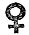
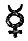
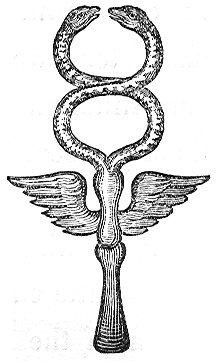
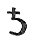
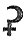
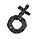
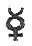

  
[Intangible Textual Heritage](../../index)  [Miscellaneous](../index) 
[Index](index)  [Previous](wos04)  [Next](wos06) 

------------------------------------------------------------------------

p. 119

### CHAPTER II.

### SERPENT-WORSHIP IN AFRICA.

1\. EGYPT.--Of all the nations of antiquity, none was so infamous for
idolatry, as Egypt. She was the *alma mater* of every superstition;
conveying, with her colonists, wherever they were settled, some
corruption of the truth, which, under the fostering care of her
established priesthood, assumed a form of consistency and allurement.
Among the rest, the worship of the serpent was in her early history an
important and conspicuous part of her idolatry. The serpent entered into
the Egyptian religion under all his characters, of AN EMBLEM OF
DIVINITY, A CHARM, AN ORACLE, and A GOD.

1\. As an emblem of divinity, the sacred serpent was particularly
symbolical of the gods CNEPH and THOTH, and of the goddess ISIS: though
he entered, more or less, into the symbolical worship of all the gods.

p. 120

HARPOCRATES, a very ancient god of the Egyptians, was symbolized by the
serpent. He is generally represented with his left hand on a staff,
surmounted by a cornucopia: round the staff is twined a serpent [1](#fn_180). He is the god of silence; to denote
which the forefinger of the right hand is on his mouth. He is supposed
by some to be the same as HORUS.

CNEPH was considered by the Egyptian priests as "the architect of the
universe," and was adored as "the good dæmon." He was sometimes
represented as A SERPENT WITH AN EGG IN HIS MOUTH. The egg denoted the
mundane elements as proceeding from him. The serpent in a circle,
passing diametrically and horizontally from circumference to
circumference, was his hieroglyphical emblem. This became the ninth
letter of the Egyptian alphabet, and was called *Thita* [2](#fn_181); from which the Greeks borrowed both the
form and name of their *Theta*. The name of this letter was derived from
that of its inventor THOTH, the reformer of the religion and manners of
Egypt, and the supposed author

p. 121

of the hieroglyphic system. He is said by Sanchoniathon to have
introduced ophiolatreia; and was, as we observed in a former part of
this volume, most probably the founder of the first colonies after the
flood which were established in Phœnicia and Egypt. He taught the
Egyptians (or rather that part of his colony which was settled in Egypt)
a religion, which partaking of Zabaism and Ophiolatreia, had some
mixture also of primeval truth. The divine Spirit he denominated CNEPH,
and described him as "*the original, eternal Spirit, pervading all
creation* [1](#fn_182)," whose symbol was a
SERPENT.

For his many services to the people, in teaching them letters,
hieroglyphics, astronomy, and morals, TAAUTUS or THOTH was deified after
death as "the god of health," or of "healing," and became the prototype
of the god ÆSCULAPIUS [2](#fn_183). He was also
identified with HERMES or MERCURY.

As "the god of healing," THOTH was himself symbolized by the serpent,
which he had taught the Egyptians to consider as a general emblem of
divinity. The seventh letter of the

p. 122

\[paragraph continues\] Egyptian alphabet, called *zeuta*, or "life,"
was sacred to him [1](#fn_184), and expressed
by *a serpent standing upon his tail*. Hence the name and the form of
the corresponding letter in the Grecian alphabet, Ζ ζ.

THOTH, as the god of healing, is represented leaning upon a knotted
stick, which is enfolded by a serpent: and a female deity, corresponding
with the Grecian goddess Hygeia, is encircled by a serpent who drinks
out of a chalice in her hand [2](#fn_185).

The serpent was also symbolical of Isis, and formed a conspicuous
feature in her mysteries. The Isiac table [3](#fn_186), which describes these mysteries, is
charged with serpents in every part, as emblems of the goddess.

The species of serpent peculiarly dedicated to Isis was the *asp*. This
is seen on the heads of her statues, and on the bonnets and sashes of
her

p. 123

priests. The tiara of the kings of Egypt was ornamented with the figures
of the same reptile. "When the Egyptians wished to represent Isis as an
angry avenger of crimes, they placed an *asp* on her head, which was
designated by the peculiar name of *Thermuthis*, *i.e.* *deadly* [1](#fn_187)." We learn also from Ælian [2](#fn_188): "The asp, to which the Egyptians gave
the name of Thermuthis, they say is sacred, and worship it there; and
they crown the images of Isis with it, as with a royal diadem." There is
a fragment in the Elgin collection of marbles in the British Museum,
which appears to be a leonine head of Isis, crowned with a coronet of
asps. Ovid, (Met. ix. 690, &c.) describing the dream of Telethusa, the
mother of Iphis, represents Isis as appearing with her constant
companion *the serpent*; which he thus characterizes:--

"Plena que somniferi serpens peregrina veneni."

\[paragraph continues\] A character which answers to that of the
Thermuthis. The same poet again mentions the asp of Isis, when he
imprecates that goddess in the following words:--

p. 124

Per tua sistra precor, per Anubidis ora verendi,  
   (Sic tua sacra pies semper Osiris amet,  
PIGRAQUE LABATUR CIRCA DONARIA SERPENS [1](#fn_189)--)

From which we may infer that LIVING ASPS were kept in the temples of
Isis, and employed, perhaps, to *glide about the offerings*, to sanctify
them. This will throw a light on the practice of the Syrian ophites
mentioned in the pre-ceding chapter; namely, the hallowing of the
Eucharist *by the gliding of the sacred serpent about the bread*. This
custom obtained also, as we shall observe in the sequel, among the
Britons and Scandinavians in their most solemn mysteries.

The asp of Isis was not a reptile of Egyptian production. Ovid, we may
remark, describes her as accompanied by a "*peregrina* Serpens," a
*foreign* serpent; and all the representations of the asp describe it as
having a large expanded head, unlike any snake which has ever been found
in Egypt. It was probably the hooded serpent of India, which is
invariably the sacred snake of that country. But how it became an emblem
of divinity in Egypt it is not easy to prove; for the native two-horned
snake of the

p. 125

temple of Jupiter at Thebes, was also held in great reverence. It is
possible that the worship of Isis may find its prototype in the
adoration of the Indian ISI. The sacred asp of the hieroglyphics, is
different from the common asp of Egypt, which was merely a viper.

The serpent, however, was not confined to Cneph, Thoth and Isis, though
more peculiarly consecrated to their worship. There is scarcely an
Egyptian deity which is not occasionally symbolized by it. Several of
these deities are represented with their proper heads terminating in
serpents' bodies. In Montfaucon, vol. 2, plate 207, there is an
engraving of SERAPIS, with a human head and serpentine tail. Two other
minor gods are also represented, the one by a serpent with a bull's
head, the other by a serpent with the radiated head of the lion. The
second of these, which Montfaucon supposes to be an image of APIS, is
bored through the middle: "probably," remarks that learned antiquary,
"with a design to hang about the neck, as they did many other small
figures of Gods, by way of ornaments or charms."

The figure of Serapis, encircled by serpents, is found on tombs. The
appearance of *serpents*

p. 126

on tombs was very general. On an urn of Egnatius Nicephoras, and of
Herbasia Clymene, engraved in Montfaucon, vol. 5, a young man entwined
by a serpent is described as falling headlong to the ground. In the urn
of Herbasia Clymene the corners are ornamented with figures of serpents.
It is a singular coincidence that the creature by whom came DEATH into
the world should be consecrated by the earliest heathen idolaters to the
receptacles of the *dead*. It is remarkable also, that SERAPIS was
supposed by the Egyptians "*to have dominion over evil dæmons* [1](#fn_190)," or in other words, was the same as
PLUTO or SATAN.

As an emblem of *dedication* to the service or honour of THE DEITY, the
serpent was sculptured with a GLOBE and WINGS on the porticoes of most
of the Egyptian temples, and on the summits of some of the obelisks. The
temples of LUXORE, ESNAY, KOMOMBU, DENDARA, and APOLLINOPOLIS, are
surmounted by this favourite symbol of consecration [2](#fn_191); and it appears on the top of each
compartment of the Pamphylian

p. 127

obelisk [1](#fn_192). Two serpents, *without
the wings and globe*, are sculptured on each of the capitals of the
pillars in the temple of GAVA, as delineated by Pococke [2](#fn_193). On the Pamphylian obelisk the
hieroglyphic serpent appears in all his forms, with and without the
globe or wings, *fifty-two times*; and is seen also on others.

The great consideration in which the symbolical serpent was held by the
Egyptians, appears in the *variations* under which he is found on
monumental remains. The reason of these has been assigned by authors who
have undertaken to investigate the nature and object of Egyptian
hieroglyphics. The serpent was deemed symbolical of the *divine wisdom*,
*power*, and *creative energy* [3](#fn_194); of
*immortality* and *regeneration*, from the shedding of his skin; and of
*eternity*, when represented in the act of biting his own tail. Besides
these various symbolizations, we are informed that the Egyptians
represented the world by a circle, intersected by two diameters
perpendicular to each other [4](#fn_195). These
diameters were *serpents*, as we may

p. 128

gather from Eusebius [1](#fn_196), who tells us
that "the world was described by a circle and "*a serpent passing
diametrically horizontally through it*." The circle represented the
terrestrial globe, and the intersecting serpents the solstitial colures.
This emblem was more common than that mentioned by Eusebius [2](#fn_197). Jablonski seems to think that the
*circumference only* was a serpent, and the diameters right lines; but
the passage above referred to in Eusebius corrects him.

The learned Kircher has also instructed us that the several *elements*
were likewise represented by serpents in various positions. Thus when
they desired to depict the element of EARTH, "which was animated by the
igneous power of OPH, (the genius who governed all things, and was
symbolized by the serpent,) they drew *a prostrate two-horned snake*."
When they wished to denote the element of WATER, they described a
serpent moving in an *undulated* manner. The AIR was represented by an
erect serpent in the act of *hissing*; this was the figure which formed
the letter *zeuta*. The element of FIRE they denoted by an asp standing
on his tail, and bearing upon his head a globe:

p. 129

while "*the igneous quality*"--the "auraï simplicis ignis"--the divine
principle of animation which pervades all things--they represented by a
circle with *a snake horizontally bisecting it*. This is the letter
*thita*; and the emblem described by Eusebius as the "character mundi."

From which hieroglyphics it is clear that THE SERPENT was the most
expressive symbol of divinity with the Egyptians. The last figure, the
emblem of the "Vis ignea," was peculiarly the hieroglyphic of the god
CNEPH, the Agathodæmon and Demiurge of Egyptian mythology, the chief god
of their original worship.

The extent to which the veneration of the symbolical serpent prevailed
in Egypt, is illustrated by a very curious plate of gold discovered at
Malta, in the year 1694, in the old wall of the city, where it is
supposed to have been concealed by its former possessor in the days of
religious fervour, when every thing idolatrous was consumed as
abominable. This interesting relic is engraved in Montfaucon, vol. ii.
p. 207, and thus described: "This plate was rolled up in a golden
casket; it consists of two long rows, which contain a very great number
of Egyptian deities, most of which have the head

p. 130

of some beast or bird. *Many serpents* are also seen intermixed, the
arms and legs of the gods terminating in serpents' tails. The first
figure has upon its back a long shell, with a serpent upon it: in each
row there is *a serpent extended upon an altar*. Among the figures of
the second row there is seen an Isis, of tolerably good form. This same
plate, no doubt, contains the most profound mysteries of the Egyptian
superstition." It is a representation, probably, of the mysteries of
Isis.

Among the curiosities of Egyptian idolatry were the VOTIVE HANDS and
FEET, sometimes found in temples. They were offered up in the same
manner as the church of Rome consecrates waxen images of hands and feet,
&c. commemorative of preservations--a custom derived, doubtless, from
Pagans, as are most of the religious ceremonies of the Romish church.
These VOTIVE HANDS [1](#fn_198) or FEET are
charged with figures of *serpents*, emblematic of recovered health.

The *basilisk* or royal serpent, so called as being the most venomous of
the species, and, as

p. 131

it were, *a king of snakes*, was named OB or OUB [1](#fn_199). This, as we observed before, was the
name of the oracular god of Canaan, identical with the Python of Delphi.
The Egyptians represented this serpent upon their coins, darting rays
from his head, as if adorned with a crown. Round the coin was inscribed
"AGATHODÆMON." The Roman Emperor Nero, in the madness of his vanity,
caused several such coins to be struck with the inscription, "THE NEW
AGATHODÆMON"--meaning himself [2](#fn_200).
There was a similar medal struck by the Egyptian gnostics, on which the
word "CNUPHIS" was stamped. By this the idolatrous heretics intended to
signify JESUS CHRIST [3](#fn_201).

The Egyptian gnostics of the school of Basilides were much addicted to
magic; and among their amulets had certain gems called *Abraxas*. This
was the name which they gave to the Almighty, because, said they, "the
letters forming the word '*Abraxas*,' in Greek numeration, would make up
the number three hundred and sixty-five; that is, the number of the days
in one revolution of the sun, as the word

p. 132

\[paragraph continues\] Mithras, or Meithras, also contains them." The
name of the deity they transferred to gems, on which his mysteries or
symbols were inscribed. Most of these gems had the figure of a SERPENT
upon them, either by himself, or terminating the legs of a god with a
cock's head. The leonine serpent, with a circle of rays about his head,
was commonly engraved upon them. The inscriptions frequently alluded to
the Jewish or Christian religions in the words "*Iao Sabaoth*,"
"*Adonai*," &c. which formed them. A serpent biting his own tail, to
represent eternity, was often seen on those gems [1](#fn_202).

These Abraxas, in which Egyptian idolatry and Christian revelation were
so inextricably interwoven, are existing proofs of the prevalence of
ophiolatreia in the first ages of the church.

The Egyptians held basilisks in such veneration, that they made images
of them in gold, and consecrated and placed them in the temples of their
gods [2](#fn_203). Bryant thinks that they were
the same as the Thermuthis, or deadly

p. 133

asp. These creatures the Egyptian priests are said to have preserved by
digging holes for them in the corners of their temples [1](#fn_204); and it was a part of their superstition
to believe that whoever was accidentally bitten by them was divinely
favoured [1](#fn_204).

The serpent is sometimes found sculptured, and attached to the breasts
of mummies; but whether with a view to talismanic security, or as
indicative of the priesthood of ISIS, is doubtful. A female mummy,
opened by M. Passalacqua at Paris a few years ago, was adorned with a
*necklace of serpents carved in stone*. The small figure of the
bull-headed serpent, mentioned above, may have been intended for a
similar purpose. Bracelets, in the form of *serpents*, were worn by the
Grecian women in the time of Clemens Alexandrinus, who thus reproves the
fashion: "The women are not ashamed to place about them *the most
manifest symbols of the evil one*; for as the serpent deceived Eve, so
the golden trinket *in the fashion of a serpent* misleads

p. 134

the women [1](#fn_205)." The children also wore
chaplets of the same kind [2](#fn_206).

Between Egypt and Greece there was always a great intercourse; and many
of the customs, and most of the mythology of the latter, were derived
from the former. It is not improbable, therefore, that these serpentine
trinkets were worn also in Egypt; but whether as merely ornamental, or
as talismanic, or as indicative of the priesthood of Cneph or Isis, I
will not venture to decide.

2\. But a very striking example of the *talismanic serpent* may be seen
in the celebrated CADUCEUS, which was usually, though not exclusively,
attributed to Hermes or Mercury. It did not *exclusively* belong to that
god, for we may find it in the hand of Cybele, "the Syrian goddess," the
mother of the gods [3](#fn_207). Cybele is the
same as OPS, in whose history the serpent makes a prominent feature. We
find it again,

p. 135

held by Minerva [1](#fn_208); and again, by the
Egyptian Anubis [2](#fn_209). It is seen in the
hands of Hercules Ogmius, the god of the Celts; and of the personified
constellation Virgo, who is said by Lucian [3](#fn_210) to have had her symbol in the Pythian
priestess; from which we may infer that the Caduceus was a sacred badge
at Delphi.

The CADUCEUS was represented under various forms, according to the fancy
of the sculptor, but almost always preserved the original design of *a
winged wand entwined by two serpents*. Sometimes it was described
without the wings, but never, properly, without the serpents: the
variations consisted chiefly in the number of the folds made by the
serpents' bodies round the wand, and the relative positions of the
wings, and serpents' heads. The CADUCEUS was deemed powerful in
paralyzing the mind, and raising the dead. This talismanic character was
probably inherent in the *serpents*, rather than in any other part of
the Caduceus; for though frequently exhibited without the wings, it is
rarely, if ever, seen without the serpents. The

p. 136

notion of the *charm* was probably derived from an obscure traditionary
memorial of the fascination of the paradisiacal serpent. The fascination
of the serpent's eye was universally believed by the ancients, insomuch
that "a serpent's eye" became a proverb among the Greeks and Romans to
denote peculiar acuteness and intentness of mind [1](#fn_211).

The origin of the Caduceus has been elaborately developed by the learned
Kircher, in his dissertation on the Pamphylian obelisk [2](#fn_212). From him we learn that the Caduceus was
originally expressed by the simple figure of a cross, by which its
inventor, Thoth, is said to have symbolized *the four elements*
proceeding from a common centre. This symbol, after undergoing some
alterations, was used as a letter of the Egyptian alphabet, and called,
from its inventor, *Taut*. It was the corresponding letter to the Hebrew
*Tau*, though different in shape. It corresponded with it also in its
mystic signification.

The next form assumed by this remarkable symbol was  : the figure of the *sun* being
superadded, as if to denote that the sun was

p. 137

the great author of action to the mundane elements. By this figure was
symbolized the deity of fecundity and generation; and hence it became,
subsequently, a symbol of the planet VENUS. Jablonski thinks that it was
nothing more nor less than the infamous *Phallus*; but the authority of
Kircher must be allowed respect.

The moon being also united with the sun, in the opinion of the
Egyptians, as a parent of life and heat and vegetation, the *lunar*
emblem was added to the *solar*. The sun and moon, as the father and
mother of the universe, contributed, therefore, their conjoint character
to the Taautic symbol, which in its new form was described thus  . This was the complete figure
which represented the supreme deity. It was called by the Egyptians the
TAAUTIC EMBLEM; and when Thoth was elevated into the rank of a god, by
the name of Hermes or Mercury, it became his hieroglyphic. Hence it was
employed as a symbol of the planet MERCURY; for in early mythology every
deified hero was changed into a planet or constellation. The SUN, being
the great object of primeval idolatry, was worshipped with the highest
honours; and THOTH, being the great prophet and reformer of the

p. 138

\[paragraph continues\] Egyptian religion, to *him* they gave the post
of honour *next to the sun*. Hence the planet which revolves *nearest to
the sun* was called Hermes, or Mercury, and regarded as the celestial
mansion of the deified Thoth [1](#fn_213).

Thoth first taught the Egyptians to symbolize divinity by serpents;
hence the two chief objects of Egyptian idolatry, the SUN and the MOON,
were represented by two serpents, male and female. Later philosophers,
therefore, not deeming the Taautic emblem sufficiently explicit of its
own meaning, substituted for the *lunar crescent* and the *solar
circle*, TWO SERPENTS, the representatives of these deities, each of
which was most ingeniously described by *the intersecting of the two
serpents*, so as to form a circle *below*, and a crescent *above*, with
their bodies. The arms of the cross they changed in like manner into
WINGS, which were emblematical of the *hovering* of the divine spirit

p. 139

over the mundane elements. The mundane elements were consequently
reduced to be represented by the *shaft* of the cross.

This improved form of the 

|                    |
|--------------------|
|  |

Taautic emblem, and *the first form* of the CADUCEUS, was thus depicted.
In this form it is seen in the hand of ANUBIS, in the plate engraved of
him in Herwart's Hieroglyphic Theatre, from which it is copied by
Kircher. After this, the CADUCEUS underwent many variations. The
serpents were made to entwine *about* the shaft, and the wings were
placed *above* the serpents. The intersections of the serpents, also,
became more frequent, sometimes amounting to three or four; and gave
rise to the fable of Jupiter and Rhea, to which the supposed conjugal
union of the sun and moon (represented by these serpents) gave some
colour. Sometimes the point of intersection was a *knot*, which was
called "the knot of Hercules [1](#fn_214)."

But notwithstanding all these variations, the original idea was never
lost. The symbol was

p. 140

always in the hand of Mercury, though occasionally it adorned the
statues and medals of other deities; and it was always *a talisman* of
extraordinary power. For this talismanic character two causes may be
assigned: the *one*, inherent in the SERPENTS, from a traditionary
recollection of the "subtilty" of the creature who seduced our first
mother; the *other*, residing in the simple CROSS, the basis of the
Taautic emblem. So much may be said in favour of the latter opinion, and
so great is the probability in favour of the former, that we cannot err
*in combining the two causes* to complete the talisman.

Kircher supposes that Thoth received the emblem upon which he founded
the *crux ansata* from the patriarchs (before the flood, I presume,) by
tradition. Of this there can be no proof. Certain it is, however, that
by the descendents of the patriarchs after the flood, the figure of a
CROSS was ever esteemed a most sacred sign, whatever may have been its
origin or mystery. It occurs, according to Maurice, among the
hieroglyphics of the Brahmins, and is stamped upon the most magnificent
shrines of their deities. On the Egyptian obelisks the Taautic

p. 141

emblem was of common occurrence, and has been found on monuments among
the ruins of Axum in Abyssinia [1](#fn_215). It
is the same figure which has been called "the Key of the Nile."

Much curious learning has been employed upon the origin of this
celebrated character. The Hebrew ת is supposed to have been derived from
it, though it has lost the figure of the original sign which is more
accurately preserved in the Greek Τ; and still more so, in the Coptic
*dau*.

It is supposed that an allusion is made to this mysterious sign in
Ezekiel ix. 4, where God directs "the man clothed in linen, which had
the writing inkhorn by his side," to set "A MARK" upon the foreheads of
those who lamented the prevalence of idolatry in Jerusalem. In the
original the phrase is, "set a TAU (ת) upon their foreheads." The
vulgate preserves the real meaning of the command,--"*mark with the*
LETTER TAU *the foreheads*," &c. Upon which Lowth observes, that in the
parallel passage in the Septuagint, το Σημειον (*a mark*) should be TAU
Σημειον (*the mark* TAU.) It has been finally determined by the learned,
that in

p. 142

the Samaritan character (*in which Ezekiel wrote*,) the ת was formerly
cruciform, in the shape of our T, or the Coptic *dau*: from whence it
would appear that the sign T was a very sacred sign in the days of
Ezekiel; an hieroglyphic denoting the *property* of the deity.

Count De Gebelin, cited by Maurice, (*Hist. Hindost.*) observes that the
Greeks, adding to the word THAU the particle MA, (which in Sanscrit
means "*grand*,") formed the word THAUMA (Θαυμα), a *sign* or *prodigy*.
And he further remarks, that in France, during the early ages of
Christianity, the officiating priest who performed the ceremony of
baptism, used the expression "CRUCIS THAUMATE *notare*."

It is probable that the early Christians, perceiving how aptly this
ancient symbol of dedication to the deity might be used to signify the
dedication of the convert to CHRIST, employed it in baptism without any
fear of scandal, as it symbolized likewise the cross upon which the
SAVIOUR died.

There seems to be an allusion to this ancient custom of setting the THAU
upon the foreheads of the servants of God, in that saying of our

p. 143

\[paragraph continues\] Lord, "If any man will come after me, let him
*take up his* CROSS and follow me [1](#fn_216)".

I grant that this might have been figuratively spoken, in reference to
the *perils* which the disciple would undergo: but does it mean nothing
more? I cannot but think that it does; for the subsequent verses
represent a picture not much dissimilar to that in the 9th chapter of
Ezekiel, where the expression "thau" first occurs. Our Lord goes on to
say, "*For* whosoever will save his life, *shall lose it*: and whosoever
will lose his life for my sake, *shall find it* . . . . For the Son of
Man shall *come* in the glory of his Father with his angels; *and then
he shall reward every man according to his works*." Now, comparing this
passage with the 9th chapter of Ezekiel, we shall find that the abstract
ideas are the same,--namely, a divine visitation and judgment, in which
the righteous are to be spared in the destruction of the wicked. Whoever
among the inhabitants of the polluted city should be found by the
destroying angel with the THAU (*the cross*) upon his forehead, would be
spared; whoever among the millions of the departed souls shall be found
at the second coming of the

p. 144

\[paragraph continues\] Lord in judgment, with *his mark* upon them,
will be saved; whoever shall have earnestly *taken up the* CROSS OF
CHRIST, will inherit eternal glory.

St. Paul also alludes to the same acknowledged sign of consecration to
the Deity, when he says, "Henceforth let no man trouble me; *for I bear
in my body* THE MARKS of the LORD JESUS [1](#fn_217)."

It is the custom of the Brahmins, to this day, to set a *mark* on the
foreheads of the votaries of Veshnu and Seeva; and the Oriental
Christians were accustomed to mark CRUCIFIXES on their arms and other
parts of the body. The phylacteries of the Hebrews are also well known.
The Mahometans, again, write the word "ALLAH" (God) upon their
persons [2](#fn_218). All of which customs may
be traced to one common origin, which I conceive to be of the most
remote antiquity. The first mention of a MARK is of that set upon CAIN;
and though this may at first sight appear to militate against the
argument before us, yet upon consideration we shall find that it
confirms

p. 145

it. Whatever might have been the nature of the mark set upon Cain, one
thing is clear--*that it denoted the bearer of it to be placed under the
immediate protection of God, so that no one should dare to slay
him* [1](#fn_219).

Very pertinent to our question is the remark, that when the Greeks
intimated the condemnation of a criminal to death, they marked his name
in the judicial tablet, with the letter Θ; and on the contrary, when
they wished to express his *acquittal*, with a Τ [2](#fn_220). The former is said to have been the
initial letter of Θάνατος--*death*: but of the latter we have received
no satisfactory explanation from the ancients. It is probably derived
from the original symbol of dedication to the Deity, which we have been
considering, borrowed by the Greeks from the Egyptians, and used in
ignorance of its mystic meaning. The Τ which was to be set upon the
foreheads of the servants of God in Jerusalem,

p. 146

was of the same nature as the blood sprinkled upon the door-posts of the
Israelites in Egypt, to signify to the destroying angel those whom God
had taken under his immediate protection, and who were to be saved in
the destruction of the wicked. It was, in effect, a symbol of
*acquittal*; God having *acquitted* or *justified* them; and therefore
they were to be spared. From this original emblem of divine protection,
the Greeks derived the notion of marking the names of acquitted persons
with a Τ, without, however, knowing its real signification. The Θ, as a
sign of condemnation, was plausibly explained as the initial letter of
the word Θάνατος; and it is perhaps under this character that we find it
impressed upon *tombs* [1](#fn_221). But it is
a singular fact, and worthy of consideration, that this letter Θ was
invented by, and named after, the same THOTH, who is said to have
introduced the mystic Tau into the Egyptian alphabet; and as Θαῦμα
implied "*a wonder*," so Θηταλὰ implied Θαυμαστὰ,
"*wonderful*"--Ψεύδεσιν ὅμοια, says Hesychius, "*like lies*." Now in
Scripture, IDOLATRY is uniformly described as a LIE. "Is there not a LIE
in my right hand?"

p. 147

is the question which the prophet Isaiah would have the maker of graven
images ask himself, while he is fabricating a god. Hence, perhaps, as
the mystic THAU denoted him who was marked with it to be the servant of
God, the mystic THETA might in opposition signify, the votary of
IDOLATRY: and hence, when Τ was adopted as a symbol of *acquittal*, Θ
would be received as a sign of *condemnation*.

Calmet (*Comment sur Ezek*. c. 9) has a note explanatory of the mystic
THAU, and brings forward the original text of Job xxxi. 35, as another
instance of its application--"Behold, here is my THAU! let the Almighty
answer me." *This* he contends is the right translation. "Behold my
SIGN!" is the marginal reading of our authorized version. The whole
context evidently refers to some *distinctive badge*, worn by Job. The
very next verse alludes to it--"Surely I would *take it upon my
shoulder*, and *bind it as a crown* to me."

A very curious form of the Taautic symbol is sometimes presented in
Egyptian hieroglyphics--that of a hawk-headed serpent issuing from a
circle which surmounts the cross, and having another smaller circle at
the extremity of his

p. 148

tail. The *hawk-headed serpent* was a favourite emblem of the DIVINE
MIND, with the Egyptians, according to Sanchoniathon--"Their *most
divine symbol* was a serpent having the face of a hawk. When he opens
his eyes, the whole of first-born space is filled with light: when he
shuts them, it is darkness [1](#fn_222)." This
hieroglyphic was a perfect symbol of the Supreme Being.

In concluding this long and desultory article, we may remark, that all
the planets known to the ancients were distinguished by the mystic
Taautic Cross, in conjunction with the solar or lunar symbols:--Thus,

  SATURN was denoted by
the lunar emblem, surmounted by the Taautic cross.

  JUPITER, by the lunar
emblem, surmounting the Θαῦμα.

  MARS, by its combination
with the solar symbol.

  VENUS was distinguished
by the same combination, but the Taautic cross was below the circle.

  MERCURY united all the
symbols.

Whatever may be the mystic meaning of these astronomical signs, their
connexion with

p. 149

the solar and lunar idolatry, and their claim upon THOTH, as the author
of their existence, seem manifest--the same THOTH, or TAAUTUS, who
promoted OPHIOLATREIA.

3\. OPHIOLATREIA had taken such deep root in Egypt, that the serpent was
not merely regarded as an emblem of divinity, but even held in
estimation as *the instrument of an oracle*. The priests of the temple
of Isis had a silver image of a serpent so constructed as to enable a
person in attendance to move its head without being observed by the
supplicating votary. Juvenal refers to it in his sixth Satire, v. 537.

"*Et movisse caput visa est argentea serpens*."

\[paragraph continues\] Perhaps this was the same as the hawk-headed
basilisk whose eyes were mechanically contrived to open or shut,
according as the offering presented by the suppliant was received or
rejected [1](#fn_223). This contrivance was
intended, probably, as a type of what was supposed to pass in the
regions of "first-born space," upon the opening or closing of the eyes
of the god CNEPH. Under the symbol of a hawk-headed serpent, this god
was adored, and a temple was erected to him in

p. 150

the island of Elephantina in the upper Nile. He was esteemed prophetic,
and his shrine resorted to as oracular.

4\. But Egyptian superstition was not con-tented with worshipping
divinity through its emblem the serpent. The senseless idolater soon
bowed in adoration before the symbol itself; and worshipped this
reptile, the representative of man's enemy, as a GOD.

This idolatry was certainly older than the Exodus of the Israelites from
Egypt. For the author of the Book of Wisdom tells us, that when the
Egyptians refused to let the children of Israel go, they were punished
by plagues of *the same animals* which they had been accustomed to
venerate as gods. Among these, the chief were serpents:--

"But for the foolish devices of their wickedness, wherewith being
deceived, *they worshipped serpents devoid of reason*, and wild beasts:
thou didst send a multitude of unreasonable beasts upon them for
vengeance, that they might know, that wherewithal a man sinneth, by the
same also shall he be punished [1](#fn_224)."

Our elegant and learned etymologist, Bryant,

p. 151

following up this idea, has elaborately and beautifully shown, in his
"Essay on the Plagues of Egypt," that "wherewithal the Egyptians had
sinned, by the same were they punished." The objects of their idolatry
became the instruments of their punishment.

Another proof of the superior antiquity of Ophiolatreia is afforded by
the divining cup of Joseph mentioned in Gen. xliv. The mention of this
superstition in connection with such a name is not a little remarkable;
and commentators have accordingly exerted themselves to explain away the
inference that Joseph practised the heathen art of divination. I am as
unwilling as any of them to believe that the Hebrew Patriarch was an
idolater; but that the "divining cup" here mentioned was similar to the
*Poculum Boni Dæmonis* of the Bacchanalian orgies, which so closely
corresponded with those of Isis, cannot well be doubted by any one who
examines the phraseology of the original text. Such a cup was preserved
in the collection of the late Earl of Besborough, and is described by
Mr. Pownall in the seventh volume of the Archæologia. Upon the lid of it
are two serpents, and on the cup itself near the rim, the Ophite
hierogram of

p. 152

\[paragraph continues\] Medusa's head. The divining cup of Joseph may
not have been so decorated; but it may have been originally or
*ostensibly* kept for a similar purpose. For it should be recollected
that Joseph married the daughter of Potipherah, the priest of ON: of the
priest, namely, who presided in the temple of the Sun at Heliopolis,
with which deity the Ophite hierogram was intimately connected. Nothing
is more natural, therefore, than that the daughter of an Ophite priest
should introduce into the household of her husband an instrument of
Ophite idolatry. It does not follow that Joseph used it as such; but it
follows from his whole conduct that he wished to pass as an *Egyptian*
with his brethren, and the claiming such a cup as among his most valued
property would only be acting in accordance with the character he had
assumed.

It may be objected that the cup in question was not a *divining* cup, in
the idolatrous application of that expression; but only a means by which
Joseph *divined* or *discovered* that he had been robbed; namely, by
missing it at his accustomed meal. But the phraseology of the original
will lead to another inference. Joseph says, "know yet not that such a
man as I am

p. 153

*divineth by divination?*" The expression is נַחֵשׁ יְנַחֵשׁ which the
Septuagint rendered *literally* οἰωνισμῷ οἰωνεῖται. Now נַחֵשׁ and
οἰωνὸς are the peculiar words *by which the serpent used in divination
was designated* [1](#fn_225).

I hesitated to deliver this conjecture respecting the cup of Joseph in
the former edition of this treatise; but the opinion of Mr. Faber kindly
communicated to me since its publication has determined me to advance
it. He remarks that "the peculiar phraseology of Gen. xliv. 15. implies
the worship of the Nachash." I argue, therefore, that the serpent was an
object of veneration in Egypt before the Exodus of the Israelites.

Besides the great temple of the serpent-god CNEPH, at Elephantina, there
was a celebrated one of Jupiter at Thebes, where the practice of
Ophiolatreia was carried to a great length. We are informed, by
Herodotus, that "At Thebes there are two serpents, by no means injurious
to men; small in size, having two horns springing up from the top of the
head. They bury these when dead in the temple of Jupiter: for they say
that they are sacred to that God [2](#fn_226)."

p. 154

\[paragraph continues\] Ælian [1](#fn_227) also
tells us, that in the time of Ptolemy Euergetes, a very large serpent
was kept in the temple of Æsculapius at Alexandria. He also mentions
another place in which a live serpent of great magnitude was kept and
adored with divine honours. He calls this place MELITE; it ought to be
METELE. This latter place is fixed by D’Anville in the Delta, not far
from ONUPHIS. This serpent, we are told, had priests and ministers, a
table and bowl. The priests, every day, carried into the sacred chamber
a cake made of flour and honey, and retired. Returning the next day,
they always found the bowl empty. On one occasion, one of the elder
priests being extremely anxious to see the sacred serpent, went in
alone, and having deposited the cake, retired. When the serpent had
ascended the table to his feast, the priest came in, throwing open the
door with great violence: upon which the serpent departed in great
indignation. But the priest was shortly after seized with a mental
malady, and having confessed his crime, became dumb, and wasted away,
until he died [2](#fn_228).

Among the prefectures of Egypt, we find one

p. 155

called ONUPHIS, from the city which was the capital of it: upon which
Kircher has the following remark: "In the Coptic language this city was
called PIHOF or NOUPHION, which signifies *a serpent*. I think this is
the same city as the NOPH of the Hebrews, by which name MEMPHIS was also
called. This [prefecture](errata.htm#0) is called ONUPHIS, *because here
they worshipped the asp*; as Pausanias, when speaking of the worship of
animals in Bœotia, says, "*As in the city of Onuphis, in Egypt, they
worship the asp*."

In Montfaucon, plate 46, vol. ii. we have an engraving of an ancient
Egyptian marble found at Rome, anno 1709, in which there is a
representation of a priest kneeling down before an idol, which, instead
of a head of its own, has *three serpents* rising up out of the
shapeless block.

In Herwart's tables of Egyptian hieroglyphics, we see a priest *offering
adoration to a serpent*. The same occurs in the Isiac table.

That these denoted something more than a mere worship of an idol, is
evident from the foregoing instances of actual worship paid to the
reptile.

In a tomb at Biban al Malook is a beautiful

p. 156

painting, descriptive of the rites of Ophiolatreia. The officiating
priest is represented with a sword in his hand, and three headless
victims are kneeling before an immense serpent. Isis is seen sitting
under the arch made by the serpent's body, and the sacred asp, with a
human face is behind her, seated on the serpent's tail. This picture
proves that the serpent was propitiated by *human victims*.

The art by which the Egyptians charmed snakes, and which is still
practised by jugglers in that country and in some parts of Barbary, was
probably first learned in the serpent temples. The most celebrated
artists were the Psylli of Africa. The charming of serpents is a very
old art, and is alluded to by David, *Psalm* lviii. *Jeremiah* viii. 17,
and in *Ecclus*. xii. 13.

The stupidity of the Egyptians was in no wise less favourable to this
idolatry than the cunning of their priests. Plutarch has recorded an
anecdote which confirms the truth of this remark. I once saw in Egypt
two men quarrelling, each of whom, upon the approach of a snake, called
him his AGATHODÆMON, and *requested him to embrace his cause* [1](#fn_229)."

p. 157

5\. Nor did the worship of the serpent in Egypt, any more than in
Phœnicia, fly before the face of advancing Christianity, to return no
more. The gnostic heretics, as we have seen, united Ophiolatreia with
the religion of the cross; and the remains of their superstition were
observed in Egypt by Bishop Pococke, when he visited the banks of the
Nile. The narrative is so curious, and so apposite to our inquiry, that
I cannot be contented with a mere reference to it. "The next day," says
the Bishop, "we came to Raigny, where the religious sheikh *of the
famous serpent Heredy*, was at the side of the river to meet us . . . .
He went with us to the grotto of the serpent, that has been so much
talked of under the name of the Sheikh Heredy, of which I shall give a
particular account, in order to show the folly, credulity, and
superstition of these people; for the Christians have faith in it as
well as the Turks. We went ascending between the rocky mountain for half
a mile, and came to a part where the valley opens wider. On the right is
a mosque, built with a dome over it, against the side of the rock, like
a sheikh's burial-place. In it there is a large cleft in the rock, out
of

p. 158

which they say *the serpent* comes. There is a tomb in the mosque, in
the Turkish manner; that, they say, is the tomb of Heredy; which would
make one imagine that one of their saints is buried there, and that they
suppose his soul may be in the serpent; for I observed that they went
and kissed the tomb with much devotion, and said their prayers at it.
Opposite to this cleft there is another, which they say is the tomb of
Ogli Hassan, that is, of Hassan the son of Heredy: there are two other
clefts, which they say are inhabited by saints or angels. The sheikh
told me there were two of these serpents, but the common notion is, that
there is only *one*. He said *it had been there ever since the time of
Mahomet*. The shape of it is like that of other serpents of the
harm-less breed. He comes out only during the four summer months, and it
is said *that they sacrifice to it*. This the sheikh denied, and
affirmed they only brought sheep, lambs, and money, to buy oil for the
lamps--*but I saw much blood and entrails of beasts lately killed before
the door*. The stories are so ridiculous that they ought not to be
repeated, if it were not to give an instance of their idolatry in those
parts in this respect;

p. 159

*though the Mahometan religion seems to be very far from it in other
things*. They say the virtue of this serpent is to cure all diseases of
those who go to it, &c. They are also full of a story, that *when a
number of women go there once a year, he passes by and looks on them,
and goes and twines about the neck of the most beautiful*. . . . . . . I
was surprised to hear a grave and sensible Christian say that he always
cured any distempers, but that worse followed. And some Christians
really believe that he *works miracles*, and say it is *the devil
mentioned in Tobit*, whom the angel Gabriel drove into the utmost parts
of Egypt," &c [1](#fn_230).

Bishop Pococke thinks (and justly) that the above superstition is a
remnant of the ancient Ophiolatreia. The annual visit of the women is
similar to the customs observed in Epirus, and at Lanuvium, of which we
shall see a full account in the sequel.

With these notices we close our remarks on the serpent-worship in Egypt;
from whence, however, it spread far and wide, until almost every nation
of Africa became devoted to the same idolatry.

p. 160

II\. ETHIOPIA.--The superstition of the serpent travelled into Ethiopia,
a country whose very name according to Bryant [1](#fn_231), denotes "the land of the solar-serpent
worship." Be this as it may, the chronicles of Abyssinia and the local
traditions of that country, abundantly establish the Ophiolatreia of the
Ethiopians. The first king of Ethiopia is said to have been a
*serpent* [2](#fn_232); he conquered the
province of Tigre, and reigned over it. He was called *Arwè*, which in
the Abyssinian language meant "a serpent." It is remarkable that the
word *Nagash* (which is evidently the same as the *Naig* of Hindustan,
and derived from the Hebrew *Nachash*, a snake) was a title of the
ancient Abyssinian kings. The Arabs called them *Nagashi* [3](#fn_233), in the same manner as the kings of
Egypt were called Pharaoh: and in the writings of our early voyagers, we
frequently meet with "the *Negus*" of Abyssinia, a title which sounded
strange, and somewhat ludicrous, in English ears.

An Abyssinian monk named Gregory, visited Germany a short time before
Ludolf published his "Ethiopic History," and the way in which

p. 161

he accounted for the tradition of a "serpent king," is highly
interesting. "Being asked about king Arwè, he said, that there was an
ancient tradition among his countrymen, that the very early Ethiopians
*worshipped a great serpent as a god*; and hence the name of the king
*Arwè*, 'a snake.' That this serpent was slain by Angabus, who for this
bold deed was elected king, and handed down the throne to his
posterity [1](#fn_234)."

The worship of the serpent prevailed at Axum until the Abyssinians were
converted to Christianity. The glory of this conversion is ascribed to
nine saints, who are reported to have succeeded by the instrumentality
of miracles. Ludolf [2](#fn_235) citing father
Mendez, thus enumerates their triumphs. "These did great miracles when
they converted a great part of Ethiopia; and among others, it is
reported that 'a great dragon who lived near Axum, and devoured many men
and cattle, was burst asunder by their prayers.' An Abyssinian poet
celebrated the praises of these Christian Missionaries, in a poem which
Ludolf quotes. The founder of Ophiolatreia, or rather the leader of the
first

p. 162

\[paragraph continues\] Ophite Colony into these remote countries, was
probably the same Thoth who planted this religion in Phœnicia and Egypt.
For we find the word *Tot*, still curiously employed in Abyssinia to
denote an *idol*, and what is remarkable, "A naked figure of a man is
not a *Tot*; but if he have the head of a *dog* or a *serpent*, instead
of a human head, he becomes a *Tot* [1](#fn_236)."

Although the seven Christian saints overcame the Dragon of Axum, they
did not succeed in destroying his whole family. The *Shangalla*, a race
of Negroes on the northern frontier of Abyssinia, *retain to this day*
their primitive superstitions; they worship *serpents*, *trees*, and the
heavenly host [2](#fn_237). And the *Agaazi*, a
tribe of Ethiopian shepherds, still dwell in the mountains, called
(probably in reference to the Ophite superstitions there practised in
former times) *Habab*: which means "*a serpent*." This word looks very
like a reduplication of the universal AB, which was the name of the
Serpent-god in most primitive countries which had any connection with
Phœnicia.

III\. WHIDAH AND CONGO.--The worship of the serpent was not confined to
the north-eastern

p. 163

portion of Africa. Later discoveries have detected, in other parts of
the peninsula, unknown to the ancients, not merely *vestiges*, but the
actual existence and practice of Ophiolatreia, in its worst and most
degraded forms.

The kingdom of WHIDAH, and the adjacent regions, may have derived their
adoration of the serpent from the original settlers. For the negro
character of the people is so totally distinct from the features of the
Egyptians, or any other known race, that they could have had none, or
very little, subsequent intercourse with foreign nations. The
serpent-worship of western Africa was, therefore, most probably
*aboriginal*; that is, propagated at the same period with that of Egypt
and Phœnicia, by the earliest descendants of Ham.

Another argument for its originality may be derived from the purity, or
rather unity, of its character. It did not mix itself up, like the
superstition of other countries, with the solar worship, of which the
serpent was always a favourite and important feature; but displayed
itself to the eyes of the first European discoverers in all its
nakedness of SERPENT-WORSHIP, retaining only a *name*, which marks the
migration of the

p. 164

sacred serpent from the Euphrates to the Congo; and serves to resolve
THE WHOLE OF OPHIOLATREIA into THE FALL OF MAN in Paradise.

The following curious particulars respecting the serpent-worship of
Whidah are chiefly extracted from vol. xvi. p. 411, of the "Modern
Universal History," which is indebted for its information to the works
of De Marchais, Barbot, Atkyns, and Bosman; the last of which may be
seen in *Acta Eruditor*, *Lipsiæ*, 1705, p. 265, under the form of an
"*Essay on Guinea*." In Astley's Collection of Voyages there is also an
account compiled from every authority then known; and a very interesting
description of the rites and ceremonies connected with this
superstition.

The gods of Whidah may be divided into three classes,--*the serpent*,
*tall trees*, and the *sea*: of these the serpent is the most celebrated
and honoured, the other two being subordinate to this deity. The snake,
which the Whidanese thus honour and worship, is perfectly harmless, and
to be seen in all the houses of the natives, leaving its young in their
very beds, from which it is the height of impiety to dislodge them.

This serpent they invoke under all the difficulties and emergencies of
life. For this purpose

p. 165

they make rich offerings to it of money, silks, live cattle, and indeed
all kinds of European or African commodities. The king, especially, at
the instigation of the priests, under every national visitation, makes
great offerings and entertainments at the serpent's shrine. The most
celebrated temple in the kingdom they call "THE SERPENT'S HOUSE;" to
which processions and pilgrimages are often made, and victims daily
brought, and at which oracles are inquired [1](#fn_238). Here there is a vast establishment of
priests and priestesses, with a pontiff at their head. The priestesses
call themselves "*the children of* God," and have their bodies *marked
with the figure of the serpent*. The kings of Whidah used formerly to
make annual processions to this temple; but the expense was so great,
that the sovereign who governed the country when Bosman visited it,
discontinued the practice, and gave great offence thereby to the
priests, who revenged themselves by procuring his daughter to be
*possessed by the serpent*, which is a part of their superstition no
less lucrative than atrocious. It was said that the

p. 166

king countenanced this attack upon his daughter; but, considering the
heavy expense in which it would involve him to release her, this is
hardly credible. The manner of this practice was the following:--At the
time of harvest, the priests of the serpent pretended that their god
prowled nightly about the fields in search of victims, which were always
females. Whenever he met any of these, he instantly seized them, and
upon their shrieks and resistance vanished; but not until he had, by his
supernatural influence, *deprived them of the use of reason*. Upon the
arrival of their friends, these women were found to be in a frantic
state; and being quite beyond control at home, were conveyed to one of
the hospitals appointed for this purpose by the king, where they
remained under the care of the priests of the serpent until they were
cured. This did not take place until their residence in the hospital had
swelled the account for board and medical attendance to the highest
pitch to which it would be prudent for the priests to carry them. They
were then sent back; and whoever mentioned a single circumstance of what
had happened in these dens of villany, was secretly poisoned or

p. 167

dispatched by some violent means. Such deaths, or murders, were always
looked upon as the just visitation of the serpent for divulging his
mysteries. The fraud of the priests, their menaces and promises,
frequently induced the women to accede to their iniquitous designs; and
in most cases, *the possession* was a concerted plan between the priest
and the woman, to plunder her husband or parents, under the plea of
alimony and fees for the miraculous cure.

The traditions of the natives respecting the origin and antiquity of
this superstition are curious. They assert that the worship is of very
ancient date, and that the first serpent of this sacred species came to
them from a foreign and remote country, "where the people pretended to
worship him, but were in truth unworthy of his sacred protection, on
account of their vices and crimes." Their ancestors, delighted with the
preference thus shown to them, received the sacred serpent with every
mark of veneration. They carried him in a silken carpet to a temple, and
offered him a worship due to his divinity. This venerable snake, the
ancestor of those now worshipped in Whidah, they believed *was still
alive somewhere, and grown to an enormous bulk*.

p. 168

\[paragraph continues\] The temple which had been prepared for him not
being sufficiently splendid, another was built; the same in which he was
worshipped when Bosman visited Whidah, anno 1697. So sacred were the
descendents of this venerated serpent, that no native, on pain of death,
dared injure or molest them, however troublesome or mischievous. Even
Europeans were in great danger of massacre, who maltreated any of these
holy and domestic gods. An anecdote is recorded by Bosman and Barbot, of
the severe revenge taken by the natives on the first English visitors of
Guinea, who happened accidentally to meet with and kill one of these
snakes in their magazine. The inhabitants, when they heard that the
English had destroyed one of their most holy fetiches, set fire to the
magazine, and having massacred the unfortunate owners, burnt their
bodies and their goods in the same fire. A similar, but a less tragical
act of fanaticism was at another time perpetrated, at the instigation of
the priests, and by order of the king:--A hog having once killed one of
the sacred serpents, a thousand Whidanese, armed with swords, were sent
through the country, destroying every animal of the proscribed race
which they chanced

p. 169

to meet, until the multitude of these useful and harmless creatures was
reduced to a very small number. A seasonable fit of reflection on the
part of the king saved the remainder. This anecdote is more interesting
to the inquirer into the native superstitions than the former, inasmuch
as no feeling but that of religious fanaticism could have given occasion
to it; whereas, many hostile feelings might have conspired in their
animosity against the English, besides that of vengeance for sacrilege.

Other anecdotes similar to this are told in Astley's Collection of
Voyages.

The worship of the snake continued in Whidah until the year 1726, when
the country was conquered by the Dahomeys, and the sacred snakes
destroyed. The Dahomeys having seized every reptile of this species
which they could find, "held them up by the middle, and said to them,
'*If you are gods, speak and save yourselves*;'--which the poor snakes
not being able to do, the Dahomeys cut their heads off, ripped them
open, broiled them, and eat them [1](#fn_239)."

Such is the account of Captain Snellgrave,

p. 170

who visited the country three weeks after the event.

The worship of the serpent was derived by the Whidanese from their
neighbours, the people of Ardrah; but with them all clue to its origin
is lost, except such as I will endeavour presently to trace.

A similar superstition prevailed in the kingdom of CONGO, when first
visited by the Portuguese. It was reprobated by the Roman Catholic
priests, and, at their request, forbidden by an edict of Alphonso, king
of Portugal, on pain of death. The following we read in Purchas's
Pilgrims, part i. p. 768.

"*The negroes of Congo worshipped serpents, which they fed with their
daintiest provisions. . . . . . Snakes and adders envenomed their souls
with a more deadly poison than they did their bodies*."

Of the interior of Africa we have had little authentic information until
lately; by which time, the irruption of the Mohamedans (Moors and Arabs)
had, for the most part, effaced the superstitions of the natives. There
are, however, even now, many idolatrous tribes of which we have no
account at all. When time and science shall have laid open their
superstitions,

p. 171

we shall probably meet with many more votaries of the sacred serpent in
that region of mystery [1](#fn_240).

But from this prospect, perhaps visionary, of future discoveries, let us
turn to the knowledge which we already possess of the superstitions of
the Gold Coast. We have ascertained that the SERPENT was in reality
worshipped there; that temples, priests, and sacrifices were appointed
to him; and that there is a tradition, that *this worship came
originally from a foreign country*. But, moreover, we are in possession
of facts which unequivocally demonstrate WHENCE that worship came.

In the kingdom of Whidah there is still a tribe of people known by the
name of EBOES, who are addicted to a worship which may be considered as
little more than a variation of Ophiolatreia. They worship the guana, a
species of lizard.

p. 172

A neighbouring tribe, the KOROMANTYNES, are said to adore a spiritual
deity, called OBONI, who is a malicious spirit, pervades heaven, and
earth, and sea, and is THE AUTHOR OF ALL EVIL [1](#fn_242).

From these two tribes chiefly were the negroes of Jamaica and the West
Indian islands formerly taken; and the addiction of these people to the
OBEAH-WORSHIP is well known by melancholy memorials.

The word *obeah* may be the feminine adjective of the substantive *obi*,
which, in the native language of the negroes, signifies a CHARM. By
means of this charm the professors of Obi, *who were all natives of
Africa*, held their unhappy votaries in such awe, that against
whomsoever the charm was laid, or as they termed it, "*obi was set*,"
that person invariably became the victim of his own horror, and died a
miserable death. The usual practice was to set this charm (which
consisted of several ingredients [2](#fn_243)
mixed

p. 173

up into the form of a cake) at the door, or in the path of the victim,
who having once fixed his eyes upon it, rarely recovered from the shock.
An irresistible horror overcame him in an instant; a gradual decay of
mind and body ensued, and a few days sufficed to carry him to his grave.

From these premises we may conjecture what relation the Obeah-worship
bears to the Ophiolatreia of the ancients. The origin of the terms OBEAH
and OBI may be traced to the Cauaanitish superstition of the OB or OUB,
which Bryant has so ingeniously detected in his remarks upon the witch
of Endor [1](#fn_245).

"The woman at Endor," observes Bryant, "who had a familiar spirit, is
called אוב, *Oub*,

p. 174

or *Ob*; and it is interpreted *Pythonissa*. The *serpent* was also in
the Egyptian language called *Ob* or *Aub*. We are told by Horus Apollo,
that the basilisk, or royal serpent, was named *oubaios*: it should have
been rendered *oubos* for *oubaios* is a possessive, and not a proper
name." *Oubos* is, therefore, the name of the serpent *Oub*, with a
Greek termination--a practice universally adopted by Grecian writers,
when speaking of foreign appellatives. Besides, Kircher remarks, that
*Obion* is still, among the people of Egypt, the name of a serpent. "The
same occurs in the Coptic Lexicon [1](#fn_246)." OBION, in its original signification,
was a sacred title, applied to the solar god, who was symbolized by the
serpent OB. It is compounded of OB and ON. ON is a title of the
SUN--thus the city of ON, in Egypt, was called by the Greeks
*Heliopolis*.

It is observable, that the woman of Endor is called *Oub* or *Ob*; and
she was applied to as *oracular*. Similarly, whenever a negro was
desirous of detecting a thief, or of recovering lost property, he
applied to the *obi-man* or *obi-woman*, for an oracle.

p. 175

The argument that the OBEAH-WORSHIP was originally connected with
Ophiolatreia, may be further corroborated by the inferences which result
from the following facts:--

1\. The natives of Whidah *worshipped the serpent* down to the year
1726.

2\. A tribe of the Whidanese is called EBOES; which has the same
signification as OBOES--for they may be traced to the same original word
אוב, which has successively undergone the variations, *oph*, *ob*,
*eph*, *eb*, or *ev*. The term EBOES may, therefore, without any great
violence to probability, be interpreted, "the worshippers of EPH."

3\. These people (the Eboes) are still addicted to a species of
serpent-worship: they worship the guana.

4\. A neighbouring tribe, the Koromantynes, adore and propitiate as THE
EVIL SPIRIT, a god whom they call OBONI.

From these facts we may infer, that the deity OBONI was the original
evil deity of the Negro nations of that part of Africa;--that he was
originally worshipped under the symbol of a *serpent*, as his *name*
imports; that his peculiar worshippers (perhaps his *priesthood*) were
called

p. 176

\[paragraph continues\] *Oboes* [1](#fn_247);--that the word *oboes* implies
worshippers of OB;--and lastly, that OBONI is no other than the OPHION
of Phœnicia, and the OBION of Egypt; each of which was a title of the
same solar god, who was symbolized by the serpent OB. Hence there is
room for one of these two inferences; that the Gold Coast was either
colonized from Canaan, or from Egypt: the former of which is perhaps the
more probable, from the greater facility afforded to the Phœnicians by
navigation than to the Egyptians, who would have to cross deserts, and
overcome many other physical difficulties in their distant march. The
period at which this emigration took place, must be referred to a very
remote age, not only because of the totally distinct physical
characteristics of the Negroes, but also of the *simplicity* of their
worship. They had neither the multitudinous host of the Egyptian
Pantheon, nor the absorbing adoration of the Syrian goddess: they had
neither mythology nor

p. 177

image-worship [1](#fn_248); but preserved the
simple, original veneration of the serpent in his *living form*. The
name of the evil deity, OBONI, it is true, indicates a relation to the
solar worship; but as they had neither obelisks nor pyramids, nor any of
the other adjuncts of this peculiar religion, it is probable that the
name OBONI was introduced at a later period. However that may be, it is
certain that the worship of the serpent prevailed in this part of Africa
from the earliest times.

That the Koromantynes should worship Oboni as a *spirit*, while the
Eboes, or Oboes, adored him under the emblem of the guava; and so
degraded mental into sensual worship, is by no means surprising. For
while history represents the Koromantynes as a peculiarly quick and
noble-minded race, it describes the Eboes as the most degraded among the
Negro tribes, apparently susceptible of no generous feeling [2](#fn_249). It was therefore to be expected that
the Koromantynes would first emancipate themselves from the superstition
of their common ancestors. Hence,

p. 178

while their religion became more intellectual, that of the Eboes would
retain its original character, with very little change; *especially*, if
these were (as there is reason to suppose) the descendants of the
*priesthood*. So that while the former would worship OBONI as a
*spirit*, the latter would worship him under his emblem the *guana*.

In one respect, however, (and it is an important and very remarkable
coincidence of opinion,) they agreed. The Eboes affirmed that *the most
acceptable offering* at the shrine of the guana was a HUMAN VICTIM: and
the Koromantynes maintained, that when OBONI was angry, nothing could
appease him but a HUMAN SACRIFICE! SO striking a coincidence as this
cannot but remind us of the great and eternal truth, that victory over
the *serpent* could only be obtained by the "WOMAN'S SEED:" and it is
another link in the chain of the universal faith, that before mankind
could be reconciled to GOD--"IT WAS EXPEDIENT THAT ONE MAN SHOULD DIE
FOR THE PEOPLE [1](#fn_250)."

 

With these remarks I take leave of Africa--a

p. 179

country in which the serpent was remarkably venerated. The course of the
Nile--the shores of the Mediterranean--the coasts of Guinea--and even
Central Africa itself, furnish proofs of the prevailing idolatry; and
many tribes, even yet unknown, may probably be discovered which uphold
the same superstition. Thus Africa, which remains a mystery to the
geographer, and little more than a sandy desert to the merchant, maybe a
mine of knowledge to the Christian scholar, who believes the Scriptures,
and expects the promises of GOD.

------------------------------------------------------------------------

### Footnotes

[120:1](wos05.htm#fr_180) Montfaucon, ii. 191.

[120:2](wos05.htm#fr_181) Kircher Œdip. "Egypt.
vol. iii. p, 46, who calls it the thirteenth letter.

[121:1](wos05.htm#fr_182) Jablonski Panth.
Ægypt. c. iv. p. 81.

[121:2](wos05.htm#fr_183) Ibid. lib. v. c. 6.

[122:1](wos05.htm#fr_184) Kircher. Œdip. Æg.
iii. 36; who calls it the 12th letter.

[122:2](wos05.htm#fr_185) Montfaucon, vol. 5.

[122:3](wos05.htm#fr_186) This was a celebrated
plate of brass overlaid with black enamel, intermixed with plates of
silver. It was destroyed at the taking of Mantua, 1630. See
*Montfaucon*, who has engraved it, vol. 2.

[123:1](wos05.htm#fr_187) Jablonski, P. Æg.
119. See also Bryant ii. 200.

[123:2](wos05.htm#fr_188) De Anim. x. 31.

[124:1](wos05.htm#fr_189) Lib. 2. Amor. Eleg.
13.

[126:1](wos05.htm#fr_190) Porphyry in Euseb.
cited by Montfaucon, *supplement*, ii. 214.

[126:2](wos05.htm#fr_191) See plates in Maurice
Ind. Antiq. Vols. II. III. IV.

[127:1](wos05.htm#fr_192) See plate in Kircher.

[127:2](wos05.htm#fr_193) Desc. of East. i. 70.

[127:3](wos05.htm#fr_194) Bryant, Plagues of
Egypt, 209.

[127:4](wos05.htm#fr_195) Jablonski, P. Æg.
lib. i. p. 86.

[128:1](wos05.htm#fr_196) Præp. Ev. lib. i. p.
42.

[128:2](wos05.htm#fr_197) Jablonski ut supra.

[130:1](wos05.htm#fr_198) In the British
Museum, among the Grecian Antiquities, are two *votive feet*, encircled
by *serpents*.

[131:1](wos05.htm#fr_199) Horus Apollo, c. i.
p. 2.

[131:2](wos05.htm#fr_200) Spanheim De Usu Num.
188.

[131:3](wos05.htm#fr_201) Jablonski, P. Æ. 89.

[132:1](wos05.htm#fr_202) See Plates, &c. in
Montfaucon.

[132:2](wos05.htm#fr_203) Horus Apollo, c. i.
p. 2.

[133:1](wos05.htm#fr_205) Gesner, Hist. Anim.
p. 54, citing Ælian. To some such notion may possibly be referred
Cleopatra's choice of death. She destroyed herself by the venom of a
viper.

[134:1](wos05.htm#fr_206) Pæd. lib. ii. 245.
Edit. Potter.

[134:2](wos05.htm#fr_207) Cœl. Rhodig. cited by
Gesner, Hist. Anim. 32. Dr. Clarke, Travels, vol. i. p. 72, describes a
very beautiful bracelet of golden serpents which was found in a tumulus,
near the Cimmerian Bosphorus.

[134:3](wos05.htm#fr_208) Montfaucon, Vol. i.
plate, p. 8.

[135:1](wos05.htm#fr_209) Montfaucon, Vol. i.
plate, p. 85.

[135:2](wos05.htm#fr_210) Kircher, Pamp. Obel.
plate of Anubis.

[135:3](wos05.htm#fr_211) De Astrolog. p. 544,
Edit. 1615, Paris.

[136:1](wos05.htm#fr_212) Parkhurst, Lex. οφις.

[136:2](wos05.htm#fr_213) Lib. iv. Hierogr. 20.

[138:1](wos05.htm#fr_214) For this conjecture I
must crave indulgence; for though only a conjecture, unsupported by
authority, I cannot but consider it as founded on probability. The
reader will find, upon reference to Kircher, that I have taken other
liberties with his argument besides this, which may stand or fall by its
own merits.

[139:1](wos05.htm#fr_215) Macrob. Saturnal.
lib. i. c. 19.

[141:1](wos05.htm#fr_216) See Bruce's
Travels--plate.

[143:1](wos05.htm#fr_217) Matt. xvi. 24.

[144:1](wos05.htm#fr_218) Gal. vi. 17. See also
Rev. xiii. 16. and xiv. 1.

[144:2](wos05.htm#fr_219) Border's Oriental
Customs on Ezek. ix. 4, and Gal. vi. 17.

[145:1](wos05.htm#fr_220) Some learned men, as
Mr. Faber, doubt the Rabbinical legend, and even whether there was any
*mark* at all upon Cain. They translate the text, "And the Lord
*appointed a sign* unto Cain, that no one finding him should kill him."

[145:2](wos05.htm#fr_221) *Alexander ab Alex.*
lib. iii. c. 5, cum notis Tiraquelli. See also *Persius*, Sat. iv. 12.

[146:1](wos05.htm#fr_222) Montf. Supplent. vol.
v. p. 42.

[148:1](wos05.htm#fr_223) Euseb. Præp. Evang.
i. 41.

[149:1](wos05.htm#fr_224) Gesner. *Hist. Anim.*
lib. v. p. 59.

[150:1](wos05.htm#fr_225) Wisd. c. xi. v. 15.

[153:1](wos05.htm#fr_226) Hesychius on οἰωνός.

[153:2](wos05.htm#fr_227) Herod. ii. 74.

[154:1](wos05.htm#fr_228) De Animal. lib. xvi.
c. 39.

[154:2](wos05.htm#fr_229) Ælian. Var. Hist.
lib. xi. c. 17.

[156:1](wos05.htm#fr_230) Amator, p. 755.

[159:1](wos05.htm#fr_231) Pococke, Desc. of
East, vol. i.

[160:1](wos05.htm#fr_232) Anal. ii. 206.

[160:2](wos05.htm#fr_233) Ludolf. Ethiop. Hist.

[160:3](wos05.htm#fr_234) Ludolf. lib. ii. c.
i. p. 23. 32.

[161:1](wos05.htm#fr_235) Ludolf. lib. ii. c.
3.

[161:2](wos05.htm#fr_236) Ludolf. Comment. lib.
iii. p. 284.

[162:1](wos05.htm#fr_237) Bruce, vol. i. 411.

[162:2](wos05.htm#fr_238) Bruce, vol. ii. 554.

[165:1](wos05.htm#fr_239) *Bosman on Guinea,
Acta Erud. Lip*. 1705, p. 265.

[169:1](wos05.htm#fr_240) Astley, vol. iii. p.
489.

[171:1](wos05.htm#fr_241) The worship of the
snake still prevails in CENTRAL AFRICA [2](#fn_241), although in danger of being shortly
superseded by Islamism. Among the idols in a temple of the Yaribeans is
one with the image of a snake upon his head; which reminds us of the
Egyptian priest with the asp of Isis.

[171:2](wos05.htm#fr_242) Lander's Records.
Preface, and vol. ii. p. 198.

[172:1](wos05.htm#fr_243) Bryan Edwards's Hist.
of the West Indies, vol. ii. pp. 75 and 466.

[172:2](wos05.htm#fr_244) One of these was
*crocodiles'* teeth, perhaps a substitute for *serpents'*; the rest were
bits of *rags*, *feathers*, &c. A practice somewhat similar to this may
be discovered in the p. 173 philtres, or
love-charms, of the Greeks and Romans. These consisted, among other
things, of *the bones of snakes*, *screech owls' feathers*, and *bands
of wool twisted upon a wheel* [3](#fn_244)."

The connexion of *serpents* and *charms* is noticed by Horace, Epod. v.
14.

Canidia brevibus implicata viperis  
   Crines et incomptum caput, &c. &c.

[172:3](wos05.htm#fr_245) Anal. vol. i. pp. 59,
60.

[173:1](wos05.htm#fr_246) Potter, Archæol.
Græca, H. 251.

[174:1](wos05.htm#fr_247) Bryant, *ut supra*.

[176:1](wos05.htm#fr_248) The name of the king
of the Eboes in 1831 was OBI. The people described by Lander are far
less barbarous than the Eboes of Edwards. The Slave Trade, which
generally barbarizes Europeans, appears in this instance to have
conferred a comparative civilization upon Africans.

[177:1](wos05.htm#fr_249) Their only idol--if
it may be called one--was the *Argoye*, a human figure crowned with
*serpents* and *lizards*. It was a subordinate fetiche.

[177:2](wos05.htm#fr_250) Bryan Edwards, ut
supra.

[178:1](wos05.htm#fr_251) John xviii. 14.

------------------------------------------------------------------------

[Next: Chapter III. Serpent-Worship in Europe](wos06)
