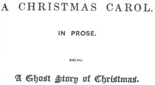

  
[Intangible Textual Heritage](../../../index) 
[Miscellaneous](../../index)  [Christmas](../index)  [Index](index) 
[Next](acc01) 

------------------------------------------------------------------------

[Buy this Book at
Amazon.com](https://www.amazon.com/exec/obidos/ASIN/1580495796/internetsacredte)

------------------------------------------------------------------------

*A Christmas Carol*, by Charles Dickens, \[1843\], at Intangible Textual
Heritage

------------------------------------------------------------------------

 

  [  
Click to enlarge](img/front.jpg)  
Frontispiece: Mr. Fezziwig's Ball  

  [  
Click to enlarge](img/title.jpg)  
Title Page  

# A CHRISTMAS CAROL

## IN PROSE

###### BEING

##### A GHOST STORY OF CHRISTMAS

## BY CHARLES DICKENS

##### WITH ILLUSTRATIONS BY JOHN LEECH.

#### LONDON

#### CHAPMAN & HALL, 186, STRAND.

#### MDCCCXLIII.

#### \[1843\]

LONDON:  
BRADBURY AND EVANS. PAINTERS, WHITEFRIARS.

------------------------------------------------------------------------

[Next: Preface](acc01)
