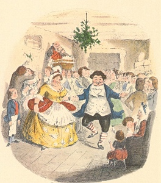

  
[Intangible Textual Heritage](../../../index) 
[Miscellaneous](../../index)  [Christmas](../index) 

------------------------------------------------------------------------

[Buy this Book at
Amazon.com](https://www.amazon.com/exec/obidos/ASIN/1580495796/internetsacredte)

------------------------------------------------------------------------

<table width="75%">
<colgroup>
<col style="width: 50%" />
<col style="width: 50%" />
</colgroup>
<tbody>
<tr class="odd">
<td width="50%" data-valign="TOP"></td>
<td width="50%" data-valign="CENTER"><h1 id="a-christmas-carol" data-align="CENTER">A Christmas Carol</h1>
<h2 id="by-charles-dickens" data-align="CENTER">by Charles Dickens</h2>
<h4 id="section" data-align="CENTER">[1843]</h4></td>
</tr>
</tbody>
</table>

------------------------------------------------------------------------

[Contents](#contents)    [Start Reading](acc00)    [Page
Index](pageidx)    [Text \[Zipped\]](acctxt.zip)

------------------------------------------------------------------------

|                                                                                                                           |
|---------------------------------------------------------------------------------------------------------------------------|
|  |

*"God bless us every one!" said Tiny Tim...*

This is a new scan of A Christmas Carol, Charles Dickens' best-loved
book, one that continues to be popular today, over a century and half
later. It was created from a photographic facsimile of an early printing
of the first edition of 1843, published by K.S. Giniger Company in 1956.
Thus the text may diverge slightly from modern editions. Edgar Johnson
noted in the introduction to the facsimile edition that "It is not the
*very* earliest state, but the form of the first edition that Dickens
himself preferred." There are a few quirks in this edition: e.g. the
title of the first chapter is 'Stave I,' but successive chapter numbers
are spelled out.

Dickens' tale of greed and redemption is a heart-warming tale of a
Christmas miracle. But there is a dead serious purpose here. Dickens
takes the mantle of an Old Testament prophet, issuing a stern warning to
the capitalist class that they needed to mend their ways, or things
would get a lot worse. It is also documentation of a now-lost world.
Dickens shows us a panorama of 19th century English society, both high
and low: bustling street scenes, a dingy rag-and-bones shop, a
high-spirited Christmas dance.

Ironically, in spite of the message against greed, A Christmas Carol was
actually written by Dickens during a sales slump, solely to make money.
He penned the short pot-boiler in a whirlwind six weeks, so that he
could get it on the shelves before Christmas. It went on sale on the
19th of December, 1843, and far exceeded expectations. The book went
through six printings before Christmas day, 1843. Reviewers also loved
it. The critic Francis Jeffrey said: "You have done more good...by this
little publication...than can be traced to all the pulpits and
confessionals in Christendom since Christmas 1842." Thackeray said "It
seems to me...a national benefit, and to every man or woman who reads it
a personal kindness." It continues to be a beloved classic, as much a
part of the holiday season as Christmas trees, Nativity displays, and
Santa Claus.

*Technical note*: Contractions throughout were printed as a separate
word in the original text (I 'll, we 're, etc.), as was the practice at
the time, but they have been merged with the preceding word in this
etext to facilitate searching.

--J.B. Hare, Dec. 9, 2007

------------------------------------------------------------------------

 [Title Page](acc00)  
[Preface](acc01)  
[Contents](acc02)  
[Stave I. Marley's Ghost](acc03)  
[Stave Two. The First of the Three Spirits](acc04)  
[Stave Three. The Second of the Three Spirits](acc05)  
[Stave Four. The Last of the Spirits](acc06)  
[Stave Five. The End of It](acc07)  
[Advertisements](acc08)  
