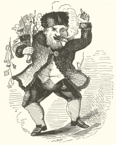

  
[Intangible Textual Heritage](../../../index.md) 
[Miscellaneous](../../index)  [Christmas](../index.md) 

------------------------------------------------------------------------

[Buy this Book at
Amazon.com](https://www.amazon.com/exec/obidos/ASIN/0811817121/internetsacredte.md)

------------------------------------------------------------------------

<table width="75%">
<colgroup>
<col style="width: 50%" />
<col style="width: 50%" />
</colgroup>
<tbody>
<tr class="odd">
<td width="50%" data-valign="TOP"></td>
<td width="50%" data-valign="CENTER"><h1 id="a-visit-from-st.-nicholas" data-align="CENTER">A Visit From St. Nicholas</h1>
<h2 id="by-clement-c.-moore" data-align="CENTER">by Clement C. Moore</h2>
<h4 id="section" data-align="CENTER">[1823]</h4></td>
</tr>
</tbody>
</table>

------------------------------------------------------------------------

[Contents](#contents)    [Start Reading](vsn00.md)

------------------------------------------------------------------------

|                                                                                                                           |
|---------------------------------------------------------------------------------------------------------------------------|
|  |

This is a collection of 19th century editions of the Christmas classic
poem, A Visit from St. Nicholas. These were scanned from a facsimile
edition printed in 1966 by Giniger Books. There are three editions
presented here: a holograph manuscript written by Clement C. Moore in
1862, the first newspaper publication in the Troy, NY Sentinel of Dec
23, 1823, and the first separate publication in 1848 as a children's
book. All three correspond line-for-line, except for minor punctuation
and spelling differences. The three texts are given in parallel in the
final file of this etext. A catalog published by George H. M. Lawrence
in 1964 describes 148 editions of this poem published during the 19th
and 20th centuries, and it remains a Christmas favorite in the 21st.

Clement Clarke Moore, born July 15th, 1779, died July 10th, 1863, was
born into a wealthy New York family, living in Chelsea and Newport. He
graduated first in class at Columbia College in 1798, and lived a life
of leisure as a scholar and writer. He donated land near Chelsea Square
for the General Theological Seminary, and served as Professor of
Oriental and Greek Literature there from 1823 to 1850.

He wrote, among other things, a Hebrew lexicon, translations from the
Greek, French and Italian, and reams of neo-classical poetry. However,
of his many works, only this 56 line poem is still remembered. He wrote
it one December afternoon for the entertainment of his six children, and
it continues to be enjoyed by children to this day. Moore originally
published the Visit anonymously because he didn't want his name
associated with the distinctly low-brow poem, finally acknowledging
authorship in 1837. There is still some doubt as to whether Moore wrote
the poem. Henry Livingston Jr., a relative of Moore, has also been
proposed as a possible author.

This poem is the source of much of the modern mythology of Santa Claus.
The original [St. Nicholas](../../../chr/lots/lots375.md) was a third
century bishop of Myra in Lycia (today, Anatolia in Southern Turkey).
Before this poem, American Christmas traditions were based on the
European. Some celebrated gift-giving on December 5th, the eve of St.
Nicholas' feast day, and most images of St. Nicholas were, naturally,
that of a bishop. Moore invented the sleigh and eight tiny (named)
reindeer, and reimagined St. Nick as a jolly old man who brings gifts by
coming down the chimney. He unified the diverse Christmas stories into
one narrative, set on Christmas Eve.

Thomas H. Nast, who also invented the Elephant/Donkey symbols of the two
major American political parties, created the first [modern Santa
Claus](../santa.jpg.md) in 1881, based on Moore's poem. However, it took
nearly a century until the canonical Santa Claus in a red and white
trimmed suit appeared in a Coca-Cola ad in 1931. Modern illustrations
(for instance, Arthur Rackham's 1931 St. Nick) show the reindeer as
full-sized, rather than 'tiny:' in the [1848 Boyd
illustrations](img/00800.jpg.md) they look about the size of dogs. The
ninth reindeer, Rudolph, was invented by a Montgomery Ward copywriter,
Robert L. May, of Evanston Illinois, in 1939.

--J.B. Hare, Dec. 9, 2007

------------------------------------------------------------------------

 [Manuscript](vsn00.md)  
[First Newspaper Publication](vsn01.md)  
[First Book Publication](vsn02.md)  
[Comparison](vsn03.md)  
