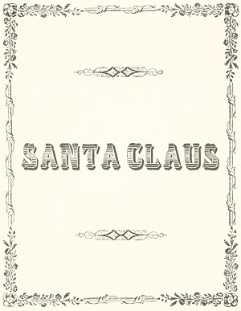
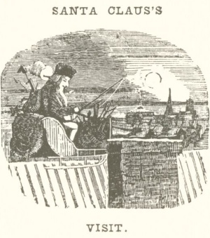
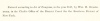
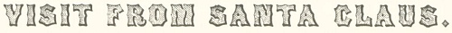
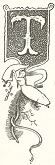
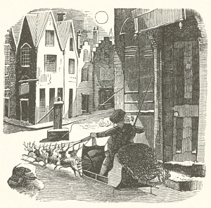

  
[Intangible Textual Heritage](../../../index) 
[Miscellaneous](../../index)  [Christmas](../index)  [Index](index) 
[Previous](vsn01)  [Next](vsn03) 

------------------------------------------------------------------------

[Buy this Book at
Amazon.com](https://www.amazon.com/exec/obidos/ASIN/0811817121/internetsacredte)

------------------------------------------------------------------------

*A Visit from St. Nick*, by Clement C. Moore, \[1823\], at Intangible
Textual Heritage

------------------------------------------------------------------------

p. 1

 

p. 2

 

p. 3

### A VISIT FROM ST. NICHOLAS

by Clement C. Moore, LL.D.

With Original Cuts,

DESIGNED AND ENGRAVED by \[Theodore C.\] Boyd,

New York:  
Henery Onderdonck,  
*10 John-street*.

\[1848\].

  [  
Click to enlarge](img/00300.jpg)  
Title Page  

p. 4

 
[  
Click to enlarge](img/00400.jpg)  
Verso  

Entered according to Act of Congress, in the year 1847, by Wm. H. Onderdonk, in the Clerk's Office of the
District Court for the Southern District of New. York.

p. 5

 

p. 6

 

p. 7

 

<table data-border="0">
<colgroup>
<col style="width: 100%" />
</colgroup>
<tbody>
<tr class="odd">
<td data-valign="top">

<table data-align="LEFT">
<tbody>
<tr class="odd">
<td data-valign="CENTER"></td>
</tr>
</tbody>
</table>
TWAS the night before Christmas, when all through the house 
Not a creature was stirring, not even a mouse; 
The stockings were hung by the chimney with care, 
In hopes that St. Nicholas soon would be there; 
The children were nestled all snug in their beds, 
While visions of sugar-plums danced in their heads; 
And Mamma in her ’kerchief, and I in my cap, 
Had just settled our brains for a long winter's nap;</td>
</tr>
</tbody>
</table>

 

 

p. 8

 

p. 9

<table data-border="0">
<colgroup>
<col style="width: 100%" />
</colgroup>
<tbody>
<tr class="odd">
<td data-valign="top">
<a href="errata.htm#0">When out</a> on the lawn there arose such a clatter, 
I sprang from the bed to see what was the matter. 
Away to the window I flew like a flash, 
Tore open the shutters and threw up the sash. 
The moon on the breast of the new-fallen snow, 
Gave the lustre of mid-day to objects below, 
When, what to my wondering eyes should appear, 
But a miniature sleigh, and eight tiny rein-deer, 
With a little old driver, so lively and quick, 
I knew in a moment it must be St. Nick. 
More rapid than eagles his coursers they came, 
And he whistled, and shouted, and called them by name;
</td>
</tr>
</tbody>
</table>

p. 10

 

p. 11

<table data-border="0">
<colgroup>
<col style="width: 100%" />
</colgroup>
<tbody>
<tr class="odd">
<td data-valign="top">
"Now, <em>Dasher!</em> now, <em>Dancer!</em> now, <em>Prancer</em> and <em>Vixen!</em> 
On, <em>Comet!</em> on, <em>Cupid!</em> on, <em>Donder</em> and <em>Blitzen!</em> 
To the top of the porch! to the top of the wall! 
Now dash away! dash away! dash away all!" 
As dry leaves that before the wild hurricane fly, 
When they meet with an obstacle, mount to the sky; 
So up to the house-top the coursers they flew, 
With the sleigh full of Toys, and St. Nicholas too. 
And then in a twinkling, I heard on the roof, 
The prancing and pawing of each little hoof—
</td>
</tr>
</tbody>
</table>

p. 12

 

p. 13

<table data-border="0">
<colgroup>
<col style="width: 100%" />
</colgroup>
<tbody>
<tr class="odd">
<td data-valign="top">
As I drew in my head, and was turning around, 
Down the chimney St. Nicholas came with a bound 
He was dressed all in fur, from his head to his foot, 
And his clothes were all tarnished with ashes and soot; 
A bundle of Toys he had flung on his back, 
And he looked like a pedlar just opening his pack. 
His eyes—how they twinkled! his dimples, how merry! 
His cheeks were like roses, his nose like a cherry! 
His droll little mouth was drawn up like a bow, 
And the beard of his chin was as white as the snow;
</td>
</tr>
</tbody>
</table>

p. 14

 

p. 15

<table data-border="0">
<colgroup>
<col style="width: 100%" />
</colgroup>
<tbody>
<tr class="odd">
<td data-valign="top">
The stump of a pipe he held tight in his teeth, 
And the smoke it encircled his head like a wreath; 
He had a broad face and a little round belly, 
That shook when he laughed, like a bowlful of jelly. 
He was chubby and plump, a right jolly old elf, 
And I laughed when I saw him, in spite of myself, 
A wink of his eye and a twist of his head, 
Soon gave me to know I had nothing to dread; 
He spoke not a word, but went straight to his work, 
And fill’d all the stockings; then turned with a jerk,
</td>
</tr>
</tbody>
</table>

p. 16

<table data-border="0">
<colgroup>
<col style="width: 100%" />
</colgroup>
<tbody>
<tr class="odd">
<td data-valign="top">
And laying his finger aside of his nose, 
And giving a nod, up the chimney he rose; 
He sprang to his sleigh, to his team gave a whistle, 
And away they all flew like the down of a thistle. 
But I heard him exclaim, ere he drove out of sight,
</td>
</tr>
</tbody>
</table>

   
“HAPPY CHRISTMAS TO ALL, AND TO ALL A GOOD NIGHT”

 

------------------------------------------------------------------------

[Next: Comparison](vsn03)
