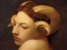

  
[Intangible Textual Heritage](../../index)  [Evil](../index.md) 
[Index](index)  [Previous](dwf04)  [Next](dwf06.md) 

------------------------------------------------------------------------

[Buy this Book at
Amazon.com](https://www.amazon.com/exec/obidos/ASIN/B0024NL7C6/internetsacredte.md)

------------------------------------------------------------------------

  
*Devil Worship in France*, by A.E. Waite, \[1896\], at Intangible
Textual Heritage

------------------------------------------------------------------------

p. 42

### CHAPTER III

#### THE FIRST WITNESSES OF LUCIFER

THAT the witnesses of Lucifer are in all cases attached to the Latin
Church, whether as priests or laymen, is no matter for astonishment when
it is once realised that outside this Church there is no hostility to
Masonry. For example, Robison's "Proofs of a Conspiracy" is almost the
only work possessing, deservedly or not, any aspect of importance, which
has ever been penned by a Protestant or independent writer in direct
hostility to the Fraternity. Moreover, Catholic hostility varies in a
vanishing direction with distance from the ecclesiastical centre. Thus,
in England, it-exists chiefly in a latent condition, "finding little or
no expression unless pressure is exercised from the centre, while in
America the enforced promulgation of the *Humanum Genus* encyclical has
been one of the serious blunders

p. 43

of the present pontificate as regards that country. The bibliography of
Catholic Anti-Masonic literature is now, however, very large, nor is it
confined to one land, or to a special epoch; it has an antiquity of
nearly 150 years, and represents most of the European continent. That of
France, which is nearest to our own doors, is naturally most familiar to
us; it is also one of the most productive, and may be assumed to
represent the whole. We are concerned with it in this place only during
the period which is subsequent to the alleged foundation of the New and
Reformed Palladium. During this period it falls obviously into two
groups, that which preceded any knowledge of the institution in question
and that which is posterior to the first promulgation of such knowledge.
In the first we find mainly the old accusations which have long ceased
to exert any conspicuous influence, namely, Atheism, Materialism, and
revolutionary plotting. Without disappearing entirely, these have been
largely replaced in the second group by charges of magic and diabolism,
concerning which the denunciations have been loud and

p. 44

fierce. One supplementary impeachment may be said in a certain sense to
connect both, because it is common to both; it is that of unbridled
licence fostered by the asserted existence of adoptive lodges. We shall
find during the first period that Masonry was freely described as a
diabolical and Satanic institution, and it is necessary to insist on
this point because it is liable to confuse the issues. Before the year
1891 the diabolism identified with Masonry was almost exclusively
intellectual. That is to say, its alleged atheism, from the standpoint
of the Catholic Church, was a diabolical opinion in matters of religion;
its alleged materialism was a diabolical philosophy in matters of
science; its alleged revolutionary plottings, being especially directed
against the Catholic Church, constituted diabolical politics. Such
descriptions will seem arbitrary enough to most persons who do not look
forth upon the world from the windows of the Vatican, but they are
undeniably consistent at Rome.

Of actual diabolism prior to the date I have named, there is, I believe,
only the solitary accusation

p. 45

made by Mgr. de Ségur, and having reference to a long anterior period.
He states that in the year 1848 there was a Masonic lodge at Rome, where
the mass of the devil was celebrated in the presence of men and women..
A ciborium was placed on an altar between six black candles; each
person, after spitting and trampling on a crucifix, deposited in this
ciborium a consecrated host which had been purchased or received in
church. The sacred elements were stabbed by the whole assembly, the
candles were extinguished at the termination of the mass, and an orgie
followed, similar, says Mgr. de Ségur, to those of "Pagan mysteries and
Manichæan re-unions." Such abominations were, however, admittedly rare,
and the story just recited rests on nothing that can be called evidence.

During the years intervening between 1870 and 1891 we may search the
literature of French Anti-Masonry in vain for any hint of the Palladium.
In 1884 the collaboration. of Louis D’Estampes and Claudio Jaunet
produced a work entitled "Freemasonry and the Revolution,"

p. 46

which affirms that the immense majority of Masons, including those who
have received the highest grades, do not enjoy the confidence of the
true secrets, but the establishment of atheism in religion and socialism
in politics as designs of the Fraternity are the only secrets intended.

The New and Reformed Palladium connects with the Order of the Temple by
its supposed possession of the original Baphomet idol, but in 1882 this
was entirely unknown to Mgr. Fava, who denies all the reputed connection
between Templars and Masons, and traces the latter to Faustus Socinus as
founder, following Abbé Lefranc in his "Veil raised for the Curious." A
mystic and diabolic aspect of the Fraternity is so remote from his mind
that in his "Secret of Freemasonry" the Bishop of Grenoble affirms that
its sole project is to replace Christianity by rationalism.

The third and concluding volume of Père Deschamps’ great compilation on
"Society and the Secret Societies," supports, on the contrary, the
hypothesis rejected by Fava. It recites

p. 47

much old knowledge concerning adoptive lodges, the Illuminés, the Orders
of Philalethes, of Martinez Pasquales, and of Saint Martin, on which
subjects few writers indeed can say anything that is new; but while
specially devoted to the political activity of the Fraternity all over
Europe, Deschamps tells us nothing of the conspiracy which produced the
New Palladium, though the alleged collaboration of Mazzini gave it a
strong political complexion; of Pike nothing; of Diabolism still
nothing. I may add that his work claims to be verified at all points.

In the year 1886 another ecclesiastic, Dom. Benoit, published two
formidable volumes on "Freemasonry and the Secret Societies," forming
part of a vaster work, entitled "The City of anti-Christ in the
Nineteenth Century." Like D’Estampes and Jannet, he distinguishes
between a small number of initiates and a vast crowd of dupes who swell
the ranks of the Fraternity. "Many Masons ascend the ladder of the
grades without receiving the revelation of the mysteries." The highest
functions of

p. 48

most lodges are said to be given to the dupes, while the ruling chiefs
are concealed behind humble titles. It is further represented that in
certain countries there are secret rites above the ordinary rites, and
these are imparted only to the true initiates, which sounds like a vague
and formless hint concerning a directing centre; but so far from
supposing that such an institution may exist in Masonry, the author
affirms that unity is impossible therein:—"Image of hell and hell
anticipated, Masonry is the realm of hatred, and consequently of
division. The leaders mutually despise and detest one another, and
universally endeavour to deceive and supplant each other. A common
hatred of the Church and her regular institutions alone unites them, and
scarcely have they scored a victory than they fall out and destroy each
other." The first seeds of the Manichæan accusation are found in the
second volume, but the term is not used in the sense of Albert Pike's
Luciferian transcendentalism, but merely as an equivalent of
Protestantism coloured by the idea of' its connection with the Socinian
heresy. In

p. 49

conformity with this view, Dom Benoit attaches himself to the Templar
hypothesis, saying that the Albigenses and the Knights of the Temple are
the immediate ancestors of Masonry. But the point which is of most
interest in connection with our inquiry is where Dom Benoit asserts that
Satan is the god of Freemasonry, citing an obscure grade in which the
ritual is connected with serpent-worship, and another in which the
recipient is adjured "in the sacred name of Lucifer," to "uproot
obscurantism." It is, however, only a loose and general accusation, for
he says also that the Masonic deity is "the creature," that is,
humanity, the mind of man, human reason; it is also "the infamous
Venus," or the flesh; finally, "all divinities of Rome, Greece, Persia,
India, and every pagan people, are the gods of Masonry." This is merely
indiscriminate defamation which is without force or application, and the
writer evidently knows nothing of a defined cultus of Lucifer existing
in the Lodges of the Fraternity. So also when he elsewhere states that
sexual excesses are sometimes accompanied in Masonry by Eucharistic

p. 50

profanations, he has only Mgr. de Ségur's out-of-date narrative to
support him, and when he hints at magical practices, it is only in a
general way, and apparently referring to acts of individual Masons. In
one more significant passage he records, as a matter of report, that
apparitions of the demon have occurred "recently" in Masonic assemblies,
"where he is said even to have presided under a human form." While there
is no mention of Palladism and none of Pike in his treatise, we may
regard Dorn Benoit as a herald of the coming accusation, speaking
vaguely of things half heard.

Some time previous to 1888, Paul Rosen, a Sovereign Grand
Inspector-General of the 33rd and last degree of the French rite, had
come to the conclusion that the mysteries of Freemasonry are abominable,
and in that year he published a work, entitled "Satan and Co.,"
suggesting that in this case a witness to the desired point had at last
come forward, and, as a matter of fact, the writer does take us a few
paces beyond the point reached by Benoit. So far as I am aware, he is
the first French anti-Mason

p. 51

who mentions Albert Pike, with one exception, to be considered
separately in the next chapter. He describes him as the Sovereign -Grand
Commander of the Supreme Mother Council of every Supreme Council of the
Ancient and Accepted Scotch Rite, and he tells the story of the
foundation of that Rite, but he knows nothing of Isaac Long, the
Palladium, or the skull. He cites also certain works which Pike wrote
for the exclusive use of initiates, apparently of the higher grades of
these rites, namely, "The Sephar H’Debarim," "Ethics and Dogmas of
Freemasonry," and "Legenda Magistralia." But so far from accrediting the
order with a supernatural aspect, he affirms that its war-cry is
annihilation and anathema thereto. The end of Freemasonry is, in fact,
social anarchy, the overthrowal of monarchical government, and the
destruction of the Catholic religion. The Satanism imputed to
Freemasonry by Paul Rosen is therefore of an arbitrary and fantastic
order, having no real connection with this inquiry. Two years later the
same author published a smaller volume, "The

p. 52

\[paragraph continues\] Social Enemy,"
which contains no material of importance to our purpose, but is preceded
by a Pontifical Brief, conveying the benediction of Leo XIII. to the
writer of "Satan and Co."

We pass now to the year of revelation 1891.

------------------------------------------------------------------------

[Next: Chapter IV. Ex Ore Leonis](dwf06.md)
