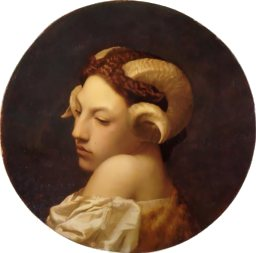

  
[Intangible Textual Heritage](../../index)  [Evil](../index) 

------------------------------------------------------------------------

[Buy this Book at
Amazon.com](https://www.amazon.com/exec/obidos/ASIN/B0024NL7C6/internetsacredte)

------------------------------------------------------------------------

<table width="75%">
<colgroup>
<col style="width: 50%" />
<col style="width: 50%" />
</colgroup>
<tbody>
<tr class="odd">
<td width="50%" data-valign="TOP"> 
The Bacchante, by Jean-Leon Gerome [1853] [Public Domain Image]</td>
<td width="50%" data-valign="CENTER"><h1 id="devil-worship-in-france" data-align="CENTER">Devil Worship in France</h1>
<h2 id="by-a.e.-waite" data-align="CENTER">by A.E. Waite</h2>
<h4 id="section" data-align="CENTER">[1896]</h4></td>
</tr>
</tbody>
</table>

------------------------------------------------------------------------

[Contents](#contents)    [Start Reading](dwf00)    [Page
Index](pageidx)    [Text \[Zipped\]](dwf.txt.gz)

------------------------------------------------------------------------

|                                                                                                                           |
|---------------------------------------------------------------------------------------------------------------------------|
|  |

In spite of the sensational title, this book is actually a debunking of
a notorious late 19th century hoax. Leo Taxil, a French
anti-clericalist, suddenly converted to Catholicism in the 1885 and
wrote a number of books in which he claimed that Freemasonry was a
world-wide satanic conspiracy. Taxil started an anti-Masonic newspaper.
In 1887 Taxil even had an audience with Pope Leo XIII, who subsequently
sanctioned his anti-Masonic campaign.

Waite systematically debunks Taxil in this book, citing factual
inaccuracies, plagarism, and sheer absurdities. Waite is in top form
here, witty, sarcastic, and utilizing extensive firsthand knowledge of
Victorian mystical and masonic groups to demolish Taxil. Of interest is
[Chapter VII](dwf09), wherein Waite gives a detailed summary of Taxil's
pulp-fiction narrative, which has never been translated into English. It
is amazing that anyone would take this yarn seriously, then or now.

In 1897, the year after Waite published this book, Taxil announced at a
press conference that his conversion was a fraud, the books he had
written were complete fabrications, and that he had published them to
embarass the Catholic church. His motive for targeting the Freemasons
was because they had rejected his application to join them. Diana
Vaughan, the central character in his book The Devil in the Nineteenth
Century, was also fiction--Diana Vaughan was the name of one of his
typists.

Unfortunately, no matter how absurd or discredited, this is the meme
that refuses to die. Both Taxil and Waite have been quoted out of
context numerous times by anti-Freemasons, conspiracy theorists and the
simply paranoid to underpin their beliefs that Lucifer is secretly
worshipped by Masons. It is crucial that anyone investigating the issue
(such as it is) read this book in its entirety in order to get
perspective.

------------------------------------------------------------------------

 [Title Page](dwf00)  
[Preface](dwf01)  
[Contents](dwf02)  
[Chapter I. Satanism in the Nineteenth Century](dwf03)  
[Chapter II. The Mask of Masonry](dwf04)  
[Chapter III. The First Witnesses of Lucifer](dwf05)  
[Chapter IV. Ex Ore Leonis](dwf06)  
[Chapter V. The Discovery of M. Ricoux](dwf07)  
[Chapter VI. Art Sacerdotal](dwf08)  
[Chapter VII. The Devil and the Doctor](dwf09)  
[Chapter VIII. Dealings With Diana](dwf10)  
[Chapter IX. How Lucifer is Unmasked](dwf11)  
[Chapter X. The Vendetta of Signor Margiotta](dwf12)  
[Chapter XI. Female Freemasonry](dwf13)  
[Chapter XII. The Passing of Doctor Bataille](dwf14)  
[Chapter XIII. Diana Unveiled](dwf15)  
[Chapter XIV. The Radix of Modern Diabolism](dwf16)  
[Chapter XV. Conclusion](dwf17)  
