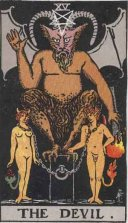

<table width="75%">
<colgroup>
<col style="width: 50%" />
<col style="width: 50%" />
</colgroup>
<tbody>
<tr class="odd">
<td width="50%" data-valign="CENTER"> 
</td>
<td width="50%" data-valign="CENTER"><h1 id="evil">Evil</h1></td>
</tr>
</tbody>
</table>

------------------------------------------------------------------------

It was as if Satan was walking the streets of New York... -- New York
Firefighter, regarding 9/11/2001

Evil is, on one level, a cultural construct. The Easter Islanders
believed that stealing, if successful, was virtuous. This was probably a
social mechanism for redistributing scarce items on a small island.
However some evils--war, genocide, and terrorism to name a few--are
instantly recognizable as such. The issue of why an omniscient,
all-powerful God would permit such horrors is one of the most difficult
(and obvious) religious questions. This section of sacred-texts deals
with this thorny issue.

Note that there aren't any sacred texts of Satanism *per se* at this
site. Satanism as an organized religion is a very recent phenomena, and
books about it are a long way from entering the public domain. Besides,
to put a fine point on it, actual Satanists insist that they aren't
evil.

------------------------------------------------------------------------

 [The History of the
Devil](hod/index.md) by Paul Carus \[1900\]   A comprehensive account of
the history of evil, in particular as symbolized by the Christian devil,
but also including a wide-ranging survey of other religions.
Extensively illustrated. 

 [The Evil Eye](tee/index.md) by
Frederick Thomas Elworthy \[1895\]   A comprehensive
exploration of a somewhat different, and probably more ancient theory of
evil, and the ways to ward it off using talismans and gestures.
Likewise extensively illustrated. 

 [Devil Worship in
France](dwf/index.md) by Arthur Edward
Waite \[1896\]   A.E.
Waite debunks false accusations that Freemasons worship the
Devil. 

 [The Devils of
Loudun](dol/index.md) by Edmund Goldsmid
\[1887\]   A translation of
the primary source on the 1634 mass possession of the nuns of
Loudun. 
