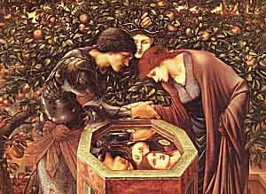

  
[Intangible Textual Heritage](../../index)  [Evil](../index) 

------------------------------------------------------------------------

[Buy this Book at
Amazon.com](https://www.amazon.com/exec/obidos/ASIN/B0024NL744/internetsacredte)

------------------------------------------------------------------------

<table width="75%">
<colgroup>
<col style="width: 50%" />
<col style="width: 50%" />
</colgroup>
<tbody>
<tr class="odd">
<td width="50%" data-valign="TOP"></td>
<td width="50%" data-valign="CENTER"><h1 id="the-evil-eye" data-align="CENTER">The Evil Eye</h1>
<h3 id="by-frederick-thomas-elworthy" data-align="CENTER">by Frederick Thomas Elworthy</h3>
<h4 id="section" data-align="CENTER">[1895]</h4></td>
</tr>
</tbody>
</table>

------------------------------------------------------------------------

[Contents](#contents)    [Start Reading](tee00)    [Page
Index](pageidx)    [Text \[Zipped\]](tee.txt.gz)

------------------------------------------------------------------------

|                                                                                                                           |
|---------------------------------------------------------------------------------------------------------------------------|
|  |

There is another concept of "why bad things happen" that probably
predates the theory that there is one centralized source of evil. This
is, to use a computer anology, a peer-to-peer theory of evil. The evil
eye is a widespread belief that unlucky events can ensue if you attract
the attention of particular people. These people, sometimes
involuntarily, sometimes voluntarily, can cast a malignant spell on
others simply by looking at them.

This lavishly illustrated work is the classic study of this
superstition. Starting with a mass of anecdotes from contemporary
observations in Italy and rural England, Elworthy, using all of his
skills as a folklorist and etymologist, delves deeper. He gives examples
of the belief on a world-wide basis and far back in time, to classical
paganism and beyond. He also elaborates all of the methods that have
been used to ward off the *jettatura*, including talismans, spells,
spitting, hand gestures and many others.

Belief in the evil eye is still very active even with the advance of
modernity. As I was researching this topic in preparation for developing
this etext, I stumbled on a Google link to a middle-eastern chat board.
The posting included detailed and very arcane descriptions of rituals
that one could use to purge an attack of the evil eye. So the evil eye
is still with us, and even if you don't believe in it, there are many
cultures which take it very seriously. Understanding the *malocchio* is
an important part of being a world citizen.

--John Bruno Hare, February 25th, 2004.

------------------------------------------------------------------------

[Title Page](tee00)  
[Contents](tee01)  
[List of Illustrations](tee02)  
[Chapter I. Introduction](tee03)  
[Chapter II. Sympathetic Magic](tee04)  
[Chapter III. Totems, Portents, Tree-Worship](tee05)  
[Chapter IV. Symbols and Amulets](tee06)  
[Chapter V. The Gorgoneion](tee07)  
[Chapter VI. Crescents, Horns, Horseshoes](tee08)  
[Appendix I](tee09)  
[Appendix II](tee10)  
[Chapter VII. Touch, Hands, Gestures](tee11)  
[Chapter VIII. The Cross](tee12)  
[Chapter IX. The Mano Pantea](tee13)  
[Chapter X. The Cimaruta, Sirene, Tablets](tee14)  
[Chapter XI. Cabalistic Writing--Magical Formulæ](tee15)  
[Chapter XII. Spitting, Incantation, and Other Protective Acts.
Pixies](tee16)  
[Appendix III](tee17)  
