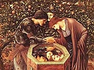

  
[Intangible Textual Heritage](../../index)  [Evil](../index) 
[Index](index)  [Next](tee01) 

------------------------------------------------------------------------

[Buy this Book at
Amazon.com](https://www.amazon.com/exec/obidos/ASIN/B0024NL744/internetsacredte)

------------------------------------------------------------------------

  
*The Evil Eye*, by Frederick Thomas Elworthy, \[1895\], at Intangible
Textual Heritage

------------------------------------------------------------------------

# The Evil Eye

##### An Account of this Ancient and Widespread Superstition

## by Frederick Thomas Elworthy

#### J. Murray; London

#### \[1895\]

###### Scanned, proofed and formatted at Intangible Textual Heritage, by John Bruno Hare, February, 2004. This text is in the public domain because it was published prior to 1923.

------------------------------------------------------------------------

[Next: Contents](tee01)
