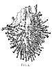
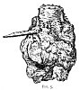

  
[Intangible Textual Heritage](../../index)  [Evil](../index) 
[Index](index)  [Previous](tee03)  [Next](tee05) 

------------------------------------------------------------------------

[Buy this Book at
Amazon.com](https://www.amazon.com/exec/obidos/ASIN/B0024NL744/internetsacredte)

------------------------------------------------------------------------

  
*The Evil Eye*, by Frederick Thomas Elworthy, \[1895\], at Intangible
Textual Heritage

------------------------------------------------------------------------

p. 44

## CHAPTER II

### SYMPATHETIC MAGIC

IN further pursuing this subject, it must be borne in mind that besides
the direct influences of fascination, including those of simple bodily
presence, breathing, or touching, there is a whole class of operations
directly connected with it, comprehended in the terms Magic,
Enchantment, Witchcraft.

A great authority, [63](#fn_65) who has dealt
exhaustively with the subject of the Occult Sciences, including Omens,
Augury, and Astrology, does not even allude to the belief in the evil
eye, which we take to be the basis and origin of the Magical Arts. About
these the earliest known writings and the most ancient monuments give
abundant evidence. Dr. Tylor calls the belief in magic "one of the most
pernicious delusions that ever vexed mankind"; and considering magic
merely as the handmaid, or the tool, of envy, this description accords
well with that of Bacon, as the vilest and most depraved of all
"affections."

The practice of magic as defined by Littré, "Art prétendu de produire
des effets contre l'ordre de la nature," began with the lowest known
stages of civilisation; and although amongst most

p. 45

savage races it is still the chief part of religion, [64](#fn_66) yet it is not to be taken in all cases as
the measure of the civilisation of the people practising it. The reason
we assign is, that outward circumstances, such as local natural
features, or climate, tend to make the mental condition of certain
people specially susceptible of feelings, upon which magical arts can
exert an influence altogether out of proportion to the culture of the
persons affected. In fact, the more imaginative races, those who have
been led to adopt the widest pantheon, have been mostly those upon whom
magic has made the most impression; and what was once, and among certain
races still is, a savage art, lived on, grew vigorously, and adopted new
developments, among people in their day at the head of civilisation.
Thus it has stood its ground in spite of all the scoffs of the learned,
and the experimental tests of so-called scientific research, until we
may with confidence assert that many practices classed as occult, and
many beliefs which the educated call superstitious, are still performed
and held firmly by many amongst ourselves, whom we must not brand as
ignorant or uncultured. No doubt the grosser forms of enchantment and
sorcery have passed away; no doubt there is much chicanery in the doings
of modern adepts; yet, call it superstition or what we may, there are
acts performed every day by Spiritualists, Hypnotists, Dowsers and
others, which may well fall within the term Magic; yet the most
sceptical is constrained to admit, that in some cases an effect is
produced which obliges us to omit the word *prétendu* from our
definition.

p. 46

We cannot explain how, but undoubtedly there is in certain individuals a
faculty, very occult, by which the divining rod does twist in the grasp
of persons whose honour and good faith are beyond suspicion. The writer
has seen the hazel twig twist in the hands of his own daughter, when
held in such a position that no voluntary action on her part could
possibly affect it. Moreover, a professional Dowser makes no mystery or
hocus-pocus about it; he plainly declares he does not know how, or why,
the twig or watch-spring moves when he passes over water; nor can he
even teach his own sons to carry on his business. Of all arts we may say
of his, *nascitur, non fit*.

Again, there are certain phenomena in thought-reading, which are
well-established facts, clear to our senses. Above all, there are the
strange powers possessed by Hypnotists over their patients, which we can
no more explain than we can that minutely recorded act of the Witch of
Endor [65](#fn_67) who "brought up" Samuel, and
instantly discovered thereby that Saul himself was with her. Without
believing either in magic or the evil eye, the writer fully agrees that
"much may be learnt" [66](#fn_68) from a study
of the belief, and of the many practices to which it has given rise. It
is needful, however, to approach the subject with an open, judicial
mind, and not to reject all, like the "Pharisees of Science," [67](#fn_69) that our superior understanding is unable
to explain. Our senses, our experience, alike tell us that there exist
many facts and appearances, which appealed strongly to the despised
judgment of our forefathers, rude and

p. 47

cultured alike, which never have been either disproved or explained, and
some of these facts have been held as firm articles of belief in all
ages.

Mr. De Vere [68](#fn_70) expresses precisely
what we mean when he says of the imaginative, rather than the critical
mind of our chivalrous ancestors of the Middle Ages, that "they
delightedly believed much that many modern men unreasonably disbelieve
to show their cleverness." [69](#fn_71)

It is easy, and the failure of modern science has made it safe, to call
everything we cannot understand contemptible superstition. It is however
satisfactory and even consolatory, in pursuing our subject, to know that
the same word superstition has been applied by "superior persons,"
indifferently and impartially, to the most sacred doctrines of
Christianity, to the belief in our Lord's miracles, to most solemn
mysteries, and creeds other than those of our infallible selves, to the
magic omens and portents which many believe in, and to the incantations
or enchantments of charlatans, wizards, and sorcerers. [70](#fn_72)

The more, however, we study with unbiassed mind the subjects which are
called occult, the more evident will it become, even to the least
advanced or enlightened amongst us, that there is a whole world

p. 48

of facts, operations, and conditions, with which our human senses and
powers of comprehension are quite incapable of dealing. This has
certainly been the experience of all people in all ages; we see in his
magic but the feeble efforts of feeble man to approach and to step over
the boundary his senses can appreciate, into what is intended to be, and
must always remain, beyond his ken-essentially the supernatural.

Man, having come to associate in thought those things which he found by
experience to be connected in fact, proceeded erroneously to invert this
action, and to conclude that association in thought must involve similar
connection in reality. [71](#fn_73)

Here no doubt we have the true reason for that association of ideas with
facts which a recent author [72](#fn_74) calls
Sympathetic Magic. He says: "One of the principles of this is that any
effect may be produced by imitating it." So concise a definition may
well be borne in mind, for we are told that it lies at the very
foundation of human reason, and of unreason also. We Christians,
however, certainly cannot agree to call this association of ideas with
facts a superstition in the conventional sense; for we must see that the
principle, perhaps to suit our humanity and our limited reason, has been
appointed and adopted for our most sacred rites. Surely in the act of
baptism we hope for the spiritual effect we imitate or typify by the
actual use of water. So in that highest of our sacraments we spiritually
eat and drink, by the actual consumption of the elements.

Leaving sacred things, which are merely mentioned here, with all
reverence, by way of illustration, and to show how association of ideas
with facts

p. 49

is not necessarily superstitious, but a fundamental principle of human
ethics, we find that in practice it has nevertheless been more often
perverted to the accomplishment, actual or fancied, of the basest
designs of malignant spite, than to the higher purposes of religion.

To illustrate his meaning of the term Sympathetic Magic, the
author [73](#fn_75) says: "If it is wished to
kill a person, an image of him is made and then destroyed, and it is
believed that through a certain physical sympathy between the person and
his image, the man feels the injuries done to the image as if they were
done to his own body, and that when it is destroyed he must
simultaneously perish." The idea herein expressed is as old as the
hills, and is practised to-day. [74](#fn_76) The
ancient Egyptians believed that the *ushebtiu* or little figures of
stone, wood, or pottery ([Figs. 1, 2, and 3](#img_05000) which they
placed, often in such numbers, in the tombs of their dead, would provide
the deceased with servants and attendants to work for him in the nether
world, and to fight for him against the many enemies he would there have
to combat. Their name signifies *respondents*, [75](#fn_77) as if to answer to the call for help. The
same curious belief is shown in the imitations or re-

p. 50

presentations of food, such as terra-cotta bread, [76](#fn_78) and other articles placed with the dead
for his use and sustenance.

Maspero in his lectures on the "Egyptian Hell" (see a long notice in the
*Times* of August 22, 1887)

  [  
Click to enlarge](img/05000.jpg)  
Figures 1, 2 and 3  
  
 [76a](#fn_79)

dwells upon the reasons which induced the ancients to provide their dead
with arms, food, amulets, and slaves, for it was thought the dead would
be liable to the *corvée* as well as the living. Besides all these
things the dead were furnished with a funereal

p. 51

papyrus, now known as the "Book of the Dead," which Maspero, describes
as a "Complete Handbook to Hell," giving not only an itinerary of the
route but all the spells, incantations, and prayers for each stage of
the journey.

The very curious part of these provisions is that idealism seems to have
run riot, as though the dead himself, in whose actual existence there
was devout belief, would be satisfied with a mere make-believe, or even
the picture of the article he needed. They seem to have thought that in
the future state the person deceased would be so readily deceived, as to
consider himself provided for by the most innocently transparent
counterfeits. [77](#fn_80)

This remarkable belief in the easy gullibility of the departed was by no
means confined to the ancient Egyptians, for among the Chinese is found
a custom at present, which, seeing that in China habits change not, we
may conclude to be of ancient date.

Archdeacon MacCullagh, long resident in China, says that Chinamen still
believe that paper money passes current in the next world as it used to
do with them in 'this. They also believe that as the person is dead, so
must his money be with which he is to be furnished in the place to which
he has gone. They therefore kill the money for him by burning it, in
order that he may have dead or killed money.

p. 52

\[paragraph continues\] Paper currency has
been for many centuries abolished in China, but the people will not
believe it to be so in the world of spirits. They therefore prepare
spurious paper money in imitation of the old extinct currency, which
they burn at the funeral, and also annually at the grave of their
departed relative. The Egyptians did almost the same thing: they broke
the arms placed with the dead. This killed them, and set their ghosts
free to follow their dead master. [78](#fn_81)

Such deception, which they think suitable for the spiritual world,
evidently will not do for the present: at the death of a Chinaman, his
friends present coins, of small value indeed, but real, to all corners,
in order to make friends for the departed who may possibly meet him in
the place where he is gone. The terra-cotta cakes at the Ashmolean
Museum, so like modern Neapolitan loaves, must be such as would be
placed with the dead man, by way of satisfying his appetite on his
journey to the happy hunting grounds.

Nor can we say that this notion of being able to deceive the dwellers in
the unseen world is confined to ancient or specially superstitious
people, when we see altars in churches, dedicated to departed saints,
bedecked in their honour with flowers of painted tin or coloured calico,
stuck in sham vases of tinselled wood.

Again, nearer home, when we see the wreaths of beads strung on wires, of
tin leaves and tinted flowers placed under glass shades upon the graves
in our cemeteries, we wonder if the "Ka," or the

p. 53

shade of the departed, when it visits the cast-off mortal coil, will be
deceived by these cheap counterfeits. We fear we must conclude that such
things can only be classed, even in this nineteenth century, as mere
examples of the performances of sympathetic magic, to be summed up in
the famous words of Erasmus to Sir Thomas More: "Crede ut habes et
habes."

In our Somerset County Museum at Taunton is to be seen more than one
heart, said to be those of pigs, stuck full of pins 

<table data-align="RIGHT">
<colgroup>
<col style="width: 100%" />
</colgroup>
<tbody>
<tr class="odd">
<td data-valign="CENTER"><a href="img/05300.jpg"> 
Click to enlarge</a> 
FIG. 4 
</td>
</tr>
</tbody>
</table>

and thorns, which have been found not long ago in old houses near the
writer's home. The illustrations are careful drawings from the originals
and represent actual size. [79](#fn_82) These
hearts are also said to be malignant in design as well as protective:
that the persons who stuck those pins into the hearts, had special
ill-will, and desired to work injury against the person in whose house
they were found. They entertained the old,

p. 54

old belief that the heart is the seat of life, and therefore a fit
representative or symbol of a living person. They believed that the
heart of the hated person would suffer from the pricking inflicted upon
the pig's heart, and that as the latter dried up and withered, so would
the heart and the life of the victim against whom the act was designed.

The Bakongo people "believe the spirit is situated 

<table data-align="LEFT">
<colgroup>
<col style="width: 100%" />
</colgroup>
<tbody>
<tr class="odd">
<td data-valign="CENTER"><a href="img/05400.jpg"> 
Click to enlarge</a> 
FIG. 5 
</td>
</tr>
</tbody>
</table>

in the middle of the heart, and it is regarded as the mainspring of
action, so that to bewitch the spirit in a man's heart is to cause him
to waste away and die." [80](#fn_83) The charm
doctor is the great spiritual power: his business is to find out the
witch who has eaten the heart of a newly deceased person.

A few years ago, also in this same neighbourhood,

p. 55

an onion was found hidden in a chimney, with a paper stuck round it by
numberless pins; on this was written the name of a well-known and
highly-respected gentleman, a large employer of labour.

The other day I [81](#fn_84) was at the Court
House, East Quantoxhead, and was shown in the chimney of a now disused
kitchen--suspended--a sheep's heart stuck full of pins. I think Captain
L------ told me that this was done by persons who thought themselves
"overlooked" or "ill-wished;" also to prevent the descent of witches
down the chimney. . . . The heart is in good preservation.

In 1875 the village of Worle, near Weston-super-Mare, was in a commotion
about the death of a "varth o' paigs," and the owner sent for a "wise
man" from Taan'tn, who laid it to the charge of four

p. 56

village wives, all of whom he declared he would bring to the house of
the aggrieved party to beg for mercy and forgiveness.

The heart of one of the defunct pigs was stuck full of pins and then
thrown on the fire--the owner and his wife sitting by and "waiting for
poor old Mrs. ------ to come and ask why they were hurting her." The
remarkable coincidence followed these proceedings, that the old woman,
who bore a bad reputation for "overlooking," should have met her death
by falling into the fire on her own hearth. We are not told how soon
this event followed the burning of the heart. [82](#fn_85)

Another recent instance in Somerset. An old woman living in the Mendip
district had her pig "took bad," and of course at once concluded that it
was "overlooked." As usual in such cases, a white witch was applied
to. [83](#fn_86) The following is what took
place in obedience to his orders.

A sheep's heart was stuck full of pins and roasted before the fire.
While this was being done, the assembled people chanted the following
incantation:--

It is not this heart I mean to burn,  
But the person's heart I wish to turn,  
Wishing them neither rest nor peace  
Till they are dead and gone.

At intervals, in response to a request of "Put a little more salt on the
fire, George," the son of the old woman bewitched, sprinkled the fire,
thus adding a ghastly yellow light to the general effect. After this had
gone on far into the night, the inevitable "black cat" jumped out from
somewhere, and was pronounced to be the fiend which had been
exorcised." [84](#fn_87)

p. 57

Closely allied to these practices is that of the maidens in Shropshire,
who drop needles and pins into the wells at Wenlock, to arrest and fix
the affections of their lovers. [85](#fn_88) Nor
is this particular form of sympathetic enchantment, which here in
Somerset is a very common one, by any means confined to this country.

A year or two ago a friend showed me in Naples an almost identical
object, within a few days of its discovery: the following is his own
account of it:--

In 1892 Mr. William Smith, English grocer at Naples, in course of
cleaning his house, took down his curtains, and on the top of the
valence-board found the object. Mrs. Smith presented it to Mr. Neville
Rolfe, knowing that he took an interest in such things. He showed it to
his cook, an old man, who was as ignorant and superstitious as ever a
Neapolitan could be; and he was so horror-stricken (thinking it had been
sent to the house by some evil-disposed person) that he declined to
remain in the house unless the object were at once sent out of it! Mr.
Rolfe, accordingly, lent it to the Museum at Oxford. It consists of an
ordinary Neapolitan green lemon, into which twenty-four clout-headed
nails and half a dozen wire nails are stuck, the nails being secured by
a string twisted round their heads. The cook asserted that after the
thing was made by the witches, they put it above a brazier, and danced
round it naked, thus making it of deadly power. Many stories are current
in Naples of the efficacy of the incantations practised by the witches,
and especially of one who resided in Mergellina, a part of Naples still
mainly inhabited by fishermen.

It appears that in Southern Italy the article is so common as to have a
regular name, *Fattura della* 

p. 58

morte (deathmaker), and that it is constantly employed in the same
manner, and for the same purpose, as the pig's heart or onion is with
us. [Fig. 6](#img_05800) is from a drawing of this remarkable object now
in the Pitt Rivers Museum. [86](#fn_89) The
string or yarn twisted

  [  
Click to enlarge](img/05800.jpg)  
FIG. 6  

about the nails, though now blackened by dirt and age, seems to have
been originally coloured.

Who can deny that along with the onion as an eatable tuber, which almost
certainly came to us from Italy, we may also have received the practice
of the *fattura della morte*?

The winding of the thread or yarn amongst the nails has doubtless its
especial meaning, and is certainly a relic of ancient days, for
Petronius, writing of certain incantations performed for the purpose of
freeing a certain Encolplus from a spell, says: "She then took from her
bosom a web of twisted threads of various colours, and bound it on my
neck." [87](#fn_90)

p. 59

\[paragraph continues\] The same custom of
tying threads of many colours on the necks of infants as part of a charm
against fascination is mentioned by Persius. [88](#fn_91)

The foregoing examples are intended to show sympathetic magic in its
destructive or evil-working side, but we may easily find instances of
its use for beneficent or at least harmless purposes. The idea prevails
in various parts of South Wales, where at certain holy wells, each
having a separate reputation of its own for specific diseases, the
faithful hang a piece of rag, after having rubbed it over the part
diseased, upon some special tree or bush near the well, in the belief
that the rag absorbs the ailment, and that the sufferer will be cured.
One or more of these trees are covered with pieces of rag placed on it
by the believers. There is, in some instances, an accompaniment of
dropping pins into the well, but it does not appear whether this act has
any particular connection with the rag; though it is suggested that the
pin or button dropped into the well is a make-believe votive offering to
the presiding spirit. There are besides many famous wishing wells, where
by the practice of certain acts, such as dropping pins, maidens learn
who is to be their lover; also on the other hand ill-wishing is
practised; for corks stuck with pins are set afloat in them, and the
hearts of enemies are wounded thereby. [89](#fn_92)

One of our commonest cures for warts is: "Take a dew-snail and rub it on
the wart, then stick the

p. 60

snail upon a white thorn, and as the snail dries up and 'goes away' so
will the wart." [90](#fn_93) Another is: "Steal
a piece of fresh raw beef and rub that upon the wart, then bury it where
nobody sees, and as the meat perishes, so will the wart." In both these
cases secrecy is of the essence of the act--if any one is told or knows
what is done, except the person performing, the result will be nothing.
Sympathetic medicine is no less an active force than the evil-working
magic of which examples have been given. The following recipe, called
"The Cure of Wounds by the Powder of Sympathy," is a serious one, and
throws light upon the art and science of surgery just two hundred years
ago.

Take good English Vitriol which you may buy for 2d. a pound, dissolve it
in warm water, using no more than will dissolve it, leaving some of the
impurest part at the bottom undissolved, then pour it off and filtre it,
which you may do by a coffin of pure gray paper put into a Funnel, or by
laying a sheet of gray paper in a sieve, and pouring your water or
Dissolution of Vitriol into it by degrees, setting the sieve upon a
large Pan to receive the filtred Liquor: when all your Liquor is filtred
boyl it in an Earthen vessel glazed, till you see a thin scum upon it;
then set in a cellar to cool covering it loosly, so that nothing may
fall in: after two or three days standing, pour off the Liquor, and you
will find at the bottom and on the sides large and fair green Chrystals
like Emerauds: drain off all the water clean from them, and dry them,
then spread them abroad in a large flat earthen dish, and expose them to
the hot sun on the Dog-days, taking them in at Night and setting them
out in the Morning, securing them from the rain; and when the Sun hath
calcin'd them to whiteness, beat them to powder and set this powder
again in the Sun, stirring it sometimes, and when you see it perfectly
white, powder it, and sift it finely, and set it again in the Sun for a
day, and you will have a pure white powder, which is the Powder of
Sympathy, which put in a glass and stop it close. The next year when the
Dog-days come if you have any of this powder left

p. 61

you may expose it in the Sun, spreading it abroad to renew its vertue by
the Influence of the Sunbeams.

The way of curing wounds with it, is to take some of the blood upon a
Rag, and put some of the Powder upon the blood, then keep only the wound
clean, with a clean Linnen about it, and in a moderate temper betwixt
hot and cold, and wrap the Rag with the blood, and keep it either in
your Pocket, or in a Box, and the Wound will be healed without any
Oyntment or Plaister, and without any pain. But if the wound be somewhat
Old and Hot and Inflamed, you must put some of this Powder into a
Porringer or Bason full of cold water, and then put anything into it
that hath been upon the wound, and hath some of the blood or matter upon
it, and it will presently take away all Pain and Inflamation as you see
in Sir Kenelm's *Relation of Mr. Howard*.

To staunch the Blood either of a Wound or bleeding at the Nose, take
only some of the Blood upon a Rag, and put some Powder upon it; or take
a Bason with fresh water and put some Powder into it; and bath the
Nostrils with it. [91](#fn_94)

"A few years ago in India, during a cholera scare," a witness tells the
writer, "a woman dressed in fantastic style was led by two men up to an
infected house, with the usual following of tom-toms and musicians. A
fire with much smoke was made outside, and the woman, who represented
the cholera spirit, was completely fumigated amidst much ceremony,
prayers, and great din. Nothing whatever was done to house or patient;
in two days, however, the cholera had ceased."

We also include here all the many harvest customs, the Maypoles, the
jacks in the Green, with all their dancing and merrymaking, as being
more or less dramatic representations of the ends all these acts and
ceremonies were originally intended to produce. Surely the Lord and Lady
of the May, the King and Queen of the May, the actual marriage of trees,
are something more than mere types or emblems of

p. 62

animal and vegetable fertility, which, primarily, all these things were
believed and intended to procure or to stimulate.

There is abundant evidence that those now practised are survivals of
very ancient rituals: that the marriage of Dionysus and Ariadne, said to
have been acted every year in Crete, is the forerunner of the little
drama acted by the French peasants of the Alps, where a king and queen
are chosen on the first of May and are set on a throne for all to see.

Persons dressed up in leaves represent the spirit of vegetation; our
Jack in the Green is his personification. In several parts of France and
Germany the children dress up a little leaf man, and go about with him
in spring, singing and dancing from house to house.

Throughout Europe, the Maypole is supposed to impart a fertilising
influence over both women and cattle as well as vegetation.

Sometimes these May trees, and probably our west country [92](#fn_95) Neck, like the ancient Greek *Eiresione*,
were burnt at the end of the year, or when supposed to be dead; and
surely it is no unfair inference to assume that such burning was a piece
of ritualistic worship of the life-giving Sun, whose bright rays are so
needful to the progress of vegetation. Again all the little by-play with
the water which occurs in our business of "Crying the Neck," and the
throwing water over the priest of the sacred grove in Bengal, with many
other examples in several parts of Europe of the sousing with water over
the tree, the effigy, or the real person representing the rain spirit,
are

p. 63

but acted imitations of the end desired. The object of preserving the
Harvest May, Neck or *Eiresione*, from one year to another, is that the
life-giving presence of the spirit dwelling in it may promote the growth
of the crops throughout the season, and when at the end of the year its
virtue is supposed to be exhausted, it is replaced by a new one. How
widely spread these ideas are found, and among what essentially
different races, can be proved by the fact that precisely analogous
customs are found in Sweden and Borneo, in India, Africa, North America,
and Peru. [93](#fn_96)

Referring to sun-worship, mentioned above, there are still remaining
amongst us many vestiges, besides those relating to the Beltan
fires, [94](#fn_97) in Scotland, Ireland, and
Northern England.

An Irish peasant crawls three times round the healing spring, in a
circuit that imitates the course of the sun. [95](#fn_98) It is everywhere thought most unlucky to
progress in a direction opposite to the course of the sun; indeed so
well is this understood that we

p. 64

have a special word, *widdershins*, to express the contrary direction.
It is a well-known rule of Freemasons not to go against the sun in
moving within the Lodge, and there are other plain survivals of
sun-worship in other points of masonic ritual. In the Hebrides the
people used to march three times from east to west round their crops and
their cattle. If a boat put out to sea, it first made three turns in
this direction, before starting on its course; if a welcome stranger
visited the islands, the people passed three times round their
guest. [96](#fn_99) A flaming torch was carried
three times round a child daily until it was christened. [97](#fn_100)

The old Welsh names for the cardinal points of the sky, the north being
the left hand and the south the right, are signs of an ancient practice
of turning to the rising sun. [98](#fn_101)

In the Highlands of Scotland [99](#fn_102) and
in Ireland it was usual to drive cattle through the needfire as a
preservative against disease. [100](#fn_103) In
these last examples we see customs almost analogous to making the
children pass through the fire to Moloch.

We know that our British forefathers were Sun-worshippers,

p. 65

though the Sun does not appear to have been the chief of their
divinities. Lug was the personification of the sun; he was the son of
Dagda [101](#fn_104) "the good god," who was
"grayer than the gray mist," and he had another son named "Ogma the
sun-faced," the patron of writing and prophecy.

It may well be maintained that all our modern notions included in the
general term Orientation are but survivals of the once universal
sun-worship.

A great authority [102](#fn_105) says that the
ceremony of Orientation "unknown in primitive Christianity . . . was
developed within its first four centuries."

This statement (and here he differs from his usual practice) is
unsupported by any authority; with all deference we would submit that
there is much evidence to the contrary. Sun-worship was undoubtedly an
abomination to the Jews, but the very facts recorded in connection with
Ezekiel's horror (ch. viii. 16) at the idolatry of the twenty-five men
who worshipped the sun in the temple of the Lord, show first a careful
Orientation of the temple itself, in accordance with the plan the
Israelites had learnt in Egypt; and next that general importance
attached to the directions of east and west. Thus, although actual
sun-worship was considered as idolatry, the Sun was both actually and
typically regarded as the almighty life-giving power of nature--giving
his own name to the great emanation, the only begotten Son of the
Father, the Light of the World, the Sun of Righteousness. Surely these
very names speak eloquently of the idea, if not of the practice implied
in the term Orientation. Primitive Christianity

p. 66

will doubtless be admitted to have been developed from the older
Judaism, and even if no distinct intimation of any actual ceremony which
might be called Orientation can be found among Jewish rites, yet the
fact that Daniel (ch. vi. 10) prayed with his windows opened "towards
Jerusalem" shows that he attached importance to position, even though
Jerusalem, where he believed his God to reside, was situated to the west
of Babylon.

It was an ancient custom among the heathen to worship with their faces
towards the east. [103](#fn_106) This is
confirmed by Clement of Alexandria, who says that the altars and statues
of pagan temples were placed at the east end, so that those who came to
worship might have their faces towards them. [104](#fn_107) This account scarcely accords with the
construction of Egyptian temples, yet we read immediately: "Nevertheless
the way of building temples towards the east, so that the doors being
opened should receive the rays of the rising sun, was very ancient, and
in later ages almost universal." Moreover we know that Orientation in
building was an important factor in pagan worship long antecedent to
Christianity; while the traditional burial of Christ Himself, looking
eastwards, shows that the ceremony of Orientation was at least practised
in the earliest days of the Church, though it can be no more called an
act of idolatrous sun-worship, than is our still-observed custom of
burying our dead with their feet eastwards, so that the body may rise to
face the Lord at His second coming in

p. 67

the east. Here again we see Christianity and heathendom hand in hand,
for among the aboriginal Australians, who are still cannibals, the
graves have a direction from east to west, and the foot of the grave is
toward the rising sun. "If the deceased was a prominent man, a hut is
sometimes built over his grave. The entrance, which faces east, has an
opening through which a grown person may creep. Near Rockhampton I saw
several graves not more than a foot deep, in which the feet were
directed towards the rising sun." [105](#fn_108)

The care observed by the ancient Egyptians in building their temples
properly east and west is remarkable, and while perhaps involving
something more, still plainly points to the idea that the sun was the
almighty power. Nowhere is this seen more distinctly than in the two
rock-hewn temples at Abou Simbel. These are carefully constructed to
meet the rising sun upon two anniversaries. The great temple was hewn
out to commemorate the victory of Rameses the Great over the Cheta, and
was specially dedicated to Ra, the God of Light. [106](#fn_109) The writer was fortunate enough to see
the rays at sunrise penetrate to the extreme end, and light up the
statues at the innermost part of the sanctuary, on the very anniversary
of the famous battle--February 24. [107](#fn_110) The smaller temple also commemorates a
victory of Rameses, but evidently at a later

p. 68

period of the year, as its axis points north of that of its greater
companion. All the Egyptian temples are carefully orientated with the
sanctuary at the west, so that the sun's rays enter at the east end and
light up the sacred statues only on certain dedication days. The same
system was adopted by the Greeks, and later by the Romans in their
temples. The Roman basilicas were also constructed in like manner, and
have thus left their mark on the churches now called Basilicas, where
the main entrance--as at St. John Lateran, St. Peter's, S. Paolo fuori
le mura, Sta. Maria Maggiore, and others--is at the east, and the
sanctuary at the west. These facts all tend to show a general adaptation
of what had been good, or unobjectionable, in pagan customs to the
requirements of the Christian faith; just as the pagan and Jewish
lustrations, ancient and almost universal, were perpetuated in the
Christian rite of baptism, both by the example and precept of the
Church's divine Master; proving that practical customs, harmless in
themselves, were not forbidden, but were consecrated by adoption as
sacred ceremonies into the then reformed Jewish worship which we call
Christianity. We find, too, that baptism itself was in the early Church
closely allied to Orientation, in the position in which the catechumen
was placed. [108](#fn_111)

It is not generally known that in pagan temples there was a vessel of
stone or brass, called περιρραντήριον, filled with holy water, with
which all those admitted to the sacrifices were sprinkled, and

p. 69

beyond this it was not lawful for the profane to pass, [109](#fn_112) until purified by water. By some
accounts this vessel was placed at the door of the temple; thus the
holy-water stoups, outside the doors of so many of our old churches, are
not of Christian origin at all, but merely an adaptation of the
lustration used in rites we now call heathen.

Although it was usually considered that a small sprinkling was
sufficient, yet sometimes, before participation in the sacred rites, the
feet were washed as well as the hands. [110](#fn_113) So also the water was required to be
clear and free from all impurities. The Jews used the same rite as the
pagans, and were careful to have clean water for their washing of
purification, hence St. Paul's expression (Heb. x. 22), "Our hearts
sprinkled from an evil conscience, and our bodies washed with pure
water." In Ezekiel (xxxvi. 25) we read: "I will sprinkle clean water
upon you, and ye shall be clean."

Whether or not Orientation be in idea and in practice a quasi
sun-worship, we, who would repel the suggestion of idolatry, have
customs, keeping their place amongst us, notwithstanding all our
enlightenment and culture, to which no such exception can be applied,
for they surely partake of both sun-worship and sympathetic magic.

The very common custom, still maintained, of passing a child afflicted
with congenital hernia through a split ash-tree is precisely such a
case. The rite has to be performed on a Sunday morning at, or just
before, sunrise--the opening must be made in the direction of east and
west, for the child

p. 70

must be passed through it towards the rising sun. [111](#fn_114)

Another custom almost similar is reported from Gweek, in the parish of
Wendron, Cornwall, [112](#fn_115) where the
Tolvan or holed stone was in repute as a means of curing weak or rickety
infants, who were brought, often from a distance, to be passed through
the hole.

In ancient Greece, such as had been thought to be dead, and on whom
funeral rites had been celebrated, but who afterwards recovered, such
also as had been long absent in foreign countries, where it was believed
they had died, if they should return home, were not permitted to enter
into the temple of the Eumenides until after purification. This was done
at Athens, by their "being let through the lap of a woman's gown, that
so they might seem to be new born."

So in Rome, such as had been thought dead in battle, and afterwards
returned home unexpectedly, were not allowed to enter at the door of
their own houses, but were received at a passage opened in the
roof, [113](#fn_116) and thus, as it were, in
full view of the sun.

These rites can be considered as nothing short of dramatic
representations of that which it is desired to accomplish, *i.e.* remedy
of congenital or ceremonial imperfection by a new birth.

The homœopathic notion that like produces or

p. 71

cures like, is by no means new. One of the oldest remedies for a bite,
here in England, was a hair of the dog that bit you; or the best way to
staunch blood from a wound was to place in it the knife or sword which
caused it. A friend of the writer, the Rev. R. P. Murray of Shapwick
Vicarage, Dorset, relates that in May 1890, while at Arucas, in Grand
Canary, he saw a dog fiercely attack a native boy, and that although he
rushed to the boy's assistance, the latter was badly bitten in the hand,
and his clothes much torn. The howling of the lad and the shouts of Mr.
Murray caused a hue and cry, so that the dog was quickly caught amid
much gesticulation and brandishing of knives, which my informant thought
were to polish off the beast in no time. Instead of this, however, a
handful of his shaggy hair was cut off, and the boy, well knowing what
was to be done, held out his bleeding hand: the hair was placed on the
wound, a lighted match was applied, and a little fizzled-up heap of
animal charcoal remained upon it. No doubt the cautery was a good
remedy, but all the virtue was believed by the natives to be in the hair
of the dog that caused the wound.

Another curious form of the association of ideas with facts, or rather
perhaps of persons with their belongings, is shown in the care which
many people take to prevent anything they have owned or used getting
into the possession of an enemy.

A South Sea Island chief persisted that he was extremely ill, because
his enemies the Happahs had stolen a lock of his hair, and buried it in
a plantain leaf for the purpose of killing him. He had offered the
Happahs the greater part of his property if they

p. 72

would but bring back his hair and the leaf, for that otherwise he would
be sure to die. [114](#fn_117)

It is for this reason that nothing whatever is to be seen but ashes on
the spot where gypsies have encamped, unless it be the little peeled
stick, left sometimes standing upright in the ground, most likely as a
secret signal to friends who may be passing that way. One of these was
noted very recently by the writer (Dec. 1893). Everything else is
carefully burnt or otherwise made away with.

The aboriginal Australians believe that an enemy getting possession of
anything that has belonged to them, can employ it as a charm to produce
illness or other injury to the person to whom the article belonged. They
are therefore careful to burn up all useless rubbish before leaving a
camping ground. Should anything belonging to an unfriendly tribe be
found, it is given to the chief, who preserves it as a means of injuring
the enemy. This *Wuulon*, as it is called, is lent to any one who
desires to vent his spite against a member of the unfriendly tribe. When
thus used as a charm, the *Wuulon* is rubbed over with emu fat mixed
with red clay and tied to the point of a spear-thrower, which is stuck
upright in the ground before the camp fire.

The company sit round watching it, but at such a distance that their
shadows cannot fall on it. They keep chanting imprecations on the enemy
till the spear-thrower, as they say, turns round, and falls in the
direction of the tribe the *Wuulon* belongs to. Hot ashes are then
thrown in the same direction with

p. 73

hissing and curses, and wishes that disease and misfortune may overtake
their enemy. [115](#fn_118)

One cannot but wonder if the little stick stuck up by our gypsies is in
any way connected with this custom. These latter are said to have come
from India, and their habit of burning up all refuse after them, like
the far-away Australians, seems to point to a common origin. [116](#fn_119)

A recent traveller in Australia says that "in order to be able to
practise his arts against any black man, the wizard must be in
possession of some article that has belonged to him--say, some of his
hair or of the food left in his camp, or some similar thing. [117](#fn_120) On Herbert River the natives need only
know the name of the person in question, and for this reason they rarely
use their proper names in addressing or speaking of each other, but
simply their clan names."

Another apt illustration comes from the West Indies. In Demerara it is
to-day firmly and widely believed by the negroes and others, that
injuries inflicted even upon the defecations of persons will be felt by
the individual by whom they were left; and consequently it is often
sought thus to punish the author of a nuisance. In 1864 the town of
Georgetown was nearly destroyed by fire, and upon close investigation
into its origin, it was proved to have been in consequence of some boys
who, having

p. 74

found the excrement of another in a newly-constructed house, said: "Ki!
let us burn it; now we make him belly ache"; and accordingly they got
some shavings and made a fire over what they had found-the consequence
was a vast destruction of property. The foregoing fact can be distinctly
substantiated by the writer's informant, who was then a medical officer
on the spot. Moreover, the like belief is still held even here in
Somerset. About the year 1880 the child of a well-to-do farmer's wife
was ill, and in the course of her explanations to the doctor, the mother
expressed great displeasure with the nurse, especially at having
discovered that she had thrown the child's excrement on the fire, and
continuing, said: "You know this is very bad for the baby and ought not
to be done, as it causes injury." She could not be drawn out to say what
injury or malady was to be expected, but she said enough to show that
the belief was commonly and strongly held. This woman is still living,
and she and all her family are well known to the writer.

Further inquiry in other quarters completely clears up the question as
to the injury to be expected from this proceeding, and very remarkably
confirms the story from Demerara. An old midwife, questioned (May 14,
1894) upon this piece of nurse lore, at once said: "’Tis a very bad
thing to throw a child's stooling on the fire, 'cause it do give the
child such constipation and do hurt it so in his inside." She said she
had proved it; she knew it was a bad thing, and had always heard, ever
since she was a girl, that it was bad for the child. On the same day
Mrs. S------, aged 85, said that when she was a girl at Taunton, she
well remembers. people saying that

p. 75

it was a bad thing, as it gives the children constipation and hurts
them; but she did not believe in it. She had not heard anything about it
for years now. The day following, Mary W-----, 80, and Anne P-----, 70,
two old women in the Workhouse, one a native of Devon, on being asked
about it, said: "Lor! did'n you never hear o' that?" Both believed it,
and had always heard that it was hurtful to a child. Several other old
women--indeed all there were--knew all about it. These inquiries led to
the further discovery that the piece of the *funis umbilicus* should be
taken off at the proper time and burnt; that if this is not done, and if
it is allowed to drop off naturally, especially if it should fall on the
floor, the child will grow into a ------ which, politely expressed,
means afflicted with nocturnal enuresis, an uncleanly habit. Squabbles
among the women "in the House" are not uncommon, from this cause. Much
more might be said as to other reasons given for the careful attention
to this operation, especially as to the different treatment of a boy
from a girl, but they are wide of our subject, and scarcely desirable
for discussion here.

Very strange belief in sympathy, even in the present day, appears in the
following:--

A friend of mine, not long ago, told me that the wife of his coachman
had been confined some time before the event was expected. He thereupon
went to his own cook to tell her to send food to the woman and to render
what help she could.

The cook said: "I knew how it would be, sir; it's all along of them
lionesses." She repeated the expression, and my friend, not
understanding what she meant, inquired what the lionesses had to do with
the matter.

p. 76

"Why, don't you know, sir, that when the lionesses have their cubs very
early, women have always a tendency to be brought to bed prematurely?"

She appeared surprised that he had never heard of this "fact"; and on
inquiry of a medical friend--or friends--he told me that the
superstition seems to be a very prevalent one among the old "Mother
Gamps."

One would have supposed this belief must be peculiar to London, the
*locale* of this story, where alone the presence of lionesses can be
effective; still the facts are of much interest as a proof of a
continued survival. On close inquiry, however, even here in Somerset,
there are traces of the like notion. The old women in the Wellington
Workhouse say: "If a lioness dies in whelping, the year in which that
happens is a bad one for women to be confined in." This belief is quite
common; Mrs. M------ the matron has often heard it. All this suggests
the idea that the British Lion may be not merely a fanciful object of
heraldic blazonry, of which the people know nothing, but that he must be
the Totem of our Celtic forefathers.

It is strange that the notion should be so stoutly maintained as to the
injury done to a person by burning one thing, while on the other hand it
is equally held that a child's milk-teeth, his nails, and hair should be
burnt, lest injury come to him through neglect of that precaution.
Stranger still is it to find how very widely these old and deep-seated
beliefs are entertained by people of races so different as Somerset
peasantry and West Indian negroes.

Such facts as we have given above cannot fail to

p. 77

suggest that the burning of the effigy of a hated person means, at the
bottom, a good deal more than a mere demonstration, and at least in
times past was thought to injure by actual bodily suffering the person
represented.

The student of man tells us that the reason for the reluctance to
disclose one's name, was of the same nature as that which makes savages,
and nations far above the savage state, feel anxious that an enemy
should not get possession of anything identified with one's person as a
whole, especially if such enemy is suspected of possessing any skill in
handling the terrors of magic. In other words, the anthropologist would
say that the name was regarded as part of the person, and having said
this, he is usually satisfied that he has definitely disposed of the
matter. . . . The whole Aryan family believed at one time, not only that
his name was a part of a man, but that it was the part of him which is
termed the soul, the breath of life, or whatever you may choose to
define it as being. [118](#fn_121)

May we not add to this, that what relates to persons may by the same
reasoning be applied to things? Hence, of course, comes the belief of
the modern Neapolitan, that in the absence of the amulet or charm the
mere utterance of its name is equally effective as a protection, and
that force is added thereto by the repetition of the name. [119](#fn_122)

Professor Rhys says that the Irish "probably treated the name as a
substance, but without placing it on one's person, or regarding it as
being of one's person, so much as of something put on the person at the
will of the name-giving Druid, some time before the person to be named
had grown to man's estate." Something of the same kind is found among
Australian aborigines. They "have this peculiarity in common with the
savages of other countries, that

p. 78

they never utter the names of the dead, lest their spirits should hear
the voices of the living and thus discover their whereabouts." [120](#fn_123) Did not the Witch of Endor "call up"
Samuel, that is by uttering his name?

The connection of a man's shadow with his body, as evidenced in the
proceedings of Australian savages, is also a very widespread belief at
the present time throughout the East amongst the races from which the
Australians originally sprang. An injury to a man's shadow, such as
stabbing, treading on or striking it, is thought to injure his person in
the same degree; and if it is detached from him entirely, as it is
believed it may be, he will die.

In the Island of Wetar in the Eastern Archipelago, near Celebes, the
magicians profess to make a man ill by stabbing his shadow with a spear,
or hacking it with a sword. Sankara, to prove his supernatural powers to
the Grand Lama, soared into the air, but as he mounted up, the Grand
Lama, perceiving his shadow swaying and wavering on the ground, struck
his knife into it, upon which down fell Sankara and broke his
neck. [121](#fn_124) The ancient Greeks, too,
believed in the intimate association of a man or beast with his shadow.
It was thought in Arabia that if a hyena trod on a person's shadow it
deprived him of the power of speech; also that if a dog were standing on
a roof, and if his shadow falling upon the ground were trodden upon by a
hyena, the dog would fall down as if dragged by a rope. Again it was
thought, on the other hand, that a dog treading upon the shadow of a
hyena rendered the latter dumb. [122](#fn_125)

p. 79

\[paragraph continues\] Whoever entered
the sanctuary of Zeus on Mount Lycæus was believed to lose his shadow
and to die within the year. Here in the west country there is an old
belief that many have sold their souls to the devil, and that those who
do so, lose their shadow--from this it would seem to be thought, that
the shadow contains the soul, *i.e.* the "Ka" of ancient Egypt.

In olden times it was believed in many widely separated countries [123](#fn_126) that a human victim was a necessity
for the stability of any important building; indeed the idea was by no
means confined to paganism, for we are told that St. Columba [124](#fn_127) found it necessary to bury St. Oran
alive beneath the foundation of his monastery, in order to propitiate
the spirits of the soil, who demolished at night what had been built
during the day.

Here in England, throughout the Middle Ages, the common saying, "There's
a skeleton in every house," or, "Every man has a skeleton in his
closet," was hardly a figure of speech. The stories of finding the
skeletons of faithless monks and nuns walled up alive, [124a](#fn_128) seem to have sprung from a much
earlier notion; and it is now well established that these are by no
means myths, but very facts. At Holsworthy, in North Devon, the parish
church was restored in

p. 80

\[paragraph continues\] 1845. On taking
down the south-west angle wall a skeleton was found imbedded in the
stone and mortar. There was every appearance of the body having been
buried alive, and hurriedly. A mass of mortar was over the mouth, and
the stones were heaped and huddled about the corpse; the rest of the
wall had been built properly.

Many similar accounts are given of finds of a like nature in various
parts of Germany, and the superstition that walls would not stand
without a human victim, existed among Celts, Slavs, Teutons and
Northmen. Even so late as 1813 when a Government official went to repair
a broken dam on the Elbe, an old peasant sneered at his efforts, and
said: "You will never get the dyke to hold unless you first sink an
innocent child under its foundations." Several stories are told of
parents who sold their children for this purpose, and of others where
the victim, often a woman, was kidnapped and built into the foundations.

At the building of the castle of Henneberg a mason had sold his child to
be built into the wall. The child had been given a cake, and the father
stood on a ladder superintending the work. When the last stone had been
put in, the child screamed in the wall, and the man, overwhelmed with
self-reproach, fell from the ladder and broke his neck.

At the castle of Liebenstein, a mother sold her child for this purpose.
As the wall rose about the little one it cried out: "Mother, I still see
you!" then later, "Mother, I can hardly see you!" and lastly, "Mother, I
see you no more!" [124b](#fn_129) Several other
castles have similarly ghastly stories connected

p. 81

with them. The latest authentic instance of the actual immuring of a
human victim alive, occurred at Algiers, when Geronimo of Oran was
walled up in the gate Bab-el-Oved in 1569.

Most so-called Devil's Bridges have some story associated with them,
keeping alive the old idea of sacrifice, though sometimes substituting
an animal for a human victim. The most usual account is that the devil
had promised his aid on condition of having the first life that passed
over the bridge, and then follow the dodges by which he was cheated,
showing that his wits were not estimated much higher than those of the
Giant in *Jack the Giant-Killer*.

In all ages it has been customary in sacrifice to substitute a victim of
less value for one of more importance. The same idea, as that involved
in the substitution of the sham for the real in the offerings made to
the dead, is found running through sacrifice. This latter is defined as
"primarily a meal offered to the deity," [125](#fn_130) and the offering up of a human victim
has been in all ages considered the highest and most important.

The Romans substituted puppets for the human sacrifices to the goddess
Mania. They threw rush dolls into the Tiber at the yearly atoning
sacrifice on the Sublician Bridge. How curiously this corresponds with a
find here in Devon! A few years ago the north wall of Chumleigh Church
was pulled down, and there, in it, was found a carved crucifix, of a
date much earlier than the Perpendicular wall of the fifteenth century,
when this figure was built into it as a substitute. Not far off, at
Holsworthy, at about the same time, as we have just

p. 82

noted, the church wall was built upon a veritably living victim. Was
Chumleigh more advanced in civilisation in the fifteenth century, or
less devout in its belief in the efficacy of real sacrifice? or were the
Holsworthy people less chary of human life, and, equally believing in
the value of the rite, determined to fulfil it to the ideal, so as to
ensure a good result?

Substitution in sacrifice, however, was of much earlier date than either
Chumleigh or Roman offerings. The Egyptians who put off their dead with
counterfeits, offered an animal to their gods instead of a man, but they
symbolised their intended act by marking the creature to be slain with a
seal bearing the image of a man bound and kneeling, with a sword at his
throat. [125a](#fn_131)

When once the notion of substitution has got in, whether in offerings to
gods or men, the decadence becomes rapid, and in these latter days takes
the form of buttons and base counters in our offertory bags.

In modern Greece at the present day it is still customary to consecrate
the foundation of a new building with the sacrifice of some bird or
animal; but sometimes, perhaps on a great occasion, upon which in old
times a human victim would have been offered, the builder who cannot do
this, typifies it by building on a man's shadow. He entices a man on to
the site, secretly measures his body or his shadow, and buries the
measure under the foundation stone. It is believed, too, in this case
that the man whose shadow is thus buried will die within the year. [126](#fn_132)

The Roumanians have a similar custom, and they,

p. 83

too, believe that he of the buried shadow will die within the year; it
is therefore common to cry out to persons passing a newly begun
building: "Beware lest they take thy shadow!" Not long since all this
was thought necessary for securing stability to the walls, and there
were actually people whose trade it was to supply architects with
shadows.

Our own very commonly uttered sentiment, "May your shadow never grow
less!" is at least a coincidence.

From the shadow the step is but very short to the reflection,
consequently we find many savage people who regard their likeness in a
mirror as their soul. The Andaman and Fiji Islanders, with others, hold
this belief, and of course its corollary, that injury to the reflection
is equivalent to injury to the shadow, and so to the person reflected.

Far away from these islanders, it was believed that the reflection may
be stabbed as much as the shadow. One method among the Aztecs of keeping
away sorcerers was to leave a bowl of water with a knife in it behind
the door. A sorcerer entering would be so alarmed at seeing his likeness
transfixed by a knife, that he would instantly turn and flee.

Surely here we have in this very ancient and widespread belief, the
basis of that very common one amongst our own enlightened selves, of the
terrible calamity which awaits the person who destroys his own image by
breaking a looking-glass. Some hold that "he will shortly lose his best
friend," which may of course mean that he will die himself, others that
it portends speedy mortality in the family, usually the master. [127](#fn_133)

p. 84

In Germany, England, [128](#fn_134) Scotland,
and other places even as far off as India and Madagascar, it is still
believed that, if after death a person see his image reflected in a
mirror in the same room as the dead, he will shortly die himself; hence
in many places it is customary to cover up looking-glasses in a
death-chamber. Bombay Sunis not only cover the looking-glasses in the
room of a dying person, but do so habitually in their bedrooms before
retiring to rest. [129](#fn_135)

The Zulus and Basutos of South Africa have almost precisely similar
notions. We have no need however to go so far afield for instances of a
belief of a similar kind.

The following story is given by a correspondent of the *Spectator*, of
February 17, 1894, as told to him "last month" by an old woman, in a
Somerset village about ten miles from Bristol.

"Old John, that do live out to Knowle Hill, have a-told I, his vaether
George had a sister, an' when her wer' young, a man what lived next door
come a-courten of she. But she wouldn't have none on him. But she were
took bad, an' had a ravennen appetite, an' did use to eat a whole loaf
at once. Zoo her brother thought she wer' overlooked; an' he went down
to Somerton, where a man did bide who wer' a real witch, and zo zoon as
George got to un, he did zay: 'I do knaw what thee bist a-cwome var; thy
zister be overlooked by the neighbour as do live next door. I'll tell
'ee what to do, an' 'twont cost thee no mwore than a penny.' Zoo her
told un to goo whoam an' goo to the blacksmith an' get a new nail, an'
not to let thick nail out of her hand till her'd a-zeed un make a track,
then her were to take an' nail down the track. Zoo George did as her
wer' twold, an' when her zeed the man make a track, her took the nail in
one hand an' the hammer in t'other, an' a-nailed down the track. And the
man did goo limping vrom

p. 85

that time, and George's sister she got well. Zome time arter that, the
man wer' took very bad, an' George's wife did work vor a leädy, an' she
twold her missus he wer' ill. Zoo her missus gied her a rhabbut to teäke
to the man, but when she got to his house some men outzide the door
twold her he wer' dead. Then she did offer to goo an' help lay un out,
and wash un, because she wanted to look wether or no there wer' anything
wi' his voot. Zo she went and helped lay un out, an' zhure enough there
wer' a place right under his voot, as if so be a nail had been hammered
into un. An' this, John her son twold I as it were certain true." [129a](#fn_136)

The strange notion, that the soul goes out of the body with the shadow
or the reflection, is carried still further by many savage people, and
obstinately remains with some civilised ones, who think it unlucky to be
photographed or to have their portraits painted. They have a fancy that
it will shorten their days, just as many have about insuring their
lives. This idea is the secret of the savage's unwillingness to be
photographed, or to have his likeness sketched, which may be said to be
almost universal.

A recent traveller [130](#fn_137) gives a
graphic account of his experience among the Ainus after having
apparently in another place (Volcano Bay) been permitted to paint the
people unmolested, except by inquisitiveness. He says that a young lad
came over to see what he was doing, and that being told the author was
painting a group of his people, "the news seemed to give him a shock. .
. . He rejoined the others, excitedly muttered some words, and
apparently told them that I had painted the whole group, fish and all.
Had any one among them been struck by lightning, they certainly could
not have

p. 86

looked more dismayed. . . . The fish was thrown aside, but not the
knives, armed with which they all rushed at my back." He describes how
his paint-box and apparatus were smashed, the painting destroyed, and he
himself knocked down and "a big knife was kept well over my head."

The dread of being pictured is found all over the world. The writer has
often heard Somerset people object to having their likenesses taken on
the ground that it is unlucky, and that so and so was "a-tookt," but
soon afterwards she was "took bad and died." Of course these persons
would indignantly repudiate any suggestion of superstition; indeed they
would do the same about any other belief, such as the death-watch, or an
owl's hooting, nevertheless they confess to the feeling and are strongly
influenced by it. Quite recently the wife of a gardener near the
writer's home objected to have her photograph taken upon the ground that
she had "a-yeard 'twas terrible onlucky"; and that "volks never didn
live long arter they be a-tookt off," *i.e.* photographed.

Whence then do these notions come, if they are not the heritage of
untold ages?

------------------------------------------------------------------------

### Footnotes

[44:63](tee04.htm#fr_65) Tylor, *Primitive
Culture*, vol. i. p. 101.

[45:64](tee04.htm#fr_66) R. Stuart Poole in
Smith's *Dict. of Bible*, s.v. "Magic."

[46:65](tee04.htm#fr_67) 1 Samuel xxviii. 7 *et
seq*.

[46:66](tee04.htm#fr_68) Tylor, *Primitive
Culture*, vol. i. p. 101.

[46:67](tee04.htm#fr_69) *Spectator*, July 14,
1894, p. 45.

[47:68](tee04.htm#fr_70) "Mediæval Records,"
*Spectator*, January 6, 1894, p. 14.

[47:69](tee04.htm#fr_71) These remarks are
suggested by a "scientific gentleman," who was a witness with the writer
of the twisting of the rod above mentioned, and who had the taste to
assert that the young lady was in league with the Dowser.

[47:70](tee04.htm#fr_72) Since this was written
we have been favoured with Mr. Huxley's *ex cathedra* deliverance in the
*Times* of July 9, 1894, on Mr. Lang's book, *Cock Lane and Common
Sense*, which may be shortly summed up: "I do not understand these
things, therefore they are not."

No doubt superior people would nowadays accept the consequence, which
John Wesley put so plainly when he said "to give up belief in witchcraft
was to give up the Bible" (Farrar. Smith's *Dict. of Bible*, s.v.
"Divination," 101. i. p. 445). We, however, venture to believe that
there is a middle course, that of determining what we mean by
witchcraft. As vulgarly understood and practised we are of course
uncompromising unbelievers.

[48:71](tee04.htm#fr_73) Tylor, *Primitive
Culture*, vol. i. p. 104.

[48:72](tee04.htm#fr_74) Frazer, *Golden Bough*,
vol. i. p. 9.

[49:73](tee04.htm#fr_75) Frazer, *Golden Bough*,
vol. i. p. 9.

[49:74](tee04.htm#fr_76) In the Pitt Rivers
Museum at Oxford, is the original clay figure actually made to represent
a man, whose death it was intended thereby to compass. This happened no
longer ago than 1889 in Glen Urquhart, where the image was placed before
the house of an inhabitant. That this is not an uncommon act is proved
by their having in Gaelic a distinct name for the clay figure--Corp
Creidh, the clay body, well understood to mean the object and purpose
above described. The great antiquity of this mode of working evil is
shown by the discovery at Thebes of a small clay figure of a man tied to
a papyrus scroll, evidently to compass the destruction of the person
represented and denounced in the scrip. This figure and papyrus are now
in the Ashmolean Museum. We refer again to this subject in Chapter XI.

[49:75](tee04.htm#fr_77) Wilkinson, *Anc.
Egypt*, vol. iii. p. 492.

[50:76](tee04.htm#fr_78) Maspero, *Archæol.
Egyp.* p. 245. Of the ancient Greeks, we are told that in some "places
they placed their infants in a thing bearing some resemblance to
whatever sort of life they designed them for. Nothing was more common
than to put them in vans, or conveniences to winnow corn, which were
designed as omens of their future riches and affluence" (Potter,
*Archæol. Græc*. vol. ii. p. 321). We are further told these "things"
were not real but imitations.

[50:76a](tee04.htm#fr_79) Fig. 1 is from
Wilkinson, *Anc. Egyp.* Figs. 2 and 3 from author's collection.

[51:77](tee04.htm#fr_80) "C'étaient des
simulacres de pains, d'offrandes destinés à nourrir le mort
éternellement. Beaucoup de vases qu'on déposait dans le tombe sont
peints en imitation d'albâtre, de granit, de basalte, de bronze ou même
d'or, et sont le contrfaçon à bon marché des vases en matières
précieuses, que les riches donnaient aux momies."--Maspero, *Archæol
Egyp.* p. 245. Upon this subject see also Maspero, *Histoire Ancienne
des peuples de l'Orient*, p. 53 sq.; Ib. *Trans. Bibl. Archæol. Soc.*
vol. vii. p. 6 sq.; Mariette, *Sur les Tombes de l'Ancien Empire*, p. 17
sq.; Brugsh, *Die Ægyptische Gräberwelt*, p. 16. sq.

[52:78](tee04.htm#fr_81) Maspero, *Études
Égyptiennes*, vol. i. p. 192. See also Mariette, *Sur les Tombes*, p. 8.
Closely allied to this is the breaking of votive offerings to SS. Cosmo
and Damian, referred to later.

[53:79](tee04.htm#fr_82) [Fig. 4](#img_05300)
was found October 1882 in a recess of a chimney in an old house occupied
by Mrs. Cottrell in the village of Ashbrittle. It was wrapped in a
flannel bag, black and rotten, which crumbled to pieces. Some of the old
people declared it to have been a custom when a pig died from the
"overlooking" of a witch to have its heart stuck full of pins and white
thorns, and to put it up the chimney, in the belief that as the heart
dried and withered so would that of the malignant person who bad "ill
wisht" the pig. As long as that lasted no witch could have power over
the pigs belonging to that house. [Fig. 5](#img_05400) was found nailed
up inside the "clavel" in the chimney of an old house at Staplegrove in
1890. One side of this heart is stuck thickly with pins, the other side,
here shown, has only the letters M. D. which are considered to be the
initials of the supposed witch.

[54:80](tee04.htm#fr_83) Herbert Ward, *Five
Years with the Congo Cannibals*, 1890.

Only ten years ago an old woman died here in the Workhouse, who was
always a noted witch. She was the terror of her native village (in the
Wellington Union), as it was fully believed she could "work harm" to her
neighbours. Her daughter also, and others of her family, enjoyed the
like reputation. Virago-like she knew and practised on the fears of the
other inmates of "the House." On one occasion she muttered a threat to
the matron, that she would "put a pin in for her." The other women heard
it, and cautioned the matron not to cross her, as she had vowed to put
in a pin for her, and she would do it. When the woman died there was
found fastened to her stays a heart-shaped pad stuck with pins; and also
fastened to her stays were four little bags in which were dried toads'
feet. All these things rested on her chest over her heart, when the
stays were worn.

A farm boy left his employment in a neighbouring parish against his
p. 55 master's wish, "to better himself," and
took service near. Soon after, he was seized with a "terrible" pain in
his foot, so that he could neither stand nor drive home the cows. An
acquaintance coming by took him home in his cart, and advised him to
consult "Conjurer ------." The latter told him at once, "Somebody's
workin' harm 'pon thee." In the end the boy was advised to go back to
his old place, and to keep a sharp watch if Mr. or Mrs. ------ took
anything down out of the "chimbly." "’Nif they do, and tear'n abroad,
they can't never hurt thee no more." After many questions he was taken
back into the house again, and in a short time he saw Mrs. ------ take
an image down from the chimney. "’was a mommet thing, and he knowd 'twas
a-made vor he." He saw that the feet of the little figure were stuck
full of pins and thorns! As soon as he found out that the thing was
destroyed, he went off again to farmer ------'s, because his feet got
well directly, and he knew they could not work harm a second time.

Fifteen years ago, at a town in Devonshire, lived for many years an
unmarried woman, the mother of several children. The woman left, and a
neighbour searching about the house found, in the chimney as usual,
onions stuck thickly with pins, and also a figure made unmistakably to
represent *das mannliche Glied*, into which also were stuck a large
number of pins. The people who crowded to see these things had no doubt
whatever as to their being intended for a certain man who kept a little
shop near, and had been known as a visitor of this woman, who thus
vented her spite upon him.

The names of the parties to all these stories are known to me, and the
"Conjurer" up to his death a few years ago occupied a cottage belonging
to my father.

The pins in an onion are believed to cause internal pains, and those in
the feet or other members are to injure the parts represented, while
pins in the heart are intended to work fatally; thus a distinct
gradation of enmity can be gratified.

[55:81](tee04.htm#fr_84) Letter from Mr. J. L.
W. Page (Author of *Explorations of Dartmoor, Exmoor*, etc.), October
20, 1890.

[56:82](tee04.htm#fr_85) W. F. Rose, *Somerset
and Dorset Notes and Queries*, vol. iv. part xxvi. p. 77 (1894).

[56:83](tee04.htm#fr_86) Those whose profession
is to counter-charm and to discover witchcraft are white witches or
"wise men," or more commonly "conjurers." They are usually, but not
always, men.

[56:84](tee04.htm#fr_87) H. S. in the
*Spectator*, Feb. 17, 1894, p. 232.

p. 57

In all the foregoing instances, it will be noted that the hearts or
onions were to be scorched either by being actually thrown on the fire
or by being placed in the chimney, where they would be exposed to much
heat. The inside of the clavel beam would be a particularly hot place. A
specimen of the same kind of heart as Fig. 5, at Oxford (Pitt Rivers
Museum), has also a large nail through it, to fasten it to the wooden
clavel.

[57:85](tee04.htm#fr_88) Mrs. Gaskell in
*Nineteenth Century*, Feb. 1894, p. 264.

This, however, is somewhat wide of our subject, and belongs rather to
the widely-extended belief in holy wells and sacred springs. (For full
information on this subject, see Mackinlay, *Folk Lore of Scottish Lochs
and Springs*, 1894.)

[58:86](tee04.htm#fr_89) In the same case are to
be seen one or two other hearts of the same character as [Figs.
4](#img_05300) and [5](#img_05400), though less perfect as specimens.

[58:87](tee04.htm#fr_90) Petronius, *Sat*. 131.
Story, *Castle of S. Angelo*, p. 211. Jahn, etc., p. 42, says: "Bunte
Fäden spielten bei allen Zauberwesen eine grosse Rolle," and gives
numerous references to classics and scholiasts.

[59:88](tee04.htm#fr_91) Persius, *Sat*. ii. 31.
There is also a very common practice both in England and elsewhere of
tying a bunch of many-coloured ribbons to horses' heads. "During the
panic caused in Tunis by the cholera some extraordinary remedies were
eagerly run after by the populace." Among others one woman "sold bits of
coloured ribbon to be pinned on the clothes of those who were anxious to
escape the epidemic" (*Hygiene*, Nov. 17, 1893, p. 938).

[59:89](tee04.htm#fr_92) On this subject see
*Sacred Wells in Wales*, by Professor Rhys, read before the Cwmrodorian
Society, January 11, 1893.

[60:90](tee04.htm#fr_93) Compare this with the
many examples of sending away various diseases by hanging articles on
trees, giver, by Dr. Tylor, *Primitive Culture*, vol. ii. p. 137.

[61:91](tee04.htm#fr_94) *The True Preserver and
Restorer of Health*, by G. Hartman, Chymist, 1695, servant of Sir Kenelm
Digby.

[62:92](tee04.htm#fr_95) See "Crying the Neck,"
*Transactions Devon Association*, 1891.

[63:93](tee04.htm#fr_96) At the Pitt Rivers
Museum, Oxford, are many specimens of this Harvest figure from several
parts of the world. Particularly several "Kirn babies" from Scotland,
made from the last of the corn cut, and thus supposed to contain the
corn spirit. Though not precisely alike in form, they are exactly
analogous in motive to the "Neck" of Devon and West Somerset. Upon "Kirn
babies," Brand fell into the error that *Kirn* meant *corn*, from
similarity of sound. The word really means *churn*, and is precisely
analogous to *kirk* and *church*. At harvest time in Scotland there has
always been a great churning of butter for the festival, and hence the
*Kirn* has developed into the name for the festival itself. Baby is but
the old English name for a doll or "image," as Brand recognised.
Therefore the *Kirn baby* has nothing to do with the word *corn*, but
means a "Harvest-festival doll." Theories built up upon its meaning
*corn-maiden*, are without any foundation except that of connection with
the end of harvest. No doubt these figures are made from the last of the
corn, and do represent the spirit of vegetation, but their signification
is by no means implied in their Scotch name. Mr. Frazer (*Golden Bough*,
vol. i. p. 344) has therefore been misled by Brand. See *N. E. Dict.*
s.v. "Corn-Baby."

[63:94](tee04.htm#fr_97) See Brand, vol. i. p.
226 *et seq*.

[63:95](tee04.htm#fr_98) Elton, *Origins of
English History*, 2nd ed. p. 282.

[64:96](tee04.htm#fr_99) Martin, *Description of
Western Islands*, quoted by Elton, *Orig*. p. 282.

[64:97](tee04.htm#fr_100) In ancient Greece,
"on the fifth day after the birth, the midwives, having first purified
themselves by washing their hands, ran round the fire hearth with the
infant in their arms, thereby, as it were, entering it into the family"
(Potter, *Archæol. Græc.* vol. ii. p. 322).

[64:98](tee04.htm#fr_101) Rhys, *Welsh
Philology*, p. 10.

[64:99](tee04.htm#fr_102) Kemble, *Saxons in
England*, vol. i. p. 360, has a long note on this act in Perthshire
during the present century, and also in Devonshire.

[64:100](tee04.htm#fr_103) We refer to these
fires later on, but they were undoubtedly relics of sun-worship.

"In Munster and Connaught a bone (probably the representative of the
former sacrifice) must be burnt in them (Baal fires). In many places
sterile beasts and human beings are passed through the fire. As a boy I
with others jumped through the fire 'for luck,' none of us knowing the
original reason. "--Kinahan, *Folk-Lore Record*, vol. iv. 1881, quoted
*Notes and Queries*, 8th ser. v. 433.

[65:101](tee04.htm#fr_104) Elton, *Origins of
English History*, p. 276.

[65:102](tee04.htm#fr_105) Tylor, *Primitive
Culture*, vol. ii. p. 387.

[66:103](tee04.htm#fr_106) Selden says: "’Tis
in the main allowed that the heathens did in general look towards the
east when they prayed, even from the earliest ages of the world."

[66:104](tee04.htm#fr_107) Potter, vol. i. pp.
223, 224. Upon the subject of "Bowing towards the Altar" much is said in
Brand, vol. ii. pp. 317-324 (Bohn, 1882).

[67:105](tee04.htm#fr_108) Lumboltz, *Among
Cannibals*, 1889, p. 276.

[67:106](tee04.htm#fr_109) Brugsch, *Egypt
under the Pharaohs*, vol. ii. p. 412, 2nd ed. 1881,

[67:107](tee04.htm#fr_110) The facts given here
are those observed, and those related on the spot traditionally. It is
however clear that although this temple may have been truly orientated
by Rameses for the day of his great battle, yet that date could not then
have corresponded with the present season of February 24, owing to the
precession of the equinox. Upon this subject see Norman Lockyer in *The
Dawn of Astronomy*, reviewed in the Times, February 2, 1894.

[68:108](tee04.htm#fr_111) As we proceed we
shall see other striking examples of this eclecticism of modern
Christianity, and a lesson of tolerance may well be learnt from the
spectacle.

[69:109](tee04.htm#fr_112) Potter, vol. i. pp.
224, 261.

[69:110](tee04.htm#fr_113) *Ibid.* vol. i. pp.
262, 263.

[70:111](tee04.htm#fr_114) Mead, *Proceed. Som.
Arch. and Nat. Hist. Soc.* vol. xxxviii. p. 362, 1892. Also F. T.
Elworthy in *Spectator*, February 5, 1887. The tree itself about which
this notice in the *Spectator* was written is now in the Somerset
Archæological Society's Museum at Taunton.

[70:112](tee04.htm#fr_115) *First Report of
Committee on Ethnographical Survey of the United Kingdom* (Sec. H,
British Association), 1893, p. 15.

[70:113](tee04.htm#fr_116) Potter, vol. i. p.
265.

[72:114](tee04.htm#fr_117) D. Porter, *Journal
of a Cruise in the Pacific*, vol. ii. p. 188. Dawson, *Australian
Aborigines*, tells other stories of this nature.

Frazer, Golden Bough, vol. i. p. 198, gives many references to authors
who have recounted instances of this common belief.

[73:115](tee04.htm#fr_118) Dawson, *Australian
Aborigines*, p. 54.

[73:116](tee04.htm#fr_119) Here we have another
link in that remarkable chain of beliefs so ably demonstrated by Dr.
Tylor, at the British Association meeting, 1894, in his lecture on the
"Distribution of Mythical Beliefs as evidence in the History of
Culture," which seems also to prove the common parentage of
widely-separated races. The ultimate relationship of the Nagas of Assam,
with the Australian aborigines, through migration by way of Formosa,
Sumatra, and the Indian Archipelago, is traced by Mr. Peal in "Fading
Histories," *Journ. Asiatic Soc. of Bengal*, lxiii. part iii. No. 1,
1894.

[73:117](tee04.htm#fr_120) Lumholtz, *Among
Cannibals*, 1889, p. 280.

[77:118](tee04.htm#fr_121) Prof. Rhys, "Welsh
Fairies," art. in *Nineteenth Century*, Oct. 1891, p. 566. *Cf.* also
remark on Herbert River natives, p. 73.

[77:119](tee04.htm#fr_122) Jorio, *Mimica degli
Antichi*, p. 92.

[78:120](tee04.htm#fr_123) Lumholtz, *Among
Cannibals*, p. 279.

[78:121](tee04.htm#fr_124) Bastian, *Die Völker
des östlichen Asien*, v. 455.

[78:122](tee04.htm#fr_125) Torreblanca, *De
Magia*, ii. 49.

[79:123](tee04.htm#fr_126) Tylor, *Primitive
Culture*, vol. i. p. 94 *et seq*. gives a number of very remarkable
instances of foundation sacrifices from all parts of the world as for
instance, quite in modern times even in our own possessions in the
Punjaub--the only son of a widow was thus sacrificed. But perhaps the
strangest account of all is that of several willing victims, making the
story of Quintus Curtius seem quite commonplace.

[79:124](tee04.htm#fr_127) Baring-Gould, art.
"On Foundations," in Murray's Magazine, March 1887, pp. 365, 367. Tylor
tells the same story, *op. cit.* i. 94.

[79:124a](tee04.htm#fr_128) These stories are
sifted and disproved in *The Immuring of Nuns*, by the Rev. H. Thurston,
S.J., Catholic Truth Society, 1st ser. p. 125; but he by no means
controverts facts relating to long antecedent beliefs.

[80:124b](tee04.htm#fr_129) For authorities see
Note [124](#fn_127), p. 79.

[81:125](tee04.htm#fr_130) Robertson Smith,
art. "Sacrifice," in *Ency. Brit.*

[82:125a](tee04.htm#fr_131) Robertson Smith,
art. "Sacrifice," in *Ency. Brit.*

[82:126](tee04.htm#fr_132) Schmidt, Das
Volksleben der Neugriechen, p. 196 *et seq*. Frazer, Golden Bough, vol.
i. p. 145, also quotes as above, and gives many other authorities, See
also Baring-Gould, *Murray's Magazine*, March 1887, p. 373.

[83:127](tee04.htm#fr_133) Dyer, *English Folk
Lore*, p. 277.

[84:128](tee04.htm#fr_134) Dyer, *English Folk
Lore*, p. 109. *Folk-Lore Journal*, vol. iii. p. 281.

[84:129](tee04.htm#fr_135) *Punjaub Notes and
Queries*, vol. ii. p. 906, quoted by Frazer.

[85:129a](tee04.htm#fr_136) The recorder of
this story doubtless gives the facts correctly; but his rendering of the
dialect is quite literary.

[85:130](tee04.htm#fr_137) A. H. S. Landor,
*Alone with the Hairy Ainu*, p. 13

------------------------------------------------------------------------

[Next: Chapter III. Totems, Portents, Tree-Worship](tee05)
