  
[Intangible Textual Heritage](../../index)  [Evil](../index.md) 
[Index](index)  [Previous](tee05)  [Next](tee07.md) 

------------------------------------------------------------------------

[Buy this Book at
Amazon.com](https://www.amazon.com/exec/obidos/ASIN/B0024NL744/internetsacredte.md)

------------------------------------------------------------------------

  
*The Evil Eye*, by Frederick Thomas Elworthy, \[1895\], at Intangible
Textual Heritage

------------------------------------------------------------------------

p. 115

## CHAPTER IV

### SYMBOLS AND AMULETS

IF so many strange beliefs still exist in these days of science and
enlightenment, it is easy to see how in olden times a fanciful people,
full of imagination, who personified not only every aspect of nature,
but every virtue and every vice, got to look upon the trees or animals
they thought sacred, as symbols of the deity to whom they were sacred.
Perhaps of all nations we English are the most materialistic and matter
of fact, yet in what endless ways do we even now make use of symbols, to
denote not only objects, but events and abstract ideas! Every letter
that we write or print is said to be the survival of some primitive
picture, and thus to be the symbol of a separate idea. In Christian art
symbolism occupies as large a place, as in the pagan mythology of old. A
figure holding a key with sometimes a cock in the background is at once
known as St. Peter; a man in a boat typifies Noah; a figure with a loaf
and a basket signifies the feeding of the multitude; the fish is a
symbol of our Lord, said to be a Greek acrostic as well as a sign; the
dove represents the Holy Spirit; the cross is a symbol not only of a
great event, but of a great doctrinal fact; while the hand, or *Dextera
Dei*, of which we have much to

p. 116

say, represents power, and thereby the person of the Almighty Father.

Even latter-day Puritans, "who are eager to banish the cross and the
crucifix, with everything that has to them even a faint association with
the terrible word idolatry, [182](#fn_192.md)
accept that most symbolic of romances, *The Pilgrim's Progress*, as a
true exemplar of their special views," and thus provide the best
possible evidence that no religious feeling worthy of the name will
consent to live without some imaginative expression for those urgent and
intimately varied spiritual yearnings, for which there is no definite
and rigidly accurate language.

This love of symbol and the eagerness for its artistic use are said to
be rapidly reviving [183](#fn_193.md)--a fact
which does but prove how history repeats itself, and that the primitive
notions of mankind are constantly reasserting themselves; that we are
but now readopting the methods which have prevailed intermittently
throughout all human time.

In this way we get a clue to the primitive use of emblems and symbols by
way of protection, against evils that people believed might be averted,
through the intervention of the powers or divinities to whom they
specially appealed; hence the reverence for, the half-worship of, the
symbols representing those powers to their own minds. Moreover the
uncultured mind does not readily discriminate between the symbol itself
and the person, object, or fact which it is intended to represent.

In view of the looseness with which words of

p. 117

different significance are often used to represent the same ideas, and,
on the other hand, the same word used to imply different meanings, it is
well here to define what we mean by emblem and symbol. Curiously both
words were originally derived from concrete objects, very far removed
from the ideas they ultimately came to signify. *Symbol* properly means
the separate contribution of each person towards the cost of a Greek
drinking party. To ensure due payment it was customary for each person
to pledge his signet ring to the caterer, to be redeemed on his paying
his share of the bill. This custom was also adopted by the Romans, and
by the time of Plautus the ring itself had got to be called *symbolum*.
The signet ring having thus become the most easily available, as well as
trustworthy of credentials, *symbolum* developed quickly into signifying
the credential itself. From this, by a further development, in
ecclesiastical language, as in the *Symbolum Apostolicum*, it expressed
a definite *creed*, and at last has become a term for the conveyance of
any idea, but more particularly of such as appertains to religious
belief. We may now define a symbol as a means of conveying ideas and
facts to the mind, through representations more or less pictorial. By
constant repetition these pictures become in a way so conventionalised
and stereotyped, that the mere portrayal, or even the mere mention, of a
certain object conveys a distinct and well-defined train of thought to
the mind.

An *emblem* was an inlaid or raised ornament on a vessel, but inasmuch
as the subjects of the designs were always figures of persons, generally
mythological, so the word *emblem* came to imply representation,

p. 118

more or less allegorical, of some person or attribute personified; and
in the end, by the same process of repetition, the emblem became
conventionalised like the symbol, so that certain representations always
conveyed to the beholder the idea of a certain fact or event, or of some
being, or personification; with this difference, that the *emblem*
expressed more fully and distinctly, while the *symbol* only hinted at
the idea conveyed. [184](#fn_194.md) To make what
we mean more clear, the crucifix is an emblem, a dramatic representation
of a great event, carrying with it all its history and consequences,
while the simple cross is a symbol no less expressive, but yet conveying
by a mere hint all the history, all the doctrine, all the significance,
of the more elaborate representation.

Justice, again, as an *emblem* is represented as a blindfolded female
figure, holding the sword of punishment in one hand, with the balance of
judgment in the other. As a *symbol* of justice, either the *sword*, or
the *balance* alone, conveys the idea, though in a more abstract form.
Victory, too, has for her *emblem* a winged female figure holding a
wreath or a palm branch, while the *symbol* of victory is the wreath or
the palm alone.

It will be readily understood how a *symbol* may be easily developed
from an actual pictorial *emblem*, into a mere description, either
spoken or by gesture acted, so as to convey the same idea. Thus when the
hand is raised in the act of benediction, the three

p. 119

extended fingers are the well-known symbol of the Holy Trinity; so when
we speak of bearing the cross, wearing the wreath or the palm, we
symbolise and convey our meaning just as clearly as though those symbols
were actually painted or carved.

Precisely as a miniature in a locket brings back to the wearer the
individuality of the person portrayed, so does the symbolic
representation of the deity, whose aid is sought, bring back to the mind
of the beholder the whole conception of the attributes and power of the
being so represented. An ancient Roman believed that Juno would protect
him against certain dangers; forthwith he paints or carves a peacock,
her own bird, and is thus reminded of her. In theory he prays to her as
often as he looks upon her symbol, while he honours or worships her by
wearing it. [185](#fn_195.md)

The practice, if not the belief, still survives amongst us.

Some eight or ten years ago a gentleman well known to me went to call on
an intimate friend of his. Unfortunately for him, he had the eye of a
peacock's feather in his hat. When the lady of the house saw it, she
snatched it from him and threw it out of the hall-door, rating him as if
he had been guilty of some great moral offence.

Some years ago, in North Yorkshire, an old servant came to the house
where I was, and found some peacocks' feathers above the mantelpiece in
one of the bedrooms. She expressed her horror to the young ladies of the
house, and said that they need never expect to be married if they kept
such things for ornaments. [186](#fn_196.md)

p. 120

In Shropshire also it is believed to be very unlucky to bring peacocks'
feathers into the house. [187](#fn_197.md)

No doubt the belief that to keep peacocks' feathers is unlucky, comes
from the ancient cult of Juno--her anger being in some way excited by
the plucking of the feathers of her favourite bird; while the idea that
so long as they are kept in the house no suitors will come for the
daughters, points to the old attribute of spite and jealousy in love or
matrimonial matters, with which that goddess was always
accredited. [188](#fn_198.md)

From keeping and using such objects or signs, as reminders of the
worship due to the beings symbolised, the history of the word *symbol*
shows that it is but a very short step to the belief in the efficacy of
the symbol itself, and hence we are led to the universal use of what
have been of old called amulets.

These are described [189](#fn_199.md) as "anything
worn about the person as a charm or preventive against evil, mischief,
disease, witchcraft," etc. In Smith's *Dictionary of Antiquities* we
find it said that the word signified something suspended, and that it
was used for objects such as a stone, plant, artificial production, or
piece of writing, which was suspended from the neck, or tied to any part
of the body--seemingly ignoring the many other uses of amulets both
ancient and modern. Even in Pliny's time amulets were not merely worn,
but were used as ornaments or objects having special purposes, fixed or
otherwise, as they are to this day, about the houses, carriages, and
fields of widely diverse races. The word *amulet* is nowadays very

p. 121

commonly used as synonymous with talisman, whereas in meaning it is
entirely distinct. The latter means a "sigil engraved in stone or
metal," [190](#fn_200.md) and it served a double
purpose, namely, "to procure love, and to avert mischief from its
possessor," while an *amuletum*, derived from *amolior* to do away with,
or to baffle, [190a](#fn_201.md) had for its sole
end the protection of the owner. Pliny, writing on the cyclamen
(*tuberterræ*) [191](#fn_202.md) says, it "ought
to be grown in every house, if it be true that wherever it grows noxious
spells can have no effect. This plant is also what is called an
*amulet*." Boccaccio speaks of "the skull of an ass set up on a pole in
a cornfield as a potent amulet against blight." As a modern parallel to
this we are told that at Mourzak, in Central Africa, the people set up
the head of an ass in their gardens to avert the evil eye from their
crops. [192](#fn_203.md)

Pisistratus too is 

<table data-align="RIGHT">
<colgroup>
<col style="width: 100%" />
</colgroup>
<tbody>
<tr class="odd">
<td data-valign="CENTER"><a href="img/12100.jpg">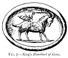 
Click to enlarge</a> 
FIG. 7.--King's <em>Handbook of Gems</em>. 
</td>
</tr>
</tbody>
</table>

recorded by Hesychius to have set up, in the Acropolis at Athens, the
figure of a grasshopper (cricket) or grillo, as a charm or amulet to
avert the evil eye from the citizens. [193](#fn_204.md) This insect is constantly found
engraved on gems ([Fig. 7](#img_12100).md) with a

p. 122

similar intention. [194](#fn_205.md) The grillo or
locust is said [195](#fn_206.md) to have been
adopted as an amulet from its likeness to a skeleton, which is still the
emblem of Chronos or Saturn, and a powerful charm against the evil eye.

The Maltese, who are full of beliefs about the 

<table data-align="LEFT">
<colgroup>
<col style="width: 100%" />
</colgroup>
<tbody>
<tr class="odd">
<td data-valign="CENTER"><a href="img/12200.jpg">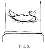 
Click to enlarge</a> 
FIG. 8. 
</td>
</tr>
</tbody>
</table>

evil eye, have set an amulet upon the base of a statue in front of the
Church of Crendi near Valetta, which the writer sketched on the spot
([Fig. 8](#img_12200).md)--a crescent with a serpent coiled about it. When
we come to speak of the Cimaruta and the specific charms used in Italy,
we shall see clearly that this relief can only be intended as an amulet.
Abundant evidence will be produced later on to show that amulets were
used also as household ornaments, much as we now use vases and other
nicknacks upon our chimney-pieces and tables. It is very probable that
the teraphim, translated *images* in our Authorised Version, [196](#fn_207.md) which Rachel stole from Laban, were
really amulets of the kind not to be worn, but used as protecting
objects; these, like the Lares and Penates of subsequent times, were
looked upon almost as objects of worship, though not as actual gods.
Indeed we can have no reason to believe Laban idolatrous, or that Rachel
carried them off with the intention of worshipping them. Still it is
evident they were highly prized. [197](#fn_208.md)

p. 123

We are told [198](#fn_209.md) that "the ear-rings"
mentioned in Gen. xxxv. 4 and Hosea ii. 13 were really amulets, and were
connected with idolatrous worship. Amulets, however, were mostly worn
round the neck, or rather suspended from a necklace and forming its
centrepiece. We find this custom coming down to us here in England,
through the classic and Middle Ages to our own times, though just now
out of fashion, in the various lockets containing hair, etc., with other
articles of a like kind forming the central ornament of necklaces. In
some

p. 124

countries these things are still worn, not as mere ornaments, but
avowedly as protective amulets against dread fascination. By no means
were all hung round the neck, for the phylacteries which were worn as
the "frontlets between thine eyes" (Exodus xiii. 16) were true amulets.
One kind of phylactery was bound upon the bend of the left arm, and the
other on the forehead. They were little leather boxes containing strips
of parchment on which were written the four following passages of
Scripture, called the Tetragrammaton, namely, Exod. xiii. 2-10 and
11-16; Deut. vi. 4-9 and xi. 13-21. They were certainly worn by all Jews
over thirteen years of age in the time of our Lord. [199](#fn_210.md)

Slips from the Koran, the Scriptures, or other writings, are now worn on
the person, or upon horses and camels, by Arabs, Turks,
Abyssinians, [200](#fn_211.md) Greeks, Italians,
and even English. They are all avowedly worn for the purpose of averting
the evil eye; and seeing that the dread of it was perhaps even greater
in old days than now, it seems but reasonable to assume that the direct
object of the biblical phylactery was then, as it is to-day, to baffle
the malignant glance.

It is curious that Turks, and, indeed, all Mahomedans, once used animals
and figures of men, representing various deities, as amulets against
fascination, but since their conversion from heathenism they have
discarded most of these, and now wear sentences from the Koran, avowedly
to guard them against the evil eye. Little silver cases to contain them,
such as are shown on [Fig. 112](tee11.htm#img_25900.md), [p.
259](tee11.htm#page_259.md),

p. 125

are regular articles of sale in all Eastern bazaars. At Constantinople
they may be bought by the dozen.

It was said by Plutarch [201](#fn_212.md) that
when Isis brought into the world Harpocrates, the posthumous son of
Osiris, she wore an amulet round her neck, in the shape of a *vase*, the
"emblem of Ma," the goddess of truth. The vase was also a symbol of
Osiris. [201a](#fn_213.md) This vase represented
water; hence the vivifying power of nature, *i.e.* Osiris the
personification of the Nile [202](#fn_214.md)
which was thus typified by a vase.

Among the ancient Egyptians not only were protecting amulets worn by the
living, but in that land where the belief in a future life seemed to
absorb so much of the care and interest of the present, they placed them
in profusion on their dead, in order that they might be protected from
evil spirits and the blighting eye, during the dark passage from this
world to the next.

Maspero [203](#fn_215.md) says these amulets
(speaking of scarabs)

  [  
Click to enlarge](img/12500.jpg.md)  
FIG. 9--From Author's Collection.  

were "symboles de durée présente ou future," placed, *ailes déployées*,
upon the breast of the dead along with a written prayer ([Fig.
9](#img_12500).md), that the heart (of the

p. 126

person) whose form the beetle was made to represent, would never bear
witness against the dead in the day of judgment. The commonest of all
Egyptian amulets, except the scarab, was that known to English people as
the Eye of Osiris: "L'œil mystique ([Fig. 10](#img_12600).md), l'ouza lie
au poignet ou 

<table data-align="LEFT">
<colgroup>
<col style="width: 100%" />
</colgroup>
<tbody>
<tr class="odd">
<td data-valign="CENTER"><a href="img/12600.jpg">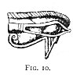 
Click to enlarge</a> 
FIG. 10. 
</td>
</tr>
</tbody>
</table>

au bras par une cordelette, protégeait contre le mauvais œil, contre les
paroles d'envie ou de colore, contre la morsure des serpents." These
scarabs and mystic eyes were worn equally by the living and the dead "as
amulets against evil magic." [204](#fn_216.md)
Moreover the mystic eye appears everywhere painted on walls. One such,
of especial size and prominence, is to be found over the door of one of
the upper chambers in the temple of Denderah, and it is seen constantly
as one of the hieroglyphics translated *ut'a*. [205](#fn_217.md)

We find the eye also used for two other signs in Egyptian writing. It
was said to be that of Shu or Horus as the god of stability, and was
carried in funeral processions along with the sacred boat. [206](#fn_218.md) Wilkinson says it "was placed over the
incision in the side of the body when embalmed, was the emblem of Egypt,
and was frequently used as a sort of amulet and deposited in the
tombs." [207](#fn_219.md)

p. 127

It was natural from the association of idea with fact, or "sympathetic
magic," that representations of the eye itself should among all people
have been considered potent amulets against its malign influence. The
Phœnicians certainly used it as an amulet. In the Museum at Carthage,
among the objects found in the ancient tombs, there are 

<table data-align="RIGHT">
<colgroup>
<col style="width: 100%" />
</colgroup>
<tbody>
<tr class="odd">
<td data-valign="CENTER"><a href="img/12700.jpg">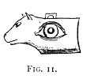 
Click to enlarge</a> 
FIG 11. 
</td>
</tr>
</tbody>
</table>

numerous examples of the head of an animal in blue pottery, having a
very large eye at the side of the head ([Fig. 11](#img_12700).md). These
were all provided with eyelets for suspension. Precisely the same thing
was, in 1889, to be seen in the Ashmolean Museum, from Beirut, showing
it to have been a common object among the Phœnicians. Similar amulets
are to be seen in the museums of the Louvre and at Athens. The Etruscans
also had an amulet of this kind. The head itself is said [208](#fn_220.md) to be that of a panther, and from the
number of specimens of this identical amulet which the writer has seen
in various museums, brought from widely separated countries, yet all in
the track of the Phœnicians, we may take it as established, that 

<table data-align="LEFT">
<colgroup>
<col style="width: 100%" />
</colgroup>
<tbody>
<tr class="odd">
<td data-valign="CENTER"><a href="img/12701.jpg">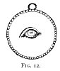 
Click to enlarge</a> 
FIG. 12. 
</td>
</tr>
</tbody>
</table>

this form of the eye amulet was most in use among that ancient people.

In the Louvre among the gems is a medal-shaped amulet ([Fig.
12](#img_12701).md), with an eye alone in the centre; and Jahn gives
several other examples of the single eye used as an amulet, especially
in two necklaces drawn on Taf. V. of his article. In one, the eye is

p. 128

the pendant to a necklace formed of *conchæ veneris*; this latter ([Fig.
13](#img_12800).md) a potent charm in itself against 

<table data-align="LEFT">
<colgroup>
<col style="width: 100%" />
</colgroup>
<tbody>
<tr class="odd">
<td data-valign="CENTER"><a href="img/12800.jpg">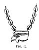 
Click to enlarge</a> 
FIG. 13. 
</td>
</tr>
</tbody>
</table>

fascination among the Greeks of old, and among the Turks, Arabs, and
Nubians of to-day. Jahn considers the head of which this eye is the most
obvious feature to be that of a fowl (or cock). [209](#fn_221.md)

As we proceed with the consideration of the various charms and amulets
used by ancients and moderns alike, we shall find that not only were
single objects, such as the eye, the hand, and many others to which we
shall refer later, used as such, but that there was a combination, a
sort of piling up of emblems and symbols, so that we constantly find
objects of a highly composite character differing very essentially in
their several component parts, but yet on the whole presenting a sort of
similarity; while it is perfectly obvious that the design or purpose of
these compound amulets was in all cases the same.

We shall endeavour to discover as we go on what was the special import
of each item of these many compounds, and as far as possible to decide
what deity was typified by the several representations made use of--for
at the outset we postulate that every one of the symbols used, does
definitely represent some deity or other personification, who was
believed by the possessor of the amulet to be a protector against
maleficent influence. The combination

p. 129

of symbols we find to be as various both in number and description,
whether we take ancient or modern dates, as is now the cult of the
various saints in the calendar; so that when we find an amulet of
unusually complex character, bearing a great number of symbolic figures,
we may take it to be the prototype and the equivalent of the latter-day
summing up of "All Saints" or "all the company of heaven." A singular
comment upon this accumulation of protectors is seen' in an inscription
of the first year of our Christian era, A.U.C. 754, found quite recently
in the Tiber near the Church of Sta. Lucia della Tinta.

Under the consulship of Caius Caesar and Lucius Paulus, a freedman named
Lucius Lucretius Zethus was warned in a vision by Jupiter, to raise an
altar in honour of Augustus, under the invocation of "Mercurius Deus
Æternus." Following these directions, Lucretius Zethus had the altar
made, and unwilling apparently to hurt the feelings of the gods in
general, dedicated it not only to Mercury Augustus, but at the same time
to Jupiter, Juno, Minerva, the sun, the moon, Apollo, Diana, Fortune,
Ops, Isis, Piety and the Fates. From an epigraphic point of view, this
monument ranks among the very best discovered in the works of the
Tiber. [210](#fn_222.md)

A great number of ancient compound amulets in the shape of marble
reliefs, medals and engraved gems, have been found, in which an eye is
the central object, while grouped around it are various animals or other
emblems of protecting divinities.

Jahn in his well-known paper gives no less than six different medals and
gems, which have for each the eye as a centre, surrounded by a greater
or less numerous grouping of symbolic figures, and all are undoubted
amulets of ancient date against the evil eye.

No. 2 in Jahn is taken from Caylus rec. vi, 38,

p. 130

\[paragraph continues\] 3 ([Fig.
14](#img_13000).md), and is a struck medal having in the centre the eye,
surrounded by a crocodile, swan, serpent, cock, dog, lion, winged
phallus, scorpion, and thunderbolt.

No. 3 ([Fig. 15](#img_13000).md) is from Arneth, *Gold- und Silbermon*, S.
iv. 96 G.--a medal with eyelet for

  [  
Click to enlarge](img/13000.jpg.md)  
FIG. 14, 15, 16.  

suspension. It has the eye in centre, with crocodile or lizard,
thunderbolt, elephant, scorpion, phallus (as seen at Pompeii), lion,
dog, swan, around it.

No. 4 is from Caylus rec. v. 57, 1, 2 ([Fig. 16](#img_13000).md), also a
medal with eye in centre, surrounded by thunderbolt, lizard, phallus,
scorpion, star, elephant, 

<table data-align="LEFT">
<colgroup>
<col style="width: 100%" />
</colgroup>
<tbody>
<tr class="odd">
<td data-valign="CENTER"><a href="img/13001.jpg">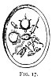 
Click to enlarge</a> 
FIG 17. 
</td>
</tr>
</tbody>
</table>

swan, fish, serpent. The medals are all of silver.

No. 5 ([Fig. 17](#img_13001).md) is an engraved gem, from the Florence
Museum. It has the central eye, with lizard, scorpion, frog, bee,
serpent, crab, bee again, and tortoise, surrounding.

No. 6 ([Fig. 17](#img_13001).md) also a gem from Antike Paste in Berlin,
described by Winkelmann, p. 554. It has the eye in the centre with
tortoise, lizard, scorpion, frog, bee, serpent, crab, and another bee,
surrounding. [211](#fn_223.md)

p. 131

No. 7 ([Fig. 18](#img_13100.md) is an engraved onyx [212](#fn_224.md) from Gerhard's collection, with
central eye, but with Jupiter's or Serapis's head, eagle, 

<table data-align="RIGHT">
<colgroup>
<col style="width: 100%" />
</colgroup>
<tbody>
<tr class="odd">
<td data-valign="CENTER"><a href="img/13100.jpg">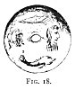 
Click to enlarge</a> 
FIG. 18. 
</td>
</tr>
</tbody>
</table>

thunderbolt, and dolphin, surrounding. On this last, Jahn remarks that
it is evidently a symbol of the highest protecting divinity. [213](#fn_225.md)

Still more remarkable than any of the foregoing amulets given by Jahn is
that of an engraved sard from the Praun gems, of which an illustration
is given by King, *Gnostics*, p. 115, and also *Handbook* 

  [  
Click to enlarge](img/13101.jpg.md)  
FIG. 19.--From King's *Gnostics*.  

of Engraved Gems, p. 81, where the central eye is surrounded by an owl,
serpent, stag, scorpion, dog, lion and thunderbolt ([Fig.
19](#img_13101).md).

p. 132

On this blood-red gem King remarks (*Gnostics*, p. 238) that it shows
"the evil eye surrounded by antidotes against its influence for every
day in the week, in the attribute of the deity presiding over each,
namely, the lion for *dies Solis*, the stag for *dies Lunæ* (*Diana
venatrix*), the scorpion for *dies Martis*, the dog for *dies Mercurii*,
etc." To these we must add the thunderbolt for *dies Jovis*. The owl,
however, was sacred to Athene or Minerva, and must have been substituted
as the symbol of *dies Veneris*, for Venus does not seem to have been
regarded as a protectress against fascination, unless we look upon her
as identical with Isis, Ishtar, and Diana; whereas Minerva, the bearer
of the Gorgon's head, was always one of the most potent protecting
deities. The serpent, too, was the symbol of Hecate, [214](#fn_226.md) one of the attributes, as we shall see
later, of Diana Triformis, and was considered one of the most powerful
of all the antidotes. Scarcely any compound amulet occurs without the
serpent, and hence we must suppose in the case we are considering that
it was adopted as the symbol applicable to *dies Saturni*.  [214a](#fn_227.md)

In considering this gem, we must not forget its Gnostic character, and
that its origin was Græco-Egyptian, though the work of a European hand.

p. 133

\[paragraph continues\] Hence every symbol
must be interpreted as Egyptian from a Greek point of view. Now as we
know, and as Pliny [215](#fn_228.md) long ago
related that there are no stags in Africa, it is clear that the designer
of this amulet must have denoted by the stag a deity of the Græco-Roman
mythology; and we must therefore look for one whose prototype is to be
found in Egypt, and whose attributes were the same as the Ephesian Diana
whom undoubtedly the stag represented in his idea. This could be no
other than Hathor, whom we must look upon like Diana, as distinctly a
moon goddess. [216](#fn_229.md) So the
thunderbolt, in like manner, would represent Serapis, the great Sun-god.

Thus considered, every one of the symbols on this week-day amulet
ultimately resolves itself into one or other of the great Gnostic gods,
the Sun and Moon.

The use of the eye as the central object in amulets involving
sympathetic magic, may be taken to be universal. "Arab amulets at the
present day bear the figure of the thing against which they exert their
virtue, and all oriental practices in this line come down from
immemorial antiquity." [217](#fn_230.md)

The Maltese, partly Arab and partly Italian, holding the beliefs and
customs of both parent stocks,

p. 134

are specially in dread of the evil eye, and being a maritime people too,
we should look for marks of this in connection with their principal
calling, for perils by the sea are everywhere believed to be constant
sources of danger subject to maleficent influence. Consequently we find
the native boats, as a regular part of their decoration, have a large
eye painted on each side of the bows, giving them a very weird and
uncanny appearance, much enhanced by the high prolongation of the stem.
The same kind of stem is seen in the Neapolitan boats, though without
the eyes.

The writer has seen boats having eyes on either side of the prow in some
other places, at Smyrna, or one of the Greek ports, but having missed
his note cannot recall at which port it was. This custom is evidently of
great antiquity. The eye was placed on boats by the ancient
Egyptians, [218](#fn_231.md) and also by the
Etruscans. [219](#fn_232.md) Dennis remarks: [220](#fn_233.md) "The presence of eyes on the bows of
ancient vessels, perhaps originating in the fancied analogy with fish,
or to intimate the vigilance necessary to the pilot, is well
known--'they were charms against the evil eye.'" [221](#fn_234.md)

Besides the conventional *ouza* or *œil mystique* already referred to,
the Egyptians wore eyes as amulets of a more realistic character. They
were in pairs, looking fully to the front, and were pierced

p. 135

 

  [  
Click to enlarge](img/13500.jpg.md)  
FIG. 21  

 

p. 136

with the usual hole for the string. A number of examples of this kind
may be seen in the Ashmolean Museum at Oxford.

In the remarkable necklace or string of amulets found in a tomb at
Kertch, taken by Jahn from the Russian work of Achik, [222](#fn_235.md) a great many of the separate objects
have markings on them which can only be intended for eyes ([Fig.
21](#img_13500).md).

Jahn, page 41, says that necklaces with separate pendants as amulets are
extremely common in Etruscan art-work. Among other people, girdles of
various kinds, arm-bands with amulets thereon, are common, and specially
in Italian art-work.

Among the Etruscans 

<table data-align="LEFT">
<colgroup>
<col style="width: 100%" />
</colgroup>
<tbody>
<tr class="odd">
<td data-valign="CENTER"><a href="img/13600.jpg"> 
Click to enlarge</a> 
FIG. 22 
</td>
</tr>
</tbody>
</table>

a prominent eye was often placed on objects which can hardly be called
amulets, but on which the eye may well be considered to take the place
it does at present on

  [  
Click to enlarge](img/13601.jpg.md)  
FIG. 23.  

Maltese boats. It was in itself a powerful amulet,

p. 137

and was therefore used as a conspicuous object of decoration.

  [  
Click to enlarge](img/13700.jpg.md)  
FIG. 24--From Woburn Marbles.  

[Fig. 22](#img_13600.md) is from Vulci. [223](#fn_236) [Fig. 23](#img_13601.md) is an Etruscan
winged deity. [224](#fn_237.md)

p. 138

Perhaps the most noteworthy of all the amulets in which the eye forms
the central object in combination with several other emblems, is the
very remarkable relief illustrated in Millingen's paper in vol. xix. of
*Archæologia*, p. 74, and referred to by Jahn. [225](#fn_238.md) It is one of the Woburn marbles ([Fig.
24](#img_13700).md) in the collection of the Duke of Bedford, and measures
1'6" x 1'5", but this last dimension is not perfect, being broken on the
left side. There was a framing, and it is usually thought to have been
built into a wall, as a house-decoration, but still more as a
protection. The centre is a large human eye, and, as Jahn says, "the
left, which may be considered a special feature of its sinister
intention, and moreover the pupil is strongly marked." [226](#fn_239.md) Over it is a very prominent eyelid and
an arched brow. Above this is seated a beardless man in a Phrygian cap,
with his back towards the spectator, and his head turned backwards. He
is squatted down with both hands on his knees, has his shirt pulled up,
and strikingly exemplifies the description of Pomponius:--

"Hoc sciunt omnes quantum est qui cossim cacant." [227](#fn_240.md)

\[paragraph continues\] Moreover it is
evident that he is in that position which even now conveys in its full
reality (in England no less than in Germany) the common

p. 139

typical expression of the utmost contempt. [228](#fn_241.md) In fact, the figure is sitting on the
eye in a most indecorous position, and as we explain later, any object
or gesture which gave rise to an indecent or obscene idea was looked
upon as specially effective in the way of a protection against
fascination. One cannot help once more remarking here, how strikingly
this mockery of the evil eye, this challenging of its malignity in the
old Roman days of Septimius Severus, to which period this marble is
ascribed, are reproduced in this enlightened nineteenth century by the
heroic performances of the "Thirteen Club." Surely the dinner with its
brave defiance of the Fates is a very eloquent and convincing piece of
evidence that so-called civilisation, enlightenment, culture and all the
rest of it, have not even yet eradicated the feeling, which has existed
in man's breast from the remotest antiquity-that there is a power, an
influence, a something passing from certain persons to others, which
though unseen, unfelt, unmeasured and incapable of explanation, at least
is dreaded by many, and perhaps most by some of those who scoff loudest,
and outwardly defy it most ostentatiously.

It is well known that at the present day Neapolitan and other Italian
sailors use this same identical attitude, turning themselves thus
towards a contrary wind, in the belief that by such contemptuous
defiance of the adverse spirit of the wind, its direction may be
changed. [229](#fn_242.md)

p. 140

On the right of the spectator in our illustration is another figure with
his face turned towards the Phrygian, the former appears to be a
gladiator wearing the distinctive girdle called the *subligaculum*. In
his right hand is the trident, with which he seems to stab the eye, and
in his left a short sword [230](#fn_243.md)
(*fuscina*). The yoke-like object on his left shoulder, and the armlet
he wears, recognised as the *galerus*, [231](#fn_244.md) prove that he was a *Retiarius*, one
of those who fought with a net, which he tried to throw over his
opponent the *Mirmillo*, so as to entangle him and his shield; and then
he attacked him with the trident. The *Retiarius*, moreover, used to
fight bare-headed like the figure here. There was most likely (Jahn
says, *ohne Zweifel*) a figure on the opposite side of the bas-relief,
which is now broken off, and it is here suggested that the latter may
have represented the opposing *Mirmillo*, though Jahn says nothing upon
that subject.

On the lower part of the marble are five animals seemingly attacking the
eye with great fury. These are a lion, a serpent, a scorpion, a crane,
and a raven or crow--each one a distinct amulet in itself.

Millingen remarks that no doubt can be entertained but that the evil eye
or *fascinum* is here represented, and in this opinion he is fully
supported

p. 141

by Jahn; while to any candid observer the relief itself is by far the
best evidence. [232](#fn_245.md)

It was usual to ornament the coffins or mummy cases of the ancient
Egyptians with two large open eyes, with two monumental doors on the
left, while on the right they placed three doors. These eyes could only
have been intended to answer the same purpose on the outside as the *œil
mystique* within.

The remarkable scene here given ([Fig. 25](#img_14100).md) from an amphora
found at Vulci, now in the British

  [  
Click to enlarge](img/14100.jpg.md)  
FIG. 25.  

\[paragraph continues\] Museum, is but a
sample of the eyes found on painted vases like this, not only of
Etruscan, but also of undoubted Greek origin, which are fully
recognised, says Dennis, as charms against the evil eye. [233](#fn_246.md)

The curious representation of the great eyes (evidently the feature of
the whole) upon the conventionalised wings of two Sirens, and upon those
of a Fury in the collection of Sig. Bargagli at Sarleano, described by
Dennis, [234](#fn_247.md) forms another connecting
link in the chain which we hope to forge, by which we shall connect the
sirens of modern Naples with

p. 142

the ancient mythology of Egypt, Greece, and Rome. The Etruscans
ornamented their vases and furniture with eyes very conspicuously
depicted, as may be seen in the *Museo Gregoriano* in Rome and
elsewhere. On these Dennis [235](#fn_248.md)
remarks, that they "have evidently an analogy to those so often painted
on the Hellenic vases, and have probably the same symbolic meaning."

The ancient Egyptians, too, were accustomed to 

<table data-align="LEFT">
<colgroup>
<col style="width: 100%" />
</colgroup>
<tbody>
<tr class="odd">
<td data-valign="CENTER"><a href="img/14200.jpg">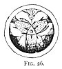 
Click to enlarge</a> 
FIG. 26. 
</td>
</tr>
</tbody>
</table>

adorn their pottery with the eye as a special feature of the design. The
strange combination of three fishes with three lotus flowers here given
([Fig. 26](#img_14200).md) is from Maspero, *Arch. Egypt.* p. 255. [236](#fn_249.md)

Except upon Maltese and some other boats, or in masonic symbolism, the
eye seems to have passed out of modern use, and as an amulet almost
exclusively to be a thing of the past; even among the ancients it was by
no means the commonest emblem used against its own influence. Eyes,
however, made of wax or silver are extremely common to-day as *ex
votos*--hung up in churches, before *Notre Dame de bon secours*, and
some other favourite saints, such as SS. Cosmo e Damiano. We must ever
bear in mind that it was, and continues to be, believed that the first
glance of the evil eye was the

p. 143

most fatal, and therefore it was of the utmost importance that any
object intended to protect against its influence should be such as
should attract the first or fatal stroke; for it was just as firmly
held, that whatever diverted it for the moment from the person or animal
liable to injury, absorbed and so destroyed its effect. Anything,
therefore, calculated to excite the curiosity, the mirth, or in any way
to attract the attention of the beholder was considered to be the most
effectual. There were three methods generally accepted for averting
fascination, whether it were of look, voice, touch, or bodily presence
of the fascinator. [237](#fn_250.md) These were,
by exciting laughter or curiosity; by demonstration of good fortune so
as to excite envy in the beholder and so to draw his evil glance upon
the object displayed; and by doing something painfully disagreeable to
cause him an unpleasant feeling of dread lest he, the fascinator, should
be compelled to do likewise. [238](#fn_251.md)

Plutarch in a remarkable passage [239](#fn_252.md)
declares that the objects that are fixed up to ward off witchcraft or
fascination, derive their efficacy from the fact that they act through
the strangeness and ridiculousness of their forms, which fix the
mischief-working eye upon themselves. [240](#fn_253.md)

It was this firm belief which led to the design of those extremely
grotesque figures amongst the Romans of which they were so fond, and of

p. 144

which we have such numberless examples in every museum of ancient gems.
These amulets, all intended for the same purpose, are now called

  [  
Click to enlarge](img/14400.jpg.md)  
FIG. 27., 28., 29.  

\[paragraph continues\] *Grylli*, from
modern Italian *grillo*, signifying both a cricket or grasshopper, and
also a caprice or fancy. [241](#fn_254.md) 

<table data-align="LEFT">
<colgroup>
<col style="width: 100%" />
</colgroup>
<tbody>
<tr class="odd">
<td data-valign="CENTER"><a href="img/14401.jpg">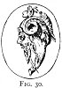 
Click to enlarge</a> 
FIG. 30 
</td>
</tr>
</tbody>
</table>

Though some are compounded of the grillo itself with other objects, yet
they are mostly formed out of portions of various animals of the most
diverse kinds combined into one nondescript, impossible monster, such as
the examples here given (Figs. [27](#img_14400)-[30](#img_14401).md).

These grotesques formed of the creatures, sometimes called *Chimeræ*,
have been by some considered as Gnostic remains; but it is urged on the
other side, [242](#fn_255.md) that besides never
exhibiting the symbols which are characteristic of Gnosticism, the style
of work proclaims them to the least experienced eye to belong to a much
earlier date--that of the best period of

p. 145

Roman art. [243](#fn_256.md) In any case the
strange combination of various animal forms in one is certainly a
practice handed down from ages long antecedent to either

  [  
Click to enlarge](img/14500.jpg.md)  
FIG. 31., 32., 33.  

Gnosticism or Roman history. Early Etruscan bronze amulets were very
commonly formed by 

<table data-align="RIGHT">
<colgroup>
<col style="width: 100%" />
</colgroup>
<tbody>
<tr class="odd">
<td data-valign="CENTER"><a href="img/14501.jpg">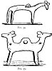 
Click to enlarge</a> 
FIG. 34., 35. 
</td>
</tr>
</tbody>
</table>

the union of two animals in one body, as well as by very rude
representations of a single one. This may be seen in the cuts herewith
([Figs. 31, 32, 33](#img_14500).md), from the Etruscan Museums of Bologna
and Cortona, and [Figs. 34, 35](#img_14501), [36, 37, 38](#img_14600.md),
from the Ashmolean at Oxford. Moreover we have the famous vision of
Ezekiel in which the faces of a man, lion, ox, and eagle were conjoined,
and these components have

p. 146

in Christian art been separated and become the symbols of the four
Evangelists.

In treating of amulets it behoves us to give an early place in our
consideration to that which of all others may be taken as the first, the
original germ,

  [  
Click to enlarge](img/14600.jpg.md)  
FIG. 36., 37., 38.  

at least so far as noticeable in Greek art--the head of the Medusa, or
as it is commonly called, the Gorgoneion.

The story of Perseus and of his killing the Medusa, whom he only
ventured to look at in a mirror, need not here be detailed, but in it we
have at least a very early incident in the primæval belief in the evil
eye. So far as Greek art goes, we have in the hideous representation of
her dog-toothed, split-tongued visage, the earliest example which we can
positively assert to be a prophylactic charm against the fatal glance
which she was believed to have possessed; for though there are plenty of
Egyptian

p. 147

amulets of earlier date, it cannot be certainly declared what was their
precise intention. This very remarkable object is of so much importance
that we must make it a subject to be treated apart; [244](#fn_257.md) suffice it here to say that from being
the earliest of amulets known to European art, so the illustration on
[p. 160](tee07.htm#page_160), [Fig. 49](tee07.htm#img_16000.md), shows it
to be one of the latest, if not the latest, used in Christian times to
baffle the evil eye. We also see by the same illustration that it is one
of the most debased among the many examples of declining art. It is of
course out of our province, and beyond our ability, to decide whence the
Greeks obtained the story, and we must leave that question to experts
who are content to contract more narrowly their investigations. The
obvious development of the early idea of the Gorgon's head, from its
first conception of the intensest ugly frightfulness, until it became at
last by the gradual refinement of taste, as shown in classic art, the
ideal of female beauty, culminating in the well-known Strozzi
Medusa, [245](#fn_258.md) demands careful
attention.

The step from the famous death-dealing visage, as a protection against
the very evil it was believed to produce, is but short to that of
hideous faces in general; and hence we find that strange and contorted
faces or masks were certainly used as objects to attract the evil eye,
and so to absorb its influence, and to protect the person wearing or
displaying the mask. The very origin of the name *mask* is said to be
but

p. 148

a corruption of the older Greek βασκα, whence βασκανία, *fascina* or
amulets. "From this custom of regarding hideous masks as amulets can be
explained a circumstance otherwise a problem to every archaeologist--the
vast number of such subjects we meet with in antique gems." [246](#fn_259.md) Not only so, but their importance is
still more impressed upon us by the fact that the highest skill known to
Roman art was lavished upon the engraving of masks.

Nothing, as is well known of all ages, so much attracts or excites
curiosity as obscenity and indecency; [247](#fn_260.md)

  [  
Click to enlarge](img/14800.jpg.md)  
FIG. 39., 40.  

and hence of all amulets, those partaking of this character were the
most potent, and therefore the most used. Anything strange, odd, or
uncommon, as likely to attract the eye, was considered most effectual,
and consequently the objects viewed as protective against it were almost
infinite in number. For the reasons given we find in compounded amulets
that the commonest of all objects was the phallus, or some other,
suggesting the ideas conveyed by it.

p. 149

Amulets then which protect against the power of fascination would
naturally be of three classes. First, those whose intention was to
attract upon themselves the malignant glance. These were necessarily
either worn on the outside of the dress, or openly exposed to view like
the grillo of Pisistratus at Athens, the brazen serpent set up by Moses,
or the various household objects displayed for the same purpose.
Secondly, there were all those charms, worn or carried secretly, or
hidden beneath the dress; and thirdly, the written words of Scripture,
Koran, and other sacred writings, or the cabalistic figures and formulæ
considered so powerful.

The former class were the most numerous, and of them we have the
greatest number of examples, both ancient and modern. For the reason
above stated, amulets consisting alone of *das männliche Glied*, or
compounded with it as the attractive feature, were so common that they
obtained a technical name from the purpose they were intended to serve.
The usual term among old writers was *fascinum*. [248](#fn_261.md)

Other writers, especially Varro, call one particular form which was
commonly suspended from the necks

p. 150

of children *turpicula res*, *scæva* or *scævola*, and he discusses at
some length the development of the word. [249](#fn_262.md)

Dodwell (vol. ii. p. 34) says: "They are frequently found in Italy of
bronze, and the other extremity of the symbol is terminated by a hand
which is closed; the thumb protruding between the fore and middle
fingers. [250](#fn_263.md)

This is but a very partial description of a most remarkable object much
easier portrayed than described. It is of so obscene a character that it
cannot here be reproduced.

A full-sized illustration of one in bronze from the Dresden collection
is given (p. 81) in Jahn's *Ueber den Aberglauben*, etc. It is evidently
a pendant-amulet, having three extra eyelets, from which probably little
bells were hung, such as will be seen later on in our illustrations of
the Sirens and Sea-horses. One branch of the pendant consists of a
phallus such as Frommannd describes (p. 5), *tam rigidum reddere quam
cornu*; while to balance it, is an arm ending in a fist with the thumb
protruding as stated by Dodwell. The central part or body is composed of
another membrum, of the kind constantly found as a separate amulet. Any
number of these may be seen both as amulets and as *ex votos* in the
private Museum at Naples, and also in the Museum of the Collegio

p. 151

\[paragraph continues\] Romano. A very
beautiful specimen of a *turpicula res* is in one of the cases of
antique jewellery in the Louvre Museum. It is of gold, and measures
about an inch and a half wide, and itself forms the pendant to a
complete necklace, having above it as part of the pendant a fine
amethyst cut as a scarab. There may be others in other museums, but the
above is by far the most elaborate known to me, and is a most
interesting study. In the same case are several other amulets against
the evil eye, among which is the medal ([Fig. 12](#img_12700).md).

In the Naples Museum are many bronze examples of various sizes, but all
similar in pattern; in all cases the thumb is between the first and
second fingers. There are also many phalli with eyelet holes to enable
them to be worn as charms.

The vast antiquity of the phallic necklace can be easily demonstrated:
it was very ancient even in the days of Horace and Varro; and it may be
that the Romans got their *fascinum* from Egypt. In a recently
discovered tomb at Thebes, near that of Rekhamara, the account of which
has not yet found its way into the guide-books, the writer was struck by
a singularly fresh and distinct painting of a necklace--the colour as
bright as the day it was painted, more than three thousand years ago. It
is formed of a chain fastened by a serpent's head, such as may be seen
in our own shops to-day. The ornaments are three pendants--the
phallus, [251](#fn_264.md) the most conspicuous,
in the centre, the symbol of stability, and the *ankh*, or symbol of
life, on either side.

p. 152

\[paragraph continues\] The necklace so
carefully painted is being presented by one female figure to another,
but there are no special attributes by which to decide whom they are
meant to represent. The attitude of the figures, and the prominence
given to the three pendants of the offering, show that it was intended
to be received and worn as a protective amulet.

Although of course the *turpicula res* is no longer to be found in
actual use, yet the fist with protruding thumb is to-day one of the
commonest of objects 

<table data-align="LEFT">
<colgroup>
<col style="width: 100%" />
</colgroup>
<tbody>
<tr class="odd">
<td data-valign="CENTER"><a href="img/15200.jpg">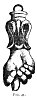 
Click to enlarge</a> 
FIG. 41 
</td>
</tr>
</tbody>
</table>

worn as a charm for the watch-chain. The complete survival of the
ancient amulet is no longer permitted by the papal censors, but the
hand-part of it is still the ordinary baby's sucker or plaything hung
upon a child's neck in Rome, where of old the grosser object held its
place. In fact this hand in silver is to the Roman child of to-day what
our "coral and silver bells" was to us in our childhood--the regulation
christening gift. [Fig. 41](#img_15200.md) is from the writer's collection;
actual size. It is of silver, and was bought in a shop close to the
Campo dei Fiori, where it was one of a large bunch of at least twenty
exposed for sale, showing that it is an article in large and regular
demand. The same thing may be seen in almost any silversmith's shop out
of the beat of the ordinary tourist. This special article seems to be
confined to Rome and its neighbourhood, for, as we shall see later,
something

p. 153

very different is worn by the babies in Naples and Southern Italy.

In making purchases of this and of the many other charms in the writer's
possession, it has always been his practice to inquire of the seller
what was the object of the article. In every case the answer has been
the same--"*Contra malocchia*" in Rome; "*Contra la jettatura*" in
Naples.

The antiquity of the phallus as an amulet is shown by the number found
among Egyptian sculptures. No visitor to Egyptian antiquities needs to
be told this. Indeed, it was held to have been consecrated by Isis
herself. [252](#fn_265.md) The phallus was the
most sacred amulet worn by the vestal virgins of ancient Rome. [253](#fn_266.md) Moreover, we find that Sesostris of
the early twelfth dynasty, who conquered Asia, set up memorials of a
phallic nature among the people who had acted bravely, but among the
degenerate, female emblems engraved on *stelæ* were set up. [254](#fn_267.md) Who shall say these objects may not
have been the origin of those still to be found so universally
throughout India? In the ruins of Zimbabwe, in Central Africa, are to be
seen phalli carved upon stone, similar to those found in Sardinia, which
are said to be Phœnician. [255](#fn_268.md) The
like have been seen by the writer on the so-called Phœnician ruins of
Hajar Khem in Malta. Again, numbers of phallic amulets in bronze are
found in the earliest Etruscan tombs as well as in the museums of the
Collegio Romano, of Cortona and of Bologna, marked

p. 154

as belonging to the *prima età di ferro*--a time which, like Egyptian
monuments, makes the objects of Classic Rome things of yesterday. The
objects on [Fig. 42](#img_15400.md) are in the Museum at Bologna. In the
Naples Museum are a number of vases of different shapes, ornamented with
vine leaves and tendrils

  [  
Click to enlarge](img/15400.jpg.md)  
FIG. 42.  

alternating with a phallus, forming a belt of decoration round the belly
of the vase.

The object described as *satirica signa* by Pliny, and so constantly
referred to, appears not only upon the amulets of which the eye is the
centre, but is that to be seen over so many of the doorways in Pompeii.
It by no means signified that which the *ciceroni* now tell the
tourist; [255a](#fn_269.md) but was placed there
as a protective amulet against fascination. We read [256](#fn_270.md) that it was the common sign over a
blacksmith's forge, and no doubt inasmuch as the horses who came to him
to be shod were specially liable to the malign influence, so the smith
would naturally provide the best possible protector for the animals by
whom he got his living.

"That such representations were placed by the ancients on the walls of
their cities, there is no lack of proof. [257](#fn_271.md)They are found on several of the early

p. 155

cities of Italy and Greece, on masonry polygonal as well as regular." At
Alatri it is tripled, sculptured in relief on the lintel of a postern or
passage in the polygonal walls of the citadel. It is also tripled on the
Pelasgic walls at Grottatore. Another is found on the ancient wall of
Terra di Cesi, near Terni, and again on the ancient fortifications of
Todi on the upper waters of the Tiber, where it is in high relief, and
is well known as *il pezzo di marmo*. There is one on a block in the
wall of Oea, in the island of Thera in the Ægean Sea, with an
inscription accompanying it, which distinctly proves it to have been
intended to avert the evil eye. The same thing has been found on the
doors of ancient tombs at Palazzuolo in Sicily, at Castel d'Asso in
Etruria, and in the Catacombs of Naples. Of all places, however, the
greatest number now to be seen are amongst the tombs and temples of
Egypt.

Jahn gives plates of a very remarkable kind, of objects sculptured on
the amphitheatre at Nismes, to be seen at the Dresden and other museums;
he pursues this subject at greater length than can be here followed. To
have omitted all notice of it would have been to leave out really the
part on which ancient and mediæval writers have dwelt longest; still it
is unsavoury, and we are glad to have done with it, the more so as we
have so many facts and objects to be found in the life of to-day which
seem to have been singularly overlooked by those who have written on the
evil eye.

Repeated mention is made in these pages of the many amulets to be found
in the Etruscan Museum at Bologna. Of the accompanying illustrations,
[Fig. 43](#img_15600.md) is taken from Burton's *Etruscan Bologna*,

p. 156

p\. 68, who gives it as a *pelekys* or axe, which he says is an amulet
against fascination. [Fig. 44](#img_15600.md) is from a sketch by the
writer from the same museum.

  [  
Click to enlarge](img/15600.jpg.md)  
FIG. 43., 44.  

\[paragraph continues\] It also suggests
an axe in shape, about one and a half times the size of illustration,
and from its being evidently for suspension, it is here suggested that
it may be an amulet. Being of bronze, and very thin, it is possible that
its use may be the same as the

  [  
Click to enlarge](img/15601.jpg.md)  
FIG. 45., 46.  

very numerous handled half-moons of about the same size, found there and
in other museums, which are well known to be ancient razors. In the
object here shown, there is but one possible cutting edge, that at the
bottom. [Figs. 45, 46](#img_15601.md) represent an Etruscan coin [258](#fn_272.md) of the town of Luna. The devices
engraved upon it almost certainly prove that they

p. 157

were intended as amulets. The axe and sword were each considered to be
such, while as to the two crescents, we may accept one as being a rebus
of Luna, and the other to be the consort of the central solar disc. The
head on the reverse may be the personification of the city or of Diana.

------------------------------------------------------------------------

### Footnotes

[116:182](tee06.htm#fr_192.md) *La Migration des
Symboles*, Comte Goblet d'Alviella, Hibbert Lectures, 1890-91:
Husenbeth, "Emblems of the Saints in Art," *Spectator*, June 29, 1889.

[116:183](tee06.htm#fr_193.md) Chapman, *Sermons
on Symbols*, 1888.

[118:184](tee06.htm#fr_194.md) "*Emblema* licet
cum isto ænigmatum genere in ratione symboli conveniat, differt tamen,
quod rem sublatis ænigmatum velis purius liquidiusque proponat. Est enim
proprie symbolum aliquod ingeniosum, suave, et moratum, ex pictura et
lemmate constans, quo aliqua gravior sententia indicari solet."--*De
symbolica Ægyptorum sapientia*. Nicolaus Caussinus. Coloniæ, 1623, p.
17.

[119:185](tee06.htm#fr_195.md) "On the main
gateway of the Old City (Citta Vecchia) at Malta is a statue of Juno,
ancient protectress of Malta, bearing her cognisance of a
peacock."--Col. R. L. Playfair, *Murray's Handbook to the
Mediterranean*, 1882, p. 199.

[119:186](tee06.htm#fr_196.md) *Notes and
Queries*, 8th ser. iv. p. 531 (December 30, 1893).

[120:187](tee06.htm#fr_197.md) Mrs. Gaskell in
*Nineteenth Century*, February 1894, p. 264.

[120:188](tee06.htm#fr_198.md) See *Notes and
Queries*, November 25, 1891 p. 426.

[120:189](tee06.htm#fr_199.md) *New English
Dictionary*, s.v. "Amulet."

[121:190](tee06.htm#fr_200.md) See *The Gnostics*,
by C. W. King, 1874, p. 115. Also Frommannd, *Tract. de Fasc.* p. 278,
who makes a long disquisition on this subject, giving the etymology and
origin of talisman as Arabic.

[121:190a](tee06.htm#fr_201.md) King, *op. cit.*
p. 115. According to *N. E. Dictionary*, "a word of unknown origin."

[121:191](tee06.htm#fr_202.md) *Natural History*,
xxv. 67 (Bohn, v. p. 125).

[121:192](tee06.htm#fr_203.md) *Notes and
Queries*, 1st ser. vii. p. 496.

[121:193](tee06.htm#fr_204.md) On this see Lobeck,
*Aglaophamus*, p. 973.. He quotes Pliny, xxix. (6) 39, but I cannot find
this in Pliny. Lobeck says Hesychius calls this amulet κερομία
προσβασκάνια.

[122:194](tee06.htm#fr_205.md) King, *Gnostics*,
p. 116.

[122:195](tee06.htm#fr_206.md) *Ibid.* p. 2 12.

[122:196](tee06.htm#fr_207.md) Genesis xxxi. 19.
See Frommannd, *Tract. de Fasc.* p. 715, who says Luther called these
*Silberne Götzen*. These are called *teraphim* in the R.V.

[122:197](tee06.htm#fr_208.md) Professor Huxley
says (*Science and Hebrew Tradition*, 1893, p. 309): "The teraphim were
certainly images of family gods, and as such in all probability
represented deceased ancestors," and further that Jacob was not
"scandalised by the idolatrous practices of his favourite wife . . . for
the teraphim seem to have remained in his camp." Other authorities say
(Reginald Stuart Poole in Smith's *Dict*. s.v. "Teraphim, Magic." Also
W. Aldis p. 123 Wright, s.v. "Nehushtan ")
"there is no evidence that they were ever worshipped. "There seems to be
a consensus of opinion that the teraphim, whatever they were, had much
to do with magic. It is here suggested that many of the numberless
little bronze statuettes, to be seen in various museums, probably
represent the Teraphim of the Hebrews and the Lares of Rome, and are not
mere ornaments. [Fig. 105](tee11.htm#img_24501.md) is surely one of these,
and its original cannot be later than the time of Jacob. The terra-cotta
figures too, beginning with the crude forms found at Mycenæ, and
developing into the beautiful artistic statuettes of later Greece, must
have been of the same character; for we cannot suppose that as mere
ornaments they would have been so carefully deposited along with the
dead. Nor does there appear to be any evidence that the Greeks or Romans
ever imbibed the Egyptian notion of placing figures of this kind with
the dead, as *ushebtiu*, to attend on the departed in the next world.

It seems rather an assumption than a certainty that teraphim were images
only of persons. It is suggested that among such may be included several
other objects, looked upon as prophylactic, or otherwise sacred. The
bronze bands, dealt with in the chapter on the Mano Pantea, would
distinctly come into this category. Further we find proof of this in the
point noticed by Huxley (p. 310), that it was not until the time of
Hezekiah that the brazen serpent of Moses was destroyed. During the
thousand years of its existence it had been preserved, and at length
from a protective teraphim had become Nehushtan. All this seems to show
that the brazen serpent, and all such objects as we now call amulets,
like the grillo of Athens, the crocodiles of Seville and Venice, were
not originally worshipped idolatrously, but were looked upon as
magically endowed with the power of countervailing the effect of the
malignant eye--the fertile source, as it was thought, of every evil to
mankind.

It has been well suggested (Farrar in Kitto's *Cyclopædia of Biblical
Literature*, s.v. "Teraphim") that the teraphim, and to them we would
add protective symbols in general, were looked upon much in the same way
that pictures and images are now looked upon by Roman Catholics, who
indignantly repudiate the notion of idolatry. No doubt the denunciations
of the prophets point to the same line of teaching as that of modern
Protestants, who can perceive no difference between the reverence paid
to the image itself, and that which all would admit to be due to the
person depicted.

[123:198](tee06.htm#fr_209.md) Smith's *Dictionary
of the Bible*, s. v. "Amulets."

[124:199](tee06.htm#fr_210.md) Upon this, see
Farrar in Smith's *Bib. Dict.* s. v. "Frontlets."

[124:200](tee06.htm#fr_211.md) See the remarkable
Ethiopic charm in Chap. XI.

[125:201](tee06.htm#fr_212.md) Wilkinson, *Ancient
Egyptians*, iii. 130.

[125:201a](tee06.htm#fr_213.md) *Ib*. iii. 80.

[125:202](tee06.htm#fr_214.md) Plutarch, *De
Iside*, s. 32; Wilkinson, iii. 74.

[125:203](tee06.htm#fr_215.md) *Archéologie
Egyptienne*, p. 236. See also Wilkinson, vol. iii. p. 486.

[126:204](tee06.htm#fr_216.md) Brugsch, *Egypt
under the Pharaohs*, vol. i. p. 468. Wilkinson, vol. ii, p. 334, gives a
number of necklaces, in nearly all of which the mystic eye appears,
while in some it is the only element, and in others is alternated with
other charms.

[126:205](tee06.htm#fr_217.md) *The Nile*, E.
Wallis Budge, p. 61.

[126:206](tee06.htm#fr_218.md) One of these
processions showing the eye is given as Plate lxvi. in *Wilkinson*, vol.
iii. p. 444.

[126:207](tee06.htm#fr_219.md) In the British
Museum is a case full of these mystic eyes of all sizes. There are also
necklaces composed entirely of them. Three of these in blue enamel are
shown on [Fig. 81](tee08.htm#img_20300.md).

[127:208](tee06.htm#fr_220.md) See Dennis, *Cities
of Etruria*, vol. i. p. 471.

[128:209](tee06.htm#fr_221.md) It is suggested
that the head here produced may be that of the Gnostic god Abraxas, who
is very frequently represented with the head of a cock. See the many
engraved gems showing this in *Abraxas seu Apistopistus* Johannis
Macarii. Antwerpiæ, 1657. Also in King's *Gnostics*.

[129:210](tee06.htm#fr_222.md) Rodolfo Lanciani,
*Athenæum*, No. 3313, April 25, 1891, p. 543.

[130:211](tee06.htm#fr_223.md) Nos. 5 and 6 have
precisely the same objects upon them, though differing in size.
Therefore one illustration here applies to both.

[131:212](tee06.htm#fr_224.md) This gem is a
*cameo*, upon which it may be remarked, that this word is said to be
Persian. "*Camahem* is a loadstone or fibrous hæmatite, the usual
material for Babylonish cylinders, and in use there down to the time of
the Cufic signets. The Arabs knowing no other motive for engraving of
stones than their conversion into talismans (amulets), gave the name of
the one most frequently used to the whole class; and the Crusaders
introduced it into all European languages in this sense. Matthew Paris
has *lapides quos cameos vulgariter apellamus*, which marks its foreign
origin" (King, *Gnostics*, p. 112). Mr. King does not give his
authority. Dr. Murray (*N.E.D.*) says, "Of the derivation nothing is yet
known." I do not find the above among the "guesses" alluded to by Dr.
Murray.

[131:213](tee06.htm#fr_225.md) The value of medals
whether to be worn as amulets, or used as talismans to procure objects
desired, or to cure diseases, is by no means a notion confined p. 132 to the ancients. In Ireland "some
five-and-forty years ago a temperance medal was found to be a specific
for every ailment; not all medals, however, but only those which had
been blessed and given by Father Mathew. Rubbing with one of these at
once relieved rheumatic pains. I have seen ophthalmia treated by hanging
two of these medals over a girl's eyes" (Le Fanu, *Seventy Years of
Irish Life*, 1894, p. 114).

[132:214](tee06.htm#fr_226.md) Jahn,
*Aberglauben*, etc., p. 98, says that "the dog as the beast of Hecate
has to do with all magic" (*Zauberwesen*). In later times it was thought
that by dogs' blood all evil witchery could be kept off.

[132:214a](tee06.htm#fr_227.md) Since this was
written the Python at the Zoo has (Oct. 1894) swallowed his mate (or his
child?), thus proving the serpent to be a singularly practical symbol of
Saturn.

[133:215](tee06.htm#fr_228.md) Pliny, *Nat. Hist.*
viii. 51 (vol. ii. p. 302, Bohn). Diana is often represented as
accompanied by a dog, the most sagacious and watchful of animals. The
dog was a symbol of Diana, Thoth, Hermes, Mercury, Anubis (Payne Knight,
*Symb. Lang.* p. 113). "The dog as a symbol of destruction was sacred to
Mars as well as to Mercury" (Phurnutus, *Nature of the Gods*, xxi);
hence "the dogs of war."

[133:216](tee06.htm#fr_229.md) See the story of
Osiris and Isis-Athor in Wilkinson, iii. 75 *et seq*.; also of Isis and
her connection with the Dog-star, *Ib.* p. 106.

[133:217](tee06.htm#fr_230.md) Cesnola, Cyprus,
1877. 

<table data-align="RIGHT">
<colgroup>
<col style="width: 100%" />
</colgroup>
<tbody>
<tr class="odd">
<td data-valign="CENTER"><a href="img/13300.jpg">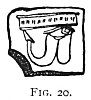 
Click to enlarge</a> 
FIG 20. 
</td>
</tr>
</tbody>
</table>

Appendix by C. W. King (author of *Gnostics*, etc.), p. 385. [Fig.
20](#img_13300) is from Pignorius (*Vetustissimæ Tabulæ*, Venice, 1605.md),
p. 16 *in dorso*, and is by him called a phallic engraved amulet.

[134:218](tee06.htm#fr_231.md) Wilkinson, vol.
iii. p. 353.

[134:219](tee06.htm#fr_232.md) In the Grotta de
Cacciatore, near Corneto, "is depicted a boat with a high, sharp stern
and a low bow, on which is painted an enormous eye--a fashion that has
descended from Etruscan times to the fishermen of modern Italy" (Dennis,
*Cities of Etruria*, vol. i. p. 312).

[134:220](tee06.htm#fr_233.md) *Ibid.* vol. i. p.
471.

[134:221](tee06.htm#fr_234.md) On a vase in the
British Museum representing Ulysses (tied to the mast) and the Sirens,
the vessel has a large eye upon the prow--suggesting that another was
upon the other side not seen. A plate of this is given in Smith's
*Classical Dict.* p. 784, ed. 1877

[136:222](tee06.htm#fr_235.md) Achik, *Antiq. du
Bosphore Cimmérien*, vol. iii. p. 210. See also Daremberg et Saglio, p.
257.

[137:223](tee06.htm#fr_236.md) Dennis, *Etruria*,
vol. i. p. cxxi and p. 462.

[137:224](tee06.htm#fr_237.md) *Ib*. vol. ii. p.
160. All the illustrations from Dennis are reproduced by the kind
permission of Mr. John Murray.

[138:225](tee06.htm#fr_238.md) The illustration
here given is from Millingen's original plate, and differs in many
respects from the copy of it attached to Jahn's article.

[138:226](tee06.htm#fr_239.md) In consequence of
the stress laid by Jahn upon the eye represented being the left, I have
carefully examined all the eyes upon amulets which have come under my
notice, and among a great number of examples I have found no marked
preponderance either way, but on the whole should say there are more
right eyes than left. The very common phrase "sinister expression," come
to us from classic days, may have suggested to Jahn the idea that the
left eye is especially malignant, but I can see no evidence in support
of it, and believe the phrase has no connection with the evil eye, but
that it springs from another and quite different set of beliefs.

[138:227](tee06.htm#fr_240.md) Nonius, see
*cossim*, p. 40, verb *incoxare*, p. 39. Jahn, p. 30.

[139:228](tee06.htm#fr_241.md) Striking examples
of this act have not long since come under the notice of the writer, in
one of which a man used this means of grossly insulting a woman--about
his equal in refinement--with whom he had had a quarrel.

[139:229](tee06.htm#fr_242.md) This gesture was
evidently of widespread use in ancient times. We are told that in the
ceremony of going down the Nile to the festive worship of Bast at
Bubastis the crowded boats, as they passed near a town, came close to
p. 140 the bank. "Some of the women continue
to sing and strike cymbals; others cry out as long as they can, and
utter reproaches against the people of the town, who begin to dance,
while the former pull up their clothes before them in a scoffing manner"
(Herodotus, ii. 60, quoted by Budge, *Nile*, p. 111).

The writer can testify to having witnessed a similar performance by a
woman on London Bridge at ten o'clock in the morning!

[140:230](tee06.htm#fr_243.md) The trident and
sword are separate amulets, as shown later.

[140:231](tee06.htm#fr_244.md) This is taken from
Jahn, p. 30, but according to Smith, *Dict. of Gr. and Rom. Antiq.*, the
*galerus* was a helmet or head-dress.

[141:232](tee06.htm#fr_245.md) On the other hand,
in the same volume (xix. of *Archæologia*, at p. 99), the Rev. Stephen
Weston contests this view, and tries to prove that the whole piece of
sculpture is a representation of the sacred rites of Mythra; but his
views in support of his Mythraic theory are speculative and fanciful in
face of the materialistic story of the marble itself. Upon this point
Jahn, p. 31, says: "Es kann kein Zweifel sein und ist von allen erkannt,
dass es bestimmt war Schutz gegen den Zauber des bösen Blicks zu
gewähren."

[141:233](tee06.htm#fr_246.md) Dennis, *Etruria*,
vol. i. p. 471.

[141:234](tee06.htm#fr_247.md) *Ib*. ii. p. 364.

[142:235](tee06.htm#fr_248.md) Dennis, *Etruria*,
vol. ii. pp. 77, 331.

[142:236](tee06.htm#fr_249.md) It is the rounded
bottom of a blue bowl. The fish here compounded with *l'œil mystique*,
and the no less mystical lotus, is undoubtedly the sacred Lepidotus,
fully described by Wilkinson (vol. iii. pp. 340 *et seq*.). It surely is
not unreasonable to consider that a form of decoration common to
Egyptians, Etruscans, and Greeks was not a mere coincidence, but had a
well-understood common significance. The original bowl is in the Berlin
Museum. The same illustration is in Wilkinson, vol. ii. p. 42.

[143:237](tee06.htm#fr_250.md) "Fascinatio est
actio, qua corpori noxa visu, verbis, contactu aut effluviis malis
occulto modo agentibus per vim seu naturalem seu supernaturalem inferri
putatur."--Frommannd, p. 7.

[143:238](tee06.htm#fr_251.md) These are thus
summed up by Vincentius Alsarius ("De Invidia et Fascinatione,"
*Thesaur. Antiq. Rom.* vol. vii. p. 890): "Quodam ridiculo spectatoribus
objecto: . . . fortunæ secundæ dissimulatione; . . . casu aliquo adversa
sponte suscepto et contractu," quoted by Frommannd.

[143:239](tee06.htm#fr_252.md) *Symposia*, v. 7.

[143:240](tee06.htm#fr_253.md) See remarks on
Gurgoyles, Appendix II.

[144:241](tee06.htm#fr_254.md) The alternative
meaning of *grillo* in modern Italian is said to be a classic survival:
"Antiphilus jocosis nomine *Gryllum* deridiculi habitus pinxit, unde id
genus picturæ *grylli* vocantur" (Pliny, *Sympos*. xxv. 3 7).

[144:242](tee06.htm#fr_255.md) King, *Handbook of
Engraved Gems*, p. 81. The four grylli here reproduced are from Mr.
King's books. I am indebted to Mr. David Nutt and Messrs. George Bell
and Sons for permission to copy them.

[145:243](tee06.htm#fr_256.md) It is certain that
as works of art a vast number of the objects used as amulets were of a
very debased kind indeed; but it should always be remembered that the
virtue of an amulet or talisman lay in the type it embodied, and in its
own material substance--the manner of execution of the potent sigil was
altogether unconsidered. This will become abundantly plain when we come
p. 146 to consider the very rough and crude
objects made in these latter days for constant use in Naples-where the
thing represented is of the rudest, coarsest work, while all the time it
is of the most imperative necessity that each article should be of
sterling silver, which must be attested by the hall-mark.

[147:244](tee06.htm#fr_257.md) Jorio, *Mimica
degli Antichi*, p. 235, says: "The common people (of Naples) are
absolutely ignorant of everything concerning the Medusa's head; but they
are fully persuaded that the eyes of the Basilisk (of which also they
know nothing) have the same power as that attributed to the fabulous
head."

[147:245](tee06.htm#fr_258.md) Another beautiful
Medusa is that upon the Onyx cup in the Naples Museum, called the Tasse
Farnese. A print of this is in Daremberg et Saglio, *Dict. des Antiq.*
p. 103.

[148:246](tee06.htm#fr_259.md) King, *Handbook of
Gems*, p. 85. [Figs. 39, 40](#img_14800.md), come from a number of these
masks in Mr. King's books, namely, the above and *The Gnostics*.

[148:247](tee06.htm#fr_260.md) "Everything that
was ridiculous and indecent was also supposed to be inimical to the
malignant influence of fascination by the oddness of the sight,"
Dodwell, *Class. Tour through Greece*, 1819, vol. ii. p. 34.

[149:248](tee06.htm#fr_261.md)

"Quid? quod libelli Stoici inter Sericos  
  Jacere pulvillos amant?  
Illiterati num minus nervi rigent,  
  Minusve languet fascinum?  
Quod ut superbo provoces ab inguine  
  Ore allaborandum est tibi."--Horace, *Epodon* viii. 15.

\[paragraph continues\] (This epode is
omitted in the expurgated editions.) See also Frommannd, *Tract. de
Fasc.* p. 5, who says: "Per fascinum virile membrum, quod fascia tegi
solet sive campestribus, hic intelligi Commentator et Cruquius dicunt.
Fascinum autem vocarunt partem illam, quoniam fascinandis rebus hæc
membri deformitas apponi fuit solita."

He goes on to connect the reason of the name with the licentious cult of
Liberus. He also writes much on the subject which is unfit to be
reproduced here, referring frequently to the worship of Priapus, and to
the sayings of Enothea, priest of Priapus.

[150:249](tee06.htm#fr_262.md) "Potest vel ab eo
quod pueris turpicula res in collo quædam suspenditur, ne quid obsit
bonæ scævæ causa: unde scævola appellata. Ea dicta ab scæva, id est
sinistra, quod quæ sinistra sunt bona auspicia existimantur: a quo
dicitur comitia aliudve quid; sic dicta avis, sinistra quæ nunc est. Id
a Græco est, quod hi sinistram vocant σκαίαν: quare quod dixit Obscœnum
Omen, est omen turpe, quod unde (id) dicitur, Osmen ex quo S
extritum."--Varro, *De Lingua Latina*, viii. 97. Ed. Sprengel, Berlin,
1885.

[150:250](tee06.htm#fr_263.md) "Inserto pollice
inter medium et indicem, ita ut pollex ipse insertus emineret, et
apparet, reliquis digitis in pugnum contractis."--De Pollice, p. 42,
Lipsiæ, 1677.

[151:251](tee06.htm#fr_264.md) Upon the importance
of the phallus, and its consecration to Osiris, with the reasons for the
place it took in the Egyptian system, see Wilkinson, vol. iii. p. 77,
and various notices in vols. i. ii. concerning the God Khem.

[153:252](tee06.htm#fr_265.md) Wilkinson, iii. p.
77.

[153:253](tee06.htm#fr_266.md) Smith's *Dict. of
the Bible*, s.v. "Fascinum."

[153:254](tee06.htm#fr_267.md) Wilkinson, *op.
cit.* i. p. 20.

[153:255](tee06.htm#fr_268.md) Bent, *Ruined
Cities of Mashonaland*. Perrot and Chipiez, *History of Art in
Sardinia*, p. 57. *Spectator*, November 26, 1892.

[154:255a](tee06.htm#fr_269.md) That houses so
marked were Lupanari.

[154:256](tee06.htm#fr_270.md) Dennis, *Cities of
Etruria*, vol. ii. p. 119. It was of course not confined to this purpose
at Pompeii.

[154:257](tee06.htm#fr_271.md) Dennis, as above.
He refers to Pliny, but cannot find the passage. Dennis believes in
their being thus placed to defy the enemy. I recommend the student to
read this chapter.

[156:258](tee06.htm#fr_272.md) From Dennis's
*Etruria*, vol. ii. p. 63.

------------------------------------------------------------------------

[Next: Chapter V. The Gorgoneion](tee07.md)
