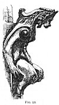

  
[Intangible Textual Heritage](../../index)  [Evil](../index) 
[Index](index)  [Previous](tee09)  [Next](tee11) 

------------------------------------------------------------------------

[Buy this Book at
Amazon.com](https://www.amazon.com/exec/obidos/ASIN/B0024NL744/internetsacredte)

------------------------------------------------------------------------

  
*The Evil Eye*, by Frederick Thomas Elworthy, \[1895\], at Intangible
Textual Heritage

------------------------------------------------------------------------

### APPENDIX II

THE evident defence of a Christian church by the horn and crocodile
amulets of Seville naturally leads to the consideration of those very
common though remarkable appendages to other Christian churches with
which most people are familiar. It would be an interesting study to
ascertain when the grotesque and hideous things, those nightmares in
stone which we call gurgoyles, were first adopted. Where was the germ
first planted? From what kind of eggs were these fanciful birds, beasts,
fishes, and reptiles, first. hatched? Without waiting, however, for an
answer to these questions, we may venture to assert that the idea from
which they sprang must have been the same as that we have been
considering. The evil glance of a wicked eye might as well be
personified as the great variety of other vices, such as avarice, lust,
and drunkenness, to say nothing of the virtues, graces, and higher
attributes, all of which have found their representations in personal
shapes. Precisely then as justice, mercy, truth, find their expression
in human female beauty, so would their opposites, the ideals of evil,
find theirs in the fanciful and distorted shapes commonly understood by
the term fiendish. The old conceptions of Gnostic days would

p. 230

supply, from their *grylli* and other strange devices, [374a](#fn_395) a link from the earlier days of
Babylonian and Græco-Egyptian times, when their gods were represented
with human bodies, but with heads of birds and beasts, more or less
representing the special qualities attributed to those deities. We have
seen, and have further to show, how strange objects have been erected
both in pagan and Christian times in many public situations, with the
object of protecting place and people from the wicked and malignant
influence of evil spirits, emanating from the eyes of those by whom they
were possessed. These evil spirits all became actual demons to those who
believed in them; and inasmuch as they were all active agents of
mischief and of evil, so it was but natural to suppose their attacks
would be especially directed against those buildings and persons, whose
purpose was to cultivate and to strengthen the opposite principles of
goodness and of virtue. Therefore amongst those who firmly believed in
these evil demons, and at the same time placed much reliance upon
antidotes or protective amulets against their power, we should expect to
find visible and lasting precautions taken, particularly in the case of
buildings so liable to devilish attack as churches. This is precisely
what we do find. The Middle Ages, when churches were rising in all
directions, when the highest art and the choicest gifts of the people
were lavished upon their religious buildings, were precisely the epoch
when the dread of the evil eye was the most real, when perhaps of all
other times the personality of spirits, good and bad, had become most
firmly imbedded in the belief of the people.

Therefore it was that the same idea which to-day leads to the mounting
of a piece of wolf or badger skin upon a horse's bridle to scare the
evil glance of the *versipelle*, induced our forefathers to carve in
stone, and so to perpetuate their fantastic conceptions of the wicked
spirits they wished to scare away from their sacred buildings. We all
know that our church bells have that as their original purpose,

p. 231

and, *a fortiori*, why should not the stone demons which adorn the
angles and conspicuous parts of our Gothic churches?

It is said, too, that the same idea of frightening away the evil spirits
residing in them, is that which has led to the custom of our
gamekeepers, to gibbet the "varmint" in some conspicuous place, so that
the devils inhabiting the bodies of cats, stoats, jays, and magpies may
be warned of what awaits them if they do not keep a respectful distance
from preserves of respectable birds and animals.

It has been well remarked quite recently to the writer: "We never see a
real gurgoyle now on a modern church; there are hideous things enough,
but they have no life in them." The reason for this is not far to seek.
The feeling and keen imagination which created the devils of our
mediæval churches came of a lively faith in their reality. Nowadays such
things are mere decorations, servile copies of the oddities invented by
our forefathers, but without either knowledge or belief as to their
meaning or intention. The consequence is, the inevitable lifeless
failure of the modern stone-cutter. The monks of old saw the goblins
they carved through the eye of undoubting belief.

Of course as time went on these grotesque demons and goblins, having
been adopted as regular items of church decoration, lent themselves to
the treatment of artistic and cultivated taste; but there can be little
question as to their original intention. No better example of what we
are maintaining can be found than that of the famous Florentine
*diavolo*, of which a rough sketch by the writer is annexed ([Fig.
92](#img_23200)).

In the first place, it was designed by one of the greatest sculptors of
the Italian Renaissance, John of Bologna, or as he is called
Giambologna, the same who created that most elegant of Mercuries
standing tiptoe on a breath of air. Originally there were two of these
little bronze figures attached to the angle of a Florentine palace near
the once picturesque Mercato Vecchio, but one was stolen many years ago,
and that here shown has, since the writer's last

p. 232

visit two or three years ago, been removed into a place of safety as a
precious work of art. In this case the figure is of bronze, and was
specially designed to be fixed to the wall of the house, just as horns

<table data-align="RIGHT">
<colgroup>
<col style="width: 100%" />
</colgroup>
<tbody>
<tr class="odd">
<td data-valign="CENTER"><a href="img/23200.jpg"> 
Click to enlarge</a> 
FIG. 92 
</td>
</tr>
</tbody>
</table>

are still fixed in Naples. Tradition says that from this spot Peter
Martyr preached, and that he exorcised the devil, who galloped past in
the shape of a black horse. [375](#fn_396)

It will be seen by this figure that horns were not considered specially
the badge of honour or of sanctity, as in the statue of Moses. On the
contrary, our own popular notion of the devil is more expressed in this
figure: horns and cloven feet with a barbed tail being our ideal. Here
he has the hairy thighs of a goat or satyr, and short horns; but the
feet are not cloven hoofs. We may however take this figure as a typical
one, fully representing the idea, in art and in fact, of just what we
see petrified upon the towers and angles of our churches.

There is a very extraordinary collection of grotesque figures on the
towers of Notre Dame in Paris. They are "like an actual body of fiendish
visitors caught and turned into stone as they grinned over the
city." [376](#fn_397) This idea of "turning
into stone" brings back to mind the old fancy lying in the story of
Perseus and the Gorgon.

------------------------------------------------------------------------

### Footnotes

[230:374a](tee10.htm#fr_395) For these see
*Abraxas seu Apistopistus* Johannis Macarii, Antwerpiæ, MDCLVII. Also
King, *Gnostics*, and *Handbook of Gems*.

[232:375](tee10.htm#fr_396) Horner, *Walks in
Florence*, 1873, vol. i. p. 156.

[232:376](tee10.htm#fr_397) Pennell, *The
Devils of Notre Dame*, 1894. Many of our readers will recall the
grotesque *bracciali* upon the palaces at Sienna.

------------------------------------------------------------------------

[Next: Chapter VII. Touch, Hands, Gestures](tee11)
