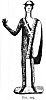

  
[Intangible Textual Heritage](../../index)  [Evil](../index) 
[Index](index)  [Previous](tee10)  [Next](tee12) 

------------------------------------------------------------------------

[Buy this Book at
Amazon.com](https://www.amazon.com/exec/obidos/ASIN/B0024NL744/internetsacredte)

------------------------------------------------------------------------

  
*The Evil Eye*, by Frederick Thomas Elworthy, \[1895\], at Intangible
Textual Heritage

------------------------------------------------------------------------

p. 233

## CHAPTER VII

### TOUCH, HANDS, GESTURES

ONE of the ways by which the influence included in the general term Evil
Eye is communicated, is by touch. Mere bodily contact, as in the case of
contagious diseases, has always been held to be of much importance as a
means of conveying injury, and both by practice and precept has always
been carefully guarded against. "Eat thou not the bread of him that hath
an evil eye" (Prov. xxiii. 6) means, avoid his presence lest you come
into contact with him; he may be blind, but his touch is malignant.
Great as may be the power of mere personal presence, such as the rubbing
shoulders with one possessed with the terrible faculty, the effect is
tenfold greater when there is the actual and intentional touching by the
baneful person. In the mesmeric performances with which we are all
familiar, the influence of the operator is vastly increased when he
makes passes with his hands, and still more so when he actually touches
his patient. Then it is that he seems to convey to his subject the
invisible influence of his own will, whether that will be in the
direction of good or of evil. These evidences of the effect of personal
contact, which our senses compel us to acknowledge, have been existent
in all time,

p. 234

and the consequence has been from the earliest days, that men have
regarded with intense interest the instrument by which touch is
commonly, and, when intentionally, always conveyed--the hand. Not only
is it the bodily member which specially differentiates man from all
lower animals, but it is that by which in every way he makes his power
known and felt. True that man's relatives the Apes have four hands to
our two, yet his are but prehensile instruments, incapable from the
partial development of the thumb, apart from the brain-power of
direction, of performing those thousands of intricate acts of
construction, of musical touch, of significant gesture, which the human
hand performs, and which mark it out as the faithful servant, as well as
the natural symbol, of a higher power, that of a perfected intelligence.

If in past ages the hand has been looked upon as an instrument of evil
when used by the malignant, much more has it been regarded as an
instrument of good--the powerful protector against that special form of
evil which was supposed to be flashed from one person to another,
whether through the eye or the touch of malice.

It has ever been recognised that the differences of shape, texture, and
general appearance of the hands of individuals are quite as great as in
faces. Moreover, it has been noticed by long experience that certain
kinds of hand are found to belong to the possessors of certain types of
faces; and just as the life and character of the individual are to be
seen in his face, so is his hand also the index of the mind. Further, it
is found that just as the features of a person's face distinguish his
individuality and

p. 235

remain permanent, to be recognised by all who know him, so do the
features--the shape, size, texture and markings on his hands--continue
permanent, subject only to such changes as affect the features of his
countenance. This fact is so well established by scientific research and
record, that its results are being now applied to the identification of
criminals, whose hands are carefully photographed or in other ways
portrayed, as well as their faces. It is even proposed to apply the same
method to the foot, which is also found to be different in every
individual from that of every other. just as no two faces are alike, so
are no two people's hands or feet.

The study of the hand as a quasi-science has of late become almost a
mania, and the books on palmistry, or chiromancy, in all languages have
become legion. Upon the hand, however, as an index of the life and
character, we have no wish to enlarge, but refer the curious reader to
such works as *Shall I tell you your Fortune, my pretty Maid*? by Mrs.
John White, which the writer bought at a railway bookstall for sixpence,
and which is marked "Twelfth Thousand"; to *Chiromanzia, Fisiologia
sulla Mano*, Giulio Adrieu, Milano, 1884; *Lira Una*; or to the costly
and elaborate compilations on the subject, which have appeared at recent
dates. Indeed, so much has the fad of palmistry run riot, that one of
the "up to date" enterprising soap-boilers has recently made use of it
in a really clever puff upon a great hand, as an advertisement in some
of the illustrated papers.

Our business, however, lies rather with the sister-science Chironomy
than with this. The

p. 236

latter is defined [377](#fn_398) as "the art or
science of gesticulation, or of moving the hands according to rule in
oratory, pantomime," etc. To this definition we venture to add, "the art
of representing such gesticulation," etc., and this will be found later
a needful qualification. As a science we are told [378](#fn_399) that chironomy is of great antiquity.
"Numa Pompilius, the successor of Romulus, publicly made use of the art
of chironomy, or of gesture with the hands, as a means of counting" (or
reckoning, *per conteggiare*). "Not only Pliny the historian, but also
Macrobius assures us, that Numa, in establishing a religion for the
fierce Romans, caused a statue of Janus to be made with two heads, or
with two faces, but with the fingers bent (*piegate*) in such a manner
as to represent, according to Pliny, [379](#fn_400) the number 350, and according to
Macrobius [380](#fn_401) the number 365."

In considering this evidence, we speak of making by the hand a certain
gesture, a certain sign, which may convey (*significasse*) to all the
Roman populace that which is meant by the words three hundred and fifty.
Here then we have the conventional sign. If Numa had used a manual
gesture, unknown to all, or if he had ordered the statue of Janus to be
made with the fingers folded in a way which had not been in accordance
with the previous habit or convention of the people, he would have been
considered the most foolish of mankind. And therefore we are compelled
to conclude the Romans to have then understood (*intendessero*) that
part of chironomy as belonging to the gesture of counting. [381](#fn_402)

p. 237

The Abate says that the Romans obtained their gestures from the Greeks;
that the Greek word

  [  
Click to enlarge](img/23700.jpg)  
FIG. 93.  

chironomia had been adopted (into Latin) to denote the art of gesture.
He asserts that the invention of gestures for manual numeration was from
the heroic

p. 238

ages of Greece, and so of surprising antiquity; but he gives no hint as
to the source whence the

  [  
Click to enlarge](img/23800.jpg)  
FIG. 94.  

\[paragraph continues\] Greeks obtained
it. He traces the use of this ancient method, and gives details of each
position of the fingers of the left hand, so as to indicate any

p. 239

number up to go (Figs. [93](#img_23700), [94](#img_23800)). For instance
he says:--

  [  
Click to enlarge](img/23900.jpg)  
FIG. 95.  

To indicate (*pronunziare*) the number 1, you have to bend the little
finger (of the left hand) closely upon the palm of the hand. For 2, the
ring finger is to be bent in the same manner. For 3, you do the same
with the. middle finger. For 4, you raise

p. 240

the little finger alone above the others. For 5, you raise the ring
finger. For 6, you raise the middle and bend down the ring finger upon
the palm. For 7, you raise the other fingers, and bend only the little
finger so that the nail rests upon its own root, not on the palm. For 8,
you are to make the same gesture with that called the medical finger,
the next to the little finger. For 9, you do the like with the middle
finger. For 10, place the nail of the index finger on the middle joint
of the thumb. For 20, place the thumb between the middle and index
fingers. For 30, unite gently the nail of the index finger and the
thumb. For 40, place the index alongside the thumb. For 50, bend the
index towards the palm like g, or Greek Γ. For 60, make the same bend
with the thumb and at the same time press the bent thumb with the index
surrounding it. For 70, bend the index as for 50, and fill the space
with the thumb so that the thumb nail may be beyond the joint of the
index. For 80, do the same with the index as for 70; then place the
thumb in such a way that the thumb-nail may touch the joint of the
index. For 90, make the nail of the index touch the root of the thumb.

No signs for the hundreds are made by the left hand. "One sees an
exemplification of this, when Juvenal, alluding to Nestor, said that he
counted the years with his right hand." [382](#fn_403)

To denote hundreds, make the same gestures with the right hand as have
been described for denoting the tens with the left. Hence to indicate
100, make with the right hand the same sign as is made with the left for
10 (Fig. [95](#img_23900)).

Consequently you denote 200 with the right hand in the same manner as 20
with the left; and so on with the other hundreds.

Thousands are denoted by the right hand with the same gestures as by the
left for the prime numbers 1 to 10. Hence 1000 is made with the right
hand in the same way as 1 by the left, and so on.

Our author describes the way to denote tens up to hundreds of thousands,
but enough has been extracted for our purpose, and to complete the
explanation we here reproduce the plates (Figs. [93](#img_23700),
[94](#img_23800), [95](#img_23900)) with which he illustrates his
subject, and which make it quite clear, so far as we have dealt with
it. [383](#fn_404)

p. 241

The second part of the treatise deals with the gestures used by ancient
actors and pantomimists; but inasmuch as he gives no pictorial
illustrations, we despair of interpreting with sufficient plainness to
be of interest to the reader.

The ancients having contrived so complete a system of manual numeration,
it needs little imagination to understand how the hand, the emblem and
instrument of power, naturally became in itself one of the earliest of
protective amulets, probably coeval with the phallic emblems, at which
we have but hinted in a previous chapter.

The earliest examples we have of the hand as an amulet against
fascination--and we must take it almost as an axiom that all amulets had
originally that object--are found, as we should expect them to be,
singly or used separately; not combined with another object. The very
rude representations of the hand shown in Figs. 96-101, from sketches by
the writer,

  [  
Click to enlarge](img/24100.jpg)  
FIG. 96.-101.  

are from early Etruscan tombs; all these are to be seen, with many more,
in the Museums of the

p. 242

\[paragraph continues\] Collegio Romano,
of Cortona, of Bologna, and probably elsewhere. They are described as
belonging "to the first age of iron," a period of extreme antiquity. The
eyelets for suspension show that these objects were intended to be worn.
They are mere pieces of bronze plate cut into the shapes, and about the
sizes here drawn-perhaps a little larger. It is not easy to measure an
article in a glass case. [Fig. 100](tee08.htm#img_21400) has two hands
remaining out of four which originally hung upon the same triangle.
Whether or not the triangle represented anything more than a convenient
shape for the suspender we cannot now decide--probably it did; but the
fact of finding four hands combined shows that already in those days,
500 to 1000 B. C., there was a tendency to pile up amulets by way of
adding to their power.

Among all these very early hand amulets, in only 

<table data-align="LEFT">
<colgroup>
<col style="width: 100%" />
</colgroup>
<tbody>
<tr class="odd">
<td data-valign="CENTER"><a href="img/24200.jpg"> 
Click to enlarge</a> 
FIG. 102 
</td>
</tr>
</tbody>
</table>

one is any particular gesture depicted. All the rest have the mere open
palm and extended fingers; but as skill improved, we find attempts more
or less successful to represent the hand in definite positions or
gestures. [Fig. 102](#img_24200) is decidedly of much later work than
the others, though exhibited at Bologna in the same case with the
others.

In the Ashmolean Museum are many examples of the open hand, in blue
pottery, showing piercings or handle attachments for suspension as
amulets. [384](#fn_405)

p. 243

\[paragraph continues\] Several of these
latter are Phœnician and may therefore be the same as Etruscan.

Besides the small ones intended to be worn on the person,
representations of the open hand are very widely scattered, and in such
a manner portrayed both in sculpture and painting that we cannot but
accept them as examples of that kind of amulet which was fixed in a
conspicuous place for public protection, such as the grillo of
Pisistratus, the horns on houses, and the gurgoyles on our churches.

Perhaps the most striking example of the use of the hand as a symbol of
power as well as of protection, is to be seen sculptured on the tombs,
excavated by that monotheistic Pharaoh, Khuenaten ("the beloved of the
Sun's disc"), at Tel-el-Amarna. There he and his court are adoring the
sun, whose rays are stretching out towards them; but in every case, and
there are several such scenes in the tombs, each ray terminates in an
open hand. The accompanying illustration ([Fig. 103](#img_24400)) is
from *Wilkinson*, vol. iii. p. 52, the only drawing available, but it is
unsatisfactory, and the writer regrets he made no sketch on the
spot. [385](#fn_406) The date of these tombs is
given as 1500 B.C., [386](#fn_407) and as their
history is well known, this is probably one of the most exact in
Egyptian chronology. The use of the hand as a sign of the divine
presence and power is thus fixed at least as early as the sojourn of
Israel in Egypt, and some time before the birth of Moses; it has
continued to be so used throughout the ages down to the present
day-alike by pagans, Mahomedans, and Christians.

Next probably in antiquity come the Etruscan

p. 244

and Greek hands, made evidently for use as household amulets. Of these,
two are to be seen in the Ashmolean. They are of bronze: one about six
inches

  [  
Click to enlarge](img/24400.jpg)  
FIG. 103.  

high, and fixed upright upon a flat plinth; another of the same kind,
but larger, is late Greek, found at Taranto, in the temple of Dionysos.
These are both exactly like [Fig. 104](#img_24500), which has lost its
stand, though retaining the pin by which it was fixed; the Oxford ones
are both right hands. In the Naples Museum two are alike, Nos. 5507,
550S, a right hand

p. 245

and a left, probably of much later date than the Etruscan, though of the
same type of open hand without special gesture. The writer 

<table data-align="RIGHT">
<colgroup>
<col style="width: 100%" />
</colgroup>
<tbody>
<tr class="odd">
<td data-valign="CENTER"><a href="img/24500.jpg"> 
Click to enlarge</a> 
FIG. 104. 
From Naples 
</td>
</tr>
</tbody>
</table>

believes that there are Greek examples of the like kind at the Museums
of Girgenti and Syracuse; at Cortona there certainly are more than one,
and also in the Museo Kircheriano at Rome; but whether these latter are
Roman or Etruscan he has omitted to note. [387](#fn_408)

[Fig. 105](#img_24501) is an Etruscan statuette from the Collegio Romano
at Rome. 

<table data-align="LEFT">
<colgroup>
<col style="width: 100%" />
</colgroup>
<tbody>
<tr class="odd">
<td data-valign="CENTER"><a href="img/24501.jpg"> 
Click to enlarge</a> 
FIG. 105 
</td>
</tr>
</tbody>
</table>

Here it looks rather more finished and in better proportion than the
original, which is very long drawn out. The figure, about eight inches
high, is one of two; unlike in other respects, both hold up the right
hand as shown, with palm and fingers extended. The attitude is so marked
in both figures that they can only be taken to be designed for the
exhibition of this manual gesture. They are placed with other ancient
bronzes found in Sardinia, and are evidently of great antiquity,
probably Phœnician. Ancient statues of this kind, of

p. 246

unknown age, as well as modern Indian ones, [388](#fn_409) show that the pose and gesture of the
hands are full of 

<table data-align="LEFT">
<colgroup>
<col style="width: 100%" />
</colgroup>
<tbody>
<tr class="odd">
<td data-valign="CENTER"><a href="img/24600.jpg"> 
Click to enlarge</a> 
FIG. 106 
</td>
</tr>
</tbody>
</table>

meaning, and that many ancient statues, now regarded simply as works of
art, were intended to exhibit actions that conveyed in their day very
distinct ideas. [389](#fn_410)

Belonging to later times, over the great gate of the Alhambra ([Fig.
106](#img_24600)) called "*La Torre de Justicia*," where the King or his
Kaid dispensed judgment in Oriental fashion, [390](#fn_411) is a large upright hand on the
keystone of the outer Moorish arch, in defiance of the strict objection
of the Moslem to images. It is sculptured in low relief, the palm
outwards, with the fingers and thumb in natural position. On this hand
Ford [391](#fn_412) remarks that some consider
it

an emblem of hospitality and generosity, the redeeming qualities of the
Oriental. Others think it a type of the five principal

p. 247

commandments of the creed of Islam: "To keep the fast of Ramadan,
pilgrimage to Mecca, almsgiving, ablution, and war against the infidel."
Others refer to the Hebrew *jadh*, the hand of God, the Oriental symbol
of power and providence. But the true meaning of it is a talisman over
the portal against the much-dreaded "Evil Eye," at which Orientals have
always and do still tremble. The Morisco women wore small *hands* of
gold and silver round their necks, like the Neapolitans, and a
substitute for the classical phallic symbol of defiance. In the *Sala de
los Embajadores* is an inscription to the same purport: "The best praise
be given to God! I will remove all the effects of an evil eye upon our
master Yusuf," etc.

Fully agreeing with Ford as to its real meaning, it may be noted as a
coincidence that the act of taking a judicial oath is performed by Jews
and other Orientals by holding up the right hand as thus depicted, also
that a hand in this position upon the shield is the modern heraldic sign
of baronetcy. [392](#fn_413)

In the mosaics at Ravenna, seven centuries older than the Alhambra
([Fig. 107](#img_24800)), our Lord and two angels are all in the act of
holding up the right hand in the attitude of benediction. One has the
hand open and extended, another angel in the same group, not here shown,
has the hand in the like position; at the same time more angels have the
hand conspicuously making the other gesture here drawn, which we shall
explain later.

In the Church of San Apollinare in Classe at Ravenna the saint is in the
main tribune standing beneath a great cross, with the Apostles on either

p. 248

side of him, represented by twelve sheep. He himself has both hands held
up open, with palms outward, evidently in the act of benediction. Above
the cross is an open hand coming out of a cloud,

  [  
Click to enlarge](img/24800.jpg)  
FIG. 107.--From San Apollinare Nuova, Ravenna. Mosaic of sixth cent.
From a Photograph.  

while on either side is a figure kneeling apparently on a cloud, but
each of these latter is plainly making a conspicuous gesture with the
hand--one with palm open and exposed, the other showing only the thumb
and two first fingers. Above the arch of the tribune is a large
medallion showing our Lord in the act of blessing the holy chalice; this
He

p. 249

holds in His left hand, while the right is raised, showing only the two
first fingers and the thumb. On either side of the medallion are the
typical symbol-figures representing the four Evangelists, each of whom
seems to be presenting a book to the central figure.

St. Mark, the companion figure to St. Luke ([Fig. 114](#img_26600)), is
shown with his right hand raised high, palm open and thumb extended. It
is not of course suggested here that all these persons are making
gestures against the evil eye, but they are singular pieces of evidence
as to the importance of the hand itself, and of the position in which it
is held both in acts of devotion and of benediction. [393](#fn_414)

Considering the open hand as a distinctly used amulet of both ancient
and modern times, we would call attention to its frequency at Tunis,
where it may be seen displayed in a variety of ways over doors, or drawn
upon walls in connection with the remarkable works of pictorial art by
which the Haji announces his right to wear the green turban. These
paintings upon the walls of the houses of returned pilgrims, although
meant to portray animals and trees, are of such an exceedingly crude and
rough sort that they can hardly be held to transgress the law that no
Moslem shall make any object in the likeness of anything in heaven above
or the earth beneath. In Tunis also may be seen many shallow drums, mere
hoops of about two inches broad, having parchment

p. 250

stretched on both sides, just as if an ordinary tambourine had two
diaphragms instead of one. Each of these drums has a hand upon it like
[Fig. 104](#img_24500) upon one side, and on the other a double
triangle. 

<table data-align="LEFT">
<colgroup>
<col style="width: 100%" />
</colgroup>
<tbody>
<tr class="odd">
<td data-valign="CENTER"><a href="img/25000.jpg"> 
Click to enlarge</a> 
FIG. 108. 
</td>
</tr>
</tbody>
</table>

Some of these have, besides the hand, a crescent and a double triangle,
as in [Fig. 108](#img_25000): in every case the crescent is placed above
the index and middle finger, while the double triangle, which we believe
to represent the sun, is always over the third and fourth finger. The
drawing is so rude that it is difficult to tell whether the hand is
right or left.

On inquiry about the meaning of these things, they say the hand is that
of the Prophet. Seeing, however, that these drums are all ornamented
round the rings with cowrie shells, fixed as they always are with the
opening in the shells outwards, one could but form a further opinion:
cowries have always been distinct amulets against the evil eye, [393a](#fn_415) and it is but reasonable to assign
the same purpose to the entire decorations. Tunisian Moslems are like
other people, and pile up their defences by a combination frequently
alluded to. The open hand is a very common amulet upon Neapolitan
cab-horses ([Fig. 83](tee08.htm#img_20800)); indeed it may be accepted
as a well-understood and completely-recognised protective amulet among
all nations, whether represented by painting, by sculpture, or by
gesture. We give two more convincing examples from far-distant quarters.
On one of the great marble columns in the church-mosque of St. Sophia at
Constantinople is a very remarkable

p. 251

freak of nature. There is a white mark in the dark purple marble exactly
like a spread-out hand; in fact it is so good a representation that one
naturally fancies at first that it is artificial; but on close
inspection it is found to be the natural marking of the marble. It is
about the size of the human hand, and is really a conspicuous object
when the visitor is conducted to the front of it, as he is sure to be,
by the guides. The hand is near the *Mihrab* on the south side, about
seven feet from the floor, and is held in the very highest reverence by
the people as the hand of the Prophet. It is believed to protect all who
go to pray near it from the evil eye. If this fine column had, as some
declare, a previous existence in an ancient temple, who shall say to how
many generations of men this strange piece of nature's art may have been
an object of veneration? [394](#fn_416)

In [Fig. 77](tee08.htm#img_20000), from far-off North America upon the
Mandan chief's robe, is the representation of the hand in the same
position, placed there intentionally to ward off the evil eye of his
enemy and to protect the wearer. How instinctively we throw up our open
hand with palm outwards as a gesture prompted by surprise at any strange
appearance, or to ward off any threat not amounting to actual violence!
It is also thus used involuntarily to stop the undesired approach of any
person or thing. In modern Neapolitan gesture-language "the raising of
the hands naturally with the palms opposed to the object" signifies a
negative to a question or

p. 252

demand. It also signifies surprise, as with ourselves, and
disapproval; [395](#fn_417) but to add effect
to the gesture when vehemence is intended, in addition to the expression
on his face, the actor violently spreads out his fingers, "le dita
saranno violentemente

  [  
Click to enlarge](img/25200.jpg)  
FIG. 109.  

allargate l'uno dall' altro," precisely as drawn upon the robe of
Mah-to-wo-pa ([p. 200](tee08.htm#page_200)).

Judging, however, from Canon Jorio's description of his plates, in four
of which (Nos. 5, 6, 17, 18) the attitude is shown, with descriptions in
the text, it would seem to be more like our own, an involuntary act of
astonishment than of well-understood and significant gesture. [396](#fn_418) As a sacerdotal act it is of course
recognised everywhere, though he does not

p. 253

allude to it in that aspect, nor does be indeed to any priestly action.

Precisely the attitude we are describing is to be

  [  
Click to enlarge](img/25300.jpg)  
FIG. 110.  

seen in a very characteristic painting by Perugino on the soffit of one
of the famous stanze in the Vatican,

p. 254

that of the "Incendio di Borgo." In it our Lord is represented as
ascending into heaven, but both hands are raised with open palms as
though to wave off St. John and the other saints pressing around. In the
four compartments of this vaulted ceiling our Lord holds one or both
hands in special attitudes: in three making the sign with two fingers
and thumb, the priestly benediction, and the fourth as above described,
with both hands open wide, with palms outwards.

Among the Romans the hand was a specially favourite ornament, and was
constantly placed upon household articles. In the Naples Museum are
seen, from Pompeii and elsewhere, handles of stoves, braziers, and of
many other utensils, flattened out into broad open hands where riveted
to the body of the article. Door-knockers from Pompeii, of a pattern
still commonly seen in Italy, have a hand grasping a ball, with the
hinge at the wrist. We cannot look upon these hands as simply
decorative, but suggest that they were used intentionally as well-known
protective amulets, powerful indeed when simply open, but doubly so when
bent into certain well-defined and recognised attitudes.

p. 255

in the Ashmolean Museum among the Egyptian amulets is a clenched hand
pierced for suspension; it is of rude modelling in blue porcelain, but
it is evident from its general contour that it is meant for the same
position as that shown in the Etruscan hand from Bologna ([Fig.
102](#img_24200)).

There is another of these in the Ashmolean which is also a small amulet
to be worn, from Umrît, said to be Phœnician. The position of these
hands is one which has evidently had a special meaning from very early
times, and is still common everywhere, even here in England: in Italy it
is so common that it has a technical name of its own, the *mano fica*.
This has ever been a gesture of defiance and of insult among all
nations. It denoted *persumma ignominia* to the Romans, [397](#fn_419) and among all the Latin races it was
connected with the fig, [398](#fn_420) and so
conveyed a *hässlich* idea. In French *faire la figue*, Italian *far la
fica*, Spanish *hacer el higo*, all denote this particular gesture of
the thumb between the first and second fingers. Our English idiom of
"Don't care a fig," which expresses the contemptuous idea, and implies
the gesture, has its counterpart in the German *Fragen den Teufel*. The
gesture is everywhere perfectly well understood, though the Teuton does
not connect it with the fruit. [399](#fn_421)
In classic times the hand in this position was well known as *manus
obscæna*. [400](#fn_422) Everybody is familiar

p. 256

with this gesture, which, if it has somewhat changed its meaning, has in
all these ages by no means lost its force. The two following quotations
seem to give it a northern habitat, but here in Somerset it is too
common even to be noted.

Dean Ramsay remembered how in Yorkshire he and his schoolfellows, from
1800 to 1810, "used to put our thumb between the first and second
finger, pointing it downwards as the infallible protection against the
evil influences of one particularly malevolent and powerful
witch." [401](#fn_423)

They placed in the hand of the Midsummer Witch a vessel of the same kind
with a long, narrow neck.

"It is filled with water," continued Judith, "drawn by herself from the
sea on this very evening. Now, child, double thumb and come along."

Everybody knows that to double your thumb in your right hand averts
danger. [402](#fn_424)

We have already fully described ([p. 150](tee06.htm#page_150)) the
amulet 

<table data-align="LEFT">
<colgroup>
<col style="width: 100%" />
</colgroup>
<tbody>
<tr class="odd">
<td data-valign="CENTER"><a href="img/25600.jpg"> 
Click to enlarge</a> 
FIG. 111 
</td>
</tr>
</tbody>
</table>

known as *turpicula res*, of which this *mano fica* formed one branch.
Jorio, [403](#fn_425) who always calls this
gesture *mano in fica*, says that there are many meanings conveyed by
this sign ([Fig. 111](#img_25600)).

The most used amongst us is as an amulet against the evil eye; and the
Neapolitans utter the expression, "*Te faccio na fica*," as if they
would say to a friend "May the evil eye do you no harm!"

This meaning is identical with that of making horns in the amulet sense;
in fact when making this gesture they often pronounce the same sentence
as they use in making horns against fascination.

p. 257

"*Mal-uocchie non ce pozzano*!" (\[may\] evil eyes not overwhelm you,
literally, "throw down a well"). The only difference is that the *mano
in fica* has a little more force than the horns in the idea of those who
have faith in it.

Among Italians this gesture has the same meaning as among us and other
people far and near--that of intense contempt or defiant insult. In this
sense it is referred to by Dante, [404](#fn_426) and twice by Frezzi. [405](#fn_427) Trissino [406](#fn_428) also uses it, almost copying Dante.

Jorio describes this as a most insulting gesture, equivalent to our "A
fig for you! Go to Bath!" except that the Neapolitan equivalent *fuori
grotta*, as a low, "outside-the-barrier" sort of place, carries
infinitely more scorn than "to Bath." [407](#fn_429)

Another meaning of the sign, beyond the limits of our present purpose,
is discussed under the heading: "*Invito turpe*."

In offering or presenting any object to another

p. 258

person in order to avert any evil which may accompany it from the giver,
when the article is of such a nature as to need support of the closed
hand (*pugno*), it ought, in such case, to be held in the position of
*mano in fica*. If the object be such, *per esempio*, as a plate held by
thumb above and finger under, then the other fingers are to be placed *a
mano cornuta*, of which we have now to speak.

This position of the hand is shown five times in [Fig. 112](#img_25900)
by the hand alone, also grasping a key and a flower, as amulets in
silver and other materials; also on the Indian goddess ([Fig.
115](#img_26700)) grasping rings.

The Neapolitans have but one *gesto* to imitate horns, but so great and
so many are the qualities and diversities of its signification, that
these (latter) apply not only to this gesture, but also to natural
horns, to their resemblances, and even to their simple name.

Thus Jorio [408](#fn_430) begins his
dissertation of over thirty pages upon *Corna, far le corna*, and after
referring to the multitude of writings on the subject, says he shall
consider it under the following heads:--

1\. What kind of horns do the Neapolitans use? 2. The ideas they
associate with horns, of whatsoever kind they may be, including the
gesture and the word *horns*. 3. Finally, if the ancients had in whole
or in part the same ideas and the same customs, or at least the same
gestures, as the moderns relating to the horn. The words *horn* or
*horns* are used indifferently, and apply alike to the horn alone or to
the two which adorn the heads of *animali corniferi*.

He says of natural horns, that those of bullocks, the most used, are to
be seen in gardens, on the top of palings, on the houses even of the
nobility; that in these latter, the horns of Sicilian oxen are most in
request. Those of rams and goats, of which wine-sellers

p. 259

and the lower classes make most use, are suspended in the inside of the
houses, or at the door, and sometimes in the window. Less common are
those of the stag, which may be seen dangling

  [  
Click to enlarge](img/25900.jpg)  
FIG. 112.--From the Author's Collection.  

at the doors of chemists' and grocers' shops, who, if they are able,
obtain the horns of the elk, known as the *Gran bestia*. Of buffaloes'
horns scarcely any are to be seen; when seen they are suspended in dark
or ignoble places. These distinctions, not *di rigore*,

p. 260

are often modified according to the ease with which any kind of horn can
be procured.

Artificial horns are made chiefly for the convenience of carriage on the
person. Hence they are fashioned in small sizes and with much elegance.
The most frequent material is coral, but plenty are to be had in gold,
silver, mother of pearl, amber, or lava. One of the vendors not long
since exposed for sale some exceedingly minute *mani cornute*, in gold,
silver, coral, etc., and the business done proved that the artist knew
the wants of his countrymen.

Whether through lack of horns, real or artificial, or whether it be that
among us (Neapolitans) the idea of the horn is so widespread and deeply
rooted that few will be without one, the fact is, that they have at
length got to consider as a real horn any object whatever that resembles
it. The following objects are therefore most particularly used. The claw
of crab or lobster, cocks' spurs, claws or teeth of animals, as those of
tigers and wild boars, horseshoes, half-moons, etc.

The word horn. When the Neapolitan has need of a horn for any purpose,
and has not either a real or artificial, nor anything resembling one, he
makes use of the name, uttering the word horn or horns once or oftener
according to the force he intends to give. [409](#fn_431)

As a gesture. The index and little finger extended, the middle and ring
finger clasped by the thumb, as shown in many illustrations.

The hand thus posed and raised vertically gives a very good imitation of
the head of a horned animal, and therefore we give to this gesture the
name of the horned hand (*mano cornuta*). just as this unique sign
imitating horns has very many different meanings, so we attach to it all
the diverse ideas which belong to the word *horn*.

p. 261

As a potent gesture protecting against the evil eye, the *mano cornuta*
is constant and persistent. A Neapolitan's right hand is almost
constantly in that position, pointing downwards, just as the hand charms
are made to hang downwards, and in this position they take the place of
an amulet worn habitually against unknown and unsuspected attacks. Of
all the ideas connected with the *mano cornuta*, that of fascination
holds by very far the largest place.

When, however, it is desired to use the sign specially against a
particular individual, the hand so posed is thrust out towards him, and
if there is no fear of his person, towards his very eyes, from which so
much is dreaded. That is, of course, if he be present, but if absent,
the sign is made in the direction of his supposed whereabouts.

Jorio [410](#fn_432) tells a story of a
sprightly Napoletana who was over-credulous of the effects of
fascination.

Observing that another lady whom she believed to be a *jettatrice* was
highly praising the beauty of her husband, and especially of his
well-formed thighs and legs, she wished to have recourse to the horn.
Not having at hand the grand preservative, nor being able to supply it
(openly) by a gesture, and what is more, not believing the repetition by
her lips of the word *corno*, *corno*, *corno*, to be sufficient, she
pretended to have need of a handkerchief. She therefore put her hand
into her husband's pocket, and there made the *mano cornuta*. Then, with
the points of her index and little fingers well extended, began to stab
the thigh bone of her husband with such force, as if she wanted to
pierce through it (*bucarlo*): indeed, if she did not pierce it, it was
only because she could not. Nor did she leave off her preventive
operation until the believed *jettatrice* turned her talk in another
direction. Neapolitan ladies wear little horned hands of various
materials suspended at the end of a necklace, which is ordinarily hidden
in the breast; but whenever a person appears who is suspected of being a
jettatore, the hand quickly goes to the necklace, and the amulet is
brought out, dangling in the direction considered necessary. As
etiquette does not permit this to be

p. 262

done openly in society, they pretend to be adjusting the kerchief, but
the fact remains, that they seek to make sure of, and to touch if
possible, *the gran preservativo del fascino*.

Over and above its use as a preventive gesture, the *mano cornuta* when
raised vertically towards the person's own forehead denotes what some
consider an ornament, the exalted horn; but on the other hand, when
pointed towards the chin, it implies conjugal infidelity to the husband.
This idea is not by any means confined to Italy. In Brand, under the
heading "Cornutes," is a long chapter upon this subject, and we gather
that at least in Brand's time the gesture made with the little and fore
fingers had the same meaning here in England that it has still in
Italy--where at the present day the gesture made, as last described, is
looked upon as an unpardonable insult which blood alone can wipe out.
Amongst ourselves the gesture seems to have quite died out and become
forgotten, the result, we hope, of improved morals; but during the
seventeenth century the perpetual allusion to cuckolds and horns is a
distinct blot upon the literature of the period. Shakespeare has many
allusions to the subject, though less in proportion than many of the
coarser dramatists. [411](#fn_433)

Addison complains [412](#fn_434) that
"cuckledom is the basis of most of our modern plays," showing that it
was still common talk. We know it was a frequent topic in the last
century, yet now the words seem quite to have dropped out of literature.
No quotation

p. 263

of the word could be found for the *New English Dictionary* later than
1728 without going to Ford's *Spain*, where the word is referred back to
the sixteenth century.

Both the gesture and its implication are still well known in all
European countries. "Faire les cornes à quelqu'un!" "Porter les cornes";
"Far le corna a uno"; "Portar le corna"; "Llevar los cuérnos"; "Einem
Hörner aufsetzen" ("to cuckold any one"); "Hörner tragen," are all
identically the same in meaning.

How the notion first arose and where, are points of great difficulty.
Brand discusses the question at great length, gives many recorded
opinions, but leaves it unsolved. He places its origin according to the
earliest data he produces at the time of the Crusades; but Jorio
declares the ancient Greeks to have used the horns, and also the
gesture, in the same signification as at present: further, he dwells on
the extreme antiquity of the use of the fingers as representing them. He
considers the cornucopia of Amalthea the she-goat, the symbol of
abundance, to have been an amulet. [412a](#fn_435) Also he places the Rhyton of Dionysus
in the same category, as well as the musical horn; and he winds up by
declaring that their signification "è particolarmente di amuleto contro
del fascino." He describes the various amulet horns, their shapes, their
being deprived of all ornament except at the point, their mode of
attachment or suspension, their representation in (ancient) pictures and
bronzes accompanied by the phallus, especially at Herculaneum, where
they appear also upon the household utensils (*arnese*). He also refers

p. 264

to the horns found among the fruits depicted on the walls of Pompeii,
and says that "our Neapolitan fruiterers," who display their goods so
openly outside their shops, "never fail to place among them a fine pair
of horns, for the purpose of keeping off other folk's envy, evil eyes,
fascination." [413](#fn_436)

He refers to the only two isolated horns of metal discovered, one of
bronze, the other of iron; both are solid, and so could never have been
cups, and consequently they could have been of no use except for
suspension. He also describes the heads of two oxen, from the mouths of
which proceeds the phallus. The latter are referred to and depicted by
Jahn, Taf. V. Another bronze from Herculaneum, no longer to be seen in
the Royal Museum, is an ox's head, intended for suspension, on which are
grouped three half-moons and three phalli.

Jorio describes at length, in much detail, a plaster (*intonaco*) from
Herculaneum in which one of the male figures is making the *mano
cornuta* with the left hand. He gives his full reasons why the figure is
not intending insult, or for any of the other purposes (than the
protective) to which the gesture is applied, and concludes the long
discussion by declaring that "at such an action, one of our Neapolitans
would not have hesitated a moment to exclaim: *Benedica! mal-uocchie non
ce pozanno!*" He says the Museum has abundant examples of this gesture
as an amulet *contro al fascino*, and concludes with: "In the vast field
of amulets, every one was known to the ancients, and the moderns have
not added thereto one single *Corno*." [414](#fn_437)

p. 265

Again, the sixth century mosaics [415](#fn_438)
of Ravenna give us further illustrations. In [Fig. 113](#img_26500) the
remarkable hand appearing from the clouds, representing the Almighty, is
very plainly in the position we have been considering, and looking at
the scene in which

  [  
Click to enlarge](img/26500.jpg)  
FIG. 113.--From San Vitale, Ravenna. Mosaic of the sixth century.  

it occurs we cannot but regard it as a feature of great importance. In
the same church and in others at Ravenna the hand is seen coming out of
the clouds,

p. 266

especially in the scenes of Abraham's sacrifice of Isaac ([Fig.
116](#img_26800)), and of Moses putting off his shoes before the burning
bush ([Fig. 117](#img_26900)); but in no other 

<table data-align="LEFT">
<colgroup>
<col style="width: 100%" />
</colgroup>
<tbody>
<tr class="odd">
<td data-valign="CENTER"><a href="img/26600.jpg"> 
Click to enlarge</a> 
FIG. 114 
</td>
</tr>
</tbody>
</table>

case known to the writer does the *Dextera Dei* appear so unmistakably
as *a mano cornuta* as in [Fig. 113](#img_26500).

A bull standing and fully represented, as the symbol of St. Luke ([Fig.
114](#img_26600)), is very rarely seen; the saint himself is shown very
conspicuously making the well-known gesture as if to guard both himself
and his bull from the assaults of evil eyes.

[Fig. 115](#img_26700) is from a small brass statue of an Indian
goddess, evidently of modern date, now in the County Museum at Taunton.
The unmistakable position of both hands is a proof of the very
widespread importance attached to the gesture of the *mano cornuta*, and
is a convincing proof of what has been before remarked--that the gesture
of the hands in ancient statues has a meaning, and is not, as in modern
sculpture, dependent on the whim or taste of the artist. It is to be
noted here also that this Indian statuette has one of the horned hands
pointed down in true *more Neopolitano*.

When we see the same thing in the early Christian art of the sixth
century at Ravenna, and in the present day pagan art of India, we are
compelled to admit that symbolism is independent of religious faith, and
that there is something in special positions of

p. 267

the hands, which both pagan and Christian alike recognise.

The several gestures in the Ravenna mosaics are both interesting and
remarkable; 

<table data-align="RIGHT">
<colgroup>
<col style="width: 100%" />
</colgroup>
<tbody>
<tr class="odd">
<td data-valign="CENTER"><a href="img/26700.jpg"> 
Click to enlarge</a> 
FIG. 115. 
</td>
</tr>
</tbody>
</table>

perhaps the more so from the fact that none of them (except the *mano
cornuta*) are referred to as sacerdotal gestures in any of the books on
modern gesture language in Italy, exhaustively dealt with by Canon
Jorio. Nor does he once refer to any of those manual positions which
must have been perfectly familiar to him as a priest. Three positions of
the right hand raised are recognised as pertaining to the act of
sacerdotal benediction. Of these, the two most usual are the open hand
for deacons and inferior clergy shown by one angel, and that of our Lord
and the second angel in [Fig. 107](#img_24800); the latter is that of
the Roman *mano pantea*. This position is that which is still the proper
one for bishops of the Western Churches, but in the early Church, and
down to the eighth century, a third position was used: instead of the
thumb the little finger was raised; and this is still the attitude of
benediction in the Orthodox Greek Church. In the early mosaics at
Ravenna, dating before the great schism, we find all three positions.
The Almighty hand from the clouds in both the scenes here produced
(Abraham and Moses, Figs. [116](#img_26800), [117](#img_26900)) has the
first,

p. 268

second, and fourth fingers extended, with the third or *annularius*
closed upon the palm. The same position is depicted on the angel next
but one on the right of our Lord enthroned, in the famous series at San
Apollinare Nuova. [416](#fn_439) Again, in

  [  
Click to enlarge](img/26800.jpg)  
Fig. 116.--From San Vitale, Ravenna.  

the scene of the three men entertained by Abraham ([Fig.
116](#img_26800)), supposed to represent the three Persons of the Holy
Trinity, they are severally making all three of the gestures described.
Two are raising the right hand in the act of blessing, of whom the
central figure makes the orthodox Greek

p. 269

sign, while the personage on his left makes the Western sign, and the
third shows the open hand. The position of the thumb 

<table data-align="RIGHT">
<colgroup>
<col style="width: 100%" />
</colgroup>
<tbody>
<tr class="odd">
<td data-valign="CENTER"><a href="img/26900.jpg"> 
Click to enlarge</a> 
FIG. 117. 
</td>
</tr>
</tbody>
</table>

and two first fingers raised seems to be the only one in which "Il
Redentore" is portrayed, when in the act of lifting the right hand in
benediction. The third figure in this scene, not being treated as
sacerdotal in character, has his right hand laid naturally upon the
table; the two others have the left.

It is certain that these gestures are intentionally depicted, and also
that they denote sacerdotal rank; for later, by many centuries, we find
the same thing in the Giotto frescoes at Assisi. There Saint Francis is
painted with his hands displayed so as to exhibit the stigmata, but,
inasmuch as he was never a priest, his hands are simply crossed upon his
breast; while a mitred bishop, in the next panel, has his right hand
lifted in the benedictory gesture, which by that time had become the
only one used in the Western Church. [417](#fn_440)

Among the simple amulets there are two other positions of the hand, as
shown in [Fig. 112](#img_25900). The forefinger alone extended is
referred to by Jorio very frequently as a gesture, but not described by
him as one used against the evil eye, yet the writer

p. 270

knows well that it is undoubtedly made and sold thus, as an amulet for
that purpose. Those shown were purchased at a shop in the native quarter
of Naples, and the writer believes he has seen the single forefinger,
pointed up, fixed upon a horse's back, but could not find one in the
shops which supply the saddlers. This gesture is, however, very clearly
marked in [Fig. 74](tee08.htm#img_19200), where the Indian goddess
Indranee is shown as the celestial mother with her child. The hand
having the points of thumb and forefinger touching, as shown in No. 3 on
[Fig. 118](#img_27100), though also extremely common, with a great
variety of uses in the gesture language, is not, as a mere: gesture, an
amulet according to Jorio. [418](#fn_441) Jorio
quotes the Abate Requeno's system of numeration, and points out that the
sign so made means thirty ([Fig. 94](#img_23800)), and that in
number-lore thirty signifies *le nozze* (marriage), while sixty
represents widowhood. We cannot follow these authors into all their
ramifications, which are outside the evil eye, but the hand in this
position is, we repeat, commonly made and sold as an amulet against it,
although the gesture itself is not one. I t will be noted from [Fig.
118](#img_27100), No. 3, and [Fig. 119](#img_27300), No. 5, that it is
made with both right and left hands, whereas the left only signifies
thirty, while the right in this position denotes three hundred. As a
horse amulet this position of the hand is rather a favourite; and we may
consider it to be adopted by those cabmen who, desire the custom of
ladies-it being well understood by all what the gesture indicates (*le
nozze*). As a gesture, however, it may be one of the most insulting,

p. 271

 

  [  
Click to enlarge](img/27100.jpg)  
FIG. 118.  
  
See Description, [p. 274](#page_274).

 

p. 272

though its chief significance, according to Jorio, [419](#fn_442) is *inimicizia* (enmity); but by
slightly altering the shape so as to form a circle it has a totally
different signification, *disprezzo* (contempt). In both these meanings
there is a distinct flavour of defiance, and perhaps on that account it
may have been adopted as an amulet in the concrete form. [420](#fn_443)

Examination of any varied collection of charms will show that the hand
is a common amulet in itself, also that it is used in combination with
other objects: sometimes merely grasping them, and sometimes, while
grasping the actual charm, making at the same time the important
protective gesture. [421](#fn_444)

The silver hand grasping the dart is a prominent one on [Fig.
112](#img_25900), and is one of the commonest to be seen. Another in
coral holding a short sword appears on the same plate just above the
serpents. In the Woburn Marble ([Fig. 24](tee06.htm#img_13700)) the
gladiator is grasping a short sword; and again in the Cimaruta (Chap.
X.) one of the branches ends in a hand grasping a sword. Moreover this
arm grasping a dart, spear, or sword in various positions is one of the
commonest of heraldic crests of the present day. One of the charms (on
Fig. [112](#img_25900)) is a key, and another the lotus; both are in
*mano cornuta*. Two others are the *mano in fica*, one combined with a
shell and the other with a flower-bud of some sort. The important one,
however, is that at the end of the spada or sword. This is a hand
grasping the lotus, and is no doubt considered a very potent charm.

p. 273

 

  [  
Click to enlarge](img/27300.jpg)  
FIG. 119.  
  
See Description, [p. 276](#page_276).

 

p. 274

\[paragraph continues\] The spada is of
silver, about six inches long, and is worn in the back hair by any girls
rich enough to procure one. The specimen here shown has been much worn,
and is a decidedly bright and effective ornament. Another coral arm is
grasping a fish; a hand grasping a fish, perhaps a dolphin, is also to
be seen on the Cimaruta. The fish is an undoubted amulet, as may be seen
on the gems, Figs. [16](tee06.htm#img_13000), [18](tee06.htm#img_13100).

None of these things are alluded to by Jorio, and we may accept it
therefore as an axiom that the only two gestures, apart from the
concrete, which of themselves constitute protective amulets, are the
*mano cornuta* and the *mano in fica*.

We have reproduced here, as not out of place, the three pages of
illustrations given by Jorio of the principal gestures in common use
among Neapolitans of to-day. Concerning these, he has given full
explanations and descriptions in the text. They are not, of course,
strictly connected with our subject, yet so much has been said
respecting manual gesture, and so many amulets exist in which the
position of the hand is an important factor, that we cannot think these
numbered attitudes, with a translation of their corresponding
interpretations, will prove uninteresting.

FIG. 118.

|                                                        |                                                                                                       |
|--------------------------------------------------------|-------------------------------------------------------------------------------------------------------|
| 1\. Adagio. Minaccia. Mediocramente.                   | 1\. Gently, soberly. Threat, menace. Indifferently, middling, so so.                                  |
| 2\. Mano cornuta. pei suoi diversi significati.        | 2\. Mano cornuta in its various significations.                                                       |
| 3\. Giustizia. Perfetto. Minaccia.                     | 3\. Justice. Perfection, all right. Threat.                                                           |
| 4\. Poco.                                              | 4\. Little (in quantity).                                                                             |
| 5\. Additare (*v*. l'Indice III). Indice solo disteso. | 5\. To point with the forefinger. (He gives no less than twenty different meanings for this gesture.) |
| 6\. Schioppetto pei diversi suoi significati.          | 6\. A gun, a musket, in its various significations.                                                   |
| 7\. Ladro.                                             | 7\. Thief.                                                                                            |
| 8\. Bere. Additare.                                    | 8\. Drink. To point.                                                                                  |

 

p. 275

 

  [  
Click to enlarge](img/27500.jpg)  
FIG. 120.  
  
See Description, [p. 276](#page_276).

 

p. 276

Of course, where two or more significations may be given by the same
position of the hand, the meaning is supplemented by facial and other
expression. Jorio gives 32 pages to the explanation of No. 2, [Fig.
118](#img_27100).

FIG. 119.

|                          |                                              |
|--------------------------|----------------------------------------------|
| 1\. Mano in fica.        | 1\. (Sufficiently explained.)                |
| 2\. Danaro.              | 2\. Money, coin.                             |
| 3 and 4. Stupido.        | 3 and 4. Stupid, blockhead.                  |
| 5\. Amore.               | 5\. Love, liking, attachment.                |
| 6\. Chiedere.            | 6\. To ask, to beg, to request.              |
| 7\. Condotta versipelle. | 7\. Cunning, malicious conduct or behaviour. |
| 8\. Schioppetto.         | 8\. Gun, musket.                             |
| 9 and 10. Disprezzo.     | 9 and 10. Contempt, disdain.                 |

 

FIG. 120.

|                  |                                                                               |
|------------------|-------------------------------------------------------------------------------|
| 1\. Silenzio.    | 1\. Silence, hold your tongue.                                                |
| 2\. Negativa.    | 2\. Denial, no.                                                               |
| 3\. Bellezza.    | 3\. Beauty.                                                                   |
| 4\. Fame.        | 4\. Hunger, I want food.                                                      |
| 5\. Besseggiare. | 5\. To make a long nose, to mock, etc.                                        |
| 6\. Fatica.      | 6\. Labour, fatigue.                                                          |
| 7\. Stupido.     | 7\. Stupid, blockhead, donkey, asses' ears. See [p. 416](tee16.htm#page_416). |
| 8\. Guercio.     | 8\. Squint-eyed.                                                              |
| 9\. Ingannare.   | 9\. To cheat, to deceive.                                                     |
| 10\. Astuto.     | 10\. Crafty, cunning.                                                         |

 

Only a study of the curious book itself can afford full information upon
all these gestures.

------------------------------------------------------------------------

### Footnotes

[236:377](tee11.htm#fr_398) *New English
Dictionary*, s.v. "Chironomy."

[236:378](tee11.htm#fr_399) *Scoperta della
Chironomia ossia dell' arte di gestire con le mani*, Dell' Abate
Vincenzo Requeno, Parma, 1797, p. 13.

[236:379](tee11.htm#fr_400) "Janus geminus a
Numa rege dicatus, qui pacis, bellique argumento colitur, digitis ita
figuratis, ut trecentorum quinquaginta dierum nota per significationem
anni, temporis, et ævi se Deum indicaret."--Pliny, xxxiv. 7.

[236:380](tee11.htm#fr_401) "Simulacrum ejus
plerumque fingitur manu dextera 300 et sinistra sexaginta quinque
numerum tenens, ad demonstrandam anni dimensionem."--Macrobius,
*Saturn*. i.

[236:381](tee11.htm#fr_402) Abate Requeno, *op.
cit.* p. 14.

[240:382](tee11.htm#fr_403) Abate Requeno, *op.
cit.* p. 40.

[240:383](tee11.htm#fr_404) Before venturing;
to reproduce this interesting system for which the Abate claims such
antiquity, great pains were taken to ascertain if it is known and
practised in our English systems of teaching the deaf and dumb. The
p. 241 constant reply of experts, as to
whether this or any similar system of manual numeration was taught, has
been: "I know of no ancient system"! Only by a negative process has it
been found that this system is not used by modern teachers. It is
therefore here recorded as bearing much on what has to be said upon
gestures of the hand, so intimately connected with the belief in the
evil eye.

[242:384](tee11.htm#fr_405) Jahn,
*Aberglauben*, etc., frequently uses this argument as a proof that the
objects he is speaking of were used as amulets, *e.g.* p. 47, of a
female figure with the hand on the mouth he says: "Die sich zum Theil
durch den Henkel als Amulete ausweisen."

[243:385](tee11.htm#fr_406) Another plate, with
the sun's rays terminating in a hand, is in *Wilkinson*, i. 40.

[243:386](tee11.htm#fr_407) E. Wallis Budge,
*The Nile*, p. 13.

[245:387](tee11.htm#fr_408) In the Ashmolean
Museum are three small Egyptian amulets evidently for suspension. They
are open hands of the usual blue pottery, but small, and almost
identical in type with many a coral hand to be seen to-day in the Naples
shops. No doubt the open hand has been worn as a protection throughout
the thirty centuries since these little charms were made.

[246:388](tee11.htm#fr_409) See [Fig.
115](#img_26700), [p. 267](#page_267), which, though modern, probably
represents by Oriental unchangeableness equal antiquity.

[246:389](tee11.htm#fr_410) This is fully
supported by the account given by the Abate Requeno of the statue set up
by Numa Pompilius, in which the pose of the hands was specially ordered.

[246:390](tee11.htm#fr_411) Deut. xvi. 18; Dan.
ii. 49; i Kings vii. 7.

[246:391](tee11.htm#fr_412) Murray's *Handbook
for Spain*, 1855, vol. i. p. 301.

[247:392](tee11.htm#fr_413) The arms of Ulster
are simply a large hand in this position, filling up the entire "field."
Perhaps the most apt and the best-known illustration of the holding up
of the hand as a powerful gesture is the account in Exodus xvii. 11:
"And it came to pass, when Moses held up his hand, that Israel
prevailed; and when he let down his hand, Amalek prevailed." Then
because he could not hold it up continually it was held up by Aaron and
Hur. The Scriptures are full of examples showing the great importance of
manual gestures.

[249:393](tee11.htm#fr_414) The frequent
reference in Scripture to the lifting up of the hands fully confirms the
importance of this attitude of prayer: "Lift up your hands in the
sanctuary" (Psalm cxxxiv. 2). The lifting up of my hands as the evening
sacrifice" (Psalm cxli. 2). "I stretch forth my hands unto thee" (Psalm
cxliii. 6). "He lifted up his hands, and blessed them" (St. Luke xxiv,
50). See also Psalm xxviii. 2, lxiii. 4, cxix. 48, and many other
passages.

[250:393a](tee11.htm#fr_415) See [Fig.
13](tee06.htm#img_12800). Jahn also explains what these shells typify.
Phallic students will readily understand them.

[251:394](tee11.htm#fr_416) This hand shows
precisely the same gesture as those over the arch at the Alhambra, and
upon the drums of Tunis. "The open hand was represented on the coins of
some of our Saxon kings in the tenth century; on one it is accompanied
by Alpha and Omega" (Twining, *Symbols and Emblems of Early Christian
Art*, p. 6).

[252:395](tee11.htm#fr_417) *Mimica degli
Antichi*, Andrea de Jorio, *Napoli*, 1832, p. 227.

[252:396](tee11.htm#fr_418) [Fig.
109](#img_25200), No. 17 of Jorio, is from a Greek vase published by
Millin--vas. ec. V. I tav. 66, by Inchirami, *Galleria Omerica*, ec.
tav. 76. He says that of this picture Minerva is the *protagonista*, the
central object towards whom the eyes of all the other figures are
directed. The scene appears to represent a council of armed heroes,
amongst whom Minerva brandishes her lance. A careful study of the
gestures leads to the conclusion that there is a difference of opinion
between those on her right and those on her left, for reasons which he
points out.

p. 253

Minerva turns her face to the right, while she raises her left arm with
the hand open; she seems to be in the act of stepping forward to the
left, and is pointing her left hand while brandishing her lance in the
same direction. The old man sitting on her right is holding his right
hand spread out and reversed, as if to signify "Go gently," or "Don't
excite yourself." The woman standing raises her left hand with palm
extended as if saying to the goddess, "Listen! Keep quiet!" These two
figures then being in tranquil attitudes seem to say, "Wait; go
carefully; the business is doubtful." The sitting warrior has his left
band open, palm upward, a little raised--a position when the hand is
flat denoting a question asked, while the raising it upward denotes much
disapproval of the words of his opponents. The standing figure behind
him has his right hand raised so as to show vivacity in his whole body,
and indicates his entire and active disapproval of the counsel of the
others. The whole picture represents Minerva proposing some great
operation, which those on her right discountenance, and advise prudent
waiting, while those on the left support and urge it with heat and
animosity.

The whole picture is one of manual gesture telling a plain story.

[Fig. 110](#img_25300), No. 18 of Jorio, is from a vase in the
collection of Sir John Coghill, and is fully described by Millingen.
Jorio says the principal figure p. 254 is
Bacchus, closely watching the conversation of the other persons, who are
at the same time making gestures as ancient as they are modern, relating
to a special quarrel between the two women. The one on the left, fixing
her eyes on her companion, and thrusting out her right forefinger to
accentuate her look, says with emphasis, 'Thou!' That this 'thou' is
intended as a reproach may be argued from her look; but more certainly
from the attitudes of herself as well as of her companion. Indeed she
also stares back at her, lifts up both her arms in angry surprise and
denial at the same time. Further, with the like significance, she throws
back the upper part of her body, so as to enable her to steady herself
on her feet. The other person, perceiving the anger of her opponent,
raises her left hand and with thumb and forefinger makes the sign of
love or friendship (see [5, Fig. 119](#img_27300)). Jorio points out how
cleverly the artist has told the story, and how plain all these things
are to a Neapolitan: how that jealousy is shown in the left-hand woman,
while the satyr goes on playing his pipes in apparent unconcern, while
Bacchus also is taking the liveliest interest, etc.

[255:397](tee11.htm#fr_419) John Prætorius, *De
Pollice*, Lipsiæ, 1677, p. 42. He refers to the Italian phrase "far le
fiche."

[255:398](tee11.htm#fr_420) "The fig and the
phallus were carried in processions in honour of Bacchus. Hence in Italy
arose the term *far la fica*."--Payne Knight, *Symb. Lang.* p. 30.

[255:399](tee11.htm#fr_421) "To fig" (a person)
is, "Einen durch Trotz oder Verachtung andeutende Verwegungen mit den
Fingern beleidigen" (Hilpert).

[255:400](tee11.htm#fr_422) This is described
by Ovid (Fast, v. 433): "Signaque dat digitis medio cum pollice
junctis."

"Favebant ii, qui manum in obscænum modum formabant."--De Pollice, 43.

[256:401](tee11.htm#fr_423) Atkinson, *Forty
Years in a Moorland Parish*, quoted in *Athenæum*, May 23, 1891, p. 662.

[256:402](tee11.htm#fr_424) Walter Besant,
*Dorothy Forster*, 1885, p. 7. Scene laid in Northumberland.

[256:403](tee11.htm#fr_425) *Mimica degli
Antichi*, p. 155.

[257:404](tee11.htm#fr_426)

 

"Al fine delle sue parole il ladro  
Le mani alzò con ambeduo le fiche,  
Gridando: Togli, Dio, chè a te le squadro."  
                           *Inferno*, Canto xxv. 1-4.

 

[257:405](tee11.htm#fr_427)

 

"E fe le fiche a Dio 'l superbo vermo."  
                                     *Il Quadrir*, ii. 19.

"E fe le fiche a Dio il mostro rio,  
Stringendo i denti ed alzando le braccia."  
                                             *Ib*. iii. 10.

 

[257:406](tee11.htm#fr_428)

 

"Poi facea con le man le fiche al cielo  
Dicendo: Togli, Iddio; che puoi più farmi?  
                     *L'Italia Liberata*, Canto xii.

The latter authors are quoted by Cary.

[257:407](tee11.htm#fr_429)

"Se poi viene un susurrone  
E lodando vi scompone,  
Presto il pollice volgete  
Sotto l'indice, 'l tenete  
A lui ritto ritto in faccia  
Sin che parti, ovver si taccia."  
           *Marugi, Capricci sulla Jettatura*, p. 134.

The author says in a note: "This is the most efficacious of all the
expedients up to this time practised. Make trial of it, and you will be
grateful to me."

[258:408](tee11.htm#fr_430) *Mimica degli
Antichi*, Napoli, 1837, p. 89.

[260:409](tee11.htm#fr_431) *Mimica degli
Antichi*, Napoli, 1837, p. 92.

[261:410](tee11.htm#fr_432) *Mimica*, p. 100.

[262:411](tee11.htm#fr_433) "It shall hang like
a meteor o'er the cuckold's horns" (*Merry Wives of Windsor*, Act ii.
Sc. 2). "An old cuckold with horns on his head" (*Much Ado about
Nothing*, Act ii. Sc. 1). Marston in his *Malcontent*, Act iv. Scene 5,
calls Agamemnon, Prince Arthur, and Hercules, *cornutes*. So also Ben
Jonson in *Every Man in his Humour*, Act iii. Scenes 3 and 6, also in
Act v. Scene 5, alludes to both horns and cuckolds.

[262:412](tee11.htm#fr_434) *Spectator*, No.
446.

[263:412a](tee11.htm#fr_435) See *Mano Pantea*,
post, p. 318.

[264:413](tee11.htm#fr_436) *Mimica degli
Antichi*, p. 109.

[264:414](tee11.htm#fr_437) *Mimica*, p. 120.
It has already been remarked that every species of p. 265 charm of whatever kind soever against the
evil eye is called in the vernacular *un corno*; hence the above. Later
on we shall see that he is mistaken, or at least some have been invented
since his day.

[265:415](tee11.htm#fr_438) The illustrations
from the Ravenna mosaics are all from photographs in the writer's
possession, obtained on the spot.

[268:416](tee11.htm#fr_439) This angel is not
shown in [Fig. 107](#img_24800), but in the great mosaic it appears next
the angel with the open hand.

[269:417](tee11.htm#fr_440) The importance
attached to manual gesture in the rites of the Roman Church is proved by
the minute directions as to the position in which the celebrant is
ordered to make the sign of the cross at Mass. He is to turn the little
finger of the right hand towards the object which he is to bless,
keeping the right hand straight with the fingers extended and joined
together with the thumb (from *Pontificale Romanum*, Venetiis, 1836).

[270:418](tee11.htm#fr_441) The hand in this
position is, however, made and sold as an amulet. One of these is on
[Fig. 83](tee08.htm#img_20800) as a horse amulet, and a small one in
coral is on [Fig. 112](#img_25900), among the charms for personal wear.

[272:419](tee11.htm#fr_442) *Mimica*, pp. 46,
126.

[272:420](tee11.htm#fr_443) This gesture is
called the Phallic hand (Forlong, *Rivers of Life*, p. 461).

[272:421](tee11.htm#fr_444) This is seen again
in the Indian goddess, [Fig. 115](#img_26700), who is grasping two large
rings while making the *mano cornuta* with both hands.

------------------------------------------------------------------------

[Next: Chapter VIII. The Cross](tee12)
