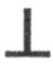
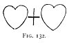
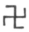
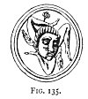

  
[Intangible Textual Heritage](../../index)  [Evil](../index) 
[Index](index)  [Previous](tee11)  [Next](tee13) 

------------------------------------------------------------------------

[Buy this Book at
Amazon.com](https://www.amazon.com/exec/obidos/ASIN/B0024NL744/internetsacredte)

------------------------------------------------------------------------

  
*The Evil Eye*, by Frederick Thomas Elworthy, \[1895\], at Intangible
Textual Heritage

------------------------------------------------------------------------

p. 277

## CHAPTER VIII

### THE CROSS

AMONG modern amulets, used specially and avowedly against the evil eye,
the cross finds no place; for the simple reason that it has taken its
position as the great Christian symbol, whereby its connection with
times preceding Christianity has been severed, and its meaning modified
to its later purpose.

Of all simple signs it is the easiest to make and the most common,
whether ancient or modern. In these latter days it is often but a mere
mark, like the chalk cross made by an artisan upon his work, or the
sign-manual of our parish marriage register, yet in many of its forms
and uses it has a very distinct and special meaning.

Among the ancient Egyptians the cross was very common. Standing on a
heart (as in [Fig. 121](#img_27800)) it was the symbol of goodness [422](#fn_445); the same form in hieroglyphic writing
is the ideograph *nefer* or the phonetic *n*. [423](#fn_446) It is shown thus on a tablet depicted
by Maspero [424](#fn_447) together with a
Calvary cross. These tablets (*dalles*), found in considerable numbers,
were slabs of stone, whereon were sculptured models, to teach the
apprentices their trade

p. 278

and they show examples of stone carving in all stages from the mere
outline to the finished work.

At the Ashmolean Museum are undoubted amulets from ancient Egypt, such
as [Figs. 121, 122](#img_27800). Quite as ancient as any of these is a
small ornamental cross

  [  
Click to enlarge](img/27800.jpg)  
FIG. 121-3.  

amulet of gold, found by Schliemann in the third sepulchre at Mycenæ,
now in the Athens Museum ([Fig. 123](#img_27800)) [425](#fn_448) rather suggesting serpents in
combination. Several other cross ornaments were found in the same tomb,
but they are not of this distinct character. We are told that the
Spanish conquerors of Mexico were astonished at finding the cross in
common use by men whom they knew to be heathens, and that they managed
to ingratiate themselves with the natives by displaying the cross upon
their standards. Many crosses appear also on the ancient Peruvian
hieroglyphs ([Fig. 126](#img_28200)).

What the true symbolical meaning of the cross may be, is a vexed
question. On the one hand, many hold it to be distinctly phallic; in
India it is always so considered, while others say the "theory is
monstrous and devoid of evidence." [426](#fn_449) All authorities, however, agree that
the **T** or tau

p. 279

cross is the symbol of life [427](#fn_450) in
both its forms, *i.e.* either the simple **T** or with the loop handle
attached. The latter is the *crux ansata* or *ankh*, seen in the hand of
most of the Egyptian gods of the later period. In one or other of these
forms it is traditionally held to have been the mark set upon Cain; also
upon the houses of the Israelites in Egypt, to preserve them from the
destroying angel.

The rod Moses stretched over the Red Sea and with which he struck the
rock is supposed to have been topped with a cross; on the Tau the brazen
serpent was upraised. Mediæval writers thought the two sticks gathered
by the widow of Sarepta a type of the cross; but in Ezekiel ix. 4 the
mark to be set on "the foreheads of the men that cry," etc., was
certainly the **T**; for the Vulgate has: "Et signa Thau super frontes
virorum gementium." Many authorities accept this rendering: St. Jerome
"refers again and again to this passage"; SS. Cyprian, Augustine,
Origen, and Isidore allude to it; also Bishops Lowth and Münter; "but
there need be little doubt as to the passage." [428](#fn_451)

In the roll of the Roman soldiery after a battle it was customary to
place **T** against those who were alive, and Θ against the killed.

In the Roman Catacombs is found the **T** or St. Anthony's cross; in
those very early days of the Church it symbolised the belief in the
eternity of that life upon which the departed soul had entered. This was
probably the transition period, when the cross had not yet been fully
recognised as the special symbol of the Christian faith.

p. 280

The ancient Britons worshipped the **T** or Tau as a god, and among
Northmen of old the same figure was "the hammer of Thor," the
Scandinavian Jove; reversed thus 
, it is the *yoni-lingam* symbol of the Hindoos. [429](#fn_452)

The *crux ansata* form is exceedingly

  [  
Click to enlarge](img/28001.jpg)  
FIG. 124.-125.  

 

p. 281

wide-spread. [430](#fn_453) Not only is it
found in the sculptures from Khorsabad, from Nineveh, and in the Palmyra
sculptures now in the Louvre, but further east in Persia and India. More
remarkable still is it to find the same sign in far-distant Peru, where
it appears as an actual shape cut through great blocks of granite
([Figs. 124, 125](#img_28000)), both ancient and modern at Cuzco, and
also in the remarkable hieroglyphics of the Incas reproduced in [Fig.
126](#img_28200). [431](#fn_454) The ancient
Cuzco block at the time of the Conquest was used for the execution of
criminals. The head was inserted face down in the round aperture, and a
piece of wood jammed into the slot so as to hold the neck tight; the
body was then seized, violently lifted, and the neck dislocated. [432](#fn_455) There are no means of ascertaining
what the Incas intended by this *crux ansata*, but the fact remains that
it existed, and is found repeatedly in ancient Peru. The cross was known
in South America in several other forms besides the *ankh*, as appears
from the hieroglyphics of Peru.

p. 282

 

  [  
Click to enlarge](img/28200.jpg)  
FIG. 126.--From Wiener, Pérou et Bolivie, p. 775.  

 

p. 283

A device almost exactly similar [433](#fn_456)
is found on coins of Asia Minor, Cilicia, and Cyprus. It is placed on a
Phœnician coin of Tarsus beneath the throne of Baal. Another is on a
Sicilian medal of Camarina.

It is, however, in Egypt that this symbol, sometimes called the Cross of
Serapis, [434](#fn_457) is most commonly to be
seen in the hands of kings and gods alike. One scene [435](#fn_458) represents Amenophis II. having a
double stream of these figures, alternated with the symbol of purity,
poured out upon him by the gods Horus and Thoth. This same act is also a
subject of sculpture at several places, and by the outpouring of life
and purity denotes the king's purification, to fit him to stand before
the god of the temple. In each case the king so purified also held the
*ankh* in his right hand. [436](#fn_459)

Besides these, the same cross is in a way personified with arms and
hands holding the symbol of purity. Especially were these noted by the
writer at Medinet Habou and at Edfou ([Figs. 127, 128](#img_28400)). At
both these temples the figures are repeated in rows, side by side, so as
to form a decorative dado.

The meaning of the *crux ansata* wherever found is testified "in the
most obvious manner," [437](#fn_460) denoting
fecundity and abundance in the way universally understood by this symbol
throughout India. [438](#fn_461) And

p. 284

we may remark that the use of this cross as the symbol of fertilisation
is perfectly consistent with the sign being that of the kind of life
therein typified. [439](#fn_462)

All these examples are of ancient usage, but there

  [  
Click to enlarge](img/28400.jpg)  
FIG. 127., 128.  

will be little difficulty in showing that it has been used throughout
the Middle Ages, and that it is found today in a form but slightly
modified. At the present day in Cyprus the women wear this cross as a
talisman. [440](#fn_463) It is believed to keep
off the evil eye and to prevent or cure barrenness.

[Fig. 129](#img_28500) is a coin of Ethelward: [441](#fn_464) besides a smaller one in the
inscription, there is a cross on the centre of each side; one of these
is the *crux ansata* in a form which is still more "obvious" than that
usually seen in the hands of Egyptian gods or kings, or even upon the
Indian Iswara.

p. 285

\[paragraph continues\] The object of a
cross on each side of this coin was the customary one, of placing
protective amulets against the evil eye upon coins, medals, and seals,
as well as upon buildings, public and private. One of these amulet
seals, having the sun and moon upon it, was in actual use by the Dean
and Chapter of St. Andrew of Wells ([Fig. 137](#img_29200)),

  [  
Click to enlarge](img/28500.jpg)  
FIG. 129.  

down to a comparatively late period--long since the Reformation. A
careful consideration of the coin of Ethelward will help us to
understand its later developments, especially if we look upon both *crux
in corde* ([Fig. 121](#img_27800)) and *ansata*, undoubted amulets for
suspension, as practically the same things; for we cannot fail to see
that all the devices are but modified forms of one and the same symbol.
On a cylinder from Babylon [442](#fn_465) there
is a figure holding a *crux ansata*, reversed from its usual Egyptian
position, and having the cross upwards and the ring beneath.

Our next stage is shown in [Fig. 130](#img_28600) where the Third Person
of the Holy Trinity, the "Lord and Giver of Life," holds this same
symbol, but slightly changed, in His hand. Again, in [Fig.
131](#img_28600) the Father Almighty holds the same symbol under His
left hand. The only difference is that in both of

p. 286

these examples the cross is upon the globe as well as above it. [443](#fn_466)

On a bas-relief from the Roman Catacombs is a representation of the
Lamb, but instead of the usual flag He holds a staff, with a ball and
cross on the

  [  
Click to enlarge](img/28600.jpg)  
FIG. 130., 131.  

top, precisely like the conventional orb and cross in the hand of kings
and queens. [444](#fn_467) The historic
gradation of the use, from remote ages to the present day, of this
symbol of life in perpetuity as the badge of sovereignty, makes it
clear, however unwilling

p. 287

devout worshippers of royalty may be to assent, that the object we know
so well as the orb and cross, is nothing else but a powerful amulet
against the evil eye.

Those who remain sceptical as to our chain of facts will perhaps be
convinced by the following. In days when brewing used to be done at
home, the writer, as a boy, has often watched and helped the operations.
When the malt was steeped in the "mashing vat" our old man used to cover
it up with cloths "to let it steevy"; but before doing this he never
failed "to zet the kieve." 

<table data-align="RIGHT">
<colgroup>
<col style="width: 100%" />
</colgroup>
<tbody>
<tr class="odd">
<td data-valign="CENTER"><a href="img/28700.jpg"> 
Click to enlarge</a> 
FIG. 132 
</td>
</tr>
</tbody>
</table>

This was to make upon the surface of the mash "two hearts and a
criss-cross," as in [Fig. 132](#img_28700). Inquiry always brought the
same answer: "Nif didn zet the kieve, they there pixies wi'd safe to
spwoil the drink." The figure of a heart is made with the utmost ease by
placing the two forefingers together at the indentation, and then moving
each simultaneously so as to meet at the bottom, and make the two sides.
Precisely the same sign used constantly to be made on the fine soil of a
bed after sowing any special seeds, such as cabbage, onions, etc., so
that it may not be overlooked. [445](#fn_468)
Here then we have a distinctly modern

p. 288

amulet of the same identical elements as that on the coin of Ethelward;
for by merely bringing the two hearts together, and slightly rounding
them, with the cross placed on the top, we have the "obvious" figure
itself.

Whatever may have been the notion of the designers of St. Peter's in
Rome and St. Paul's in London, the fact remains that each of these great
Christian churches bears on its highest point the orb and cross of
royalty, no other than the *crux ansata* (a symbol of the perpetuation
of life in one aspect, and a potent amulet in another), raised high
above the people, like the famous cricket of Pisistratus at Athens, the
crocodile at Venice, the devils on Notre Dame, and the *diavolo* at
Florence, protecting them from the wicked glance of the evil spirits
expected to lurk around when the bells are silent. Of course all this
will be set down as pure speculation; but of such cavillers we would
ask, first for a better explanation of the ball and cross, and next for
any explanation whatever of the maintenance of bells other than that
they represent an ancient custom, founded, like the orb and cross, on an
ancient belief. [446](#fn_469)

That the cross was actually worn as an amulet in ancient times is
clearly proved by the fact that two

p. 289

men called Kharu (Syrians) appear on Egyptian sculptures actually
wearing it suspended to the neck. [447](#fn_470)

At the British Museum may be seen a large cross amulet suspended from
the neck of Tiglath Pileser in the great tablet from Nimroud. At this
day necklaces made of a string of crosses are worn by the Indians of
Peru, [448](#fn_471) but these latter may be
from Christian sources, though that is by no means even probable.

There are other kinds of cross among the variety used in heraldry or
ornament, which certainly have a mystery about them, and some of which
are amulets. [448a](#fn_472) Foremost among
these is the *svastika* of the Hindoos, the fylfot-cross or *gammadion*,
called also by some the "catch L," 

Among the Hindoos this was the mark or sign of Vishnu, [449](#fn_473) the beneficent preserver of life. It
is proved now to be a sun symbol, by Mr. Percy Gardner, who has found a
coin of the ancient city of Mesembria in Thrace, on which is the fylfot
with a sun on its centre. The name of the place means the city of
"Mid-day," and this name is also figured on some of its coins by the
legend ΜΕΣ.  , [450](#fn_474) which clearly and decisively proves
its meaning. This form of cross was early adopted among Christian
symbols, for it is found in the Roman Catacombs of

p. 290

the fourth century. [451](#fn_475) As a mystic
sign it is said to have travelled further than any other symbol of
antiquity. [452](#fn_476) It was known in
Iceland in the ninth

  [  
Click to enlarge](img/29000.jpg)  
FIG. 133.  

century; it is known all over Asia, including Japan;

p. 291

all over Europe from Iceland to Greece, Sicily, and Malta. It is found
on the oldest Greek coins, on Etruscan vases, and on the Newton Stone,
an ancient Celtic monument at Aberdeen. [453](#fn_477) Comte Goblet traces it to the Troad as
its birthplace, some thirteen hundred years before Christ. Schliemann
found at Mycenæ a terra-cotta dish, on one side of which "are engraved a
number of  s, the sign which
occurs so frequently in the ruins of Troy." [454](#fn_478) He says the same sign was often found
on vases and pottery. [455](#fn_479)

From its appearance on coins and from its being a sun sign we may accept
the conclusion that the

  [  
Click to enlarge](img/29100.jpg)  
FIG. 134.  

fylfot was an amulet against the evil eye "of wonderful diffusion." We
are told that the *triskelion* or *triquetra* is a modification of the
fylfot, and that it was adopted as the badge of Sicily by Agathocles
about 317 B.C. and later by the Isle

p. 292

of Man. [456](#fn_480) We are told [457](#fn_481) that the arms of Sicily and the Isle
of Man consist of three human legs of identical pattern, except that the
latter are 

<table data-align="LEFT">
<colgroup>
<col style="width: 100%" />
</colgroup>
<tbody>
<tr class="odd">
<td data-valign="CENTER"><a href="img/29200.jpg"> 
Click to enlarge</a> 
FIG. 135. 
</td>
</tr>
</tbody>
</table>

spurred. With all deference to high authority we would point to the
illustration [Fig. 133](#img_29000), which is from a photograph of an
ancient relief at Palermo, with the Gorgon's head in the centre, whereas
the Manx arms are plain and have no head. The same device with the head
was found on a Greek altar in Malta ([Fig. 134](#img_29100)) [458](#fn_482) and on a gem ([Fig.
135](#img_29200)). [459](#fn_483) The Manx arms
are borne by several old English families, and are said to have been
brought to England by Crusaders returning *viâ* Sicily. All this does
but support and confirm what we have remarked as to the real meaning and
basis of modern heraldry.

------------------------------------------------------------------------

### Footnotes

[277:422](tee12.htm#fr_445) Wilkinson, vol.
iii. p. 352.

[277:423](tee12.htm#fr_446) Budge, *Nile*, pp.
55, 65.

[277:424](tee12.htm#fr_447) *Arch. Egypt.* pp.
190, 191.

[278:425](tee12.htm#fr_448) He (Schliemann,
*Mycenæ and Tiryns*, p. 66) says: "The cross with the marks of four
nails may often be seen" upon vases and other pottery.

[278:426](tee12.htm#fr_449) Baring-Gould,
*Myths of the Middle Ages*, p. 358.

[279:427](tee12.htm#fr_450) Budge; Wilkinson;
Baring-Gould; Smith, *Dict. Bib.* etc., wherein many ancient authorities
are quoted, forming the basis of modern research.

[279:428](tee12.htm#fr_451) Baring-Gould, *op.
cit.* p. 377.

[280:429](tee12.htm#fr_452) Much discussion has
taken place from time to time as to what was the real shape of the cross
on which our Lord was crucified. The famous graffito found on the
Palatine, now in the Kircherian Museum in Rome, seems to settle the
question. Whether it is an actual blasphemous caricature, as most people
believe, or whether it was, as King (*Gnostics*, p. 90) says, "the work
of some pious Gnostic, of his jackal-headed god," is the question. A
close examination of the photographs or of the original shows that the
man who scratched it used two strokes to form **T**, and that he
afterwards added a short one over, to carry the superscription; for the
line is perfectly distinct from the main upright line of the cross. Had
he not been accustomed to the *tau* cross and none other, as the one
with which he associated crucifixion, he would not so carefully have
made his down stroke exactly meet the horizontal one, but would, as we
should, have begun at the top, some way above the line of the arms. A
comparison between King's plate, p. 90, and a photograph from the
original, will show very clearly what we mean, In King's, the upright
line is continuous from the superscription to the feet. In Lanciani,
*Ancient Rome*, p. 122, is a photogravure which completely confirms the
writer's own close observation, and enables him entirely to dispute Mr.
King's explanation. In the photographs from the original, there is
nothing to suggest the head of a jackal; it is even in his own drawing
distinctly equine. Moreover, being in Rome a very short time after the
find, the writer saw, and knows well, the spot whence the whole piece of
plaster had been removed to the Museum, and there close by on the same
wall was another graffito, possibly by the same hand, of a donkey
turning a conical mill-stone with a plain inscription, p. 281 which read, *Labora asine*, etc. This has
also been removed. Inasmuch as the graffito is known to have been almost
contemporary (A.D. 69) with the event depicted, it forms a most
convincing link in the chain of evidence that our Lord suffered upon a
tau cross. The spirit which would lead to such a graffito as that here
discussed is abundantly exhibited in Acts xxviii. 22. Probably it was
drawn while St. Paul was in Rome, when "this sect" was spoken against.

[281:430](tee12.htm#fr_453) This subject is
treated at great length by an anonymous writer in a volume called
*Phallism* (London, privately printed, 1889), but his facts are
different, and do not lead to the same conclusion as those here
produced.

[281:431](tee12.htm#fr_454) A close examination
of these inscriptions shows a strange general resemblance to Egyptian
characters. It will be noticed that the cross in various shapes is very
frequently used. The writing here reproduced is reduced to one-fifth;
the original is now in the Museum of Cuzco. Wiener says that although
written about the end of the sixteenth century, the style and characters
are those used before the Conquest. The document was found in the valley
of Paucastambo, "dans le pays perdu de la Bolivie, à Sicasica."

[281:432](tee12.htm#fr_455) Wiener, *Pérou et
Bolivie*, p. 724

[283:433](tee12.htm#fr_456) Baring-Gould, *op.
cit.* p. 362, who gives illustrations (Figs. 19, 20, p. 344) and quotes
Raoul Rochette, *Mém. de l'Academie des Inscr.* tom. XVI.

[283:434](tee12.htm#fr_457) Payne Knight,
*Symbol. Lang.* p. 238.

[283:435](tee12.htm#fr_458) Wilkinson, *Anc.
Egypt*. iii. 362.

[283:436](tee12.htm#fr_459) In [Fig.
103](tee11.htm#img_24400) it will be noticed that one of the Sun's
hand-rays is holding the symbol of life to the lips of Khuenaten. In the
other plate referred to (Wilkinson, i. 40) two of these same hand-rays
are holding the *ankh* to his lips and to those of his wife.

[283:437](tee12.htm#fr_460) C. W. King,
*Gnostics*, p. 72.

[283:438](tee12.htm#fr_461) Ardanari Iswara is
represented (Forlong, *Rivers of Life*, vol. ii. p. 374. Pl. xiv.) as a
female standing on a water-lily with the *crux ansata* as her only p. 284 ornament. Her right hand is raised in the
position on which we have more to say--that of the *mano pantea*.

[284:439](tee12.htm#fr_462) "In solemn
sacrifices all the Lapland idols were marked with the ♀ from the blood
of the victims. . . . It occurs on many Runic monuments in Sweden and
Denmark long anterior to Christianity."--Payne Knight, *Symbol. Lang.*
p. 30. One author (Forlong, *op. cit.* i. 317) asserts that this symbol
was adopted as the ancient pallium, which was shaped thus. He gives an
illustration of it, as worn by a priest.

[284:440](tee12.htm#fr_463) General di Cesnola,
*Cyprus*, p. 371.

[284:441](tee12.htm#fr_464) From *Archæologia*,
vol. xix.

[285:442](tee12.htm#fr_465) Münter, Religion
der Babylonier. Köpenhagen, 1827.

[286:443](tee12.htm#fr_466) Wilkinson, vol. ii.
p. 344, gives a number of necklaces made up of amulets such as we have
dealt with. Among these is a large scarab with the **T** cross upon it,
just as is seen upon the orb in the hand of the First and Third Persons
of the Holy Trinity, Figs. 130, 131. See also [Fig.
141.](tee13.htm#img_29600)

[286:444](tee12.htm#fr_467) These figures are
from *Symbols of Early and Mediæval Christian Art* by Miss Louisa
Twining, to whom I am indebted for kind permission to reproduce.

[287:445](tee12.htm#fr_468) The same thing was
done all round the countryside when people used to bake at home. The
barm put into the dough is called "setting the sponge." The batch is
then lightly covered and left all night "to rise." It is at this time
that the "two hearts and the criss-cross" were and are made upon it,
precisely similar in kind, and for the same purpose, as upon the mash in
brewing, or on the seed-bed. It is of course to this old custom that
Herrick refers in his *Hesperides*:

This I'll tell ye by the way,  
Maidens, when ye leavens lay,  
Crosse your dow, and your dispatch  
Will be better for your batch. p. 288  
In the morning when ye rise,  
Wash your hands and cleanse your eyes.  
Next be sure ye have a care  
To disperse the water farre;  
For as farre as that doth light,  
so farre keeps the evil spright,

[288:446](tee12.htm#fr_469) This belief is not
merely a superstition of the early or mediæval Church, but of much more
ancient times. Bells were adopted from heathendom by Christians, though
they have been rejected by Mahomedans.

          "Temesæaque concrepat æra  
Et rogat ut tectis exeat umbra suis."  
                                      Ovid, *Fast*. v. 441-2.

[289:447](tee12.htm#fr_470) Wilkinson, *Anc.
Egypt.* i. 246.

[289:448](tee12.htm#fr_471) Wiener, *Pérou et
Bolivie*, p. 667.

[289:448a](tee12.htm#fr_472) Those especially
known as *fleurie*, and *fleurettée*, have each limb tipped with the
*fleur-de-lis*, while the cross *botonée* is tipped with the fig-leaf.
Both of these fantastic ornamentations have distinctly phallic meanings
which add power to the cross as an amulet. See Inman, *Anc. Faiths*, pp.
150-165.

[289:449](tee12.htm#fr_473) C. W. King,
*Gnostics*, p. 229.

[289:450](tee12.htm#fr_474) Goblet d'Alviella,
*Migr. des Symb.* *Athenæum*, No. 3381, p. 217. See Letter from Prof.
Max Müller, *Athenæum*, No. 3382. Also R. P. Greg, *On the Meaning and
Origin of the Fylfot and Svastika*. 1884.

[290:451](tee12.htm#fr_475) Brownlow, *Roma
Sotteranea*, vol. ii. p. 177.

[290:452](tee12.htm#fr_476) It occurs on an old
stone cross in company with Ogham inscriptions at Aglish (J. Romilly
Alien, *Christian Symbolism*. p. 97) in Kerry. On these the arms are
reversed so as to make it appear to turn against the sun. In King's
Gnostics the svastika is shown both ways.

[291:453](tee12.htm#fr_477) King, *Gnostics*,
p. 176.

[291:454](tee12.htm#fr_478) *Mycenæ and
Tiryns*, p. 77. This would put the date indefinitely further back than
Comte Goblet does.

[291:455](tee12.htm#fr_479) *Ib*. p. 66.

[292:456](tee12.htm#fr_480) On an ancient
Etruscan vase found at Volci, now in the Museum of Rouen, is a scene
representing a fight between Athena and Enceladus. On the shield of the
fallen giant is the triskelion: the legs are naked, meeting in the
centre, without the Gorgoneion (Daremberg et Saglio, p. 102).

[292:457](tee12.htm#fr_481) Goblet d'Alviella,
*op. cit.* *Athen.* 3381, p. 217.

[292:458](tee12.htm#fr_482) From *History of
Malta*, Boisgelin, 1805, p. 18.

[292:459](tee12.htm#fr_483) King, *Handbook of
Gems*, p. 361.

------------------------------------------------------------------------

[Next: Chapter IX. The Mano Pantea](tee13)
