  
[Intangible Textual Heritage](../../index)  [Evil](../index.md) 
[Index](index)  [Previous](tee12)  [Next](tee14.md) 

------------------------------------------------------------------------

[Buy this Book at
Amazon.com](https://www.amazon.com/exec/obidos/ASIN/B0024NL744/internetsacredte.md)

------------------------------------------------------------------------

  
*The Evil Eye*, by Frederick Thomas Elworthy, \[1895\], at Intangible
Textual Heritage

------------------------------------------------------------------------

p. 293

## CHAPTER IX

### THE MANO PANTEA

THE hand in the attitude of sacerdotal benediction, having the two first
fingers and thumb extended, was an amulet against the evil eye long
before the Christian era. [Fig. 136](#img_29300.md) is from the Naples

<table data-align="RIGHT">
<colgroup>
<col style="width: 100%" />
</colgroup>
<tbody>
<tr class="odd">
<td data-valign="CENTER"><a href="img/29300.jpg">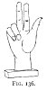 
Click to enlarge</a> 
FIG. 136. 
</td>
</tr>
</tbody>
</table>

Museum (about eight inches high), No. 5505/1737, from Pompeii. Being
mounted on a stand, its purpose is evidently the same as the plain open
hand ([Fig. 104](tee11.htm#img_24500).md).

Jorio [460](#fn_484.md) has nothing whatever to
say about this position, henceforward called that of the *Mano Pantea*.
As a gesture by the common people it is not used at all, but is
evidently left for the priests alone, [461](#fn_485.md) being specially the attitude of our
Lord in the act of benediction, as shown by the Ravenna mosaic ([Fig.
107](tee11.htm#img_24800), [p. 248](tee11.htm#page_248).md).

Of the three men entertained by Abraham, the one who may be supposed to
represent the Second

p. 294

\[paragraph continues\] Person of the
Trinity, as already described, holds the right hand thus, while the
central figure, the First Person, is making the Eastern sign of
benediction, also explained, with the first, second, and fourth fingers.
Again, in the great twelfth century mosaic of our Lord on the tribune of
the

  [  
Click to enlarge](img/29400.jpg.md)  
FIG. 137., 138.  

\[paragraph continues\] Cathedral of
Monreale in Sicily the attitude is the same as in [Fig.
107](tee11.htm#img_24800.md) though six centuries later, and twelve
centuries later than [Fig. 136](tee12.htm#img_29100.md). Although this
position of the hand is that usually assigned to Him, it is by no means
restricted to the Second Person, for there are several instances where
the Almighty Father is shown in this attitude, and, further, the Holy
Spirit is portrayed in human form with the right hand raised in this
gesture [462](#fn_486.md) ([Figs. 130,
131](tee12.htm#img_28600).md).

p. 295

There are very interesting examples of this special attitude, attributed
not only to all the Persons of the Holy Trinity separately, but in two
cases Miss Twining [463](#fn_487.md) (in Plates
xxxiv. xxxv.) represents the Trinity by one single, seated figure, who,

  [  
Click to enlarge](img/29500.jpg.md)  
FIG. 139.  

in both plates, is lifting the right hand in the position we are now
discussing. There are many other examples of this attitude attributed to
the Almighty Father, where the hand alone, or *Dextera Dei*, in this
position is shown coming down from the clouds. [Fig. 139](#img_29500.md),
from the Norman tympanum at Hoveringham, Notts, [464](#fn_488.md) shows this Almighty hand reaching down
to St. Michael fighting with the dragon. [465](#fn_489.md)

p. 296

As a modern amulet to be worn, the writer has 

<table data-align="LEFT">
<colgroup>
<col style="width: 100%" />
</colgroup>
<tbody>
<tr class="odd">
<td data-valign="CENTER"><a href="img/29600.jpg">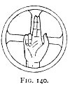 
Click to enlarge</a> 
FIG. 140. 
</td>
</tr>
</tbody>
</table>

never seen a simple hand thus posed, but always with other attributes
placed upon it. Thus combined it is one of the most remarkable of all
the composite charms known against the evil eye, whether of ancient or
modern times. The original from which [Figs. 147, 148](#img_29900.md) are
taken is now in Berlin,

but there are in the Kircherian Museum in Rome

  [  
Click to enlarge](img/29601.jpg.md)  
FIG. 141., 142.  

two or three others similar in type, but widely differing

p. 297

in detail. They are all from 6 to 8 inches high.

  [  
Click to enlarge](img/29700.jpg.md)  
FIG. 143.  

All are in the same attitude that we have been

  [  
Click to enlarge](img/29701.jpg.md)  
FIG. 144., 145.  

describing, but each one has a varying combination

p. 298

of symbols upon it. One of these hands is in the British Museum ([Figs.
156, 157](#img_31800).md), two are at Cortona, 

<table data-align="LEFT">
<colgroup>
<col style="width: 100%" />
</colgroup>
<tbody>
<tr class="odd">
<td data-valign="CENTER"><a href="img/29800.jpg">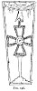 
Click to enlarge</a> 
FIG. 146. 
</td>
</tr>
</tbody>
</table>

well known to the writer, in addition to those in Rome, mentioned above.
Besides all these, Jahn gives particulars (p. 101) of fourteen other
examples known to him, of which he says some are about the natural size,
and some a little smaller; but he seems quite ignorant of the fact that
they are made in Rome to-day and worn as amulets. Of these so-called
"votive hands" Jahn says (p. 102) that two have inscriptions upon them;
of these, one in the Barberini collection in Rome has

CECROPIVS · V · C · VOTUM · *Solvit*,

and the other in London, in the possession of Lord Londesborough, has:--

 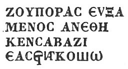

He says the first lines are clear, *i.e.* Ζούπορας εὐξάμενος

p. 299

\[paragraph continues\] ἀνέθηκεν Σαβαξίῳ
Not so the last. In a note he says: "Keil" (*Arch. Anz.* 1854, p. 517)
"recognised the word ἐπηκόῳ, which is common in votive inscriptions,
without explaining the rest." Jahn

  [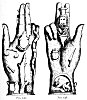  
Click to enlarge](img/29900.jpg.md)

himself offers no explanation. The position of the hand, he says, is
still the one used in taking the oath, [466](#fn_490.md) and a sign used by priests.

p. 300

On [Fig. 112](tee11.htm#img_25900.md) will be seen two specimens of this
hand as a modern amulet, bought at two different shops in Rome. One is a
charm to be suspended from the watch-chain, and the other is mounted as
a brooch. As these are so small, the writer tried to get a full-sized
bronze specimen, and among other shops went to that of Sig. Finocchi, in
the Piazza Minerva, whom he well knew, and from whom he was sure of
getting information. They are only made as charms *contra la jettatura*,
in gold or silver, he said, and while talking about it, showed the one
he was himself wearing, just like the two on [Fig.
112](tee11.htm#img_25900.md), but of gold. In Rome this little hand is well
known, and is called by everybody the *Mano Pantea*. The same charm in
silver, quite complete, possibly of Roman make, is in the shops at
Constantinople, but has not been found by the writer either at Smyrna,
at Athens or elsewhere in Greece. The name is well established; it
appears upon the brooch itself, and further upon the printed
description, given with the article to the writer, by the jeweller who
sold it. This description is given below in full. [467](#fn_491.md)

The reason for giving a printed description is, that this article is of
very superior workmanship to the ordinary charm, and so needs some
explanation to account for its costliness; also to explain that it

p. 301

is an exact copy of the antique, and therefore superior in every way to
the. ordinary goods sold, etc. The term *Pantheus* is dealt with by Mr.
King, *Gnostics*, pp. 80, 81. It signifies a combination of many
attributes, expressing the amalgamation of several ideas into one and
the same form. [468](#fn_492.md)

Comparison with the illustration here printed shows that it differs from
that given by Jahn (Taf. IV.), although the symbols are nearly the same.
Jahn's represents the top of the index and middle finger broken off, has
no scarab, nor the nondescript article called *oggetto ignoto* by the
Roman jewellers, but which it is here suggested is the whip of Osiris or
*courbash* of modern Egypt, of which two separate ones are plainly shown
on the British Museum hand ([Figs. 156, 157](#img_31800).md). The whip is
the symbol of rule [469](#fn_493.md) and
government; in Egyptian sculptures always in the right hand of
Osiris. [470](#fn_494.md) This explanation of a
doubtful object is rather confirmed by its being placed immediately over
the Vase or *Cantharus*, one of the recognised symbols of Osiris.
Apuleius says that water in an urn represented Osiris. It was
consecrated to him as the life-giving water-god-the Nile. This
two-handled vessel was sacred to Bacchus in Roman times, and that it was
a veritable amulet is proved by the fact of its being the sole device

p. 302

upon the shield of one of the Amazons, painted on a famous vase at
Arezzo (see Dennis, *Etruria*, vol. ii. p. 387 ). [471](#fn_495.md) Moreover, when we consider that the
whole of the symbols here combined, beginning with the bust of Serapis,
are essentially Egyptian, it is but reasonable to interpret the unknown
from the well known. [472](#fn_496.md)

Serapis, or Jupiter Serapis, the Egyptian divinity whose bust is placed
upon the *mons Jovis* of the hand, was chiefly worshipped at Alexandria.
His cult was introduced into Greece in the time of the Ptolemies, and
afterwards, against much opposition, [473](#fn_497.md) into Rome. One ruined temple at least
still exists in Italy called a *Serapeon*, and others called *Iseons*,
in which latter, Isis as well as Serapis was worshipped. The best known
of the former is at Pozzuoli, and of the latter at Pompeii. That at
Pozzuoli specially recalls the connection of that port with Alexandria.
In a ship of Alexandria trading with Italy St. Paul sailed, and so
landed at Pozzuoli (Puteoli, Acts xxviii. 13). The Egyptian divinity was
Osiris, called Osiris-Apis or Serapis, [474](#fn_498.md) who in Egyptian sculpture often has
the head of the bull Apis, crowned with the disc and horns like Isis. He
was essentially a sun-god; so also is Jupiter Serapis, an attribute
symbolised by the flower-basket or *calathus* upon his head, to express
the height of the sun above us. [475](#fn_499.md)
Innumerable are the statues,

p. 303

bas-reliefs, and gems connected with the worship of Serapis, who, though
lord of the sun, cannot be separated from Isis and other moon
goddesses." [476](#fn_500.md)

On gem talismans the bust of Serapis is very common, having the legend,
either in full, ΕΙ?&lt;υ?&gt;?C?&lt;?/υ?&gt;
ΘΕΟ?&lt;υ?&gt;?C?&lt;?/υ?&gt;
?&lt;υ?&gt;?C?&lt;?/υ?&gt;ΑΡΑΠΙ?&lt;υ?&gt;?C?&lt;?/υ?&gt;, or
abbreviated, Ε.Θ.?&lt;υ?&gt;?C?&lt;?/υ?&gt;. "There is but one God and
he is Serapis." ΕΙ?&lt;υ?&gt;?C?&lt;?/υ?&gt; ΖΩΝ
ΘΕΟ?&lt;υ?&gt;?C?&lt;?/υ?&gt;. "The one living God." Who can fail to
note here the prototype of the Mahomedan "Allah il Allah"?

Often the intention of the amulet is fully expressed, as ΝΙΚΑ Ο
?&lt;υ?&gt;?C?&lt;?/υ?&gt;ΑΡΑΠΙ?&lt;υ?&gt;?C?&lt;?/υ?&gt; ΤΟΝ ΦΘΟΝΟΝ,
"Baffle the evil eye, O Serapis!" [477](#fn_501.md) In the later Roman fashion, the
Almighty Jove most usually wears the castle-like crown, [478](#fn_502.md) something like that of the Ephesian
Diana, again showing the direct link between *Osiris-Isis* and
*Jupiter-Diana*. It is remarkable that on the dome of the so-called
Arian

p. 304

\[paragraph continues\] Baptistery at
Ravenna, of the sixth century, where there is a representation of our
Lord's baptism, the dove is descending in visible form, but the First
Person in the Trinity is represented sitting on a rock, as an old man
with white beard, and on his head a sort of crown identical in shape
with that upon Jupiter Serapis ([Fig. 148](#img_29900).md). [479](#fn_503.md)

Most, if not all, of the other symbols upon the *Mano Pantea*, like
those upon the every-day-of-the-week amulet ([Fig.
19](tee06.htm#img_13100).md), also belong to one or other of the last-named
deities of the sun and moon.

At the bottom of the palm is a kind of semicircular frame, found in all
these hands known to the writer, besides six of those named by Jahn,
containing a woman suckling a child, in this one with a bird keeping
guard over them. 

<table data-align="LEFT">
<colgroup>
<col style="width: 100%" />
</colgroup>
<tbody>
<tr class="odd">
<td data-valign="CENTER"><a href="img/30400.jpg">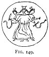 
Click to enlarge</a> 
FIG. 149. 
</td>
</tr>
</tbody>
</table>

Who can doubt these to be the same persons as those shown in Chapter VI.
and Appendix I.--Devaki and Crishna, Isis and Horus, or the universal
celestial mother and child? The bird is perhaps the cock, found on so
many other amulets, gems, and medals. He represents the dawn, which in
all ages he has proclaimed, and so typifies Diana, explained later; or
he may mean Phœbus, another name for Osiris, the Sun,

p. 305

watching over his consort the Moon (Isis), who is nursing their son
Horus. [480](#fn_504.md) It may be, however, that
this bird represents the eagle, another symbol of Jupiter, and often
seen with him on gems and statues. A very remarkable comment upon this
bird (in Jahn's plate it is quite nondescript, and looks like a goose
with eagle's beak), and upon the attitude here displayed, is in Dr.
Phene's description of some Hittite monuments in Asia Minor. He
says: [481](#fn_505.md) "The symbols are a
crouching bird on a level with the face of Sesostris, and close to it a
sceptre. . . . The bird usually found in Hittite inscriptions . . . is
the eagle, and the position is one of majesty, which he considered
implied kingly power, and hence the crouching and humbled bird was a
king bereft of his power." The bird on the *Mano Pantea* cannot be said
to be crouching, neither was it in the illustration which Dr. Phene
gave, nor is either of the birds represented on the Woburn marble ([Fig.
24](tee06.htm#img_13700)). [482](#fn_506.md)

Upon the figure of the woman and child, Jahn remarks (p. 104): "It has
been rightly considered that these hands are *ex votos* for a safe
delivery, and that the others, on which are other objects, are *ex
votos* for other good fortunes." To this opinion we take objection, upon
the ground that all these hands are constructed to stand upright, upon a
flat surface, whereas ancient as well as modern *ex votos*, such as
phalli, hands, legs, etc., were prepared for suspension.

p. 306

\[paragraph continues\] Moreover, *ex
votos*, when intended simply as such, were in old times generally
mutilated or broken, and the writer has never seen or heard of a bronze
one. [483](#fn_507.md) These hands were therefore
intended to be placed somewhere in the house, and not in the temple.
Further, all have a number of objects upon them, each in itself a
well-known amulet, specially used against the evil eye, and fashioned in
a very lasting material. All these devices would be useless and
meaningless upon a mere *ex voto*, which in old days, as now, we know to
have been some single object--an arm, a leg, a breast, or an
ear--representing in itself more or less accurately the benefit received
or the member healed. Moreover, we have the complete analogy of
compounded and complicated amulets in the many gems and medals among the
ancients, while among the moderns we have the striking example of the
*Cimaruta* in its manifold forms. Of this latter, Jahn never seems to
have

p. 307

heard, though he mentions the *mano fica* and one or two other modern
charms. With all deference to learning, it is stoutly maintained that
all these hands were not votive, but prophylactic, pure and simple. Thus
the whole amulet would be specially potent for the protection against
fascination of mothers and new-born infants, as well as for adults in
general. Our deliberate opinion is, that these hands, having such
pantheistic symbols upon them, were for the same purpose as the Teraphim
of Scripture, or the Lares and Penates of classic days. They were
probably held in much the same estimation as a crucifix is to-day by a
devout Christian.

It is suggested that what Jahn calls a bracket supporting the bust, may
be meant for a cornucopia, and if so, its meaning would be at once
evident. [484](#fn_508.md)

The next of the amulets, the scarab, is of all others, perhaps not even
excluding the mystic eye, the most commonly seen and found in Egyptian
tombs.

Its frequent occurrence in sculpture, no less than the authority of
numerous ancient writers, shows the great importance attached by the
Egyptians to this insect. "It was the emblem of the sun, to which deity
it was particularly sacred." [485](#fn_509.md) In
the scarab we have another symbol of Osiris, the Sun-God, and
consequently of his successor Serapis, the supreme divinity of our
complex amulet.

Pliny [486](#fn_510.md) says: "The insect in its
operations pictures the revolution of the sun." These "operations" are

p. 308

the habit it has of making pellets of clay, and rolling them along. The
scarab was also a symbol of the world, and as a hieroglyph, under its
name Ptah-Xeper, it signified the Creative Power. [487](#fn_511.md)

From the belief that there were no females, and that all of the species
were males, it was considered the symbol of virility and manly force,
hence it was engraved upon the signets of Egyptian soldiers. [488](#fn_512.md)

The scarab may be considered [489](#fn_513.md) as:
"(1) An emblem of the sun; (2) Of Ptah, the Creative Power, and of
Ptah-Xeper; (3) of Ptah-Socharis Osiris; (4) of the world; (5) connected
with astronomical subjects; [490](#fn_514.md) and
(6) with funereal rites."

Upon the *Mano Pantea* we may safely consider it under either, or all of
the four first meanings; and hence as it was in Egypt a powerful amulet
to guard both living and dead, so we may well believe it was adopted as
such by the Romans along with the Serapis cult. It will be noticed that
our jeweller's description passes over the scarab, which is nevertheless
very distinct on the original bronze.

On the back of the hand we have the frog, which our friend calls a toad
(*rospo*). [491](#fn_515.md) This is a common

p. 309

amulet against the evil eye. In Naples the simple frog amulet is called
a *Sirena*, like the more elaborate one of which a description follows
later. It is not only now worn (see [Fig. 112](tee11.htm#img_25900).md) by
Italians, Greeks, and even Turks, but it appears on many ancient gems
and medals (see [Fig. 17](tee06.htm#img_13001).md). It is commonly of
metal, but when cut out of amber or coral is of greater power. The frog
also was among Egyptians "a symbol of Ptah," because, as Horapollo says,
"it was the representation of man in embryo, that is, of the being who,
like the world, was the work of the Creative Power, and the noblest
production of his hands." [492](#fn_516.md)

"The importance attached to the frog in some parts of Egypt is shown by
its having been embalmed, and honoured with sculpture in the tombs of
Thebes. The frog was the symbol of *hefnu*, 100,000, or an immense
number. [493](#fn_517.md) It sat on a ring or
seal, a sign occasionally used in lieu of the Tau or 'life.'" Again we
are told, "la 

<table data-align="RIGHT">
<colgroup>
<col style="width: 100%" />
</colgroup>
<tbody>
<tr class="odd">
<td data-valign="CENTER"><a href="img/30900.jpg"> 
Click to enlarge</a> 
FIG. 150. 
</td>
</tr>
</tbody>
</table>

grenouille rappelait l'idée de la renaissance." [494](#fn_518)[Fig. 150](#img_30900.md) is from
Maspero's *Archéologie*, p. 235. Jahn gives a plate (Taf. IV.) of a
terra-cotta lamp, now in the Berlin Museum, having an eye for centre,
round which are the frog, scorpion, phallus,

p. 310

snail, and two monkeys' heads (*cynocephalus*); the spout is formed of a
horned mask. The frog is shown on the Kertch necklace (p. 135) as one of
the special amulets. There is also an ancient bronze frog amulet, [495](#fn_519.md) prepared for suspension, in the
Ashmolean Museum.

Pliny says: [496](#fn_520.md) "To this the Magi
add some other particulars, which, if there is any truth in them, would
lead us to believe that frogs ought to be considered much more useful to
society than laws." He gives directions for a particular manipulation

<table data-align="LEFT">
<colgroup>
<col style="width: 100%" />
</colgroup>
<tbody>
<tr class="odd">
<td data-valign="CENTER"><a href="img/31000.jpg">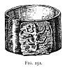 
Click to enlarge</a> 
FIG. 151. 
</td>
</tr>
</tbody>
</table>

of the frog, by which a wife conceives an aversion to all paramours. One
kind (*phrini*), known to the Greeks, have protuberances like horns. He
also says, there is a small bone on each side of a frog. That on the
right side has many wonderful properties one is, that if thrown into
boiling water it will immediately cool, and that it will not boil again
till the bone be removed. The little bone from the left side, on the
other hand, has the property of making it boil. It will also assuage the
fury of dogs, and if put into drink it will conciliate love and end
discord or strife. It is also worn for a talisman as an
aphrodisiac. [497](#fn_521.md)

p. 311

One of the two frog charms on [Fig. 112](tee11.htm#img_25900.md) is that
common in Rome, while the clumsier one is Neapolitan. The two shown
immediately 

<table data-align="RIGHT">
<colgroup>
<col style="width: 100%" />
</colgroup>
<tbody>
<tr class="odd">
<td data-valign="CENTER"><a href="img/31100.jpg">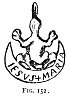 
Click to enlarge</a> 
FIG. 152 
</td>
</tr>
</tbody>
</table>

beneath the *Mano Pantea* on the same plate are from Constantinople,
sold openly as charms in the bazaars. Evidently the frog as an amulet is
widely used among various races, ancient and modern. [498](#fn_522.md)

Little need be said as to the importance of the serpent as an amulet.
Serpent worship has prevailed throughout the ages. It is the type of
eternity, and with its tail in its mouth the symbol of perpetual union.

There is hardly a country of the ancient world where it cannot be
traced, pervading every known system of mythology. [499](#fn_523.md) Babylon, Persia, India, Ceylon, China,
Japan, Burmah, Java, Arabia, Syria, Asia Minor, Egypt, Ethiopia, Greece,
Italy, Northern and Western Europe, Mexico, Peru, North America, all
yield abundant testimony to the same effect respecting serpent

p. 312

worship, and point to the common origin of pagan systems wherever found.

The intimate connection of the serpent with the idea of the Medusa adds
to the evidence that her 

<table data-align="LEFT">
<colgroup>
<col style="width: 100%" />
</colgroup>
<tbody>
<tr class="odd">
<td data-valign="CENTER"><a href="img/31200.jpg">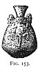 
Click to enlarge</a> 
FIG 153. 
</td>
</tr>
</tbody>
</table>

myth came from the East; for there the serpent has always been the
symbol of an evil demon. [500](#fn_524.md) On the
other hand, the Phœnicians adored it as a beneficent *genius*, [501](#fn_525.md) and in Egypt, one of the earliest
homes of serpent worship, [502](#fn_526.md) it was
looked upon as a protector, *tutela loci*, the guardian of tombs. Every
tomb of the kings yet opened there has the serpent sculptured erect on
each side of the door way as the symbol of the watchful, protecting
deity. It was called Thermuthis, "and 

<table data-align="RIGHT">
<colgroup>
<col style="width: 100%" />
</colgroup>
<tbody>
<tr class="odd">
<td data-valign="CENTER"><a href="img/31201.jpg">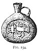 
Click to enlarge</a> 
FIG 154. 
</td>
</tr>
</tbody>
</table>

with it the statues of Isis were crowned as with a diadem." [503](#fn_527.md) It was the mark of royalty. Egyptian
kings and queens have an asp on the front of their crowns as a sign of
the invincible power of royalty. There was another serpent called
Aphôphis, the giant, which was looked upon as the type of evil. It was
said to have been killed by Horus, and this myth is no doubt the same as
that of Apollo and the Python in Greek mythology. In Egypt the serpent
was both worshipped and hated, probably at different times, and in
accordance with

p. 313

the origin of the several dynasties maintaining the cult. We find the
same thing as regards the crocodile. At one place it was worshipped as a
god, and at others, *e.g.* Edfou, it was hunted and slain as a venomous
beast.

A very large live serpent was kept, according to Ælian, in the temple of
Æsculapius at Alexandria, and according to Pausanias there was another
in his temple at Epidaurus; both were carefully tended as objects of
worship. We all know that a serpent is the usual accompaniment of
ancient statues of the god, and in this connection is said to typify
health. It is also said [504](#fn_528.md) to
denote the condition or duration of the disease, and hence it may be
described as the symbol of diagnosis. Livy [505](#fn_529.md) and several authors relate that when a
pestilence broke out in Rome, the Delphic oracle advised an embassy to
Epidaurus, to fetch the god Æsculapius. While they were gazing at the
statue of the god a "venerable, not horrible," serpent, which only
appeared when some extraordinary benefit was intended, glided from his
hiding-place and, passing through the city, went direct to the Roman
ship, where he coiled himself in the berth of Ogulnius, the chief
ambassador. On arrival in the Tiber the serpent leapt overboard and
escaped on an island. Here a temple was erected to him in the shape of a
ship, and the plague was immediately stayed. [506](#fn_530.md) Delphi was the

p. 314

stronghold of serpent worship in Greece, and a singular fact remains.
The oldest known monument in Europe, an undoubted relic of ancient
serpent worship, is now to be seen still standing in the Atmeidan or
Hippodrome at Constantinople. It is the original column, brought from
the temple of Apollo at Delphi, and was set up where it now stands by
Constantine, about A.D. 324.

It consists of [507](#fn_531.md) "the bodies of
three serpents twisted into one pillar of brass. Their triple heads had
once supported the golden tripod which, after the defeat of Xerxes, was
consecrated in the temple of Delphi by the victorious Greeks." It bears
the only known inscription still extant, which is actually contemporary
with the Persian wars. It was erected soon after the battle of
Marathon. [508](#fn_532.md) The surface of the
Atmeidan is now several feet higher than the base of this famous column,
which stands in a sort of pit. Originally the serpents had three heads,
now all have disappeared--one is said to have been knocked off by
Mahomet himself, who exclaimed against it as an idol. No sooner had he
done this than a great number of serpents began to be seen in the
city. [509](#fn_533.md) The writer can testify to
the great veneration with which this precious relic of the past is still
regarded by the Turks, who look upon it as one of the great protectors
of the city. [510](#fn_534.md)

p. 315

In Greek and Roman mythology the serpent Agathodemon was the attribute
of Ceres, Mercury, Æsculapius, and Hecate-Diana, with, of course, their
Egyptian prototypes in their most beneficent qualities; while Python was
a fearful monster, which only a god could overcome and destroy. The same
fierce enmity, abject fear, submission and worship regarding the
serpent, are found to-day among Hindoos and Mahomedans of India, as well
as among savages of Africa and America. Without attempting to explain
the story of the brazen serpent in the wilderness, it may be pointed out
that to the Israelites, just come out of Egypt, the worship of
Agathodemon was perfectly familiar, and that it was to them the symbol
of life and health.

The temples in Cambodia, of which the French produced large models at
more than one Paris Exposition, show that they were guarded by a great
avenue of serpents, and the same objects are seen at the entrances to
Chinese temples.

That our Celtic forefathers were Ophiolaters [511](#fn_535.md) is proved by the so-called Druidical
remains at Abury and elsewhere. just as serpents are carved on the rock
to guard the tombs of the kings at Thebes, so, the writer observed in
the early Celtic tomb of Gavr Innis at Locmariaker, in Brittany, are two
serpents sculptured on the rock inside the entrance. [512](#fn_536.md)

p. 316

We are all familiar with the two serpents, called the *Caduceus*, in the
hand of Mercury. This was a true amulet which he carried as the staff of
a messenger to guard him against the malevolent glances of those who
would impede his errand. 

<table data-align="LEFT">
<colgroup>
<col style="width: 100%" />
</colgroup>
<tbody>
<tr class="odd">
<td data-valign="CENTER"><a href="img/31600.jpg">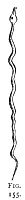 
Click to enlarge</a> 
FIG. 155 
</td>
</tr>
</tbody>
</table>

The two serpents in congress are the Rod of Life. [513](#fn_537.md) The *caduceus*, the special symbol of
Mercury, was used sometimes alone as an amulet on engraved gems. Of one
of these Mr. King gives a specimen (*Gnostics*, p. 70). Among modern
amulets the two bone specimens, bought at Sienna, shown on [Fig.
112](tee11.htm#img_25900.md), bear signs of much wear, and so prove that
the same belief as of old still survives. [514](#fn_538.md)

In West Africa the serpent is still used as an amulet to protect the
crops. [Fig. 155](#img_31600.md) Is an iron one from Ashantee, now in the
Somerset County Museum along with the other objects shown on [Fig.
88](tee08.htm#img_21500). Lastly, on [Fig. 8](tee06.htm#img_12200.md) the
serpent is shown in connection with the crescent; and upon the Cimaruta
([Fig. 162](tee14.htm#img_34500).md) it forms the horns of the half-moon,
thus

doubly augmenting its power as a protection against the evil eye. The
serpent plays so large a part in Egyptian worship, [515](#fn_539.md) that we may well consider it to

p. 317

be closely connected with the worship of Serapis, as well as the
moon-goddesses, and therefore we find it upon every *Mano Pantea* known
to the writer. That it was an ancient Græco-Roman amulet, is proved by
the several gems and medals (Figs. [14](tee06.htm#img_13000)-19.md) which
were avowedly against the evil eye. We see serpents also in the hands of
the three-formed goddess shown on Figs. [149](#img_30400.md) and
[163](tee14.htm#img_34900.md).

The annexed drawings ([Figs. 156, 157](#img_31800).md) are from a bronze
hand in the British Museum, belonging to the collection of the late Rev.
Payne Knight, which does not appear to have ever been

p. 318

published, and which is not one of those described by Jahn.

In this beautiful, nearly life-size hand, the serpent is by far the most
conspicuous amulet upon it, for it

  [  
Click to enlarge](img/31800.jpg.md)  
FIG. 156, 157.  

is evidently intended to be seen from whichever side the hand is looked
at. In this case, moreover, there is not only the large serpent, but
also a small one, so as to seemingly pile up the power of this
protecting, watchful guardian. It is suggested that the smaller
represents the Asp of Egyptian royalty. A

p. 319

comparison of the two (Figs. [147, 148](#img_29900.md), and [156,
157](#img_31800).md), which may be considered as typical of all the known
hands, will not fail to show points of agreement in them, and prove
that, whatever their purpose may have been, it was the same in all
alike.

In five out of the six medals and gems ([Figs.
14](tee06.htm#img_13000)-19.md) there is a serpent; in both these hands he
is in connection with the third or medical finger, as the representation
of the healing god Æsculapius, and in both cases he is given the same
position on the back of the hand.

The woman and child in the arched frame are on both hands alike, but in
the Payne Knight hand there is no bird to watch over them.

The frog, it may be noted, in both cases seems to have its proper
position, and that well known, aphrodisiac, was surely placed by design
in close relation to the middle finger, the ancient *digitus infamis*.
The ram's head occupying nearly the same position as the head of
Jupiter, appropriately upon what is known to palmists as the *mons
Jovis*, must be taken as the symbol of that divinity, who is constantly
depicted with ram's horns upon his head.

The Cantharus, or two-handled vase, appears on both hands. The
remarkable table with three flat cakes upon it, is much more difficult
of explanation. It seems to be an offering of bread to the Almighty
Jove, and one cannot but be struck by the coincidence of these three
cakes with those shown on the table in Figs. [113](tee11.htm#img_26500.md),
[116](tee11.htm#img_26800.md), on the altar of Melchisedec, and before the
three strangers entertained by Abraham. We do not assert the connection,
but the threefold aspect of Egyptian gods is dwelt upon elsewhere, and
these cakes may well typify offerings

p. 320

to the greatest of the gods in his threefold character. All the known
hands of this class appear to be Roman, and of the period of the empire
before Constantine.

The crocodile, also on both the hands, was an Egyptian amulet: it was
worshipped as a god, called Sebek in Lower Egypt, and there was a city
called *Crocodilopolis* by the Greeks, from the cult there
practised; [516](#fn_540.md) hence it here finds
an appropriate place. [517](#fn_541.md) As the
type of the generation of divine wisdom, we understand the crocodile
upon Minerva's breast, in those gems and statues where she is not
wearing the ægis, but which represent her as the goddess of wisdom and
learning.

As an amulet to be worn on the person, the crocodile does not appear to
be very commonly used; but as a protector against the evil eye it has
been adopted by many people. Among the amulets on the necklace shown on
[Fig. 21](tee06.htm#img_13500.md) is the head of a crocodile. Its present
use in Cairo and Tunis does but perpetuate the belief which displayed
itself in the gift of the crocodile, now hanging over the door of
Seville Cathedral ([Fig. 158](#img_32100).md). This was an undoubted amulet
in 1260, and all must remember also the crocodile upon the column on the
Piazzetta at Venice, on which stands St. Theodore. Now this column, with
its companion bearing the lion of St.

p. 321

\[paragraph continues\] Mark, was erected
in 1329, only seventy years after the famous *Lagarto* was set up in
Seville; and we maintain that as Pisistratus set up a column bearing a
cricket, in the Agora at Athens, to 

<table data-align="RIGHT">
<colgroup>
<col style="width: 100%" />
</colgroup>
<tbody>
<tr class="odd">
<td data-valign="CENTER"><a href="img/32100.jpg">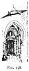 
Click to enlarge</a> 
FIG. 158. 
</td>
</tr>
</tbody>
</table>

guard the people from the evil eye, so did the Venetians set up their
columns for the like purpose. We are told [518](#fn_542.md) that these columns so completely
formed a part of the *idea* of Venice, that they were repeated in "most
of the cities subject to its dominion." What could be the i*d*ea other
than that here suggested? We see how in Naples to-day the lion of St.
Mark is placed on the horses' backs, avowedly as an amulet, *contra la
jettatura*; is there not then every reason for believing that the dread
of that influence was quite as great, and that the means taken to
counteract it were as many, if not even more numerous, in the Middle
Ages than at present? It cannot therefore be unreasonable to assign the
same meaning to the mediæval crocodile and lion at Venice as to the
modern lion at Naples, and the modern crocodile at Tunis and Cairo.

In Portugal a favourite object in pottery is a lizard or crocodile, so
made as to hang flat against the wall. The writer has one such, which he
bought in Lisbon certainly as an amulet, and always regards as such.

In Figs. [14](tee06.htm#img_13000)-[17](tee06.htm#img_13001.md) the
crocodile appears in every one of the five combinations, while even the
serpent is wanting in one--clearly proving the importance attached to it
as an amulet for wear in Roman times.

p. 322

The crocodile was believed to conceive by the ear and to bring forth by
the mouth--a strange notion indeed, yet it has been perpetuated as a
Christian one in the hymn [519](#fn_543.md) of S.
Bonaventura, the Seraphic Doctor, [520](#fn_544) who (born 1221 in Tuscany.md) lived at
the precise epoch when the cult of the B.V.M. had begun to occupy such a
disproportionate place in the Services of the Church, [521](#fn_545.md) just at the time when the legend of
ancient Egypt respecting Isis, itself derived from still older sources,
had been adapted to her successor. An ancient gem, belonging to the late
Rev. C. W. King, shows Serapis seated: before him stands Isis, holding
in one hand the sistrum, in the other a wheat-sheaf, with the legend Η
ΚΥΡΙΑ Ι?&lt;υ?&gt;?C?&lt;?/υ?&gt;Ι?&lt;υ?&gt;?C?&lt;?/υ?&gt; ΑΓΝΗ,
"Immaculate is our lady Isis." "The very terms applied afterwards to
that personage who succeeded to her form, titles, symbols, rites and
ceremonies." [522](#fn_546.md) Her proper title,
Domina, the exact translation of the Sanscrit *Isi*, survives, with
slight change, in the modern Madonna" (*Mater Domina*).

The scales, so prominent upon most of these

p. 323

hands, are passed over by Jahn, but they serve at least to confirm the
Egyptian character of all these amulets. At the time when these hands
were made in Italy, the weighing apparatus was always, as it is to a
large extent to-day, of the steelyard type. Of all the scales in the
Naples and Pompeian Museums every one is a steelyard; whereas in the
innumerable representations of weighing, found on Egyptian paintings and
sculptures, whether of souls by the recording Thoth, or of merchandise
by various persons, the machine is nearly always an equipoised beam and
two scales. [523](#fn_547.md) In judging then of
the true meaning of the scales upon the *Mano Pantea*, we must take into
account the fact that, as a representation, they were conventional, of
an object not unknown, but at least such as the Roman users of these
hands were unaccustomed to. [524](#fn_548.md)
Although the Egyptians had another kind of balance it is rarely seen.

As a separate amulet the scales are not used so far as the present
writer is aware, nor can he pretend

p. 324

to explain their meaning in these combinations. Jahn, too, says (p. 106)
that he cannot explain them. In Egyptian art the scales appear whenever
Osiris sits in judgment upon a human soul, and they are accompanied by
Thoth the scribe. The same idea has descended through the ages into
Christian art. In pictures of the Last Judgment, the Archangel Michael
is often represented as holding the scales of Justice, in which the soul
shall be weighed. That the scales on both our hands do represent an
amulet, we must maintain, for they form one of the signs of the Zodiac,
and nearly all the other objects are known to be amulets. [525](#fn_549.md)

The tortoise appears on both the hands here shown, as well as on the
Florentine gem ([Fig. 17](tee06.htm#img_13001).md). Moreover, Jahn says
that "there are little ones made of bronze, of precious stones, and of
amber, sometimes with other amulets hanging on a necklace, so that the
meaning of the tortoise as an amulet cannot be doubted." [526](#fn_550.md) Of the hands catalogued by Jahn, no
less than twelve have the tortoise upon them.

Pliny says: [527](#fn_551.md) "The flesh of the
land tortoise . . . is highly salutary for repelling the malpractices of
magic and for neutralising poisons." He gives many diseases for which,
when eaten, the flesh is a cure; also "the blood of the land tortoise
improves the eyesight and removes cataract." In one way which he
details, the shavings of the shell are an antaphrodisiac, and in another
strongly the opposite.

p. 325

\[paragraph continues\] The urine,
according to adepts in magic, has marvellous properties; the eggs also
are a remedy for scrofula and other evils. The catalogue of remedies
given by Pliny, for which the tortoise can be used, is no less than
sixty-six. [528](#fn_552.md)

A tortoise-headed god occurs as one of the genii in the tombs; but it
does not appear that the tortoise held a rank among the sacred animals
of Egypt. [529](#fn_553.md)

The tortoise is very often depicted with and as an emblem of Mercury,
like the *Caduceus*. [530](#fn_554.md) Jahn gives
particulars of the various symbols on the hands known to him, and thus
proves that all were similar in type though differing in detail.

On the British Museum hand ([Figs. 156, 157](#img_31800).md), which Jahn
had never seen, is a remarkable feature, not uncommon, though the writer
has seen one only. Jahn says the pine-cone appears upon no less than
nine of the hands known to him. It is also among the amulets strung upon
the Kertch necklace ([Fig. 21](tee06.htm#img_13500).md). The position given
to it upon the tip of the thumb marks it out as an object of
considerable importance, and its frequent use shows it to have been
considered as a powerful amulet. The pine-tree was sacred to Zeus, and
an attribute of Serapis; it was beloved of virgins. Ovid calls the pine
*pura arbor*. [531](#fn_555.md) The cone had
however a phallic meaning, and Layard says the pine-cone was most used
in the cult of Venus. [532](#fn_556.md)

The fig-tree on the hand had also a phallic

p. 326

meaning. It was borne in the processions of Dionysos at the Eleusinian
mysteries.

The bee was a symbol of Diana (see [Fig. 17](tee06.htm#img_13001).md).

Three objects near the tail of the serpent are probably intended for a
knife, a strigil, and a distaff.

The horseshoe figure with two rings at the ends is difficult to explain.
There is an object almost exactly like it upon the breast of a Greek
statuette in the Ashmolean; and also it is very like the small amulet
([Fig. 89](tee08.htm#img_21900).md) from Bologna. The hand from the British
Museum shows a greater number of amulets upon it than any other with
which either Jahn or the writer is acquainted.

In six of those catalogued by Jahn is found the frame with the woman and
child at the breast. One especially, he says, possesses images of the
gods Cybele and Mercury. Two others have Mercury, and two have a bearded
figure in a Phrygian cap. This latter seems in a way to connect them
with the famous Woburn marble ([Fig. 24](tee06.htm#img_13700).md).
Moreover, one of the heads of Diana Triformis is represented as wearing
a Phrygian cap. [533](#fn_557.md) Another has a
full-length figure sitting on the palm of the hand in Phrygian tunic and
hose, and having both hands uplifted, pointing with the forefinger
extended as in the Phrygian worship of Cybele, Bacchus, and Mercury.

Only three known hands have the Serapis head. On four an eagle sits on
the two upraised fingers, grasping a thunderbolt in its claws. The
oak-branch of Jove is found on two; on another is the lyre of Apollo.
The *Caduceus* is on three; the pincers of Vulcan are on two. One has
the egg-shaped

p. 327

helmet worn by the Dioscuri (Castor and Pollux) two others have the
Thyrsus; one a vine-branch and no less than nine of those known to Jahn
have the two-handled Cantharus. One has the moon, which Jahn says is
perhaps the badge of Mars (*der Harnisch dem Ares*). Besides all these
there are the symbols of the Phrygian orgies--the tympanum on one, bells
on one, crotala (kind of cymbal) on two; cymbals on three; the Phrygian
flute on four; knife on two; and the whip on four. The ox head is on
two, and the ram's head on five. Egyptian cultus is again represented by
the sistrum upon two of these hands. What seems like a round offering
cake, divided by cross lines into four parts, appears upon two hands.
They are precisely like the round, flat cakes found at Pompeii, now in
the Naples Museum, and at Oxford, except that the terra cottas in the
Ashmolean are not only imitation loaves, but smaller than real ones,
thus doubly cheating the dead. [534](#fn_558.md)

The scales are found on no less than nine, and Jahn gives besides a list
of animals depicted on these hands--a bird, unknown, on two; a frog on
ten; a tortoise on twelve; a lizard or crocodile on nine; but he does
not say on how many he has noted the serpent. He remarks that it is
certainly not by chance that we meet again and again with the same
animals; which play so significant a part among protectives against the
evil eye; all the less so (*i.e.* by chance), as amongst the other
symbols met with, come out the well-known signs of the phallus on one,
and the vulva also on another.

p. 328

If we would now finally settle the proper meaning of these animals, the
fact is distinctly proved that in all those allied religious
representations which display the richest arsenal of superstitions and
witchcraft, a signification is given to those animals, which makes them
serve forthwith as amulets. [535](#fn_559.md)

He winds up his treatise with a description of six different magic
nails. One of these, now in the 

<table data-align="LEFT">
<colgroup>
<col style="width: 100%" />
</colgroup>
<tbody>
<tr class="odd">
<td data-valign="CENTER"><a href="img/32800.jpg">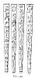 
Click to enlarge</a> 
FIG. 159. 
</td>
</tr>
</tbody>
</table>

Collegio Romano, is here reproduced ([Fig. 159](#img_32800).md). [536](#fn_560.md) Jahn remarks that nails have much to
do with human superstitions; that the well-known ancient Etruscan custom
of *clavum figere* was not merely intended to mark the date, but, as
Livy relates, it is said over and over again by tradition of the

p. 329

ancients, that pestilence was stayed when a nail was driven by the
dictator. [537](#fn_561.md)

It is also shown by Pliny how disease could be cured in this way; [538](#fn_562.md) and by the Romans the mere utterance
of the word *defigere* implied a nail driven, and thereby an act by
which fascination or witchcraft was countervailed. [539](#fn_563.md) In Greek tombs nails have been found
amongst other amulets used for the dead as well as for the living. In
the present day it is sought by human wisdom to strengthen the power of
these nails; hence a nail by which some one has been slain on the cross,
or a nail from a shipwrecked vessel, has quite a special power; the
first against intermittent fever and epilepsy, and the latter against
epilepsy.

Many of these nails had inscriptions and symbols Of magic power engraved
upon them, and once more we repeat that each added symbol was supposed
to increase the collective power of the whole. Most of the separate
symbols found on these nails have been already described as protectives
against the evil eye--*a fortiori*, the nails were potent amulets.
Moreover when we perceive in these latter days that all these same
animals and objects, together with cabalistic writings, appear in
constant use as

p. 330

avowed protectors against fascination, we are not only confirmed in our
judgment of their meaning in the ancient form, but we are taught how
strong, how lasting, and how universal, is the belief.

In the light gained from ancient amulets we easily see the meaning of
most of the other objects on [Fig. 112](tee11.htm#img_25900.md), every one
of which is openly sold today as *contra la jettatura*.

The large tiger's tooth in the centre is by no means uncommon. Real
tigers' teeth set as a brooch, forming a crescent, are plentiful enough
here in England, though their owners hardly look on them as amulets.
Much value is placed on every part of a tiger as a protective charm in
India.

Pliny says: [540](#fn_564.md) "The canine tooth of
the wolf, on the right side, is held in high esteem as an amulet."
Also: [541](#fn_565.md) "A wolf's tooth attached
to the body prevents infants from being startled, and acts as a
preservative against the maladies of dentition; an effect equally
produced by making use of a wolf s skin, attached to a horse's neck (it)
will render him proof against all weariness, it is said." If wolves'
teeth were so precious in olden times, while they were tolerably
plentiful, of how much greater value would be that of one of a *gran
bestia*, like a tiger! We see the analogy of setting greater value upon
the scarcer article, in Jorio's remarks on Neapolitan shop and house
keepers ([p. 259](tee11.htm#page_259) sq..md). Again, in Pliny's day, the
wolf skin was an amulet; we see and know the use made of it to-day.

The medal with St. George and the Dragon is with some a favourite, but
of course we can only now

p. 331

consider it as an adaptation of the story of Perseus and Andromeda to
the exigencies of mediæval saint-lore. San Georgio is a favourite saint
both in Italy and in Greece; we have seen that Mascagni always carried
him.

The Gobbo or hunchback is much more common, and is an undoubted survival
from ancient days. The Egyptian god Bes is represented as 

<table data-align="RIGHT">
<colgroup>
<col style="width: 100%" />
</colgroup>
<tbody>
<tr class="odd">
<td data-valign="CENTER"><a href="img/33100.jpg">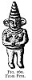 
Click to enlarge</a> 
FIG. 160. 
From Peru. 
</td>
</tr>
</tbody>
</table>

deformed, [542](#fn_566.md) and he is frequently
seen in connection with Horus, when the latter typified death. The
number of statuettes of Bes still in existence shows that he was looked
upon with veneration, and his cultus may well have descended to the
modern Gobbo, an undoubtedly favourite charm. Among the Egyptian amulets
in the Museo Kircheriano are many veritable Gobbi, almost exactly like
those represented on [Fig. 112](tee11.htm#img_25900.md), though of course
without their modern dress. The Gobbo is sold as a charm in silver at
Constantinople. [543](#fn_567.md) There are also
one or two small Phœnician figures in the Ashmolean, which are undoubted
hunchback amulets. Monte Carlo gamblers did not invent their lucky
Gobbo.

The bull and the cow are of course the symbols of Osiris-Serapis, and of
Isis-Hathor respectively.

p. 332

\[paragraph continues\] *Capo di bove* is
a very favourite ornament of Etruscan and Roman times, seen alike on the
famous Cortona lamp, on the mausoleum of Cecilia Metella so well known
to all tourists, but more than all upon the Ephesian Diana (see [Fig.
69](tee08.htm#img_18800).md).

The elephant appears as an amulet on ancient gems (see [Figs. 15,
16](tee06.htm#img_13000).md), and has more said about him by Pliny than
perhaps any other animal. In Egyptian sculptures he appears among "the
presents brought by an Asiatic nation to an Egyptian king," [544](#fn_568.md) but from the representations of ivory,
brought from Ethiopia, he would not seem to have come first into Africa
from Asia. He may therefore be taken to represent a present of a
different or superior breed, just as an Arab barb may be sent now as a
present to England. He was not a sacred animal, though the hippopotamus
was.

Mercury is frequently depicted [545](#fn_569.md)
riding on an elephant, and from his exceeding intelligence he was a
symbol of Mercury. The elephant is said by Pliny to be very fond of
women; and the old seventeenth century Jesuit, Nicholas Caussinus, says
that "Ad adspectum virginis mitescit." [546](#fn_570.md) The evidence is abundant that from the
earliest times he has been looked upon as something more than a mere
beast, and has had a higher intelligence accorded to him

p. 333

than to any other animal. Our experience in India confirms the opinions
expressed by both Tertullian and Caussinus.

Of the pig and wild boar, both of which appear on [Fig.
112](tee11.htm#img_25900.md) as modern amulets, we have somewhat more
direct evidence. In Egypt both were held in abhorrence as unclean
animals unfit for food. It was unlawful, says Herodotus, [547](#fn_571.md) to sacrifice the pig to any gods but
to the moon and Bacchus, and then only at the full moon. Except on this
occasion the people were forbidden to eat its flesh. Even then they did
not eat the pig, which was sacrificed before their door, but gave it
back to the person from whom it was purchased. Plutarch considered the
pig to be connected with the worship of Osiris, and it also appears in
the legend of Horus. There were "many small porcelain figures of sows .
. . found, of a later period," and probably we may with reason consider
them as amulets. The boar is represented in a tomb at Thebes, and he was
"an emblem of Evil." In the Judgment scenes, when on weighing the soul
it is found wanting, it is condemned by Osiris "to return to earth under
the form of a pig, or some other unclean animal." [548](#fn_572.md)

In Greek mythology the pig as an amulet becomes clearer, and helps us
further in the explanation of another important modern charm of which we
have yet to speak. [549](#fn_573.md)

The pig was sacred to Demeter, [550](#fn_574.md)
and of course

p. 334

also to her "daughter and double," Proserpine, whom we have proved to be
*unam eandemque*. It came at length to be "an embodiment of the
corn-goddess herself "; and at the Thesmophoria, a festival confined to
women, representing the descent of Proserpine into the lower world, it
was customary for the women to eat swine's flesh, to throw pigs, cakes
of dough, and pine-branches into the *megara*, or chasms of Demeter and
Proserpine. These appear to have been sacred caverns or vaults. We are
not told where these caverns were, but we assume that they were either
at or near Eleusis, the centre of the Demeter cult. The limestone rocks
at the back of the temple of Eleusis might well have many caves in them.
In Crete, also an ancient seat of Demeter worship, the pig was esteemed
very sacred and was not eaten.

The Greeks could not decide whether the Jews worshipped swine or
abominated them, "for they might neither eat nor kill them," so that if
eating was forbidden on account of uncleanness, the unlawfulness of
killing them tells still more strongly for their sanctity. Frazer
believes that swine were rather sacred than unclean to the Jews, and
that, in general, so-called unclean animals were originally sacred, and
that they were not eaten because they were divine. [551](#fn_575.md)

Wilkinson [552](#fn_576.md) gives a full account
of the Eleusinian

p. 335

mysteries, the most noted solemnity of any in Greece; instituted in
honour of Ceres, by which name be always speaks of Demeter. (Frazer also
uses the Roman name Proserpine when referring to the Greek Demeter.)
There were gradations in these as in some more modern mysteries, to
which the initiated appear to have been advanced according to merit.
"About a year after having sacrificed a sow to Ceres, they were raised
to the greater mysteries, the secret rites of which . . . were frankly
revealed to them." The "manner of initiation" is described at some
length, also the different names of the various parts, properties, and
several persons concerned. A perusal of this very accessible description
is recommended to students of modern Freemasonry.

Wilkinson says the mysteries were derived from Egypt. Another great
authority [553](#fn_577.md) says: "The tale of
Demeter and Persephone, with all the adornments of Greek fancy, is
thoroughly Sikel in its essence, the natural growth of a creed in which
the power of the nether-world held the first place." We are told
previously that the Sikels were one of the early races of settlers in
Sicily, from whom the island took the name of *Sikelia*. Whence these
people came we are not told, but their primitive worship seems to have
been overlaid by the "gorgeous trappings of Greek fancy." "The Sikel
deities and their worship were merged in the Greek deities and their
worship."

The Greek conquerors of Sicily adopted the preexisting sacred spot of
the Sikels, nearly in the centre of the island, the ancient Enna, now
Castrogiovanni, a hill-fortress well suited for a religious

p. 336

centre. To this famous spot the fancy of the Greeks transferred their
legend of Demeter and Persephone, and it is [554](#fn_578.md) very pertinently asked whether the
Latin Ceres, Libera, and Dis were approximations in sound to the names
of the original deities of the hill of Enna (as it is called by
Italians, not of Henna, as the exact Professor persistently writes it).

Although no mention of swine occurs in the account of the Demeter cult
of Enna, yet we may reasonably conclude that their traces are to be seen
in the very remarkable terra-cotta vases, shaped like a pig, with only a
small aperture in the back, to be found in the Museum of Girgenti. The
writer made two sketches of these, and believes there are others at
Syracuse, but has no note of the fact; he has, however, never seen any
of the sort elsewhere.

It should not be forgotten that in Roman lustrations also, the sow was
one of the regular animals sacrificed to the Olympic gods. It stands
first in the compound word for these--*suovetaurilia*; and the sow is a
prominent object on two of the monuments still existing on the Roman
Forum. At the Ashmolean, among the Egyptian amulets, are seven sows in
porcelain, all pierced, and of the size intended to be worn, or to be
attached to the dead. These were, of course, sacred to Isis. There are
also several pig amulets, marked late Greek, among the so-called *ex
votos*. The pig or boar appears as the badge of more than one Roman
legion in Pancirollo; and a boar's head is common in modern heraldry;
but evidence enough has been adduced to show that

p. 337

the modern Italian charm sold in the Roman shops is a true survival of a
very ancient cult.

Immediately under the pigs in [Fig. 112](tee11.htm#img_25900.md) are placed
four remarkable figures: of all the modern charms here depicted these
have most the appearance of a savage fetish, or a South-Sea idol, and
yet strangely, they alone pretend to be Christian. They represent St.
Anthony of Padua, and were purchased on a great Fair day at the door of
the mosque-like cathedral there. There were two mat-baskets full, each
containing a number far too large to be even guessed at, but in quantity
much over a bushel in each! It will be seen that each is furnished with
a ring, for suspension, and the immense number on sale proves the
greatness of the demand by the *contadini* coming to the Fair. The
prompt answer of the woman who sold them--*contro malocchio*--to the
question what they were worn for, is sufficient proof of their being
used as amulets against the ever-present evil eye. We have said that
Christian saints *per se* are not amulets, and, excepting these curious
objects, the medal of St. George, and perhaps the saints on Neapolitan
harness, none have been seen during the many years the writer has been
on the look-out for these things. Nor does the saint in either of the
two former cases form more than a convenient peg on which to hang a long
antecedent belief.

Frazer [555](#fn_579.md) asks: "May not the pig
which was so closely associated with Demeter be nothing but the goddess
herself in animal form?" and then he says: "But after an animal has been
conceived as a god, or a god as an animal, it sometimes happens

p. 338

that the god sloughs off his animal form and becomes anthropomorphic."
Precisely so, and by merely carrying the argument to the next stage, and
applying it to the case in point, we see that the pig, a well-known and
potent amulet, would be improved upon and strengthened by the Padovani
through the adoption of their patron saint, not as such, but as the
personal embodiment of his own saintly attribute, the pig. Thus we are
brought to a modern development of this very ancient idea, and in St.
Anthony, as a charm against the evil eye, we see him first as the
embodiment of his favourite animal, and through it of Demeter, and so
also of Isis.

It will at once be objected that the pig never was the attribute of the
Franciscan Saint Anthony of Padua; but no difficulty whatever arises
from any such contention. At Padua their patron is Il Santo, they
recognise no other, and just as the individualities of the heathen gods
and goddesses have been transferred, combined, and assimilated, so all
the legends and miracles of the earlier and more famous hermit Saint
Anthony are appropriated and ascribed to the mediæval monk who adopted
his name. It is but the old story repeated: "Argos destroyed Mykênê and
took its glories to itself." [556](#fn_580.md)

The real Saint Anthony, the founder of the Cenobites, or, in other
words, of Monasticism, was a native of Alexandria, and was canonised in
A.D. 357.

The ancient custom of placing in all his effigies a black pig at his
feet, or under his feet, gave rise to the superstition that this unclean
animal was especially dedicated to him and under his protection. The
monks of the Order of St. Anthony kept herds

p. 339

of consecrated pigs, which were allowed to feed at the public charge,
and which it was a profanation to steal or kill: hence the proverb about
the fatness of a "Tantony pig." [557](#fn_581.md)

The facts here given show that the effigy of St. Anthony as an amulet is
a development of mediæval and later times; but its power in the
particular locality of Padua is none the less, probably all the greater,
on that account. The facts are interesting, moreover, as demonstrating
how charms grow up and take root.

The story of the sow and her thirty pigs in connection with Alba Longa
seems to have no bearing on the case of the pig as an amulet.

It will be evident that many of the remaining charms in the writer's
collection, a few of which are shown on [Fig. 112](tee11.htm#img_25900.md),
belong to the same category as St. Anthony, but not having so clear a
history, are far more difficult of explanation.

The *fleur-de-lis* as an amulet is, of course, in its present shape,
quite modern, or at least a recent development. It is said to represent
the phallus, [558](#fn_582.md) which is also
typified by the trefoil and the fig-tree. Again it is said [559](#fn_583.md) that the lily, of which the
*fleur-de-lis* is the conventional sign, is the same as the lotus. This
latter we know was a symbol of Isis, and was indeed the sacred flower of
the ancients, typifying the combination of the principles of the earth's
fecundation, [560](#fn_584.md) and therefore of
fertility. It is this attribute of Isis which the lotus specially
symbolised.

By a singular permutation, the flower borne by each (Isis and Madonna),
the lotus, ancient emblem of the sun and fecundity,

p. 340

now renamed the lily, is interpreted as significant of the opposite
quality, [561](#fn_585.md) *i.e.* of chastity,
virginity.

This is no more strange than the fact that their connecting link, Diana,
should by some be taken as the type of virgin chastity, and by others,
in her Ephesian form, as that of prolific maternity. Later we shall see
the lotus-lily playing an important part; and accepting the fact that
the *fleur-de-lis* is a modern representation, we are fully supplied
with a reason for its adoption as a modern charm *contra la jettatura*.

As to the fungus or toadstool, it is another phallic symbol, and has
connection with the worship of Priapus; but, not desiring to pursue that
branch of the subject, the writer omitted to note the reference, and
cannot now recover it. He must therefore frankly place the fungus among
his *oggetti ignoti*, merely stating that it is commonly worn with the
same object as all the rest.

The skulls must be considered as portions of the skeleton, which
seems [562](#fn_586.md) from early times to have
been considered as a protective amulet. In our day these objects are
rather looked on as representing Time or *Chronos* in his aspect of
Death, and so as a *memento mori*; but of their use as charms throughout
Italy there is no question. The harlequin too, which is really quite an
ingenious little toy, throwing out his legs and arms when the chain is
pulled, must be accounted for as an amulet, from being rather like a
skeleton; if not, it also can only be explained by the fact that it is
something strange, and likely to attract the eye.

The owl is, of course, the symbol of Athena-Minerva,

p. 341

and appears upon an Athenian coin, now in the British Museum,
representing the patron goddess [563](#fn_587.md)
"The owl on the reverse proves it to be Minerva." [564](#fn_588.md) To the same goddess were also sacred
the serpent, the cock, and the olive-tree. Montfaucon gives many
representations of the owl in company with Minerva.

Two others appear among our small charms, these are the monkey and
scissors, and the sabot, about which nothing can be said further than
that they are strange, and likely to attract the attention of a
beholder, thereby baffling his evil eye.

It is remarkable that the camel, though known to have been in Egypt at
least as early as the time of Abraham, has never yet been found on any
paintings or hieroglyphics; [565](#fn_589.md) nor
does it appear to have been sacred to any deity. The only reason the
writer can suggest for its being among modern charms is, from its being
held nowadays by Arabs and all camel-owning people to be, with the
horse, the most subject of all domestic animals to injury from the evil
eye. Certainly a camel never journeys without his amulet. The commonest
protection is a string, of coarse blue-glass beads hung on his neck, and
a little bag containing words from the Koran; these are used also for
the horse. It may be that, the animal itself being so highly sensitive
to the effects of fascination, its effigy is considered attractive to
the malignant glance, and so may absorb its influence to the protection
of the wearer. This notion probably contributes to the frequency with
which representations

p. 342

of all domestic animals are used as protectors.

The lion, the dog, and the goat are sacred to Jove, to Mars (or, as Mr.
King says, to Mercury), and to Pan or Priapus. They have been already
dealt with.

\[paragraph continues\] *P.S.*--The little
figures of St. Anthony, each with a ring for suspension, are referred to
in connection with the fair at Padua, by Miss Symonds in *Days spent on
a Doge's Farm*. 1894.

------------------------------------------------------------------------

### Footnotes

[293:460](tee13.htm#fr_484.md) Possibly Canon
Jorio was a Freemason as well as a priest. In either capacity he would
be quite familiar with the gesture.

[293:461](tee13.htm#fr_485.md) In a scene (*Canon.
Misc.* MS, 378, Bodleian; before referred to in connection with Roman
insignia, Chapter V.) representing a dispute between Epictetus and
Hadrian, both are represented as making this sign. This mediæval design
is, of course, only historical, as relating to the period in which it
was produced, but it is nevertheless a valuable testimony to the then
universal practice of significant manual gesture.

[294:462](tee13.htm#fr_486.md) In [Fig.
131](tee12.htm#img_28600.md) all the Persons of the Holy Trinity have the
right hand in the same attitude. The seal of the Dean and Chapter of
Wells (from an autotype in Canon Church's *Early History of the Church*,
from the "Wells Manuscripts," 1894), here reproduced ([Fig.
137](#img_29400).md), which was in constant use down to the p. 295 last century, has the *Dextera Dei* in the
attitude we are describing. Moreover, it contains the Gnostic pagan
symbols of the sun and moon, and on that account we can but consider
them as placed on the seal as a protective amulet, like those so
frequently seen on other seals and coins.

[295:463](tee13.htm#fr_487.md) *Symbols of Early
and Mediæval Christian Art*, 1852. [Fig. 138](#img_29400.md) "is from Plate
xxxiv., the Benedictional of St. Ethelwold, a Saxon MS. of the tenth
century." The Trinity in Unity is the idea set forth in both examples
referred to.

[295:464](tee13.htm#fr_488.md) J. Romilly Allen,
*Christian Symbolism*, 1887, p. 163.

[295:465](tee13.htm#fr_489.md) In Miss Twining's
book are many representations of the First Person by the hand alone in
several positions, especially on Plate ii., where it ap. pears in the
usage of the Eastern Church, from a Greek MS. of the tenth century. On
the same plate are seven examples of the hand posed as in p. 296 [Fig. 140](#img_29600.md). This hand is from
the portal of the Cathedral of Ferrara, of the twelfth century. This was
the form of the ancient "Main de justice," surmounting the staff which
was used in France at coronations, and was pre. served in the treasury
of St. Denis. This hand appears on the seal of Hugh Capet, and was
continued till the time of the Renaissance (Twining, *op. cit.* p. 6).

Plate xxxii. shows two examples of the Almighty and of the Holy Spirit
in human form, each of whom has the right hand thus raised.

Plate xxxviii. shows the Holy Trinity ([Fig. 141](#img_29601).md) as two
persons seated, both holding up the right hand as before, with the dove
descending between them (from a MS. in the British Museum, of the
fourteenth century). Both Persons are holding the orb with the left
hand, on which is the sacred **T** of life. A second Fig. on this, and
another on Plate xxxix. show all three Persons in human form, and all
with the right hand thus raised, from a French MS. of the fourteenth
century in the Bibliothèque Nationale. Again, p.
297 the orb and **T** are shown in the left hand of the Father.
These are all from Miss Twining s book.

[Fig. 142](#img_29601.md) represents Christ in Glory on the tympanum of a
doorway in Ely Cathedral. [Fig. 143](#img_29700.md) is the same subject,
also on a tympanum of a doorway at Essendine, Rutlandshire. [Fig.
144](#img_29701.md) is another Christ in Glory, from a MS. of the Gospels
at S. Gall in Switzerland. [Fig. 145](#img_29701.md) is a very early p. 298 treatment of the same subject from a
sculptured slab on the Saxon church of Daglingworth in Gloucestershire.

In all these illustrations the right hand of Christ is raised in the
same attitude, and examples might be multiplied to any extent, but
enough have been produced to show distinctly that it was not represented
by accident, but that it was the recognised gesture throughout the
Middle Ages, especially onward from the time of the separation of the
Eastern and Western Churches.

I am indebted to Mr. J. Romilly Allen for his kind permission to copy
these cuts from his *Early Christian Symbolism*, 1887.

[Fig. 146](#img_29800.md) is from a coffin-lid, at Lullington in Somerset,
of the thirteenth p. 299 century, and is the
only example of the use of the *Dextera Dei* known to the writer on a
tomb or coffin; but of course there may be others.

[299:466](tee13.htm#fr_490.md) In either the
*Graphic* or the *Illustrated News* of December 17, 1893, is a large
picture of German troops swearing fidelity to the Kaiser; every man has
his right hand raised in this position.

[300:467](tee13.htm#fr_491.md) MANO PANTEA. Contro
il Fascino. (Giojello per Ciondolo.) "Questa mano è esattamente imitata
in piccola proporzione da quella di Bronzo al naturale che già era nel
Museo di Gian Pietro Bellori in Roma, e se ne ha il disegno nell '*Opera
del Grevio*, vol. xii. p. 763, donde fu ricavata.

"L'alto delle dita e i simboli che la ricoprono, cioè il Busto di
Serapide, divinità propizia agli uomini, il coltello, il serpe, il
ramarro, il rospo, la bilancia, la tartaruga, due vasi, la figura della
donna col bambino e un altro oggetto ignoto, formano un gruppo di
Simboli che uniti insieme si credevano essere potenti a respignere gli
effetti del fascino; e queste mani grande le tenevano in casa per
proteggerla contro ogni cattivo influsso della magia o del mal occhio,
quelle piccole le portavano indosso per esserne difesi."

[301:468](tee13.htm#fr_492.md) In Daremberg et
Saglio, p. 256, are remarks upon the various attributes collected upon
single amulets called "Panthées" (*Pantea signa*), *e.g.* of
Harpocrates, Fortuna, Venus, Cupid, Minerva, etc. Montfaucon says of a
representation he is describing: "Panthea or Polythea, that is adorned
with the symbols of many divinities" (Montfaucon, *Antiquity*, etc.,
Trs. by D. Humphreys, vol. i. p. 10).

[301:469](tee13.htm#fr_493.md) E. A. Wallis Budge,
*The Nile*, p. 80.

[301:470](tee13.htm#fr_494.md) The *flagellum* in
the hands of Osiris had another meaning as a restorer of virile power,
which, in the light of Egyptian sculptures, seems very probably to be
the idea, leading to its adoption upon the *Mano Pantea*. Upon this
subject see Hargrave Jennings' *Phallicism*, p. 273. Apuleius says the
*flagrum* is the proper sign for a *seminator* (see *De Pollice*, p.
211).

[302:471](tee13.htm#fr_495.md) There are plenty of
Egyptian vase amulets, pierced for suspension, in the Ashmolean Museum.
Their shape and general type show their object conclusively. At the same
place is an Etruscan necklace of gold canthari.

[302:472](tee13.htm#fr_496.md) Pretorius has
learnedly explained that a brazen jar typified the brightness of the
Great Goddess (*De Pollice*, p. 210).

[302:473](tee13.htm#fr_497.md) Smith's *Classical
Dict.* s. v. "Isis."

[302:474](tee13.htm#fr_498.md) Wilkinson, *Anc.
Egypt.* vol. iii. p. 87.

[302:475](tee13.htm#fr_499.md) King, *Gnostics*,
pp. 65, 66.

p. 303

The god is reputed to have answered a question of Nicocreon, King of
Cyprus--

A god I am such as I show to thee:  
The starry Heavens my head, my trunk the Sea,  
Earth forms my feet, mine ears the Air supplies,  
The Sun's far-darting, brilliant rays, mine eyes.

"Hence it is apparent that the nature of Serapis and the Sun is one and
indivisible. Isis, so universally worshipped, is either the Earth, or
Nature, as subjected to the Sun." This is the true idea expressed
plainly on the statues, as well as in the word *multimammia*, before
referred to as one of the names of Diana, who was Isis herself.

[303:476](tee13.htm#fr_500.md) Even here in
England the worship of Serapis existed in Roman times. In the Museum at
York is a dedicatory tablet, found in ruins of Roman brickwork, which
clearly proves that a temple stood there. The inscription is

DEO SANCTO

SERAPI

TEMPLUM A SO

LO FECIT

C. L. HERONY

MIANUS LEG.

LEG. VI. VICT.

. Perhaps the most curious fact about this monument is one which nobody
seems to have noted. On each side of the inscription is repeated a sort
of compound amulet, of which two *caducei* and a sun are plain enough;
but there is another object, called in the guide-books a "moon-shaped
shield," but which close examination shows to be nothing more nor less
than the double phallic *fascinum*, the common amulet in Rome at the
time of the Serapis cult.

[303:477](tee13.htm#fr_501.md) King, *Gnostics*,
p. 70.

[303:478](tee13.htm#fr_502.md) This was called the
*calathus*, which really means a work-basket (see King, *Gnostics*, p,
64). This head ornament is probably the second vase, referred to by the
Roman jeweller; otherwise there are not *due vasi*.

[304:479](tee13.htm#fr_503.md) The same kind of
crown is shown on the three heads of Diana Triformis on [Fig.
149](#img_30400.md) from King's Gnostics, p. 205, No. 5, The obverse of
this medal shows Abraxas having the head of a cock, and ending in two
serpents, with a pair of pincers gripping the tail of each; beneath lies
a thunderbolt. The god is holding an elliptic-shaped shield over his
left arm, while he brandishes a mace with his right. The threefold
figure is said to represent Bhavani, whom we have shown to be the same
person as Isis or Diana. On p 202 is a gem having Serapis with this
calathus crown; three others are given in King's Handbook of Gems, pp.
72, 367. All of these latter have the curled ram's horn, often seen upon
and marking them as Jupiter heads.

[305:480](tee13.htm#fr_504.md) The cock also
typifies Mercury (see Montfaucon, i. p. 79), and is also the attribute
of Abraxas, the Gnostic Sun God, the later form of Osiris and Jupiter.

[305:481](tee13.htm#fr_505.md) *Brit. Assoc.
Report*, 1892, Cardiff, p. 814.

[305:482](tee13.htm#fr_506.md) It may be that this
bird is the crow, which appears on the Woburn marble, and is figured on
several Gnostic gems (*Abraxas* Joh. Macarii, Antwerpiæ, 1657, Tab. V.)
in the same attitude.

[306:483](tee13.htm#fr_507.md) We have seen how
Chinese kill their money, and other people the arms offered to the dead.
The following shows a continuance of the custom among Europeans:--

At Isernia in the Terra di Lavoro, during 1780, at the church of SS.
Cosmo and Damian especially, but also "Nella fiera ed in Città vi sono
molti divoti, che vendono membri virili di cera di diverse forme, e di
tutte grandezze fino un palmo.

"Sopra delle tavole in ogn' una vi è un bacile che serve per raccogliere
li membri di cera. Questa divozione è tutta quasi delle Donne, e
pochissima quelli, o quelle che presentano gambe e braccia, mentre tutta
la gran festa s'aggira a profitto di membri della generazione. Io ho
inteso dire una donna 'Santo Cosimo benedetto, cosi lo voglio,' etc.

These offerings of wax were received by a priest, who said in response
to each gift: "Per intercessionem beati Cosmi, liberet te ab omni malo"
(Payne Knight, *Worship of Priapus*, 1865, p. 10). The strange part of
this business was that all these wax figures thus offered to SS. Cosmo
and Damian were broken before being placed in the basket. The actual
breaking of the gift was part of the devotional offering.

It is said (*Murray's Handbook to Southern Italy*, 1868, p. 52) that the
sale of the objectionable membri was prohibited by the Government in
1780, but ten years later than that Sir R. Colt Hoare was able to
procure these specimens of the forbidden emblems. Similar ones, though
of the classic period seventeen centuries earlier, are to be seen at the
Naples Museum.

[307:484](tee13.htm#fr_508.md) This opinion is
strengthened by the undoubted cornucopia upon the similar hand ([Fig.
157](#img_31800).md). Later, the cornucopia will be noted upon two of the
statues of Diana (Figs. [175](tee14.htm#img_36200.md),
[177](tee14.htm#img_36300).md), and also on the *grillo* ([Fig.
28](tee06.htm#img_14400).md). Cornucopias are often seen on gem amulets,
and are said to have the same potency as the horn on which we have
already said so much.

[307:485](tee13.htm#fr_509.md) Wilkinson, *Anc.
Egypt.* vol. iii. p. 345.

[307:486](tee13.htm#fr_510.md) *Nat. Hist.* xxx.
30 (vol. v. p. 454, Bohn).

[308:487](tee13.htm#fr_511.md) Wilkinson, *Ib*.
iii. 345, 346. E. W. Budge, *Nile*, pp. 55, 63. Wherever seen as a
hieroglyph it is always drawn with wings folded, so as to exhibit
plainly the **T** of life on its back.

[308:488](tee13.htm#fr_512.md) Plutarch, *De
Iside*, 10, 73.

[308:489](tee13.htm#fr_513.md) Wilkinson, *Anc.
Egypt.* vol. iii. p. 346.

[308:490](tee13.htm#fr_514.md) It occurs in some
zodiacs in the place of Cancer. *Ib*. iii. 346.

[308:491](tee13.htm#fr_515.md) In this manifest
error he is not alone; indeed it is not at all uncommon here in England,
for people living in towns not to know frogs from toads. In a *Catalogue
Descriptif d'une Collection d'amulettes Italiennes envoyée à
l'Exposition Universelle de Paris*, 1889, by Dr. Joseph Bellucci,
Pérouse, 1889, frogs are all written *crapaud*. Signor Bellucci has
published also a *Catalogo della collezione di amuleti*, Perugia, 1881,
but I have not been able to compare the French with the Italian. There
is, however, no manner of doubt that *rana* and not *rospo* is the
creature intended. Bellucci's catalogue contains almost none of the
charms and amulets we are dealing with. No doubt in his search for
curios, he, like Jorio, Valletta, and others, overlooked the common
things under his very nose. He appears to have collected upwards of four
thousand p. 309 objects, but they seem to be
largely composed of stones, meteoric and other. One only (No. 25, Tab.
XI. p. 66), "Sirène *en os*, contre le mauvais œil et la fascination,"
may be a frog.

[309:492](tee13.htm#fr_516.md) Wilkinson, Anc.
Egypt. vol. iii. pp. 15, 340. Pignorius (*Mensæ Isiacæ Expositio*, p.
23) says the frog and the cynocephalus are symbols of Isis; but the
cynocephalus standing, with its hands raised towards heaven, Horapollo
considers to have been the symbol of the rising moon.

[309:493](tee13.htm#fr_517.md) Wilkinson, iii.
353. Budge, *Nile*, p. 57.

[309:494](tee13.htm#fr_518.md) This idea arose
from its being born without feet, and in an altogether different form
from that it grows into. Moreover, it was said to typify the decline of
disease, and by the growth of its feet the gradual power of the p. 310 patient in convalescence to walk about
(Pretorius, *De Pollice*, Lipsiæ, 1677, p. 211).

[310:495](tee13.htm#fr_519.md) The frog was
evidently an amulet among the Incas of Peru. [Fig. 151](#img_31000.md) is a
bracelet from Wiener's *Pérou el Bolivie*, p. 669.

[310:496](tee13.htm#fr_520.md) Pliny, *Nat. Hist.*
xxxii. vol. vi. p. 22 (Bohn). All this is dwelt on by Delrio, *Disq.
Mag.* iii. p. 32. He shows the connection of frogs with Diana.

[310:497](tee13.htm#fr_521.md) Looking at the frog
from this point of view, it is indeed in strange p.
311 company when we find it combined, not with the crescent
merely, but with that symbol, manifestly in its adoption as a Christian
one. The book, under the paw of the lion of St. Mark, representing his
Gospel, is the only combination of pagan and Christian with which we are
acquainted, save and except the solitary example here produced in [Fig.
152](#img_31100.md). This amulet, belonging to my friend Mr. Neville Rolfe,
has every mark of having been much worn, and we cannot but suppose that
the original possessor, while believing in the virtue of the pagan
symbols, was also up to her light a devout Christian, and without
reflecting upon the incongruity, desired, as so many others have done,
to pile up appeals for protection just like Lucius Zethus of old, lest
any on whom reliance was placed might feel themselves overlooked. The
writer believes this particular modern frog amulet to be absolutely
unique. Frogs made of gilt metal and cut in amber are worn as amulets by
children in Burmah. Necklaces consisting entirely of strings of little
frogs of these materials are to be seen in the Pitt Rivers Museum,
Oxford, from Mandalay.

[311:498](tee13.htm#fr_522.md) From Figs.
[151](#img_31000), [153](#img_31200), [154](#img_31201.md) it will be seen
that the frog was used commonly as a decoration in ancient Peru. These
are also from Wiener's *Pérou el Bolivie*. It would seem that in Peru
frogs retain their tails, although, as is well known, in Europe the tail
disappears as the legs grow, making it still more apt as a symbol of man
in embryo, who has lost his tail by evolution.

[311:499](tee13.htm#fr_523.md) Kalisch, *History
and Critical Comment.* on Gen. iii. i.

[312:500](tee13.htm#fr_524.md) Inman, *Ancient
Faiths embodied in Ancient Names*, vol. ii. pp. 710; 712, Also vol. i.
pp. 497, 498.

[312:501](tee13.htm#fr_525.md) Smith's *Dict. of
the Bible*, s.v. "Serpent."

[312:502](tee13.htm#fr_526.md) *Ophiolatreia*,
privately printed, 1889, p. 1. This book deals very fully with the
subject, but gives no references.

[312:503](tee13.htm#fr_527.md) Wilkinson, *Anc.
Egypt.* vol. iii. p. 334.

[313:504](tee13.htm#fr_528.md) *De Pollice*,
Lipsiæ, 1677, p. 210.

[313:505](tee13.htm#fr_529.md) Livy, x. 32.
Lanciani, p. 69, says this happened in A.U.C. 459, and that the
Sibylline books were consulted. The answer was: "Æsculapium ab Epidauro
Romæ arcessendum." There is confusion between the Sibylline books and
the Delphic oracle.

[313:506](tee13.htm#fr_530.md) This temple of
Æsculapius was on the island now called S. Bartolomeo, and became the
greatest sanitary establishment in the metropolis. It is a striking
proof of the vitality of tradition, that not only the island, but the
very p. 314 spot on it where once stood this
temple, always has been, and is now, the seat of a hospital, that of San
Giovanni di Calabita (Lanciani, *Anc. Rome*, p. 70).

[314:507](tee13.htm#fr_531.md) Gibbon, *Dec. and
Fall*. Milman, vol. ii. 1846, p. 13.

[314:508](tee13.htm#fr_532.md) Professor Mahaffy,
*Nineteenth Century*, May 1894, p. 859.

[314:509](tee13.htm#fr_533.md) *Ophiolatreia*
(privately printed), p. 87.

[314:510](tee13.htm#fr_534.md) Those who have seen
this famous old-world monument, said to have the name of *Mycenæ*
engraved upon it, cannot but be struck with its singular resemblance to
many of the twisted columns at Venice and elsewhere in Italy. Who knows
but the idea in them may have sprung from the Delphic pillar? Looking
again at the serpent as the guardian of doorways: may not p. 315 the very usual twisted mouldings, following
the sides and arches of doorways in Venice, be also descendants of the
serpents of Delphi? In fact, may we not apply this to mouldings in
general of that type which generally go by the name of *cable*? The
armour of Agamemnon was ornamented with a three-headed serpent. Menelaus
also had one on his shield. Spartans and Athenians said they were of
serpent origin, and called themselves Ophiogenæ.

[315:511](tee13.htm#fr_535.md) See Sir R. C.
Hoare's *Ancient and Modern Wiltshire*; Davies's *Mythology of the
Druids*; Borlase's *Cornwall*; Stukeley, *Abury, a Temple of the British
Druids*, 1793.

[315:512](tee13.htm#fr_536.md) Even in far-off
Peru we see a serpent carved upon the pier at the p.
316 entrance of a bridge over the Pachachaca near Chavin (*Pérou
et Bolivie*, p. 561).

[316:513](tee13.htm#fr_537.md) Forlong, *Rivers of
Life*, p. 223.

[316:514](tee13.htm#fr_538.md) An object very
similar to one of them, with an animal mounted upon it, is represented
on a terra-cotta plaque ([Fig. 181](tee14.htm#img_37100).md) from the
collection of the late Sir W. Temple, found at Pozzuoli, and now in the
British Museum. This is probably a goat, which in Egypt (Wilkinson,
*Anc. Egypt.* vol. iii. p. 30) was a sacred animal, a favourite of Isis.
In Greece, according to Herodotus, the goat was sacred to Pan, and in
Roman times we well know that it was the symbol of Priapus. Hence its
obvious meaning as a modern charm.

[316:515](tee13.htm#fr_539.md) Upon the subject of
serpent worship see King, *Gnostics*, p. 26, who gives a chapter on
Ophites, and again, at p. 73, another on Agathodemon p. 317 Talismans or Serpent Amulets; but the best
account is by Dr. Moritz Winternitz (*Der Sarpabali, ein altindischer
Schlangencult*, Wien, 1888). He gives an immense array of authorities
and many remarkable facts.

Traces of serpent worship may be seen, not only in the architectural
features at Venice and elsewhere, but in the peculiar spiral and
interlaced ornament found upon the early Greek tombstones at
Mycenæ--represented in Schliemann's *Mycenæ and Tiryns*, pp. 81-96,
especially those on p. 91, which are certainly intended to represent
serpents. Strangely, we find here in Great Britain sculptured ornaments
identical in idea and almost in fact. The writer was attracted to the
Greek tombstones on the spot at Mycenæ, and in the museum at Athens; he
has therefore rather had his eyes open since then for similar objects.
There is, in one of the Dolmens of Brittany, near Locmariaker, a
stela-shaped stone at the end of one of the tombs, on which the device
rudely cut is manifestly serpentine.

Mr. J. Romilly Allen in his *Monumental History of the Early British
Church* gives as a frontispiece two panels, which he calls *plaitwork*,
from a cross at Llantwit Major; also on p. 211 there is a similar design
from the cross of Gilsuith and Berhtsuith at Thornhill in Yorkshire; and
at p. 212 is an interlaced design from the cross of Utr and Froka, at
Kirk Braddan, all of which are serpent patterns, while the latter shows
unmistakably two serpents' heads.

Again, in Dolton Church, North Devon, there is a very remarkable font of
early date, having the same interlaced serpent pattern upon it. The like
is on a stone in the pavement of Saxilby church in Lincolnshire, and on
a slab at Northampton, and on the shaft of a cross at Rothley Temple in
Leicestershire. On the Dolton example the Rev. G. F. Browne says: "The
centre panel shows two serpents, head downwards, biting their own and
each other's tails." Four photographs of these panels are published by
Mr. Winslow Jones in an article in the *Transactions of the Devon
Association*, vol. xxiii. p. 200. There are also sculptured stones of
the same character in various parts of Italy, all seeming to show that
at least the recollection of serpent worship has existed in Western
Europe down to the early Middle Ages, and long since the adoption of
Christianity.

[320:516](tee13.htm#fr_540.md) E. W. Budge, *The
Nile*, p. 162.

[320:517](tee13.htm#fr_541.md) Like the serpent,
the crocodile as a dreaded monster was hated as well as adored. At Edfou
we see Horus spearing the crocodile, and of course recognise him as the
antitype of Michael and the Dragon. Indeed by some it is held that the
Leviathan and Dragon of the A.V. of Scripture referred to the crocodile
(Smith, *Dict. of Bib.* s.v. "Dragon "). As Sebek (Wilkinson, iii. 189;
E. W. Budge, *Nile*, p. 94) he was a sun-god, and worshipped as the
life-giver; thus he fitly became a Gnostic symbol. Pignorius
(*Vetustissimæ Tabula*, p. 23) says the lizard or crocodile
(*Lacertus*), like the lion, dragon, and eagle, was sacred to the sun.

[321:518](tee13.htm#fr_542.md) Murray's *Handbook
to Northern Italy*, 1860, p. 343.

[322:519](tee13.htm#fr_543.md)

"Gaude, Virgo, Mater Christi,  
Quæ per aurem concepisti  
Gabriele nuncio.  
Gaude quia Deo plena  
Peperisti sine pena  
  Cum pudoris lilio."

The whole idea of the conception by the crocodile is but another example
of the strong belief in the power of the senses to convey actual
tangible effects to the body. Hence the Crocodile or Lizard "is the type
of the generation of the Word, i.e. of the Logos, or Divine Wisdom."
Here is a satisfactory explanation of the crocodile placed upon
Minerva's breast, as seen on some gems. The crocodile denotes both the
accession of wisdom and the silence of the wise. Of old it was
considered to have no tongue, and hence it was the symbol of silence.
Pliny says it is the only land animal which lacks the use of its tongue
(Pliny, *Nat. Hist.* Viii. 25; Vol. ii. p. 287, Bohn). The lizard and
the crocodile seem to have been regarded as the same species.

[322:520](tee13.htm#fr_544.md) Jameson, *Legends
of the Monastic Orders*, p. 288.

[322:521](tee13.htm#fr_545.md) "Savaric," by Canon
Church, in *Archæologia*, Vol. li. p. 24.

[322:522](tee13.htm#fr_546.md) King, *Gnostics*,
pp. 71, 72.

[323:523](tee13.htm#fr_547.md) Wilkinson, ii. p.
247. The steelyard is found in Egypt, but of distinctly Roman type, and
of a late age when Egypt was much tinder Roman influence. By his
admirable illustrations of the *Distribution of Mythical Beliefs* at the
British Association at Oxford, 1894, Dr. Tyler showed not only the
widespread similarity of the idea. of the actual weighing of souls in
the next world, but also that the method of representation was equally
diffused; in fact it would appear that the belief itself, and the form
of the scales in which the weighing is represented, have gone together
as part and parcel of the whole conception. Early Egyptian, Japanese,
and Christian English, each in his own peculiar fashion, depicted the
same equipoised balance, with the soul in a suspended scale on one side,
and the goddess Mut (Truth), or some other counterweight in the other.
Moreover the demon, depicted according to the several popular beliefs,
was in each case awaiting the result, and if possible to claim his
victim.

[323:524](tee13.htm#fr_548.md) The scales are said
to represent September, the autumnal equinox, and thereby the seventh
month of the disease, and so of convalescence, for certainly by the
seventh month the patient has regained his health. The three fingers
upraised of the hand described "denote 200, that is six months and
twenty days--the time between the two equinoxes" (Pretorius, *De
Pollice*, Lipsiæ, 1677, p. 213). Here we have another system of
numeration, this sign differing from that given on [p.
239](tee11.htm#page_239.md). It is, however, very interesting, as proving
the importance attached to manual attitude.

[324:525](tee13.htm#fr_549.md) Libra was an
aphrodisiac talisman. Proserpine was the holder of the balance in old
Zodiacs, and the Romans called her Libera (Forlong, *Rivers of Life*,
vol. i. pp. 171, 172). This somewhat helps our argument as to the
meaning of the Sirens in Chap. X.

[324:526](tee13.htm#fr_550.md) Jahn,
*Aberglauben*, etc., p. 99. -

[324:527](tee13.htm#fr_551.md) Pliny, *Nat. Hist.*
xxxii. 14 (vol. vi. p. 15, Bohn).

[325:528](tee13.htm#fr_552.md) The tortoise was
sacred to Cybele (*De Pollice*, p. 212). The tortoise was a phallic
amulet, and being considered an androgynous animal, was an apt symbol of
the double power (Payne Knight, *Symb. Lang.* p. 29).

[325:529](tee13.htm#fr_553.md) Wilkinson, *Anc.
Egypt.* vol. iii. p. 329.

[325:530](tee13.htm#fr_554.md) Montfaucon, vol. i.
p. 79

[325:531](tee13.htm#fr_555.md) Ovid, *Fast.* ii.
25-8.

[325:532](tee13.htm#fr_556.md) Forlong, *op. cit.*
i. 59. I cannot find it in Layard's books.

[326:533](tee13.htm#fr_557.md) Montfaucon, vol. i.
p. 94.

[327:534](tee13.htm#fr_558.md) We would refer
again to the cakes upon the tables in Figs. [156](#img_31800.md), and
[113](tee11.htm#img_26500), [116](tee11.htm#img_26800.md) from Ravenna. In
any case the coincidence is remarkable.

[328:535](tee13.htm#fr_559.md) Jahn, Aberglauben,
etc., p. 106.

[328:536](tee13.htm#fr_560.md) "It has on one side
the inscription ΙΑΩ?&lt;υ?&gt;?C?&lt;?/υ?&gt;ΑΒΑΩΘ (*Jao-Sabaoth*),
together with two signs, obscure to me, and three stars." One of the
doubtful objects is, we suggest, the pincers seen upon many Gnostic
amulets, and especially in the three plaques (Figs.
[181](tee14.htm#img_37100), [182](tee14.htm#img_37200.md),
[183](tee14.htm#img_37300).md). "The other three sides are inscribed with
cursorily drawn animals amongst these are (*a*) two serpents, two birds,
a bee, a frog, then an unknown creature; (*b*) a long serpent, then a θ;
(*c*) a stag, a lizard, a scorpion, and a hare, with another unknown,
doubtful animal--besides these there are placed on either side three
stars and a little indistinct sign." The object next to the stag,
"unknown," is certainly like one upon the tablet of Isis ([Fig.
185](tee14.htm#img_38300).md), whatever it may be intended to represent.

On this large nail are the same objects and animals with which we have
been dealing already. The only new one is the hare. Even this we see on
the insignia of the Constantia Legion ([Fig. 64](tee07.htm#img_17500).md),
jumping over the sun's disc. Moreover, we know that hares were held in
much esteem among the ancient Britons as magic-working animals. Cæsar
says that they made use of hares for the purpose of divination. They
were never killed by them for food. Queen Boadicea is said to have had a
hare concealed in her bosom, and after haranguing her soldiers to raise
their courage, she let go the hare so that her augurs might divine
whether the omens were good or evil from the turnings and windings made
by the frightened animal. The omen was favourable, and p. 329 the multitude set up a shout of joy, upon
which the Queen seized the opportunity, led them to the battle, and
gained the victory (Borlase, *Antiq. of Cornwall*, p. 135). No doubt it
is this old belief in the hare as an ominous animal that has survived in
our steadfastly held modern one that it is an ill omen to see a hare
cross the path.

[329:537](tee13.htm#fr_561.md) "Repetitum ex
seniorum memoria dicitur pestilentiam quondam clavo ab dictatore fixo
sedatam" (Livy, vii. 3; viii. 18, 12; ix. 28, 6). *Cf.* the use of the
words *præfiscini* and *favere* explained elsewhere. They were the
colloquialisms, the slang of the Roman populace.

[329:538](tee13.htm#fr_562.md) xxviii. 6, 17, as
quoted by Jahn, p. 107. I cannot find this passage.

[329:539](tee13.htm#fr_563.md) How remarkably this
custom of ancient Rome is perpetuated, according to Jorio, in modern
Naples, where the mere utterance of the word *corno* is a defence
against the *jettatura*!

[330:540](tee13.htm#fr_564.md) *Nat. Hist.* xi. 63
(vol. iii. p. 59, Bohn).

[330:541](tee13.htm#fr_565.md) *Ibid.* xxviii. 78
(vol. v. p. 364, Bohn).

[331:542](tee13.htm#fr_566.md) Wilkinson, vol.
iii. p. 148 *et seq*.

[331:543](tee13.htm#fr_567.md) [Fig.
160](#img_33100.md), judged by its eyelets for suspension, is an undoubted
amulet. It is from a "figurine en bronze trouvée pres de Cotahuacho," in
Peru (Wiener, *Pérou el Bolivie*, p. 715). Comparison will show how
strikingly like this figure is, in general type, to two others upon the
Kertch necklace ([Fig. 21](tee06.htm#img_13500).md). Upon the same page
from which this was taken are seven others which we can only consider of
the same sort. One of these is wonderfully like Bes, and bears witness
again to the world-wide idea, that grotesque, gurgoyle, devil-like
images, were protective against the spirits they were supposed to
represent. In these illustrations Peru and the Crimea are brought side
by side!

[332:544](tee13.htm#fr_568.md) Wilkinson, *Ancient
Egypt*. vol. iii. p. 295.

[332:545](tee13.htm#fr_569.md) Montfaucon, vol. i.
p. 80.

[332:546](tee13.htm#fr_570.md) *De symbolica
Ægyptorum sapientia*. Coloniæ Agrippinæ, 1623, p. 320. He says that his
fury is instantly tamed by the arrival of a beautiful woman, quoting
Ælian for his statement. Also that he is the type of the incarnation,
and of conjugal fidelity.

"Pudicitia flos morum, honor corporum, decor sexuum, integritas
sanguinis, fundamentum sanctitatis, præjudicium omnis bonæ
mentis."--Tertullian, *De pudicitia*.

The elephant is said to be duplex in heart and in disposition, and that
it is well known he may be both incensed with anger or pacified and made
docile by the speech of black men (*De symbolica*, p. 322).

[333:547](tee13.htm#fr_571.md) Herodotus, ii. 47.
Wilkinson, iii. 167, 297 *et seq*.

[333:548](tee13.htm#fr_572.md) For illustration of
such a scene see Wilkinson, iii. 466.

[333:549](tee13.htm#fr_573.md) The pig was
sacrificed to Artemis, as may be seen by a relief on a sarcophagus at
Constantinople (Daremberg et Saglio, p. 168).

[333:550](tee13.htm#fr_574.md) Frazer, *Golden
Bough*, ii. 44-60. The whole subject of the pig is carefully and
elaborately worked out; *inter alia*, the times and mode of eating of
its flesh are produced (p. 47) as evidence of a sacramental partaking of
the body of a slain god. See also Lobeck, *Aglaophamus*, p. 831.

[334:551](tee13.htm#fr_575.md) *Golden Bough*, ii.
51. In England, where pork was the only meat in general use, it came as
a surprise when the Crusaders told their countrymen of other people
besides the Jews who held swine in abomination. The wild stories current
were believed and recorded even by so famous a historian as Matthew
Paris who says that the Mahomedans despise pork because the Prophet,
having gorged himself till he was so insensible as to fall asleep on a
dunghill, was attacked there by a litter of pigs, and so suffocated. For
this story, and more of the same kind, see Buckle, *Hist. Of Civil.* i.
p. 314 *et seq*.

[334:552](tee13.htm#fr_576.md) *Ancient
Egyptians*, vol. iii. p. 387 *et seq*.

[335:553](tee13.htm#fr_577.md) Freeman, History of
Sicily, vol. i. p. 169.

[336:554](tee13.htm#fr_578.md) Freeman, *History
of Sicily*, vol. i. p, 177.

[337:555](tee13.htm#fr_579.md) *Golden Bough*,
vol. ii. p. 44.

[338:556](tee13.htm#fr_580.md) Freeman, *Studies
of Travel--Greece*, p. 112.

[339:557](tee13.htm#fr_581.md) Mrs. Jameson,
*Sacred and Legendary Art*, 2nd edition, 1850) p. 436. On "Tantony Pig,"
see also Hone, *E. D. B.* i. 1826, p. 119.

[339:558](tee13.htm#fr_582.md) Inman, *Ancient
Faiths*, vol. i. p. 522.

[339:559](tee13.htm#fr_583.md) King, *Gnostics*,
p. 72.

[339:560](tee13.htm#fr_584.md) Inman, *op. cit.*
vol. ii. p. 396.

[340:561](tee13.htm#fr_585.md) King, *Gnostics*,
p. 72.

[340:562](tee13.htm#fr_586.md) *Ibid*. p. 213.

[341:563](tee13.htm#fr_587.md) Smith, *Dict. of
Antiquities*, s.v. "Drachma."

[341:564](tee13.htm#fr_588.md) Montfaucon,
*Antiq*. vol. i. p. 86.

[341:565](tee13.htm#fr_589.md) Wilkinson, vol. ii.
p. 101; vol. iii. p. 301.

------------------------------------------------------------------------

[Next: Chapter X. The Cimaruta, Sirene, Tablets](tee14.md)

