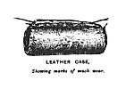
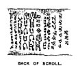
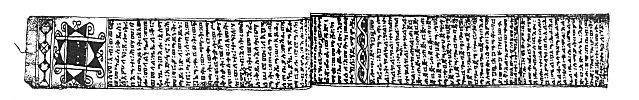
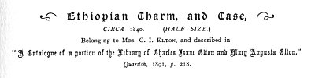
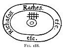
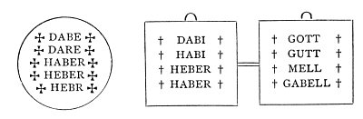

  
[Intangible Textual Heritage](../../index)  [Evil](../index) 
[Index](index)  [Previous](tee14)  [Next](tee16) 

------------------------------------------------------------------------

[Buy this Book at
Amazon.com](https://www.amazon.com/exec/obidos/ASIN/B0024NL744/internetsacredte)

------------------------------------------------------------------------

  
*The Evil Eye*, by Frederick Thomas Elworthy, \[1895\], at Intangible
Textual Heritage

------------------------------------------------------------------------

p. 389

## CHAPTER XI

### CABALISTIC WRITING--MAGICAL FORMULÆ

FROM the protective amulets, specially intended to attract and baffle
the evil eye by being worn on the person, or otherwise conspicuously
displayed, we pass to another class of protectives, depending for their
potency not upon symbolism so much as upon direct invocation of those
powers or deities, typified by the various symbols, we have been
considering. Of this class there are two distinct kinds: first, the
written formulæ of many sorts; and next, the spoken words or actions,
all tending to the same end. Both kinds, moreover, may be either
concealed from view and hearing, or openly displayed.

Of the former, of course, the well-known Jewish phylacteries are the
most obvious examples. Their virtue was supposed to rest in the written
words shut up in the little leather case; their Hebrew name was
*tephillim*, but the name, by which we know them in the New Testament
sufficiently proves that they were amulets. [609](#fn_640)

On Turkish horses and Arab camels at this day are hung little bags
wherein are passages from the Koran; on Neapolitan horses, too, besides
all the

p. 390

hands, horns, and wolf skin, is very frequently a little canvas bag,
containing a prayer to the Madonna, or a verse of Scripture, but always
with the same end in view--the *jettatore* must be countercharmed, in
case the ostensible amulets should fail.

Through the kindness of Mrs. Charles Elton we are able to present a
facsimile of a true phylactery from Abyssinia, where such things are
common at the present day. The language of this charm, though Amharic,
"is not the vernacular, but wholly that of the sacred books, called by
the people Geez." At the present time no Ethiopic scholar in Europe
reads it, and I am fortunate in having at last found a translator. The
full transcription and glossed translation here given are the work of
the Rev. R. Weakley of Alexandria, in whose service is a native Ethiopic
"debterah" or scribe. This man read it easily, and dictated to Mr.
Weakley, who has thus rendered it into English. It appears that these
charms are quite common, and there is a class of disreputable men in
Abyssinia who get their living by concocting and writing them for their
ignorant countrymen.

Mr. Weakley has added some very valuable notes, which reader the whole
much more intelligible, and the present writer desires fully to admit
the obligation, and to express his thanks for this unique rendering into
English of a most curious document--a document proving up to the hilt
all the statements put forward as to the world-wide prevalence, even in
these latter days, of the firm belief in the power of the evil
eye. [610](#fn_641) The eyes themselves

p. 391

 

  [  
Click to enlarge](img/39100.jpg)

  [  
Click to enlarge](img/39101.jpg)

  [  
Click to enlarge](img/39102.jpg)

  [  
Click to enlarge](img/39103.jpg)

FIG 186. ETHIOPIC CHARM AND CASE

 

appear in two places, peeping out at the beginning and at the middle of
the writing.

TRANSLATION

1\. Bè asma^ a\_ve, wa weld, wa ma^nfars ke^doos,  
In the name of the Father and the Son and the Holy Ghost,

2\. Ahade^ Amilack. Salot.  
One God. Prayer.

3\. Bénter hamamer ba^rya\_ wa a\_ye\_net.  
For (against) the sickness of the slave (epilepsy) and the (evil) eye.

4\. Awlo-mela-el: Metowé-mela-el: Corooking. [611](#fn_642)

5\. Bè illoo asmat  
By these names

6\. Adi hinna imhemamer barya wa a\_ye\_net,  
Deliver her from the sickness of the slave (epilepsy) and the (evil)
eye,

7\. A\_ye\_né sella wa a\_ye\_né Za\_r,  
The shadow of the eye and the eye of the Za\_r, [612](#fn_643)

p. 392

8\. Aye\_né sa\_ve wa ganen,  
The eye of men and demons,

9\. Coorsa^t wa felta^t,  
Colic and headache,

10\. Wega^t wa serkseca^t was shentema^t.  
Rending, and sharp pain, and painful micturition.

11\. Ikerba lamatka welata Tekla Haimanoot. [613](#fn_644)  
Keep thy servant, the daughter of Tekla Haimanoot.

12\. Ave\_ isa^t, weld isa^t, wa manfar ke^doos isa^t,  
The Father is fire, the Son is fire, and the Holy Ghost is fire,

13\. Maisaromoo lè aganàt.  
The chain of the demons.

14\. Betaranyou: Bejune: Cashoon: wa Veaifa-satavias  
15. Mashfatanersh: Keeyakee: Borons: Carityanos. [614](#fn_645)

16\. Bè illoo asmat iseromoo lè aganant.  
By these names chain the demons (viz. the following),

17\. Baria wa Legewon, Dabas wa Jinn, Salawogi wa Fagen,  
Baria and Legewon, Dabas and Jinn, Salawogi and Fagen,

Za\_r wa Nagergar: Didk wa chunafa\_r:  
Za\_r and Nagergar: plague and sudden sickness

18\. Mitch wa Mitat; Nahavi wa goosimt:  
Sharp pain and stroke; the hunter and the toucher; [615](#fn_646)

19\. Tavive wa Booda: [616](#fn_647) Googooha
wa tigrida:  
The clever-wicked and sorcerers; choking and wild paroxysm;

p. 393

20\. Fira wa nedad: Magua wa mansho:  
Fever and ague; fever and periodic illness.

21\. Cama iyikravoo imlaila amatea Welata Tekla Haimanoot. [617](#fn_648)  
Lest they approach her, (and fall) on thy servant, the daughter of Tekla
Haimanoot.

22\. Sloter d'ngaze megraray aganent.  
The prayer of fear to Him who rules the demons.

23\. Coltekolcol, Coltekolcol, Coltekolcol, Coltekolcol, Coltekolcol,
Coltekolcol, Coltekolcol. (Repetition in Sevens.)

24\. Hajirji, Hajirji, Hajirji, Hajirji, Hajirji, Hajirji, Hajirji.

25\. Gohajir, Gohajir, Gohajir, Gohajir, Gohajir, Gohajir, Gohajir.

26\. Gorgovajir, Gorgovajir, Gorgovajir, Gorgovajir, Gorgovajir,
Gorgovajir, Gorgovajir. [618](#fn_649)

27\. Bè illoo asmat, Ikaba imdingaza aganant,  
By these names keep her from the terror of the demons,

28\. Baraya wa magaña, Za\_r wa kuraña, Algoom wa Koomaña. [619](#fn_650)  
still birth, evil possession, dumbness and standing sickness.

29\. Adihinna, lamatika, Welata Tekla Haimanoot. [620](#fn_651)  
Deliver her, thy servant, daughter of Tekla Haimanoot.

30\. Wa ga\_zoo zalizoom lé zilmat, firha wa dangaza Dia\_volos
(fikat)  
Then he whose face is covered with darkness, feared and trembled; the
archdevil.

31\. Rigo bihooterlidat besiga Amlacka bè seaol.  
When he saw the mighty one who was born in the flesh (even) God, in
hell.

32\. El; M'el; Jan'el; Ililfarsangana-el; M'el; Telk-el; Walil-el; Z'el;
B'el; M'el. [621](#fn_652)

33\. Fatare samayat wa midir, Adihinnani lamatika Eon Kalloo deerè taviv
wa booda goorgooha wa tigrida, Welata Tekla Haimanoot.

p. 394

The creator of heaven and earth, deliver me, thy servant, from every ill
by the evil, wicked, and sorcerer choking and paroxysm daughter of Tekla
Haimanoot.

Back of Scroll

Continuation: there being not sufficient space below the last line on
the face.

34\. Isma alvo negar Zèyesano lè Egziàwehair.  
Nothing is impossible with God

The figures and letters after the above form a talisman, signifying in
words: "Bind him! Bind him! Bind him!"

Coming back from Abyssinia to England, we subjoin to the above the
following genuine recipes. They are taken from a book which belonged to
the "Conjurer" referred to in note [80](tee04.htm#fn_83), Chap. II. p.
55:--

A Receipt for Ill Wishing

Take a handful of white salt in your right hand and strewe it over the
Backs of all your cattle: begin at the head of the near side and go to
the Tail, and from the Tail to the head up the off side, and as you let
it out of your hand say these words: "As Thy servant Elisha healed the
waters of Jericho by casting salt therein, so I hope to heal this my
Beast: in the Name of God the Father, God the Son, and God the Holy
Ghost. Amen."

If any Cattle is bad, do thus

Cut a bit of hair from between the Ears, a bit from behind each
Shoulder, and a bit from the Stump of the Tail, a little Blood, a
Teaspoonful of Gunpowder, and put the whole into a small Bladder, and
tie the top of it; then get some Green Ashen wood, and make a fire, and
set it on the brand irons, and take the Bladder into your right hand,
and say those words: "I confine all Evil, and all Enemies of mine and my
cattle into the fire for ever, never to hurt me or mine any more for
ever: in the Name of God the Father, God the Son, and God the Holy
Ghost. Amen." Then drop it into the Fire, and let it burn out. Read the
first

p. 395

thirteen verses of the 28th chapter of Duteronomy (*sic*) and no more
every morning before you go to see your Cattle. [621a](#fn_653)

The Ethiopic and the Somerset charms are exactly contemporary. The man
who used the latter was well known to the writer.

The manufacture of mystical writings is a very ancient art; so also is
the teaching how to ascertain propitious days. *Dies fasti* and *ne
fasti* were household words in ancient Rome. Much light is thrown on
this art by a very remarkable papyrus in the British Museum (No. XLVI.
Greek) of about the second century A.D. It came from Egypt, and was
discovered in one of the later tombs. The magic arts practised in the
early years of the Christian era, which Irenæus, Origen, Epiphanius, and
other Fathers lay to the charge of the heretics of their day, are
he-rein laid bare. [622](#fn_654)

Several spells are given in this document for various purposes, amongst
which is one for producing an immediate vision of the god evoked by the
operator. Besides the words of incantation, we are told (p. 5) "in a
brazen cup with oil, anoint your right eye with water taken from a boat
that has been wrecked, and the left \[mixing some\] Coptic *stibium*
with the water. And if you cannot find water from a boat that has been
wrecked, take some from a wicker wherry that has been submerged."

Various charms are given for discovering a thief; for driving away evil
spirits; for compelling a thief

p. 396

to confess; but the chief interest of the papyrus lies in the following
translation:--

Take a sheet of hieratic paper, or a leaden plate, and an iron ring, and
place the ring upon the paper, and mark both inside and out with a pen
the form of a ring. Then having described the circular outline of the
ring, write upon the said outline, inscribing upon the paper the name,
and the characters on the outside, and inside the thing which you wish
not to happen, or that such a man's mind may be bound so as not to do
such and such a thing. Then placing the ring upon its outline which you
have made, and taking up the parts outside the outline, sew up the ring
with thread, so as to completely conceal it, piercing through the
characters with the pen, and when you wish to bind, say: "I bind such an
one not to speak to such an one; let him not resist, let him not
contradict, let him not be able to look me in the face, or to answer me,
but let him be subject to me as long as this ring is buried. And again I
bind his mind, and his senses, his desires, his actions, that he may be
sluggish towards all men . . . and let not such a woman marry such a
man. Common words."

Then taking it to the grave of one untimely dead, dig four fingers deep
and put it in and say "O! departed spirit whosoever thou art . . . I
deliver to thee such an one, that he may not do such a thing." Then
having covered it up depart.--And you will do it best in the waning of
the moon.--The words written within the circle are these (several lines
of Greek): let such a thing not be done, as long as this ring is buried.
Bind it with knots, making strings for that purpose, and thus deposit
it. The ring may also be cast into a disused well, or into the grave of
one untimely dead. And after the characters write also these words below
the ring as a base (five lines of Greek) and the . . . spell which you
also place within.

We give a facsimile (Fig. [187](#img_39700)) of the figure to which the
above refers, taken from Mr. Goodwin's paper; to this for further
particulars the reader is referred. So valuable a relic of the doings of
past ages ought to be well known. [623](#fn_655)

Written charms of this kind, intended to cast a spell as well as to be
protectives, have been found

p. 397

of late in several places. They were first discovered at Athens in 1811
by M. Fauvel. These latter are on leaden tablets, and are called
κατάδεσμα or *diræ*. They professed to bind persons by name precisely

  [  
Click to enlarge](img/39700.jpg)  
FIG. 187.  

in the same manner as is done in that just described, and in the
Ethiopic charm. The whole household of the man named are placed under
the same spell. [624](#fn_656)

Among the gems at the British Museum is a very beautiful little golden
scroll, which was found rolled up in a gold case of precisely the same
shape as the Ethiopian charm. It is of course very minute, being

p. 398

no thicker than an ordinary lead pencil, and about two inches
long. [625](#fn_657) It is marked
Petilia·S·Italy \[C. ·I·5772 M·\].

There does not appear to be anything which may be termed Magical in the
words, but neither is there in passages from Scripture or the Koran worn
at the present day. It is very difficult in most cases to perceive any
connection between the actual words or figures used, and the purpose for
which they are inscribed. This one is based on the ancient Orphic
mysticism. [626](#fn_658) The shape of the case
and general conditions, however, prove it incontestably to have been a
charm for the protection of the wearer.

Frommannd's book is a perfect mine of written magic spells against
fascination, which in many cases 

<table data-align="LEFT">
<colgroup>
<col style="width: 100%" />
</colgroup>
<tbody>
<tr class="odd">
<td data-valign="CENTER"><a href="img/39800.jpg"> 
Click to enlarge</a> 
FIG. 188 
</td>
</tr>
</tbody>
</table>

have to be prepared with such accompaniments as white of egg mixed with
oak charcoal, to be wrapped in paper having Fig. [188](#img_39800) upon
it. A prayer is to be uttered in German gibberish, of which he says:
"Sed modus hic est absurdus, impius, magicus et Diabolicus." In the same
chapter he discusses the meaning of *cauculator*, whence German
*Gauckler*. He inquires whence Okos Bokos? He says: "Agyrtæ vocant *Okos
Bokos*, vocabulis a vero vel ficto nomine Itali cuiusdam." [627](#fn_659) He gives several

p. 399

versions of the well-known *Abracadabra*, which was *amuletum insigne*
not only against hemitritæum, but also against fevers and other
maladies. This famous cabalistic form is of very ancient date, for even
in the third century it was a traditional prescription, set out at
length by Qu. Serenus Ammoniacus, [628](#fn_660) physician to Gordian Junior. [629](#fn_661) He directs it to be written in the
form of an inverted cone, *i.e.* each line of repetition drops the final
letter until A alone remains as the apex. Frommannd (p. 309) says that
this is like the amulet of the Talmudists, worn on their necks against
blindness. [630](#fn_662)

Very closely allied to these writings for the protection of the living,
is the remarkable custom still surviving in Russia, of placing in the
hands of the dead a sort of passport to the nether-world almost
precisely analogous to the "Book of the Dead" of ancient Egypt, see
*ante*, pp. [50](tee04.htm#page_50), [51](tee04.htm#page_51).

At the burial of the late Czar we read:-- [630a](#fn_663)

A prayer was chanted, described as the Prayer of Absolution. It begins
with the words: "Our Lord Jesus Christ, by virtue of His divine grace,
gift, and power given to His holy Disciples and Apostles to bind and
loose the sins of men," and, going on to cite the text in question,
prays Christ to forgive all the sins, including excommunication and
others of the gravest categories, by His love for man and by the prayers
of the Virgin Mary, Mother of God, of the holy Apostles, and of all
saints, This prayer is not merely read, it is likewise printed on a
scroll of

p. 400

paper, which the officiating priest places in the hands of the corpse as
a document enabling him, when wandering about in the spirit world during
the first few days after death, to pass on his solitary way unmolested
by evil spirits.

There is abundant evidence in all lands of the value attached to certain
words, usually written, though they may be merely uttered, to keep off
evil from, or to bring good to, the user. The well-worn "blessed word
Mesopotamia" proves that the idea survives, though allied to crass
ignorance. The many Scriptural or other inscriptions upon old houses
here in England, and perhaps more commonly upon the Continent, or the
passages from the Koran upon the houses of Mahomedans, are much less in
reality the expressions of piety than protective charms against the
origin of every misfortune--the evil eye.

The first words of the Gospel of St. John in any of the Aryan languages
have always been held of great virtue when carried on the person. These
should be written upon virgin parchment, enclosed in a goose quill, an
hour before sunrise on the first Sunday in the year. [631](#fn_664)

Brand (iii. 319) gives a number of similar inscriptions, which were
called *Characts*, but the real collector of them must go to Frommannd
or Delrio. The former quotes Voetius, who says that the beginning of the
fourth Gospel was worn as an amulet from the times of the Apostles
themselves.

For the bite of a mad dog the following words are to be written upon the
crust of a loaf, which, *transfixo pollice*, is to be applied three
several

p. 401

times. The performer is to repeat the Lord's Prayer five times for the
five wounds of Christ, etc. [632](#fn_665)

|     |     |     |     |     |
|-----|-----|-----|-----|-----|
| S   | A   | T   | O   | R   |
| A   | R   | E   | P   | O   |
| T   | E   | N   | E   | T   |
| O   | P   | E   | R   | A   |
| R   | O   | T   | A   | S   |

\[paragraph continues\] For the mad dog's
bite, also: "Hæc verba pani azymo inscripta, Affra, Gaffra, Gaffritan,
etc., prodesse dicuntur."

A curious formula against the plague is--

†. Z. †. D. I. A. †.

These are the initials of a number of prayers and recitations. † = Crux
Christi salva me." Z = "Zelus domus libera me." † = Crux Christi vincit
et regnat," etc. D = "Deus! expelle pestem de loco isto," etc. † = "In
manus tuas Domine commendo animam meam," etc. A = "Ante cœlum et terram
Deus erat," etc. † = "Crux Christi potens est ad expellendam pestem a
loco isto."

Another charm against wounds by sword, cut and thrust (für Hieb und
Stich), is the following, written also on virgin parchment; to be worn
on the person:

† A 3 6 ma 9 † † † etc.

Diese Figur sey in Gott gesegnet, etc.

The following is to be used as an amulet engraved upon a sword: "Hoc qui
dextre velit uti amuleto."

Ich beschwere dich Degen gut,  
Dass du nicht von mir sollst bringen Blut.  
Diss zehl ich dir Schwerd schneid zür Buss  
In den Namen der 3, Gestern, Gafalon, Samalecti, etc. etc.

 

p. 402

Other amulets to be worn against fascination [633](#fn_666) are the following, engraved upon
silver plates.

 

Besides seventeenth-century metal objects of this kind to be worn as
charms, there are a great many written formulæ in Latin and German, or
rather in gibberish, intended both to be worn as amulets in suitable
cases like the three on Fig. [112](tee11.htm#img_25900), and to be
uttered in mumbo-jumbo incantation.

Combinations of figures, too, have long had high reputation as efficient
protectors, particularly those called magic squares-in which certain
numbers are arranged in rows, so that their sum, in whatsoever direction
it may be taken, always produces the same result.

The following common example is perhaps the simplest:--

|     |     |     |
|-----|-----|-----|
| 4   | 3   | 8   |
| 9   | 5   | 1   |
| 2   | 7   | 6   |

It will be seen that addition of any three figures in line will produce
15. Another square taken in the same way makes 72 in each line. This
latter is

p. 403

|     |     |     |     |
|-----|-----|-----|-----|
| 28  | 35  | 2   | 7   |
| 6   | 3   | 32  | 31  |
| 34  | 29  | 8   | 1   |
| 4   | 5   | 30  | 33  |

said to be a veritable amulet, and if your enemy's name be written
underneath it, and you wear this as a charm, his envy will be baffled
and his eye will be powerless against you. [634](#fn_667)

Not only do we find great store set upon the many combinations such as
these, but very wonderful things are done with figures outside the
sphere of magic, so that the ignorant may well have become impressed by
the power of numbers whether expressed in writing or not. The curious
results certain people delight in producing from numbers found in the
Revelation and other sacred books are but proofs of the still surviving
idea that mystery lies in the very numbers themselves. What wonderful
prophecies have been obtained by manipulation of the figures recited in
the Book of Daniel, whereby the end of the world has been so often
foretold, and the "number of the beast" deciphered!

In an article called "In Calabria-Passeggiate," by Caterina
Pignorini-Beri, [635](#fn_668) is a description
of what was seen in a peasant's house:--

In an angle just over the doorway was affixed a horseshoe; above this
were two horns painted, and beneath were placed the two magic numbers
(*numeri fatali*) 8 and 9 to avert the *jettatura*. "Why is this?" I
asked. The old woman replied: "Against

p. 404

the evil eye, Miss" ("*Pel fora fascino, signorina*"). "And what is the
evil eye?" "Ah!" said the old woman, pointing the fore and little
fingers towards the ground:--

"Ah! eight nine, eight nine!" [636](#fn_669)

But why eight nine?"

"Eccellenza, the witches (*streghe*) say *six* and *seven*."

No other explanation was obtainable--perhaps it is the only one that can
be given, owing to the terror of witchcraft which inspires all
southerners, gentle and simple alike. It was indeed a new thing to break
the seven, the famous cabalistic seven, which has pursued humanity for
six thousand years, by (the use of) the next number. In fact the poor
woman had given me something more than others--she had given me a valid
reason for the *fora fascino*, and I could not grumble.

The authoress does not further explain the numbers, but she calls at
another ground-floor tenement (botteguccia), and remarks that the usual
bed was not in the room, nor were the numbers 8 and 9, nor the
horseshoe, nor the painted horns to be seen. The owner was a corporal of
*bersaglieri*, and therefore arrived at a state of new civilisation
which took no note of such things. She concludes her remarks with the
regretful "Ahime! Non tutti sono più calabresi in Calabria!"

In Calabria the words which we should translate by "amulet against the
evil eye" are *fora fascino*. The authoress in another place (p. 66)
speaks of the utterance of the numbers 8 and 9 as a charm *per
allontanare la malia*. So far as the present writer knows, of all
Italians the lottery-loving Calabresi alone furnish an example of the
belief that the mere utterance of particular numbers is a protective
charm.

We all know of the common belief in "the luck in odd numbers." We shall
see it later in the many

p. 405

repetitions of "three times" as to spitting. The old saying "Third time
lucky" is familiar to everybody.

Three has always been looked upon by both Jews and Gentiles as a
specially complete and mystic number. In Scripture, three is given as an
exact measure, while other numbers were used indefinitely, merely to
convey the notion of several, or of a great many, precisely as we now
speak of dozens, scores, or thousands, when we do not even imply any
definite number. There were three great feasts; there were three cities
of refuge, and the number three is several times repeated in connection
with them; three alternatives were offered to David, and two of these
had each the special element of three in it. So we have the three
Christian virtues; three great witnesses; and endless other examples of
the use of three as something more than a mere numeral. The three-sided
triangle is said to be symbolic of deity, pagan as much as Christian.
The Egyptians had triads of divinities, specially worshipped in
particular cities, while the Romans had their Diana Triformis. In the
Hebrides the accounts given in Chap. II. on sun-worship show that each
act was performed three times. We are told [637](#fn_670) that in Ireland a cure for
whooping-cough, called there *chin-cough*, is to pass the child three
times over and under a donkey, certain prayers being said during the
operation. So spitting as a preventive act had to be done three times,
and in the many recited acts to be performed it will be noted how often
"three times" occurs.

It is not merely as an odd number that three

p. 406

of all others was held so specially sacred; yet the preference generally
for odd numbers is not only old but still abiding. As a matter of course
an odd number of eggs are put under a hen. Indeed this is so thoroughly
recognised, that one sees constant advertisements of choice eggs for
sale at so much "per sitting." A sitting of eggs is a number just as
well known as a baker's dozen--thirteen. The notion is that a brood is
certain to be odd in number, and that therefore to set an even number of
eggs is certain waste. The fact, however, remains that as often as not
an even number of chicks are hatched; still the custom is to set
thirteen, and no luck is expected from an even number. Again, military
salutes are always odd in number. A Royal salute is twenty-one guns. The
valiant "Thirteen Club" is in itself an evidence of the belief that if
odd numbers generally are lucky, thirteen sitting down together at a
meal is held to be unlucky--indeed fatal to one of the party. This
notion is said by some to be based upon the experience of past
mortality: that out of thirteen adults, the chances are strong that one
will die during the next year. Moreover, under the well-worn paradox
that exceptions prove the rule, thirteen is a specially unlucky number,
except for the setting of eggs.

Perhaps in these latter days, however, the magic number seven is the one
most used. It is that of the strega in Calabria, and of the white-witch
in England. A seventh son of a seventh son is a born doctor--he has
miraculous powers of healing by touch. [638](#fn_671) "The doctor" is the recognised name
here in

p. 407

\[paragraph continues\] Somerset of a
seventh son; and it is very Commonly held that he should be trained for
one, as a matter of course. Seven has always been a mystical number.
Balaam had seven altars built by the sun-worshipper Balak, three
distinct times. Elisha ordered Naaman to wash in Jordan seven times.
Elijah sent seven times to the top of Carmel. The days of Creation were
seven; seven weeks divided the great feasts. There were seven Churches
in Asia; the great dragon of the Revelation had seven heads; there were
seven angels with seven vials; besides a host of sevens, where perhaps
only an indefinite number was implied. [639](#fn_672) Curiously, too, the common name for
the dormouse is the "seven-sleeper," no doubt from the Seven Sleepers of
Ephesus. [640](#fn_673) We west-country folks
talk of a person who sleeps soundly as a "proper zeb'm-slaiper." [640a](#fn_674) Again, there is a very common belief
that in seven years a man changes every atom in his body, and that each
seventh year of his life is a climacteric in which he has to pass
through dangers physical and moral. The sixty-third year, that is the
ninth septennial period, is the "grand climacteric"--the year specially
perilous to old men. The very common term of leases for seven, fourteen,
or twenty-one years, is believed to originate in the idea that it is
desirable to reconsider conditions and to renew agreements

p. 408

in accordance with the recognised stages of human life.

The numbers of certain days and months are considered fortunate or
otherwise according to certain modes of reckoning, wherein the rationale
or the logic is by no means obvious.

A curious little black-letter book called *A Concordancie of Yeares*, by
Arthur Hopton, 1612, gives a chapter headed "Of the infortunate and
fatall dayes of the yeare," etc., which throws some light upon the
methods of "wise men." It sets out the infortunate days, beginning--

January the 1, 2, 4, 5, 10, [641](#fn_675) 15,
17, 19.

February the 8, 10, and the 17.

March the 15, 16, and the 19.

Aprill the 16 and 21. Not so euill the 7, 8, 10, 20;

and so on through the year. He says that "astrologers will have in every
moone 2 infortunate daies, wherein they recount it most unhappy to begin
or undertake any kind of worldly affaires." These he specifies, and says
"it is therefore very ill to have a child borne in them, for feare of an
euill death." The most unfortunate days of all the year are "January the
3 day, July the 1, October the 7, Aprill the 30, August the 1 and the
3l."

Those in the former table were only "infortunate," while these latter
appear to be fatal.

There were also two days in every month called *Ægri*, *mali* and
*Ægyptiaci*. On *Ægri* "if any fell sick they should hardly or never
escape." On *mali* "evill affections of the Constellations" would
frustrate any kind of work, and *Ægyptiaci* were unlucky

p. 409

because they were so thought by the Egyptians, and because "they do also
note unto us the 10 plagues of Egypt in these verses":--

Sanguis, rana, culex, muscæ parvæ, pecus, ulcus,  
Grando, locustæ, nox, mors, prius orta necant.

We are told how to discover lucky or unlucky days, and that "these
infortunate days were noted alwaies in the Romane Kalender,
notwithstanding ye inhibition of Augustine, saying: 'Calendas
mensium, et dies Ægyptiacos, non observetis.' But yet to satisfie all,
take them in the ensuing verses":--

Armis Gunfe, Dei Kalatos, Adamare dabatur.  
Lixa memor, Constans gelidos, Infancia quosdam.  
Omne limen, Aaron bagis, Concordia laudat.  
Chije linkat, Ei Coequata, Gearcha Lisardus.

\[paragraph continues\] Of the words in
these four lines of gibberish he says that

every two serve for one moneth, the first standing for January. If
therefore you desire to know the first of the two former fatall daies in
any moneth, count so many daies from the beginning of the moneth,
descending, as the: first letter in the first word is distant from A
inclusively, according to the Alphabet, and where that number ends,
there is a fatall day: as in Aprill, L (beginning Lixa) is the 10 letter
in the Alphabet, therefore the 10 day is fatall, and according to the
number of the first letter (in order of ye Alphabet) of the
seco\_d sillable, ye said houre of ye said day is
vehemently to be suspected.

In similar fashion, but "ascending," he shows how to reckon the second
fatal day; but we are not told how or by whom the magic verses were
composed, whereby such discoveries can be made.

------------------------------------------------------------------------

### Footnotes

[389:609](tee15.htm#fr_640) The *tephillah* of
the arm and of the forehead have been already explained ([p.
124](tee06.htm#page_124)), and the Scripture texts recited.

[390:610](tee15.htm#fr_641) In Mr. Theodore
Bent's *Sacred City of the Ethiopians*, pp. 165, 166, are facsimiles of
charms of just this character, and also drawings of several p. 391 leather cases like the one here produced
(Fig. [186](#img_39100)). There is also a learned chapter on
"Inscriptions," by Dr. David Heinrich Müller of Vienna, but none of the
charms are described or translated. In fact it is confidently believed
that at present there is no European now in Europe who can read them, or
the one here lithographed.

[391:611](tee15.htm#fr_642) Mr. Weakley's
Notes. Secret names of God.

[391:612](tee15.htm#fr_643) Za\_r. The
following paragraph is copied from Isenberg's *Amharic Dictionary*,
C.M.S. London, 1841--a very scarce book--under the word "Za\_r," p. 156:
"Name of a sort of demons or genii, to whose influence the people of
Shoa and the Gallas ascribe many changes in man's bodily constitution
and general welfare; such as health and disease, pregnancy, birth,
death, change of weather, success or disappointment in several
undertakings, etc. They believe that these invisible beings are
eighty-eight in number, and divided into two equal parties; forty-four
of them being united under one chief, called Warrar, and the other
forty-four under another chief whose name is Ma\_ma. In Shoa these
Za\_rs are worshipped, we were told, by those who are in the habit of
smoking tobacco, except foreigners; and we persuaded ourselves that that
very custom is, by those Shoa people who followed it, observed in honour
of those imaginary beings. After having witnessed an extraordinary
instance of Za\_rolatry in our own house, where we saw an otherwise
intelligent and respectable woman alternately smoking and praying to the
Za\_rs with great vehemence until she was mad, and then killing a hen
whose brain she ate and became quiet again; after this, I say, we
inquired into several instances where we met with smokers, and found
that they all were worshippers of the Za\_rs. In the state of phrensy,
into which they work themselves by vehemently smoking, praying, and
shaking of the head, their language alters so as to call everything by
names which are known only to the Za\_r worshippers."

[392:613](tee15.htm#fr_644) Tecla Halmanoot,
"one of the most celebrated Abyssinian saints, a native of Shoa, who
flourished in the thirteenth century" (Isenberg's *Amharic Dictionary*).

[392:614](tee15.htm#fr_645) Secret names of
God.

[392:615](tee15.htm#fr_646) i.e. the demon who
hunts to death, and the demon who touches gently to death.

[392:616](tee15.htm#fr_647) *Cf.* "Taviv wa
Booda." The latter word in Isenberg's *Dictionary* is explained "as an
adjective: '*Mad*,' Esp. '*sorcerer*,' generally sorceress.' The
Abyssinian's belief in witchcraft goes so far as to ascribe to its
influence not only every kind and degree of mania, epilepsy, *Chorus
Sti. Viti*, but also several other nervous and febrile
complaints, such as hysteria and delirium, as well as every obstinate
disease for which they know no remedy. Their idea in those cases is,
that either some demon or a Booda must have taken possession of the
patient. The Falashas of Semên and the neighbourhood of Gondar, skilful
artisans in general, and a number of other people possessed with more
than common skill or genius, are looked upon as Boodas. The hyæna is
generally believed to be a transformation of a Booda."

These people have been so called ever since the days of Herodotus, see
*ante*, Chap. 1. [p. 28](tee03.htm#page_28).

[393:617](tee15.htm#fr_648) See note
[613](#fn_644), p. 392.

[393:618](tee15.htm#fr_649) Secret names.

[393:619](tee15.htm#fr_650) Koomaña, "standing
sickness." A disease which works imperceptibly and fatally while the
person affected is "on his feet," *i.e.* going about as if in health.

[393:620](tee15.htm#fr_651) See note
[613](#fn_644), p. 392.

[393:621](tee15.htm#fr_652) Names of God.

[395:621a](tee15.htm#fr_653) These recipes are
inserted here by way of comparison of language with the Abyssinian;
naturally their place would be in the next chapter.

[395:622](tee15.htm#fr_654) The part preserved
is apparently imperfect; but an account of it with a translation
alongside the text is given by Mr. Charles Wycliffe Goodwin for the
Cambridge Antiquarian Society, 1852, in a paper called *Fragment of a
Græco-Egyptian Work upon Magic*.

[396:623](tee15.htm#fr_655) See also R. Stuart
Poole in Smith's *Dict. Bible*, s, v. "Magic," p. 197.

[397:624](tee15.htm#fr_656) Miss L. Macdonald,
*Proc. Soc. Bib. Archæol.* Feb. 1891, p. 162 sq. In the article quoted
from, much information is given about tablets and injurious
inscriptions. The author refers to the papyrus we have mentioned known
as the "Goodwin Cambridge Fragment." There is also a similar "binding"
Latin inscription quoted by Jahn, *Aberglauben*, p. 55

[398:625](tee15.htm#fr_657) The case is
described in *Bullettino dell' Istit. di Corr. Archeol.* 1836, p. 149.

[398:626](tee15.htm#fr_658) On this see Lobeck,
*Aglaophamus*, p. 643. A facsimile of the original inscription with a
translation into literary Greek by Mr. Cecil Smith will be found in an
article by G. Comparetti, in *Journal of Hellenic Studies*, vol. iii. p.
112.

[398:627](tee15.htm#fr_659) Here is a new
etymology of *hocus pocus* for Dr. Murray! For this he p. 399 quotes Voetius, lib. iii. *Dispp*. p. 542.
Ady (*Candle in the Dark*) says that in King James's time a juggler went
about who called himself "the King's Majesty's most excellent *Hocus
Pocus*" (Hone, *Year-Book*, 1832, p. 1477). This seems to match
Frommannd.

[399:628](tee15.htm#fr_660) Frommannd, pp. 45,
307.

[399:629](tee15.htm#fr_661) King, *Gnostics*,
p. 105, gives a translation of the Abracadabra prescription.

[399:630](tee15.htm#fr_662) He gives the Hebrew
formula, and several others written in the same cone shape.

[399:630a](tee15.htm#fr_663) *Daily Telegraph*,
Nov. 20, 1894; also *Spectator*, Nov. 24, 1894, p. 733.

[400:631](tee15.htm#fr_664) Thiers, *Traité des
Superstitions*, i. 414. Freemasons again will recognise something here.

[401:632](tee15.htm#fr_665) Frommannd, p. 46.
We are told (J. Lewes André, in *Reliquary*, October 1893, p. 195) that
this is a Roman charm found at Cirencester on a piece of plaster; it
evidently was well known elsewhere; also that it was written upon the
binding cloth of a woman in the Middle Ages. The Cirencester charm had
the same words differently arranged.

[402:633](tee15.htm#fr_666) *Tract. de Fasc.*
p. 306. Many other cabalistic formulæ will be found.

[403:634](tee15.htm#fr_667) Chambers's
*Cyclopædia*, s.v. "Magic."

[403:635](tee15.htm#fr_668) *Nuova Antologia*,
Roma, Luglio, 1883, p. 71.

[404:636](tee15.htm#fr_669) It is to be noted
as a curious coincidence that the magic square sums up in each line the
same product as these two potent factors--8 x 9 = 72.

[405:637](tee15.htm#fr_670) Le Fanu, *Seventy
Years of Irish Life*, 1894, p. 113

[406:638](tee15.htm#fr_671) Lupton, *Notable
Things*, 1660, bk. ii. p. 25. See also Thiers, *Traité des
Superstitions*, 1679, p. 436.

[407:639](tee15.htm#fr_672) In the *Nineteenth
Century* for October 1894 is an article on "The Seven Lord Roseberys,"
discussed, however, in twelve divisions!

[407:640](tee15.htm#fr_673) For an account of
the Seven Sleepers see Baring-Gould, *Curious Myths of the Middle Ages*,
p. 93. At Ephesus the story is devoutly believed. The writer has been
shown into the cave in which they slept.

[407:640a](tee15.htm#fr_674) "For no sooner did
Abraham pay the eighteenpence than he slept as sound as a sebem-sleeper,
and began to get the good of his victuals."--W. Raymond, "Love and Quiet
Life," *Somerset Idylls*, 1894, p. 206. See *West Somerset Word-Book*.

[408:641](tee15.htm#fr_675) The present writer
has no practical reason to complain of this day, during the many "happy
returns of it" for which he has given thanks.

------------------------------------------------------------------------

[Next: Chapter XII. Spitting, Incantation, and Other Protective Acts.
Pixies](tee16)
