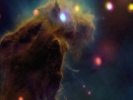

  
[Intangible Textual Heritage](../../index)  [Fortean](../index) 
[Index](index)  [Previous](damn15)  [Next](damn17) 

------------------------------------------------------------------------

[Buy this Book at
Amazon.com](https://www.amazon.com/exec/obidos/ASIN/B0027P8878/internetsacredte)

------------------------------------------------------------------------

  
*The Book of the Damned*, by Charles Fort, \[1919\], at Intangible
Textual Heritage

------------------------------------------------------------------------

### 16

Angels.

Hordes upon hordes of them.

Beings massed like the clouds of souls, or the commingling whiffs of
spirituality, or the exhalations of souls that Doré pictured so often.

It may be that the Milky Way is a composition of stiff, frozen,
finally-static, absolute angels. We shall have data of little Milky
Ways, moving swiftly; or data of hosts of angels, not absolute, or still
dynamic. I suspect, myself, that the fixed stars are really fixed, and
that the minute motions said to have been detected in them are
illusions. I think that the fixed stars are absolutes. Their twinkling
is only the interpretation by an intermediatist state of them. I think
that soon after Leverrier died, a new fixed star was discovered—that, if
Dr. Gray had stuck to his story of the thousands of fishes from one pail
of water, had written upon it, lectured upon it, taken to street
corners, to convince the world that, whether conceivable or not, his
explanation was the only true explanation: had thought of nothing but
this last thing at night and first thing in the morning—his
obituary—another "nova" reported in *Monthly Notices*.

I think that Milky Ways, of an inferior, or dynamic, order, have often
been seen by astronomers. Of course it may be that the phenomena that we
shall now consider are not angels at all. We are simply feeling around,
trying to find out what we can accept. Some of our data indicate hosts
of rotund and complacent tourists in inter-planetary space—but then data
of long, lean, hungry ones. I think that there are, out in
inter-planetary space, Super Tamerlanes at the head of hosts of
celestial ravagers—which have come here and pounced upon civilizations
of the past, cleaning them up all but their bones, or temples and
monuments—for which later historians have invented exclusionist
histories. But if something

p. 217

now has a legal right to us, and can enforce its proprietorship, they've
been warned off. It's the way of all exploitation. I should say that
we're now under cultivation: that we're conscious of it, but have the
impertinence to attribute it all to our own nobler and higher instincts.

Against these notions is the same sense of finality that opposes all
advance. It's why we rate acceptance as a better adaptation than belief.
Opposing us is the strong belief that, as to interplanetary phenomena,
virtually everything has been found out. Sense of finality and illusion
of homogeneity. But that what is called advancing knowledge is violation
of the sense of blankness.

A drop of water. Once upon a time water was considered so homogeneous
that it was thought of as an element. The microscope—and not only that
the supposititiously elementary was seen to be of infinite diversity,
but that in its protoplasmic life there were new orders of beings.

Or the year 1491—and a European looking westward over the ocean—his
feeling that that suave western droop was unbreakable; that gods of
regularity would not permit that smooth horizon to be disturbed by
coasts or spotted with islands. The unpleasantness of even contemplating
such a state—wide, smooth west, so clean against the sky—spotted with
islands—geographic leprosy.

But coasts and islands and Indians and bison, in the seemingly vacant
west: lakes, mountains, rivers—

One looks up at the sky: the relative homogeneity of the relatively
unexplored: one thinks of only a few kinds of phenomena. But the
acceptance is forced upon me that there are modes and modes and modes of
inter-planetary existence: things as different from planets and comets
and meteors as Indians are from bison and prairie dogs: a
super-geography—or celestiography—of vast stagnant regions, but also of
Super-Niagaras and Ultra-Mississippis: and a super-sociology—voyagers
and tourists and ravagers: the hunted and the hunting: the
super-mercantile, the super-piratic, the super-evangelical.

Sense of homogeneity, or our positivist illusion of the unknown—and the
fate of all positivism.

Astronomy and the academic.

p. 218

Ethics and the abstract.

The universal attempt to formulate or to regularize—an attempt that can
be made only by disregarding or denying.

Or all things disregard or deny that which will eventually invade and
destroy them—

Until comes the day when some one thing shall say, and enforce upon
Infinitude:

"Thus far shalt thou go: here is absolute demarcation."

The final utterance:

"There is only I."

In the *Monthly Notices of the R.A.S.*, 11-48, there is a letter from
the Rev. W. Read:

That, upon the 4th of September, 1851, at 9:30 A.M., he had seen a host
of self-luminous bodies, passing the field of his telescope, some slowly
and some rapidly. They appeared to occupy a zone several degrees in
breadth. The direction of most of them was due east to west, but some
moved from north to south. The numbers were tremendous. They were
observed for six hours.

Editor's note:

"May not these appearances be attributed to an abnormal state of the
optic nerves of the observer?"

In *Monthly Notices*, 12-38, Mr. Read answers that he had been a
diligent observer, with instruments. of a superior order, for about 28
years—"but I have never witnessed such an appearance before." As to
illusion he says that two other members of his family had seen the
objects.

The Editor withdraws his suggestion.

We know what to expect. Almost absolutely—in an existence that is
essentially Hibernian—we can predict the past—that is, look over
something of this kind, written in 1851, and know what to expect from
the Exclusionists later. If Mr. Read saw a migration of dissatisfied
angels, numbering millions, they must merge away, at least subjectively,
with commonplace terrestrial phenomena—of course disregarding Mr. Read's
probable familiarity, of 28 years’ duration, with the commonplaces of
terrestrial phenomena.

*Monthly Notices*, 12-183:

Letter from Rev. W. R. Dawes:

p. 219

That he had seen similar objects—and in the month of September—that they
were nothing but seeds floating in the air.

In the *Report of the British Association*, 1852-235, there is a
communication from Mr. Read to Prof. Baden-Powell:

That the objects that had been seen by him and by Mr. Dawes were not
similar. He denies that he had seen seeds floating in the air. There had
been little wind, and that had come from the sea, where seeds would not
be likely to have origin. The objects that he had seen were round and
sharply defined, and with none of the feathery appearance of
thistledown. He then quotes from a letter from C. B. Chalmers, F.R.A.S.,
who had seen a similar stream, a procession, or migration, except that
some of the bodies were more elongated—or lean and hungry—than globular.

He might have argued for sixty-five years. He'd have impressed nobody—of
importance. The super-motif, or dominant, of his era, was Exclusionism,
and the notion of seeds in the air assimilates—with due disregards—with
that dominant.

Or pageantries here upon our earth, and things looking down upon us—and
the Crusades were only dust clouds, and glints of the sun on shining
armor were only particles of mica in dust clouds. I think it was a
Crusade that Read saw—but that it was right, relatively to the year
1851, to say that it was only seeds in the wind, whether the wind blew
from the sea or not. I think of things that were luminous with religious
zeal, mixed up, like everything else in Intermediateness, with black
marauders and from gray to brown beings of little personal ambitions.
There may have been a Richard Coeur de Lion, on his way to right wrongs
in Jupiter. It was right, relatively to 1851, to say that he was a seed
of a cabbage.

Prof. Coffin, U.S.N. (*Jour. Frank. Inst.*, 88-151):

That, during the eclipse of August, 1869, he had noted the passage,
across his telescope, of several bright flakes resembling thistleblows,
floating in the sunlight. But the telescope was so focused that, if
these things were distinct, they must have been so far away from this
earth that the difficulties of orthodoxy remain as great. one way or
another, no matter what we think they were—

p. 220

They were "well-defined," says Prof. Coffin.

Henry Waldner (*Nature*, 5-304):

That, April 27, 1863, he had seen great numbers of small, shining bodies
passing from west to east. He had notified Dr. Wolf, of the Observatory
of Zurich, who "had convinced himself of this strange phenomenon." Dr.
Wolf had told him that similar bodies had been seen by Sig. Capocci, of
the Capodimonte Observatory, at Naples, May 11, 1845.

The shapes were of great diversity—or different aspects of similar
shapes?

Appendages were seen upon some of them.

We are told that some were star-shaped, with transparent appendages.

I think, myself, it was a Mohammed and his Hegira. May have been only
his harem. Astonishing sensation: afloat in space with ten million wives
around one. Anyway, it would seem that we have considerable advantage
here, inasmuch as seeds are not in season in April—but the pulling back
to earth, the bedraggling by those sincere but dull ones of some time
ago. We have the same stupidity—necessary, functioning stupidity—of
attribution of something that was so rare that an astronomer notes only
one instance between 1845 and 1863, to an everyday occurrence—

Or Mr. Waldner's assimilative opinion that he had seen only ice
crystals.

Whether they were not very exclusive veils of a super-harem, or planes
of a very light material, we have an impression of star-shaped things
with transparent appendages that have been seen in the sky.

Hosts of small bodies—black, this time—that were seen by the astronomers
Herrick, Buys-Ballot, and De Cuppis (*L’Année Scientifique*, 1860-25);
vast numbers of bodies that were seen by M. Lamey, to cross the moon
(*L’Année Scientifique*, 1874-62); another instance of dark ones;
prodigious number of dark, spherical bodies reported by Messier, June
17, 1777 (Arago, *Œuvres*, 9-38); considerable number of luminous bodies
which appeared to move out from the sun, in diverse directions; seen at
Havana, during eclipse of the sun, May 15, 1836, by Prof. Auber (Poey);
M. Poey cites

p. 221

a similar instance, of Aug. 3, 1886; M. Lotard's opinion that they were
birds (*L’Astronomie*, 1886-391); large number of small bodies crossing
disk of the sun, some swiftly, some slowly; most of them globular, but
some seemingly triangular, and some of more complicated structure; seen
by M. Trouvelet, who, whether seeds, insects, birds, or other
commonplace things, had never seen anything resembling these forms
(*L’Année Scientifique*, 1885-8); report from the Rio de Janeiro
Observatory, of vast numbers of bodies crossing the sun, some of them
luminous and some of them dark, from some time in December, 1875, until
Jan. 22, 1876 (*La Nature*, 1876-384).

Of course, at a distance, any form is likely to look round or roundish:
but we point out that we have notes upon the seeming of more complex
forms. In *L’Astronomie*, 1886-70, is recorded M. Briguiere's
observation, at Marseilles, April 15 and April 25, 1883, upon the
crossing of the sun by bodies that were irregular in form. Some of them
moved as if in alignment.

Letter from Sir Robert Inglis to Col. Sabine (*Rept. Brit. Assoc.*,
1849-17)

That, at 3 P.M., Aug. 8, 1849, at Gais, Switzerland, Inglis had seen
thousands and thousands of brilliant white objects, like snowflakes in a
cloudless sky. Though this display lasted about twenty-five minutes, not
one of these seeming snowflakes was seen to fall. Inglis says that his
servant "fancied" that he had seen something like wings on
these—whatever they were. Upon page 18, of the Report, Sir John Herschel
says that, in 1845 or 1846, his attention had been attracted by objects
of considerable size, in the air, seemingly not far away. He had looked
at them through a telescope. He says that they were masses of hay, not
less than a yard or two in diameter. Still there are some circumstances
that interest me. He says that, though no less than a whirlwind could
have sustained these masses, the air about him was calm. "No doubt wind
prevailed at the spot, but there was no roaring noise." None of these
masses fell within his observation or knowledge. To walk a few fields
away and find out more would seem not much to expect from a man of
science, but it is one of our superstitions, that such a seeming trifle
is just what—by the Spirit of an Era,

p. 222

we'll call it—one is not permitted to do. If those things were not
masses of hay, and if Herschel had walked a little and found out, and
had reported that he had seen strange objects in the air—that report, in
1846, would have been as misplaced as the appearance of a tail upon an
embryo still in its gastrula era. I have noticed this inhibition in my
own case many times. Looking back—why didn't I do this or that little
thing that would have cost so little and have meant so much? Didn't
belong to that era of my own development.

*Nature*, 22-64:

That, at Kattenau, Germany, about half an hour before sunrise, March 22,
1880, "an enormous number of luminous bodies rose from the horizon, and
passed in a horizontal direction from east to west." They are described
as having appeared in a zone or belt. "They shone with a remarkably
brilliant light."

So they've thrown lassos over our data to bring them back to earth. But
they're lassos that cannot tighten. We can't pull out of them: we may
step out of them, or lift them off. Some of us used to have an
impression of Science sitting in calm, just judgment: some of us now
feel that a good many of our data have been lynched. If a Crusade,
perhaps from Mars to Jupiter, occur in the autumn—"seeds." If a Crusade
or outpouring of celestial vandals is seen from this earth in the
spring—"ice crystals." If we have record of a race of aerial beings,
perhaps with no substantial habitat, seen by someone in India—"locusts."

This will be disregarded:

If locusts fly high, they freeze and fall in thousands.

*Nature*, 47-581:

Locusts that were seen in the mountains of India, at a height of 12,750
feet—"in swarms and dying by thousands."

But no matter whether they fly high or fly low, no one ever wonders
what's in the air when locusts are passing overhead, because of the
falling of stragglers. I have especially looked this matter up—no
mystery when locusts are flying overhead—constant falling of stragglers.

*Monthly Notices*, 30-135:

p. 223

"An unusual phenomenon noticed by Lieut. Herschel, Oct. 17 and 18, 1870,
while observing the sun, at Bangalore, India."

Lieut. Herschel had noticed dark shadows crossing the sun—but away from
the sun there were luminous, moving images. For two days bodies passed
in a continuous stream, varying in size and velocity.

The Lieutenant tries to explain, as we shall see, but he says:

"As it was, the continuous flight, for two whole days, in such numbers,
in the upper regions of the air, of beasts that left no stragglers, is a
wonder of natural history, if not of astronomy."

He tried different focusing—he saw wings—perhaps he saw planes. He says
that he saw upon the objects either wings or phantom-like appendages.

Then he saw something that was so bizarre that, in the fullness of his
nineteenth-centuriness, he writes:

"There was no longer doubt: they were locusts or flies of some sort."

One of them had paused.

It had hovered.

Then it had whisked off.

The Editor says that at that time "countless locusts had descended upon
certain parts of India."

We now have an instance that is extraordinary in several
respects—super-voyagers or super-ravagers; angels, ragamuffins,
crusaders, emigrants, aeronauts, or aerial elephants, or bison or
dinosaurs—except that I think the thing had planes or wings—one of them
has been photographed. It may be that in the history of photography no
more extraordinary picture than this has ever been taken.

*L’Astronomie*, 1885-347:

That, at the Observatory of Zacatecas, Mexico, Aug. 12, 1883, about
2,500 meters above sea level, were seen a large number of small luminous
bodies, entering upon the disk of the sun. M. Bonilla telegraphed to the
Observatories of the City of Mexico and of Puebla. Word came back that
the bodies were not visible there. Because of this parallax, M. Bonilla
placed the bodies "relatively near the earth." But when we find out what
he called "relatively

p. 224

near the earth"—birds or bugs or hosts of a Super-Tamerlane or army of a
celestial Richard Coeur de Lion—our heresies rejoice anyway. His
estimate is "less distance than the moon."

One of them was photographed. See *L’Astronomie*, 1885-349. The
photograph shows a long body surrounded by indefinite structures, or by
the haze of wings or planes in motion.

*L’Astronomie*, 1887-66;

Signor Ricco, of the Observatory of Palermo, writes that, Nov. 30, 1880,
at 8:30 o'clock in the morning, he was watching the sun, when he saw,
slowly traversing its disk, bodies in two long, parallel lines, and a
shorter, parallel line. The bodies looked winged to him. But so large
were they that he had to think of large birds. He thought of cranes.

He consulted ornithologists, and learned that the configuration of
parallel lines agrees with the flight-formation of cranes. This was in
1880: anybody now living in New York City, for instance, would tell him
that also it is a familiar formation of aeroplanes. But, because of data
of focus and subtended angles, these beings or objects must have been
high.

Sig. Ricco argues that condors have been known to fly three or four
miles high, and that heights reached by other birds have been estimated
at two or three miles. He says that cranes have been known to fly so
high that they have been lost to view.

Our own acceptance, in conventional terms, is that there is not a bird
of this earth that would not freeze to death at a height of more than
four miles: that if condors fly three or four miles high, they are birds
that are especially adapted to such altitudes.

Sig. Ricco's estimate is that these objects or beings or cranes must
have been at least five and a half miles high.

------------------------------------------------------------------------

[Next: 17](damn17)
