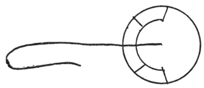

  
[Intangible Textual Heritage](../../index)  [Fortean](../index.md) 
[Index](index)  [Previous](damn21)  [Next](damn23.md) 

------------------------------------------------------------------------

[Buy this Book at
Amazon.com](https://www.amazon.com/exec/obidos/ASIN/B0027P8878/internetsacredte.md)

------------------------------------------------------------------------

  
*The Book of the Damned*, by Charles Fort, \[1919\], at Intangible
Textual Heritage

------------------------------------------------------------------------

### 22

*Journal of the Royal Meteorological Society*, 1-157:

Extract from the log of the bark *Lady of
the Lake*, by Capt. F. W. Banner:

Communicated by R. H. Scott, F.R.S.:

That, upon the 22nd of March, 1870, at Lat. 5° 47´ N., Long. 27° 52´ W.,
the sailors of the *Lady of the Lake* saw a remarkable object, or
"cloud," in the sky. They reported to the captain.

According to Capt. Banner, it was a cloud of circular form, with an
included semicircle divided into four parts, the central dividing shaft
beginning at the center of the circle and extending far outward, and
then curving backward.

p. 280

Geometricity and complexity and stability of form: and the small
likelihood of a cloud maintaining such diversity of features, to say
nothing of appearance of organic form.

The thing traveled from a point at about 20 degrees above the horizon to
a point about 80 degrees above. Then it settled down to the northeast,
having appeared from the south, southeast.

Light gray in color, or it was cloud-color.

"It was much lower than the other clouds."

And this datum stands out:

That, whatever it may have been, it traveled against the wind. "It came
up obliquely against the wind, and finally settled down right in the
wind's eye."

For half an hour this form was visible. When it did finally disappear
that was not because it disintegrated like a cloud, but because it was
lost to sight in the evening darkness.

Capt. Banner draws the following diagram:

 

------------------------------------------------------------------------

[Next: 23](damn23.md)
