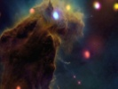

  
[Intangible Textual Heritage](../../index)  [Fortean](../index.md) 
[Index](index)  [Previous](damn23)  [Next](damn25.md) 

------------------------------------------------------------------------

[Buy this Book at
Amazon.com](https://www.amazon.com/exec/obidos/ASIN/B0027P8878/internetsacredte.md)

------------------------------------------------------------------------

  
*The Book of the Damned*, by Charles Fort, \[1919\], at Intangible
Textual Heritage

------------------------------------------------------------------------

### 24

We shall have an outcry of silences. If a
single instance of anything be disregarded by a System—our own attitude
is that a single instance is a powerless thing. Of course our own method
of agreement of many instances is not a real method. In Continuity, all
things must have resemblances with all other things. Anything has any
quasi-identity you please. Some time ago conscription was assimilated
with either autocracy or democracy with equal facility. Note the need
for a dominant to correlate to. Scarcely anybody said simply that we
must have conscription: but that we must have conscription, which
correlates with democracy, which was taken as a base, or something
basically desirable. Of course between autocracy and democracy nothing
but false demarcation can be drawn. So I can conceive of no subject

p. 287

upon which there should be such poverty as a single instance, if
anything one pleases can be whipped into line. However, we shall try to
be more nearly real than the Darwinites who advance concealing
coloration as Darwinism, and then drag in proclaiming luminosity, too,
as Darwinism. I think the Darwinites had better come in with us as to
the deep-sea fishes—and be sorry later, I suppose. It will be amazing or
negligible to read all the instances now to come of things that have
been seen in the sky, and to think that all have been disregarded. My
own opinion is that it is not possible, or very easy, to disregard them,
now that they have been brought together—but that, if prior to about
this time we had attempted such an assemblage, the Old Dominant would
have withered our typewriter—as it is the letter "e" has gone back on
us, and the "s" is temperamental.

"Most extraordinary and singular phenomenon," North Wales, Aug. 26,
1894; a disk from which projected an orange-colored body that looked
like "an elongated flatfish," reported by Admiral Ommanney (*Nature*,
50-524); disk from which projected a hook-like form, India, about 1838;
diagram of it given; disk about size of the moon, but brighter than the
moon; visible about twenty minutes; by G. Pettit, in Prof.
Baden-Powell's Catalogue (*Rept. Brit. Assoc.*, 1849); very brilliant
hook-like form, seen in the sky at Poland, Trumbull Co., Ohio, during
the stream of meteors, of 1833; visible more than an hour: large
luminous body, almost stationary "for a time"; shaped like a square
table; Niagara Falls, Nov. 13, 1833 (*Amer. Jour. Sci.*, I-25-391);
something described as a bright white cloud, at night, Nov. 3, 1886, at
Hamar, Norway; from it were emitted brilliant rays of light; drifted
across the sky; "retained throughout its original form" (*Nature*, Dec.
16, 1886-158); thing with an oval nucleus, and streamers with dark bands
and lines very suggestive of structure; New Zealand, May 4, 1888
(*Nature*, 42-402); luminous object, size of full moon, visible an hour
and a half, Chili, Nov. 5, 1883 (*Comptes Rendus*, 103-682); bright
object near sun, Dec. 21, 1882 (*Knowledge*, 3-13); light that looked
like a great flame, far out at sea, off Ryook Phyoo, Dec. 2, 1845
(*London Roy. Soc. Proc.*, 5-627); something like a gigantic trumpet,
suspended, vertical, oscillating gently, visible five or six minutes,
length estimated

p. 288

at 425 feet, at Oaxaca, Mexico, July 6, 1874 (*Sci. Am. Sup.*, 6-2365);
two luminous bodies, seemingly united, visible five or six minutes, June
3, 1898 (*La Nature*, 1898-I-127); thing with a tail, crossing moon,
transit half a minute, Sept. 26, 1870 (London *Times*, Sept. 30, 1870);
object four or five times size of moon, moving slowly across sky, Nov.
1, 1885, near Adrianople (*L’Astronomie*, 1886-309); large body, colored
red, moving slowly, visible 15 minutes, reported by Coggia, Marseilles,
Aug. 1, 1871 (*Chem. News*, 24-193); details of this observation, and
similar observation by Guillemin, and other instances by de Fonville
(*Comptes Rendus*, 73-297, 755); thing that was large and that was
stationary twice in seven minutes, Oxford, Nov. 19, 1847; listed by Lowe
(*Rec. Sci.*, 1-136); grayish object that looked to be about three and a
half feet long, rapidly approaching the earth at Saarbruck, April I,
1826; sound like thunder; object expanding like a sheet (*Am. Jour.
Sci.*, 1-26133; *Quar. Jour. Roy. Inst.*, 24-488); report by an
astronomer, N. S. Drayton, upon an object duration of which seemed to
him extraordinary; duration three-quarters of a minute, Jersey City,
July 6, 1882 (*Sci. Amer.*, 47-53); object like a comet, but with proper
motion of to degrees an hour; visible one hour; reported by Purine and
Glancy from the Cordoba Observatory, Argentina, March 14, 1916 (*Sci.
Amer.*, 115-493); something like a signal light, reported by Glaisher,
Oct. 4, 1844; bright as Jupiter, "sending out quick flickering waves of
light" (*Year Book of Facts*, 1845-278) .

I think that with the object known as Eddie's "comet" passes away the
last of our susceptibility to the common fallacy of personifying. It is
one of the most deep-rooted of positivist illusions—that people are
persons. We have been guilty too often of spleens and spites and
ridicules against astronomers, as if they were persons, or final
unities, individuals, completenesses, or selves—instead of indeterminate
parts. But, so long as we remain in quasi-existence, we can cast out
illusion only with some other illusion, though the other illusion may
approximate higher to reality. So we personify no more—but we
super-personify. We now take into full acceptance our expression that
Development is an Autocracy of Successive Dominants—which are not
final—but which approximate higher to

p. 289

individuality or self-ness, than do the human tropisms that
irresponsibly correlate to them.

Eddie reported a celestial object, from the Observatory at Grahamstown,
South Africa. It was in 1890. The New Dominant was only heir presumptive
then, or heir apparent but not obvious. The thing that Eddie reported
might as well have been reported by a night watchman, who had looked up
through an unplaced sewer pipe.

It did not correlate.

The thing was not admitted to *Monthly Notices*. I think myself that if
the Editor had attempted to let it in—earthquake—or a mysterious fire in
his publishing house.

The Dominants are jealous gods.

In *Nature*, presumably a vassal of the new god, though of course also
plausibly rendering homage to the old, is reported a comet-like body, of
Oct. 27, 1890, observed at Grahamstown, by Eddie. It may have looked
comet-like, but it moved too degrees while visible, or one hundred
degrees in three-quarters of an hour. See *Nature*, 43-89, 90.

In *Nature*, 44-519, Prof. Copeland describes a similar appearance that
he had seen, Sept. to, 1891. Dreyer says (*Nature*, 44-541) that he had
seen this object at the Armagh Observatory. He likens it to the object
that was reported by Eddie. It was seen by Dr. Alexander Graham Bell,
Sept. 11, 1891, in Nova Scotia.

But the Old Dominant was a jealous god.

So there were different observations upon something that was seen in
November, 1883. These observations were Philistines in 1883. In the
*Amer. Met. Jour.*, 1-110, a correspondent reports having seen an object
like a comet, with two tails, one up and one down, Nov. 10 or 12, 1883.
Very likely this phenomenon should be placed in our expression upon
torpedo-shaped bodies that have been seen in the sky—our data upon
dirigibles, or super-Zeppelins—but our attempted classifications are far
from rigorous—or are mere gropes. In the *Scientific American*, 50-40, a
correspondent writes from Humacao, Porto Rico, that, Nov. 21, 1883, he
and several other—persons—or persons, as it were—had seen a majestic
appearance, like a comet. Visible three successive nights: disappeared
then. The

p. 290

\[paragraph continues\] Editor says that
he can offer no explanation. If accepted, this thing must have been
close to the earth. If it had been a comet, it would have been seen
widely, and the news would have been telegraphed over the world, says
the Editor. Upon page 97 of this volume of the *Scientific American*, a
correspondent writes that, at Sulphur Springs, Ohio, he had seen "a
wonder in the sky," at about the same date. It was torpedo-shaped, or
something with a nucleus, at each end of which was a tail. Again the
Editor says that he can offer no explanation: that the object was not a
comet. He associates it with the atmospheric effects general in 1883.
But it will be our expression that, in England and Holland, a similar
object was seen in November, 1882.

In the *Scientific American*, 40-294, is published a letter from Henry
Harrison, of Jersey City, copied from the New York *Tribune:* that upon
the evening of April 13, 1879, Mr. Harrison was searching for Brorsen's
comet, when he saw an object that was moving so rapidly that it could
not have been a comet. He called a friend to look, and his observation
was confirmed. At two o'clock in the morning this object was still
visible. In the *Scientific American Supplement*, 7-2885, Mr. Harrison
disclaims sensationalism, which he seems to think unworthy, and gives
technical details: he says that the object was seen by Mr. J. Spencer
Devoe, of Manhattanville.

------------------------------------------------------------------------

[Next: 25](damn25.md)
