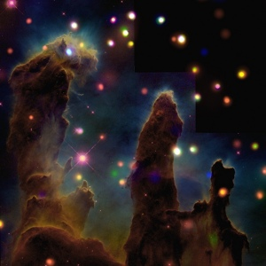

  
[Intangible Textual Heritage](../../index)  [Fortean](../index) 

------------------------------------------------------------------------

[Buy this Book at
Amazon.com](https://www.amazon.com/exec/obidos/ASIN/B0027P8878/internetsacredte)

------------------------------------------------------------------------

<table width="75%">
<colgroup>
<col style="width: 50%" />
<col style="width: 50%" />
</colgroup>
<tbody>
<tr class="odd">
<td width="50%" data-valign="TOP"></td>
<td width="50%" data-valign="CENTER"><h1 id="the-book-of-the-damned" data-align="CENTER">The Book of the Damned</h1>
<h2 id="by-charles-fort" data-align="CENTER">by Charles Fort</h2>
<h4 id="section" data-align="CENTER">[1919]</h4></td>
</tr>
</tbody>
</table>

------------------------------------------------------------------------

[Contents](#contents)    [Start Reading](damn00)    [Page
Index](pageidx)    [Text \[Zipped\]](damn.txt.gz)

------------------------------------------------------------------------

|                                                                                                                           |
|---------------------------------------------------------------------------------------------------------------------------|
|  |

This is the first of Fort's four books. Fort discusses numerous
unexplained phenomena, many of which would today be categorized as UFOs.
Fort gives examples of many other strange happenings, rains of fish,
blood, insects, and so on.

Fort attempts, almost tongue in cheek, to construct a cosmology which
could explain these phenomena. He proposes that the Earth's gravity only
extends about 20 miles out, and that there are vast 'lands in the sky'
passing above us, normally unseen. Some of these lands trap
objects,--the 'super-Sargasso,'--some are shaped like giant spindles or
wheels, and others are huge sentient beings.

If there is life in the universe, how come we aren't visited by aliens?
This is called the Fermi Paradox, proposed by Enrico Fermi in the 1950s.
Fort gives a preemptive solution on [page 163](damn12.htm#page_163),
where he states, famously, 'I think we're property.' Fort's solution is
that earth was warred over in the distant past, and now is under the
control of 'something'--"all other warned off." The reason that we never
meet our 'owners' is that they have no interest in talking with their
'livestock.'

------------------------------------------------------------------------

 [Title Page](damn00)  
[1](damn01)  
[2](damn02)  
[3](damn03)  
[4](damn04)  
[5](damn05)  
[6](damn06)  
[7](damn07)  
[8](damn08)  
[9](damn09)  
[10](damn10)  
[11](damn11)  
[12](damn12)  
[13](damn13)  
[14](damn14)  
[15](damn15)  
[16](damn16)  
[17](damn17)  
[18](damn18)  
[19](damn19)  
[20](damn20)  
[21](damn21)  
[22](damn22)  
[23](damn23)  
[24](damn24)  
[25](damn25)  
[26](damn26)  
[27](damn27)  
[28](damn28)  
