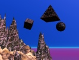

  
[Intangible Textual Heritage](../../index)  [Fortean](../index.md) 
[Index](index)  [Previous](land03)  [Next](land05.md) 

------------------------------------------------------------------------

[Buy this Book at
Amazon.com](https://www.amazon.com/exec/obidos/ASIN/B0027P8882/internetsacredte.md)

------------------------------------------------------------------------

  
*New Lands*, by Charles Fort, \[1923\], at Intangible Textual Heritage

------------------------------------------------------------------------

p. 333

### 4

Nevertheless I sometimes doubt that
astronomers represent especial incompetence. They remind me too much of
uplifters and grocers, philanthropists, expert accountants, makers of
treaties, characters in international conferences, psychic researchers,
biologists. The astronomers seem to me about as capitalists seem to
socialists, and about as socialists seem to capitalists, or about as
Presbyterians seem to Baptists; as Democrats seem to Republicans, or as
artists of one school seem to artists of another school. If the basic
fallacies, or the absence of base, in every specialization of thought
can be seen by the units of its opposition, why then we see that all
supposed foundations in our whole existence are myths, and that all
discussion and supposed progress are the conflicts of phantoms and the
overthrow of old delusions by new delusions. Nevertheless I am searching
for some wider expression that will rationalize all of us—conceiving
that what we call irrationality is our view of parts and functions out
of relation to an underlying whole; an underlying something that is
working out its development in terms of planets and acids and bugs,
rivers and labor unions and cyclones, politicians and islands and
astronomers. Perhaps we conceive of an underlying nexus in which all
things, in our existence, are different manifestations—torn by its
hurricanes and quaked by the struggles of Labor against Capital—and
then, for the sake of balance, requiring relaxations. It has its rougher
hoaxes, and some of the apes and some of the priests, and philosophers
and wart hogs are nothing short of horse play; but the astronomers are
the ironies of its less peasant-like moments—or the deliciousness of
pretending to know whether a far-away star is approaching or receding,
and at the same time exactly predicting when a nearby comet, which is
receding, will complete its approach. This is cosmic playfulness; such
pleasantries enable Existence to bear its catastrophes. Shattered comets
and sickened nations

p. 334

and the hydrogenic anguishes of the sun—and there must be astronomers
for the sake of relaxations.

It will be important to us that the astronomers shall not be less
unfortunate in their pronouncements upon motions of the stars than they
have turned out to be in other respects. Especially disagreeable to us
is the doctrine that stars are variable because dark companies revolve
around them; also we prefer to find that nothing fit for somewhat
matured minds has been determined as to stars with light companions that
encircle them, or revolve with them. If silence be the only true
philosophy, and if every positive assertion be a myth, we should easily
find requital for our negative preferences.

Prof. Otto Struve was one of the highest of astronomic authorities, and
the faithful attribute triumphs to him. Upon March 19, 1873, Prof.
Struve announced that he had discovered a companion to the star Procyon.
That was an interesting observation, but the mere observation was not
the triumph. Some time before, Prof. Auwers, as credulous, if not
jocular, as Newton and Leverrier and Adams, had computed the orbit of a
hypothetic companion of Procyon's. Upon a chart of the stars, he had
drawn a circle around Procyon. This orbit was calculated in
gravitational terms, and a general theme of ours is that all such
calculations are only ideal, and relate no more to stars and planets or
anything else than do the spotless theories of uplifters to events that
occur as spots in the one wide daub of existence. Specifically we wish
to discredit this "triumph" of Struve's and Auwers’, but in general we
continue our expression that all uses of the calculus of celestial
mechanics are false applications, and that this subject is for æsthetic
enjoyment only, and has no place in the science of astronomy, if anybody
can think that there is such a science. So, after great labor, or after
considerable enjoyment, Auwers drew a circle around Procyon, and
announced that that was the orbit of a companion-star. Exactly at the
point in this circle where it "should" be, upon March 19, 1873, Struve
saw the point of light which, it may be accepted, sooner or later
someone would see. According to Agnes Clerke (*System of the Stars*, p.
173) over and over Struve watched the point of light, and convinced
himself that it moved as it "should" move, exactly in the calculated
orbit. In *Reminiscences of an Astronomer*,

p. 335

p, 138, Prof. Newcomb tells the story. According to him, an American
astronomer then did more than confirm Struve's observations: he not only
saw but exactly measured the supposed companion.

A defect was found between the lenses of Struve's telescope: it was
found that this telescope showed a similar "companion," about 10" from
every large star. It was found that the more than "confirmatory"
determinations by the American astronomer had been upon "a long
well-known star." (Newcomb)

Every astronomic triumph is a bright light accompanied by an imbecility,
which may for a while make it variable with diminishments, and then be
unnoticed. Priestcrafts are not merely tyrannies: they're necessities.
There must be more reassuring ways of telling this story. The good
priest J. E. Gore (*Studies in Astronomy*, p. 104) tells it safely—not a
thing except that, in the year 1873, a companion of Procyon's was, by
Struve, "strongly suspected." Positive assurances of the sciences—they
are islands of seeming stability in a cosmic jelly. We shall eclipse the
story of Algol with some modern disclosures. In all minds not convinced
that earnest and devoted falsifiers are holding back Development, the
story, if remembered at all, will soon renew its fictitious luster. We
are centers of tremors in a quaking black jelly. A bright and shining
delusion looks like beaconed security.

Sir Robert Ball, in the *Story of the Heavens*, says that the period in
which Algol blinks his magnitudes is 2 days, 20 hours, 48 minutes, and
55 seconds. He gives the details of Prof. Vogel's calculations upon a
speck of light and an invisibility. It is a god-like command that out of
the variations of light shall come the diameters of faint appearances
and the distance and velocity of the unseeable—that the diameter of the
point of light is 1,054,000 miles, and that the diameter of the
imperceptibility is 825,000 miles, and that their centers are 3,220,000
miles apart: orbital velocity of Algol, 26 miles a second, and the
orbital velocity of the companion, 55 miles a second—should be stated
26.3 miles and 55.4 miles a second (Proctor, *Old and New Astronomy*, p.
773).

We come to a classic imposition like this, and at first we feel
helpless. We are told that this thing is so. It is as if we were modes

p. 336

of motion and must go on, but are obstructed by an absolute bar of
ultimate steel, shining, in our way, with an infinite polish. But all
appearances are illusions.

No one with a microscope doubts this; no one who has gone specially from
ordinary beliefs into minuter examination of any subject doubts this, as
to his own specific experience—so then, broadly, that all appearances
are illusions, and that, by this recognition, we shall dissipate
resistances, monsters, dragons, oppressors that we shall meet in our
pilgrimage. This bar-like calculation is itself a mode of motion. The
static cannot absolutely resist the dynamic, because in the act of
resisting it becomes itself proportionately the dynamic. We learn that
modifications rusted into the steel of our opposition. The period of
Algol, which Vogel carried out to a minute's 55th second, was, after
all, so incompetently determined that the whole imposition was
nullified—

*Astronomical Journal*, 11-553:

That, according to Chandler, Algol and his companion do not revolve
around each other merely, but revolve together around some second
imperceptibility—regularly.

*Bull. Soc. Astro. de France*, October, 5950:

That M. Mora has shown that in Algol's variations there were
irregularities that neither Vogel nor Chandler had accounted for.

The Companion of Sirius looms up to our recognition that the story must
be nonsense, or worse than nonsense—or that two light comedies will now
disappear behind something darker. The story of the Companion of Sirius
is that Prof. Auwers, having observed, or in his mania for a pencil and
something to scribble upon, having supposed he had observed, motions of
the star Sirius, had deduced the existence of a companion, and had
inevitably calculated its orbit. Early in the year 1862, Alvan Clark,
Jr., turned his new telescope upon Sirius, and there, precisely where,
according to Auwers' calculations, it should be, saw the companion. The
story is told by Proctor, writing thirty years later: the finding of the
companion, in the "precise position of the calculations"; Proctor's
statement that, in the thirty years following, the companion had
"conformed fairly well with the calculated orbit."

According to the *Annual Record of Science and Industry*, 1876-58,

p. 337

the companion, in half the time mentioned by Proctor, had not moved in
the calculated orbit. In the *Astronomical Register*, 15-186, there are
two diagrams by Flammarion: one is the orbit of the companion, as
computed by Auwers; the other is the orbit, according to a mean of many
observations. They do not conform fairly well. They do not conform at
all.

I am now temporarily accepting that Flammarion and the other observing
astronomers are right, and that the writers like Proctor, who do not say
that they made observations of their own, are wrong, though I have data
for thinking that there is no such companion-star. When Clark turned his
telescope upon Sirius, the companion was found exactly where Auwers said
it would be found. According to Flammarion and other astronomers, had he
looked earlier or later it would not have been in this position. Then,
in the name of the one calculus that astronomers seem never to have
heard of, by what circumstances could that star have been precisely
where it should be, when looked for, Jan. 31, 1862, if, upon all other
occasions, it would not be where it should be?

*Astronomical Register*, 1-94:

A representation of Sirius—but with six small stars around him an
account, by Dr. Dawes, of observations, by Goldschmidt, upon h e
"companion" and five other small stars near Sirius. Dr. Dawes'
accusation, or opinion, is that it scarcely seems possible that some of
these other stars were not seen by Clark. If Alvan Clark saw six stars,
at various distances from Sirius, and picked out the one that was at the
required distance, as if that were the only one, he dignifies our
serials with a touch of something other than comedy. For Goldschmidt's
own announcement, see *Monthly Notices*, R. A. S., 23-181, 243.

------------------------------------------------------------------------

[Next: 5](land05.md)
