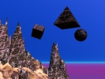

  
[Intangible Textual Heritage](../../index)  [Fortean](../index.md) 
[Index](index)  [Previous](land08)  [Next](land10.md) 

------------------------------------------------------------------------

[Buy this Book at
Amazon.com](https://www.amazon.com/exec/obidos/ASIN/B0027P8882/internetsacredte.md)

------------------------------------------------------------------------

  
*New Lands*, by Charles Fort, \[1923\], at Intangible Textual Heritage

------------------------------------------------------------------------

p. 366

### 9

According to Prof. Newcomb, for instance,
the distance of the sun is about 380 times the distance of the moon—as
determined by triangulation. But, upon page 22, *Popular Astronomy*,
Newcomb tells of another demonstration, with strikingly different
results—as determined by triangulation.

A split god.

The god Triangulation is not one undivided deity.

The other method with strikingly different results is the method of
Aristarchus. It cuts down the distance of the sun, from 380 to 20 times
the distance of the moon. When an observer upon this earth sees the moon
half-illumined, the angle at the moon, between observer and sun, is a
right angle; a third line between observer and sun completes a triangle.
According to Aristarchus, the tilt of the third line includes an angle
of 86 degrees, making the sun-earth line 20 times longer than the
moon-earth line.

"In principle," says Newcomb, "the method is quite correct and very
ingenious, but it cannot be applied in practice." He says that
Aristarchus measured wrong; that the angle between the moon-earth line
and the earth-sun line is almost 90 degrees and not 86 degrees. Then he
says that the method cannot be applied because no one can determine this
angle that he had said is of almost 90 degrees. He says something that
is so incongruous with the inflations of astronomers that they'd sizzle
if their hypnotized readers could read and think at the same time.
Newcomb says that the method of Aristarchus cannot be applied because no
astronomer can determine when the moon is half-illumined.

We have had some experience.

Does anybody who has been through what we've been through suppose that
there is a Prof. Keeler in the world who would not declare that
trigonometrically and spectroscopically and micro-metrically he had
determined the exact moment and exasperating,

p. 367

or delightful, decimal of a moment of semi-illumination of the moon,
were it not that, according to at least as good a mathematician as he,
determination based upon that demonstration does show that the sun is
only 20 times as far away as the moon? But suppose we agree that this
simple thing cannot be done.

Then instantly we think of some of the extravagant claims with which
astronomers have stuffed supine credulities. Crawling in their unsightly
confusion that sickens for simplification, is this offense to harmony:

That astronomers can tell under which Crusade, or its decimalated
moment, a shine left a star, but cannot tell when a shine reaches a line
on the moon—

Glory and triumph and selectness and inflation—or that we shall have
renown as evangelists, spreading the homely and wholesome doctrine of
humility. Hollis, in *Chats on Astronomy*, tells us that the diameter of
this earth, at the equator, is 41,851,160 feet. But blessed be the meek,
we tell him. In the *Observatory*, 19-118, is published the
determination, by the astronomer Brenner, of the time of rotation of
Venus, as to which other astronomers differ by hundreds of days.
According to Brenner, the time is 23 hours, 57 minutes, and 7.5459
seconds. I do note that this especial refinement is a little too
ethereal for the Editor of the *Observatory:* he hopes Brenner will
pardon him, but is it necessary to carry out the finding to the fourth
decimal of a second? However, I do not mean to say that all astronomers
are as refined as Brenner, for instance. In the *Jour. B. A. A.*, I-382,
Edwin Holmes, perhaps coarsely, expresses some views. He says that such
"exactness" as Capt. Noble's in writing that the diameter of Neptune is
38,133 miles and that of Uranus is 33,836 miles is bringing science into
contempt, because very little is known of these planets; that, according
to Neison, these diameters are 27,000 miles and 28,500 miles.
Macpherson, in *A Century's Progress in Science*, quotes Prof. Serviss:
that the average parallax of a star, which is an ordinary astronomic
quantity, is "about equal to the apparent distance between two pins,
placed one inch apart, and viewed from a distance of one hundred and
eighty miles." Stick ins in a cushion, in New York—go to Saratoga and
look at them

p. 368

\[paragraph continues\] —be overwhelmed
with the more than human powers of the scientifically anointed—or ask
them when shines half the moon.

The moon's surface is irregular. I do not say that anybody with brains
enough to know when he has half a shoe polished should know when the sun
has half the moon shined. I do say that if this simple thing cannot be
known, the crowings of astronomers as to enormously more difficult
determinations are mere barnyard disturbances.

Triangulation that, according to his little priests, straddles orbits
and on his apex wears a star—that he's a false Colossus; shrinking, at
the touch of data, back from the stars, deflating below the sun and
moon; stubbing down below the clouds of this earth, so that the
different stories that he told to Aristarchus and to Newcomb are the
conflicting vainglories of an earth-tied squatter—

The blow that crumples a god:

That, by triangulation, there is not an astronomer in the world who can
tell the distance of a thing only five miles away.

Humboldt, *Cosmos*, 5-138:

Height of Mauna Loa: 18,410 feet, according to Cook; 16,611, according
to Marchand; 13,761, according to Wilkes—according to triangulation.

In the *Scientific American*, 119-31, a mountain climber calls the
Editor to account for having written that Mt. Everest is 29,002 feet
high. He says that, in his experience, there is always an error of at
least ten per cent. in calculating the height of a mountain, so that all
that can be said is that Mt. Everest is between 26,100 and 31,900 feet
high. In the *Scientific American*, 102-183, and 319, Miss Annie Peck
cites two measurements of a mountain in India: they differ by 4,000
feet.

The most effective way of treating this subject is to find a list of
measurements of a mountain's height before the mountain was climbed, and
compare with the barometric determination, when the mountain was
climbed. For a list of 8 measurements, by triangulation, of the height
of Mt. St. Elias, see the *Alpine Journal*, 22-150: they vary from
12,672 to 19,500 feet. D’Abruzzi climbed Mt. St. Elias, Aug. 1, 1897.
See a paper, in the *Alpine Journal*, 19-125 D’Abruzzi barometric
determination-18,092 feet.

p. 369

Suppose that, in measuring, by triangulation, the distance of anything
five miles away, the error is, say, ten per cent. But, as to anything
ten miles away, there is no knowing what the error would be. By
triangulation, the moon has been "found" to be 240,000 miles away. It
may be 240 or 240,000,000 miles away.

------------------------------------------------------------------------

[Next: 10](land10.md)
