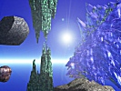

  
[Intangible Textual Heritage](../../index)  [Fortean](../index.md) 
[Index](index)  [Previous](lo24)  [Next](lo26.md) 

------------------------------------------------------------------------

[Buy this Book at
Amazon.com](https://www.amazon.com/exec/obidos/ASIN/B0027P889G/internetsacredte.md)

------------------------------------------------------------------------

  
*Lo!*, by Charles Fort, \[1931\], at Intangible Textual Heritage

------------------------------------------------------------------------

### 25

With a surf and a glare, this earth
quaked a picture—Or, in the monistic sense, there was, in Peru, a
catastrophe that was a hideous and magnificent emotion. It is likely
that there's a wound in a brain, at a time of intensest excitement—

Red of the writhing earth, and red of the heaving ocean—and, in between,
a crimson gash of surf, slashed from Ecuador to Chile—

Or so was visualized a rage, by super-introspection.

According to the midgets of orthodoxy, such a picture cannot be
accepted. See the little De Ballore school of criticism. But quakes that
were pictures by a very independent artistry—

Snow that was white on the peaks of mountains—cataclysm—peaks struck
off—avalanches of snow, glaring red, gushing in jugular spouts from the
decapitations. Glints from the fiery sky—upon land and sea, tossing
houses and ships were spangles. Forests

p. 774

lashed with whips of fire, from which shot out sparks that were birds
and running animals.

Aug. 13, 1868—people in Peru, rushing from their falling houses,
stumbling in violations of streets, seeing the heavens afire, crying:
"El Vulcan!"

Away back in the year 1868, scientific [impudence](errata.htm#3.md) had not
let loose, and there was no scientific clown to laugh off a blazing sky,
with a story of lights in horse cars. The mystery of this occurrence is
in the belief in Peru that there was, somewhere, at this time, a
volcanic eruption.

Cities were flung in the sea. The sea rushed back upon ruins. It doubled
all ordinary catastrophes by piling the wrecks of ships upon the ruins
of houses. Fields poured over cliffs into the Bay of Arica. It was a
cataract of meadows. We have gone far in our demonstration of
continuity, which has led from showers of frogs to storms of meadows.

Vast volumes of water fell from the sky. It was appalling providence:
this water was needed. The waters soaked into the needful earth, and
surplus beneficences made new rivers. In the streams, there was a
ghastly *frou-frou* of torrents of corpses, and the coast of Peru was
frilled with fluttering bodies. Almost Ultimate Evil could be stimulated
by such a *lingerie*. These furbelows of dead men, flounced in the
waves, were the drapery of Providence.

Upon August 19th, there was another violent quake, and again there was a
glare in the sky. Both times there was no accounting for such a
spectacle except by thinking that there had been an eruption in Peru.
According to the *New York Herald*, September 29, the volcano Moquequa
was suspected. London *Times*, October 21—letter from someone who had
seen the flaming sky, and had heard that Canderave was the volcano. It
was said that the eruption had been at Aqualonga, and then that it had
not been Aqualonga, but Cayambe. An illumination in the sky, lasting
several hours, is described in *Comptes Rendus*, 67-1066, and here a
writer gives his opinion that the volcano was Saajama. Other observers
of the glare said that it came from Cotopaxi. *Cosmos*, n. s.,
3-3-367—it was supposed that Cotocachi was the volcano. But it is not
possible

p. 775

to find anything of this disagreement in any textbook: all agree upon
attributing to one volcano—it was Mt. Misti.

*New York Herald*, Oct. 30, 1868—that Mt. Misti had not been active.

See *Comptes Rendus*, 69-262—the results of M. Gay's
investigations—that, in this period, not one of the suspected volcanoes
had been active. See the *Student*, 4-147.

Sometimes volcanic eruptions upon this earth shine, at a distance, like
stars. It will be my acceptance that new stars are new volcanic eruption
in Starland. For a description of a terrestrial eruption that shone like
a star, see the *Amer. Jour. Sci.*, 2-21-144. See a description, in the
*New York Times*, Sept. 23, 1872, of an eruption of Mauna Loa, which far
away looked star-like.

At 12:30 P.M., September 4th, appeared something that has often been
seen at Naples, when Vesuvius has discharged. It was like the volcanic
discharge that we have noted, at Guadalajara, Mexico. A dense,
mountain-like cloud appeared, in the western sky, at Callao, Peru. The
earth heaved with violence equal to that of August 13th.

*New York Tribune*, October 7—that in the southwestern sky was seen a
star.

It is my expression that this was the star that broke Peru.

Night of Feb. 4, 1872—another glare in the sky—that the constellation
Orion was afire—that a tragedy upon this earth began in the sky, with a
spectacle that excited peoples of this earth, from Norway to South
Africa—but that, underlying tragedies written by human beings, or
wrought in sky and lands, are the same conventions, and that Organic
Drama is no more likely to let catastrophe come, without preceding
phenomena that may be interpreted as warnings, than would stagecraft of
this earth permit final calamity, without indications of its approach—

That a surprise was preceded by a warning that was perhaps of the
magnitude of a burning of all the forests of North America—testimony of
the sun and the moon to coming destruction—announcements that were
issued in blazes—showers of gleaming proclamations—brilliant and
long-enduring advertisement—

But that mind upon this earth was brutalized with dogmas—

p. 776

and that scientific wisemen, stupefied by a creed, presided over a
slaughter, or were surprised when came the long and brilliantly
advertised.

This night of Feb. 4, 1872—a blaze in the constellation Orion. From
centers of alarm upon this earth there was telegraphing. City called
upon city. People thought that a neighboring community was burning. In
the West Indies, island called upon island. In each island, the glare in
the sky was thought to come from a volcanic eruption in some other
island. At Moncalieri, Italy, an earthquake, or a response in this earth
to cataclysm somewhere else, was recorded by seismographs. There may
have been special relation with the ground, in Italy.

With this glare, which was considered auroral, because there was no
other way of conventionally explaining it, though auroras never have
been satisfactorily explained, came meteors. Denza recorded them, as
seen in Italy, and noting the seeming relation to the glare, explained
that the seeming relation was only a coincidence. That's got to be
thought by everybody who opposes all that this book stands for. If it
was not a coincidence, the meteors came to this earth from wherever the
glare was. If the glare was in the constellation Orion, Orion may be no
farther from Italy than is San Francisco.

Upon the night of February 22nd, another glare was seen in the sky, and
"by coincidence," it was identical in all respects, except magnitude,
with the glare of the 4th. "By coincidence" again meteors appeared. See
*Comptes Rendus*, 74-641.

Five days after this second seeming eruption in Orion, dust fell from
the sky, at Cosenza, Italy (*C. R.*, 74-826).

The meteors that were seen at the time of the first glare were
extraordinary. They appeared only in the zone of Italy. As seen with the
glare, in India, they are told of in the *Allahabad Pioneer Mail*,
February 12, and the *Bombay Gazette*, February 19. See other records of
ours of zone-phenomena.

Sixteen days after the second glare in Orion, reddish yellow dust fell
in Sicily, and continued to fall the second day, and fell in Italy.

Trembling trillions—or a panic of immensities—and the twinkles

p. 777

of the stars are the winks of proximities—and our data are squeezing
supposed remoteness into familiarities—because, if from a
constellational eruption, dust drifted to this earth in a few weeks, it
did not drift trillions of miles—

But was this dust a discharge from a volcano?

It was volcanic dust, according to Prof. Silvestri. See the *Jour. Chem.
Soc. London*, 25-1083. Prof. Silvestri thought that it must have come
from an eruption somewhere in South America. But my notes upon phenomena
of this year 1872 are especially numerous, and I have no record of any
eruption in South America, or anywhere else—upon this earth—to which
could be attributed this discharge.

For records of a stream of events that then started flowing, see
*Comptes Rendus*, vols. 74, 75, and *Les Mondes*, vol. 28. In Italy,
upon the first of April, began successions of "auroral" lights and
volleys of meteors. Night of April 7-8—many meteors, at Mondovi, Italy.
Solar and lunar haloes, which may, or may not, be attributed to the
presence of volcanic dusts, were seen in Italy, April 6th, 7th, and 8th.
Two days later, Vesuvius became active, but there were only minor
eruptions.

There was uneasiness in Italy. But it was told, in Naples, that the
wisemen were watching Vesuvius. Because of the slight eruptions, some of
the peasants on the slopes began to move. These were a few of the
untrustful ones: the others believed, when the wisemen said that there
was no reason for alarm. Night after night, while this volcano in Italy
was rumbling, meteors came to the skies of Italy. There is no findable
record that they so came anywhere else. They came down to this one part
of this earth, as if this earth were stationary.

April 14th—the third arrival of dust—volumes of dust, of unknown origin,
fell from the sky, in Italy.

There was alarm. The sounds of Vesuvius were louder, but a quiet fall of
dust, if from the unknown, spreads an alarm of its own.

The wisemen continued to study Vesuvius. They paid no more attention to
arrivals of dusts and meteors in the sky of a land where a volcano was
rumbling, than to arrivals of song birds or of

p. 778

tourists, in Italy. Their assurances that there was no reason for alarm,
founded only upon their local observations, held back upon the slopes of
the volcano all but a few disbelievers—

The 20th of April—

Eruption of Vesuvius.

Convolutions of clouds—scrimmages of brains that had broken out of an
underground academy of giants—trying to think for themselves—struggling
to free themselves from subterranean repressions. But clouds and brains
are of an underlying oneness: struggles soon relapsed into a general
fogginess. Volcanic or cerebral—the products are obscurities. Naples was
in darkness.

The people of Naples groped in the streets, each in a hellish geometry
of his own, each seeing in a circle, a few yards in diameter, and
hearing, in one dominant roar, no minor sounds more than a few yards
away. Streams of refugees were stumbling into the streets of Naples.
People groped in circles, into which were thrust hands, holding up
images, or clutching loot. Fragments of sounds in the one dominant
roar—geometricity in bewilderment—or circles in a fog, and something
dominant, and everything else crippled. The flitting of feet, shoulders,
bandaged heads—cries to the saints—profanity of somebody who didn't give
a damn for Vesuvius—legs of a corpse, carried by invisibles—prayers to
God, and jokers screeching false alarms that the lava was coming.

A blast from the volcano cleared away smoke and fog. High on Vesuvius—a
zigzag streak of fire. It was a stream of lava that looked fixed in the
sky. With ceaseless thunder, it shone like lightning—a bolt that was
pinned to a mountain.

Glares that were followed by darkness—in an avalanche of bounding rocks
and stumbling people, no fugitive knew one passing bulk from another,
crashing rocks and screaming women going by in silence, in the one
dominant roar of the volcano. When it was dark, there were showers of
fire, and then in the glares, came down dark falls of burning cinders.
In brilliant illuminations, black rains burned the running peasants.
Give me the sting of such an ink, and there'd be running.

Somewhere, in the smoke and flames, on the mountain side, fell a
sparrow. According to conventional theologians, this was noted.

p. 779

The next day there was another flow down the slopes of Vesuvius. It was
of carts that were laden with bodies.

Possibly this was overlooked, if attention was upon the sparrow. See
data to come, for a more matured opinion.

In at least one mind, or quasi-mind, or whatever we think are minds,
upon this earth, there was awareness of more than coincidence between
flows of meteors in Italy and a volcanic eruption in Italy. In *Comptes
Rendus*, 74-1183, M. Silberman tells of the meteors in Italy, and the
eruption of Vesuvius, and gives his opinion that there was relation. It
was a past generation's momentary suspicion. The record is brief. There
was no discussion. To this day, no conventional scientist will admit
that there is relation. But, if there is, there is also another
relation. That is between his dogmas and the slaughters of people.

In orthodox terms of a moving earth crossing orbits of meteor streams,
to which any one part of this earth, such as the Italian part, could
have no especial exposure to meteors so moving, there is no explanation
of the repeated arrivals of meteors, especially, or exclusively, in
Italy, except this—

Night after night after night—

Coincidence after coincidence after coincidence.

Our unorthodox expression is that it was because this earth is
stationary.

According to data that have been disregarded about sixty years, it may
be that there was a teleportative, or electrolytic, current between a
volcano of this earth and a stellar volcano. If we think that a volcano
in a land that we call the Constellation Orion interacted with a volcano
in Italy—as Vesuvius and Etna often interact—there must be new thoughts
upon the distance of Orion.

The one point that every orthodox astronomer would contest, or
deride—because its acceptance would be followed by acceptance of this
book as a whole—is that the glare that seemed to be in Orion, was in
Orion.

These are the data for thinking that the glare that seemed to be in
Orion, was in Orion, which cannot be vastly far away:

The glare in the sky, early in the evening of Feb. 4, 1872, was west of
Orion, as if cast by reflection from an eruption below the

p. 780

horizon. But, when Orion appeared in the east, the glare was in Orion,
and it remained in Orion. At Paris, all beams of light came from Orion,
after 8 P.M. (*Comptes Rendus*, 74-385). In England—in Orion (*Symons’
Met. Mag.*, 7-1). In South Africa, the point from which all beams
diverged was in Orion (*Cape Argus*, February 10). An account by Prof.
A. C. Twining, of observations in the United States, is published in the
*Amer. Jour. Sci.*, 3-3-273. This "remarkable fact," as Prof. Twining
calls it, but without attempting to explain, is noted—that, from quarter
past seven o'clock, in the evening, until quarter past ten, though Orion
had moved one eighth of its whole revolution, the light remained in
Orion.

There is no conventional explanation to oppose us. My expression is that
the glare so remained in Orion, because it was in Orion. Anybody who
thinks that the glare was somewhere between this earth and the
constellation will have to account not only for the fixedness of it in a
moving constellation, but for its absence of parallax, as seen in places
as far apart as South Africa and the United States.

------------------------------------------------------------------------

[Next: 26](lo26.md)
