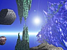

  
[Intangible Textual Heritage](../../index)  [Fortean](../index.md) 
[Index](index)  [Previous](lo26)  [Next](lo28.md) 

------------------------------------------------------------------------

[Buy this Book at
Amazon.com](https://www.amazon.com/exec/obidos/ASIN/B0027P889G/internetsacredte.md)

------------------------------------------------------------------------

  
*Lo!*, by Charles Fort, \[1931\], at Intangible Textual Heritage

------------------------------------------------------------------------

### 27

Once upon a time, one of this earth's
earlier scientists pronounced, or enunciated, or he told a story, which
was somewhat reasonable, of a flood, and of all the animals of this
earth saved, as species, in a big boat. Perhaps the story was not meant
seriously by its author, but was a satire upon the ambitious

p. 793

boat-builders of his day. It is probable that all religions are founded
upon ancient jokes and hoaxes. But, considering the relative fewness of
the animals that were known to the scientists, or the satirists, of that
early time, this story was as plausible as the science, or as the best
satire, of any time. However data of such a host of animals piled up
that the story of the big boat lost its plausibility.

Note that our data are upon events of which the founders of the present
so-called science of astronomy knew little, or knew nothing. Orthodox
astronomy has been systematized, without considering new stars, their
phenomena and indications. It is a big-boat story. Once upon a time it
was plausible. It is in the position of the orthodox geology of former
times, when a doctrine was formulated without consideration for fossils
and sedimentary rocks. But, when fossils and sedimentary rocks were
incorporated, they forced a radical readjustment. New stars were not
taken into the so-called science of astronomy, by the builders of that
system, because no astronomer ever saw, or reported, a new star, between
the years 1670 and 1848. Presumably new stars have not started appearing
all at once in modern times. Presumably, in this period of 178 years,
many new stars appeared, and were not seen, though we shall have data
for thinking that some of them shone night after night with the
brilliance of first magnitude. One would like to know what, when time
after time, the sky was probably spectacular with a new light, the
astronomers were doing, in these 178 years. We may be able to answer
that question, if we can find out what the astronomers are doing now.

There is not agreement among the wisemen. Virtually there is, by the
wisemen of our tribes, no explanation of new stars. The collision-theory
is heard of most.

Always—provided there have been little boys and other amateurs to inform
them—the wise ones tell of stars that have collided. They have never
told of stars that are going to collide.

Why is a story always of stars that have collided? Assuming now that,
instead of being points in a revolving shell, stars are swiftly moving
bodies, there must be instances of stars that are going to collide, some
days, weeks, or years from any given time.

p. 794

\[paragraph continues\] It is too much to
assume that only dark stars collide, or the preponderance of dark stars
would be so great that the sky would be black with Inky Ways. So far, we
have not a fair impression of how frequently new stars appear. It will
be said that stars that are so close to each other that, in a year or
so, they will collide, have, because of their enormous distance from
this earth, the appearance: of one point of light.

This takes us to one of the solemnest and laughablest of the wise men's
extravagances. It is their statement that, after two stars have
collided, they can, by means of the spectroscope, pick out in what is to
the telescope only one point of light, the fragments of an alleged
collision, the velocities and the directions of these parts.

If any spectroscopist can do this thing that the reading public is told
that he can do, never mind about parts where he says there has been a
collision, but let him pick out a point in the sky, which is of parts
that are going to collide. Let him tell where a new star is going to be:
otherwise let him go on being told, by amateurs, where a new star is.

New stars appear. There are disturbances upon this earth—there are
volcanic appearances in the sky—volumes of smoke and dust roll down upon
this earth.

And the meaning of it all may some day be—"Skyward ho!" Storms, upon a
constellation's vacant areas, of Poles and Russians. A black cloud
appears in the sky of Lyra, and down pours a deluge of Italians.
Drifting sands of Scandinavians sift down to a star.

Jan. 5, 1892—just such a fiery blast as has often torn down the slopes
of Vesuvius, shot across the State of Georgia. It was "a black tornado,
filled with fire" (*Chicago Tribune*, January 7). About this time, there
were shocks in Italy, and, in the evening, people in many parts of New
York State were looking up and wondering at a glare in the sky. The next
day they had something else to wonder about. There were shocks in New
York State. Upon the 8th, dust that was perhaps volcanic, but that had
probably been discharged from no volcano of this earth, fell from the
sky, in Northern Indiana. 14th—"tidal wave" in the Atlantic, and a
shock, at Memphis, Tennessee. Snow fell in Mobile, Alabama, where there
had been only four falls of snow in seventy years. Floods in New

p. 795

\[paragraph continues\] England. Quakes in
Japan, 15th, 16th, 17th. At this time began an eruption of Tongariro,
New Zealand. "Tidal wave," or seismic wave, in Lake Michigan, upon the
18th. For references, see the New York newspapers. The *Philadelphia
Public Ledger*, January 27, reported a fall, from the sky, of a mass of
fire into a town in Massachusetts, upon the 20th. At this time, Rome,
Italy, was quaking. Shocks in France, two days later. Shocks in Italy
and Sicily. January 24th—a great meteor, with thunderous detonations,
shot over Cape Colony, South Africa (*Cape Argus*, February 2 and 4). A
drought, at Durango, Mexico, was broken by rain, the first to fall in
four years. Upon the night of the 26th, there was a glare in the sky
that alarmed people throughout Germany. Severest shock ever known in
Tasmania, upon the 27th, and shocks in many places in Victoria,
Austrialia. In the night sky of England, people watched a luminous cloud
(*Nature*, 45-365; 46-127).

There was a new star.

In all the Observatories of this earth, not a professional astronomer
had observed anything out of the ordinary: but, in Edinburgh, a man who
knew nothing of astronomical technicalities (*Nature*, 45365) looked up
at the sky, and saw the new star, night of February 1st. Throughout this
period of the glares and the shocks and the seeming volcanic discharges,
a new star, or a new celestial volcano, had been shining in the
constellation Auriga. The amateur, Dr. Anderson, told the professionals.
They examined photographs, and learned that they had been photographing
the new star since December 1st.

The look of data is that volcanic dust drifted from a new star to the
sky of this earth, in Indiana, in not more than 39 days.

For four hours, upon the 8th of January, dust came down from the sky, in
Northern Indiana, and if it did come from regions external to this
earth, it came settling down, hour after hour, as if to a point upon a
stationary earth. I have searched in many scientific periodicals, and in
newspapers of all continents, finding record of no volcanic eruption
upon this earth, by which to explain.

*La Nature*, 41-206—that this dust had been analyzed, and had been
identified as of volcanic origin. *Science*, 21-303—that this dust had
been analyzed, and had been identified as not of volcanic origin.

p. 796

\[paragraph continues\] *Monthly Weather
Review*, January, 1892—"It was in all probability of volcanic origin."

I have records of five other new stars, which, from Dec. 21, 1896, to
Aug. 10, 1899, appeared at times of disturbances upon this earth; times
of deluges and of volcanic discharges that cannot be attributed to
terrestrial volcanoes. Two of the discoveries were made by amateurs. The
other discoveries were made by professionals, who, with nothing at all
resembling celerity, learned, by examining photographic plates, that new
stars that had been looked at by astronomers had been recorded by
cameras. The period of one of these incelerities was eleven years. See
*Nature*, 85-248.

Star after star has appeared, as a minute point, or as a magnificent
sight in the heavens, and the professional astronomers have been
un-observatory. They have been notified by amateurs. We shall have
records of youngsters who have seen what they were not observing. The
first of the bright infants, of whom I have record, is Seth Chandler, of
Boston. I have it that anybody who is only 19 years old, or, for that
matter, 29, is a youngster. Seth was 19 years old. Upon May 12, 1866, an
amateur astronomer, named Birmingham, at Tuam, Ireland, notified the
professional astronomers, who were looking somewhere else, that there
was a new star in the constellation Corona Borealis. In the United
States, the professional astronomers were busily engaged looking in
other directions. Upon the night of the 14th, Seth Chandler interrupted
their observations, telling them that there was something to look at.
For any pessimist, who is interested in what becomes of exceptionally
bright boys, and the disappointing records of many of them, I note that
when this bright youngster grew up, he became a professional astronomer.

What on earth—or pretty nearly assuredly unrelated to the skies—were the
professionals doing, February, 1901? Night of February 22nd—and Dr.
Anderson, the amateur who had discovered *Nova Aurigae*, nine years
before, looked up at the constellation Perseus, and, even though he had
probably been befoozling himself with astronomical technicalities ever
since, saw something new, and knew the new, when he saw it. It was a
magnificent new star. It was a splendor that scintillated over
stupidity—not a professional,

p. 797

at any of this earth's Observatories, knew of this spectacle, until
informed by Dr. Anderson. Usually it is said that Dr. Anderson
discovered this star, but his claim has been contested. In Russia, it
was recorded that, nine hours earlier, at a time when the sleepiest of
the Observatories had not yet closed down, or had not yet quit not
observing, the new star had been discovered by Andreas Borisiak, of
Kieff. Andreas was a schoolboy.

Before the discovery of this new star in Perseus, or *Nova Persei*,
there had been appearances like volcanic phenomena, unattributable,
however, to any volcano of this earth. Upon the morning of February
13th, deep-greenish-yellow clouds, spreading intensest darkness,
appeared in France (*Bull. Soc. Astro. de France*, March, 1901). Upon
the 16th, a black substance fell from the sky, in Michigan (*Monthly
Weather Review*, 29-465). There was the extreme coldness that often
results from interferences with sunlight, by volcanic dust. At Naples,
three persons were found to have frozen to death, night of the 13th
(London *Daily Mail*, February 15). A red substance fell with snow, near
Mildenhall (London *Daily Mail*, February 22). It may have been
functionally transmitted organic matter. "Pigeons seemed to feed upon
it."

I have data for thinking that at least four nights before Dr. Anderson's
observation, this new star, or a beam from it, though unseen at all
Observatories, was magnificently visible. I think so, because, upon the
night of the 18th, somebody in Finchley (London) and somebody in Tooting
(London) saw something that they thought was a comet. Upon the night of
the 10th, somebody in Tottenham saw it. A story of three somebodies who
had seen something that was missed by all this earth's professional
astronomers, would not be worth much, if told after an announcement of a
discovery, but these observations were told of in the London *Daily
Mail*, published upon the morning of February 22nd, before Dr. Anderson
was heard from.

Sixteen days after the Anderson observation, dust arrived upon this
earth—or it fell from the sky—in volumes that were proportional to this
outburst of first magnitude in the heavens. The new star at its
brightest was of the magnitude of Vega. Dust, of the redness of many
volcanic dusts, and of no African deserts that one

p. 798

hears anything of—and if African deserts ever are red, moving picture
directors, who are strong for realism, or, rather, sometimes are, should
hear about this—fell from the sky. It came down, upon the 9th and 10th
of March, in Sicily, Tunis, Italy, Germany, and Russia. A thick
orange-red stain was reported from Ongar, Essex, England, upon the 12th
(London *Daily Mail*, March 19).

The standardized explanation was published. I shall oppose it with
heresy. Throughout this book, I say that all expressions of mine are
only mental phenomena, and sometimes may be rather awful specimens, even
at that. But, if we examine our opposition, and find it wanting, and if
my own expression includes much that it left out, my own expression is
not wanting, whether it's wanted, or not. Two wisemen wrote the
standardized explanation. The red dust had come from an African desert.
See *Nature*, 66-41.

They wrote that they had traced this dust to a hurricane in an African
desert, pointing out that, upon the first day, it had fallen in Tunis.
That looked like a first fall near an African desert.

But the meteorologists are not banded like the astronomers. For a record
of a fall, not so near an alleged African desert, see *Symons’ Met.
Mag.*, 1902-25—that while this dust was falling in Tunis, also it was
falling in Russia. That this dust did come to this earth from outer
space—see the *Chemical News*, 83-159—Dr. Phipson's opinion that it was
meteoric. That may be accepted as the same as volcanic.

My own expression—

That a hurricane that could have strewn Europe with dust, from the
Mediterranean to Denmark, and from England to Russia, could have been no
breeze fluttering obscurely in some African desert, but a devastating
force that would have fanned all Northern Africa into taking notice

*Lagos* (Gold Coast) *Record*, March-April, 1901—no mention of a
whirlwind of any kind in Africa. In the *Egyptian Gazette* (Alexandria)
there is nothing relating to atmospheric disturbances. There is nothing
upon any such subject noted in the *Sierra Leone News*. *Al-Moghreb*
(Tangier) reports the falls of dust in Europe, but mentions no raising
of dust anywhere in Africa.

But there was a new star.

p. 799

The standardized explanation is perforated with omissions. It seems
unthinkable that mind upon this earth could be so bound down to this
earth by this thing of gaps, until we reflect that so are all nets
fabricated. In Austria, while this dust was falling, the earth quaked.
What could such an occurrence have to do with dust from an African
desert? Omitted. But at the time of this quake, something else was seen,
and it may have been a volcanic bomb that had been shot from a star.
London *Daily Mail*, March 13—a great meteor was seen. Dust falling in
Tunis—and that was told. More of the omitted—see the *Levant Herald*,
March 11—that while the dust was falling in Tunis, there were violent
earthquakes in Algeria. Something else that was left out—see the
*English Mechanic*, 73-96, and the *Bull. Soc. Astro. de France*, April,
1901—that, upon March 12th, ashes fell from the sky, at Avellino, Italy.

Vesuvius, April, 1872—

Krakatoa, August, 1883—

Charleston, August, 1886—

Time after time after time—

And now May, 1902—in the hollow of their ignorance, two of these
conventionalists held 30,000 lives.

May, 1902—there was another surprise. It, too, was preceded by
announcements that were published by mountains, and were advertised in
columns of fire upon pages of clouds.

In April and May, 1902, across a zone of this earth, also outside the
zone, there were disturbances. More than earth-wide relations are
indicated, to start with. Eruptions of Mt. Pelée, Martinique, began upon
April 20th, the date of the Lyrids. However, in this book, I am omitting
many data upon a seeming relation between dates of meteor streams and
catastrophes. Then the volcano La Soufrière, island of St. Vincent,
B. W. I., broke out. Upon the day of an earthquake in Siberia (April
12th) mud fell from the sky, in widely separated places, in
Pennsylvania, New York, New Jersey, and Connecticut. See *Science*,
n.s., 15-872; *New York Herald*, April 14, 1902; *Monthly Weather
Review*, May, 1902.

There may have been an eruption in some other part of one relatively
small existence, or organism. There may have been a new star. In the
*English Mechanic*, 75-291, a correspondent in South

p. 800

\[paragraph continues\] Africa told that,
in the constellation Gemini, night of April 16th, he had seen an
appearance like a new red star. He thought that it might have been not a
star, but a mirage of the red light of the Cape Town lighthouse.

The white houses of St. Pierre, Martinique—a white city, spread up on
the slopes of Mt. Pelée. Early in May, there were panics in St. Pierre.
Pelée was convulsed, and the quavering city of St. Pierre shook out
inhabitants. Desertion of the city was objected to by its rulers, and
the Governor of the island called upon two wisemen, Prof. Landes and
Prof. Doze, for an authoritative opinion.

They had studied the works of Dr. Davison.

There were shocks in Spain, and in France. La Soufrière was of
continuing violence. A volcano broke out in Mexico. Quakes in the Fiji
Islands. Violent quake in Iceland. Volcanic eruption at Cook's Inlet,
Alaska.

Prof. Landes and Prof. Doze were studying Mt. Pelée.

An eruption of cattle and houses and human beings, in Rangoon, Burma—or
"the most terrible storm remembered." A remarkable meteor was seen at
Calcutta. In Java, the Rooang volcano broke out. There were rumblings of
an extinct volcano in France. In Guatemala, with terrific electrical
displays, enormous volumes of water fell upon earthquakes.

Profs. Doze and Landes "announced" that there was, in Pelée's activity,
nothing to warrant the flight of the people. See Heilprin, *Mont Pelée*,
p. 71. Governor Mouttet ordered a cordon of soldiers to form around the
city, and to permit nobody to leave.

Upon the 7th of May, a sky in France turned black with warning. See back
to other such "coincidences" with catastrophes. Soot and water, like
ink, fell from the sky, at Parc Saint Maur (*Comptes Rendus*, 134-1108).

Upon this day, the people of St. Pierre were terrified by the blasts
from Pelée. No inhabitant of the city was permitted to leave, but, as
recorded by Heilprin, the captain of the steamship *Orsolina* did break
away. They tried to hold him. The "pronouncement" was read to him, and
officialdom threatened him, but, with half a cargo, he broke away. His
arrival at Havre is told of, in the *Daily Messenger* (Paris) June 22.
The authorities of the Port of St. Pierre

p. 801

had refused to give him clearance papers, but, terrified by the blasts
from the volcano, he had sailed without them.

The people of St. Pierre were trying to escape, but they were bound to
the town by chains of soldiers. Even in discreetly worded accounts, we
read of these people, running in droves in the streets. In storms of
ashes, turned back at all outskirts, by the soldiers, they were running
in whirlpools.

Not one word of retreat, nor of any modification, came from the two
Professors. They had spoken in accordance with the dogmas of their
deadly cult. Considered locally, an effusion of ashes was not considered
alarming, and no relationship with wider disturbances could be admitted.
The Professors had spoken, and the people of St. Pierre were held to the
town. The people were hammered and stabbed back, or they were reasoned
with, and persuaded to stay. Just how it was done, one has to visualize
for oneself. It was done.

At night there was a lull. Then blasts came from the volcano. Screaming
people ran from the houses. The narrow streets of this white city were
dark with people, massing one way, only to gather against the military
confines, sweeping some other way, only to be turned back by soldiers.
Had there been darkness some of them might have escaped, but even at sea
the glare from the volcano was so intense that the crew of a passing
steamship, *Lord Antrim*, were almost blinded.

As seen from the sea, the streets, hung up on the mountainside,
distorted by smoke and glare, fluttered. Long narrow crowds darkening
these fluttering streets—folds of white garments of a writhing being,
chained, awaiting burning.

Upon the morning of the 8th, the city of St. Pierre was bound to the
stake of Mt. Pelée.

There was a rush of flames. In the volcanic fires that burned the city,
30,000 persons perished.

------------------------------------------------------------------------

[Next: 28](lo28.md)
