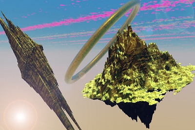

  
[Intangible Textual Heritage](../../index)  [Fortean](../index) 
[ESP](../../psi/index) 

------------------------------------------------------------------------

[Buy this Book at
Amazon.com](https://www.amazon.com/exec/obidos/ASIN/B0027P88AK/internetsacredte)

------------------------------------------------------------------------

<table width="75%">
<colgroup>
<col style="width: 50%" />
<col style="width: 50%" />
</colgroup>
<tbody>
<tr class="odd">
<td width="50%" data-valign="TOP"> 
Image © 2008, John Bruno Hare, All Rights Reserved</td>
<td width="50%" data-valign="CENTER"><h1 id="wild-talents" data-align="CENTER">Wild Talents</h1>
<h2 id="by-charles-fort" data-align="CENTER">by Charles Fort</h2>
<h4 id="section" data-align="CENTER">[1933]</h4></td>
</tr>
</tbody>
</table>

------------------------------------------------------------------------

[Contents](#contents)    [Start Reading](wild00)    [Page
Index](pageidx)    [Text \[Zipped\]](wild.txt.gz)

------------------------------------------------------------------------

|                                                                                                                           |
|---------------------------------------------------------------------------------------------------------------------------|
|  |

Girls at the front--and they are discussing their
usual not very profound subjects. The alarm--the enemy is advancing.
Command to the poltergeist girls to concentrate--and under their chairs
they stick their wads of chewing gum.... A regiment bursts into flames,
and the soldiers are torches. Horses snort smoke from the combustion of
their entrails. Reinforcements are smashed under cliffs that are
teleported from the Rocky Mountains. The snatch of Niagara Falls--it
pours upon the battlefield. The little poltergeist girls reach for their
wads of chewing gum.--p. 1042

This book, the last which Fort published, deals with paranormal
abilities of human beings, such as poltergeists, fire-starters,
telekinesis, dowsing, and so on. These accounts are often scraped from
the police blotter of the newspapers which Fort used as his primary
material, which gives a gritty true-crime feel to this volume. Many of
these incidents center around a *spooky little girl*, today a familiar
staple of horror films.

Fort (never deficient of irony) calls these abilities 'witchcraft.' He
also lumps much of modern science, particularly medical science and
quantum physics into this category. He proposed that these 'talents'
would eventually be acknowledged and placed into use, particularly by
the military, an absurd concept at the time. Today in the 21st century,
self-professed witches are a major religious movement, the Pentagon (and
the Russians) are known to have dabbled in remote viewing, and science
is proposing ever more bizarre and (often untestable) theories of
everything. We need Fort's sardonic wit more than ever.

------------------------------------------------------------------------

 [Title Page](wild00)  
[1](wild01)  
[2](wild02)  
[3](wild03)  
[4](wild04)  
[5](wild05)  
[6](wild06)  
[7](wild07)  
[8](wild08)  
[9](wild09)  
[10](wild10)  
[11](wild11)  
[12](wild12)  
[13](wild13)  
[14](wild14)  
[15](wild15)  
[16](wild16)  
[17](wild17)  
[18](wild18)  
[19](wild19)  
[20](wild20)  
[21](wild21)  
[22](wild22)  
[23](wild23)  
[24](wild24)  
[25](wild25)  
[26](wild26)  
[27](wild27)  
[28](wild28)  
[29](wild29)  
[30](wild30)  
[31](wild31)  
[32](wild32)  
