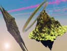

  
[Intangible Textual Heritage](../../index)  [Fortean](../index.md) 
[ESP](../../psi/index)  [Index](index)  [Previous](wild28.md) 
[Next](wild30.md) 

------------------------------------------------------------------------

[Buy this Book at
Amazon.com](https://www.amazon.com/exec/obidos/ASIN/B0027P88AK/internetsacredte.md)

------------------------------------------------------------------------

  
*Wild Talents*, by Charles Fort, \[1933\], at Intangible Textual
Heritage

------------------------------------------------------------------------

### 29

Stunts of sideshows, and the miracles of
pietists, and the phenomena of spiritualistic medium—

Or that the knack that tips a table may tilt an epoch.

Or much of the "parlor magic" of times gone by, and now it is industrial
chemistry. And Taboo, by which earlier experimenters in the trained
forces of today were under suspicion as traffickers with demons.

I take for a pseudo-principle, by which I mean a standard of judgment

p. 1046

that sometimes works out, and sometimes doesn't work out—which is as
near to wisdom as I can arrive, in an existence of truth-nonsense—that,
someday to be considered right, is first to be unholy. It is out of
blasphemy that new religions arise. It is by thinking things that
schoolboys know better than to think that discoveries are made. It is
because our visions are not delirious enough, or degraded, or
nonsensical enough, that all of us are not prophets. Let any thoughtful,
properly trained man, who has had all the benefits of an academic
education, predict—at least, then, we know what won't be. We have, then,
at our command, a kind of negative clairvoyance—if we know just where to
go for an insight into what won't be.

The trail of a working witchcraft—but, if we are traffickers with
demons, the traffic isn't much congested, at present. Someday almost
every particular in this book may look quaint, but it may be that the
principle of putting the witches to work will seem as sound as now seems
the employment of steam and electric demons. Our instances of practical
witchcraft have been practical enough, so long as they were paying
attractions at exhibitions, but the exhibition implies the marvel, or
what people regard as the marvel, and the spirit of this book is of
commonplaceness, or of coming commonplaceness—or that there isn't
anything in it, except of course its vagaries of theories and minor
interpretations, that won't someday be considered as unsensational as
the subject-matters of textbooks upon chemistry and mechanics. My
interest is in magic, as the daily grind—the miracle as a job—sorceries
as public utilities.

There is one manifestation of witchcraft that has been put to work. It
is a miracle with a job.

Dowsing.

It is commonly known as water-divining. It is witchcraft. One cannot say
that, because of some unknown chemical, or bio-chemical, affinity, a
wand bends in a hand, in the presence of underground water. The wand
bends only in the hand of a magician.

It is witchcraft. So, though there are scientists who are giving in to
its existence, there are others, or hosts of others, who never will give
in. Something about both kinds of scientists was published in Time, Feb.
9, 1931. It was said that Oscar E. Meinzer, of the

p. 1047

\[paragraph continues\] U. S. Geological
Survey, having investigated dowsers, had published his findings which
were that "further tests … of so-called 'witching' for water, oil, or
other minerals, would be a misuse of public funds." Also it was shown
that conclusions by Dr. Charles Albert Browne, of the U. S. Department
of Agriculture, disagreed with Mr. Meinzer's findings. "On a large
sugar-beet estate, near Magdeburg, Dr. Browne saw one of Germany's most
famed dowsers at work. Covering his chest with a padded leather jacket,
the dowser took in his hands a looped steel divining rod, and began to
pace the ground. Suddenly the loop shot upward, and hit him a sharp blow
on the chest. Continuing, he charted the outlines of an underground
stream. Then, using an aluminum rod, which he said was much more
sensitive, he estimated the depth of the stream. A rod of still another
metal indicated that the water was good to drink. When Dr. Browne tried
to use the rod, himself, he could get no chest blows, unless the dowser
was holding one end. Dr. Browne then questioned German scientists. The
majority answered that, with all humbuggery discounted, a large number
of successes remained, which could not be accounted for by luck or
chance." For queer places—or for places in which scientists of not so
far back would have predicted that such yokelry as dowsing would never
be admitted—see *Science*, Jan. 23, 1931, or the *Annual Report of the
Smithsonian Institution*, 1928, p. 325. Here full particulars of Dr.
Browne's investigation are published.

The Department of Public Works, of Brisbane, Queensland, Australia, has
employed a dowser, since the year 1916 (*Notes and Queries*, 150-235).
*New York Times*, July 26, 1931—two Australian states were employing
dowsers.

I don't know that I mean much by that. The freaks and faddists who get
themselves employed by governments make me think that I am not very
convincing here. But I have no record of a dowser with a political job
before the year 1916: and, wherever I got all this respectfulness of
mine for the job, it is the entrance of magic into the job that I am
bent upon showing.

In the London Observer, May 2, 1926, it is said that the Government of
Bombay was employing an official water diviner, who, in one district of
scarcity of water, had indicated about fifty sources of

p. 1048

supply, at forty-seven of which water had been found. The writer of this
account says that members of one of the biggest firms of well-boring
engineers had informed him that they had successfully employed dowsers
in Wales, Oxfordshire, and Surrey.

In *Nature*, Sept. 8, 1928, there is an account, by Dr. A. E. M. Geddes,
of experiments with dowsers. Dr. Geddes’ conclusion is that the faculty
of water-divining is possessed by some persons, who respond to at
present unknown, external stimuli.

It is not that I am maintaining that out of the mouths of babes, and
from the vaporings of yokels, we shall receive wisdom—but that sometimes
we may. Peasants have believed in dowsing, and scientists used to
believe that dowsing was only a belief of peasants. Now there are so
many scientists who believe in dowsing that the suspicion comes to me
that it may be only a myth, after all.

In the matter of dowsing, the opposition that Mr. Meinzer represents is
as understandable as is the opposition that once was waged by
priestcraft against the system that he now represents. Let in, against
the former dominant, data of raised beaches, or of deposits of fossils,
and each intruder would make a way for other iniquities. Now, relatively
to the Taboo of today, let in any of the occurrences told of in this
book, and by its suggestions and affiliations, or linkages, it would
make an opening for an irruption.

Very largely, dowsing, or witchcraft put to work, has been let in.

------------------------------------------------------------------------

[Next: 30](wild30.md)
