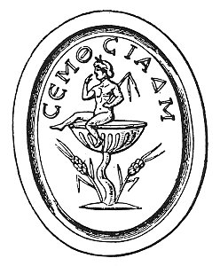

  
[Intangible Textual Heritage](../../index)  [Gnosticism](../index) 
[Index](index)  [Previous](fff00)  [Next](fff02) 

------------------------------------------------------------------------

[Buy this Book at
Amazon.com](https://www.amazon.com/exec/obidos/ASIN/B002CVUVRM/internetsacredte)

------------------------------------------------------------------------

  
*Fragments of a Faith Forgotten*, by G.R.S. Mead, \[1900\], at
Intangible Textual Heritage

------------------------------------------------------------------------

p. v

 

# Synopsis of Contents

|                                                                                                 |                                                     |
|-------------------------------------------------------------------------------------------------|-----------------------------------------------------|
|                                                                                                 | PAGE                     |
| INTRODUCTION                                                                                    | [1](fff04.htm#page_1)-[153](fff16.htm#page_153)     |
| PROLEGOMENA                                                                                     | [3](fff05.htm#page_3)-[28](fff05.htm#page_28)       |
|     The Creed of Christendom                                                                    | [3](fff05.htm#page_3)                               |
|     The New Era Two Thousands Years ago                                                         | [4](fff05.htm#page_4)                               |
|     The New Hope of To-day                                                                      | [5](fff05.htm#page_5)                               |
|     Our Present Task                                                                            | [5](fff05.htm#page_5)                               |
|     The One Religion                                                                            | [6](fff05.htm#page_6)                               |
|     The Sunshine of its Doctrine                                                                | [7](fff05.htm#page_7)                               |
|     The Comparative Science of Religion                                                         | [8](fff05.htm#page_8)                               |
|     The True Scholar of Religion                                                                | [9](fff05.htm#page_9)                               |
|     The Just Method of Comparison                                                               | [9](fff05.htm#page_9)                               |
|     The Analysis of Religion                                                                    | [10](fff05.htm#page_10)                             |
|     The Beginnings of Christianity                                                              | [11](fff05.htm#page_11)                             |
|     The First Two Centuries                                                                     | [12](fff05.htm#page_12)                             |
|     The "Higher Criticism"                                                                      | [14](fff05.htm#page_14)                             |
|     "Providentissimus Deus"                                                                     | [14](fff05.htm#page_14)                             |
|     Its Immediate Result                                                                        | [16](fff05.htm#page_16)                             |
|     The Force of Reaction                                                                       | [17](fff05.htm#page_17)                             |
|     The Force of Progress                                                                       | [18](fff05.htm#page_18)                             |
|     The Nature of Criticism                                                                     | [18](fff05.htm#page_18)                             |
|     The Resultant                                                                               | [19](fff05.htm#page_19)                             |
| p. vi                                                                 |                                                     |
|                                                                                                 | PAGE                     |
|     Nineteen Centuries Ago and Now                                                              | [21](fff05.htm#page_21)                             |
|     The Return of Souls                                                                         | [23](fff05.htm#page_23)                             |
|     The Conditions of the Comparison                                                            | [23](fff05.htm#page_23)                             |
|     The Intensified Present                                                                     | [24](fff05.htm#page_24)                             |
|     Occident and Orient                                                                         | [25](fff05.htm#page_25)                             |
|     The Reconciliation of Science and Theology                                                  | [25](fff05.htm#page_25)                             |
|     The Coming and Going of Souls                                                               | [26](fff05.htm#page_26)                             |
|     The Birth and Death of Races                                                                | [27](fff05.htm#page_27)                             |
|     The Manhood of the Western World                                                            | [8](fff05.htm#page_8)                               |
| SOME ROUGH OUTLINES OF THE BACKGROUND OF THE GNOSIS                                             | [29](fff06.htm#page_29)-[120](fff11.htm#page_120)   |
| PRELIMINARY CONSIDERATIONS                                                                      | [29](fff06.htm#page_29)-[36](fff06.htm#page_36)     |
|     The Greatest Story in the World                                                             | [29](fff06.htm#page_29)                             |
|     The Need of a Background                                                                    | [30](fff06.htm#page_30)                             |
|     The Main Means to a Recovery of the Outlines                                                | [30](fff06.htm#page_30)                             |
|     The Gnostic Schools                                                                         | [32](fff06.htm#page_32)                             |
|     Where to look for their Origins                                                             | [32](fff06.htm#page_32)                             |
|     The Nature of the Field to be Surveyed                                                      | [33](fff06.htm#page_33)                             |
|     The Soil of the Field                                                                       | [34](fff06.htm#page_34)                             |
|     Three Mother Streams                                                                        | [35](fff06.htm#page_35)                             |
| GREECE                                                                                          | [36](fff06.htm#page_36)-[57](fff07.htm#page_57)     |
|     The Greece of 600 B.C.                                           | [36](fff06.htm#page_36)                             |
|     The Precursors of Pythagoras                                                                | [37](fff07.htm#page_37)                             |
|     The Orphic Tradition                                                                        | [39](fff07.htm#page_39)                             |
|     Primitive Hellas                                                                            | [39](fff07.htm#page_39)                             |
|     The Wavelets of Aryan Immigration                                                           | [41](fff07.htm#page_41)                             |
|     The Orphic Line                                                                             | [42](fff07.htm#page_42)                             |
|     The Greece of Homer                                                                         | [43](fff07.htm#page_43)                             |
|     Orpheus returns to Greece                                                                   | [44](fff07.htm#page_44)                             |
|     The Mysteries                                                                               | [46](fff07.htm#page_46)                             |
|     Their Corruption                                                                            | [47](fff07.htm#page_47)                             |
|     The Reason of it                                                                            | [47](fff07.htm#page_47)                             |
| p. vii                                                               |                                                     |
| PAGE                                                                                            |                                                     |
|     The Various Traditions                                                                      | [48](fff07.htm#page_48)                             |
|     The Political Mysteries                                                                     | [49](fff07.htm#page_49)                             |
|     The Private Mysteries                                                                       | [49](fff07.htm#page_49)                             |
|     The Orphic Communities                                                                      | [50](fff07.htm#page_50)                             |
|     The Philosophic Mysteries                                                                   | [51](fff07.htm#page_51)                             |
|     Pythagoras and Plato                                                                        | [51](fff07.htm#page_51)                             |
|     Aristotle and Scepticism                                                                    | [53](fff07.htm#page_53)                             |
|     East and West                                                                               | [54](fff07.htm#page_54)                             |
|     Rome                                                                                        | [55](fff07.htm#page_55)                             |
|     The Mysteries of Mithras                                                                    | [55](fff07.htm#page_55)                             |
| EGYPT                                                                                           | [57](fff07.htm#page_57)-[65](fff08.htm#page_65)     |
|     The Wisdom of Egypt                                                                         | [57](fff07.htm#page_57)                             |
|     The Blendings of Tradition                                                                  | [58](fff08.htm#page_58)                             |
|     The Mystic Communities                                                                      | [60](fff08.htm#page_60)                             |
|     The Therapeuts                                                                              | [60](fff08.htm#page_60)                             |
|     The Earliest Christians of Eusebius                                                         | [61](fff08.htm#page_61)                             |
|     The Pseudo-Philo Theory                                                                     | [62](fff08.htm#page_62)                             |
|     Its Death blow                                                                              | [63](fff08.htm#page_63)                             |
|     An Interesting Question of Date                                                             | [64](fff08.htm#page_64)                             |
|     The Title and Context                                                                       | [65](fff08.htm#page_65)                             |
| PHILO ON THE CONTEMPLATIVE LIFE                                                                 | [66](fff09.htm#page_66)-[86](fff09.htm#page_86)     |
|     The Essæans                                                                                 | [66](fff09.htm#page_66)                             |
|     The Name Therapeut                                                                          | [66](fff09.htm#page_66)                             |
|     Their Abandonment of the World                                                              | [67](fff09.htm#page_67)                             |
|     Their Retreats                                                                              | [68](fff09.htm#page_68)                             |
|     The Mareōtic Colony                                                                         | [69](fff09.htm#page_69)                             |
|     Their Dwellings                                                                             | [69](fff09.htm#page_69)                             |
|     The Original Meaning of the Term Monastery                                                  | [70](fff09.htm#page_70)                             |
|     Their Prayers and Exercises                                                                 | [70](fff09.htm#page_70)                             |
|     The Nature of their Books                                                                   | [71](fff09.htm#page_71)                             |
|     Their Mode of Meeting                                                                       | [71](fff09.htm#page_71)                             |
|     The Sanctuary                                                                               | [72](fff09.htm#page_72)                             |
|     Their Rule                                                                                  | [72](fff09.htm#page_72)                             |
| p. viii                                                             |                                                     |
|                                                                                                 | PAGE                     |
|     Fasting                                                                                     | [73](fff09.htm#page_73)                             |
|     The Seventh-day Common Meal                                                                 | [73](fff09.htm#page_73)                             |
|     Housing and Clothing                                                                        | [73](fff09.htm#page_73)                             |
|     Their Sacred Feasts                                                                         | [74](fff09.htm#page_74)                             |
|     The Banquet on the Fiftieth Day                                                             | [75](fff09.htm#page_75)                             |
|     Seniority                                                                                   | [75](fff09.htm#page_75)                             |
|     The Women Disciples                                                                         | [75](fff09.htm#page_75)                             |
|     The Plain Couches                                                                           | [76](fff09.htm#page_76)                             |
|     The Servers                                                                                 | [76](fff09.htm#page_76)                             |
|     The Frugal Fare                                                                             | [77](fff09.htm#page_77)                             |
|     The President                                                                               | [78](fff09.htm#page_78)                             |
|     The Instruction                                                                             | [78](fff09.htm#page_78)                             |
|     The Interpretation of Scripture                                                             | [79](fff09.htm#page_79)                             |
|     The Singing of Hymns                                                                        | [79](fff09.htm#page_79)                             |
|     Bread and Salt                                                                              | [80](fff09.htm#page_80)                             |
|     The Sacred Dancing                                                                          | [80](fff09.htm#page_80)                             |
|     The Morning Prayer                                                                          | [82](fff09.htm#page_82)                             |
|     A Note on the Sacred Numbers                                                                | [82](fff09.htm#page_82)                             |
|     Philo's Connection with the Therapeuts                                                      | [84](fff09.htm#page_84)                             |
|     The Lay Disciples                                                                           | [85](fff09.htm#page_85)                             |
|     The Variety of Communities                                                                  | [85](fff09.htm#page_85)                             |
| JEWRY                                                                                           | [86](fff09.htm#page_86)-[95](fff10.htm#page_95)     |
|     The Influence of Babylon                                                                    | [86](fff09.htm#page_86)                             |
|     The Writing of Scripture-history                                                            | [88](fff10.htm#page_88)                             |
|     The Mythology of History                                                                    | [88](fff10.htm#page_88)                             |
|     Honest Self-delusion                                                                        | [90](fff10.htm#page_90)                             |
|     The Spiritualizing of Judaism                                                               | [91](fff10.htm#page_91)                             |
|     Zealotism                                                                                   | [91](fff10.htm#page_91)                             |
|     Pharisaism                                                                                  | [92](fff10.htm#page_92)                             |
|     The Chassidim and Essenes                                                                   | [93](fff10.htm#page_93)                             |
|     The Inner Schools                                                                           | [94](fff10.htm#page_94)                             |
| ALEXANDRIA                                                                                      | [95](fff10.htm#page_95)-[120](fff11.htm#page_120)   |
|     A Bird's-eye View of the City                                                               | [96](fff11.htm#page_96)                             |
| p. ix                                                                 |                                                     |
|                                                                                                 | PAGE                     |
|     The Populace                                                                                | [100](fff11.htm#page_100)                           |
|     The Library                                                                                 | [102](fff11.htm#page_102)                           |
|     The Museum                                                                                  | [106](fff11.htm#page_106)                           |
|     The Schools of the Sophists                                                                 | [109](fff11.htm#page_109)                           |
|     The Dawn-land                                                                               | [110](fff11.htm#page_110)                           |
|     The New Religion                                                                            | [113](fff11.htm#page_113)                           |
|     Jewish and Christian Schools                                                                | [116](fff11.htm#page_116)                           |
| GENERAL AND GNOSTIC CHRISTIANITY                                                                | [121](fff12.htm#page_121)-[153](fff16.htm#page_153) |
| THE EVOLUTION OF CATHOLIC CHRISTIANITY                                                          | [121](fff12.htm#page_121)-[125](fff12.htm#page_125) |
|     The Canon                                                                                   | [121](fff12.htm#page_121)                           |
|     The Gospels                                                                                 | [122](fff12.htm#page_122)                           |
|     The Letters of Paul                                                                         | [123](fff12.htm#page_123)                           |
|     The Gentilization of Christianity                                                           | [124](fff12.htm#page_124)                           |
| THE EBIONITES                                                                                   | [126](fff13.htm#page_126)-[130](fff13.htm#page_130) |
|     The Nazoræans                                                                               | [126](fff13.htm#page_126)                           |
|     The Poor Men                                                                                | [127](fff13.htm#page_127)                           |
|     The Ebionite Tradition of Jesus                                                             | [128](fff13.htm#page_128)                           |
| THE ESSENES                                                                                     | [131](fff14.htm#page_131)-[136](fff14.htm#page_136) |
|     Their Manner of Life                                                                        | [132](fff14.htm#page_132)                           |
|     The Degrees of Holiness                                                                     | [133](fff14.htm#page_133)                           |
|     Points of Contact with Christianity                                                         | [134](fff14.htm#page_134)                           |
| THE TENDENCIES OF GNOSTICISM                                                                    | [136](fff14.htm#page_136)-[142](fff15.htm#page_142) |
|     The "Secularizing" of Christianity                                                          | [136](fff14.htm#page_136)                           |
|     Yahweh not "the Father" of Jesus                                                            | [138](fff15.htm#page_138)                           |
|     The Inner Teaching                                                                          | [138](fff15.htm#page_138)                           |
|     Various Classes of Souls                                                                    | [139](fff15.htm#page_139)                           |
|     The Person of Jesus                                                                         | [140](fff15.htm#page_140)                           |
|     The Main Doctrines                                                                          | [141](fff15.htm#page_141)                           |
| THE LITERATURE AND SOURCES OF GNOSTICISM.                                                       | [143](fff16.htm#page_143)-[153](fff16.htm#page_153) |
|     Literature                                                                                  | [143](fff16.htm#page_143)                           |
|     Indirect Sources                                                                            | [146](fff16.htm#page_146)                           |
|     Direct Sources                                                                              | [151](fff16.htm#page_151)                           |
| p. x                                                                   |                                                     |
|                                                                                                 | PAGE                     |
| THE GNOSIS ACCORDING TO ITS FOES                                                                | [155](fff17.htm#page_155)-[449](fff63.htm#page_449) |
| SOME GNOSTIC FRAGMENTS RECOVERED FROM THE POLEMICAL WRITINGS OF THE CHURCH FATHERS              | [157](fff18.htm#page_157)-[414](fff58.htm#page_414) |
|     No Classification possible                                                                  | [157](fff18.htm#page_157)                           |
| THE "SIMONIANS"                                                                                 | [160](fff18.htm#page_160)-[161](fff19.htm#page_161) |
|     The Origin of the Name                                                                      | [160](fff18.htm#page_160)                           |
| DOSITHEUS                                                                                       | [162](fff20.htm#page_162)-[164](fff20.htm#page_164) |
|     A Follower of John the Baptist                                                              | [162](fff20.htm#page_162)                           |
|     The Pre-Christian Gnosis                                                                    | [163](fff20.htm#page_163)                           |
| "SIMON MAGUS"                                                                                   | [164](fff20.htm#page_164)-[174](fff21.htm#page_174) |
|     The Ebionite "Simon"                                                                        | [165](fff21.htm#page_165)                           |
|     The "Simonian" Literature                                                                   | [167](fff21.htm#page_167)                           |
|     The "Simonian" System of Irenæus                                                            | [168](fff21.htm#page_168)                           |
|     The Great Announcement                                                                      | [170](fff21.htm#page_170)                           |
|     The Hidden Fire                                                                             | [171](fff21.htm#page_171)                           |
|     The Fire Tree                                                                               | [172](fff21.htm#page_172)                           |
|     The Æons                                                                                    | [173](fff21.htm#page_173)                           |
| MENANDER                                                                                        | [175](fff22.htm#page_175)-[177](fff22.htm#page_177) |
|     His Date                                                                                    | [175](fff22.htm#page_175)                           |
|     His Doctrines                                                                               | [175](fff22.htm#page_175)                           |
|     A Link with Zoroastrianism                                                                  | [177](fff22.htm#page_177)                           |
| SATURNINUS                                                                                      | [177](fff22.htm#page_177)-[180](fff23.htm#page_180) |
|     The Chain of Teachers                                                                       | [177](fff22.htm#page_177)                           |
|     Asceticism                                                                                  | [178](fff23.htm#page_178)                           |
|     Summary of Doctrines                                                                        | [178](fff23.htm#page_178)                           |
|     The Making of Man                                                                           | [180](fff23.htm#page_180)                           |
| THE "OPHITES"                                                                                   | [181](fff24.htm#page_181)-[188](fff24.htm#page_188) |
|     The Obscurity of the Subject                                                                | [181](fff24.htm#page_181)                           |
| p. xi                                                                 |                                                     |
|                                                                                                 | PAGE                     |
|     The Term "Ophite"                                                                           | [182](fff24.htm#page_182)                           |
|     The Serpent Symbol                                                                          | [183](fff24.htm#page_183)                           |
|     The Myth of the Going-forth                                                                 | [186](fff24.htm#page_186)                           |
|     Pseudo-philology                                                                            | [187](fff24.htm#page_187)                           |
| AN ANONYMOUS SYSTEM FROM IRENÆUS                                                                | [188](fff24.htm#page_188)-[193](fff25.htm#page_193) |
|     The Spiritual Creation                                                                      | [188](fff24.htm#page_188)                           |
|     Yahweh Ialdabaōth                                                                           | [189](fff25.htm#page_189)                           |
|     O. T. Exegesis                                                                              | [189](fff25.htm#page_189)                           |
|     Christology                                                                                 | [191](fff25.htm#page_191)                           |
|     Jesus                                                                                       | [191](fff25.htm#page_191)                           |
| AN EARLY "OPHITE" SYSTEM                                                                        | [193](fff25.htm#page_193)-[197](fff26.htm#page_197) |
|     Justinus                                                                                    | [193](fff25.htm#page_193)                           |
|     The Book of Baruch                                                                          | [194](fff26.htm#page_194)                           |
|     Baruch                                                                                      | [196](fff26.htm#page_196)                           |
|     Christology                                                                                 | [197](fff26.htm#page_197)                           |
| THE NAASSENI                                                                                    | [198](fff27.htm#page_198)-[206](fff27.htm#page_206) |
|     Their Literature                                                                            | [198](fff27.htm#page_198)                           |
|     Their Mystical Exegesis                                                                     | [199](fff27.htm#page_199)                           |
|     The Assyrian Mysteries                                                                      | [200](fff27.htm#page_200)                           |
|     The Egyptian                                                                                | [201](fff27.htm#page_201)                           |
|     The Greek                                                                                   | [201](fff27.htm#page_201)                           |
|     The Samothracian                                                                            | [202](fff27.htm#page_202)                           |
|     The Phrygian                                                                                | [202](fff27.htm#page_202)                           |
|     The Mysteries of the Great Mother                                                           | [203](fff27.htm#page_203)                           |
|     The Fragment of a Hymn                                                                      | [205](fff27.htm#page_205)                           |
| THE PERATÆ                                                                                      | [206](fff27.htm#page_206)-[212](fff28.htm#page_212) |
|     The Source of their Tradition                                                               | [206](fff27.htm#page_206)                           |
|     The Three Worlds                                                                            | [207](fff28.htm#page_207)                           |
|     A Direct Quotation                                                                          | [208](fff28.htm#page_208)                           |
|     The Meaning of the Name                                                                     | [209](fff28.htm#page_209)                           |
|     Psychological Physiology                                                                    | [210](fff28.htm#page_210)                           |
|     The Lost Books of Hippolytus                                                                | [212](fff28.htm#page_212)                           |
| p. xii                                                               |                                                     |
|                                                                                                 | PAGE                     |
| THE SETHIANS                                                                                    | [213](fff29.htm#page_213)-[216](fff29.htm#page_216) |
|     Seth                                                                                        | [213](fff29.htm#page_213)                           |
|     An Outline of their System                                                                  | [214](fff29.htm#page_214)                           |
|     The Mysteries                                                                               | [215](fff29.htm#page_215)                           |
| THE DOCETÆ                                                                                      | [217](fff30.htm#page_217)-[221](fff30.htm#page_221) |
|     God                                                                                         | [218](fff30.htm#page_218)                           |
|     The Æons                                                                                    | [218](fff30.htm#page_218)                           |
|     Cosmos and Man                                                                              | [219](fff30.htm#page_219)                           |
|     The Saviour                                                                                 | [220](fff30.htm#page_220)                           |
| MONOÏMUS                                                                                        | [222](fff31.htm#page_222)-[223](fff31.htm#page_223) |
|     Number Theories                                                                             | [222](fff31.htm#page_222)                           |
|     How to Seek after God                                                                       | [223](fff31.htm#page_223)                           |
| THE SO-CALLED CAINITES                                                                          | [224](fff32.htm#page_224)-[229](fff32.htm#page_229) |
|     The Obscurity of the Subject                                                                | [224](fff32.htm#page_224)                           |
|     The Enemies of Yahweh the Friends of God                                                    | [225](fff32.htm#page_225)                           |
|     Judas                                                                                       | [226](fff32.htm#page_226)                           |
|     A Scrap of History                                                                          | [228](fff32.htm#page_228)                           |
| THE CARPOCRATIANS                                                                               | [229](fff32.htm#page_229)-[233](fff33.htm#page_233) |
|     Their Idea of Jesus                                                                         | [230](fff33.htm#page_230)                           |
|     Reincarnation                                                                               | [231](fff33.htm#page_231)                           |
| "EPIPHANES"                                                                                     | [233](fff33.htm#page_233)-[236](fff34.htm#page_236) |
|     The Moon god                                                                                | [234](fff34.htm#page_234)                           |
|     Communism                                                                                   | [234](fff34.htm#page_234)                           |
|     The Monadic Gnosis                                                                          | [236](fff34.htm#page_236)                           |
| CERINTHUS                                                                                       | [237](fff35.htm#page_237)-[238](fff35.htm#page_238) |
|     The Scape-Goat for the "Pillar-Apostles"                                                    | [237](fff35.htm#page_237)                           |
|     The Over-Writer of the Apocalypse                                                           | [238](fff35.htm#page_238)                           |
| NICOLAUS                                                                                        | [239](fff36.htm#page_239)-[240](fff36.htm#page_240) |
|     "Which Things I hate"                                                                       | [239](fff36.htm#page_239)                           |
| CERDO                                                                                           | [240](fff36.htm#page_240)-[241](fff37.htm#page_241) |
|     The Master of Marcion                                                                       | [240](fff36.htm#page_240)                           |
| p. xiii                                                             |                                                     |
|                                                                                                 | PAGE                     |
| MARCION                                                                                         | [241](fff37.htm#page_241)-[249](fff38.htm#page_249) |
|     The Spread of Marcionism                                                                    |  [241](fff37.htm#page_241)                          |
|     The "Higher Criticism"                                                                      | [242](fff38.htm#page_242)                           |
|     The Gospel of Paul                                                                          | [244](fff38.htm#page_244)                           |
|     Eznik                                                                                       | [246](fff38.htm#page_246)                           |
|     A Marcionite System                                                                         | [247](fff38.htm#page_247)                           |
|     The Title Chrēstos                                                                          | [249](fff38.htm#page_249)                           |
| APELLES                                                                                         | [250](fff39.htm#page_250)-[252](fff39.htm#page_252) |
|     His Wide Tolerance                                                                          | [250](fff39.htm#page_250)                           |
|     Philumēnē                                                                                   | [250](fff39.htm#page_250)                           |
|     Her Visions                                                                                 | [251](fff39.htm#page_251)                           |
| THE BASILIDIAN GNOSIS                                                                           | [253](fff40.htm#page_253)-[284](fff40.htm#page_284) |
|     Basilides and his Writings                                                                  | [253](fff40.htm#page_253)                           |
|     Our Sources of Information                                                                  | [255](fff40.htm#page_255)                           |
|     The Divinity beyond Being                                                                   | [256](fff40.htm#page_256)                           |
|     Universality beyond Being                                                                   | [257](fff40.htm#page_257)                           |
|     Ex Nihilo                                                                                   | [259](fff40.htm#page_259)                           |
|     The Sonship                                                                                 | [260](fff40.htm#page_260)                           |
|     The Holy Spirit                                                                             | [261](fff40.htm#page_261)                           |
|     The Great Ruler                                                                             | [262](fff40.htm#page_262)                           |
|     The Ætherial Creation                                                                       | [263](fff40.htm#page_263)                           |
|     The Sub-lunary Spaces                                                                       | [264](fff40.htm#page_264)                           |
|     Soteriology                                                                                 | [265](fff40.htm#page_265)                           |
|     The Mystic Gospel                                                                           | [267](fff40.htm#page_267)                           |
|     The Sons of God                                                                             | [268](fff40.htm#page_268)                           |
|     The Final Consummation                                                                      | [270](fff40.htm#page_270)                           |
|     Jesus                                                                                       | [272](fff40.htm#page_272)                           |
|     Karman and Reincarnation                                                                    | [274](fff40.htm#page_274)                           |
|     The Theory of "Appendages"                                                                  | [276](fff40.htm#page_276)                           |
|     Moral Responsibility                                                                        | [277](fff40.htm#page_277)                           |
|     A Trace of Zoroastrianism                                                                   | [278](fff40.htm#page_278)                           |
|     The Spurious System                                                                         | [280](fff40.htm#page_280)                           |
|     Abrasax                                                                                     | [282](fff40.htm#page_282)                           |
| p. xiv                                                               |                                                     |
|                                                                                                 | PAGE                     |
| THE VALENTINIAN MOVEMENT                                                                        | [284](fff40.htm#page_284)-[293](fff41.htm#page_293) |
|     The "Great Unknown" of Gnosticism                                                           | [284](fff40.htm#page_284)                           |
|     "They of Valentinus"                                                                        | [285](fff41.htm#page_285)                           |
|     The So-called Eastern and Western Schools                                                   | [287](fff41.htm#page_287)                           |
|     The Leaders of the Movement                                                                 | [287](fff41.htm#page_287)                           |
|     The Syntheticizing of the Gnosis                                                            | [289](fff41.htm#page_289)                           |
|     Sources of Information                                                                      | [291](fff41.htm#page_291)                           |
| VALENTINUS                                                                                      | [294](fff42.htm#page_294)-[311](fff51.htm#page_311) |
|     Biography                                                                                   | [294](fff42.htm#page_294)                           |
|     Date                                                                                        | [296](fff42.htm#page_296)                           |
|     Writings                                                                                    | [297](fff42.htm#page_297)                           |
|     The Fragments that Remain                                                                   | [298](fff42.htm#page_298)                           |
|     Concerning the Creation of the First Race of Mankind                                        | [299](fff42.htm#page_299)                           |
|     On the Pure in Heart                                                                        | [300](fff43.htm#page_300)                           |
|     Concerning One of the Powers of the Perfect Man                                             | [302](fff44.htm#page_302)                           |
|     Ye are Sons of God                                                                          | [303](fff45.htm#page_303)                           |
|     The Face of God                                                                             | [303](fff45.htm#page_303)                           |
|     Concerning the People of the Beloved                                                        | [305](fff47.htm#page_305)                           |
|     The Galilæans                                                                               | [306](fff48.htm#page_306)                           |
|     The Wisdom of the "Little One"                                                              | [306](fff48.htm#page_306)                           |
|     The Chain of Being                                                                          | [307](fff51.htm#page_307)                           |
|     The Ariadne's Thread out of the Maze                                                        | [309](fff51.htm#page_309)                           |
| SOME OUTLINES OF ÆONOLOGY                                                                       | [311](fff51.htm#page_311)-[335](fff52.htm#page_335) |
|     Towards the Great Silence                                                                   | [311](fff51.htm#page_311)                           |
|     The Depth beyond Being                                                                      | [312](fff52.htm#page_312)                           |
|     The Æon World                                                                               | [313](fff52.htm#page_313)                           |
|     The Platonic Solids                                                                         | [314](fff52.htm#page_314)                           |
|     A Living Symbolism                                                                          | [316](fff52.htm#page_316)                           |
|     The "Fourth Dimension"                                                                      | [318](fff52.htm#page_318)                           |
|     The Eternal Atom                                                                            | [320](fff52.htm#page_320)                           |
|     The Law of Syzygy                                                                           | [321](fff52.htm#page_321)                           |
| p. xv                                                                 |                                                     |
|                                                                                                 | PAGE                     |
|     The Law of Differentiation                                                                  | [322](fff52.htm#page_322)                           |
|     The Three and the Seven                                                                     | [323](fff52.htm#page_323)                           |
|     The Twelve and Ten                                                                          | [323](fff52.htm#page_323)                           |
|     The Dodecahedron                                                                            | [325](fff52.htm#page_325)                           |
|     The Decad                                                                                   | [326](fff52.htm#page_326)                           |
|     Chaos                                                                                       | [328](fff52.htm#page_328)                           |
|     Theos                                                                                       | [329](fff52.htm#page_329)                           |
|     Cosmos                                                                                      | [331](fff52.htm#page_331)                           |
|     Mythology                                                                                   | [332](fff52.htm#page_332)                           |
|     The Sophia-Mythus                                                                           | [333](fff52.htm#page_333)                           |
|     The Mother of Many Names                                                                    | [334](fff52.htm#page_334)                           |
| HIPPOLYTUS’ ACCOUNT OF ONE OF THE VARIANTS OF THE SOPHIA-MYTHUS                                 | [335](fff52.htm#page_335)-[357](fff53.htm#page_357) |
|     The Father of All                                                                           | [335](fff52.htm#page_335)                           |
|     The Parents of the Æons                                                                     | [336](fff53.htm#page_336)                           |
|     The Names of the Æons                                                                       | [338](fff53.htm#page_338)                           |
|     The World-Mother                                                                            | [339](fff53.htm#page_339)                           |
|     The Abortion                                                                                | [340](fff53.htm#page_340)                           |
|     The Term "Only-begotten"                                                                    | [341](fff53.htm#page_341)                           |
|     The Cross                                                                                   | [342](fff53.htm#page_342)                           |
|     The Last Limit                                                                              | [343](fff53.htm#page_343)                           |
|     The Mystic or Cosmic Jesus                                                                  | [345](fff53.htm#page_345)                           |
|     The Grief of Sophia                                                                         | [346](fff53.htm#page_346)                           |
|     The Sensible World                                                                          | [347](fff53.htm#page_347)                           |
|     Its Demiurge                                                                                | [348](fff53.htm#page_348)                           |
|     "Words" or Minds                                                                            | [351](fff53.htm#page_351)                           |
|     Souls                                                                                       | [351](fff53.htm#page_351)                           |
|     Bodies                                                                                      | [352](fff53.htm#page_352)                           |
|     The New Man                                                                                 | [353](fff53.htm#page_353)                           |
|     The Mystic Body of the Christ                                                               | [354](fff53.htm#page_354)                           |
|     Soteriology                                                                                 | [355](fff53.htm#page_355)                           |
| THE NUMBER-SYMBOLISM OF MARCUS                                                                  | [358](fff54.htm#page_358)-[382](fff54.htm#page_382) |
|     Sources                                                                                     | [358](fff54.htm#page_358)                           |
| p. xvi                                                               |                                                     |
|                                                                                                 | PAGE                     |
|     Number-letters                                                                              | [359](fff54.htm#page_359)                           |
|     Kabalism                                                                                    | [361](fff54.htm#page_361)                           |
|     The Great Name                                                                              | [363](fff54.htm#page_363)                           |
|     The Echo of the Name                                                                        | [365](fff54.htm#page_365)                           |
|     The Symbolic Body of the Man of Truth                                                       | [366](fff54.htm#page_366)                           |
|     The Numbers                                                                                 | [369](fff54.htm#page_369)                           |
|     Gospel Exegesis                                                                             | [370](fff54.htm#page_370)                           |
|     The Creation of the Sensible World                                                          | [372](fff54.htm#page_372)                           |
|     The Tetraktys                                                                               | [373](fff54.htm#page_373)                           |
|     Theological Arithmetic                                                                      | [375](fff54.htm#page_375)                           |
|     Jesus the Master                                                                            | [376](fff54.htm#page_376)                           |
|     The "Moving Image of Eternity"                                                              | [378](fff54.htm#page_378)                           |
|     From the Marcosian Ritual                                                                   | [380](fff54.htm#page_380)                           |
| PTOLEMY                                                                                         | [383](fff55.htm#page_383)-[390](fff55.htm#page_390) |
|     The Letter to Flora                                                                         | [383](fff55.htm#page_383)                           |
|     The "Higher Criticism"                                                                      | [385](fff55.htm#page_385)                           |
|     The Source of Moses’ Inspiration                                                            | [387](fff55.htm#page_387)                           |
|     The Proem to the Fourth Gospel                                                              | [388](fff55.htm#page_388)                           |
| HERACLEON                                                                                       | [391](fff56.htm#page_391)-[392](fff56.htm#page_392) |
|     His Commentary on the Fourth Gospel                                                         | [391](fff56.htm#page_391)                           |
| BARDESANES                                                                                      | [392](fff56.htm#page_392)-[405](fff57.htm#page_405) |
|     Biography                                                                                   | [392](fff56.htm#page_392)                           |
|     Writings                                                                                    | [393](fff57.htm#page_393)                           |
|     Indirect Sources                                                                            | [395](fff57.htm#page_395)                           |
|     From His Hymns                                                                              | [396](fff57.htm#page_396)                           |
|     The Book of the Laws of Countries                                                           | [398](fff57.htm#page_398)                           |
|     Karman                                                                                      | [399](fff57.htm#page_399)                           |
|     Fortune and Nature                                                                          | [400](fff57.htm#page_400)                           |
|     The Right and Left                                                                          | [401](fff57.htm#page_401)                           |
|     The Hymn of the Soul                                                                        | [403](fff57.htm#page_403)                           |
| THE HYMN OF THE ROBE OF GLORY                                                                   | [406](fff58.htm#page_406)-[414](fff58.htm#page_414) |
| p. xvii                                                             |                                                     |
|                                                                                                 | PAGE                     |
| SOME TRACES OF THE GNOSIS IN THE UNCANONICAL ACTS                                               | [415](fff59.htm#page_415)-[449](fff63.htm#page_449) |
| FOREWORD                                                                                        | [415](fff59.htm#page_415)-[418](fff59.htm#page_418) |
|     The Gnostic Acts                                                                            | [415](fff59.htm#page_415)                           |
|     Catholic Over-Working                                                                       | [416](fff59.htm#page_416)                           |
|     Early Collectors                                                                            | [417](fff59.htm#page_417)                           |
| FROM THE ACTS OF THOMAS                                                                         | [419](fff60.htm#page_419)-[426](fff60.htm#page_426) |
|     A Hymn to Wisdom                                                                            | [419](fff60.htm#page_419)                           |
|     Its Meaning                                                                                 | [421](fff60.htm#page_421)                           |
|     Two Sacramental Invocations                                                                 | [422](fff60.htm#page_422)                           |
|     A Note thereon                                                                              | [423](fff60.htm#page_423)                           |
|     The Palace that Thomas built                                                                | [424](fff60.htm#page_424)                           |
| FROM THE ACTS OF JOHN                                                                           | [426](fff60.htm#page_426)-[444](fff61.htm#page_444) |
|     A Recently-published Fragment                                                               | [426](fff60.htm#page_426)                           |
|     The Rationale of Docetism                                                                   | [426](fff60.htm#page_426)                           |
|     The Evolution of Tradition                                                                  | [427](fff61.htm#page_427)                           |
|     Mystic Stories of Jesus                                                                     | [428](fff61.htm#page_428)                           |
|     The Christ speaks with Jesus                                                                | [429](fff61.htm#page_429)                           |
|     An Early Form of One of the Great Miracles                                                  | [430](fff61.htm#page_430)                           |
|     A Ritual from the Mysteries                                                                 | [431](fff61.htm#page_431)                           |
|     The Doxology                                                                                | [434](fff61.htm#page_434)                           |
|     The Mystery of the Cross                                                                    | [435](fff61.htm#page_435)                           |
|     The Interpretation thereof                                                                  | [437](fff61.htm#page_437)                           |
|     The Initiation of the Cross                                                                 | [438](fff61.htm#page_438)                           |
|     The Higher and Lower Selves                                                                 | [439](fff61.htm#page_439)                           |
|     A Prayer of Praise to Christ                                                                | [440](fff61.htm#page_440)                           |
|     John's Farewell Address to his Community                                                    | [441](fff61.htm#page_441)                           |
|     John's Last Prayer                                                                          | [442](fff61.htm#page_442)                           |
|     The Story of John and the Bugs                                                              | [443](fff61.htm#page_443)                           |
| FROM THE ACTS OF ANDREW                                                                         | [445](fff62.htm#page_445)-[446](fff62.htm#page_446) |
|     Address to the Cross                                                                        | [445](fff62.htm#page_445)                           |
| p. xviii                                                           |                                                     |
|                                                                                                 | PAGE                     |
| FROM THE TRAVELS OF PETER                                                                       | [446](fff62.htm#page_446)-[449](fff63.htm#page_449) |
|     The Descent of Man                                                                          | [446](fff62.htm#page_446)                           |
|     The Mystic Redemption through the Cross                                                     | [447](fff63.htm#page_447)                           |
|     Afterword                                                                                   | [449](fff63.htm#page_449)                           |
| THE GNOSIS ACCORDING TO ITS FRIENDS                                                             | [451](fff64.htm#page_451)-[602](fff72.htm#page_602) |
| SOME GREEK ORIGINAL WORKS IN COPTIC TRANSLATION                                                 | [453](fff65.htm#page_453)-[592](fff71.htm#page_592) |
| THE ASKEW AND BRUCE CODICES                                                                     | [453](fff65.htm#page_453)-[458](fff65.htm#page_458) |
|     The Askew Codex                                                                             | [453](fff65.htm#page_453)                           |
|     The Bruce Codex                                                                             | [454](fff65.htm#page_454)                           |
|     Translations                                                                                | [455](fff65.htm#page_455)                           |
|     The Difficulty of the Subject                                                               | [456](fff65.htm#page_456)                           |
|     Programme                                                                                   | [457](fff65.htm#page_457)                           |
| SUMMARY OF THE CONTENTS OF THE SO-CALLED PISTIS SOPHIA TREATISE                                 | [459](fff66.htm#page_459)-[506](fff66.htm#page_506) |
|     The Teaching of the Eleven Years                                                            | [459](fff66.htm#page_459)                           |
|     The Mystic Transfiguration and Ascent in the Twelfth Year                                   | [459](fff66.htm#page_459)                           |
|     The Master Returns to His Disciples                                                         | [460](fff66.htm#page_460)                           |
|     The Mystic Incarnation of the Twelve                                                        | [460](fff66.htm#page_460)                           |
|     That the Soul of Elias is Born in John the Baptist                                          | [461](fff66.htm#page_461)                           |
|     Of His Own Incarnation                                                                      | [461](fff66.htm#page_461)                           |
|     Concerning the Robe of Glory                                                                | [461](fff66.htm#page_461)                           |
|     The Hymn of Welcome "Come unto Us"                                                          | [462](fff66.htm#page_462)                           |
|     The Three Vestures of Light                                                                 | [463](fff66.htm#page_463)                           |
|     The Journey into the Height                                                                 | [464](fff66.htm#page_464)                           |
|     The Master Robs the Æons of a Third of Their Light                                          | [465](fff66.htm#page_465)                           |
|     The Questions of Mary                                                                       | [466](fff66.htm#page_466)                           |
|     Why the Rulers have been Robbed                                                             | [466](fff66.htm#page_466)                           |
| p. xix                                                               |                                                     |
|                                                                                                 | PAGE                     |
|     The Shortening of the Times                                                                 | [468](fff66.htm#page_468)                           |
|     The Heaven-journey Continued                                                                | [468](fff66.htm#page_468)                           |
|     The Myth of Pistis Sophia                                                                   | [469](fff66.htm#page_469)                           |
|     The Enmity of Arrogant                                                                      | [469](fff66.htm#page_469)                           |
|     The Fall into Matter                                                                        | [470](fff66.htm#page_470)                           |
|     The Descent of the Soul                                                                     | [471](fff66.htm#page_471)                           |
|     Its Repentance and Redemption                                                               | [471](fff66.htm#page_471)                           |
|     The Degrees of Purification                                                                 | [472](fff66.htm#page_472)                           |
|     The Light-crown                                                                             | [473](fff66.htm#page_473)                           |
|     The Final Victory                                                                           | [473](fff66.htm#page_473)                           |
|     An Otherwise-unknown Story of the Infancy                                                   | [474](fff66.htm#page_474)                           |
|     Of the Glory of them of the Thirteenth Æon                                                  | [476](fff66.htm#page_476)                           |
|     The Scale of Light                                                                          | [477](fff66.htm#page_477)                           |
|     The Perfect shall be Higher than the Emanations of Light in the Kingdom 477                 |                                                     |
|     The "Last" shall be "First"                                                                 | [478](fff66.htm#page_478)                           |
|     The Three Supernal Spaces of the Light                                                      | [478](fff66.htm#page_478)                           |
|     The Inheritance of Light                                                                    | [479](fff66.htm#page_479)                           |
|     The Mystery of the First Mystery                                                            | [479](fff66.htm#page_479)                           |
|     The Gnosis of Jesus, the Mystery of the Ineffable                                           | [479](fff66.htm#page_479)                           |
|     The Disciples lose Courage in Amazement at the Glories of the Gnosis                        | [480](fff66.htm#page_480)                           |
|     The Highest Mystery is the Simplest of them All                                             | [481](fff66.htm#page_481)                           |
|     Concerning the One Word of the Ineffable                                                    | [481](fff66.htm#page_481)                           |
|     The Glory of Him who Receiveth the Mystery                                                  | [483](fff66.htm#page_483)                           |
|     Of the Thrones in the Light-kingdom                                                         | [484](fff66.htm#page_484)                           |
|     There are Other Logoi                                                                       | [484](fff66.htm#page_484)                           |
|     The Degrees of the Mysteries                                                                | [484](fff66.htm#page_484)                           |
|     The Boons they Grant                                                                        | [485](fff66.htm#page_485)                           |
|     The Limbs of the Ineffable                                                                  | [485](fff66.htm#page_485)                           |
|     The Thousand Years of Light                                                                 | [486](fff66.htm#page_486)                           |
|     The Books of Ieou                                                                           | [487](fff66.htm#page_487)                           |
| p. xx                                                                 |                                                     |
|                                                                                                 | PAGE                     |
|     Ye are Gods                                                                                 | [487](fff66.htm#page_487)                           |
|     Of Souls in Incarnation                                                                     | [488](fff66.htm#page_488)                           |
|     The Preaching of the Mysteries                                                              | [489](fff66.htm#page_489)                           |
|     The Burden of the Preaching                                                                 | [489](fff66.htm#page_489)                           |
|     The Boundary Marks of the Paths of the Mysteries                                            | [490](fff66.htm#page_490)                           |
|     The After-death State of the Uninitiated Righteous                                          | [490](fff66.htm#page_490)                           |
|     Of those who Repent and again Fall Back                                                     | [491](fff66.htm#page_491)                           |
|     The Added Glories of the Saviours of Souls                                                  | [492](fff66.htm#page_492)                           |
|     Concerning the Irreconcilables                                                              | [492](fff66.htm#page_492)                           |
|     Of the Infinite Compassion of the Divine                                                    | [493](fff66.htm#page_493)                           |
|     Of Those who Mimic the Mysteries                                                            | [493](fff66.htm#page_493)                           |
|     Can the Pains of Martyrdom be Avoided                                                       | [494](fff66.htm#page_494)                           |
|     The Mystery of the Resurrection of the Dead                                                 | [494](fff66.htm#page_494)                           |
|     The Transport of the Disciples                                                              | [495](fff66.htm#page_495)                           |
|     That this Mystery is to be Kept Secret                                                      | [495](fff66.htm#page_495)                           |
|     The Constitution of Man                                                                     | [496](fff66.htm#page_496)                           |
|     The Evil Desire which Constraineth a Man to Sin                                             | [497](fff66.htm#page_497)                           |
|     The After-death State of the Sinner                                                         | [497](fff66.htm#page_497)                           |
|     And of the Initiated Righteous                                                              |  [498](fff66.htm#page_498)                          |
|     "Agree with Thine Enemy"                                                                    | [499](fff66.htm#page_499)                           |
|     The Stamping of the Sins on the Souls                                                       | [499](fff66.htm#page_499)                           |
|     The Burning up of the Sins by the Fires of the Baptism-Mysteries                            | [500](fff66.htm#page_500)                           |
|     The Infinite Forgiveness of Sins                                                            | [501](fff66.htm#page_501)                           |
|     But Delay Not to Repent                                                                     | [502](fff66.htm#page_502)                           |
|     For at a Certain Time the Gates of the Light will be Shut                                   | [502](fff66.htm#page_502)                           |
|     "I know not whence ye are"                                                                  | [503](fff66.htm#page_503)                           |
|     The Dragon of Outer Darkness                                                                | [503](fff66.htm#page_503)                           |
|     The Draught of Oblivion                                                                     | [504](fff66.htm#page_504)                           |
| p. xxi                                                               |                                                     |
|                                                                                                 | PAGE                     |
|     The Parents we are to Leave                                                                 | [504](fff66.htm#page_504)                           |
|     The Books of Ieou Again                                                                     | [505](fff66.htm#page_505)                           |
|     The Christ the First of this Humanity to Enter the Light                                    | [506](fff66.htm#page_506)                           |
|     ’Tis He Who Holds the Keys of the Mysteries                                                 | [506](fff66.htm#page_506)                           |
| SUMMARY OF THE EXTRACTS FROM THE BOOKS OF THE SAVIOUR                                           | [507](fff67.htm#page_507)-[517](fff67.htm#page_517) |
|     The Immanent Limbs of the Ineffable                                                         | [507](fff67.htm#page_507)                           |
|     The Christ is the Ineffable                                                                 | [507](fff67.htm#page_507)                           |
|     The Gnosis of the Christ                                                                    | [508](fff67.htm#page_508)                           |
|     The Initiation of the Disciples on the Mount                                                | [508](fff67.htm#page_508)                           |
|     The First Veil is Drawn Aside                                                               | [509](fff67.htm#page_509)                           |
|     They Enter the Way of the Midst                                                             | [510](fff67.htm#page_510)                           |
|     The Ordering of the Fate-sphere is Described                                                | [510](fff67.htm#page_510)                           |
|     All Mysteries up to the Light-treasure are Promised them                                    | [511](fff67.htm#page_511)                           |
|     The Punishments of the Ways of the Midst                                                    | [512](fff67.htm#page_512)                           |
|     The Duration of the Punishments                                                             | [512](fff67.htm#page_512)                           |
|     The Disciples Pray for Mercy to Sinners                                                     | [513](fff67.htm#page_513)                           |
|     They Enter an Atmosphere of Exceeding Great Light                                           | [514](fff67.htm#page_514)                           |
|     The Vision of the Baptism-Mysteries                                                         | [514](fff67.htm#page_514)                           |
|     They Return to Earth                                                                        | [515](fff67.htm#page_515)                           |
|     The Celebration of the Mystic Eucharist                                                     | [515](fff67.htm#page_515)                           |
|     The Mysteries that are to be Revealed                                                       | [515](fff67.htm#page_515)                           |
|     The Punishment of Sinners in the Lower Regions and the Evil Bodies they Receive when Reborn | [516](fff67.htm#page_516)                           |
|     The Cup of Wisdom                                                                           | [516](fff67.htm#page_516)                           |
|     The Note of a Scribe                                                                        | [517](fff67.htm#page_517)                           |
| SUMMARY OF THE FRAGMENTS OF THE BOOK OF THE GREAT LOGOS ACCORDING TO THE MYSTERY                | [518](fff68.htm#page_518)-[546](fff68.htm#page_546) |
| p. xxii                                                             |                                                     |
|                                                                                                 | PAGE                     |
|     The Book of the Gnoses of the invisible God                                                 | [518](fff68.htm#page_518)                           |
|     The Hidden Wisdom                                                                           | [518](fff68.htm#page_518)                           |
|     A Dark Saying is Explained                                                                  | [519](fff68.htm#page_519)                           |
|     The Flesh of Ignorance                                                                      | [520](fff68.htm#page_520)                           |
|     The Mysteries of the Treasure of Light                                                      | [520](fff68.htm#page_520)                           |
|     To be Revealed to the Worthy Alone                                                          | [521](fff68.htm#page_521)                           |
|     The Lesser Mysteries                                                                        | [522](fff68.htm#page_522)                           |
|     The Good Commandments                                                                       | [522](fff68.htm#page_522)                           |
|     The Greater Mysteries                                                                       | [523](fff68.htm#page_523)                           |
|     The Powers they Confer                                                                      | [523](fff68.htm#page_523)                           |
|     The Mystic Rite of the Baptism of the Water of Life                                         | [524](fff68.htm#page_524)                           |
|     The Baptism of Fire                                                                         | [526](fff68.htm#page_526)                           |
|     The Baptism of the Holy Spirit                                                              | [526](fff68.htm#page_526)                           |
|     The Mystery of Withdrawing the Evil of the Rulers                                           | [527](fff68.htm#page_527)                           |
|     The Powers the Lesser Mysteries Confer                                                      | [527](fff68.htm#page_527)                           |
|     The Mystery of the Forgiveness of Sins                                                      | [528](fff68.htm#page_528)                           |
|     The Powers it Confers                                                                       | [528](fff68.htm#page_528)                           |
|     The Ordering of the Light-treasures                                                         | [529](fff68.htm#page_529)                           |
|     The Great Light                                                                             | [529](fff68.htm#page_529)                           |
|     Invocation to the True God                                                                  | [530](fff68.htm#page_530)                           |
|     Invocation to the Unapproachable                                                            | [531](fff68.htm#page_531)                           |
|     The Mystery of the Twelve Æons                                                              | [531](fff68.htm#page_531)                           |
|     The Thirteenth Æon                                                                          | [532](fff68.htm#page_532)                           |
|     The Fourteenth Æon                                                                          | [532](fff68.htm#page_532)                           |
|     The Three Great Rulers                                                                      | [532](fff68.htm#page_532)                           |
|     Concerning Ieou the Emanator of the Middle Light world                                      | [533](fff68.htm#page_533)                           |
|     The Tetragrammaton                                                                          | [534](fff68.htm#page_534)                           |
|     The Type of the Treasures                                                                   | [535](fff68.htm#page_535)                           |
|     The Type of the True God Ieou                                                               | [535](fff68.htm#page_535)                           |
|     The Mystic Diagrams                                                                         | [536](fff68.htm#page_536)                           |
|     Cosmic Embryology                                                                           | [536](fff68.htm#page_536)                           |
| p. xxiii                                                           |                                                     |
|                                                                                                 | PAGE                     |
|     The Seal on the Forehead of Ieou                                                            | [537](fff68.htm#page_537)                           |
|     General Characteristics of the Diagrams                                                     | [537](fff68.htm#page_537)                           |
|     The Twelve the Order of Jesus                                                               | [538](fff68.htm#page_538)                           |
|     Hymn to the First Mystery sung in the Thirteen Æons                                         | [539](fff68.htm#page_539)                           |
|     The Thirteenth Æon                                                                          | [539](fff68.htm#page_539)                           |
|     The Sixty Treasures                                                                         | [540](fff68.htm#page_540)                           |
|     The Little Idea                                                                             | [541](fff68.htm#page_541)                           |
|     The Name of the Great Power                                                                 | [542](fff68.htm#page_542)                           |
|     Hymn to the Unapproachable God sung in the Seventh Treasure                                 | [543](fff68.htm#page_543)                           |
|     The Great Logoi according to the Mystery                                                    | [544](fff68.htm#page_544)                           |
|     The Universal Idea                                                                          | [545](fff68.htm#page_545)                           |
|     Hymn to the \[? First\] Mystery                                                             | [545](fff68.htm#page_545)                           |
|     The Way of the Midst                                                                        | [546](fff68.htm#page_546)                           |
| SELECTIONS FROM THE UNTITLED APOCALYPSE OF THE CODEX BRUCIANUS                                  | [547](fff69.htm#page_547)-[566](fff69.htm#page_566) |
|     The First Being                                                                             | [547](fff69.htm#page_547)                           |
|     The Second Being                                                                            | [547](fff69.htm#page_547)                           |
|     The Supernal Cross                                                                          | [548](fff69.htm#page_548)                           |
|     The Twelve Depths                                                                           | [548](fff69.htm#page_548)                           |
|     The Primal Source                                                                           | [549](fff69.htm#page_549)                           |
|     The Unmanifested                                                                            | [550](fff69.htm#page_550)                           |
|     The Manifested, the Plērōma                                                                 | [550](fff69.htm#page_550)                           |
|     Three-faced and Two-faced Space                                                             | [551](fff69.htm#page_551)                           |
|     The View of the Commentator                                                                 | [552](fff69.htm#page_552)                           |
|     Marsanēs, Nicotheus, and Phōsilampēs                                                        | [553](fff69.htm#page_553)                           |
|     The Creative Logos                                                                          | [553](fff69.htm#page_553)                           |
|     The Descent of the Light-spark                                                              | [554](fff69.htm#page_554)                           |
|     The Spiritual Atom                                                                          | [554](fff69.htm#page_554)                           |
|     Hymn to the Logos                                                                           | [555](fff69.htm#page_555)                           |
|     The Christ                                                                                  | [555](fff69.htm#page_555)                           |
|     The Glorified of the Logos                                                                  | [556](fff69.htm#page_556)                           |
| p. xxiv                                                             |                                                     |
|                                                                                                 | PAGE                     |
|     The At-one-ment                                                                             | [556](fff69.htm#page_556)                           |
|     Soteriology                                                                                 | [557](fff69.htm#page_557)                           |
|     The Ineffable Vesture                                                                       | [557](fff69.htm#page_557)                           |
|     The Purification of the Lower Nature                                                        | [558](fff69.htm#page_558)                           |
|     The World-Saviour                                                                           | [558](fff69.htm#page_558)                           |
|     The Promise                                                                                 | [559](fff69.htm#page_559)                           |
|     The Powers of the Light vesture                                                             | [559](fff69.htm#page_559)                           |
|     The Mothers of Men                                                                          | [560](fff69.htm#page_560)                           |
|     The Song of Praise of the Mother Above                                                      | [561](fff69.htm#page_561)                           |
|     The Hidden Worlds                                                                           | [561](fff69.htm#page_561)                           |
|     The Man                                                                                     | [562](fff69.htm#page_562)                           |
|     The Lord of Splendour                                                                       | [562](fff69.htm#page_562)                           |
|     His Promise to Them who Believe                                                             | [563](fff69.htm#page_563)                           |
|     The Prayer of the Earth-born                                                                | [564](fff69.htm#page_564)                           |
|     The Powers of Discrimination are Given them                                                 | [564](fff69.htm#page_564)                           |
|     The Ladder of Purification                                                                  | [565](fff69.htm#page_565)                           |
|     The Son of God                                                                              | [565](fff69.htm#page_565)                           |
|     Hymn to the Light                                                                           | [566](fff69.htm#page_566)                           |
| NOTES ON THE CONTENTS OF THE BRUCE AND ASKEW CODICES                                            | [567](fff70.htm#page_567)-[578](fff70.htm#page_578) |
|     The Kinship of the Titled Treatises                                                         | [567](fff70.htm#page_567)                           |
|     Date                                                                                        | [568](fff70.htm#page_568)                           |
|     Authorship                                                                                  | [568](fff70.htm#page_568)                           |
|     The Titles                                                                                  | [569](fff70.htm#page_569)                           |
|     The Books of Ieou                                                                           | [569](fff70.htm#page_569)                           |
|     The Probable Author                                                                         | [570](fff70.htm#page_570)                           |
|     The Obscurity of the Subject                                                                | [570](fff70.htm#page_570)                           |
|     The Original Pistis Sophia Treatise                                                         | [572](fff70.htm#page_572)                           |
|     The Coptic Translation                                                                      | [572](fff70.htm#page_572)                           |
|     The Books of the Saviour                                                                    | [573](fff70.htm#page_573)                           |
|     The Copyist                                                                                 | [573](fff70.htm#page_573)                           |
|     The Scheme Pre-supposed in these Treatises                                                  | [574](fff70.htm#page_574)                           |
| p. xxv                                                               |                                                     |
|                                                                                                 | PAGE                     |
|     An Appreciation of the Untitled Treatise                                                    | [576](fff70.htm#page_576)                           |
|     Not to be Attributed to a Single Author                                                     | [577](fff70.htm#page_577)                           |
|     Its Apocalyptic Basis                                                                       | [577](fff70.htm#page_577)                           |
|     The Over-working                                                                            | [578](fff70.htm#page_578)                           |
| THE AKHMĪM CODEX                                                                                | [579](fff71.htm#page_579)-[592](fff71.htm#page_592) |
|     The MS. and its Contents                                                                    | [579](fff71.htm#page_579)                           |
|     The Gospel of Mary                                                                          | [580](fff71.htm#page_580)                           |
|     The Wisdom of Jesus Christ                                                                  | [582](fff71.htm#page_582)                           |
|     Irenæus quotes from The Gospel of Mary                                                      | [582](fff71.htm#page_582)                           |
|     An Examination of his Statements                                                            | [583](fff71.htm#page_583)                           |
|     The Father                                                                                  | [583](fff71.htm#page_583)                           |
|     The Mother                                                                                  | [584](fff71.htm#page_584)                           |
|     The Pentad                                                                                  | [584](fff71.htm#page_584)                           |
|     The Decad                                                                                   | [586](fff71.htm#page_586)                           |
|     The Christ                                                                                  | [587](fff71.htm#page_587)                           |
|     The Egyptian Origin of the Treatise                                                         | [588](fff71.htm#page_588)                           |
|     The Opinion of Harnack                                                                      | [589](fff71.htm#page_589)                           |
|     The Importance of the MS.                                                                   | [591](fff71.htm#page_591)                           |
| SOME FORGOTTEN SAYINGS                                                                          | [593](fff72.htm#page_593)-[602](fff72.htm#page_602) |
|     Rejected Logoi                                                                              | [593](fff72.htm#page_593)                           |
|     The Oxyrhynchus Papyri                                                                      | [600](fff72.htm#page_600)                           |
| CONCLUSION                                                                                      | [603](fff73.htm#page_603)-[633](fff75.htm#page_633) |
| AFTERWORD                                                                                       | [605](fff74.htm#page_605)-[607](fff74.htm#page_607) |
| BIBLIOGRAPHIES                                                                                  | [608](fff75.htm#page_608)-[633](fff75.htm#page_633) |
| GENERAL BIBLIOGRAPHY                                                                            | [609](fff75.htm#page_609)-[623](fff75.htm#page_623) |
|     Early Works                                                                                 | [609](fff75.htm#page_609)                           |
|     Critical Studies prior to 1851                                                              | [610](fff75.htm#page_610)                           |
|     Works subsequent to the Publication of the Philosophumena in 1851                           | [613](fff75.htm#page_613)                           |
| p. xxvi                                                             |                                                     |
|                                                                                                 | PAGE                     |
| THE COPTIC GNOSTIC WORKS                                                                        | [624](fff75.htm#page_624)-[627](fff75.htm#page_627) |
| REVIEWS AND ARTICLES IN ENGLISH AND AMERICAN PERIODICALS                                        | [628](fff75.htm#page_628)-[630](fff75.htm#page_630) |
| UNCANONICAL ACTS                                                                                | [630](fff75.htm#page_630)                           |
| GNOSTIC (?) GEMS AND ABRAXAS-STUDIES                                                            | [631](fff75.htm#page_631)                           |
| GNOSTIC WORKS MENTIONED BY ANCIENT WRITERS                                                      | [631](fff75.htm#page_631)                           |
| THE MOST RECENT TEXTS OF THE HÆRESIOLOGICAL CHURCH FATHERS AND THEIR ENGLISH TRANSLATIONS       | [631](fff75.htm#page_631)-[633](fff75.htm#page_633) |

------------------------------------------------------------------------

[Next: Illustrations](fff02)
