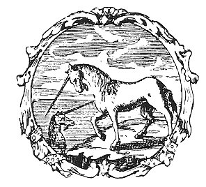

  
[Intangible Textual Heritage](../../index)  [Gnosticism](../index) 
[Index](index)  [Previous](fff02)  [Next](fff04) 

------------------------------------------------------------------------

[Buy this Book at
Amazon.com](https://www.amazon.com/exec/obidos/ASIN/B002CVUVRM/internetsacredte)

------------------------------------------------------------------------

  
*Fragments of a Faith Forgotten*, by G.R.S. Mead, \[1900\], at
Intangible Textual Heritage

------------------------------------------------------------------------

p. xxix

 

# INDEX

### A

Abdias, [418](fff59.htm#page_418).

Aberamenthō, [514](fff67.htm#page_514), [519](fff68.htm#page_519).

Abiram, [226](fff32.htm#page_226).

Abortion, [225](fff32.htm#page_225), [269](fff40.htm#page_269),
[329](fff52.htm#page_329), [340](fff53.htm#page_340),
[356](fff53.htm#page_356).

Aboulfatah, [162](fff20.htm#page_162), [163](fff20.htm#page_163).

Abrasax, [280](fff40.htm#page_280), [281](fff40.htm#page_281),
[282](fff40.htm#page_282), [283](fff40.htm#page_283).

Abyss, [188](fff24.htm#page_188), [308](fff51.htm#page_308),
[312](fff52.htm#page_312).

Accretions, [276](fff40.htm#page_276).

Acembes, [208](fff28.htm#page_208).

Achamōth, [334](fff52.htm#page_334).

Acts, Gnostic, [153](fff16.htm#page_153), [415](fff59.htm#page_415).

Acts, Leucian, [417](fff59.htm#page_417).

*Acts of Apostles*, [128](fff13.htm#page_128),
[568](fff70.htm#page_568).

*Acts of Andrew*, [445](fff62.htm#page_445).

*Acts of John*, [426](fff60.htm#page_426), [434](fff61.htm#page_434),
[443](fff61.htm#page_443), [445](fff62.htm#page_445).

*Acts of Peter*, [152](fff16.htm#page_152), [417](fff59.htm#page_417),
[580](fff71.htm#page_580).

*Acts of Thomas*, [403](fff57.htm#page_403), [419](fff60.htm#page_419),
[422](fff60.htm#page_422), [424](fff60.htm#page_424).

Adam, [189](fff25.htm#page_189), [190](fff25.htm#page_190),
[247](fff38.htm#page_247), [299](fff42.htm#page_299),
[446](fff62.htm#page_446), [447](fff63.htm#page_447),
[551](fff69.htm#page_551); sons of, [599](fff72.htm#page_599).

*Adam, Book of*, [126](fff13.htm#page_126).

Adamant, [277](fff40.htm#page_277), [406](fff58.htm#page_406),
[413](fff58.htm#page_413).

Adamas, [465](fff66.htm#page_465), [474](fff66.htm#page_474),
[510](fff67.htm#page_510), [512](fff67.htm#page_512); Sabaōth,
[521](fff68.htm#page_521), [527](fff68.htm#page_527).

Adembes, [208](fff28.htm#page_208).

Adityās, [327](fff52.htm#page_327).

Æon, [207](fff28.htm#page_207); divine, [390](fff55.htm#page_390);
fourteenth, [532](fff68.htm#page_532); incorruptible,
[191](fff25.htm#page_191); living, [311](fff51.htm#page_311),
[329](fff52.htm#page_329), [344](fff53.htm#page_344),
[365](fff54.htm#page_365); perfect, [218](fff30.htm#page_218); of æons,
[203](fff27.htm#page_203); of night, [208](fff28.htm#page_208);
thirteenth, [325](fff52.htm#page_325), [466](fff66.htm#page_466),
[468](fff66.htm#page_468), [476](fff66.htm#page_476),
[511](fff67.htm#page_511), [515](fff67.htm#page_515),
[520](fff68.htm#page_520), [522](fff68.htm#page_522),
[528](fff68.htm#page_528), [531](fff68.htm#page_531),
[532](fff68.htm#page_532), [539](fff68.htm#page_539).

Æons, [173](fff21.htm#page_173), [218](fff30.htm#page_218),
[313](fff52.htm#page_313); names of, [338](fff53.htm#page_338); parents
of, [336](fff53.htm#page_336); seat of, [440](fff61.htm#page_440); ten,
[337](fff53.htm#page_337); treasures of, [192](fff25.htm#page_192);
triacontad of, [341](fff53.htm#page_341); twelve,
[337](fff53.htm#page_337), [465](fff66.htm#page_465),
[511](fff67.htm#page_511), [531](fff68.htm#page_531).

Æon-world, [313](fff52.htm#page_313).

Ætherial, creation, [263](fff40.htm#page_263); Jesus,
[565](fff69.htm#page_565).

Ethers, [208](fff28.htm#page_208).

After-death state, [490](fff66.htm#page_490), [497](fff66.htm#page_497),
[516](fff67.htm#page_516).

Agape, [235](fff34.htm#page_235), [423](fff60.htm#page_423).

Agathōpus, [302](fff44.htm#page_302).

*Agrapha*, [412](fff58.htm#page_412), [593](fff72.htm#page_593).

"Agree with thine adversary," [231](fff33.htm#page_231),
[499](fff66.htm#page_499).

Agrippa Castor, [147](fff16.htm#page_147), [278](fff40.htm#page_278).

Ahuramazda, [177](fff22.htm#page_177).

Ākāsha, [204](fff27.htm#page_204).

Akhmīm Codex, [152](fff16.htm#page_152), [579](fff71.htm#page_579).

Alexander, [39](fff07.htm#page_39), [97](fff11.htm#page_97),
[99](fff11.htm#page_99), [279](fff40.htm#page_279),
[357](fff53.htm#page_357).

Alexandria, [24](fff05.htm#page_24), [53](fff07.htm#page_53),
[60](fff08.htm#page_60), [69](fff09.htm#page_69),
[91](fff10.htm#page_91), [95](fff10.htm#page_95),
[295](fff42.htm#page_295).

All-Father, [41](fff07.htm#page_41), [385](fff55.htm#page_385),
[549](fff69.htm#page_549), [583](fff71.htm#page_583).

All-Mother, [334](fff52.htm#page_334), [375](fff54.htm#page_375).

"All things depending," [307](fff51.htm#page_307).

Allegories, [71](fff09.htm#page_71), [79](fff09.htm#page_79).

Alone-begotten, [218](fff30.htm#page_218), [341](fff53.htm#page_341),
[388](fff55.htm#page_388), [390](fff55.htm#page_390),
[553](fff69.htm#page_553), [554](fff69.htm#page_554),
[555](fff69.htm#page_555), [586](fff71.htm#page_586).

Alone-born, [551](fff69.htm#page_551).

Alpha, [530](fff68.htm#page_530).

Anāgāmin, [370](fff54.htm#page_370).

Ananias, [580](fff71.htm#page_580).

Anatolic, [287](fff41.htm#page_287), [288](fff41.htm#page_288),
[354](fff53.htm#page_354).

Anaxagoras, [68](fff09.htm#page_68).

Anaximander, [37](fff07.htm#page_37).

Ancestral heart, [301](fff44.htm#page_301).

p. xxx

Ancient, of days, [348](fff53.htm#page_348); of eternity,
[397](fff57.htm#page_397).

Andrew, [445](fff62.htm#page_445), [487](fff66.htm#page_487),
[581](fff71.htm#page_581).

Ani, [393](fff57.htm#page_393).

*Announcement, Great*, [165](fff21.htm#page_165),
[167](fff21.htm#page_167), [170](fff21.htm#page_170),
[173](fff21.htm#page_173), [174](fff21.htm#page_174).

Antioch, [175](fff22.htm#page_175), [178](fff23.htm#page_178),
[288](fff41.htm#page_288).

Antitheses, [226](fff32.htm#page_226).

Ambrose, [64](fff08.htm#page_64).

Amen, [365](fff54.htm#page_365), [431](fff61.htm#page_431); first,
[527](fff68.htm#page_527).

Amens, seven, [529](fff68.htm#page_529); three,
[523](fff68.htm#page_523), [528](fff68.htm#page_528).

Amru, [106](fff11.htm#page_106).

Amshaspends, [177](fff22.htm#page_177), [339](fff53.htm#page_339).

Apelles, [250](fff39.htm#page_250).

Aphrēdōn, [551](fff69.htm#page_551).

Aphrodite, [511](fff67.htm#page_511), [512](fff67.htm#page_512).

Apocalypse, untitled, [547](fff69.htm#page_547).

Apocalypses, [94](fff10.htm#page_94).

Apocrypha, [94](fff10.htm#page_94).

Apollonius of Tyana, [55](fff07.htm#page_55).

Apology, [381](fff54.htm#page_381), [439](fff61.htm#page_439),
[483](fff66.htm#page_483), [486](fff66.htm#page_486),
[499](fff66.htm#page_499), [527](fff68.htm#page_527),
[600](fff72.htm#page_600).

Appendages, [276](fff40.htm#page_276), [277](fff40.htm#page_277),
[301](fff44.htm#page_301).

*Appended Soul, On an*, [277](fff40.htm#page_277).

*Apostle, The*, [245](fff38.htm#page_245).

Arahat, [371](fff54.htm#page_371).

Ararad, [505](fff66.htm#page_505).

Archimedes, [108](fff11.htm#page_108).

Ardesianes, [355](fff53.htm#page_355).

Arēs, [510](fff67.htm#page_510).

Arian, [261](fff40.htm#page_261).

Arithmetic, [223](fff31.htm#page_223), [335](fff52.htm#page_335),
[375](fff54.htm#page_375).

Aristobulus, [117](fff11.htm#page_117).

Aristophanes, [109](fff11.htm#page_109).

Aristotle, [53](fff07.htm#page_53), [104](fff11.htm#page_104),
[107](fff11.htm#page_107).

Arrogant, [468](fff66.htm#page_468), [469](fff66.htm#page_469),
[470](fff66.htm#page_470).

Ascension of plērōma, [478](fff66.htm#page_478).

Asceticism, [178](fff23.htm#page_178), [184](fff24.htm#page_184),
[248](fff38.htm#page_248), [274](fff40.htm#page_274).

Askew Codex, [151](fff16.htm#page_151), [343](fff53.htm#page_343),
[423](fff60.htm#page_423), [453](fff65.htm#page_453),
[529](fff68.htm#page_529).

*As Others saw Him*, [412](fff58.htm#page_412),
[594](fff72.htm#page_594).

Astrology, [207](fff28.htm#page_207), [209](fff28.htm#page_209),.
[283](fff40.htm#page_283), [397](fff57.htm#page_397).

Athos, Mount, [212](fff28.htm#page_212), [273](fff40.htm#page_273).

Atlantic Island, [39](fff07.htm#page_39), [40](fff07.htm#page_40).

Atom, [222](fff31.htm#page_222), [223](fff31.htm#page_223),
[316](fff52.htm#page_316), [318](fff52.htm#page_318),
[319](fff52.htm#page_319), [320](fff52.htm#page_320),
[331](fff52.htm#page_331), [554](fff69.htm#page_554).

At-one-ment, [389](fff55.htm#page_389), [556](fff69.htm#page_556).

Attalus, [104](fff11.htm#page_104).

Augustine, [251](fff39.htm#page_251).

Augustus, birthday of, [3](fff05.htm#page_3).

Authentic, [304](fff47.htm#page_304), [365](fff54.htm#page_365),
[504](fff66.htm#page_504), [509](fff67.htm#page_509),
[512](fff67.htm#page_512), [541](fff68.htm#page_541),
[542](fff68.htm#page_542).

Axionicus, [288](fff41.htm#page_288), [355](fff53.htm#page_355).

### B

Babe, [274](fff40.htm#page_274), [307](fff51.htm#page_307).

Babel, [407](fff58.htm#page_407), [410](fff58.htm#page_410),
[411](fff58.htm#page_411).

Babylon, [86](fff09.htm#page_86), [89](fff10.htm#page_89),
[204](fff27.htm#page_204).

Bacchi, [10](fff05.htm#page_10).

Bacchic mysteries, [67](fff09.htm#page_67), [81](fff09.htm#page_81).

Bacchus, [534](fff68.htm#page_534).

Balance, [512](fff67.htm#page_512).

Baptism, [176](fff22.htm#page_176), [238](fff35.htm#page_238),
[377](fff54.htm#page_377); mysteries of, [499](fff66.htm#page_499),
[533](fff68.htm#page_533), (vision of) [514](fff67.htm#page_514), (fires
of) [500](fff66.htm#page_500); myth of dove, [371](fff54.htm#page_371);
of fire, [522](fff68.htm#page_522), [526](fff68.htm#page_526); of
incense, [515](fff67.htm#page_515); of Jesus, [278](fff40.htm#page_278);
of Holy Spirit, [515](fff67.htm#page_515), [522](fff68.htm#page_522),
[526](fff68.htm#page_526); of midst, [511](fff67.htm#page_511); of
right, [511](fff67.htm#page_511); of water, [515](fff67.htm#page_515),
[522](fff68.htm#page_522), (of life) [524](fff68.htm#page_524).

Baptismal consecration, [380](fff54.htm#page_380).

Barbēlō, [178](fff23.htm#page_178), [334](fff52.htm#page_334),
[514](fff67.htm#page_514), [515](fff67.htm#page_515),
[531](fff68.htm#page_531), [583](fff71.htm#page_583),
[584](fff71.htm#page_584), [585](fff71.htm#page_585),
[586](fff71.htm#page_586).

Barbēlō-Gnostics, [167](fff21.htm#page_167), [568](fff70.htm#page_568),
[583](fff71.htm#page_583), [589](fff71.htm#page_589).

Barcabbas and Barcoph, [278](fff40.htm#page_278).

Bardesanes, [288](fff41.htm#page_288), [355](fff53.htm#page_355),
[392](fff56.htm#page_392), [414](fff58.htm#page_414),
[420](fff60.htm#page_420).

Bardesanites, [395](fff57.htm#page_395).

Bar-Manu, [393](fff57.htm#page_393).

*Baruch, Book of*, [193](fff25.htm#page_193), [196](fff26.htm#page_196).

Basilides, [253](fff40.htm#page_253).

Basilisk, [474](fff66.htm#page_474).

Baur, [166](fff21.htm#page_166).

Beelzeboul, [349](fff53.htm#page_349), [350](fff53.htm#page_350).

Beloved, people of, [305](fff47.htm#page_305).

Be-with-us, day, [343](fff53.htm#page_343).

Bird, great, [473](fff66.htm#page_473).

Birth, new, [203](fff27.htm#page_203); of Horus,
[60](fff08.htm#page_60); second, [191](fff25.htm#page_191),
[519](fff68.htm#page_519); of spiritual man, [60](fff08.htm#page_60).

p. xxxi

Births of joy, [550](fff69.htm#page_550); of matter,
[563](fff69.htm#page_563).

Bitter, [215](fff29.htm#page_215), [598](fff72.htm#page_598).

Blossoms, [442](fff61.htm#page_442).

Body, [496](fff66.htm#page_496).

*Book of Adam*, [126](fff13.htm#page_126).

*Book of Baruch*, [193](fff25.htm#page_193).

*Book of the Dead*, [301](fff44.htm#page_301),
[343](fff53.htm#page_343).

*Book of Gnoses of Invisible God*, [518](fff68.htm#page_518).

*Book of Great Logos according to the Mystery*,
[152](fff16.htm#page_152), [455](fff65.htm#page_455),
[457](fff65.htm#page_457), [567](fff70.htm#page_567).

*Book of Laws of Countries*, [394](fff57.htm#page_394),
[398](fff57.htm#page_398).

*Books of Ieou*, [455](fff65.htm#page_455), [487](fff66.htm#page_487),
[505](fff66.htm#page_505), [533](fff68.htm#page_533),
[569](fff70.htm#page_569).

*Books of the Saviour*, [151](fff16.htm#page_151),
[374](fff54.htm#page_374), [507](fff67.htm#page_507),
[546](fff68.htm#page_546), [567](fff70.htm#page_567),
[573](fff70.htm#page_573).

Bosom, Abraham's, [351](fff53.htm#page_351).

Boundary (see Limit) [307](fff51.htm#page_307),
[342](fff53.htm#page_342), [343](fff53.htm#page_343); great,
[313](fff52.htm#page_313), [379](fff54.htm#page_379); highest,
[313](fff52.htm#page_313).

Brahmarandhra, [205](fff27.htm#page_205).

Brain, [211](fff28.htm#page_211).

Breath, great, [330](fff52.htm#page_330); of their mouths,
[467](fff66.htm#page_467).

Bridal chamber, [419](fff60.htm#page_419), [421](fff60.htm#page_421).

Brooke, [391](fff56.htm#page_391).

Brothel, [169](fff21.htm#page_169).

Brother, Jesus my, [475](fff66.htm#page_475); Paul our,
[568](fff70.htm#page_568).

Bruchion, [98](fff11.htm#page_98), [100](fff11.htm#page_100),
[103](fff11.htm#page_103), [105](fff11.htm#page_105).

Bubastis, [512](fff67.htm#page_512).

Buddha, [7](fff05.htm#page_7), [37](fff07.htm#page_37).

Bugs, story of John and the, [443](fff61.htm#page_443).

Burton, [145](fff16.htm#page_145).

Bythus, [312](fff52.htm#page_312), [321](fff52.htm#page_321),
[323](fff52.htm#page_323), [325](fff52.htm#page_325),
[327](fff52.htm#page_327).

### C

Caduceus, [185](fff24.htm#page_185).

Cain, [190](fff25.htm#page_190), [224](fff32.htm#page_224),
[226](fff32.htm#page_226).

Cainites, [198](fff27.htm#page_198), [224](fff32.htm#page_224).

Called, [47](fff07.htm#page_47), [199](fff27.htm#page_199).

Calligraphists, [103](fff11.htm#page_103).

Callimachus, [109](fff11.htm#page_109).

Canon, [121](fff12.htm#page_121), [241](fff37.htm#page_241),
[243](fff38.htm#page_243).

Canopus, [97](fff11.htm#page_97), [103](fff11.htm#page_103).

Capernaum, [244](fff38.htm#page_244).

Capparatea, [175](fff22.htm#page_175).

Caracalla, [393](fff57.htm#page_393).

Caravanserai (*see* Inn), [301](fff44.htm#page_301),
[443](fff61.htm#page_443).

Carpocrates, [229](fff32.htm#page_229).

Cave, [435](fff61.htm#page_435).

"Cease not to seek," [489](fff66.htm#page_489).

Cecrops, [41](fff07.htm#page_41).

Celbes, [208](fff28.htm#page_208).

Celsus, [150](fff16.htm#page_150), [183](fff24.htm#page_183),
[233](fff33.htm#page_233), [589](fff71.htm#page_589).

Cerdo, [240](fff36.htm#page_240).

Cerebellum, [211](fff28.htm#page_211).

Cerinthus, [237](fff35.htm#page_237).

Chaldæan, influence on Jewry, [93](fff10.htm#page_93); logia,
[172](fff21.htm#page_172); mysteries, [51](fff07.htm#page_51),
[58](fff08.htm#page_58), [89](fff10.htm#page_89); star-cult,
[206](fff27.htm#page_206); tradition, [43](fff07.htm#page_43),
[94](fff10.htm#page_94).

Chaos, [188](fff24.htm#page_188), [208](fff28.htm#page_208),
[328](fff52.htm#page_328), [469](fff66.htm#page_469),
[470](fff66.htm#page_470), [471](fff66.htm#page_471),
[497](fff66.htm#page_497); child of, [189](fff25.htm#page_189).

Charinus, Lucius, [417](fff59.htm#page_417).

Charis, [588](fff71.htm#page_588), [595](fff72.htm#page_595).

Charismatic, [124](fff12.htm#page_124).

Chassidim, [93](fff10.htm#page_93), [94](fff10.htm#page_94).

Child, little, [406](fff58.htm#page_406); of chaos,
[189](fff25.htm#page_189); of the child, [523](fff68.htm#page_523),
[528](fff68.htm#page_528).

Children, little, [598](fff72.htm#page_598); of life,
[303](fff45.htm#page_303); of the fulness, [524](fff68.htm#page_524); of
light, [521](fff68.htm#page_521); of true mind,
[519](fff68.htm#page_519).

Chiliasm, [124](fff12.htm#page_124).

Choīc, [199](fff27.htm#page_199).

Chōrizantes, [104](fff11.htm#page_104).

Chosen, of God, [90](fff10.htm#page_90), [92](fff10.htm#page_92);
people, [87](fff10.htm#page_87), [128](fff13.htm#page_128).

Chrēstos, [249](fff38.htm#page_249).

Chrism, [205](fff27.htm#page_205), [382](fff54.htm#page_382),
[515](fff67.htm#page_515), [522](fff68.htm#page_522).

Christ, [227](fff32.htm#page_227), [273](fff40.htm#page_273),
[327](fff52.htm#page_327), [378](fff54.htm#page_378),
[448](fff63.htm#page_448), [542](fff68.htm#page_542),
[556](fff69.htm#page_556), [586](fff71.htm#page_586),
[587](fff71.htm#page_587); a, [484](fff66.htm#page_484); above,
[190](fff25.htm#page_190); and Holy Spirit, [341](fff53.htm#page_341);
distinguished from Jesus, [427](fff61.htm#page_427); historic gnosis of,
[508](fff67.htm#page_508); invocation to, [380](fff54.htm#page_380); is
the word, [448](fff63.htm#page_448); Jesus, [368](fff54.htm#page_368);
mystic body of, [354](fff53.htm#page_354); name of,
[422](fff60.htm#page_422); the, [507](fff67.htm#page_507),
[555](fff69.htm#page_555); the great master, [430](fff61.htm#page_430).

p. xxxii

*Christliche Welt, Die*, [4](fff05.htm#page_4).

Christs, [176](fff22.htm#page_176), [343](fff53.htm#page_343),
[595](fff72.htm#page_595), [599](fff72.htm#page_599).

Circuits (Tours), [446](fff62.htm#page_446).

City, [419](fff60.htm#page_419), [421](fff60.htm#page_421),
[547](fff69.htm#page_547), [557](fff69.htm#page_557),
[566](fff69.htm#page_566), [602](fff72.htm#page_602).

Citizens of heaven, [82](fff09.htm#page_82).

Claps of hands, [79](fff09.htm#page_79).

Claudius, [109](fff11.htm#page_109).

Clay, [208](fff28.htm#page_208), [351](fff53.htm#page_351).

Clement of Alexandria, [119](fff11.htm#page_119),
[148](fff16.htm#page_148), [418](fff59.htm#page_418).

Clementine literature, pseudo, [162](fff20.htm#page_162),
[164](fff20.htm#page_164), [166](fff21.htm#page_166).

Cleobius, [164](fff20.htm#page_164).

Cleopatra, [98](fff11.htm#page_98), [99](fff11.htm#page_99),
[106](fff11.htm#page_106), [110](fff11.htm#page_110). Closet,
[70](fff09.htm#page_70).

Coats of skin, [190](fff25.htm#page_190).

Codex, Akhmīm, [152](fff16.htm#page_152), [579](fff71.htm#page_579);
Askew, [151](fff16.htm#page_151), [343](fff53.htm#page_343),
[423](fff60.htm#page_423), [453](fff65.htm#page_453),
[529](fff68.htm#page_529); Brucianus, [151](fff16.htm#page_151),
[192](fff25.htm#page_192), [213](fff29.htm#page_213),
[303](fff45.htm#page_303), [312](fff52.htm#page_312),
[374](fff54.htm#page_374), [382](fff54.htm#page_382),
[421](fff60.htm#page_421), [454](fff65.htm#page_454),
[515](fff67.htm#page_515), [529](fff68.htm#page_529),
[591](fff71.htm#page_591).

"Come unto us," [409](fff58.htm#page_409), [462](fff66.htm#page_462);
day of, [343](fff53.htm#page_343).

Commandments, good, [522](fff68.htm#page_522).

Commodus, [250](fff39.htm#page_250).

Common fruit, [331](fff52.htm#page_331), [345](fff53.htm#page_345),
[346](fff53.htm#page_346), [349](fff53.htm#page_349),
[351](fff53.htm#page_351), [352](fff53.htm#page_352).

Communism, [234](fff34.htm#page_234).

Communities, [30](fff06.htm#page_30); mystic, [60](fff08.htm#page_60);
Orphic, [50](fff07.htm#page_50); variety of, [85](fff09.htm#page_85).

Community, Mareotic, [85](fff09.htm#page_85); of friends,
[305](fff47.htm#page_305).

Compendium, [148](fff16.htm#page_148); of Hippolytus,
[14](fff05.htm#page_14), [149](fff16.htm#page_149); of Justin,
[178](fff23.htm#page_178); of Theodoret, [150](fff16.htm#page_150).
Conception, [169](fff21.htm#page_169), [173](fff21.htm#page_173).

*Concerning Fate*, [394](fff57.htm#page_394).

*Concerning the Offspring of Mary*, [198](fff27.htm#page_198).

Confucius, [37](fff07.htm#page_37).

Conglomeration of seed-mixture, [262](fff40.htm#page_262),
[265](fff40.htm#page_265), [272](fff40.htm#page_272),
[276](fff40.htm#page_276).

Consummation, final, [270](fff40.htm#page_270); of first mystery,
[503](fff66.htm#page_503); gnostic, [405](fff57.htm#page_405).

Conversion, [448](fff63.htm#page_448), [449](fff63.htm#page_449); of
spheres, [465](fff66.htm#page_465), [466](fff66.htm#page_466),
[467](fff66.htm#page_467).

Conybeare, [61](fff08.htm#page_61).

Coran, [226](fff32.htm#page_226).

Corners, four, [525](fff68.htm#page_525), [542](fff68.htm#page_542).

Corybantic mysteries, [67](fff09.htm#page_67).

Counterfeit spirit, [276](fff40.htm#page_276),
[471](fff66.htm#page_471), [496](fff66.htm#page_496),
[498](fff66.htm#page_498), [499](fff66.htm#page_499),
[500](fff66.htm#page_500), [504](fff66.htm#page_504),
[505](fff66.htm#page_505).

Couch, [433](fff61.htm#page_433); couches, [76](fff09.htm#page_76).

Cratylus, [200](fff27.htm#page_200).

Critias, [39](fff07.htm#page_39).

Cross, [221](fff30.htm#page_221), [330](fff52.htm#page_330),
[342](fff53.htm#page_342), [343](fff53.htm#page_343),
[352](fff53.htm#page_352), [371](fff54.htm#page_371),
[445](fff62.htm#page_445), [446](fff62.htm#page_446),
[447](fff63.htm#page_447), [548](fff69.htm#page_548),
[550](fff69.htm#page_550), [559](fff69.htm#page_559); address to,
[445](fff62.htm#page_445); bush of, [435](fff61.htm#page_435);
initiation of the, [438](fff61.htm#page_438); mystery of,
[435](fff61.htm#page_435); of light, [435](fff61.htm#page_435);
redemption of, [447](fff63.htm#page_447); of wood,
[436](fff61.htm#page_436); salvation of, [229](fff32.htm#page_229);
supernal, [548](fff69.htm#page_548).

Crotona, [50](fff07.htm#page_50).

Crucified in space, [330](fff52.htm#page_330).

Crucifixion, [227](fff32.htm#page_227).

Crucify the world, [303](fff45.htm#page_303), [518](fff68.htm#page_518).

Cube, [222](fff31.htm#page_222), [317](fff52.htm#page_317),
[324](fff52.htm#page_324).

Cumont, [279](fff40.htm#page_279).

Cup, of life-giving water, [215](fff29.htm#page_215); of wisdom,
[516](fff67.htm#page_516).

Cureton, [394](fff57.htm#page_394).

Cyprus, [296](fff42.htm#page_296).

Cyrus, [89](fff10.htm#page_89).

### D

Dæmonian hierarchies, [512](fff67.htm#page_512); powers,
[190](fff25.htm#page_190).

Daemons, [59](fff08.htm#page_59), [301](fff44.htm#page_301).

Daevos, [59](fff08.htm#page_59).

Daisan, [392](fff56.htm#page_392).

Dance, [80](fff09.htm#page_80), [433](fff61.htm#page_433),
[437](fff61.htm#page_437); circular, [195](fff26.htm#page_195); of
initiation, [431](fff61.htm#page_431).

*Daniel, Book of*, [25](fff05.htm#page_25).

Darkness, [188](fff24.htm#page_188), [390](fff55.htm#page_390); dragon
of, [490](fff66.htm#page_490), [492](fff66.htm#page_492),
[503](fff66.htm#page_503); outer, [490](fff66.htm#page_490),
[503](fff66.htm#page_503), [546](fff68.htm#page_546).

*Darkness, The Light and the*, [394](fff57.htm#page_394).

Dathan, [226](fff32.htm#page_226).

Daveithe, [588](fff71.htm#page_588).

p. xxxiii

David, [588](fff71.htm#page_588).

Day Be-with-us, [343](fff53.htm#page_343); great,
[462](fff66.htm#page_462); of light, [487](fff66.htm#page_487); of
perfect forms, [349](fff53.htm#page_349); sixth,
[371](fff54.htm#page_371).

Dead, [203](fff27.htm#page_203); prayers for, [381](fff54.htm#page_381),
[494](fff66.htm#page_494); resurrection of, [494](fff66.htm#page_494),
[495](fff66.htm#page_495); raised him from, [354](fff53.htm#page_354);
rise from, [176](fff22.htm#page_176).

Death, face of, [304](fff47.htm#page_304).

Decad, [82](fff09.htm#page_82), [323](fff52.htm#page_323),
[324](fff52.htm#page_324), [326](fff52.htm#page_326),
[378](fff54.htm#page_378), [551](fff69.htm#page_551),
[586](fff71.htm#page_586).

Decans, [510](fff67.htm#page_510), [539](fff68.htm#page_539).

Deficiency, [225](fff32.htm#page_225), [265](fff40.htm#page_265),
[328](fff52.htm#page_328), [343](fff53.htm#page_343),
[379](fff54.htm#page_379).

*De Legatione*, [65](fff08.htm#page_65).

Delights of world, [496](fff66.htm#page_496).

Demiurge (*see* Workman), [180](fff23.htm#page_180),
[262](fff40.htm#page_262), [264](fff40.htm#page_264),
[307](fff51.htm#page_307), [348](fff53.htm#page_348),
[349](fff53.htm#page_349), [355](fff53.htm#page_355),
[372](fff54.htm#page_372), [381](fff54.htm#page_381),
[533](fff68.htm#page_533).

Democritus, [68](fff09.htm#page_68).

Depth, [313](fff52.htm#page_313), [352](fff53.htm#page_352),
[547](fff69.htm#page_547); beyond being, [312](fff52.htm#page_312);
unutterable, [188](fff24.htm#page_188).

Depths, twelve, [548](fff69.htm#page_548).

Desert, [186](fff24.htm#page_186).

Destiny, [496](fff66.htm#page_496), [497](fff66.htm#page_497),
[498](fff66.htm#page_498).

*Destruction of False Doctrines*, [246](fff38.htm#page_246).

Deucalion, flood of, [40](fff07.htm#page_40).

Devas, [59](fff08.htm#page_59), [363](fff54.htm#page_363).

Devī, [363](fff54.htm#page_363).

Diabolus, [232](fff33.htm#page_232), [349](fff53.htm#page_349),
[350](fff53.htm#page_350), [384](fff55.htm#page_384).

Diagram of man of truth, [367](fff54.htm#page_367); of Ophites,
[589](fff71.htm#page_589).

Diagrams, [536](fff68.htm#page_536), [537](fff68.htm#page_537).

*Dialogues against the Marcionites*, [394](fff57.htm#page_394).

Diaspora or Dispersion, [91](fff10.htm#page_91),
[135](fff14.htm#page_135), [361](fff54.htm#page_361).

Didascaleion, [119](fff11.htm#page_119), [120](fff11.htm#page_120).

Dionysus, [42](fff07.htm#page_42), [49](fff07.htm#page_49).

Docetism, [217](fff30.htm#page_217), [302](fff44.htm#page_302),
[328](fff52.htm#page_328), [426](fff60.htm#page_426),
[427](fff61.htm#page_427).

Dodecad, [323](fff52.htm#page_323), [324](fff52.htm#page_324),
[432](fff61.htm#page_432), [536](fff68.htm#page_536),
[551](fff69.htm#page_551).

Dodecahedron, [209](fff28.htm#page_209), [222](fff31.htm#page_222),
[317](fff52.htm#page_317), [325](fff52.htm#page_325); rhombic,
[325](fff52.htm#page_325).

Döllinger, [64](fff08.htm#page_64).

Door, [433](fff61.htm#page_433), [436](fff61.htm#page_436).

Dositheus, [162](fff20.htm#page_162).

Dove, [377](fff54.htm#page_377), [423](fff60.htm#page_423),
[424](fff60.htm#page_424), [459](fff66.htm#page_459); baptism-myth of,
[371](fff54.htm#page_371); father in form of, [238](fff35.htm#page_238),
[278](fff40.htm#page_278), [354](fff53.htm#page_354),
[515](fff67.htm#page_515).

Dragon, great, [490](fff66.htm#page_490); of darkness,
[490](fff66.htm#page_490), [492](fff66.htm#page_492),
[503](fff66.htm#page_503), [510](fff67.htm#page_510).

Dry, shame of, [424](fff60.htm#page_424).

Dwarf, [439](fff61.htm#page_439), [598](fff72.htm#page_598).

### E

Eagle, [262](fff40.htm#page_262), [410](fff58.htm#page_410).

Earth, most beautiful, [194](fff26.htm#page_194).

Ebion, [127](fff13.htm#page_127), [237](fff35.htm#page_237).

Ebionism, [126](fff13.htm#page_126), [165](fff21.htm#page_165),
[226](fff32.htm#page_226), [237](fff35.htm#page_237).

Echo, [365](fff54.htm#page_365), [373](fff54.htm#page_373).

Economy, [373](fff54.htm#page_373), [378](fff54.htm#page_378).

Eden, [194](fff26.htm#page_194), [204](fff27.htm#page_204),
[334](fff52.htm#page_334).

Edessa, [392](fff56.htm#page_392).

Egg, [185](fff24.htm#page_185), [214](fff29.htm#page_214),
[320](fff52.htm#page_320), [331](fff52.htm#page_331).

Egypt, [407](fff58.htm#page_407), [466](fff66.htm#page_466); before
flood, [40](fff07.htm#page_40), [569](fff70.htm#page_569); Persian
conquest of, [59](fff08.htm#page_59); plagues of,
[222](fff31.htm#page_222); the body, [186](fff24.htm#page_186); wisdom
of, [38](fff07.htm#page_38), [57](fff07.htm#page_57).

Egyptian, discipline, [237](fff35.htm#page_237); mysteries,
[51](fff07.htm#page_51), [58](fff08.htm#page_58).

Elect, [93](fff10.htm#page_93), [199](fff27.htm#page_199),
[275](fff40.htm#page_275), [303](fff45.htm#page_303),
[365](fff54.htm#page_365), [468](fff66.htm#page_468).

Eleleth, [588](fff71.htm#page_588).

Element, scheme of the one, [367](fff54.htm#page_367).

Eleven years, [459](fff66.htm#page_459).

Eleusinia, [49](fff07.htm#page_49), [50](fff07.htm#page_50),
[51](fff07.htm#page_51), [202](fff27.htm#page_202).

Eleutherus, [296](fff42.htm#page_296).

Elias, soul of, [461](fff66.htm#page_461); to come,
[220](fff30.htm#page_220).

Elkesai, [127](fff13.htm#page_127).

Elohīm, [189](fff25.htm#page_189), [190](fff25.htm#page_190),
[194](fff26.htm#page_194).

Embryology, [281](fff40.htm#page_281), [505](fff66.htm#page_505),
[536](fff68.htm#page_536).

Encratism, [178](fff23.htm#page_178).

Energies, [436](fff61.htm#page_436).

Enformation according to substance, [329](fff52.htm#page_329),
[376](fff54.htm#page_376); to knowledge, [329](fff52.htm#page_329),
[376](fff54.htm#page_376).

Ennads, [551](fff69.htm#page_551).

p. xxxiv

Ennœa, [321](fff52.htm#page_321), [323](fff52.htm#page_323),
[325](fff52.htm#page_325).

Enoch, [487](fff66.htm#page_487), [505](fff66.htm#page_505),
[569](fff70.htm#page_569).

Ephemereuts, [75](fff09.htm#page_75).

Ephraim, [395](fff57.htm#page_395).

Epiphanes, [127](fff13.htm#page_127), [233](fff33.htm#page_233).

Epiphanius, [150](fff16.htm#page_150), [589](fff71.htm#page_589).

Epiphany, [234](fff34.htm#page_234).

Epopteia, [355](fff53.htm#page_355).

Erani, [50](fff07.htm#page_50).

Eratosthenes, [108](fff11.htm#page_108).

Erectheus, [41](fff07.htm#page_41).

Esau, [226](fff32.htm#page_226).

Essenes, [66](fff09.htm#page_66), [84](fff09.htm#page_84),
[93](fff10.htm#page_93), [94](fff10.htm#page_94),
[101](fff11.htm#page_101), [131](fff14.htm#page_131),
[162](fff20.htm#page_162), [227](fff32.htm#page_227),
[279](fff40.htm#page_279).

Eta, [532](fff68.htm#page_532).

Euclid, [108](fff11.htm#page_108), [314](fff52.htm#page_314).

Eucharist, [248](fff38.htm#page_248), [423](fff60.htm#page_423),
[515](fff67.htm#page_515), [526](fff68.htm#page_526).

Eudæmonistic eschatology, [142](fff15.htm#page_142).

Eulogius, [306](fff48.htm#page_306).

Eumenes, [104](fff11.htm#page_104).

Euphrates, [204](fff27.htm#page_204), [208](fff28.htm#page_208).

Eusebius, [61](fff08.htm#page_61), [62](fff08.htm#page_62),
[64](fff08.htm#page_64), [150](fff16.htm#page_150).

Eve, [189](fff25.htm#page_189), [190](fff25.htm#page_190),
[247](fff38.htm#page_247), [351](fff53.htm#page_351).

"Except a man be born of water," [221](fff30.htm#page_221).

Excommunication, [241](fff37.htm#page_241), [295](fff42.htm#page_295).

*Exegetica*, [254](fff40.htm#page_254), [255](fff40.htm#page_255),
[274](fff40.htm#page_274).

Ex Nihilo, [259](fff40.htm#page_259).

Exodus (*see* Going-forth) myth, [186](fff24.htm#page_186).

Exterior of exteriors, [462](fff66.htm#page_462),
[506](fff66.htm#page_506).

*Excerpts from Theodotus*, [287](fff41.htm#page_287),
[292](fff41.htm#page_292), [332](fff52.htm#page_332),
[356](fff53.htm#page_356).

Ezekiel, vision of, [94](fff10.htm#page_94).

Eznik, [246](fff38.htm#page_246).

### F

Face, [176](fff22.htm#page_176), [303](fff45.htm#page_303),
[304](fff47.htm#page_304), [422](fff60.htm#page_422),
[548](fff69.htm#page_548).

Faces, authentic, [504](fff66.htm#page_504).

Fall, into matter, [470](fff66.htm#page_470); of Sophia,
[305](fff47.htm#page_305); of the soul, [334](fff52.htm#page_334).

Fate, [395](fff57.htm#page_395), [397](fff57.htm#page_397).

*Fate, Concerning*, [394](fff57.htm#page_394).

Fate-sphere, [209](fff28.htm#page_209), [465](fff66.htm#page_465),
[477](fff66.htm#page_477), [498](fff66.htm#page_498),
[505](fff66.htm#page_505), [510](fff67.htm#page_510).

Father, alone good, [301](fff44.htm#page_301); "he who shall leave,"
[504](fff66.htm#page_504), [509](fff67.htm#page_509); language of my,
[533](fff68.htm#page_533); -mother, [336](fff53.htm#page_336),
[337](fff53.htm#page_337), [338](fff53.htm#page_338).

Fatherhood, [368](fff54.htm#page_368). Fatherhoods, sixty,
[544](fff68.htm#page_544).

Fear, [361](fff54.htm#page_361); mystery of their,
[546](fff68.htm#page_546); of the Lord, [267](fff40.htm#page_267),
[348](fff53.htm#page_348).

Fifteenth year of Cæsar, [278](fff40.htm#page_278).

Fiftieth day, [74](fff09.htm#page_74), [75](fff09.htm#page_75).

Fifty, [82](fff09.htm#page_82).

Fig-tree, [218](fff30.htm#page_218).

Filioque, [261](fff40.htm#page_261).

Fire, [171](fff21.htm#page_171), [468](fff66.htm#page_468),
[490](fff66.htm#page_490); at Alexandria, [105](fff11.htm#page_105),
[109](fff11.htm#page_109); baptism of, [522](fff68.htm#page_522),
[526](fff68.htm#page_526); finger of, [329](fff52.htm#page_329); flower
of, [172](fff21.htm#page_172); hidden, [171](fff21.htm#page_171);
life-giving, [219](fff30.htm#page_219); mist, [185](fff24.htm#page_185);
tree, [172](fff21.htm#page_172).

Firmament, [262](fff40.htm#page_262), [263](fff40.htm#page_263),
[266](fff40.htm#page_266), [311](fff51.htm#page_311),
[464](fff66.htm#page_464).

First, born, [560](fff69.htm#page_560), (sons of Satan),
[13](fff05.htm#page_13), [32](fff06.htm#page_32),
[174](fff21.htm#page_174); last shall be, [478](fff66.htm#page_478);
man, [188](fff24.htm#page_188), [190](fff25.htm#page_190),
[191](fff25.htm#page_191), [371](fff54.htm#page_371),
[447](fff63.htm#page_447), [448](fff63.htm#page_448),
[498](fff66.htm#page_498), [584](fff71.htm#page_584),
[585](fff71.htm#page_585); statute, [463](fff66.htm#page_463),
[465](fff66.htm#page_465); woman, [188](fff24.htm#page_188).

Fish, [261](fff40.htm#page_261), [270](fff40.htm#page_270).

Five, books, [385](fff55.htm#page_385); impressions,
[529](fff68.htm#page_529); limbs, [422](fff60.htm#page_422),
[423](fff60.htm#page_423); supporters, [529](fff68.htm#page_529); trees,
[523](fff68.htm#page_523), [529](fff68.htm#page_529),
[544](fff68.htm#page_544); years’ silence, [278](fff40.htm#page_278),
[282](fff40.htm#page_282).

Flesh, of ignorance, [520](fff68.htm#page_520); perfect,
[582](fff71.htm#page_582); of rulers, [468](fff66.htm#page_468); of
unrighteousness, [519](fff68.htm#page_519); tongue of,
[438](fff61.htm#page_438), [552](fff69.htm#page_552),
[578](fff70.htm#page_578); word made, [390](fff55.htm#page_390).

Flood, [40](fff07.htm#page_40), [505](fff66.htm#page_505),
[569](fff70.htm#page_569).

*Flora, Letter to*, [383](fff55.htm#page_383).

Foreknowledge, [585](fff71.htm#page_585).

Forethought, [550](fff69.htm#page_550), [585](fff71.htm#page_585).

Forgiveness of sins, [501](fff66.htm#page_501),
[523](fff68.htm#page_523), [527](fff68.htm#page_527),
[530](fff68.htm#page_530), [531](fff68.htm#page_531),
[533](fff68.htm#page_533).

Formlessness, [268](fff40.htm#page_268), [270](fff40.htm#page_270),
[329](fff52.htm#page_329).

"For this cause I bow my knees," [352](fff53.htm#page_352).

Fortune, [398](fff57.htm#page_398), [399](fff57.htm#page_399),
[400](fff57.htm#page_400).

p. xxxv

Forty-nine, [464](fff66.htm#page_464), [465](fff66.htm#page_465),
[471](fff66.htm#page_471), [506](fff66.htm#page_506),
[523](fff68.htm#page_523).

Four, [374](fff54.htm#page_374); great lights,
[588](fff71.htm#page_588); holy ones, [377](fff54.htm#page_377);
quarters, [509](fff67.htm#page_509), [525](fff68.htm#page_525),
[542](fff68.htm#page_542); primal passions, [346](fff53.htm#page_346);
supernal, [363](fff54.htm#page_363).

*Four Quarters of the World*, [167](fff21.htm#page_167).

Four and twenty invisibles, [476](fff66.htm#page_476).

Four and twentieth mystery, [462](fff66.htm#page_462).

Fourteenth æon, [532](fff68.htm#page_532).

Fourth, dimension, [318](fff52.htm#page_318); gospel,
[260](fff40.htm#page_260), [388](fff55.htm#page_388),
[391](fff56.htm#page_391).

Freewill, [399](fff57.htm#page_399).

Fruits of spirit, [338](fff53.htm#page_338).

### G

Gabriel, [377](fff54.htm#page_377), [473](fff66.htm#page_473).

Galileans, [306](fff48.htm#page_306).

Galilee, [524](fff68.htm#page_524), [582](fff71.htm#page_582); mount of,
[515](fff67.htm#page_515).

Garment, one, [425](fff60.htm#page_425); wedding,
[405](fff57.htm#page_405).

Gate, Canopic, [103](fff11.htm#page_103); "I am the true,"
[202](fff27.htm#page_202); of the heavens, [203](fff27.htm#page_203); of
the lord, [202](fff27.htm#page_202); of truth,
[204](fff27.htm#page_204).

Gates, [538](fff68.htm#page_538); of light, [502](fff66.htm#page_502),
[503](fff66.htm#page_503); of the powerful, [333](fff52.htm#page_333);
of the treasure, [474](fff66.htm#page_474).

Gazzah, [406](fff58.htm#page_406).

Gennesaret, [430](fff61.htm#page_430).

"Geometrizes, God," [314](fff52.htm#page_314).

Gifts of spirit, [441](fff61.htm#page_441).

Gitta, [164](fff20.htm#page_164).

Glad tidings, [243](fff38.htm#page_243), [256](fff40.htm#page_256),
[517](fff67.htm#page_517).

Glaucias, [254](fff40.htm#page_254).

Glorified of Logos, [556](fff69.htm#page_556).

Glory, hymn of the robe of, [406](fff58.htm#page_406),
[419](fff60.htm#page_419); king of, [421](fff60.htm#page_421); robe of,
[460](fff66.htm#page_460), [461](fff66.htm#page_461),
[464](fff66.htm#page_464), [520](fff68.htm#page_520); vestures of,
[472](fff66.htm#page_472).

Gnosis, [266](fff40.htm#page_266), [446](fff62.htm#page_446);
Basilidian, [254](fff40.htm#page_254), [577](fff70.htm#page_577),
(ethical side of), [273](fff40.htm#page_273); definition of,
[32](fff06.htm#page_32); glories of, [480](fff66.htm#page_480); Jewish,
[118](fff11.htm#page_118); monadic, [236](fff34.htm#page_236); outlines
of background of, [94](fff10.htm#page_94); pre-christian,
[163](fff20.htm#page_163), [183](fff24.htm#page_183); supreme,
[480](fff66.htm#page_480); synthesizing of, [289](fff41.htm#page_289),
[295](fff42.htm#page_295); Syrian, [177](fff22.htm#page_177); of all the
gnoses, [484](fff66.htm#page_484); of Christ, [508](fff67.htm#page_508);
of gnosis of ineffable, [508](fff67.htm#page_508); of Jesus,
[479](fff66.htm#page_479); of mystery of ineffable,
[480](fff66.htm#page_480); of plērōma, [481](fff66.htm#page_481),
[484](fff66.htm#page_484), [503](fff66.htm#page_503); of things that
are, [32](fff06.htm#page_32), [52](fff07.htm#page_52).

"Gods, Ye are," [487](fff66.htm#page_487).

Going-forth, myth of the, [185](fff24.htm#page_185),
[210](fff28.htm#page_210).

Good, [67](fff09.htm#page_67), [201](fff27.htm#page_201); commandments,
[522](fff68.htm#page_522); deity, [195](fff26.htm#page_195); God,
[203](fff27.htm#page_203), [243](fff38.htm#page_243),
[247](fff38.htm#page_247), [441](fff61.htm#page_441); land,
[340](fff53.htm#page_340); "Why callest thou me,"
[201](fff27.htm#page_201).

Gorthæus, [164](fff20.htm#page_164).

Gospel, [266](fff40.htm#page_266), [268](fff40.htm#page_268).

*Gospel according to Egyptians*, [198](fff27.htm#page_198),
[200](fff27.htm#page_200), [233](fff33.htm#page_233),
[249](fff38.htm#page_249).

*Gospel according to Hebrews*, [126](fff13.htm#page_126).

*Gospel according to Mary*, [580](fff71.htm#page_580).

*Gospel according to Thomas*, [198](fff27.htm#page_198),
[201](fff27.htm#page_201).

*Gospel of Eve*, [198](fff27.htm#page_198), [439](fff61.htm#page_439).

*Gospel of Judas*, [226](fff32.htm#page_226), [228](fff32.htm#page_228).

*Gospel of Mary*, [152](fff16.htm#page_152), [165](fff21.htm#page_165),
[199](fff27.htm#page_199), [423](fff60.htm#page_423).

*Gospel of Paul*, [244](fff38.htm#page_244).

*Gospel of Perfection*, [198](fff27.htm#page_198).

*Gospel of Philip*, [198](fff27.htm#page_198),
[439](fff61.htm#page_439), [540](fff68.htm#page_540).

Governors, [399](fff57.htm#page_399), [401](fff57.htm#page_401).

Grace, [390](fff55.htm#page_390), [432](fff61.htm#page_432),
[434](fff61.htm#page_434), [436](fff61.htm#page_436),
[440](fff61.htm#page_440), [554](fff69.htm#page_554),
[555](fff69.htm#page_555), [558](fff69.htm#page_558).

Grasshoppers, [73](fff09.htm#page_73).

Grätz, [342](fff53.htm#page_342).

Great, bird, [473](fff66.htm#page_473); body, [366](fff54.htm#page_366);
boundary, [313](fff52.htm#page_313), [379](fff54.htm#page_379); breath,
[330](fff52.htm#page_330); consummation, [421](fff60.htm#page_421); day,
[462](fff66.htm#page_462); deep, [312](fff52.htm#page_312); dragon,
[490](fff66.htm#page_490); elements, [188](fff24.htm#page_188);
firmament, [263](fff40.htm#page_263), [311](fff51.htm#page_311);
harvest,

p. xxxvi

[308](fff51.htm#page_308); Iao, [529](fff68.htm#page_529); ignorance,
[270](fff40.htm#page_270), [271](fff40.htm#page_271); invisible,
[532](fff68.htm#page_532); invisible forefather,
[469](fff66.htm#page_469); Jordan, [202](fff27.htm#page_202); just one,
[532](fff68.htm#page_532); king, [529](fff68.htm#page_529); light,
[474](fff66.htm#page_474), [523](fff68.htm#page_523),
[529](fff68.htm#page_529), [587](fff71.htm#page_587); lights,
[188](fff24.htm#page_188); limit, [270](fff40.htm#page_270),
[272](fff40.htm#page_272); logoi according to the mystery,
[544](fff68.htm#page_544); logos, [544](fff68.htm#page_544); man
himself, [529](fff68.htm#page_529); master, [430](fff61.htm#page_430);
mercy, [270](fff40.htm#page_270); mind, [205](fff27.htm#page_205);
mother, [191](fff25.htm#page_191); name, [363](fff54.htm#page_363),
[514](fff67.htm#page_514), [523](fff68.htm#page_523),
[542](fff68.htm#page_542), [599](fff72.htm#page_599); one,
[378](fff54.htm#page_378), [420](fff60.htm#page_420); peace,
[142](fff15.htm#page_142); power, [164](fff20.htm#page_164),
[171](fff21.htm#page_171), [173](fff21.htm#page_173),
[185](fff24.htm#page_185), [543](fff68.htm#page_543); receiver,
[467](fff66.htm#page_467); ruler, [262](fff40.htm#page_262),
[266](fff40.htm#page_266), [267](fff40.htm#page_267),
[272](fff40.htm#page_272); Sabaōth, [513](fff67.htm#page_513),
[529](fff68.htm#page_529); sea, [40](fff07.htm#page_40); silence,
[311](fff51.htm#page_311); soul, [467](fff66.htm#page_467); supporters,
[479](fff66.htm#page_479); teacher, [5](fff05.htm#page_5); thought,
[173](fff21.htm#page_173); unknown, [309](fff51.htm#page_309); wedding
feast, [397](fff57.htm#page_397).

Greatness, [352](fff53.htm#page_352), [363](fff54.htm#page_363),
[372](fff54.htm#page_372), [423](fff60.htm#page_423),
[424](fff60.htm#page_424), [440](fff61.htm#page_440).

Greatnesses, [368](fff54.htm#page_368), [537](fff68.htm#page_537).

Grief, [346](fff53.htm#page_346).

"Greeks are but children," [111](fff11.htm#page_111).

Grenfell and Hunt, [600](fff72.htm#page_600), [602](fff72.htm#page_602).

Guardians, [523](fff68.htm#page_523), [528](fff68.htm#page_528),
[538](fff68.htm#page_538).

### H

Hades, [447](fff63.htm#page_447).

Hair of his head, [548](fff69.htm#page_548).

Hanging on the tree, [343](fff53.htm#page_343).

Harmogen, [588](fff71.htm#page_588).

Harmony, [365](fff54.htm#page_365), [436](fff61.htm#page_436).

Harmozel, [588](fff71.htm#page_588).

Harnack, [4](fff05.htm#page_4), [144](fff16.htm#page_144),
[589](fff71.htm#page_589).

Harpocratians, [233](fff33.htm#page_233).

Harvest, great, [308](fff51.htm#page_308).

Healers, [61](fff08.htm#page_61), [442](fff61.htm#page_442).

Heart, ancestral, [301](fff44.htm#page_301); of eternities,
[317](fff52.htm#page_317); pure in, [300](fff43.htm#page_300).

Heaven, citizens of, [82](fff09.htm#page_82); journey,
[468](fff66.htm#page_468); kingdom of, [201](fff27.htm#page_201),
[202](fff27.htm#page_202), [203](fff27.htm#page_203),
[514](fff67.htm#page_514), [602](fff72.htm#page_602); man from,
[371](fff54.htm#page_371); wars in, [208](fff28.htm#page_208); world,
[347](fff53.htm#page_347).

Heavens, seven, [396](fff57.htm#page_396).

Heavenly man, [201](fff27.htm#page_201), [202](fff27.htm#page_202),
[222](fff31.htm#page_222), [300](fff43.htm#page_300),
[329](fff52.htm#page_329), [330](fff52.htm#page_330),
[344](fff53.htm#page_344), [423](fff60.htm#page_423),
[439](fff61.htm#page_439), [566](fff69.htm#page_566).

Hebdomad, [264](fff40.htm#page_264), [266](fff40.htm#page_266),
[268](fff40.htm#page_268), [269](fff40.htm#page_269),
[271](fff40.htm#page_271), [272](fff40.htm#page_272),
[273](fff40.htm#page_273), [280](fff40.htm#page_280),
[307](fff51.htm#page_307), [323](fff52.htm#page_323),
[333](fff52.htm#page_333), [348](fff53.htm#page_348),
[349](fff53.htm#page_349), [371](fff54.htm#page_371).

Hegesippus, [164](fff20.htm#page_164).

Hell, [247](fff38.htm#page_247).

Helen, [43](fff07.htm#page_43); myth of, [168](fff21.htm#page_168).

Helena, [163](fff20.htm#page_163), [168](fff21.htm#page_168).

Hellenists, [117](fff11.htm#page_117).

Hephæstus, [40](fff07.htm#page_40).

Heracleon, [288](fff41.htm#page_288), [391](fff56.htm#page_391).

Hercules, [194](fff26.htm#page_194), [196](fff26.htm#page_196).

*Heresies, On*, [251](fff39.htm#page_251).

Hermes, [57](fff07.htm#page_57), [201](fff27.htm#page_201),
[222](fff31.htm#page_222), [511](fff67.htm#page_511); first,
[570](fff70.htm#page_570); thrice-greatest, [440](fff61.htm#page_440);
shepherd of, [438](fff61.htm#page_438).

Hermetic schools, [57](fff07.htm#page_57).

Herodotus, [40](fff07.htm#page_40).

Hesiod, [38](fff07.htm#page_38), [43](fff07.htm#page_43).

Hesychius, [388](fff55.htm#page_388).

Higher criticism, [14](fff05.htm#page_14), [25](fff05.htm#page_25),
[242](fff38.htm#page_242), [385](fff55.htm#page_385); ego,
[471](fff66.htm#page_471); self, [433](fff61.htm#page_433); selves,
[421](fff60.htm#page_421).

Hipparchus, [108](fff11.htm#page_108), [211](fff28.htm#page_211).

Hippolytus, [149](fff16.htm#page_149), [212](fff28.htm#page_212),
[293](fff41.htm#page_293), [590](fff71.htm#page_590).

Hiraṇya-garbha, [320](fff52.htm#page_320).

Historicized legends of initiation, [278](fff40.htm#page_278).

Historicizing of mythology, [88](fff10.htm#page_88).

Hittites, [101](fff11.htm#page_101).

Holiness, degrees of, [133](fff14.htm#page_133).

Holy, holy, holy, [554](fff69.htm#page_554); of holies,
[374](fff54.htm#page_374), [551](fff69.htm#page_551); one,
[434](fff61.htm#page_434); ones, [377](fff54.htm#page_377); "Spirit
shall come upon thee," [269](fff40.htm#page_269); table,
[80](fff09.htm#page_80); women, [251](fff39.htm#page_251).

Homer, [44](fff07.htm#page_44).

Honestas, [55](fff07.htm#page_55).

Hormuz, [339](fff53.htm#page_339).

Horn, of plenty, [205](fff27.htm#page_205), [222](fff31.htm#page_222);
one, [222](fff31.htm#page_222).

Horos (Boundary), [308](fff51.htm#page_308).

p. xxxvii

Horus, [233](fff33.htm#page_233); birth of, [60](fff08.htm#page_60).

Hort, [144](fff16.htm#page_144), [250](fff39.htm#page_250).

"Hour hath not yet come, My," [271](fff40.htm#page_271).

"How hath the lord of the plērōma changed us,"
[464](fff66.htm#page_464).

"How long shall I bear with you," [487](fff66.htm#page_487).

Hyksōs, [58](fff08.htm#page_58), [213](fff29.htm#page_213).

Hylē, [139](fff15.htm#page_139), [210](fff28.htm#page_210),
[246](fff38.htm#page_246), [466](fff66.htm#page_466),
[471](fff66.htm#page_471), [472](fff66.htm#page_472),
[474](fff66.htm#page_474).

Hylics, [193](fff25.htm#page_193).

Hymn, [431](fff61.htm#page_431); Naassene, [205](fff27.htm#page_205); of
Jesus, [431](fff61.htm#page_431); of praise, [462](fff66.htm#page_462);
of the powers, [464](fff66.htm#page_464); of the robe of glory,
[406](fff58.htm#page_406), [419](fff60.htm#page_419); of the soul,
[403](fff57.htm#page_403); of welcome "Come unto us,"
[462](fff66.htm#page_462); to light, [566](fff69.htm#page_566); to first
mystery, [539](fff68.htm#page_539), [545](fff68.htm#page_545); to logos,
[555](fff69.htm#page_555); to unapproachable god,
[543](fff68.htm#page_543); to wisdom, [419](fff60.htm#page_419).

Hymns, [394](fff57.htm#page_394); against heresies,
[395](fff57.htm#page_395); of Bardaisan, [414](fff58.htm#page_414),
[420](fff60.htm#page_420); of Ephraim, [395](fff57.htm#page_395);
Orphic, [45](fff07.htm#page_45); penitential, [471](fff66.htm#page_471);
singing of, [79](fff09.htm#page_79).

Hypatia, [96](fff11.htm#page_96), [100](fff11.htm#page_100).

Hyrcania, [412](fff58.htm#page_412).

Hystera, [225](fff32.htm#page_225).

Hysterēma, [225](fff32.htm#page_225).

Hyssop, [73](fff09.htm#page_73), [77](fff09.htm#page_77),
[80](fff09.htm#page_80), [342](fff53.htm#page_342).

### I

"I am a wanderer," [220](fff30.htm#page_220).

"I am that man," [483](fff66.htm#page_483).

"I am that mystery," [502](fff66.htm#page_502).

"I am the god of Abraham," [266](fff40.htm#page_266).

"I am the true gate," [202](fff27.htm#page_202).

"I am thou," [439](fff61.htm#page_439), [598](fff72.htm#page_598).

"I become what I will," [201](fff27.htm#page_201).

"I came not to call the righteous," [490](fff66.htm#page_490).

"I have recognised myself," [540](fff68.htm#page_540); "my sin,"
[268](fff40.htm#page_268).

"I have torn myself asunder," [488](fff66.htm#page_488).

"I know myself," [382](fff54.htm#page_382).

"I know thee who thou art," [440](fff61.htm#page_440).

"I recognised myself," [600](fff72.htm#page_600).

"I will go into that region," [470](fff66.htm#page_470).

Iabe (Iave), [534](fff68.htm#page_534).

Iabraōth, [510](fff67.htm#page_510), [527](fff68.htm#page_527),
[540](fff68.htm#page_540).

Iacchus (Yach), [534](fff68.htm#page_534).

Ialdabaōth, [189](fff25.htm#page_189), [191](fff25.htm#page_191),
[192](fff25.htm#page_192), [470](fff66.htm#page_470).

Iaō, [381](fff54.htm#page_381), [509](fff67.htm#page_509),
[534](fff68.htm#page_534); great, [529](fff68.htm#page_529).

Ice, [490](fff66.htm#page_490).

Icosahedron, [222](fff31.htm#page_222), [317](fff52.htm#page_317).

Idea, little, [537](fff68.htm#page_537), [541](fff68.htm#page_541),
[543](fff68.htm#page_543), [545](fff68.htm#page_545).

Ideas, [334](fff52.htm#page_334); greatnesses or,
[537](fff68.htm#page_537).

Idolatry, [247](fff38.htm#page_247).

Idols, things sacrificed to, [239](fff36.htm#page_239).

Idol-worship, [300](fff43.htm#page_300).

Ieou, [465](fff66.htm#page_465), [504](fff66.htm#page_504),
[505](fff66.htm#page_505), [510](fff67.htm#page_510),
[512](fff67.htm#page_512), [513](fff67.htm#page_513),
[524](fff68.htm#page_524), [529](fff68.htm#page_529),
[533](fff68.htm#page_533), [534](fff68.htm#page_534),
[535](fff68.htm#page_535), [540](fff68.htm#page_540),
[544](fff68.htm#page_544); books of, [455](fff65.htm#page_455),
[487](fff66.htm#page_487), [505](fff66.htm#page_505),
[533](fff68.htm#page_533), [569](fff70.htm#page_569); seal on forehead
of, [537](fff68.htm#page_537), [538](fff68.htm#page_538); first man,
[498](fff66.htm#page_498); type of true god, [535](fff68.htm#page_535).

Ieous, [537](fff68.htm#page_537), [544](fff68.htm#page_544).

Iessæi, [126](fff13.htm#page_126).

"If ye drink not my blood," [202](fff27.htm#page_202).

"If ye make not right like as left," [448](fff63.htm#page_448).

Ignorance, [377](fff54.htm#page_377), [472](fff66.htm#page_472); flesh
of, [520](fff68.htm#page_520); great, [270](fff40.htm#page_270),
[271](fff40.htm#page_271); nature of, [520](fff68.htm#page_520).

Illumination, [377](fff54.htm#page_377).

Illusionists, [217](fff30.htm#page_217).

Illusory, [427](fff61.htm#page_427).

Image, [180](fff23.htm#page_180), [304](fff47.htm#page_304),
[313](fff52.htm#page_313), [349](fff53.htm#page_349),
[387](fff55.htm#page_387), [424](fff60.htm#page_424),
[471](fff66.htm#page_471), [547](fff69.htm#page_547),
[584](fff71.htm#page_584); images, [305](fff47.htm#page_305),
[328](fff52.htm#page_328).

Imaging forth, [172](fff21.htm#page_172).

Immovables, [529](fff68.htm#page_529).

Impassables, [529](fff68.htm#page_529), [545](fff68.htm#page_545),
[555](fff69.htm#page_555).

Impressions, five, [529](fff68.htm#page_529).

p. xxxviii

"In the place where I shall be," [484](fff66.htm#page_484).

Incense, baptism of, [515](fff67.htm#page_515).

Incorruptible æon, [191](fff25.htm#page_191); treasure of,
[192](fff25.htm#page_192); mystery-names, [511](fff67.htm#page_511).

Incorruptibility, [440](fff61.htm#page_440), [585](fff71.htm#page_585).

India, [55](fff07.htm#page_55).

Indian religion, [393](fff57.htm#page_393).

Individuitatis, principium, [344](fff53.htm#page_344).

Indivisible, [552](fff69.htm#page_552), [554](fff69.htm#page_554).

Indweller of light, [478](fff66.htm#page_478).

Ineffable, [462](fff66.htm#page_462), [463](fff66.htm#page_463),
[464](fff66.htm#page_464), [486](fff66.htm#page_486); chrism,
[205](fff27.htm#page_205); first mystery of, [479](fff66.htm#page_479);
gnosis of gnosis of, [508](fff67.htm#page_508); limbs of the,
[483](fff66.htm#page_483), [485](fff66.htm#page_485),
[507](fff67.htm#page_507); mysteries of vestures of,
[501](fff66.htm#page_501); mystery of, [481](fff66.htm#page_481),
[482](fff66.htm#page_482), [494](fff66.htm#page_494),
[500](fff66.htm#page_500), [507](fff67.htm#page_507); name,
[543](fff68.htm#page_543); one word of, [481](fff66.htm#page_481); space
of, [477](fff66.htm#page_477), [479](fff66.htm#page_479); tongue of,
[482](fff66.htm#page_482); vesture, [557](fff69.htm#page_557).

Ineffables, [566](fff69.htm#page_566).

Infancy, story of, [412](fff58.htm#page_412), [474](fff66.htm#page_474).

Inheritance of light, [477](fff66.htm#page_477),
[478](fff66.htm#page_478), [479](fff66.htm#page_479),
[483](fff66.htm#page_483), [487](fff66.htm#page_487).

Iniquity, seed of, [504](fff66.htm#page_504); wrath of their,
[512](fff67.htm#page_512).

Initiation, [355](fff53.htm#page_355), [370](fff54.htm#page_370),
[375](fff54.htm#page_375), [380](fff54.htm#page_380),
[411](fff58.htm#page_411), [423](fff60.htm#page_423),
[427](fff61.htm#page_427), [462](fff66.htm#page_462); ceremonies,
[358](fff54.htm#page_358); dance of, [431](fff61.htm#page_431); grades
of, [182](fff24.htm#page_182); historicized legends of,
[278](fff40.htm#page_278); mountain of, [598](fff72.htm#page_598); of
the cross, [438](fff61.htm#page_438); of the disciples,
[508](fff67.htm#page_508); robe of, [405](fff57.htm#page_405).

Initiations, [382](fff54.htm#page_382).

Inn, [352](fff53.htm#page_352).

Intercourse, mystery of, [469](fff66.htm#page_469),
[510](fff67.htm#page_510); with males, [501](fff66.htm#page_501).

Interior of interiors, [460](fff66.htm#page_460),
[462](fff66.htm#page_462), [464](fff66.htm#page_464),
[506](fff66.htm#page_506).

Investiture, [462](fff66.htm#page_462).

Ion, [41](fff07.htm#page_41), [43](fff07.htm#page_43).

Iōta, [222](fff31.htm#page_222).

Irenæus, [147](fff16.htm#page_147), [291](fff41.htm#page_291),
[582](fff71.htm#page_582); unreliability of, [280](fff40.htm#page_280).

Isidorus, [273](fff40.htm#page_273), [277](fff40.htm#page_277),
[301](fff44.htm#page_301), [306](fff48.htm#page_306).

Isis, [201](fff27.htm#page_201), [323](fff52.htm#page_323).

Italic, [287](fff41.htm#page_287), [354](fff53.htm#page_354).

Īthyē, [403](fff57.htm#page_403).

### J

Jacob, [202](fff27.htm#page_202), [225](fff32.htm#page_225).

Jamblichus, [57](fff07.htm#page_57), [58](fff08.htm#page_58).

James, [580](fff71.htm#page_580).

Jehovah, [534](fff68.htm#page_534).

Jerome, [150](fff16.htm#page_150).

Jerusalem, [557](fff69.htm#page_557); above, [349](fff53.htm#page_349),
[351](fff53.htm#page_351), [396](fff57.htm#page_396),
[421](fff60.htm#page_421); below, [435](fff61.htm#page_435),
[447](fff63.htm#page_447); celestial, [340](fff53.htm#page_340); church
of, [119](fff11.htm#page_119); destruction of, [92](fff10.htm#page_92).

Jesus, [186](fff24.htm#page_186), [199](fff27.htm#page_199),
[204](fff27.htm#page_204), [221](fff30.htm#page_221),
[272](fff40.htm#page_272), [302](fff44.htm#page_302),
[375](fff54.htm#page_375), [353](fff53.htm#page_353),
[368](fff54.htm#page_368), [376](fff54.htm#page_376),
[378](fff54.htm#page_378), [472](fff66.htm#page_472),
[543](fff68.htm#page_543), [565](fff69.htm#page_565); a shepherd boy,
[197](fff26.htm#page_197); the name a substitute,
[368](fff54.htm#page_368); baptism of, [278](fff40.htm#page_278); Christ
distinguished from, [427](fff61.htm#page_427), cosmic,
[345](fff53.htm#page_345); Ebionite tradition of,
[128](fff13.htm#page_128); hymn of, [431](fff61.htm#page_431); Mary,
mother of, [474](fff66.htm#page_474); my brother,
[475](fff66.htm#page_475); mysteries of, [532](fff68.htm#page_532); our
God, [442](fff61.htm#page_442); person of, [140](fff15.htm#page_140);
portrait of, [233](fff33.htm#page_233); son of Mary,
[269](fff40.htm#page_269); stories of, [428](fff61.htm#page_428); the
master, [376](fff54.htm#page_376); mystery of gnosis of,
[479](fff66.htm#page_479); six-lettered name, [369](fff54.htm#page_369);
twin of, [424](fff60.htm#page_424).

Jeû (*see* Ieou), [534](fff68.htm#page_534).

John, [237](fff35.htm#page_237), [580](fff71.htm#page_580),
[581](fff71.htm#page_581); *Apocryphon of*, [152](fff16.htm#page_152),
[580](fff71.htm#page_580); farewell address, [441](fff61.htm#page_441);
last prayer of, [442](fff61.htm#page_442); the virgin,
[484](fff66.htm#page_484); the baptist, [162](fff20.htm#page_162),
[461](fff66.htm#page_461).

Jonah myth, [447](fff63.htm#page_447).

Jordan, [185](fff24.htm#page_185), [186](fff24.htm#page_186),
[202](fff27.htm#page_202), [204](fff27.htm#page_204),
[221](fff30.htm#page_221).

Joseph, [475](fff66.htm#page_475).

Josephus, [118](fff11.htm#page_118).

Joshua, [186](fff24.htm#page_186).

Joy, [419](fff60.htm#page_419); births of, [550](fff69.htm#page_550).

Judas, [224](fff32.htm#page_224), [226](fff32.htm#page_226).

p. xxxix

Judas Thomas, [419](fff60.htm#page_419), [424](fff60.htm#page_424);
*Acts of*, [403](fff57.htm#page_403).

Julian, [97](fff11.htm#page_97).

Just, god, [243](fff38.htm#page_243), [384](fff55.htm#page_384); one,
great, [532](fff68.htm#page_532).

Justin Martyr, [148](fff16.htm#page_148), [178](fff23.htm#page_178),
[590](fff71.htm#page_590).

Justinus, [193](fff25.htm#page_193), [246](fff38.htm#page_246).

### K

Kabalism, [94](fff10.htm#page_94), [133](fff14.htm#page_133),
[361](fff54.htm#page_361).

Kalapataurōth, [505](fff66.htm#page_505).

Karman, [232](fff33.htm#page_232), [265](fff40.htm#page_265),
[274](fff40.htm#page_274), [394](fff57.htm#page_394),
[397](fff57.htm#page_397), [399](fff57.htm#page_399).

Kenōma, [307](fff51.htm#page_307), [313](fff52.htm#page_313).

Kingdom, of heaven, [201](fff27.htm#page_201),
[602](fff72.htm#page_602); of light, [481](fff66.htm#page_481),
[506](fff66.htm#page_506); of heavens, [202](fff27.htm#page_202),
[203](fff27.htm#page_203), (keys of), [514](fff67.htm#page_514); of
midst, [308](fff51.htm#page_308); of mysteries,
[491](fff66.htm#page_491).

"Kin to me," [437](fff61.htm#page_437).

"Knees, For this cause I bow my," [352](fff53.htm#page_352).

Knowledge, "falsely so called," [384](fff55.htm#page_384); motions of,
[413](fff58.htm#page_413); of supermundane things,
[254](fff40.htm#page_254), [255](fff40.htm#page_255); tree of,
[487](fff66.htm#page_487), [505](fff66.htm#page_505).

Knowledges, [413](fff58.htm#page_413).

Kolarbasus, [127](fff13.htm#page_127).

Köstlin, [574](fff70.htm#page_574).

Kṛiṣhṇa, [7](fff05.htm#page_7).

Kronos, [510](fff67.htm#page_510).

Kuṇḍalinī, [204](fff27.htm#page_204).

Kushān, [406](fff58.htm#page_406).

### L

Lake Marœa, [69](fff09.htm#page_69), [97](fff11.htm#page_97).

Lamp, [433](fff61.htm#page_433).

Land, milk and honey, [340](fff53.htm#page_340); god-bearing,
[555](fff69.htm#page_555); good, [340](fff53.htm#page_340); promised,
[186](fff24.htm#page_186); Siriadic, [58](fff08.htm#page_58).

Laotze, [37](fff07.htm#page_37).

"Last shall be first," [478](fff66.htm#page_478).

Left, [334](fff52.htm#page_334), [348](fff53.htm#page_348),
[436](fff61.htm#page_436), [447](fff63.htm#page_447),
[448](fff63.htm#page_448), [449](fff63.htm#page_449),
[465](fff66.htm#page_465), [466](fff66.htm#page_466),
[477](fff66.htm#page_477), [513](fff67.htm#page_513),
[515](fff67.htm#page_515), [523](fff68.htm#page_523),
[528](fff68.htm#page_528), [548](fff69.htm#page_548).

Leibnitz, [320](fff52.htm#page_320).

"Let there be light," [259](fff40.htm#page_259).

Leucian Acts, [417](fff59.htm#page_417), [426](fff60.htm#page_426).

Levi, [581](fff71.htm#page_581).

Library, of Alexandria, [96](fff11.htm#page_96),
[98](fff11.htm#page_98), [102](fff11.htm#page_102); of Aristotle,
[104](fff11.htm#page_104); of Persepolis, [279](fff40.htm#page_279).

Life, [389](fff55.htm#page_389), [564](fff69.htm#page_564); breath,
[320](fff52.htm#page_320); children of, [303](fff45.htm#page_303);
divine, [372](fff54.htm#page_372); everlasting,
[585](fff71.htm#page_585); face of, [304](fff47.htm#page_304); father
of, [404](fff57.htm#page_404); giving fire, [219](fff30.htm#page_219);
giving water, [197](fff26.htm#page_197); of the father,
[518](fff68.htm#page_518); spark, [180](fff23.htm#page_180); tree of,
[446](fff62.htm#page_446), [487](fff66.htm#page_487),
[505](fff66.htm#page_505); virgin of, [526](fff68.htm#page_526); water
of, [201](fff27.htm#page_201), [565](fff69.htm#page_565); word and,
[374](fff54.htm#page_374).

*Light and the Darkness*, [394](fff57.htm#page_394).

Light, [320](fff52.htm#page_320), [380](fff54.htm#page_380),
[387](fff55.htm#page_387), [434](fff61.htm#page_434),
[446](fff62.htm#page_446), [564](fff69.htm#page_564); atmosphere of,
[514](fff67.htm#page_514); beams, [75](fff09.htm#page_75); boundless,
[509](fff67.htm#page_509), [525](fff68.htm#page_525); children of,
[521](fff68.htm#page_521); collector of, [467](fff66.htm#page_467);
cross of, [435](fff61.htm#page_435); crown, [473](fff66.htm#page_473);
flames, [504](fff66.htm#page_504); day of, [487](fff66.htm#page_487);
fluid, [189](fff25.htm#page_189); gates of, [502](fff66.htm#page_502),
[503](fff66.htm#page_503); great, [474](fff66.htm#page_474),
[523](fff68.htm#page_523), [529](fff68.htm#page_529),
[587](fff71.htm#page_587); hymn to, [566](fff69.htm#page_566); image of,
[471](fff66.htm#page_471), [544](fff68.htm#page_544); indweller of,
[478](fff66.htm#page_478); inheritance of, [477](fff66.htm#page_477),
[478](fff66.htm#page_478), [479](fff66.htm#page_479),
[483](fff66.htm#page_483), [487](fff66.htm#page_487); kingdom of,
[481](fff66.htm#page_481), [484](fff66.htm#page_484),
[506](fff66.htm#page_506); maiden, [397](fff57.htm#page_397); mysteries
[479](fff66.htm#page_479) of the treasure, [512](fff67.htm#page_512);
overseer of, [465](fff66.htm#page_465); power,
[470](fff66.htm#page_470), [473](fff66.htm#page_473),
[496](fff66.htm#page_496), [505](fff66.htm#page_505); ray,
[216](fff29.htm#page_216); realm, [460](fff66.htm#page_460); receivers
of, [491](fff66.htm#page_491); robe, [382](fff54.htm#page_382),
[404](fff57.htm#page_404), [460](fff66.htm#page_460); seven virgins of,
[525](fff68.htm#page_525); sons of, [371](fff54.htm#page_371),
[511](fff67.htm#page_511); spark, [179](fff23.htm#page_179),
[180](fff23.htm#page_180), [189](fff25.htm#page_189),
[190](fff25.htm#page_190), [303](fff45.htm#page_303),
[305](fff47.htm#page_305), [329](fff52.htm#page_329),
[465](fff66.htm#page_465), [548](fff69.htm#page_548),
[554](fff69.htm#page_554), [562](fff69.htm#page_562),
[584](fff71.htm#page_584), [586](fff71.htm#page_586),
[599](fff72.htm#page_599); sparks, [214](fff29.htm#page_214),
[461](fff66.htm#page_461), [600](fff72.htm#page_600); sphere,
[322](fff52.htm#page_322); spirit, [586](fff71.htm#page_586); stream,
[473](fff66.htm#page_473), [483](fff66.htm#page_483); streams of,
[504](fff66.htm#page_504); three spaces of the,
[478](fff66.htm#page_478); third of their, [465](fff66.htm#page_465);
treasure, [466](fff66.htm#page_466), [468](fff66.htm#page_468),
[523](fff68.htm#page_523), [530](fff68.htm#page_530); treasure of,
[477](fff66.htm#page_477), [478](fff66.htm#page_478),
[509](fff67.htm#page_509), [511](fff67.htm#page_511),
[514](fff67.htm#page_514),

p. xl

\[paragraph continues\]
[520](fff68.htm#page_520), [522](fff68.htm#page_522),
[525](fff68.htm#page_525), [527](fff68.htm#page_527); vesture,
[191](fff25.htm#page_191), [468](fff66.htm#page_468),
[559](fff69.htm#page_559); vesture of, [460](fff66.htm#page_460),
[463](fff66.htm#page_463), [483](fff66.htm#page_483),
[499](fff66.htm#page_499); virgin of, [476](fff66.htm#page_476),
[491](fff66.htm#page_491), [497](fff66.htm#page_497),
[498](fff66.htm#page_498), [499](fff66.htm#page_499),
[517](fff67.htm#page_517); water of pure, [584](fff71.htm#page_584);
world, [195](fff26.htm#page_195), [311](fff51.htm#page_311),
[320](fff52.htm#page_320), [322](fff52.htm#page_322),
[421](fff60.htm#page_421), [459](fff66.htm#page_459),
[477](fff66.htm#page_477), [540](fff68.htm#page_540).

Lights, great, [188](fff24.htm#page_188), [512](fff67.htm#page_512),
[588](fff71.htm#page_588).

Limbs, [366](fff54.htm#page_366), [437](fff61.htm#page_437),
[439](fff61.htm#page_439), [445](fff62.htm#page_445),
[462](fff66.htm#page_462), [482](fff66.htm#page_482),
[540](fff68.htm#page_540), [547](fff69.htm#page_547),
[556](fff69.htm#page_556), [600](fff72.htm#page_600); five,
[422](fff60.htm#page_422), [423](fff60.htm#page_423); of heavenly man,
[566](fff69.htm#page_566); of ineffable, [483](fff66.htm#page_483),
[485](fff66.htm#page_485), [507](fff67.htm#page_507).

Limit (*see* Boundary), great, [267](fff40.htm#page_267),
[270](fff40.htm#page_270), [272](fff40.htm#page_272),
[343](fff53.htm#page_343), [462](fff66.htm#page_462),
[463](fff66.htm#page_463).

Limitary spirit, [262](fff40.htm#page_262), [266](fff40.htm#page_266),
[267](fff40.htm#page_267), [269](fff40.htm#page_269),
[272](fff40.htm#page_272), [343](fff53.htm#page_343).

Linus, [418](fff59.htm#page_418), [446](fff62.htm#page_446).

Lipsius, [150](fff16.htm#page_150), [291](fff41.htm#page_291),
[415](fff59.htm#page_415).

Little, child, [406](fff58.htm#page_406); children,
[598](fff72.htm#page_598); idea, [537](fff68.htm#page_537),
[541](fff68.htm#page_541), [543](fff68.htm#page_543),
[545](fff68.htm#page_545); man, [439](fff61.htm#page_439); midst,
[531](fff68.htm#page_531); one, [306](fff48.htm#page_306); Sabaōth,
[512](fff67.htm#page_512), [516](fff67.htm#page_516).

Liturgi, [539](fff68.htm#page_539).

Living one, [380](fff54.htm#page_380), [381](fff54.htm#page_381),
[382](fff54.htm#page_382), [518](fff68.htm#page_518),
[520](fff68.htm#page_520), [534](fff68.htm#page_534),
[554](fff69.htm#page_554), [602](fff72.htm#page_602).

Logia, Chaldæan, [172](fff21.htm#page_172).

Logoi, or logia, [294](fff42.htm#page_294), [484](fff66.htm#page_484),
[507](fff67.htm#page_507), [508](fff67.htm#page_508),
[593](fff72.htm#page_593); rejected, [593](fff72.htm#page_593).

Logos (*see* Word), [56](fff07.htm#page_56), [201](fff27.htm#page_201),
[207](fff28.htm#page_207), [216](fff29.htm#page_216),
[330](fff52.htm#page_330), [344](fff53.htm#page_344),
[368](fff54.htm#page_368), [372](fff54.htm#page_372),
[373](fff54.htm#page_373), [384](fff55.htm#page_384),
[388](fff55.htm#page_388), [412](fff58.htm#page_412),
[433](fff61.htm#page_433), [445](fff62.htm#page_445),
[535](fff68.htm#page_535), [537](fff68.htm#page_537),
[544](fff68.htm#page_544); creator, [553](fff69.htm#page_553),
[556](fff69.htm#page_556); doctrine of, [58](fff08.htm#page_58);
glorified of, [556](fff69.htm#page_556); great,
[544](fff68.htm#page_544); hymn to the, [555](fff69.htm#page_555);
mind-born, [566](fff69.htm#page_566); Osiris the,
[59](fff08.htm#page_59); perfect man or, [215](fff29.htm#page_215);
second aspect of, [261](fff40.htm#page_261).

Lot, [225](fff32.htm#page_225).

Luminaries, [588](fff71.htm#page_588).

### M

Magdalene, [466](fff66.htm#page_466), [484](fff66.htm#page_484).

Magi, [271](fff40.htm#page_271), [279](fff40.htm#page_279).

Magic, [167](fff21.htm#page_167), [175](fff22.htm#page_175),
[318](fff52.htm#page_318), [466](fff66.htm#page_466).

Magna Vorago, [331](fff52.htm#page_331).

Magus, [167](fff21.htm#page_167).

Mahā-pralaya, [270](fff40.htm#page_270).

Maiden, [419](fff60.htm#page_419), [421](fff60.htm#page_421).

Maimonides, [143](fff16.htm#page_143).

Mainandros, [177](fff22.htm#page_177).

Maishān, [407](fff58.htm#page_407), [411](fff58.htm#page_411).

Male-female, [173](fff21.htm#page_173), [174](fff21.htm#page_174),
[199](fff27.htm#page_199), [200](fff27.htm#page_200),
[218](fff30.htm#page_218).

Malice, mystery of, [522](fff68.htm#page_522).

Man, [273](fff40.htm#page_273), [422](fff60.htm#page_422),
[433](fff61.htm#page_433), [438](fff61.htm#page_438),
[439](fff61.htm#page_439), [446](fff62.htm#page_446),
[547](fff69.htm#page_547), [548](fff69.htm#page_548),
[550](fff69.htm#page_550), [559](fff69.htm#page_559),
[562](fff69.htm#page_562), [566](fff69.htm#page_566); Adam the,
[551](fff69.htm#page_551); and church, [323](fff52.htm#page_323),
[337](fff53.htm#page_337), [374](fff54.htm#page_374); constitution of,
[496](fff66.htm#page_496); descent of, [446](fff62.htm#page_446);
doctrine, [188](fff24.htm#page_188); first, [188](fff24.htm#page_188),
[190](fff25.htm#page_190), [191](fff25.htm#page_191),
[371](fff54.htm#page_371), [498](fff66.htm#page_498),
[584](fff71.htm#page_584), [585](fff71.htm#page_585); from heaven,
[371](fff54.htm#page_371); heavenly, [201](fff27.htm#page_201),
[202](fff27.htm#page_202), [222](fff31.htm#page_222),
[300](fff43.htm#page_300), [329](fff52.htm#page_329),
[330](fff52.htm#page_330), [344](fff53.htm#page_344),
[423](fff60.htm#page_423), [439](fff61.htm#page_439) (limbs of),
[586](fff71.htm#page_586); himself, great, [529](fff68.htm#page_529); "I
am that," [483](fff66.htm#page_483); inner, [351](fff53.htm#page_351),
[352](fff53.htm#page_352); last, [371](fff54.htm#page_371); little and
great, [439](fff61.htm#page_439); new, [353](fff53.htm#page_353); of
truth, [366](fff54.htm#page_366), [367](fff54.htm#page_367); perfect,
[427](fff61.htm#page_427); perfected, [354](fff53.htm#page_354); powers
of, [302](fff44.htm#page_302); second, [188](fff24.htm#page_188); son
of, [189](fff25.htm#page_189), [199](fff27.htm#page_199),
[202](fff27.htm#page_202), [378](fff54.htm#page_378),
[581](fff71.htm#page_581); son of this, [222](fff31.htm#page_222); sons
of, [372](fff54.htm#page_372); spiritual, [271](fff40.htm#page_271);
thy, [440](fff61.htm#page_440); way of the first,
[448](fff63.htm#page_448); woman, [334](fff52.htm#page_334),
[584](fff71.htm#page_584).

Mandaītes, [126](fff13.htm#page_126).

Manetho, [40](fff07.htm#page_40), [569](fff70.htm#page_569).

Manichæism, [392](fff56.htm#page_392), [395](fff57.htm#page_395),
[416](fff59.htm#page_416).

Mansel, [145](fff16.htm#page_145).

Many, "called, few chosen," [47](fff07.htm#page_47); "members, one
body," [507](fff67.htm#page_507); "thyrsus-bearers, few bacchi,"
[10](fff05.htm#page_10).

Marcians, [177](fff22.htm#page_177), [288](fff41.htm#page_288).

Marcion, [25](fff05.htm#page_25), [175](fff22.htm#page_175),
[240](fff36.htm#page_240), [241](fff37.htm#page_241). Marcionite,
antitheses, [226](fff32.htm#page_226); churches
[242](fff38.htm#page_242); movement, [240](fff36.htm#page_240).

Marcionites, Dialogues against the, [394](fff57.htm#page_394).

p. xli

Marcellina, [233](fff33.htm#page_233).

Marcosian ritual, [380](fff54.htm#page_380).

Marcosians, [288](fff41.htm#page_288).

Marcus, [287](fff41.htm#page_287), [590](fff71.htm#page_590);
number-symbolism of, [358](fff54.htm#page_358).

Mareōtic community, [69](fff09.htm#page_69), [85](fff09.htm#page_85);
lake, [69](fff09.htm#page_69), [97](fff11.htm#page_97).

Mariamne, [199](fff27.htm#page_199).

Marriage, [273](fff40.htm#page_273); sacred, [420](fff60.htm#page_420).

Marsanēs, [553](fff69.htm#page_553).

Martha, [589](fff71.htm#page_589).

Martyrdom, [275](fff40.htm#page_275); pains of,
[494](fff66.htm#page_494).

Martyrs, [249](fff38.htm#page_249), [274](fff40.htm#page_274); of Lyons,
[292](fff41.htm#page_292).

*Mary, Concerning the Offspring of*, [198](fff27.htm#page_198).

*Mary, Genealogy of*, [589](fff71.htm#page_589).

*Mary, Gospel of*, [152](fff16.htm#page_152), [165](fff21.htm#page_165),
[199](fff27.htm#page_199), [423](fff60.htm#page_423).

*Mary, Gospel according to*, [580](fff71.htm#page_580).

*Mary, Questions of*, [198](fff27.htm#page_198),
[454](fff65.htm#page_454), [466](fff66.htm#page_466).

*Mary, Greater and Lesser Questions of*, [199](fff27.htm#page_199),
[589](fff71.htm#page_589).

Mary, [353](fff53.htm#page_353), [461](fff66.htm#page_461),
[506](fff66.htm#page_506), [511](fff67.htm#page_511),
[581](fff71.htm#page_581), [589](fff71.htm#page_589); the body,
[269](fff40.htm#page_269); Jesus, son of, [269](fff40.htm#page_269);
Magdalene, [466](fff66.htm#page_466), [484](fff66.htm#page_484); mother
of Jesus, [474](fff66.htm#page_474).

Masbotheus, [164](fff20.htm#page_164).

Mathematicians, [207](fff28.htm#page_207), [361](fff54.htm#page_361).

Mathēsis, [294](fff42.htm#page_294), [315](fff52.htm#page_315).

Matrix, [334](fff52.htm#page_334).

Matter, [466](fff66.htm#page_466), [471](fff66.htm#page_471),
[554](fff69.htm#page_554), [557](fff69.htm#page_557),
[558](fff69.htm#page_558), [560](fff69.htm#page_560),
[576](fff70.htm#page_576); births of, [563](fff69.htm#page_563); fall
into, [470](fff66.htm#page_470); devour their own,
[467](fff66.htm#page_467); purgations of, [489](fff66.htm#page_489);
virgin of, [564](fff69.htm#page_564).

Matthias, [254](fff40.htm#page_254).

Max Müller, [8](fff05.htm#page_8).

Māyā-vādins, [217](fff30.htm#page_217).

Māyāvi-rūpa, [428](fff61.htm#page_428).

Medulla, [211](fff28.htm#page_211).

Melchizedec, [467](fff66.htm#page_467), [512](fff67.htm#page_512),
[513](fff67.htm#page_513), [526](fff68.htm#page_526).

Members, [539](fff68.htm#page_539), [550](fff69.htm#page_550).

Memoirs of the Apostles, [162](fff20.htm#page_162).

Menander, [175](fff22.htm#page_175).

Mercury, rod of, [185](fff24.htm#page_185) .

Mercy, great, [270](fff40.htm#page_270); perfect,
[422](fff60.htm#page_422), [423](fff60.htm#page_423).

Merinthians, [237](fff35.htm#page_237).

Metempsychosis, [219](fff30.htm#page_219).

Metensomatosis, [220](fff30.htm#page_220).

Metropolis of Alone-begotten, [553](fff69.htm#page_553).

Michael, [473](fff66.htm#page_473).

Middle space, [173](fff21.htm#page_173), [188](fff24.htm#page_188),
[334](fff52.htm#page_334), [348](fff53.htm#page_348),
[540](fff68.htm#page_540).

Midst, [308](fff51.htm#page_308), [333](fff52.htm#page_333),
[488](fff66.htm#page_488), [516](fff67.htm#page_516); baptism of,
[511](fff67.htm#page_511); earth becometh, [519](fff68.htm#page_519);
little, [531](fff68.htm#page_531); way of, [490](fff66.htm#page_490),
[510](fff67.htm#page_510), [511](fff67.htm#page_511),
[513](fff67.htm#page_513), [514](fff67.htm#page_514),
[546](fff68.htm#page_546).

Miltiades, [291](fff41.htm#page_291).

Mind, [173](fff21.htm#page_173), [185](fff24.htm#page_185),
[205](fff27.htm#page_205), [334](fff52.htm#page_334),
[388](fff55.htm#page_388), [518](fff68.htm#page_518),
[519](fff68.htm#page_519), [551](fff69.htm#page_551),
[561](fff69.htm#page_561).

Mind and truth, [323](fff52.htm#page_323), [336](fff53.htm#page_336).

Mineral nature of soul, [277](fff40.htm#page_277).

Miriam, [81](fff09.htm#page_81).

Mirror, [433](fff61.htm#page_433).

*Miscellanies, The*, [287](fff41.htm#page_287).

Mithras, [55](fff07.htm#page_55), [56](fff07.htm#page_56),
[279](fff40.htm#page_279).

Mixture, [488](fff66.htm#page_488), [496](fff66.htm#page_496).

Moist essence, [204](fff27.htm#page_204), [208](fff28.htm#page_208).

Mohammed, [7](fff05.htm#page_7).

Monad, [67](fff09.htm#page_67), [222](fff31.htm#page_222),
[318](fff52.htm#page_318), [335](fff52.htm#page_335),
[373](fff54.htm#page_373), [548](fff69.htm#page_548),
[549](fff69.htm#page_549), [550](fff69.htm#page_550),
[551](fff69.htm#page_551), [555](fff69.htm#page_555),
[557](fff69.htm#page_557).

Monadic gnosis, [236](fff34.htm#page_236).

Monadity, [374](fff54.htm#page_374).

Monadology, [320](fff52.htm#page_320).

Monastery, [70](fff09.htm#page_70), [71](fff09.htm#page_71).

Money-changers, [596](fff72.htm#page_596).

Monoïmus, [222](fff31.htm#page_222).

Montanist, [251](fff39.htm#page_251).

Moon, [263](fff40.htm#page_263), [473](fff66.htm#page_473),
[510](fff67.htm#page_510).

Moses, [81](fff09.htm#page_81), [185](fff24.htm#page_185),
[196](fff26.htm#page_196), [222](fff31.htm#page_222),
[225](fff32.htm#page_225), [266](fff40.htm#page_266),
[387](fff55.htm#page_387); of Chorēnē, [393](fff57.htm#page_393).

Mosheim, [234](fff34.htm#page_234).

Mother, above, [191](fff25.htm#page_191), [396](fff57.htm#page_396),
[561](fff69.htm#page_561); breath, [330](fff52.htm#page_330); mysteries
of great, [203](fff27.htm#page_203); of all, [169](fff21.htm#page_169),
[185](fff24.htm#page_185); of compassion, [422](fff60.htm#page_422); of
many names, [334](fff52.htm#page_334); of living,
[334](fff52.htm#page_334); of thirty names, [379](fff54.htm#page_379);
of

p. xlii

your mother, [382](fff54.htm#page_382); shining,
[334](fff52.htm#page_334); virgin, [58](fff08.htm#page_58).

Mount, [370](fff54.htm#page_370), [429](fff61.htm#page_429),
[430](fff61.htm#page_430), [435](fff61.htm#page_435),
[439](fff61.htm#page_439), [508](fff67.htm#page_508),
[598](fff72.htm#page_598); Athos, [212](fff28.htm#page_212),
[273](fff40.htm#page_273); of Galilee, [515](fff67.htm#page_515); of
Olives, [435](fff61.htm#page_435), [459](fff66.htm#page_459).

*Mountain, Secret Sermon on the*, [440](fff61.htm#page_440).

Mysteries, [46](fff07.htm#page_46), [411](fff58.htm#page_411),
[431](fff61.htm#page_431), [433](fff61.htm#page_433); Assyrian,
[200](fff27.htm#page_200); Bacchic and Corybantic,
[67](fff09.htm#page_67); boundary marks of, [490](fff66.htm#page_490);
Chaldæan, [51](fff07.htm#page_51), [58](fff08.htm#page_58); degrees of,
[484](fff66.htm#page_484); Egyptian, [51](fff07.htm#page_51),
[58](fff08.htm#page_58), [201](fff27.htm#page_201); Eleusinian,
[51](fff07.htm#page_51); greater, [203](fff27.htm#page_203),
[522](fff68.htm#page_522); Greek, [201](fff27.htm#page_201); keys of,
[506](fff66.htm#page_506); kingdom of, [491](fff66.htm#page_491);
lesser, [203](fff27.htm#page_203), [215](fff29.htm#page_215),
[522](fff68.htm#page_522), [527](fff68.htm#page_527); mimics of,
[493](fff66.htm#page_493); Mithriac, [55](fff07.htm#page_55),
[56](fff07.htm#page_56), [279](fff40.htm#page_279); of baptism,
[499](fff66.htm#page_499), [514](fff67.htm#page_514),
[533](fff68.htm#page_533); of embryology, [281](fff40.htm#page_281); of
Jesus, [532](fff68.htm#page_532); of Seth, [58](fff08.htm#page_58); of
sex, [184](fff24.htm#page_184); of great mother,
[203](fff27.htm#page_203); Orphic, [51](fff07.htm#page_51),
[216](fff29.htm#page_216); philosophic, [50](fff07.htm#page_50),
[51](fff07.htm#page_51); Phrygian, [201](fff27.htm#page_201),
[202](fff27.htm#page_202); preaching of, [489](fff66.htm#page_489);
private, [49](fff07.htm#page_49); political, [49](fff07.htm#page_49);
ritual from, [431](fff61.htm#page_431); Samothracian,
[202](fff27.htm#page_202); state, [49](fff07.htm#page_49); Thracian,
[202](fff27.htm#page_202); twelve, [485](fff66.htm#page_485).

Mystery, [356](fff53.htm#page_356), [437](fff61.htm#page_437); according
to the, [152](fff16.htm#page_152), [455](fff65.htm#page_455),
[457](fff65.htm#page_457), [544](fff68.htm#page_544),
[567](fff70.htm#page_567); cultus, [49](fff07.htm#page_49); drama,
[433](fff61.htm#page_433); fires of baptism, [500](fff66.htm#page_500);
first, [459](fff66.htm#page_459), [460](fff66.htm#page_460),
[461](fff66.htm#page_461), [462](fff66.htm#page_462),
[463](fff66.htm#page_463), [464](fff66.htm#page_464),
[465](fff66.htm#page_465), [472](fff66.htm#page_472),
[473](fff66.htm#page_473), [474](fff66.htm#page_474),
[477](fff66.htm#page_477), [478](fff66.htm#page_478),
[479](fff66.htm#page_479), [482](fff66.htm#page_482),
[493](fff66.htm#page_493), [500](fff66.htm#page_500),
[502](fff66.htm#page_502), [503](fff66.htm#page_503),
[506](fff66.htm#page_506), [507](fff67.htm#page_507), (hymn to)
[539](fff68.htm#page_539), [545](fff68.htm#page_545), (mystery of)
[479](fff66.htm#page_479), (outer space of), [479](fff66.htm#page_479);
four-and-twentieth, [462](fff66.htm#page_462); "I am that,"
[502](fff66.htm#page_502); kept secret, [495](fff66.htm#page_495); last,
[462](fff66.htm#page_462), [463](fff66.htm#page_463); looking within,
[486](fff66.htm#page_486); myths, [191](fff25.htm#page_191); names,
[511](fff67.htm#page_511); of breaking of seals,
[498](fff66.htm#page_498); of every nature, [447](fff63.htm#page_447);
of intercourse, [469](fff66.htm#page_469), [510](fff67.htm#page_510); of
cross, [435](fff61.htm#page_435); of forgiveness of sins,
[523](fff68.htm#page_523), [527](fff68.htm#page_527),
[530](fff68.htm#page_530), [531](fff68.htm#page_531),
[533](fff68.htm#page_533); of ineffable, [479](fff66.htm#page_479),
[480](fff66.htm#page_480), [481](fff66.htm#page_481),
[482](fff66.htm#page_482), [494](fff66.htm#page_494),
[500](fff66.htm#page_500), [507](fff67.htm#page_507); of light of thy
father, [515](fff67.htm#page_515); of resurrection of dead,
[494](fff66.htm#page_494), [495](fff66.htm#page_495); of spiritual
chrism, [522](fff68.htm#page_522); of twelve æons,
[531](fff68.htm#page_531); of their fear, [546](fff68.htm#page_546); of
withdrawing evil, [522](fff68.htm#page_522), [527](fff68.htm#page_527);
relative of the, [552](fff69.htm#page_552); that was unknown,
[269](fff40.htm#page_269), [353](fff53.htm#page_353); type of race,
[471](fff66.htm#page_471); world beyond, [462](fff66.htm#page_462);
’twixt heaven and earth, [439](fff61.htm#page_439); wisdom declared in,
[268](fff40.htm#page_268).

Myrrh, [420](fff60.htm#page_420).

Myrtle, [420](fff60.htm#page_420).

Mysticæ voces, [365](fff54.htm#page_365).

Myth, Exodus, [185](fff24.htm#page_185), [186](fff24.htm#page_186),
[210](fff28.htm#page_210); Jonah, [447](fff63.htm#page_447); of Helen,
[168](fff21.htm#page_168); of Pistis Sophia, [469](fff66.htm#page_469);
of Valentinus, [306](fff48.htm#page_306).

Mythologizing of history, [88](fff10.htm#page_88).

Mythology, [332](fff52.htm#page_332).

Muēsis, [355](fff53.htm#page_355).

Mūlaprakriti, [258](fff40.htm#page_258).

### N

Naas, [196](fff26.htm#page_196).

Naasseni, [198](fff27.htm#page_198).

Naassene, document, [198](fff27.htm#page_198); hymn,
[205](fff27.htm#page_205).

Nāḍi's, [597](fff72.htm#page_597).

Nahashirama, [392](fff56.htm#page_392).

Nail of discipline, [449](fff63.htm#page_449).

Name, [300](fff43.htm#page_300), [304](fff47.htm#page_304),
[377](fff54.htm#page_377), [381](fff54.htm#page_381),
[440](fff61.htm#page_440), [462](fff66.htm#page_462),
[516](fff67.htm#page_516), [565](fff69.htm#page_565); authentic,
[541](fff68.htm#page_541), [542](fff68.htm#page_542); echo of,
[365](fff54.htm#page_365); great, [363](fff54.htm#page_363),
[514](fff67.htm#page_514), [523](fff68.htm#page_523),
[542](fff68.htm#page_542), [599](fff72.htm#page_599); ineffable,
[543](fff68.htm#page_543); "Jesus" a substitute,
[369](fff54.htm#page_369); of Christ, [422](fff60.htm#page_422); of
great power, [542](fff68.htm#page_542); of power,
[282](fff40.htm#page_282); of the father, [509](fff67.htm#page_509); of
truth, [380](fff54.htm#page_380); six-lettered,
[368](fff54.htm#page_368).

Names, [374](fff54.htm#page_374), [550](fff69.htm#page_550); authentic,

p. xliii

\[paragraph continues\]
[365](fff54.htm#page_365), [509](fff67.htm#page_509),
[512](fff67.htm#page_512); imperishable, [545](fff68.htm#page_545),
[546](fff68.htm#page_546); mother of many, [334](fff52.htm#page_334),
(of thirty), [379](fff54.htm#page_379); of æons,
[338](fff53.htm#page_338).

Narrow place, [560](fff69.htm#page_560), [564](fff69.htm#page_564).

Nativity, [400](fff57.htm#page_400), [402](fff57.htm#page_402).

Nature, [399](fff57.htm#page_399), [400](fff57.htm#page_400);
seven-robed, [210](fff28.htm#page_210); upper,
[437](fff61.htm#page_437).

"Naught was," [257](fff40.htm#page_257).

Nazaræan, [580](fff71.htm#page_580).

Nazaræans, [126](fff13.htm#page_126).

Neander, [144](fff16.htm#page_144), [236](fff34.htm#page_236).

Net, [440](fff61.htm#page_440).

"Never grow old," [176](fff22.htm#page_176).

Nicolaïtans, [213](fff29.htm#page_213), [239](fff36.htm#page_239).

Nicopolis, [100](fff11.htm#page_100).

Nicotheus, [553](fff69.htm#page_553).

Night, [208](fff28.htm#page_208).

Nile, heavenly, [204](fff27.htm#page_204).

Nine times greater, [476](fff66.htm#page_476).

Ninefold, [548](fff69.htm#page_548), [559](fff69.htm#page_559).

Nineveh, [447](fff63.htm#page_447).

Nirvāṇa, [142](fff15.htm#page_142), [236](fff34.htm#page_236),
[474](fff66.htm#page_474).

Nirvāṇic, atom, [319](fff52.htm#page_319); ocean,
[330](fff52.htm#page_330).

Nitrian valley, [101](fff11.htm#page_101).

Noah, [190](fff25.htm#page_190).

Nochaïtæ, [198](fff27.htm#page_198).

Noëtic world, [320](fff52.htm#page_320).

Nomina barbara, [339](fff53.htm#page_339).

No-number, [373](fff54.htm#page_373), [374](fff54.htm#page_374).

Norton, [145](fff16.htm#page_145).

Noughtness, [373](fff54.htm#page_373).

Nuhama, [392](fff56.htm#page_392).

Number, letters, [359](fff54.htm#page_359); nuptial,
[83](fff09.htm#page_83); of perfect souls, [467](fff66.htm#page_467),
[486](fff66.htm#page_486), [502](fff66.htm#page_502),
[503](fff66.htm#page_503); permutations, [375](fff54.htm#page_375);
symbolism, [358](fff54.htm#page_358); theories,
[222](fff31.htm#page_222).

Numbers, [82](fff09.htm#page_82), [516](fff67.htm#page_516).

### O

Oaths of secrecy, [416](fff59.htm#page_416).

Oblivion, [496](fff66.htm#page_496); draught of,
[504](fff66.htm#page_504), [516](fff67.htm#page_516).

Ocean, [186](fff24.htm#page_186), [202](fff27.htm#page_202),
[326](fff52.htm#page_326), [330](fff52.htm#page_330),
[509](fff67.htm#page_509), [545](fff68.htm#page_545).

Octahedron, [222](fff31.htm#page_222), [317](fff52.htm#page_317),
[324](fff52.htm#page_324).

Ode to Sophia, [419](fff60.htm#page_419).

Odes, of Basilides, [255](fff40.htm#page_255); of Solomon,
[470](fff66.htm#page_470), [572](fff70.htm#page_572).

Ogdoad, [266](fff40.htm#page_266), [268](fff40.htm#page_268),
[269](fff40.htm#page_269), [271](fff40.htm#page_271),
[280](fff40.htm#page_280), [307](fff51.htm#page_307),
[322](fff52.htm#page_322), [323](fff52.htm#page_323),
[324](fff52.htm#page_324), [333](fff52.htm#page_333),
[344](fff53.htm#page_344), [345](fff53.htm#page_345),
[349](fff53.htm#page_349), [350](fff53.htm#page_350),
[376](fff54.htm#page_376), [396](fff57.htm#page_396),
[432](fff61.htm#page_432), [587](fff71.htm#page_587).

Omar, [106](fff11.htm#page_106).

Omega, [530](fff68.htm#page_530), [532](fff68.htm#page_532).

Omphalē, [197](fff26.htm#page_197).

*On an Appended Soul*, [277](fff40.htm#page_277).

*On Heresies*, [251](fff39.htm#page_251).

*On Justice*, [234](fff34.htm#page_234).

*On the Soul*, [251](fff39.htm#page_251).

One, [67](fff09.htm#page_67), [374](fff54.htm#page_374); and all,
[321](fff52.htm#page_321); and only one, [486](fff66.htm#page_486),
[531](fff68.htm#page_531), [556](fff69.htm#page_556),
[561](fff69.htm#page_561), [562](fff69.htm#page_562),
[565](fff69.htm#page_565); word, [482](fff66.htm#page_482); garment,
[425](fff60.htm#page_425); great, [378](fff54.htm#page_378), (just),
[532](fff68.htm#page_532); holy, [434](fff61.htm#page_434); horn,
[222](fff31.htm#page_222); in a thousand, [282](fff40.htm#page_282),
[506](fff66.htm#page_506); little, [306](fff48.htm#page_306); living,
[380](fff54.htm#page_380), [381](fff54.htm#page_381),
[382](fff54.htm#page_382), [518](fff68.htm#page_518),
[520](fff68.htm#page_520), [534](fff68.htm#page_534),
[554](fff69.htm#page_554), [602](fff72.htm#page_602); virgin,
[218](fff30.htm#page_218); word, [481](fff66.htm#page_481).

Oneness, [373](fff54.htm#page_373).

Only-begotten, [341](fff53.htm#page_341).

Onamacritus, [38](fff07.htm#page_38).

"Open unto us," [503](fff66.htm#page_503).

Ophiani, [183](fff24.htm#page_183).

Ophites, [181](fff24.htm#page_181), [193](fff25.htm#page_193); diagram
of, [589](fff71.htm#page_589).

Ophitism, [158](fff18.htm#page_158).

Orgeones, [50](fff07.htm#page_50).

Origen, [149](fff16.htm#page_149).

Ōroiael, [588](fff71.htm#page_588).

Orpheus, [42](fff07.htm#page_42), [44](fff07.htm#page_44),
[331](fff52.htm#page_331).

Orphic, [49](fff07.htm#page_49), [192](fff25.htm#page_192); communities,
[50](fff07.htm#page_50), [54](fff07.htm#page_54); hymns,
[45](fff07.htm#page_45); life, [50](fff07.htm#page_50); line,
[42](fff07.htm#page_42); mysteries, [51](fff07.htm#page_51),
[216](fff29.htm#page_216), [411](fff58.htm#page_411); poems,
[38](fff07.htm#page_38); songs, [45](fff07.htm#page_45); tradition,
[39](fff07.htm#page_39).

Osiris, [59](fff08.htm#page_59), [201](fff27.htm#page_201),
[323](fff52.htm#page_323), [438](fff61.htm#page_438).

Osirified, [600](fff72.htm#page_600).

Osymandyas, [103](fff11.htm#page_103).

Outline of face, [548](fff69.htm#page_548).

*Outlines, The*, [292](fff41.htm#page_292).

p. xliv

Overseer, [547](fff69.htm#page_547), [551](fff69.htm#page_551); of
light, [465](fff66.htm#page_465).

Ovum, [331](fff52.htm#page_331), [536](fff68.htm#page_536).

Oxyrhynchus, [600](fff72.htm#page_600).

### P

Pallas Athene, [41](fff07.htm#page_41).

Pantænus, [294](fff42.htm#page_294).

Paradise, [189](fff25.htm#page_189), [190](fff25.htm#page_190),
[247](fff38.htm#page_247), [334](fff52.htm#page_334),
[396](fff57.htm#page_396), [487](fff66.htm#page_487),
[505](fff66.htm#page_505).

*Paraphrase of Seth*, [213](fff29.htm#page_213).

Paraplēx, [513](fff67.htm#page_513).

Parchment, [104](fff11.htm#page_104).

Parents, of æons, [336](fff53.htm#page_336); we are to leave,
[504](fff66.htm#page_504).

Parentless, [337](fff53.htm#page_337), [524](fff68.htm#page_524),
[529](fff68.htm#page_529).

Passion, [371](fff54.htm#page_371), [378](fff54.htm#page_378),
[390](fff55.htm#page_390), [434](fff61.htm#page_434),
[438](fff61.htm#page_438), [446](fff62.htm#page_446).

Passions, [346](fff53.htm#page_346), [347](fff53.htm#page_347).

"Pass-not," ring, [311](fff51.htm#page_311).

Pastos, [421](fff60.htm#page_421).

Paul, [176](fff22.htm#page_176), [248](fff38.htm#page_248),
[252](fff39.htm#page_252), [499](fff66.htm#page_499); *Ascent of*,
[226](fff32.htm#page_226); *Apocalypse of*, [227](fff32.htm#page_227);
churches of, [165](fff21.htm#page_165); gospel of,
[244](fff38.htm#page_244); letters of, [123](fff12.htm#page_123); our
brother, [568](fff70.htm#page_568); *Vision of*,
[227](fff32.htm#page_227).

Pearl, [407](fff58.htm#page_407), [440](fff61.htm#page_440).

Pelasgi, [40](fff07.htm#page_40).

Pentad, [423](fff60.htm#page_423), [551](fff69.htm#page_551),
[584](fff71.htm#page_584).

Pentateuch, [388](fff55.htm#page_388).

Peratæ, [186](fff24.htm#page_186), [198](fff27.htm#page_198),
[206](fff27.htm#page_206).

Perfect, æon, [218](fff30.htm#page_218); deity,
[387](fff55.htm#page_387); flesh, [582](fff71.htm#page_582); freedom,
[557](fff69.htm#page_557); man, [215](fff29.htm#page_215),
[302](fff44.htm#page_302), [354](fff53.htm#page_354),
[427](fff61.htm#page_427); mercy, [422](fff60.htm#page_422),
[423](fff60.htm#page_423); mind, [551](fff69.htm#page_551); number of,
[467](fff66.htm#page_467), [486](fff66.htm#page_486),
[502](fff66.htm#page_502), [503](fff66.htm#page_503); triangle,
[74](fff09.htm#page_74), [82](fff09.htm#page_82).

Perfection, god of, [495](fff66.htm#page_495); *Gospel of*,
[198](fff27.htm#page_198); seal of, [423](fff60.htm#page_423).

Pergamus, [105](fff11.htm#page_105), [239](fff36.htm#page_239).

Persepolis, [279](fff40.htm#page_279).

Person, [210](fff28.htm#page_210); of Jesus, [140](fff15.htm#page_140).

Peter, [176](fff22.htm#page_176), [501](fff66.htm#page_501),
[581](fff71.htm#page_581); *Acts of*, [152](fff16.htm#page_152),
[417](fff59.htm#page_417), [580](fff71.htm#page_580); *Circuits of*,
[164](fff20.htm#page_164), [166](fff21.htm#page_166); interpreter of,
[254](fff40.htm#page_254); *Martyrdom of*, [446](fff62.htm#page_446).

Petro-Pauline controversy, [128](fff13.htm#page_128),
[166](fff21.htm#page_166), [245](fff38.htm#page_245).

Petro-Simonian controversy, [166](fff21.htm#page_166).

Pharisaism, [92](fff10.htm#page_92), [93](fff10.htm#page_93).

Pharos, [97](fff11.htm#page_97).

Pherecydes, [37](fff07.htm#page_37).

Philaster, [150](fff16.htm#page_150).

Philip, [466](fff66.htm#page_466); *Gospel of*,
[198](fff27.htm#page_198), [439](fff61.htm#page_439),
[540](fff68.htm#page_540).

Philo, [55](fff07.htm#page_55), [117](fff11.htm#page_117); and
wisdom-lovers, [60](fff08.htm#page_60), [84](fff09.htm#page_84);
autobiography, [84](fff09.htm#page_84); *On the Contemplative Life*,
[61](fff08.htm#page_61); pseudo, [62](fff08.htm#page_62).

Philosophumena, [273](fff40.htm#page_273).

Philoxenus, [397](fff57.htm#page_397).

Philumēnē, [250](fff39.htm#page_250).

Phlium, [216](fff29.htm#page_216).

Phōsilampēs, [553](fff69.htm#page_553).

Phronesis, [588](fff71.htm#page_588).

Phrygian mysteries, [201](fff27.htm#page_201),
[202](fff27.htm#page_202).

Pineal gland, [211](fff28.htm#page_211).

Pistis Sophia (Faith-Wisdom), [339](fff53.htm#page_339),
[468](fff66.htm#page_468), [470](fff66.htm#page_470),
[565](fff69.htm#page_565); myth of, [469](fff66.htm#page_469).

*Pistis Sophia*, [151](fff16.htm#page_151), [199](fff27.htm#page_199),
[208](fff28.htm#page_208), [281](fff40.htm#page_281),
[283](fff40.htm#page_283), [290](fff41.htm#page_290),
[297](fff42.htm#page_297), [303](fff45.htm#page_303),
[312](fff52.htm#page_312), [343](fff53.htm#page_343),
[374](fff54.htm#page_374), [382](fff54.htm#page_382),
[397](fff57.htm#page_397), [398](fff57.htm#page_398),
[405](fff57.htm#page_405), [409](fff58.htm#page_409),
[412](fff58.htm#page_412), [449](fff63.htm#page_449),
[454](fff65.htm#page_454), [529](fff68.htm#page_529),
[538](fff68.htm#page_538), [567](fff70.htm#page_567),
[571](fff70.htm#page_571), [578](fff70.htm#page_578),
[591](fff71.htm#page_591); system of, [192](fff25.htm#page_192),
[574](fff70.htm#page_574); translation of, [456](fff65.htm#page_456);
treatise, original, [572](fff70.htm#page_572).

Plagiarism by anticipation, [117](fff11.htm#page_117).

Plagues of Egypt, [222](fff31.htm#page_222).

Plain, cities of, [226](fff32.htm#page_226); of truth,
[230](fff33.htm#page_230).

Plato, [39](fff07.htm#page_39), [45](fff07.htm#page_45),
[49](fff07.htm#page_49), [51](fff07.htm#page_51),
[53](fff07.htm#page_53), [314](fff52.htm#page_314).

*Plato, Nuptial Number of*, [83](fff09.htm#page_83).

Platonic solids, [222](fff31.htm#page_222), [314](fff52.htm#page_314).

Plērōma, [207](fff28.htm#page_207), [225](fff32.htm#page_225),
[311](fff51.htm#page_311), [389](fff55.htm#page_389),
[461](fff66.htm#page_461), [547](fff69.htm#page_547),
[550](fff69.htm#page_550), [566](fff69.htm#page_566); ascension of,
[478](fff66.htm#page_478); boundary of, [342](fff53.htm#page_342);
common fruit of, [331](fff52.htm#page_331), [345](fff53.htm#page_345),
[346](fff53.htm#page_346), [349](fff53.htm#page_349),
[351](fff53.htm#page_351), [352](fff53.htm#page_352); configuration of,
[551](fff69.htm#page_551); drama, [327](fff52.htm#page_327); emanation
of, [499](fff66.htm#page_499), [505](fff66.htm#page_505); gnosis of,
[481](fff66.htm#page_481), [484](fff66.htm#page_484),
[503](fff66.htm#page_503); lord of, [464](fff66.htm#page_464); lords of,
[501](fff66.htm#page_501); seed of, [377](fff54.htm#page_377); sons of,
[511](fff67.htm#page_511).

p. xlv

Plērōmata, [305](fff47.htm#page_305), [365](fff54.htm#page_365).

Plough, [440](fff61.htm#page_440).

Plutarch, [55](fff07.htm#page_55), [56](fff07.htm#page_56),
[57](fff07.htm#page_57).

Pneumatics, [139](fff15.htm#page_139), [421](fff60.htm#page_421),
[468](fff66.htm#page_468).

Point, [218](fff30.htm#page_218).

Polarity, [321](fff52.htm#page_321).

Polyhedra, [314](fff52.htm#page_314).

Polyhedric origin of species, [322](fff52.htm#page_322).

Poor men, [126](fff13.htm#page_126), [127](fff13.htm#page_127),
[166](fff21.htm#page_166), [227](fff32.htm#page_227),
[427](fff61.htm#page_427).

Porphyry, [25](fff05.htm#page_25), [393](fff57.htm#page_393).

Portrait of Jesus, [233](fff33.htm#page_233).

Poseidon, [40](fff07.htm#page_40), [99](fff11.htm#page_99).

Power, [547](fff69.htm#page_547); above, [334](fff52.htm#page_334),
[447](fff63.htm#page_447); boundless, [173](fff21.htm#page_173);
dæmonian, [190](fff25.htm#page_190); demiurgic,
[349](fff53.htm#page_349), [372](fff54.htm#page_372); great,
[164](fff20.htm#page_164), [171](fff21.htm#page_171),
[173](fff21.htm#page_173), [185](fff24.htm#page_185),
[542](fff68.htm#page_542), [543](fff68.htm#page_543); name of,
[282](fff40.htm#page_282); of highest, [269](fff40.htm#page_269),
[353](fff53.htm#page_353), [377](fff54.htm#page_377); robe of,
[343](fff53.htm#page_343), [344](fff53.htm#page_344); super-celestial,
[381](fff54.htm#page_381).

Powers, [462](fff66.htm#page_462); cruel, crafty,
[474](fff66.htm#page_474); forty-nine, [516](fff67.htm#page_516),
[523](fff68.htm#page_523); of perfect man, [302](fff44.htm#page_302);
song of the, [409](fff58.htm#page_409), [464](fff66.htm#page_464);
triple, [468](fff66.htm#page_468), [469](fff66.htm#page_469).

Pralaya, [344](fff53.htm#page_344).

Prayer, John's last, [442](fff61.htm#page_442); morning,
[82](fff09.htm#page_82); of the earth-born, [564](fff69.htm#page_564).

Prayers of Therapeuts, [70](fff09.htm#page_70); for dead,
[381](fff54.htm#page_381), [494](fff66.htm#page_494); sacramental,
[422](fff60.htm#page_422).

Pre-Christian gnosis, [163](fff20.htm#page_163),
[183](fff24.htm#page_183).

Preuschen, [567](fff70.htm#page_567).

Principalities, [436](fff61.htm#page_436).

*Proasteioi up to Æther*, [209](fff28.htm#page_209),
[280](fff40.htm#page_280).

Proclus, [314](fff52.htm#page_314).

Proculus, [291](fff41.htm#page_291).

Prodigal son, parable of, [405](fff57.htm#page_405).

Prophets, schools of the, [86](fff09.htm#page_86),
[94](fff10.htm#page_94).

Prouneikos, [334](fff52.htm#page_334).

Providence, [274](fff40.htm#page_274), [275](fff40.htm#page_275).

"Providentissimus Deus," [14](fff05.htm#page_14).

Pseudepigraphs, [85](fff09.htm#page_85), [94](fff10.htm#page_94).

Pseudo-Clementines, [162](fff20.htm#page_162),
[164](fff20.htm#page_164), [166](fff21.htm#page_166).

Ptolemæus, [288](fff41.htm#page_288), [590](fff71.htm#page_590); to
Flora, [293](fff41.htm#page_293).

Ptolemies, [57](fff07.htm#page_57).

Ptolemy, [108](fff11.htm#page_108), [383](fff55.htm#page_383); I.
(Soter), [98](fff11.htm#page_98), [102](fff11.htm#page_102),
[104](fff11.htm#page_104); II. (Philadelphus),
[104](fff11.htm#page_104), [116](fff11.htm#page_116); III. (Euergetes),
[105](fff11.htm#page_105).

Pullulation, [259](fff40.htm#page_259).

Purāṇas, [204](fff27.htm#page_204).

Purgations of matter, [468](fff66.htm#page_468),
[488](fff66.htm#page_488), [489](fff66.htm#page_489).

Purgatorial spheres, [381](fff54.htm#page_381).

Purification, degrees of, [472](fff66.htm#page_472); ladder of,
[565](fff69.htm#page_565).

Puruṣha, [301](fff44.htm#page_301).

"Put not off," [502](fff66.htm#page_502).

Pythagoras, [37](fff07.htm#page_37), [39](fff07.htm#page_39),
[45](fff07.htm#page_45), [51](fff07.htm#page_51),
[314](fff52.htm#page_314).

Pythagoræan communities, [50](fff07.htm#page_50),
[54](fff07.htm#page_54); triangle, [82](fff09.htm#page_82).

Pythagoræans, [51](fff07.htm#page_51), [82](fff09.htm#page_82),
[84](fff09.htm#page_84).

### Q

Queen of East, [405](fff57.htm#page_405), [411](fff58.htm#page_411)

*Questions of Mary*, [198](fff27.htm#page_198),
[199](fff27.htm#page_199), [454](fff65.htm#page_454),
[466](fff66.htm#page_466), [589](fff71.htm#page_589).

### R

Rabbis of south, [94](fff10.htm#page_94).

Race, [69](fff09.htm#page_69), [437](fff61.htm#page_437),
[447](fff63.htm#page_447), [564](fff69.htm#page_564); elect,
[303](fff45.htm#page_303); mystery type of, [471](fff66.htm#page_471);
of mind, [518](fff68.htm#page_518); righteous,
[519](fff68.htm#page_519).

Ragadouah, [99](fff11.htm#page_99).

Raguel, [588](fff71.htm#page_588).

*Reasonings*, [250](fff39.htm#page_250).

Rebirth, [205](fff27.htm#page_205), [220](fff30.htm#page_220),
[230](fff33.htm#page_230), [354](fff53.htm#page_354),
[371](fff54.htm#page_371), [381](fff54.htm#page_381),
[407](fff58.htm#page_407), [504](fff66.htm#page_504),
[548](fff69.htm#page_548).

Receiver, great, [467](fff66.htm#page_467).

Receivers, [486](fff66.htm#page_486), [498](fff66.htm#page_498),
[499](fff66.htm#page_499), [511](fff67.htm#page_511),
[521](fff68.htm#page_521); of light, [491](fff66.htm#page_491); of
wrath, [491](fff66.htm#page_491), [497](fff66.htm#page_497).

"Recognised myself, I have," [540](fff68.htm#page_540),
[600](fff72.htm#page_600).

Red Sea, [81](fff09.htm#page_81), [186](fff24.htm#page_186).

p. xlvi

Redemption, [265](fff40.htm#page_265), [381](fff54.htm#page_381),
[471](fff66.htm#page_471); angelic, [380](fff54.htm#page_380); of
Sophia, [334](fff52.htm#page_334); of cross, [447](fff63.htm#page_447).

Reflections, self-born, [565](fff69.htm#page_565).

*Refutatorii Sermones*, [167](fff21.htm#page_167).

Regeneration, [371](fff54.htm#page_371), [372](fff54.htm#page_372),
[376](fff54.htm#page_376), [445](fff62.htm#page_445).

Reign of 1000 years, [92](fff10.htm#page_92).

Reincarnating entity, [301](fff44.htm#page_301).

Reincarnation, [167](fff21.htm#page_167), [192](fff25.htm#page_192),
[231](fff33.htm#page_231), [232](fff33.htm#page_232),
[274](fff40.htm#page_274), [276](fff40.htm#page_276),
[404](fff57.htm#page_404), [516](fff67.htm#page_516).

Relative of mystery, [552](fff69.htm#page_552).

"Remedy of Soul," [103](fff11.htm#page_103).

Reminiscence, [230](fff33.htm#page_230), [236](fff34.htm#page_236),
[474](fff66.htm#page_474).

Renunciation of world, [481](fff66.htm#page_481),
[485](fff66.htm#page_485), [489](fff66.htm#page_489).

"Repent, Delay not to," [502](fff66.htm#page_502).

Repentance, [446](fff62.htm#page_446), [449](fff63.htm#page_449),
[471](fff66.htm#page_471); place of, [565](fff69.htm#page_565); songs
of, [470](fff66.htm#page_470).

Repentances, [470](fff66.htm#page_470), [471](fff66.htm#page_471).

Resch, [412](fff58.htm#page_412), [593](fff72.htm#page_593).

Restitution of all things, [364](fff54.htm#page_364).

Restoration, [265](fff40.htm#page_265), [268](fff40.htm#page_268),
[270](fff40.htm#page_270), [271](fff40.htm#page_271),
[273](fff40.htm#page_273), [380](fff54.htm#page_380).

Resurrection, [254](fff40.htm#page_254), [404](fff57.htm#page_404),
[440](fff61.htm#page_440), [548](fff69.htm#page_548); of body,
[176](fff22.htm#page_176); of dead, [494](fff66.htm#page_494),
[495](fff66.htm#page_495).

Rhacotis, [99](fff11.htm#page_99), [100](fff11.htm#page_100).

Rhapsodists, [38](fff07.htm#page_38).

Rheinhardt, [579](fff71.htm#page_579).

Rhodon, [250](fff39.htm#page_250), [251](fff39.htm#page_251).

Right, [264](fff40.htm#page_264), [334](fff52.htm#page_334),
[348](fff53.htm#page_348), [357](fff53.htm#page_357),
[401](fff57.htm#page_401), [411](fff58.htm#page_411),
[436](fff61.htm#page_436), [447](fff63.htm#page_447),
[448](fff63.htm#page_448), [449](fff63.htm#page_449),
[465](fff66.htm#page_465), [466](fff66.htm#page_466),
[477](fff66.htm#page_477), [478](fff66.htm#page_478),
[483](fff66.htm#page_483), [488](fff66.htm#page_488),
[511](fff67.htm#page_511), [512](fff67.htm#page_512),
[548](fff69.htm#page_548), [563](fff69.htm#page_563).

"Right like as the left," [448](fff63.htm#page_448). Righteous,
[490](fff66.htm#page_490), [498](fff66.htm#page_498),
[519](fff68.htm#page_519), [551](fff69.htm#page_551). Ritual, from
mysteries, [431](fff61.htm#page_431); Marcosian,
[380](fff54.htm#page_380).

Rivers of Eden, [194](fff26.htm#page_194).

Robe, of glory, [460](fff66.htm#page_460), [461](fff66.htm#page_461),
[464](fff66.htm#page_464), [520](fff68.htm#page_520), (hymn of),
[406](fff58.htm#page_406), [419](fff60.htm#page_419); of initiation,
[405](fff57.htm#page_405); of power, [343](fff53.htm#page_343),
[344](fff53.htm#page_344).

Rod, [201](fff27.htm#page_201), [222](fff31.htm#page_222); Moses’
[222](fff31.htm#page_222); of Mercury, [185](fff24.htm#page_185).

Root, æons, [218](fff30.htm#page_218); lower, [436](fff61.htm#page_436);
of deathlessness, [440](fff61.htm#page_440); universal,
[171](fff21.htm#page_171).

Rudras, [327](fff52.htm#page_327).

Ruler, [264](fff40.htm#page_264), [439](fff61.htm#page_439),
[498](fff66.htm#page_498); great, [262](fff40.htm#page_262),
[266](fff40.htm#page_266), [267](fff40.htm#page_267),
[272](fff40.htm#page_272).

Rulers, [230](fff33.htm#page_230), [467](fff66.htm#page_467),
[469](fff66.htm#page_469), [497](fff66.htm#page_497),
[498](fff66.htm#page_498); evil of [526](fff68.htm#page_526); flesh of
the, [468](fff66.htm#page_468); seventy-two evil,
[522](fff68.htm#page_522); three great, [532](fff68.htm#page_532).

### S

Sabaōth, Adamas, [521](fff68.htm#page_521), [527](fff68.htm#page_527);
great, [513](fff67.htm#page_513), [529](fff68.htm#page_529); little,
[512](fff67.htm#page_512), [516](fff67.htm#page_516).

Sacrifices, [93](fff10.htm#page_93).

Sadducees, [163](fff20.htm#page_163).

Saïs, [39](fff07.htm#page_39).

Sakadagāmin, [370](fff54.htm#page_370).

Salmon, [236](fff34.htm#page_236), [246](fff38.htm#page_246),
[424](fff60.htm#page_424), [443](fff61.htm#page_443).

Salomē, [233](fff33.htm#page_233), [598](fff72.htm#page_598).

Salt, [73](fff09.htm#page_73), [77](fff09.htm#page_77),
[80](fff09.htm#page_80), [440](fff61.htm#page_440); bread and,
[80](fff09.htm#page_80); with, [425](fff60.htm#page_425).

Samaritan Chronicle, [162](fff20.htm#page_162).

Samē, [234](fff34.htm#page_234).

Samothracian mysteries, [202](fff27.htm#page_202).

Samṣāra, [197](fff26.htm#page_197), [303](fff45.htm#page_303),
[381](fff54.htm#page_381).

Sarbûg, [407](fff58.htm#page_407), [410](fff58.htm#page_410).

Satan, [436](fff61.htm#page_436); sons of, [13](fff05.htm#page_13),
[32](fff06.htm#page_32), [174](fff21.htm#page_174).

Saturninus, [177](fff22.htm#page_177).

Saviour, [58](fff08.htm#page_58), [207](fff28.htm#page_207),
[271](fff40.htm#page_271), [273](fff40.htm#page_273),
[505](fff66.htm#page_505); *Books of the*, [374](fff54.htm#page_374),
[454](fff65.htm#page_454), [507](fff67.htm#page_507),
[546](fff68.htm#page_546), [567](fff70.htm#page_567),
[573](fff70.htm#page_573); first, [485](fff66.htm#page_485); of truth,
[381](fff54.htm#page_381); words of, [385](fff55.htm#page_385).
Saviours, [176](fff22.htm#page_176); of souls,
[492](fff66.htm#page_492); twelve, [461](fff66.htm#page_461); twin,
[529](fff68.htm#page_529).

Schmidt (Carl), [159](fff18.htm#page_159), [538](fff68.htm#page_538),
[545](fff68.htm#page_545), [552](fff69.htm#page_552),
[567](fff70.htm#page_567), [574](fff70.htm#page_574),
[577](fff70.htm#page_577), [579](fff71.htm#page_579),
[588](fff71.htm#page_588).

Schwartze, [146](fff16.htm#page_146), [281](fff40.htm#page_281).

Seals, [214](fff29.htm#page_214), [219](fff30.htm#page_219),
[317](fff52.htm#page_317), [423](fff60.htm#page_423),
[498](fff66.htm#page_498), [499](fff66.htm#page_499),
[537](fff68.htm#page_537), [538](fff68.htm#page_538).

Secularizing of Christianity, [136](fff14.htm#page_136).

Secundus, [287](fff41.htm#page_287), [357](fff53.htm#page_357).

Seed-mixture, [263](fff40.htm#page_263); conglomeration of the,
[262](fff40.htm#page_262), [265](fff40.htm#page_265); of all universes,
[258](fff40.htm#page_258); of iniquity, [504](fff66.htm#page_504); of
plērōma, [377](fff54.htm#page_377).

p. xlvii

Selēnē, [163](fff20.htm#page_163), [168](fff21.htm#page_168).

Seniority, [75](fff09.htm#page_75).

Septuagint, [104](fff11.htm#page_104).

"Sepulchres, Ye are whitened," [203](fff27.htm#page_203).

Serapeum, [97](fff11.htm#page_97), [99](fff11.htm#page_99),
[105](fff11.htm#page_105), [106](fff11.htm#page_106).

*Sermon on the Mountain, Secret*, [440](fff61.htm#page_440).

Serpent, [189](fff25.htm#page_189), [206](fff27.htm#page_206),
[215](fff29.htm#page_215); and egg, [185](fff24.htm#page_185),
[331](fff52.htm#page_331); flying, [331](fff52.htm#page_331); formed,
[189](fff25.htm#page_189), [190](fff25.htm#page_190); legend,
[167](fff21.htm#page_167); rod, [185](fff24.htm#page_185); symbol,
[183](fff24.htm#page_183).

Serpentine force, [185](fff24.htm#page_185), [222](fff31.htm#page_222).

Servant, dress of a, [215](fff29.htm#page_215),
[216](fff29.htm#page_216); form of a, [247](fff38.htm#page_247).

Servers, [76](fff09.htm#page_76).

Seth (or Set), [58](fff08.htm#page_58), [59](fff08.htm#page_59),
[213](fff29.htm#page_213); mysteries of, [58](fff08.htm#page_58),
[59](fff08.htm#page_59); *Paraphrase of*, [213](fff29.htm#page_213).

Setheus, [213](fff29.htm#page_213), [551](fff69.htm#page_551),
[553](fff69.htm#page_553).

Sethians, [213](fff29.htm#page_213).

Seven, [74](fff09.htm#page_74), [82](fff09.htm#page_82),
[323](fff52.htm#page_323), [422](fff60.htm#page_422); amens,
[529](fff68.htm#page_529); Elohim, [190](fff25.htm#page_190); heads,
[474](fff66.htm#page_474); heavens, [396](fff57.htm#page_396); numbered
greatness, [372](fff54.htm#page_372); pillars,
[333](fff52.htm#page_333); robed Isis, [323](fff52.htm#page_323),
(nature), [201](fff27.htm#page_201); spheres, [379](fff54.htm#page_379),
[396](fff57.htm#page_396); stars, [398](fff57.htm#page_398); times,
[491](fff66.htm#page_491); virgins of light, [525](fff68.htm#page_525);
voices, [516](fff67.htm#page_516), [523](fff68.htm#page_523),
[524](fff68.htm#page_524), [526](fff68.htm#page_526),
[529](fff68.htm#page_529); women disciples, [582](fff71.htm#page_582);
years, [201](fff27.htm#page_201).

Seventh day common meal, [73](fff09.htm#page_73).

Seventy, [116](fff11.htm#page_116), [375](fff54.htm#page_375),
[522](fff68.htm#page_522).

Severians, [251](fff39.htm#page_251).

Shakti, [363](fff54.htm#page_363), [432](fff61.htm#page_432),
[595](fff72.htm#page_595).

Shame, of the dry, [424](fff60.htm#page_424); vesture of,
[598](fff72.htm#page_598).

Sheep, [270](fff40.htm#page_270); lost, [169](fff21.htm#page_169).

Sheol, [447](fff63.htm#page_447).

Shepherd boy, Jesus a, [197](fff26.htm#page_197).

*Sibylline Oracles*, [126](fff13.htm#page_126).

Siddhis, [302](fff44.htm#page_302).

Sigē, [327](fff52.htm#page_327).

Silence, [173](fff21.htm#page_173), [313](fff52.htm#page_313),
[336](fff53.htm#page_336), [341](fff53.htm#page_341),
[377](fff54.htm#page_377), [378](fff54.htm#page_378),
[423](fff60.htm#page_423), [548](fff69.htm#page_548),
[564](fff69.htm#page_564); great, [311](fff51.htm#page_311); of five
years, [278](fff40.htm#page_278), [282](fff40.htm#page_282).

Silences, [524](fff68.htm#page_524), [529](fff68.htm#page_529).

Simon, [583](fff71.htm#page_583); Magus, [158](fff18.htm#page_158),
[164](fff20.htm#page_164); of Cyrene, [283](fff40.htm#page_283).

Simonian literature, [167](fff21.htm#page_167).

Simonians, [160](fff18.htm#page_160), [423](fff60.htm#page_423).

"Sinned, He has not," [275](fff40.htm#page_275).

Sinopē, [241](fff37.htm#page_241).

Sins on souls, stamping of, [499](fff66.htm#page_499).

Siriadic land, [58](fff08.htm#page_58).

Sirius, [58](fff08.htm#page_58).

Sithians, [198](fff27.htm#page_198).

Sixty, fatherhoods, [544](fff68.htm#page_544); treasures,
[540](fff68.htm#page_540).

Skemmut, [505](fff66.htm#page_505).

Skin, coats of, [190](fff25.htm#page_190).

Slime, abysmal, [208](fff28.htm#page_208).

Smith and Wace, [144](fff16.htm#page_144).

Solomon, [557](fff69.htm#page_557); odes of, [470](fff66.htm#page_470);
seal of, [317](fff52.htm#page_317); *Wisdom of*,
[298](fff42.htm#page_298).

Solon, [39](fff07.htm#page_39), [40](fff07.htm#page_40).

Son, alone-begotten, [390](fff55.htm#page_390); of God,
[269](fff40.htm#page_269), [565](fff69.htm#page_565); of man,
[189](fff25.htm#page_189), [191](fff25.htm#page_191),
[199](fff27.htm#page_199), [202](fff27.htm#page_202),
[378](fff54.htm#page_378), [581](fff71.htm#page_581); of father,
[60](fff08.htm#page_60); of living, [404](fff57.htm#page_404);

Sons, of Adam, [599](fff72.htm#page_599); God, [5](fff05.htm#page_5),
[266](fff40.htm#page_266), [268](fff40.htm#page_268),
[303](fff45.htm#page_303), [353](fff53.htm#page_353),
[354](fff53.htm#page_354); light, [371](fff54.htm#page_371),
[511](fff67.htm#page_511); Satan, [174](fff21.htm#page_174); the man,
[372](fff54.htm#page_372); the plērōma, [511](fff67.htm#page_511).

Sonship, [259](fff40.htm#page_259), [260](fff40.htm#page_260),
[264](fff40.htm#page_264), [354](fff53.htm#page_354),
[555](fff69.htm#page_555); saviour of the, [262](fff40.htm#page_262);
second, [261](fff40.htm#page_261); third, [262](fff40.htm#page_262),
[263](fff40.htm#page_263), [265](fff40.htm#page_265),
[272](fff40.htm#page_272), [303](fff45.htm#page_303).

Sophia, [188](fff24.htm#page_188), [189](fff25.htm#page_189),
[298](fff42.htm#page_298), [304](fff47.htm#page_304),
[339](fff53.htm#page_339), [561](fff69.htm#page_561); fall of,
[305](fff47.htm#page_305); grief of, [346](fff53.htm#page_346); mythus,
[306](fff48.htm#page_306), [333](fff52.htm#page_333),
[335](fff52.htm#page_335), [469](fff66.htm#page_469); ode to,
[419](fff60.htm#page_419); redemption of, [334](fff52.htm#page_334).

Soria y Mata, [314](fff52.htm#page_314), [322](fff52.htm#page_322).

Soteriology, [355](fff53.htm#page_355); of Basilides,
[265](fff40.htm#page_265).

Sothis, [58](fff08.htm#page_58).

Soul, [277](fff40.htm#page_277), [387](fff55.htm#page_387),
[496](fff66.htm#page_496); clothed with a proper,
[272](fff40.htm#page_272); descent of, [334](fff52.htm#page_334),
[471](fff66.htm#page_471); great, [467](fff66.htm#page_467); hymn of
the, [403](fff57.htm#page_403); of Elias,

p. xlviii

\[paragraph continues\]
[461](fff66.htm#page_461); *On an Appended*, [277](fff40.htm#page_277);
*On the*, [251](fff39.htm#page_251); plantal nature of,
[277](fff40.htm#page_277); mineral nature of, [277](fff40.htm#page_277).

Souls, breathed out, [219](fff30.htm#page_219); classes of,
[139](fff15.htm#page_139); coming and going of, [26](fff05.htm#page_26);
frenzied, [495](fff66.htm#page_495); in incarnation,
[488](fff66.htm#page_488); return of, [23](fff05.htm#page_23); saviours
of, [492](fff66.htm#page_492).

Space, blessed, [261](fff40.htm#page_261); crucified in,
[330](fff52.htm#page_330); first, [492](fff66.htm#page_492); limit,
[267](fff40.htm#page_267); middle, [173](fff21.htm#page_173),
[334](fff52.htm#page_334), [348](fff53.htm#page_348); of first mystery,
inner, [478](fff66.htm#page_478), [479](fff66.htm#page_479); of
ineffable, [477](fff66.htm#page_477), [479](fff66.htm#page_479); of
twelve æons, [465](fff66.htm#page_465); sun, [263](fff40.htm#page_263).

Spaces, of light, three supernal, [478](fff66.htm#page_478); three,
[529](fff68.htm#page_529); three-faced and two-faced,
[551](fff69.htm#page_551); twin, [463](fff66.htm#page_463),
[477](fff66.htm#page_477); sublunary, [264](fff40.htm#page_264),
[268](fff40.htm#page_268).

Spermatozoon, [331](fff52.htm#page_331), [536](fff68.htm#page_536).

Sphere, fate, [209](fff28.htm#page_209); first,
[464](fff66.htm#page_464); second, [465](fff66.htm#page_465).

Spheres, conversion of, [465](fff66.htm#page_465),
[466](fff66.htm#page_466), [467](fff66.htm#page_467); purgatorial,
[381](fff54.htm#page_381); seven, [379](fff54.htm#page_379),
[396](fff57.htm#page_396).

Spider, [259](fff40.htm#page_259).

Spiral, [331](fff52.htm#page_331).

Spirit, [434](fff61.htm#page_434), [475](fff66.htm#page_475); baptism,
[515](fff67.htm#page_515), [522](fff68.htm#page_522); counterfeit,
[276](fff40.htm#page_276), [496](fff66.htm#page_496),
[498](fff66.htm#page_498), [499](fff66.htm#page_499),
[500](fff66.htm#page_500), [504](fff66.htm#page_504),
[505](fff66.htm#page_505); excellent, [305](fff47.htm#page_305); fruits
of, [338](fff53.htm#page_338); gifts of the, [441](fff61.htm#page_441);
holy, [260](fff40.htm#page_260), [261](fff40.htm#page_261),
[262](fff40.htm#page_262), [278](fff40.htm#page_278),
[327](fff52.htm#page_327), [353](fff53.htm#page_353),
[377](fff54.htm#page_377), [378](fff54.htm#page_378),
[397](fff57.htm#page_397), [422](fff60.htm#page_422),
[526](fff68.htm#page_526); like a dove, [354](fff53.htm#page_354);
limitary, [266](fff40.htm#page_266), [267](fff40.htm#page_267),
[269](fff40.htm#page_269), [272](fff40.htm#page_272),
[343](fff53.htm#page_343); living, [420](fff60.htm#page_420); "shall
come upon thee," [269](fff40.htm#page_269); virginal,
[203](fff27.htm#page_203), [531](fff68.htm#page_531),
[583](fff71.htm#page_583), [584](fff71.htm#page_584).

Spirits, [276](fff40.htm#page_276); mind-born,
[563](fff69.htm#page_563); mundane, [236](fff34.htm#page_236).

Splendour, lord of, [562](fff69.htm#page_562).

Srotāpanna, [370](fff54.htm#page_370).

Standing one, [163](fff20.htm#page_163).

Statute, [440](fff61.htm#page_440), [564](fff69.htm#page_564),
[565](fff69.htm#page_565); first, [463](fff66.htm#page_463),
[465](fff66.htm#page_465).

Sublunary regions, [263](fff40.htm#page_263); spaces,
[264](fff40.htm#page_264), [268](fff40.htm#page_268).

Sun, [473](fff66.htm#page_473); disk of, [510](fff67.htm#page_510); in
its true form, [476](fff66.htm#page_476); light of,
[498](fff66.htm#page_498), [510](fff67.htm#page_510); space,
[263](fff40.htm#page_263); worship of the, [55](fff07.htm#page_55).

Superfluity of naughtiness, [524](fff68.htm#page_524).

Supersubstantial, [566](fff69.htm#page_566).

Supplementary development, [259](fff40.htm#page_259).

Suppliant, [65](fff08.htm#page_65).

Supplication, [346](fff53.htm#page_346).

Supporters, [525](fff68.htm#page_525); five, [529](fff68.htm#page_529);
great, [479](fff66.htm#page_479).

Synesis, [588](fff71.htm#page_588).

Syrian gnosis, [177](fff22.htm#page_177).

Syzygy, [305](fff47.htm#page_305), [423](fff60.htm#page_423),
[468](fff66.htm#page_468), [472](fff66.htm#page_472); law of,
[321](fff52.htm#page_321).

Sweat of bodies, [467](fff66.htm#page_467).

### T

Tabor, [597](fff72.htm#page_597).

"Take courage," [460](fff66.htm#page_460).

Tantra, [367](fff54.htm#page_367).

Tau, [438](fff61.htm#page_438).

Tears of their eyes, [467](fff66.htm#page_467).

Ṭeḥuti (Thoth), [57](fff07.htm#page_57).

Ten, [323](fff52.htm#page_323); æons, [337](fff53.htm#page_337); tribes,
[89](fff10.htm#page_89).

Tertullian, [149](fff16.htm#page_149), [293](fff41.htm#page_293),
[590](fff71.htm#page_590); pseudo, [149](fff16.htm#page_149).

Tetrad, [323](fff52.htm#page_323), [375](fff54.htm#page_375),
[377](fff54.htm#page_377).

Tetrads, [357](fff53.htm#page_357), [378](fff54.htm#page_378).

Tetragrammaton, [132](fff14.htm#page_132), [534](fff68.htm#page_534).

Tetrahedron, [222](fff31.htm#page_222), [317](fff52.htm#page_317).

Tetraktys, [350](fff53.htm#page_350), [373](fff54.htm#page_373),
[390](fff55.htm#page_390).

Thalatth (Tiāmat), [209](fff28.htm#page_209).

Thales, [37](fff07.htm#page_37).

That-which-is, [553](fff69.htm#page_553).

Thebaid, [101](fff11.htm#page_101).

Thebes, [103](fff11.htm#page_103).

Thelesis, [588](fff71.htm#page_588).

Theocritus, [109](fff11.htm#page_109).

Theodas, [294](fff42.htm#page_294).

Theodoret, [150](fff16.htm#page_150).

Theodotus, [288](fff41.htm#page_288), [292](fff41.htm#page_292),
[294](fff42.htm#page_294), [357](fff53.htm#page_357);

p. xlix

\[paragraph continues\] *Extracts from*,
[287](fff41.htm#page_287), [292](fff41.htm#page_292),
[332](fff52.htm#page_332), [356](fff53.htm#page_356).

Theophrastus, [104](fff11.htm#page_104), [223](fff31.htm#page_223).

Theos, [329](fff52.htm#page_329).

Therapeut, name, [66](fff09.htm#page_66); order,
[62](fff08.htm#page_62).

Therapeutæ, [62](fff08.htm#page_62), [66](fff09.htm#page_66),
[101](fff11.htm#page_101).

Therapeutrides, [66](fff09.htm#page_66).

Therapeuts, [60](fff08.htm#page_60), [63](fff08.htm#page_63),
[64](fff08.htm#page_64); books of the, [71](fff09.htm#page_71);
lay-pupils of the, [84](fff09.htm#page_84); Philo's connection with,
[84](fff09.htm#page_84); prayers, of [70](fff09.htm#page_70); rule,
[72](fff09.htm#page_72).

Theudas, [294](fff42.htm#page_294).

Thiasi, [50](fff07.htm#page_50).

Thieves and robbers, [353](fff53.htm#page_353).

Third, of their light, [465](fff66.htm#page_465); ventricle,
[211](fff28.htm#page_211).

Thirteenth æon, [325](fff52.htm#page_325), [466](fff66.htm#page_466),
[468](fff66.htm#page_468), [476](fff66.htm#page_476),
[511](fff67.htm#page_511), [515](fff67.htm#page_515),
[520](fff68.htm#page_520), [522](fff68.htm#page_522),
[528](fff68.htm#page_528), [531](fff68.htm#page_531),
[532](fff68.htm#page_532), [539](fff68.htm#page_539).

Thirty hours, [460](fff66.htm#page_460); two, [419](fff60.htm#page_419);
æons, [421](fff60.htm#page_421).

Thirtyfold, [328](fff52.htm#page_328).

Thomas, [602](fff72.htm#page_602); *Acts of*, [419](fff60.htm#page_419),
[422](fff60.htm#page_422), [424](fff60.htm#page_424); palace of,
[424](fff60.htm#page_424); *Gospel according to*,
[198](fff27.htm#page_198), [201](fff27.htm#page_201); Judas,
[419](fff60.htm#page_419), [424](fff60.htm#page_424).

Thoth, [57](fff07.htm#page_57).

Thousand, one in a, [506](fff66.htm#page_506); years of light,
[486](fff66.htm#page_486).

Thrace, [42](fff07.htm#page_42).

Thracian mysteries, [202](fff27.htm#page_202).

Three times accomplished, [474](fff66.htm#page_474).

Thrice-spiritual, [524](fff68.htm#page_524), [529](fff68.htm#page_529).

Thrones, [484](fff66.htm#page_484).

Thyrsus, [185](fff24.htm#page_185); bearers, [10](fff05.htm#page_10).

*Timæus*, [39](fff07.htm#page_39), [299](fff42.htm#page_299).

Titus, [92](fff10.htm#page_92).

Tobe (*see* Tybi), [278](fff40.htm#page_278).

Tone, [547](fff69.htm#page_547).

Tongue, of flesh, [438](fff61.htm#page_438), [552](fff69.htm#page_552),
[578](fff70.htm#page_578); of the ineffable, [482](fff66.htm#page_482);
wisdom's, [421](fff60.htm#page_421).

Torments, [504](fff66.htm#page_504).

"Torn myself asunder," [488](fff66.htm#page_488),
[505](fff66.htm#page_505).

Transcendentalists, [186](fff24.htm#page_186),
[209](fff28.htm#page_209).

Transfiguration, [459](fff66.htm#page_459); story,
[370](fff54.htm#page_370).

Transmigration, [169](fff21.htm#page_169), [276](fff40.htm#page_276),
[488](fff66.htm#page_488), [499](fff66.htm#page_499),
[498](fff66.htm#page_498), [503](fff66.htm#page_503).

Treasure, [267](fff40.htm#page_267); gates of,
[474](fff66.htm#page_474); house, [172](fff21.htm#page_172); light of
the, [512](fff67.htm#page_512); of light, [477](fff66.htm#page_477),
[478](fff66.htm#page_478), [509](fff67.htm#page_509),
[511](fff67.htm#page_511), [514](fff67.htm#page_514),
[520](fff68.htm#page_520), [522](fff68.htm#page_522),
[525](fff68.htm#page_525); veil of, [468](fff66.htm#page_468),
[469](fff66.htm#page_469); purgations of, [488](fff66.htm#page_488);
second light, [530](fff68.htm#page_530).

Treasurers, [412](fff58.htm#page_412).

Treasures, [172](fff21.htm#page_172); of light,
[527](fff68.htm#page_527); of incorruptible, [192](fff25.htm#page_192);
sixty, [540](fff68.htm#page_540); type of, [535](fff68.htm#page_535).

Treasury, [406](fff58.htm#page_406).

Tree, [221](fff30.htm#page_221); fig, [218](fff30.htm#page_218); fire,
[172](fff21.htm#page_172); hanging on, [342](fff53.htm#page_342);
life-giving, [446](fff62.htm#page_446); of knowledge,
[487](fff66.htm#page_487), [505](fff66.htm#page_505); of life,
[487](fff66.htm#page_487), [505](fff66.htm#page_505).

Trees, [172](fff21.htm#page_172), [194](fff26.htm#page_194),
[196](fff26.htm#page_196); five, [523](fff68.htm#page_523),
[529](fff68.htm#page_529), [544](fff68.htm#page_544).

Triangle, [207](fff28.htm#page_207); perfect, [74](fff09.htm#page_74),
[82](fff09.htm#page_82).

Trismegistic literature, [57](fff07.htm#page_57),
[58](fff08.htm#page_58), [223](fff31.htm#page_223),
[441](fff61.htm#page_441).

Trismegistus, Hermes, [58](fff08.htm#page_58),
[440](fff61.htm#page_440).

Trojan war, [43](fff07.htm#page_43), [44](fff07.htm#page_44),
[168](fff21.htm#page_168).

True God, [530](fff68.htm#page_530), [533](fff68.htm#page_533),
[534](fff68.htm#page_534), [535](fff68.htm#page_535),
[537](fff68.htm#page_537), [542](fff68.htm#page_542),
[559](fff69.htm#page_559), [587](fff71.htm#page_587); gods,
[543](fff68.htm#page_543).

True Word, [150](fff16.htm#page_150), [183](fff24.htm#page_183).

Truth, [419](fff60.htm#page_419), [549](fff69.htm#page_549); body of,
[366](fff54.htm#page_366); diagram of, [367](fff54.htm#page_367); father
of, [377](fff54.htm#page_377); gate of, [204](fff27.htm#page_204); god
of, [304](fff47.htm#page_304), [367](fff54.htm#page_367),
[485](fff66.htm#page_485), [486](fff66.htm#page_486),
[508](fff67.htm#page_508); name of, [380](fff54.htm#page_380); plain of,
[230](fff33.htm#page_230); saviour of, [381](fff54.htm#page_381).

Twelve, [323](fff52.htm#page_323), [420](fff60.htm#page_420),
[422](fff60.htm#page_422), [461](fff66.htm#page_461),
[500](fff66.htm#page_500); æons, [337](fff53.htm#page_337),
[465](fff66.htm#page_465), [511](fff67.htm#page_511),
[531](fff68.htm#page_531); depths, [548](fff69.htm#page_548);
incarnation of the, [460](fff66.htm#page_460); mysteries,
[485](fff66.htm#page_485); saviours, [461](fff66.htm#page_461); the,
[538](fff68.htm#page_538), [542](fff68.htm#page_542); tribes,
[202](fff27.htm#page_202); years, [523](fff68.htm#page_523).

Twin, of Jesus, [424](fff60.htm#page_424); saviours,
[529](fff68.htm#page_529); spaces, [463](fff66.htm#page_463),
[477](fff66.htm#page_477).

Twins, [423](fff60.htm#page_423).

Tybi, [278](fff40.htm#page_278), [459](fff66.htm#page_459).

p. l

Typhon, [59](fff08.htm#page_59).

Tyrants, [474](fff66.htm#page_474), [465](fff66.htm#page_465),
[468](fff66.htm#page_468).

Tübingen school, [166](fff21.htm#page_166).

Turmoil, [276](fff40.htm#page_276).

#### U

Unapproachable, [543](fff68.htm#page_543), [544](fff68.htm#page_544);
god, [521](fff68.htm#page_521), [528](fff68.htm#page_528); god, hymn to
the, [543](fff68.htm#page_543); one and only, [531](fff68.htm#page_531).

Uncontainables, [521](fff68.htm#page_521), [529](fff68.htm#page_529),
[530](fff68.htm#page_530), [545](fff68.htm#page_545),
[555](fff69.htm#page_555), [566](fff69.htm#page_566).

Under-meaning, [71](fff09.htm#page_71), [79](fff09.htm#page_79).

Unguent, [261](fff40.htm#page_261), [262](fff40.htm#page_262).

Unknowable, invisible, [565](fff69.htm#page_565).

Unknown, great, [309](fff51.htm#page_309).

Universality beyond being, [257](fff40.htm#page_257).

Unstainables, [529](fff68.htm#page_529), [564](fff69.htm#page_564).

Untitled Apocalypse, [547](fff69.htm#page_547).

Unutterable depth, [188](fff24.htm#page_188).

Upanishads, [204](fff27.htm#page_204), [301](fff44.htm#page_301),
[302](fff44.htm#page_302), [307](fff51.htm#page_307),
[320](fff52.htm#page_320), [439](fff61.htm#page_439).

### V

Valentinianism, [285](fff41.htm#page_285), [286](fff41.htm#page_286);
schools of, [287](fff41.htm#page_287).

Valentinus, [284](fff40.htm#page_284), [289](fff41.htm#page_289),
[290](fff41.htm#page_290), [294](fff42.htm#page_294),
[570](fff70.htm#page_570), [578](fff70.htm#page_578); gospel of,
[298](fff42.htm#page_298); myth of, [306](fff48.htm#page_306); "they
of," [285](fff41.htm#page_285), [571](fff70.htm#page_571); *Wisdom of*,
[298](fff42.htm#page_298); writings of, [297](fff42.htm#page_297).

Vasus, [327](fff52.htm#page_327).

Veil, [322](fff52.htm#page_322); first, [509](fff67.htm#page_509).

Veils, [538](fff68.htm#page_538); of thirteenth æon,
[468](fff66.htm#page_468); of treasure, [468](fff66.htm#page_468),
[469](fff66.htm#page_469).

Ventricle, third, [211](fff28.htm#page_211).

Vesture, [547](fff69.htm#page_547), [566](fff69.htm#page_566);
ineffable, [557](fff69.htm#page_557); of light,
[460](fff66.htm#page_460), [483](fff66.htm#page_483),
[499](fff66.htm#page_499); of shame, [598](fff72.htm#page_598); of
power, [558](fff69.htm#page_558).

Vestures, [562](fff69.htm#page_562); of glory,
[472](fff66.htm#page_472); of light, [463](fff66.htm#page_463); of
ineffable, [501](fff66.htm#page_501).

Vine, true, [446](fff62.htm#page_446).

Vineyard, [475](fff66.htm#page_475).

Virgin, [191](fff25.htm#page_191), [377](fff54.htm#page_377),
[558](fff69.htm#page_558); John the, [484](fff66.htm#page_484); made
body, [221](fff30.htm#page_221); mother, [58](fff08.htm#page_58); of
life, [526](fff68.htm#page_526); of light, [476](fff66.htm#page_476),
[491](fff66.htm#page_491), [497](fff66.htm#page_497),
[517](fff67.htm#page_517), (the judge), [498](fff66.htm#page_498),
[499](fff66.htm#page_499); matter, [564](fff69.htm#page_564); one,
[218](fff30.htm#page_218); with child, [203](fff27.htm#page_203); womb,
[215](fff29.htm#page_215), [225](fff32.htm#page_225).

Virginal spirit, [203](fff27.htm#page_203), [531](fff68.htm#page_531),
[583](fff71.htm#page_583), [584](fff71.htm#page_584).

Virginity, [75](fff09.htm#page_75), [520](fff68.htm#page_520).

Virgins, [251](fff39.htm#page_251); of light, seven,
[525](fff68.htm#page_525).

Vision, [328](fff52.htm#page_328); of Ezekiel, [94](fff10.htm#page_94);
of Jacob, [202](fff27.htm#page_202); *of Paul*,
[227](fff32.htm#page_227); of baptism mysteries,
[514](fff67.htm#page_514).

Voice, [435](fff61.htm#page_435), [448](fff63.htm#page_448); and name,
[171](fff21.htm#page_171).

Voices, seven, [516](fff67.htm#page_516), [523](fff68.htm#page_523),
[524](fff68.htm#page_524), [526](fff68.htm#page_526),
[529](fff68.htm#page_529); three, [536](fff68.htm#page_536),
[541](fff68.htm#page_541).

Volkmar, [234](fff34.htm#page_234).

Vortex, [329](fff52.htm#page_329), [331](fff52.htm#page_331).

### W

"Wake thou that sleepest," [201](fff27.htm#page_201).

"Wanderer, I am a," [220](fff30.htm#page_220).

Water, [210](fff28.htm#page_210); above, living,
[200](fff27.htm#page_200); baptism of, [515](fff67.htm#page_515),
[522](fff68.htm#page_522); "Except a man be born of,"
[221](fff30.htm#page_221); image of, [424](fff60.htm#page_424);
life-giving, [197](fff26.htm#page_197), [216](fff29.htm#page_216),
[515](fff67.htm#page_515); of life, [201](fff27.htm#page_201),
[565](fff69.htm#page_565), (baptism of), [524](fff68.htm#page_524); of
pure light, [584](fff71.htm#page_584); whirl, [323](fff52.htm#page_323).

Waters of Jordan, [185](fff24.htm#page_185), [204](fff27.htm#page_204).

Way, [433](fff61.htm#page_433), [448](fff63.htm#page_448); of error,
[448](fff63.htm#page_448); of the first man, [448](fff63.htm#page_448);
of midst, [498](fff66.htm#page_498), [510](fff67.htm#page_510),
[511](fff67.htm#page_511), [513](fff67.htm#page_513),
[514](fff67.htm#page_514), [546](fff68.htm#page_546); to god,
[3](fff05.htm#page_3), [32](fff06.htm#page_32),
[223](fff31.htm#page_223).

Wedding, feast, great, [397](fff57.htm#page_397); garment,
[405](fff57.htm#page_405).

"When two shall be one," [595](fff72.htm#page_595).

"Where is he?" [475](fff66.htm#page_475).

"Where, then, O Egypt," [466](fff66.htm#page_466).

"Which things I hate," [239](fff36.htm#page_239).

Whirlpool, vast, [331](fff52.htm#page_331).

Whirlwind, mighty, [185](fff24.htm#page_185).

"Why callest thou me Good," [201](fff27.htm#page_201).

Wiedemann, [301](fff44.htm#page_301).

p. li

Wine, jars of, [524](fff68.htm#page_524).

"Wing or thought," [260](fff40.htm#page_260).

Winged globe, [473](fff66.htm#page_473).

Wings, [260](fff40.htm#page_260).

Wisdom, [27](fff05.htm#page_27), [37](fff07.htm#page_37),
[169](fff21.htm#page_169), [226](fff32.htm#page_226),
[331](fff52.htm#page_331), [333](fff52.htm#page_333); above,
[375](fff54.htm#page_375), [396](fff57.htm#page_396); below,
[376](fff54.htm#page_376), [396](fff57.htm#page_396); Chaldæan,
[89](fff10.htm#page_89), [94](fff10.htm#page_94); cup of,
[516](fff67.htm#page_516); declared in a mystery,
[268](fff40.htm#page_268); god of, [57](fff07.htm#page_57); goddess of,
[41](fff07.htm#page_41); harmony of, [436](fff61.htm#page_436); hymn to,
[419](fff60.htm#page_419); lovers, [60](fff08.htm#page_60); of deity,
[9](fff05.htm#page_9); of Egypt, [38](fff07.htm#page_38),
[57](fff07.htm#page_57); *of Jesus Christ*, [152](fff16.htm#page_152),
[580](fff71.htm#page_580), [582](fff71.htm#page_582),
[589](fff71.htm#page_589); *of Solomon*, [298](fff42.htm#page_298); *of
Valentinus*, [298](fff42.htm#page_298);

Within, looking, [473](fff66.htm#page_473), [474](fff66.htm#page_474),
[486](fff66.htm#page_486).

Womb, impure, [215](fff29.htm#page_215); virgin,
[215](fff29.htm#page_215), [225](fff32.htm#page_225); world,
[225](fff32.htm#page_225).

Women disciples, [75](fff09.htm#page_75), [251](fff39.htm#page_251),
[582](fff71.htm#page_582).

Word (*see* Logos), [363](fff54.htm#page_363),
[368](fff54.htm#page_368), [434](fff61.htm#page_434),
[435](fff61.htm#page_435), [438](fff61.htm#page_438),
[448](fff63.htm#page_448), [587](fff71.htm#page_587); and life,
[323](fff52.htm#page_323), [336](fff53.htm#page_336),
[374](fff54.htm#page_374); Christ is the, [448](fff63.htm#page_448);
made flesh, [390](fff55.htm#page_390); one and only,
[482](fff66.htm#page_482).

Words, [354](fff53.htm#page_354), [442](fff61.htm#page_442),
[507](fff67.htm#page_507), [508](fff67.htm#page_508); of the Lord,
[138](fff15.htm#page_138); of Saviour, [385](fff55.htm#page_385); of
truth, [485](fff66.htm#page_485); or angels, [352](fff53.htm#page_352);
or minds, [351](fff53.htm#page_351); unspeakable,
[269](fff40.htm#page_269).

Workman (*see* Demiurge), [349](fff53.htm#page_349),
[350](fff53.htm#page_350), [351](fff53.htm#page_351),
[353](fff53.htm#page_353).

Worm, [180](fff23.htm#page_180), [189](fff25.htm#page_189).

Wrath, [436](fff61.htm#page_436); of their iniquity,
[512](fff67.htm#page_512); receivers of, [491](fff66.htm#page_491),
[497](fff66.htm#page_497); workmen of, [497](fff66.htm#page_497).

Wreath, [442](fff61.htm#page_442), [555](fff69.htm#page_555),
[557](fff69.htm#page_557).

Wreaths, [556](fff69.htm#page_556).

### X

Xerxes, [38](fff07.htm#page_38).

### Y

Yahoo, [534](fff68.htm#page_534).

Yahweh, [92](fff10.htm#page_92), [138](fff15.htm#page_138),
[179](fff23.htm#page_179), [534](fff68.htm#page_534); friends of God,
enemies of, [225](fff32.htm#page_225).

Yantras, [367](fff54.htm#page_367).

Yhvh, [534](fff68.htm#page_534).

Yoga, [302](fff44.htm#page_302).

Yogins, [429](fff61.htm#page_429).

Yod, [222](fff31.htm#page_222).

### Z

Zahn, [417](fff59.htm#page_417).

Zama, zama, [462](fff66.htm#page_462).

Zealot, [94](fff10.htm#page_94).

Zealotism, [91](fff10.htm#page_91), [92](fff10.htm#page_92),
[97](fff11.htm#page_97).

Zeus, [511](fff67.htm#page_511), [512](fff67.htm#page_512); all-father,
[41](fff07.htm#page_41).

Zodiac, signs of, [209](fff28.htm#page_209), [325](fff52.htm#page_325),
[379](fff54.htm#page_379), [448](fff63.htm#page_448).

Zoroaster, [7](fff05.htm#page_7).

Zoroasters, last of the, [37](fff07.htm#page_37).

Zoroastrian logia, [172](fff21.htm#page_172); tradition,
[87](fff10.htm#page_87).

Zoroastrianism, [91](fff10.htm#page_91), [177](fff22.htm#page_177),
[278](fff40.htm#page_278).

Zorokothora (Melchizedec), [512](fff67.htm#page_512),
[525](fff68.htm#page_525), [526](fff68.htm#page_526).

------------------------------------------------------------------------

[Next: Introduction](fff04)
